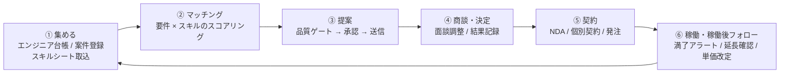

# CLAUDE.md — SES Platform

SES 事業者の営業・要員管理を、**① 人材と案件を集める → ② マッチング → ③ 提案 → ④ 商談・決定 → ⑤ 契約 → ⑥ 稼働・稼働後フォロー**のクローズドループとして一本化する BtoB SaaS である。Excel・メール・チャットに分散した営業活動を 1 つのワークスペースに集約し、自社エンジニアと取引先（他社）エンジニアを同じ土俵で扱いながら、**取引先ごとの情報境界を絶対に破らない**ことを最優先の制約とする。

このファイルは全エージェントの一次資料である。設計・実装のすべてはここを起点にする。

---

## 1. プロダクト概要

### 1.1 解決する課題

SES の営業は「案件情報」と「人材情報」を突き合わせ続ける仕事だが、その両方が Excel・メール・チャットツールに分散している。結果として次の構造で業務が形骸化する。

1. **情報が最新でない** — スキルシートは個人の PC とメール添付にあり、稼働状況は営業の頭の中にある。台帳を更新する動機が誰にもないため、検索しても当たらない。結局「あの人に聞く」に戻り、属人化が固定される。
2. **マッチングが記憶に依存する** — 案件の必須要件と人材のスキルを突き合わせるのが人手なので、母集団は「その営業が覚えている範囲」に縮む。取引先が増えるほど、見えていない候補が増える。
3. **提案の履歴が残らない** — 「誰をどの案件に、いつ、いくらで提案したか」がメールに散る。同一エンジニアを別経路で二重提案する、単価を取り違える、といった事故が起きても事前に検知できない。
4. **稼働後が放置される** — 契約満了の 1〜2 か月前に動き出せば延長交渉も後任提案もできるが、期日を管理する場所がないため、直前に発覚して稼働が途切れる。**ここが売上に直結するのに、最も仕組み化されていない。**
5. **情報境界の管理が人の注意力に依存する** — 取引先 A に、取引先 B が同じ案件へ誰を提案したかを漏らす。単価やエンド企業名を見せてはいけない相手に見せる。匿名化前のスキルシートを外部に送る。いずれも一度起きれば取引が切れる事故だが、防止策が「気をつける」しかない。

本プロダクトは 1〜4 を仕組みで解決し、5 を**設計で不可能にする**。

### 1.2 対象ユーザー

| 区分 | 説明 |
|---|---|
| テナント管理者（契約 SES 企業の管理部門） | 1 テナントに 1〜3 名。アカウント発行、取引先の招待、公開範囲ポリシー、契約・請求の管理。IT リテラシーは中程度。1 日 15〜30 分の利用 |
| 自社営業（契約 SES 企業の営業） | 1 テナントに 3〜30 名。**本プロダクトの主利用者**。案件登録、マッチング、提案、面談調整、稼働後フォロー。1 日 1〜3 時間で、その一部は客先移動中のスマートフォン操作 |
| 取引先企業の管理者（`PARTNER_ADMIN`） | 招待された取引先 1 社につき 1〜2 名。自社の営業アカウントと登録エンジニアを管理 |
| 取引先の営業（`PARTNER_SALES`） | 招待された取引先 1 社につき 1〜10 名。自社エンジニアの情報更新、公開された案件の閲覧、提案、チャット。**自社が持ち込んだ情報しか見えない** |
| 閲覧専用（`VIEWER`） | 参照のみ。承認・送信・ダウンロードの権限を持たない |
| 運営者（本サービスの提供者） | §10 参照。主平面とは別の認証・別の画面 |

### 1.3 中核となる業務ループ



**⑥ から ① への還流がこのプロダクトの中核である。** 稼働終了の見込みが立った時点でエンジニアが自動的に「待機予定」として ① に戻り、案件側も後任募集として ① に戻る。この還流を切ると、本プロダクトは単なる案件管理 Excel の置き換えになる。スコープが揺れたときは **⑥ → ① を守る**。

次に強い中核は **③ の品質ゲート**である。ゲートを外すと、提案は「メールを画面に置き換えただけ」になり、§1.1-5 の事故を防げなくなる。

### 1.4 設計対象の平面

| 平面 | 使う人 | 範囲 |
|---|---|---|
| **主平面**（テナント平面 `/`） | 契約 SES 企業の社員と、その企業が招待した取引先企業の担当者 | §1.3 の業務ループ。`tenant_id` スコープに閉じる。**テナント内にさらにパートナースコープの第二境界がある**（§3.1） |
| **管理平面**（運営者コンソール `/admin`） | 本サービスの運営者（提供者側スタッフ） | **§10 参照** |

---

## 2. 技術スタック（確定事項）

**この節は確定事項。`tech-selection` エージェントはこれを覆してはならない**（肉付けと未決定領域の補完のみ行う）。

| 領域 | 採用 |
|---|---|
| リポジトリ | pnpm workspaces のモノレポ |
| 言語 | TypeScript（`strict: true`） |
| フレームワーク | Next.js（App Router）+ Route Handlers |
| UI | Tailwind CSS + shadcn/ui |
| DB | PostgreSQL（**Row Level Security を有効化する**） |
| ORM | Prisma（クライアント拡張でテナントスコープを強制する） |
| 非同期ジョブ | BullMQ + Redis |
| 認証 | Auth.js（テナント利用者）。**運営者は別テーブル・別認証**（§10.5） |
| AI / LLM | Anthropic Claude API。既定モデルは `claude-sonnet-5`、定型処理は `claude-haiku-4-5-20251001`。**ロールごとに設定可能**（§12.3） |
| オブジェクトストレージ | S3 互換（スキルシート・契約書・添付） |
| メール | トランザクションメール送信 API（サービス選定は §9） |
| 課金 | Stripe（サブスクリプション + 従量） |
| ホスティング | Vercel（Web）+ コンテナ基盤（ワーカー） |
| エラー追跡 | Sentry |
| テスト | Vitest（ユニット/結合）+ Playwright（E2E） |
| バリデーション | Zod（API 境界・環境変数・LLM 構造化出力） |

### 2.1 リポジトリ構成

```
ses-platform/
  apps/
    web/            # Next.js。主平面 (/) と管理平面 (/admin)。UI と API 境界のみ
    worker/         # BullMQ ワーカー。ジョブの起動・再試行のみ。業務ロジックを持たない
  packages/
    domain/         # ドメイン型・状態機械・マッチングスコア。純粋関数のみ。I/O を持たない
    db/             # Prisma スキーマ / マイグレーション / RLS 定義 / withTenant アクセサ
    ai/             # LLM 呼び出しの唯一の経路。プロンプト版管理・利用量記録・PII マスキング
    connectors/     # 外部 API（メール / 電子署名 / ウイルススキャン / Stripe）の正規化ラッパ
    config/         # 環境変数の Zod スキーマ。APP_ENV による実装差し替え（DI）
    ui/             # 共有 UI コンポーネント
    i18n/           # ユーザー向け文言
  prompts/          # バージョン付きプロンプト。packages/ai からのみ読む
  scripts/          # 運用スクリプト（ワイヤーフレーム生成など）
  tests/e2e/        # Playwright
  docs/             # 設計ドキュメント（§8 の成果物）
```

**依存方向のルール**:

- `apps/*` → `packages/*` の一方向。`packages/*` から `apps/*` を参照しない。
- `packages/domain` は**何にも依存しない**。ここに DB・ネットワーク・現在時刻の取得を持ち込まない（テスト可能性と、マッチングスコアの決定性を守るため）。
- `packages/db` / `ai` / `connectors` は**相互に依存しない**。束ねるのは `apps/*` の層だけ。
- `apps/web` と `apps/worker` は業務ロジックを重複実装せず、`packages/domain` を共有する。

---

## 3. ハードルール

実装・設計・レビューのすべてでこれらを守る。違反はレビューで必ず NG とする。

### 3.1 データ分離・アクセス境界

本プロダクトには**二重の境界**がある。片方だけ守っても事故は防げない。

**第一境界: テナント分離**

- 分離の単位は **`Tenant`（契約する SES 企業）**。分離キーは `tenant_id`。
- DB アクセスは必ず `withTenant(ctx, ...)` 経由。**PostgreSQL RLS（`SET LOCAL app.tenant_id`）と Prisma クライアント拡張の二重防御**とする。片方が静かに無効化されても、もう片方が止める。
- `tenant_id` は**必ず認証コンテキスト (ctx) から取得**する。リクエスト入力（body / query / path）から受け取ってはならない。
- ESLint の `no-restricted-imports` で、`@ses/db` の生 `PrismaClient` をアプリコードから import することを禁止する。
- **この規律の射程は全業務テーブルである。** 射程外にできるのは `PlatformUser` / `Plan` / `Subscription` / `Skill`（グローバルなスキル辞書）のみ（理由: テナントに属さない運営データとマスタであるため）。**射程外にできるのはここだけ**であり、新たな例外を作ってはならない。

**第二境界: パートナースコープ**

テナント内には、契約 SES 企業（ホスト）と、その企業が招待した取引先企業（パートナー）が同居する。**同一テナント内であっても、パートナーは自社が持ち込んだ情報しか見えない。**

- パートナー所属ユーザーのクエリには、`tenant_id` に加えて `partner_company_id` のスコープを必ず適用する。
- 越境が許されるのは**次の 3 経路のみ**。これ以外の越境経路を作ってはならない。
  1. **案件の公開** — `ProjectVisibility` に列挙されたパートナーだけが、その `Project` を読む
  2. **提案** — パートナーが作成した `Proposal` と、それに添付された `EngineerSnapshot`（提案時点の凍結情報）をホストが読む。**パートナーのエンジニア台帳全体をホストが読むことはできない**
  3. **チャット** — `ThreadParticipant` に列挙された会社だけが、そのスレッドと添付を読む
- 🔴 **パートナー同士が相互に参照できる経路を 1 つも作らない。** 同一案件に複数社が提案していても、他社の提案の存在・件数・単価・エンジニア名を知れてはならない。SES の商流上、これが最大の事故である。
- **重複提案の検知結果はホストにのみ表示する。** 「このエンジニアは別経路でも提案されています」をパートナーに見せると、それ自体が他社情報の漏洩になる。

### 3.2 AI / 外部サービスのランタイム

- **Anthropic Claude API のみを使う**。他プロバイダの併用・切替は本プロダクトのスコープ外。
- アプリコードから SDK を直接 import しない。**必ず `packages/ai` のラッパ経由**で呼ぶ（レート制御・リトライ・利用量記録・プロンプト版管理・PII マスキングをここに集約するため）。
- LLM の構造化出力は **Zod スキーマ + 構造化出力（tool use）** を用いる。自由文を正規表現でパースしない。
- **全ての AI 呼び出しを `AiUsage` に記録する**（`tenant_id` / ロール識別子 / model / 用途 / 入出力トークン / 推定コスト / 対象エンティティ）。記録しない呼び出し経路を作らない。
- プロンプトはコード中にベタ書きせず `prompts/` にバージョン付きで置く。生成物には使用プロンプト版を保存し、後から再現できるようにする。
- 🔴 **スキルシートの原本を無加工で LLM に送らない。** 氏名・生年月日・連絡先・顔写真・現所属会社名は、送信前に `packages/ai` の入口でマスキングする。LLM に渡してよいのはスキル・経験内容・期間だけである（個人情報が外部 API に流れる経路を 1 つも残さないため）。
- 🔴 **単価とエンド企業名を LLM に渡さない。** 商流情報が生成物に混入し、そのまま外部共有される経路になるため。

### 3.3 承認・品質ゲート

- **テナント外へ共有されるもの**（提案、スキルシート、案件の公開、チャット添付）は**必ず `ReviewGate` を通す**。ゲートは 3 層:
  1. **PII 層** — 氏名・生年月日・連絡先・顔写真・現所属会社名が残っていないか
  2. **商流層** — 単価・エンド企業名・他社名が、その公開範囲で出してはならない相手に出ていないか
  3. **整合層** — 案件の必須要件との齟齬、重複提案、スキルシートと登録スキルの矛盾
- **`Proposal` は `APPROVED` を経ずに `SUBMITTED` に遷移してはならない。**
- 既定は**人間承認必須**。`autoApproveEnabled` が有効な場合に限り、**ゲート全層 PASS の場合のみ**承認を自動付与できる（承認者は `system` として記録し、監査ログに残す）。1 層でも FAIL したら全自動モードでも人間に差し戻す。
- **ゲートの FAIL を「無視して送信」できる導線を作らない。** 直せるのは元データだけである。

### 3.4 外部連携・冪等性

- **外部送信ジョブ（提案メール、面談調整メール、契約書送付、電子署名依頼）は冪等でなければならない**。`idempotency_key` を必ず持ち、外部 API 呼び出しの結果が確定した後にリトライしてはならない（**取引先への二重送信・誤送信が本プロダクト最大の事故**）。送信直前に状態を `SUBMITTING` へ CAS 更新し、多重実行を DB レベルで排除する。
- **レート制限とコスト上限をアプリ層で必ずガードする**。外部 API の 429 に頼らない。
  - メール: テナントあたり 1 日 500 通 / 1 分 30 通（既定値。`packages/config` で管理し、プランごとに上書き可能）
  - LLM: テナントあたり 1 日のコスト上限（USD）。到達したら AI 機能を停止し、UI に残量と停止理由を表示する
  - 電子署名: 1 契約につき 1 リクエスト。再送は人間の明示操作のみ
- **外部サービスのトークンは必ず暗号化して保存**（`TOKEN_ENCRYPTION_KEY`）。ログ・エラー・監査ログ・LLM プロンプトに絶対に出さない。
- 外部 API 応答は生のまま保存せず、`packages/connectors` で正規化した内部型に変換してから永続化する。サービス差異をドメイン層に漏らさない。
- 🔴 **アップロードファイルは、ウイルススキャンが `CLEAN` になるまで共有 URL を発行しない。** スキャン未完了・失敗のファイルを外部に渡す経路を作らない。

### 3.5 セキュリティ・データ全般

- シークレットをコードに書かない。`process.env` のみ。環境変数は `packages/config` の Zod スキーマで**起動時に検証**する。
- 監査ログ (`AuditLog`) に記録する: ログイン・ログアウト、**エンジニア詳細とスキルシートの閲覧・ダウンロード**、案件詳細の閲覧、作成・更新・削除、提案の送信、承認・却下、権限変更、公開範囲の変更、代理閲覧、運営者の全操作。
  - 🔴 **スキルシートの閲覧とダウンロードは必ず記録する。** 「誰の経歴を、誰が、いつ見たか」は SES では説明責任の対象であり、後から遡れないと取引先に説明できない。
- ユーザー向け文言は `packages/i18n` に集約する。コンポーネント内ハードコーディング禁止。
- **個人情報に保持期間を持たせる。** 稼働終了・提案終了から一定期間を過ぎたエンジニアの連絡先とスキルシート原本を削除できる仕組みを Phase 2 までに入れる（保持期間の値は §9 で確定させる）。
- **2 要素認証**: 運営者と、テナントの `OWNER` / `ADMIN` は必須。それ以外のロールは任意。

---

## 4. ドメインモデル

### 4.1 中核概念

| 概念 | 説明 |
|---|---|
| `Tenant` | 契約する SES 企業。分離の単位 |
| `User` | テナント平面のユーザーアカウント |
| `Membership` | ユーザーとテナントの所属関係。ロールを持つ |
| `PartnerCompany` | テナントが招待した取引先企業。パートナースコープの単位 |
| `Engineer` | エンジニア。自社所属またはパートナー所属 |
| `Skill` | スキル辞書のマスタ項目（グローバル） |
| `SkillAlias` | 表記ゆれの別名。テナント固有の別名も持つ |
| `EngineerSkill` | エンジニアとスキルの関連。経験年数・レベルを持つ |
| `SkillSheet` | スキルシートのファイルと版。最新版フラグを持つ |
| `SkillSheetExtraction` | スキルシートからの構造化抽出結果。生成ロールとプロンプト版を保持する |
| `Project` | 案件 |
| `ProjectRequirement` | 案件の要件。必須 / 尚可の別を持つ |
| `ProjectVisibility` | 案件の公開範囲。どのパートナーに見せるか |
| `MatchCandidate` | マッチング結果の候補。スコアと根拠を持つ |
| `Proposal` | 提案。案件 × エンジニア × 提案先 |
| `EngineerSnapshot` | 提案時点のエンジニア情報の凍結コピー |
| `ProposalEvent` | 提案の履歴（日時・担当者・メモ・添付） |
| `ReviewGate` | 品質ゲートの実行結果。層ごとの PASS / FAIL と指摘 |
| `ChatThread` | 案件単位または企業単位のスレッド |
| `ThreadParticipant` | スレッドの参加会社。越境読み取りの根拠 |
| `Message` | チャットメッセージと添付 |
| `Contract` | 契約（NDA / 基本契約 / 個別契約） |
| `ContractDocument` | 契約書ファイルと版、電子署名の状態 |
| `Order` | 発注書・請求 |
| `Assignment` | 稼働。契約満了日と延長の管理単位 |
| `ExtensionReview` | 延長確認。満了前に自動起票される |
| `Task` | ToDo（延長確認、面談調整、契約締結待ち） |
| `Notification` | アプリ内通知・メール通知 |
| `AiUsage` | AI 呼び出しの利用量と原価 |
| `AuditLog` | 監査ログ |

### 4.2 ステートマシン

中核エンティティは `Proposal`（提案）と `Assignment`（稼働）の 2 つである。

**`Proposal`**

```
DRAFT ──レビュー依頼──> GATE_RUNNING ─┬─ FAIL ─> GATE_FAILED ──修正──> DRAFT
                                      └─ PASS ─> APPROVAL_PENDING

APPROVAL_PENDING ──却下──> DRAFT
APPROVAL_PENDING ──承認（人間 / 全層 PASS のときのみ自動）──> APPROVED

APPROVED ──送信ジョブが CAS──> SUBMITTING ─┬─ 成功 ─> SUBMITTED
                                           └─ 失敗 ─> SUBMIT_FAILED ──人間の再実行──> APPROVED

SUBMITTED ──> INTERVIEW_SCHEDULED ──> INTERVIEWED ──> RESULT_PENDING
RESULT_PENDING ──> WON | LOST
SUBMITTED / INTERVIEW_SCHEDULED / INTERVIEWED / RESULT_PENDING ──辞退──> WITHDRAWN
WON ──> Assignment を生成
```

**`Assignment`**

```
SCHEDULED ──開始日到来──> ACTIVE
ACTIVE ──満了 60 日前に自動起票──> EXTENSION_REVIEW
EXTENSION_REVIEW ──延長合意（契約更新）──> ACTIVE
EXTENSION_REVIEW ──終了決定──> ENDING
ACTIVE ──緊急離任──> ENDING
ENDING ──満了日到来──> ENDED ──> Engineer が「待機予定」に戻り §1.3 の ① へ還流
```

🔴 **上図がこのステートマシンの全体である。** 状態を追加したくなった場合は勝手に足さず、人間に提起する（§8.6）。

- **失敗と保留を混同しない。** `GATE_FAILED`（送る前に自ら止めた）・`SUBMIT_FAILED`（送信自体が失敗した）・`LOST`（提案は届いたが見送られた）は**すべて別の状態**である。混ぜると成約率と障害率の両方の指標が汚れ、監視が誤検知する。
- **`SUBMITTING` は片道である。** 入ったら必ず `SUBMITTED` か `SUBMIT_FAILED` に確定させる。**自動リトライしてはならない**（二重送信事故になるため）。再送は人間の明示操作のみ。
- **`SUBMIT_FAILED` からの復帰は人間の操作に限る。**
- `WON` / `LOST` / `WITHDRAWN` は終端。`ENDED` も終端。
- 不正な遷移は `InvalidStateTransitionError`（HTTP 422）を返す。サイレントに無視しない。

---

## 5. フェーズ別ロードマップ

| Phase | 内容 | 成功条件 |
|---|---|---|
| **Phase 0** 基盤 | モノレポ、認証、テナント + RLS、パートナースコープ、ロール、監査ログ、空のダッシュボード | 2 テナント × 2 パートナーを seed した状態で、**URL 直打ち・API 直叩きのいずれでも他テナント / 他パートナーのデータが 1 件も取得できない**ことを自動テストで証明できる |
| **Phase 1** MVP | エンジニア管理（スキル手入力）、案件管理、複合検索、提案履歴、公開範囲、PII / 商流ゲート、承認フロー、スキルシートの格納と版管理 | 「案件登録 → パートナーへ公開 → パートナーが提案 → ゲート実行 → ホストが承認 → 送信 → 結果記録」を E2E で完遂できる。**ゲート FAIL の提案が送信できない**ことをテストで証明できる |
| **Phase 2** | マッチングスコア、AI スキルシート解析とスキル正規化、チャット、通知・タスク、満了アラートと延長確認、重複提案検知 | 満了 60 日前に `ExtensionReview` が自動起票され担当者に通知される。スキルシート取込で構造化スキルが辞書に正規化されて登録され、**マスキング前の個人情報が LLM に送られていない**ことをテストで証明できる |
| **Phase 3** | 契約テンプレートと差し込み、電子署名連携、発注・請求、KPI ダッシュボード（提案 → 面談 → 決定率） | 契約書の送付が冪等であること（二重実行しても外部 API 呼び出しが 1 回）をテストで証明できる。テナント別・案件別の決定率が画面で確認できる |
| **Phase 4** 拡張 | メール取り込み、面談メモのフォーマット化、タグ運用、外部 API 連携（会計 / 勤怠 / SFA） | — |

**外部依存はクリティカルパスに置かない。** 電子署名サービスの契約・審査、メール送信ドメインの認証（SPF/DKIM）、Stripe の審査はリードタイムが読めないため、**Phase 3 に置き、Phase 1 の完了条件にしない**。Phase 1 / 2 では `packages/connectors` のモック実装で開発を進める（§11）。

---

## 6. 対象外（やらないこと）

- 給与計算・勤怠管理（理由: 基幹領域であり法改正への追従コストが大きい。§1.3 のループに寄与しない）
- 反社チェック・与信審査（理由: 外部データベースとの契約と審査責任が発生し、判断を誤ったときの責任範囲が本プロダクトの射程を超える）
- エンジニア本人向けのアプリ・求人媒体化（理由: 対象ユーザーが §1.2 と異なり、必要な UI も規約も別物になる。営業ツールとしての焦点がぼやける）
- 複数 AI プロバイダの切替・自前モデルのホスティング（理由: §3.2 のとおり単一経路への集約が AI 層の統制の前提。切替可能性のために統制を緩めない）
- エンジニアの稼働工数・作業実績の管理（理由: 常駐先の管理システムと二重管理になり、入力されないまま形骸化する）

---

## 7. 主要 KPI

| 指標 | 目安 |
|---|---|
| **テナント越境の情報漏洩** | **0 件**（許容しない） |
| **パートナー間の相互参照**（他社の提案・エンジニア・単価の露出） | **0 件**（許容しない） |
| **PII 未マスキングでの外部共有・LLM 送信** | **0 件**（許容しない） |
| **提案メール・契約書の二重送信 / 誤送信** | **0 件**（許容しない） |
| 満了 60 日前アラートの取りこぼし | **0 件**（許容しない） |
| スキルシートの閲覧・DL で監査ログが欠落した件数 | **0 件**（許容しない） |
| エンジニア 1 万件 / 案件 1 万件での複合検索の応答 | 1 秒以内（p95） |
| マッチング候補の初回提示 | 3 秒以内（p95） |
| 提案 → 面談 → 決定の各転換率 | テナント別・案件別に画面で確認できること（Phase 3） |
| テナント別の AI 原価 | 粗利を割り込むテナントを運営コンソールで検知できること（§10.2） |

---

## 8. エージェント運用マニュアル

本プロジェクトは `.claude/agents/` の専用エージェント群で設計・実装を回す。**この節がその運用手順である。**

### 8.1 エージェント一覧

| # | エージェント | 役割 | 成果物 |
|---|---|---|---|
| 1 | `biz-requirements` | 業務要件を定義（なぜ・誰が・どんな価値） | `docs/01-business-requirements.md` |
| 2 | `functional-requirements` | 機能要件に落とす（何ができるか・受け入れ基準） | `docs/02-functional-requirements.md` |
| 3 | `tech-selection` | 技術選定と**外部 API の裏取り** | `docs/03-tech-selection.md` |
| 4 | `ui-design` | 画面設計（何の画面に何があるか） | `docs/04-ui-design.md` |
| 5 | `designer` | ワイヤーフレームのプロンプト作成＋**画像生成** | `docs/wireframes/{S-xxx\|A-xxx}-{slug}/prompt.md` + `*.png` |
| 6 | `program-design` | 実装設計（DB / API / ジョブ / 外部連携） | `docs/05-program-design.md` |
| 7 | `pm` | 開発計画とスプリント分解 / **完了確認** | `docs/dev-plan.md`, `docs/sprints/SP-NN-*.md` |
| — | `design-reviewer` | 設計ドキュメントのレビュー（read-only） | verdict のみ |
| — | `programmer` | 実装 | コード + ユニットテスト |
| — | `code-reviewer` | コードレビュー（read-only） | verdict のみ |
| — | `e2e-tester` | E2E テスト | `tests/e2e/*` |

**上流を読まずに下流を書かない。** 1 → 7 の順に依存する。

### 8.2 設計フェーズの進め方

各ドキュメントを「**作成 → レビュー → APPROVED まで反復**」で 1 本ずつ確定させ、次に進む。

```
1. 作成:   <エージェント名> エージェントで docs/0N を作成して
2. レビュー: /design-iterate <エージェント名>
3. APPROVED を確認してから次のドキュメントへ
```

`/design-iterate` は `design-reviewer` → 元エージェント修正 → 再レビューを **最大 5 回**繰り返す。5 回で収束しなければ ESCALATE して人間判断に委ねる。

実行順:

```
biz-requirements → functional-requirements → tech-selection
  → ui-design → designer → program-design → pm
```

`tech-selection` は WebSearch/WebFetch で外部 API を裏取りするため、他より時間がかかる。

#### ワイヤーフレームの生成（`designer` ステップ）

`designer` は `prompt.md` を書いたうえで、**画像生成 API を呼んで画像まで生成する**。手作業でのコピペは不要。

```bash
node scripts/generate-wireframes.mjs --dry-run          # 対象の確認
node scripts/generate-wireframes.mjs                    # 未生成の画像をすべて生成
node scripts/generate-wireframes.mjs --screen S-001     # 特定画面のみ
node scripts/generate-wireframes.mjs --force            # 既存画像も再生成
```

- API キーは**プロジェクト直下の `.env` / `.env.local`** から読む（`.env.example` 参照）。`.env` はコミットしない。
- モデル・品質は環境変数で上書きする。**スクリプトにモデル名をハードコードしない**。
- `prompt.md` はスクリプトが機械的にパースする。`## 共通プロンプト` は 1 ファイルに 1 つ、各画像は `## {ファイル名}.png プロンプト` セクションのコードブロックに書く（詳細は `.claude/agents/designer.md`）。
- **画像生成は 1 枚ごとに課金される**。`--force` での全画面再生成は理由を確認してから実行する。

### 8.3 実装フェーズの進め方

```
/iterate T-01-03          # タスク ID を渡す
/iterate <自然言語の指示>   # 任意の作業指示でもよい
```

`/iterate` は **programmer → code-reviewer → e2e-tester** を「APPROVED かつ PASS」まで **最大 5 回**反復する。

- `code-reviewer` が `REQUEST_CHANGES` → programmer に差し戻し（E2E までは進めない）
- `e2e-tester` が `BLOCKED` → programmer に差し戻し、**次周は必ずコードレビューも再実行**
- 5 回で通らなければ ESCALATE

**1 タスク = 1 回の `/iterate`。** 複数タスクをまとめて渡さない。

### 8.4 完了確認

スプリント/フェーズの区切りで `pm` を**完了確認モード**で起動する。プロンプト冒頭に `MODE: REVIEW` を書く。

```
MODE: REVIEW
TARGET: SP-01        # または「設計フェーズ全体」「Phase 1」
```

`## PHASE_COMPLETE` / `## PHASE_INCOMPLETE: N 件` のいずれかを返す。**1 件でも NG なら INCOMPLETE**。完了確認モードではドキュメントを書き換えない。

### 8.5 終端文字列の契約

ループは応答末尾の文字列で継続を判定する。**この文字列が無い応答は契約違反として停止**する。

| エージェント | 終端文字列 |
|---|---|
| `programmer` / `e2e-tester` | `## DONE` / `## BLOCKED: <理由>` |
| `code-reviewer` | `## APPROVED` / `## REQUEST_CHANGES` / `## ESCALATE: <理由>` |
| `design-reviewer` | `## APPROVED` / `## REQUEST_CHANGES` / `## ESCALATE: <理由>` |
| `pm` (完了確認) | `## PHASE_COMPLETE` / `## PHASE_INCOMPLETE: N 件` |

### 8.6 人間が判断すること

エージェントに委ねず**必ず人間が決める**:

- **`CLAUDE.md` 自体の改訂** — 全エージェントの一次資料であり、書き換えは承認事項
- **事業判断**（料金・スコープの取捨・優先順位）
- **外部 API の契約・課金プランの選択**
- **`ESCALATE` が返ったとき**の方針決定
- **本番環境に不可逆な影響を与える操作**

本プロダクト固有:

- **プロダクトの正式名称・ブランド**（§9-1）
- **電子署名サービスとメール送信基盤の選定**（§9-2 / §9-3）。契約と審査を伴うため
- **課金モデルと、AI 従量原価の転嫁方法**（§9-6）
- **個人情報の保持期間**（§9-8）。取引先との契約条件に依存する
- **マッチングスコアの重みの初期値**（§9-9）。事業上の優先順位の表明であり、技術判断ではない
- **§3.1 の越境 3 経路を増やすこと**。1 つでも増やすと情報境界の前提が変わる。エージェントに判断させない

### 8.7 仕様の追加・変更が発生したときの手順（必須）

**仕様の追加・変更が出たら、その場で上流ドキュメントを更新する。** 実装や下流ドキュメントに手をつける前に行う。

#### なぜ必須か

本プロジェクトの全エージェントは上流ドキュメントを唯一の入力として動く。**上流が古いまま下流を進めると、以降のすべてのエージェントが誤った前提で作業し、後から気づいたときには広範囲のやり直しになる。** 設計書が実態と乖離した時点で、このエージェント構成は機能しなくなる。

#### 手順

1. **変更がどの層の話かを見極める**

   | 変更の種類 | 起点となるドキュメント |
   |---|---|
   | プロダクト方針・ハードルール・技術スタック・環境構成 | `CLAUDE.md` |
   | 業務価値・業務フロー・ビジネスルール (`BR-xx`) | `docs/01` |
   | 機能・受け入れ基準・非機能要件 (`F-xxx` / `UC-xx`) | `docs/02` |
   | 技術選定・外部 API 仕様・コスト | `docs/03` |
   | 画面・UI 挙動 (`S-xxx` / `A-xxx`) | `docs/04` |
   | DB・API・ジョブ・モジュール設計 | `docs/05` |
   | スプリント・タスク | `docs/dev-plan.md` / `docs/sprints/` |

2. **起点となる層と、それより下流をすべて更新する**。上流だけ直して下流を放置しない。逆に、**下流だけ直して上流を放置するのは最も避けるべき**。
3. **影響する ID を洗い出す**（`F-xxx` / `S-xxx` / `A-xxx` / `BR-xx` / `UC-xx`）。**ID は削除せず欠番にする**（§8.8）。
4. 更新後、影響を受けたドキュメントに `/design-iterate <エージェント名>` をかけて整合性を再検証する。
5. すでに実装が進んでいる場合は、影響タスクを `docs/sprints/` に追加する。実装済みコードとの差分を放置しない。
6. `CLAUDE.md` 自体の改訂は**人間の承認事項**（§8.6）。エージェントに勝手に書き換えさせない。

#### やってはいけないこと

- **「後でまとめて更新する」** — 必ず漏れる。変更が決まった時点で反映する
- **チャットや口頭でだけ決めて文書化しない** — エージェントはチャット履歴を読まない。ドキュメントに書かれていない決定は存在しないのと同じ
- **下流ドキュメントやコードにだけ反映する** — 次にエージェントを回した瞬間に上流の古い記述で上書きされる

### 8.8 ID 体系

機能 `F-001`〜 / **主平面の画面 `S-001`〜** / **管理平面の画面 `A-001`〜** / ユースケース `UC-01`〜 / ビジネスルール `BR-01`〜 / スプリント `SP-01`〜 / タスク `T-01-01`〜。**削除せず欠番にして参照を安定させる**。

---

## 9. 未確定事項（要検証）

`tech-selection` エージェントが公式ドキュメントで裏取りし、`docs/03-tech-selection.md` に確定値を書く。決着したものは打ち消し線 + 決定日 + 決定内容を残す（`~~項目~~ — **決定済み（YYYY-MM-DD）**。…`）。消すと「なぜそう決めたか」が失われ、同じ議論が再発する。

1. **正式なプロダクト名・ブランド** — 現在は仮称「SES Platform」。UI 文言・ドメイン・請求書表記に波及するため、`ui-design` 着手前に確定させたい（事業判断: §8.6）
2. **電子署名サービスの選定**（クラウドサイン / DocuSign / GMO サイン等） — API の冪等性の担保方法、Webhook の再送仕様、料金体系、**テナントごとに送信元アカウントを分けられるか**を確認する。分けられない場合、契約書の送信元が運営者名義になり商流上の問題になる
3. **メール送信基盤の選定** — テナント独自ドメインでの送信（SPF / DKIM / DMARC）の可否、バウンス・苦情の Webhook、日次上限。**取引先へのメールが運営者ドメインから飛ぶ設計は避けたい**
4. **ウイルススキャンの実現手段** — ClamAV のセルフホストか、マネージドサービスか。**スキャン完了までアップロードファイルを共有できない**（§3.4）ため、スキャン所要時間が UX を左右する
5. **スキルシート解析の対象範囲と精度目標** — xlsx のレイアウトは事実上自由であり、PDF や画像スキャンまで含めるかで難易度が変わる。「抽出できなかった項目を人が埋める」前提の UI にするか、精度をどこまで求めるかを決める
6. **Stripe の課金モデル** — 席課金 / テナント課金 / 従量のどれか、あるいは併用か。**AI の従量原価をどう転嫁するか**（§10.2 の粗利可視化はこの設計に依存する）
7. **検索基盤** — PostgreSQL の全文検索 + `pg_trgm` で §7 の応答目標（エンジニア 1 万件で p95 1 秒）を満たせるか。満たせない場合の代替と、その導入フェーズ
8. **個人情報の保持期間と削除ポリシー** — 稼働終了・提案終了から何年で連絡先とスキルシート原本を削除するか。取引先との契約上の要求も併せて確認する（§3.5）
9. **マッチングスコアの初期重み** — 必須要件の一致、尚可の加点、経験年数、単価レンジ、稼働開始日、勤務地・リモート可否の重み付け。**運用しながら調整する前提で、重みを設定値として外出しできる形にする**
10. **チャットのリアルタイム性** — ポーリングで足りるか、WebSocket / SSE が要るか。Vercel でのワーカー分離構成と併せて判断する

---

## 10. 管理平面 / 運営者コンソール

本プロダクトは SES 企業に販売する SaaS であり、**主平面と同じ重みで管理平面を設計する**。ここを後回しにすると、運用できない製品ができあがる。

### 10.1 ロール階層

| スコープ | ロール | 権限 |
|---|---|---|
| Platform | `PLATFORM_OWNER` | 全権 |
| Platform | `PLATFORM_SUPPORT` | 監視・調査・サポート。**課金設定とテナント停止は不可** |
| Tenant | `OWNER` | 組織の全権。契約者・支払者 |
| Tenant | `ADMIN` | メンバー管理・取引先の招待・公開範囲ポリシー・設定変更 |
| Tenant | `SALES` | 案件・エンジニア・提案の作成と編集、承認、チャット |
| Tenant | `PARTNER_ADMIN` | 自社（パートナー）配下の営業アカウントとエンジニアの管理 |
| Tenant | `PARTNER_SALES` | 自社エンジニアの更新、公開された案件の閲覧、提案、チャット |
| Tenant | `VIEWER` | 閲覧のみ。**承認・送信・ダウンロードは一切不可** |

### 10.2 テナント別の原価と粗利の可視化

**管理平面の筆頭機能はこれである。** 本プロダクトは LLM の従量課金・メール送信・ストレージを原価として抱えたうえで月額課金を行うため、**使えば使うほど赤字になるテナントが構造的に発生しうる**。

- テナント × 月で、**売上（サブスクリプション + 従量）と原価（AI / メール / ストレージ / 電子署名）と粗利**を並べて表示する
- 原価は **§12 のロール別に分解できる**こと。「どのロールが原価を食っているか」が分からないと改善対象を特定できない
- **粗利率が閾値を割ったテナントを一覧の上位に出す**。閾値はプランごとに設定できる
- 受け入れ基準: **「使えば使うほど赤字になるテナントを、月次を待たずに検知できること」**

### 10.3 管理平面のドメインモデル

| 概念 | 説明 |
|---|---|
| `PlatformUser` | 運営者アカウント。テナントの `User` とは**別テーブル・別認証** |
| `Plan` | プラン定義（席数上限、AI 利用量クォータ、メール上限、機能フラグ） |
| `Subscription` | 契約状態 |
| `UsageCounter` | 期間ごとの消費量。クォータ判定とコスト上限ガードの根拠 |
| `ImpersonationSession` | 代理閲覧の記録（誰が・いつ・どの組織を・何の理由で・何分間） |

### 10.4 機能範囲

| # | 機能 | 概要 |
|---|---|---|
| 1 | テナント一覧・詳細 | 契約状態、席数、パートナー数、エンジニア数、案件数、最終アクティビティ。**異常なテナントを上位に出す** |
| 2 | 原価・粗利ダッシュボード | §10.2 |
| 3 | 利用量・クォータ管理 | AI コスト、メール通数、ストレージ、席数。上限到達と残量 |
| 4 | 契約管理 | プラン変更、トライアル、停止・再開、請求 |
| 5 | 運用監視 | 失敗ジョブ、`SUBMITTING` の滞留、`SUBMIT_FAILED` の未対応、ウイルススキャン失敗、電子署名の未着、ゲート FAIL 率の異常 |
| 6 | 監査ログ横断検索 | テナント横断。**PII はマスキングして表示する** |
| 7 | 代理閲覧（サポート） | §10.5 の制約下でのみ |
| 8 | お知らせ・機能フラグ | テナント単位の機能開放、メンテナンス告知 |

### 10.5 Hard rules（管理平面）

管理平面はデータ分離を越える唯一の経路であり、最も慎重に設計する。

- **運営者は別テーブル・別認証**（`PlatformUser`）。テナントの `User` に「運営者フラグ」を持たせる設計を採らない。権限昇格の事故経路になるため。
- **運営者コンソールは既定 read-only**。テナントの業務データ（エンジニア・案件・提案・チャット・契約）を運営者が書き換えられる経路を作らない。書き込みが許されるのは契約・クォータ・機能フラグ・お知らせに限る。
- **代理閲覧 (impersonation) は次をすべて満たす場合のみ**: ①理由の入力必須 ②時間制限付き ③**read-only** ④`ImpersonationSession` と `AuditLog` に記録 ⑤対象組織の管理者に通知。**代理状態での実行系操作（提案送信・承認・契約送付）は不可**。
- 分離のバイパスは**専用の DB ロール経由に限定**し、主平面のアプリ経路と物理的に分離する。汎用のエスケープハッチを作らない。
- **管理平面は別ルート (`/admin`) かつ別ミドルウェアで認可**する。
- **運営者にも見せないもの**: 外部サービスのアクセストークン平文、**スキルシートの原本と本文**、エンジニアの氏名・生年月日・連絡先、チャットの本文。運営者に必要なのは「件数・状態・エラー」であって「内容」ではない。
- 運営者の全操作（閲覧を含む）を `AuditLog` に記録する。

### 10.6 Phase 配置

| Phase | 管理平面のスコープ |
|---|---|
| **Phase 0** | `PlatformUser` の認証、テナント一覧、テナント作成。**`UsageCounter` のテーブルと計測フックだけは先に置く** |
| **Phase 1** | 利用量の可視化、監査ログ横断検索、運用監視の最小版。**AI・メール・ストレージの計測は Phase 1 から必ず行う**（後から遡って計測できないため） |
| **Phase 2** | 代理閲覧、機能フラグ、お知らせ |
| **Phase 3** | §10.2 の原価・粗利ダッシュボード、契約・請求管理（Stripe 連携） |

---

## 11. 環境構成

| 環境 | `APP_ENV` | 用途 | 外部 API |
|---|---|---|---|
| 開発 | `development` | ローカル開発・自動テスト | **すべてモック** |
| 営業デモ | `demo` | 営業デモ・トライアル体験 | **すべてモック**（合成データのみ） |
| ステージング | `staging` | リリース前検証 | 各サービスの sandbox |
| 本番 | `production` | 顧客の実運用 | 実 |

### 11.1 Hard rules（環境分離）

🔴 **最も避けたい事故は「本番以外の環境から、実在する取引先へメール・契約書・電子署名依頼が飛ぶこと」である。** デモ中の操作で実在企業に提案メールが届けば、取引はその場で終わる。**設計で物理的に不可能にする。**

- 外部連携の差し替えは **`APP_ENV` による起動時の 1 箇所（DI / ファクトリ）で行う**。リクエストごとの `if` 分岐にしない（分岐が増えると必ず漏れる）。
- 🔴 **`production` でモック実装が選ばれてはならない。** 「未設定ならモックにフォールバック」は、**成功したように見えて実際には送信されていない**という最悪の壊れ方を生む。`production` でモックが選択された場合は起動を失敗させる。
- 🔴 **`production` 以外では、送信系コネクタが実エンドポイントに到達できないこと**を、実装だけでなく**環境変数の検証（`packages/config`）でも担保する**。本番の API キーが非本番環境に設定されていたら起動を失敗させる。
- **本番の顧客データを他環境にコピーしない**。合成データとする。エンジニアの氏名・スキルシートを含むため、匿名化での持ち出しも認めない。
- **本番でないことを UI に常時表示**する。デモ環境では「デモ環境 — 送信は行われません」を最上部に固定表示する。

---

## 12. AI 運用ロール（ハーネス設計）

**プロダクトの内部を「専任のチームが動いている」構造として設計する。** §1.3 の各ステージは、それぞれ担当ロールを持つ仮想の組織として実装する。

### 12.1 なぜこの構造にするか

- **責務が分割され、各ロールのプロンプト・モデル・出力スキーマを独立に改善できる**。単一の巨大プロンプトにすると、どこを直せば何が良くなるかが分からなくなる
- **ロール別にモデルを使い分けられる**（解析＝高性能 / 定型生成＝低コスト）。これが AI 原価の最大の調整弁になる
- **ロール別に原価を計上できる**（§10.2）。改善対象を特定できる
- **顧客への説明が business のメンタルモデルに一致する**

### 12.2 ロール定義

| ロール | ステージ | 責務 | 主な成果物 |
|---|---|---|---|
| `sheet-parser` | ① | スキルシート（xlsx / docx / pdf）から、経歴・スキル・期間・業務内容を構造化抽出する | `SkillSheetExtraction` |
| `skill-normalizer` | ① | 抽出したスキル表記を `Skill` 辞書へ正規化する。辞書に無い語は `SkillAlias` の候補として起票する | `EngineerSkill` / `SkillAlias` 候補 |
| `match-explainer` | ② | 決定的に算出済みのスコアに対し、「なぜこの候補か」の根拠文を付す | `MatchCandidate.rationale` |
| `gate-inspector` | ③ | 外部共有前の PII 残存・商流情報の露出を検査する（§3.3 の第 1・2 層の実行） | `ReviewGate` の結果 |
| `proposal-drafter` | ③ | 提案メール・エンジニア紹介文のドラフトを生成する（**送信はしない**） | `Proposal.draftBody` |
| `renewal-advisor` | ⑥ | 満了前に、延長可否・単価改定の論点と根拠データを整理する | `ExtensionReview.summary` |

**人間はこのチームの承認者・意思決定者**である。ロールは**提案するだけ**で、最終決定権は持たない。

### 12.3 Hard rules（ハーネス）

- **ロールは自律エージェントではない**。入出力スキーマが定義されたパイプラインの工程である。ロールに「自分で何をするか決めさせる」設計を採らない（コストと事故が制御不能になるため）。
- 🔴 **マッチングの順位を LLM に決めさせない。** スコアは `packages/domain` の決定的な純粋関数で算出する。LLM の役割は**根拠文の生成と表記ゆれの吸収に限る**（同じ入力で順位が変わると営業判断の根拠にならず、後から監査もできないため）。
- **ロール間の受け渡しは構造化データ**で行う。自由文を次のロールに渡して解釈させない。
- **`gate-inspector` の拒否権を他ロールが迂回できない。**
- **各成果物に、生成したロール・使用プロンプト版・モデルを記録する。**
- **`AiUsage` にロール識別子を必ず含める**。§10.2 のロール別原価の分解はこれに依存する。
- **ロールごとにモデルを設定可能にする**。ハードコードしない。
- **ロールの実行単位はジョブ**。失敗・再試行・タイムアウトの単位もロール単位とする。
- **`sheet-parser` と `proposal-drafter` は §3.2 のマスキングを経た入力しか受け取らない。** マスキングを迂回する入力経路を作らない。

### 12.4 ロール別の承認モード

**各ロールの提案を「都度人間が承認する」か「自動承認して次工程へ進める」かを、ロール単位で選択できる。**

- **既定はすべて「都度承認」**。自動承認は明示的な opt-in でのみ有効になる。
- **`gate-inspector` に承認モードは存在しない。** 設定項目自体を作ってはならない（§3.3 のゲートを迂回する経路になるため）。
- **提案の送信の承認は本節の対象外**。§3.3 のハードルールのみが支配する。
- **承認モードの変更は監査ログに記録する。**
- **自動承認でも成果物は記録され、後から遡って確認・巻き戻しができる**こと。特に `skill-normalizer` による辞書正規化は、誤って正規化された場合に元の表記へ戻せること。

---

## 13. マルチデバイス対応

### 13.1 想定利用シーン

- **営業は 1 日の多くを客先と移動で過ごす。** 提案結果の連絡、面談日程の確定、延長確認への回答、チャットの返信は**移動中のスマートフォンで発生する**。これらをデスクトップ前提にすると、対応が半日〜1 日遅れ、SES の営業ではそれが失注に直結する。
- **承認も移動中に発生する。** 「パートナーからの提案をホストが承認して先方に送る」は時間勝負であり、承認だけデスクトップに縛ると §3.3 のゲートが「承認待ち滞留」を生む装置になってしまう。
- **一方、台帳の整備は社内デスクで行う。** エンジニア情報の一括更新、スキルシートの取込と版管理、案件の公開範囲設定は腰を据えた作業であり、無理にモバイル対応しない。

### 13.2 画面の 3 階層

| 階層 | 方針 | 対象（例） |
|---|---|---|
| **Tier 1: モバイル完結** | モバイルで**操作まで完結**できること。省略・デスクトップ誘導をしない | 提案の承認・却下、面談日程の確定、延長確認タスクへの回答、チャット、通知一覧、満了アラートの確認 |
| **Tier 2: モバイル閲覧可** | 閲覧と軽い操作は可能。重い編集はタブレット以上を推奨してよい | 案件詳細、エンジニア詳細、提案一覧・詳細、マッチング候補一覧、ダッシュボード |
| **Tier 3: デスクトップ主体** | モバイルでは劣化を許容するが、**破綻させない** | エンジニア台帳の一括編集、スキルシートの取込・版管理、案件の公開範囲設定、契約テンプレート編集、KPI ダッシュボード、運営コンソール全般 |

`ui-design` は全画面をこの 3 階層のいずれかに割り当てること。

### 13.3 Hard rules

- **狭い画面を理由に判断材料を隠さない。** 承認画面では、**ゲートの指摘・提案先・単価・エンジニアの要点**を見ずに承認できる導線を作らない。承認ゲートの実質的な形骸化にあたる。
- **Tier 3 の画面をモバイルで「非表示」にしない**。劣化はさせても遮断はしない。
- **一括操作をモバイルの既定にしない**。誤タップの影響が大きい。特に一括承認・一括送信はモバイルでは既定にしない。
- **タブレットを「小さいデスクトップ」として扱わない。**
- **スキルシートのダウンロードは、デバイスを問わず監査ログに記録する**（§3.5）。モバイルだけ記録が漏れる実装にしない。
- ブレークポイントは Tailwind CSS の既定に従う。独自定義しない。
- E2E は**モバイルビューポートでも承認フローを検証する**（`.claude/agents/e2e-tester.md` のシナリオ #14）。
