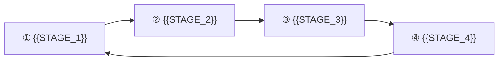

# CLAUDE.md — {{PRODUCT_NAME}}

> 📝 **記入ガイド**: 1〜2 文でプロダクトを説明する。「誰の」「どんな業務を」「どう変えるか」。
> ここは全エージェントが最初に読む文章であり、以降のすべての判断の前提になる。抽象的に書かないこと。
>
> 例: 「{{対象ユーザー}} の {{業務}} を、**{{ステージ1}} → {{ステージ2}} → {{ステージ3}}** のクローズドループとして自動化する。」

{{PRODUCT_ONE_PARAGRAPH}}

このファイルは全エージェントの一次資料である。設計・実装のすべてはここを起点にする。

---

## 0. このテンプレートの使い方（記入後に削除してよい）

### 記法

| 記法 | 意味 |
|---|---|
| `{{PLACEHOLDER}}` | 置換する。**未置換のまま残さない** |
| `> 📝 **記入ガイド**: …` | 記入の手引き。**記入後に削除する** |
| `<!-- OPTIONAL -->` が付いた章 | プロダクトに該当しなければ中身を消す |

### 🔴 章番号を詰めてはならない

`.claude/agents/*.md` は **本ファイルの章番号 (§1〜§13) を参照する契約**で書かれている。番号を詰めるとエージェントの参照が全部ずれる。

該当しない章は**章そのものを削除せず、見出しを残して 1 行だけ書く**:

```markdown
## 12. AI 運用ロール（ハーネス設計）

本プロジェクトでは該当なし。
```

エージェント側は「該当なしと書かれた章は N/A として扱う」よう指示されている。

### 埋める順番

1. **§1 / §2 / §4 / §5 / §6** — プロダクトの輪郭。ここが決まらないと下流が全部止まる
2. **§3 ハードルール** — 最重要。§3 の質がこのハーネス全体の精度を決める（次項）
3. **§7 / §9** — KPI と未確定事項
4. **§8** — 原則そのまま使う。エージェントを増減した場合のみ表を直す
5. **§10〜§13** — 該当するものだけ

`/kickoff` コマンドで対話的に埋めることもできる。

### 🔴 §3「ハードルール」の書き方（このテンプレートの中核）

ハードルールは**エージェントが機械的に照合できる形**で書く。ここが曖昧だと、`design-reviewer` と `code-reviewer` が判定できず、ハーネス全体が「それっぽいレビュー」に劣化する。

良いハードルールの条件:

1. **違反が一意に判定できる** — 「適切に検証する」ではなく「`withTenant(ctx, ...)` を経由しない DB アクセスを書かない」
2. **破れない担保まで書く** — 「気をつける」ではなく「ESLint の `no-restricted-imports` で禁止する」「DB の `UNIQUE` 制約で担保する」
3. **なぜそれが事故なのかを 1 行添える** — 理由が分かるとエージェントは境界事例を正しく判断できる。理由が無いと機械的に拡大解釈する
4. **例外を作るなら、射程を明示して「ここだけ」と書く** — 例外が 1 つあると、エージェントは類似ケースにも例外を作りたがる

書き方の実例は `recipes/` を参照。自プロダクトに該当するものをコピーして §3 に貼る。

| レシピ | 内容 |
|---|---|
| `recipes/multi-tenant-rls.md` | PostgreSQL RLS + ORM でのテナント分離。「静かに無効化される」経路の塞ぎ方 |
| `recipes/idempotent-external-writes.md` | 外部 API への書き込みの冪等性。二重実行事故の防ぎ方 |
| `recipes/ai-layer.md` | LLM 呼び出しの単一経路化・利用量記録・構造化出力・プロンプト版管理 |
| `recipes/approval-gate.md` | 生成物の品質ゲートと承認フローを迂回不能にする |
| `recipes/operator-console.md` | SaaS の運営者コンソール（テナント分離を越える唯一の経路） |
| `recipes/demo-environment.md` | 営業デモ環境を、本番事故なしで実演可能にする |

---

## 1. プロダクト概要

### 1.1 解決する課題

> 📝 **記入ガイド**: 現状の業務が「なぜ回らないか」を構造として書く。
> 「面倒だから」ではなく「どの工程が形骸化し、その結果どうなるか」。ここが弱いと `biz-requirements` が薄い文書を書く。

{{PROBLEM_STATEMENT}}

### 1.2 対象ユーザー

> 📝 **記入ガイド**: 区分ごとに、人数規模・スキル前提・1 日に割ける時間まで書く。
> 運営者（自社）を書く場合は §10 とセットで。

| 区分 | 説明 |
|---|---|
| {{USER_SEGMENT_1}} | {{DESCRIPTION}} |
| {{USER_SEGMENT_2}} | {{DESCRIPTION}} |

### 1.3 中核となる業務ループ

> 📝 **記入ガイド**: プロダクトが自動化・支援する業務を**ステージの連なり**として書く。
> ループなら「どこが還流するか」、一方向のフローなら「どこで完了か」を明示する。
> **ここが本プロダクトの背骨**であり、以降のすべてのドキュメントがこの分解を引き継ぐ。



> 📝 **記入ガイド**: 「この工程を切ると単なる {{凡庸な既存ツール}} になる」という中核工程があれば明記する。
> スコープが揺れたときに、何を守るべきかの判断基準になる。

{{CORE_LOOP_NOTE}}

### 1.4 設計対象の平面 <!-- OPTIONAL: 単一平面のプロダクトなら「本プロダクトは単一平面」と書いて表を消す -->

> 📝 **記入ガイド**: SaaS の場合、「顧客が使う平面」と「運営者が使う平面」は別物であり、**どちらか一方だけを設計すると必ず破綻する**。
> 該当する場合は下表を埋め、§10 も書く。

| 平面 | 使う人 | 範囲 |
|---|---|---|
| **{{PLANE_1}}** | {{WHO}} | §1.3 の業務ループ。{{SCOPE_KEY}} スコープに閉じる |
| **{{PLANE_2}}** | {{WHO}} | **§10 参照** |

---

## 2. 技術スタック（確定事項）

**この節は確定事項。`tech-selection` エージェントはこれを覆してはならない**（肉付けと未決定領域の補完のみ行う）。

> 📝 **記入ガイド**: **すでに決めたものだけ**を書く。迷っているものは書かず §9 に回す。
> ここに書いた瞬間、`tech-selection` は「なぜ採用したか」を後付けで正当化する側に回る。
> 逆に、決まっているのに書かないと、下流が勝手に別の技術を前提にして設計をやり直すことになる。

| 領域 | 採用 |
|---|---|
| リポジトリ | {{MONOREPO_OR_SINGLE}} |
| 言語 | {{LANGUAGE}} |
| フレームワーク | {{FRAMEWORK}} |
| UI | {{UI_STACK}} |
| DB | {{DATABASE}} |
| 非同期ジョブ | {{JOB_QUEUE}} |
| 認証 | {{AUTH}} |
| AI / LLM | {{AI_PROVIDER}} |
| オブジェクトストレージ | {{STORAGE}} |
| メール | {{EMAIL}} |
| 課金 | {{BILLING}} |
| ホスティング | {{HOSTING}} |
| エラー追跡 | {{ERROR_TRACKING}} |
| テスト | {{UNIT_TEST_RUNNER}}（ユニット/結合）+ {{E2E_TOOL}}（E2E） |
| バリデーション | {{VALIDATION_LIB}}（API 境界・環境変数・LLM 構造化出力） |

### 2.1 リポジトリ構成

> 📝 **記入ガイド**: ディレクトリと**それぞれの責務**を書く。責務を書かないと `programmer` が置き場所を毎回迷う。
> 依存方向のルール（「A は B に依存してよいが逆は不可」）があればここに書く。

```
{{DIRECTORY_TREE}}
```

---

## 3. ハードルール

実装・設計・レビューのすべてでこれらを守る。違反はレビューで必ず NG とする。

> 📝 **記入ガイド**: §0 の「ハードルールの書き方」を読んでから埋める。
> 以下のカテゴリは**多くのプロダクトで効く**ので、該当するものを残し、しないものはカテゴリごと削除する。
> `recipes/` に各カテゴリの実例がある。

### 3.1 データ分離・アクセス境界 <!-- OPTIONAL -->

> 📝 マルチテナント / 権限境界がある場合。詳細は `recipes/multi-tenant-rls.md`

- 分離の単位は **{{TENANT_ENTITY}}**。分離キーは `{{TENANT_KEY}}`。
- DB アクセスは必ず `{{TENANT_SCOPED_ACCESSOR}}` 経由。{{防御手段1}} と {{防御手段2}} の**二重防御**。
- `{{TENANT_KEY}}` は**必ず認証コンテキスト (ctx) から取得**する。リクエスト入力から受け取ってはならない。
- **この規律の射程は {{射程}} である。{{射程外のもの}} は含まない**（理由: {{理由}}）。**射程外にできるのはここだけ**であり、新たな例外を作ってはならない。

### 3.2 AI / 外部サービスのランタイム <!-- OPTIONAL -->

> 📝 LLM や外部 API を使う場合。詳細は `recipes/ai-layer.md`

- **{{AI_PROVIDER}} のみを使う**。他プロバイダの併用・切替は本プロダクトのスコープ外。
- アプリコードから SDK を直接 import しない。**必ず {{AI_WRAPPER_PACKAGE}} のラッパ経由**で呼ぶ（レート制御・リトライ・利用量記録・プロンプト版管理をここに集約するため）。
- LLM の構造化出力は **{{VALIDATION_LIB}} スキーマ + Structured Outputs** を用いる。自由文を正規表現でパースしない。
- **全ての AI 呼び出しを `{{USAGE_TABLE}}` に記録する**（{{TENANT_KEY}} / model / 用途 / 入出力トークン / 推定コスト / 対象エンティティ）。記録しない呼び出し経路を作らない。
- プロンプトはコード中にベタ書きせず `{{PROMPT_DIR}}` にバージョン付きで置く。生成物には使用プロンプト版を保存し、後から再現できるようにする。

### 3.3 承認・品質ゲート <!-- OPTIONAL -->

> 📝 生成物やユーザー投入物に審査・承認が要る場合。詳細は `recipes/approval-gate.md`

- {{対象}} は**必ず {{GATE_ENTITY}} を通す**。ゲートは {{層数}} 層: {{層の列挙}}。
- **`{{ENTITY}}` は `{{APPROVED_STATE}}` を経ずに `{{EXECUTING_STATE}}` に遷移してはならない**。
- 既定は**人間承認必須**。{{自動化フラグ}} が有効な場合に限り、**ゲート全層 PASS の場合のみ**承認を自動付与できる（承認者は `system` として記録し、監査ログに残す）。1 層でも FAIL したら全自動モードでも人間に差し戻す。

### 3.4 外部連携・冪等性 <!-- OPTIONAL -->

> 📝 外部システムへ「取り消せない書き込み」をする場合。詳細は `recipes/idempotent-external-writes.md`

- **{{外部書き込みジョブ}} は冪等でなければならない**。`idempotency_key` を必ず持ち、外部 API 呼び出しの結果が確定した後にリトライしてはならない（{{二重実行事故}} は本プロダクト最大の事故）。送信直前に状態を `{{EXECUTING_STATE}}` へ CAS 更新し、多重実行を DB レベルで排除する。
- **レート制限とコスト上限をアプリ層で必ずガードする**。外部 API の 429 に頼らない。
  - {{外部サービス}}: {{具体的な上限値と単位}}
- **外部サービスの規約を設計に織り込む**。規約に反する UI をデフォルトにしない。
- **外部サービスのトークンは必ず暗号化して保存**（`{{TOKEN_ENCRYPTION_KEY_ENV}}`）。ログ・エラー・監査ログ・LLM プロンプトに絶対に出さない。
- 外部 API 応答は生のまま保存せず、{{CONNECTOR_PACKAGE}} で正規化した内部型に変換してから永続化する。サービス差異をドメイン層に漏らさない。

### 3.5 セキュリティ・データ全般

- シークレットをコードに書かない。`process.env` のみ。環境変数は {{CONFIG_PACKAGE}} の {{VALIDATION_LIB}} スキーマで起動時に検証する。
- 監査ログ (`AuditLog`) に記録する: {{記録対象の列挙}}。
- ユーザー向け文言は {{I18N_FILE}} に集約する。コンポーネント内ハードコーディング禁止。
- {{その他のプロダクト固有ルール}}

---

## 4. ドメインモデル

### 4.1 中核概念

> 📝 **記入ガイド**: **名前と 1 行説明だけ**書く。属性やカラムは書かない（それは `docs/02` と `docs/05` の領分）。
> ここに無い概念を下流が勝手に足すことを禁じるのが、この表の役割。

| 概念 | 説明 |
|---|---|
| `{{ENTITY_1}}` | {{DESCRIPTION}} |
| `{{ENTITY_2}}` | {{DESCRIPTION}} |
| `AuditLog` | 監査ログ |

### 4.2 ステートマシン <!-- OPTIONAL -->

> 📝 **記入ガイド**: 状態を持つ中核エンティティがあれば、**遷移の全体**をここで確定させる。
> 🔴 **「上図がこのステートマシンの全体である」と明記すること。** これを書かないと、下流ドキュメントが必要に応じて遷移を勝手に足し、
> 状態の意味が発散する。足したくなったら人間に提起させる（§8.6）。

```
{{STATE_MACHINE_ASCII_OR_MERMAID}}
```

> 📝 **記入ガイド**: 状態の定義で特に効くのは以下。該当するものを書く。
> - **失敗と保留を混同させない** — 「外部要求の前に止まった」状態と「外部要求の結果失敗した」状態は別物にする。混ぜると失敗率の指標が汚れ、監視が誤検知する
> - **片道の遷移を明示する** — 「ここに入ったら必ずどちらかに確定させる」
> - **人間の操作に限る遷移を明示する** — 自動リトライを禁じる箇所
> - **不正な遷移のエラー型** — 例: `InvalidStateTransitionError` (HTTP 422)

{{STATE_MACHINE_RULES}}

---

## 5. フェーズ別ロードマップ

> 📝 **記入ガイド**: **成功条件をテスト可能な文で書く**。「基盤ができている」ではなく「空のダッシュボードにログインでき、分離が効いていることをテストで証明できる」。
> `pm` の完了確認モードはこの成功条件を判定基準に使う。曖昧だと判定できない。

| Phase | 内容 | 成功条件 |
|---|---|---|
| **Phase 0** 基盤 | {{SCOPE}} | {{TESTABLE_SUCCESS_CONDITION}} |
| **Phase 1** MVP | {{SCOPE}} | {{TESTABLE_SUCCESS_CONDITION}} |
| **Phase 2** | {{SCOPE}} | {{TESTABLE_SUCCESS_CONDITION}} |
| **Phase 3** | {{SCOPE}} | {{TESTABLE_SUCCESS_CONDITION}} |
| **Phase 4** 拡張 | {{SCOPE}} | — |

> 📝 **記入ガイド**: **自分でコントロールできない外部依存**（審査・契約・アカウント開設）があれば、
> それを Phase 1 のクリティカルパスに置かない旨をここに書く。`pm` がリードタイムを計画に織り込む根拠になる。

{{EXTERNAL_DEPENDENCY_NOTE}}

---

## 6. 対象外（やらないこと）

> 📝 **記入ガイド**: **理由を必ず添える**。理由の無い「やらない」は、下流エージェントが「良かれと思って」実装してくる。

- {{OUT_OF_SCOPE_1}}（理由: {{REASON}}）
- {{OUT_OF_SCOPE_2}}（理由: {{REASON}}）

---

## 7. 主要 KPI

> 📝 **記入ガイド**: **「0 件」「N% 以上」のように判定可能な形**で書く。
> 特に「絶対に起こしてはならない事故」があれば `0 件（許容しない）` と書く。この 1 行が `code-reviewer` の厳しさを決める。

| 指標 | 目安 |
|---|---|
| {{KPI_1}} | {{TARGET}} |
| {{事故指標}} | **0 件**（許容しない） |

---

## 8. エージェント運用マニュアル

本プロジェクトは `.claude/agents/` の専用エージェント群で設計・実装を回す。**この節がその運用手順である。**

> 📝 この章は原則そのまま使う。エージェントを増減した場合のみ §8.1 の表を直す。

### 8.1 エージェント一覧

| # | エージェント | 役割 | 成果物 |
|---|---|---|---|
| 1 | `biz-requirements` | 業務要件を定義（なぜ・誰が・どんな価値） | `docs/01-business-requirements.md` |
| 2 | `functional-requirements` | 機能要件に落とす（何ができるか・受け入れ基準） | `docs/02-functional-requirements.md` |
| 3 | `tech-selection` | 技術選定と**外部 API の裏取り** | `docs/03-tech-selection.md` |
| 4 | `ui-design` | 画面設計（何の画面に何があるか） | `docs/04-ui-design.md` |
| 5 | `designer` | ワイヤーフレームのプロンプト作成＋**画像生成** | `docs/wireframes/{S-xxx\|A-xxx}-{slug}/prompt.md` + `*.png` |
| 6 | `program-design` | 実装設計（DB / API / ジョブ / 外部連携） | `docs/05-program-design.md` |
| 7 | `pm` | 開発計画とスプリント分解 / **完了確認** | `docs/dev-plan.md`, `docs/sprints/SP-NN-*.md` |
| — | `design-reviewer` | 設計ドキュメントのレビュー（read-only） | verdict のみ |
| — | `programmer` | 実装 | コード + ユニットテスト |
| — | `code-reviewer` | コードレビュー（read-only） | verdict のみ |
| — | `e2e-tester` | E2E テスト | `tests/e2e/*` |

**上流を読まずに下流を書かない。** 1 → 7 の順に依存する。

### 8.2 設計フェーズの進め方

各ドキュメントを「**作成 → レビュー → APPROVED まで反復**」で 1 本ずつ確定させ、次に進む。

```
1. 作成:   <エージェント名> エージェントで docs/0N を作成して
2. レビュー: /design-iterate <エージェント名>
3. APPROVED を確認してから次のドキュメントへ
```

`/design-iterate` は `design-reviewer` → 元エージェント修正 → 再レビューを **最大 5 回**繰り返す。5 回で収束しなければ ESCALATE して人間判断に委ねる。

実行順:

```
biz-requirements → functional-requirements → tech-selection
  → ui-design → designer → program-design → pm
```

`tech-selection` は WebSearch/WebFetch で外部 API を裏取りするため、他より時間がかかる。

#### ワイヤーフレームの生成（`designer` ステップ）

`designer` は `prompt.md` を書いたうえで、**画像生成 API を呼んで画像まで生成する**。手作業でのコピペは不要。

```bash
node scripts/generate-wireframes.mjs --dry-run          # 対象の確認
node scripts/generate-wireframes.mjs                    # 未生成の画像をすべて生成
node scripts/generate-wireframes.mjs --screen S-001     # 特定画面のみ
node scripts/generate-wireframes.mjs --force            # 既存画像も再生成
```

- API キーは**プロジェクト直下の `.env` / `.env.local`** から読む（`.env.example` 参照）。`.env` はコミットしない。
- モデル・品質は環境変数で上書きする。**スクリプトにモデル名をハードコードしない**。
- `prompt.md` はスクリプトが機械的にパースする。`## 共通プロンプト` は 1 ファイルに 1 つ、各画像は `## {ファイル名}.png プロンプト` セクションのコードブロックに書く（詳細は `.claude/agents/designer.md`）。
- **画像生成は 1 枚ごとに課金される**。`--force` での全画面再生成は理由を確認してから実行する。

### 8.3 実装フェーズの進め方

```
/iterate T-01-03          # タスク ID を渡す
/iterate <自然言語の指示>   # 任意の作業指示でもよい
```

`/iterate` は **programmer → code-reviewer → e2e-tester** を「APPROVED かつ PASS」まで **最大 5 回**反復する。

- `code-reviewer` が `REQUEST_CHANGES` → programmer に差し戻し（E2E までは進めない）
- `e2e-tester` が `BLOCKED` → programmer に差し戻し、**次周は必ずコードレビューも再実行**
- 5 回で通らなければ ESCALATE

**1 タスク = 1 回の `/iterate`。** 複数タスクをまとめて渡さない。

### 8.4 完了確認

スプリント/フェーズの区切りで `pm` を**完了確認モード**で起動する。プロンプト冒頭に `MODE: REVIEW` を書く。

```
MODE: REVIEW
TARGET: SP-01        # または「設計フェーズ全体」「Phase 1」
```

`## PHASE_COMPLETE` / `## PHASE_INCOMPLETE: N 件` のいずれかを返す。**1 件でも NG なら INCOMPLETE**。完了確認モードではドキュメントを書き換えない。

### 8.5 終端文字列の契約

ループは応答末尾の文字列で継続を判定する。**この文字列が無い応答は契約違反として停止**する。

| エージェント | 終端文字列 |
|---|---|
| `programmer` / `e2e-tester` | `## DONE` / `## BLOCKED: <理由>` |
| `code-reviewer` | `## APPROVED` / `## REQUEST_CHANGES` / `## ESCALATE: <理由>` |
| `design-reviewer` | `## APPROVED` / `## REQUEST_CHANGES` / `## ESCALATE: <理由>` |
| `pm` (完了確認) | `## PHASE_COMPLETE` / `## PHASE_INCOMPLETE: N 件` |

### 8.6 人間が判断すること

エージェントに委ねず**必ず人間が決める**:

- **`CLAUDE.md` 自体の改訂** — 全エージェントの一次資料であり、書き換えは承認事項
- **事業判断**（料金・スコープの取捨・優先順位）
- **外部 API の契約・課金プランの選択**
- **`ESCALATE` が返ったとき**の方針決定
- **本番環境に不可逆な影響を与える操作**

> 📝 プロダクト固有の「人間が決めること」があれば追記する。

### 8.7 仕様の追加・変更が発生したときの手順（必須）

**仕様の追加・変更が出たら、その場で上流ドキュメントを更新する。** 実装や下流ドキュメントに手をつける前に行う。

#### なぜ必須か

本プロジェクトの全エージェントは上流ドキュメントを唯一の入力として動く。**上流が古いまま下流を進めると、以降のすべてのエージェントが誤った前提で作業し、後から気づいたときには広範囲のやり直しになる。** 設計書が実態と乖離した時点で、このエージェント構成は機能しなくなる。

#### 手順

1. **変更がどの層の話かを見極める**

   | 変更の種類 | 起点となるドキュメント |
   |---|---|
   | プロダクト方針・ハードルール・技術スタック・環境構成 | `CLAUDE.md` |
   | 業務価値・業務フロー・ビジネスルール (`BR-xx`) | `docs/01` |
   | 機能・受け入れ基準・非機能要件 (`F-xxx` / `UC-xx`) | `docs/02` |
   | 技術選定・外部 API 仕様・コスト | `docs/03` |
   | 画面・UI 挙動 (`S-xxx` / `A-xxx`) | `docs/04` |
   | DB・API・ジョブ・モジュール設計 | `docs/05` |
   | スプリント・タスク | `docs/dev-plan.md` / `docs/sprints/` |

2. **起点となる層と、それより下流をすべて更新する**。上流だけ直して下流を放置しない。逆に、**下流だけ直して上流を放置するのは最も避けるべき**。
3. **影響する ID を洗い出す**（`F-xxx` / `S-xxx` / `A-xxx` / `BR-xx` / `UC-xx`）。**ID は削除せず欠番にする**（§8.8）。
4. 更新後、影響を受けたドキュメントに `/design-iterate <エージェント名>` をかけて整合性を再検証する。
5. すでに実装が進んでいる場合は、影響タスクを `docs/sprints/` に追加する。実装済みコードとの差分を放置しない。
6. `CLAUDE.md` 自体の改訂は**人間の承認事項**（§8.6）。エージェントに勝手に書き換えさせない。

#### やってはいけないこと

- **「後でまとめて更新する」** — 必ず漏れる。変更が決まった時点で反映する
- **チャットや口頭でだけ決めて文書化しない** — エージェントはチャット履歴を読まない。ドキュメントに書かれていない決定は存在しないのと同じ
- **下流ドキュメントやコードにだけ反映する** — 次にエージェントを回した瞬間に上流の古い記述で上書きされる

### 8.8 ID 体系

機能 `F-001`〜 / **主平面の画面 `S-001`〜** / **管理平面の画面 `A-001`〜** / ユースケース `UC-01`〜 / ビジネスルール `BR-01`〜 / スプリント `SP-01`〜 / タスク `T-01-01`〜。**削除せず欠番にして参照を安定させる**。

---

## 9. 未確定事項（要検証）

> 📝 **記入ガイド**: 確度が低いものをここに列挙する。`tech-selection` が**公式ドキュメントで裏取りし** `docs/03` に確定値を書く。
> **推測で §2 に書くより、正直に §9 に置くほうが遥かに安全**。§2 に書いた数値は下流が確定値として扱う。
>
> 決着したものは打ち消し線 + 決定日 + 決定内容を残す（`~~項目~~ — **決定済み（YYYY-MM-DD）**。…`）。
> 消すと「なぜそう決めたか」が失われ、同じ議論が再発する。

1. **{{UNCERTAIN_1}}** — {{何を確認すべきか / なぜ重要か}}
2. **{{UNCERTAIN_2}}** — {{…}}

---

## 10. 管理平面 / 運営者コンソール <!-- OPTIONAL -->

> 📝 **記入ガイド**: SaaS なら**必ず書く**。テナント平面と同じ重みで設計しないと、運用できない製品ができあがる。
> 該当しなければ「本プロジェクトでは該当なし。」の 1 行に置き換える（**章は消さない**。§0 参照）。
> 詳細な雛形は `recipes/operator-console.md`。

### 10.1 ロール階層

| スコープ | ロール | 権限 |
|---|---|---|
| Platform | `PLATFORM_OWNER` | 全権 |
| Platform | `PLATFORM_SUPPORT` | 監視・調査・サポート。**課金設定とテナント停止は不可** |
| {{TENANT_ENTITY}} | `OWNER` | 組織の全権。契約者・支払者 |
| {{TENANT_ENTITY}} | `ADMIN` | メンバー管理・設定変更 |
| {{TENANT_ENTITY}} | `EDITOR` | 業務データの作成・編集・承認 |
| {{TENANT_ENTITY}} | `VIEWER` | 閲覧のみ。**承認・実行の操作は一切不可** |

### 10.2 {{運営平面の筆頭機能}}

> 📝 **記入ガイド**: 運営平面で**これが無いと事業が回らない**という機能を 1 つ特定して書く。
> 従量課金の外部 API を原価として再販する構造なら、**テナント別の原価と粗利の可視化**が該当することが多い。
> 「使えば使うほど赤字になるテナントを検知できること」を受け入れ基準にする。

{{OPERATOR_KEY_FEATURE}}

### 10.3 管理平面のドメインモデル

| 概念 | 説明 |
|---|---|
| `PlatformUser` | 運営者アカウント。テナントの `User` とは**別テーブル・別認証** |
| `Plan` | プラン定義 |
| `Subscription` | 契約状態 |
| `UsageCounter` | 期間ごとの消費量。クォータ判定とコスト上限ガードの根拠 |
| `ImpersonationSession` | 代理閲覧の記録（誰が・いつ・どの組織を・何の理由で・何分間） |

### 10.4 機能範囲

| # | 機能 | 概要 |
|---|---|---|
| 1 | テナント一覧・詳細 | {{…}} |
| 2 | {{筆頭機能}} | §10.2 |
| 3 | 利用量・クォータ管理 | {{…}} |
| 4 | 契約管理 | {{…}} |
| 5 | 運用監視 | 失敗ジョブ、滞留、異常検知 |
| 6 | 監査ログ横断検索 | PII はマスキング |
| 7 | 代理閲覧（サポート） | §10.5 の制約下でのみ |
| 8 | お知らせ・機能フラグ | {{…}} |

### 10.5 Hard rules（管理平面）

管理平面はデータ分離を越える唯一の経路であり、最も慎重に設計する。

- **運営者は別テーブル・別認証**（`PlatformUser`）。テナントの `User` に「運営者フラグ」を持たせる設計を採らない。権限昇格の事故経路になるため。
- **運営者コンソールは既定 read-only**。テナントの業務データを運営者が書き換えられる経路を作らない。書き込みが許されるのは契約・クォータ・機能フラグ・お知らせに限る。
- **代理閲覧 (impersonation) は次をすべて満たす場合のみ**: ①理由の入力必須 ②時間制限付き ③**read-only** ④`ImpersonationSession` と `AuditLog` に記録 ⑤対象組織の管理者に通知。**代理状態での実行系操作は不可**。
- **分離のバイパスは専用の DB ロール経由に限定**し、テナント平面のアプリ経路と物理的に分離する。汎用のエスケープハッチを作らない。
- **管理平面は別ルート (`/admin`) かつ別ミドルウェアで認可**する。
- **運営者にも見せないもの**: 外部サービスのアクセストークン平文、顧客のエンドユーザー個人情報。
- 運営者の全操作（閲覧を含む）を `AuditLog` に記録する。

### 10.6 Phase 配置

| Phase | 管理平面のスコープ |
|---|---|
| **Phase 0** | {{…}} |
| **Phase 1** | {{…}}。**利用量の計測だけは Phase 1 から必ず行う**（後から遡って計測できないため） |
| **Phase 2** | {{…}} |

---

## 11. 環境構成 <!-- OPTIONAL -->

> 📝 **記入ガイド**: 「営業デモ環境」「ステージング」など本番以外の環境が要るなら書く。
> 詳細な雛形は `recipes/demo-environment.md`。該当しなければ「本番と開発のみ。」の 1 行に置き換える。

| 環境 | `APP_ENV` | 用途 | 外部 API |
|---|---|---|---|
| 開発 | `development` | ローカル開発・自動テスト | **モック** |
| {{追加環境}} | `{{value}}` | {{用途}} | {{方針}} |
| 本番 | `production` | 顧客の実運用 | 実 |

### 11.1 Hard rules（環境分離）

> 📝 **記入ガイド**: 🔴 **「守るべき危険」を 1 行で特定してから**ルールを書く。危険の輪郭がぼやけると、
> 統制が粗すぎて機能を殺すか、細かすぎて漏れるかのどちらかになる。

- 🔴 {{最も避けたい事故}}。**設計で物理的に不可能にする。**
- 外部連携の差し替えは **`APP_ENV` による起動時の 1 箇所（DI / ファクトリ）で行う**。リクエストごとの `if` 分岐にしない（分岐が増えると必ず漏れる）。
- 🔴 **`production` でモック実装が選ばれてはならない**。「未設定ならモックにフォールバック」は、**成功したように見えて実際には起きていない**という最悪の壊れ方を生む。
- **本番の顧客データを他環境にコピーしない**。合成データとする。
- **本番でないことを UI に常時表示**する。

---

## 12. AI 運用ロール（ハーネス設計） <!-- OPTIONAL -->

> 📝 **記入ガイド**: プロダクト内部で LLM に複数の役割を担わせる場合に書く。該当しなければ「本プロジェクトでは該当なし。」に置き換える。
> 詳細は `recipes/ai-layer.md`。

**プロダクトの内部を「専任のチームが動いている」構造として設計する。** 業務ループの各ステージは、それぞれ担当ロールを持つ仮想の組織として実装する。

### 12.1 なぜこの構造にするか

- **責務が分割され、各ロールのプロンプト・モデル・出力スキーマを独立に改善できる**。単一の巨大プロンプトにすると、どこを直せば何が良くなるかが分からなくなる
- **ロール別にモデルを使い分けられる**（分析＝高性能 / 定型生成＝低コスト）。これが AI 原価の最大の調整弁になる
- **ロール別に原価を計上できる**。改善対象を特定できる
- **顧客への説明が business のメンタルモデルに一致する**

### 12.2 ロール定義

| ロール | ステージ | 責務 | 主な成果物 |
|---|---|---|---|
| {{ROLE_1}} | ① | {{…}} | `{{ENTITY}}` |
| {{ROLE_2}} | ② | {{…}} | `{{ENTITY}}` |

**人間はこのチームの承認者・意思決定者**である。ロールは**提案するだけ**で、最終決定権は持たない。

### 12.3 Hard rules（ハーネス）

- **ロールは自律エージェントではない**。入出力スキーマが定義されたパイプラインの工程である。ロールに「自分で何をするか決めさせる」設計を採らない（コストと事故が制御不能になるため）。
- **ロール間の受け渡しは構造化データ**で行う。自由文を次のロールに渡して解釈させない。
- **品質ゲート担当の拒否権を他ロールが迂回できない**。
- **各成果物に、生成したロール・使用プロンプト版・モデルを記録する**。
- **利用量記録にロール識別子を必ず含める**。ロール別原価の分解はこれに依存する。
- **ロールごとにモデルを設定可能にする**。ハードコードしない。
- **ロールの実行単位はジョブ**。失敗・再試行・タイムアウトの単位もロール単位とする。

### 12.4 ロール別の承認モード

**各ロールの提案を「都度人間が承認する」か「自動承認して次工程へ進める」かを、ロール単位で選択できる。**

- **既定はすべて「都度承認」**。自動承認は明示的な opt-in でのみ有効になる。
- **品質ゲート担当に承認モードは存在しない。** 設定項目自体を作ってはならない（§3.3 のゲートを迂回する経路になるため）。
- **実行（公開・送信）の承認は本節の対象外**。§3.3 のハードルールのみが支配する。
- **承認モードの変更は監査ログに記録する**。
- **自動承認でも成果物は記録され、後から遡って確認・巻き戻しができる**こと。

---

## 13. マルチデバイス対応 <!-- OPTIONAL -->

> 📝 **記入ガイド**: **全画面を同じ重みで作らない**ための階層分けを書く。該当しなければ「デスクトップのみ。」に置き換える。

### 13.1 想定利用シーン

> 📝 どの操作がどこで発生するかを書く。「承認は移動中に発生する」のような事実が、階層分けの根拠になる。

{{USAGE_SCENES}}

### 13.2 画面の 3 階層

| 階層 | 方針 | 対象（例） |
|---|---|---|
| **Tier 1: モバイル完結** | モバイルで**操作まで完結**できること。省略・デスクトップ誘導をしない | {{…}} |
| **Tier 2: モバイル閲覧可** | 閲覧と軽い操作は可能。重い編集はタブレット以上を推奨してよい | {{…}} |
| **Tier 3: デスクトップ主体** | モバイルでは劣化を許容するが、**破綻させない** | {{…}} |

`ui-design` は全画面をこの 3 階層のいずれかに割り当てること。

### 13.3 Hard rules

- **狭い画面を理由に判断材料を隠さない**。承認画面で判断根拠を見ずに承認できる導線を作らない。承認ゲートの実質的な形骸化にあたる。
- **Tier 3 の画面をモバイルで「非表示」にしない**。劣化はさせても遮断はしない。
- **一括操作をモバイルの既定にしない**。誤タップの影響が大きい。
- **タブレットを「小さいデスクトップ」として扱わない**。
- ブレークポイントは {{CSS_FRAMEWORK}} の既定に従う。独自定義しない。
- E2E は**モバイルビューポートでも承認フローを検証する**。
