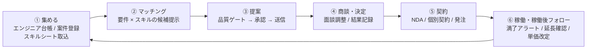
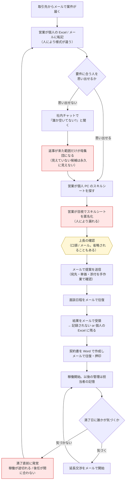
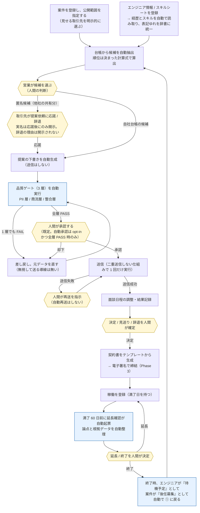
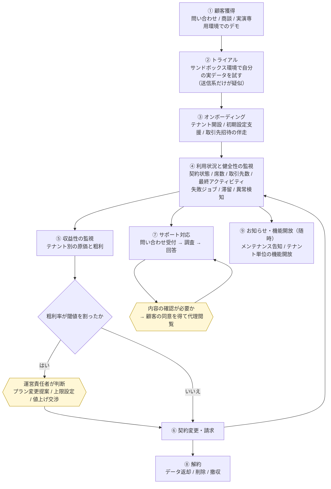

# 01. 業務要件定義書 — SES Platform

> **位置づけ**: 本ドキュメントは「なぜこのシステムが必要か・誰がどんな業務価値を得るか・業務上どんな決めごとを守るか」を定義する。
> **一次資料は `CLAUDE.md`**。本書は `CLAUDE.md` を業務の言葉に展開したものであり、矛盾する場合は `CLAUDE.md` が正。
> 機能仕様（何ができるか）は `docs/02`、画面は `docs/04`、実装は `docs/05` の領分であり、本書では扱わない。
> 参考資料: `docs/00-source-brief.md`（発注者の元ドラフト。`CLAUDE.md` で確定した差分は同ファイル末尾の表を参照）。

**構成**: 1 背景・課題 / 2 対象ユーザー / 3 ビジネスゴール / 4 業務スコープ / 5 業務フロー（現状 → 理想） / 6 ステージ別の業務要件（6.7 = AI 運用ロール） / 7 運営者（サービス提供者）の業務要件 / 8 主要 KPI / 成功指標 / 9 ビジネスルール（`BR-01`〜） / 10 制約・前提 / 11 ステークホルダーと展開計画

---

## 1. 背景・課題

### 1.1 SES 営業という業務の構造

SES（システムエンジニアリングサービス）事業者の営業は、**「案件情報」と「人材情報」を突き合わせ続ける仕事**である。案件は取引先や自社の商流から日々流入し、人材（エンジニア）は自社所属と取引先所属の両方が混在する。この 2 つの母集団を照合し、提案し、決まったら契約して稼働させ、稼働が終わる前に次を用意する——これが 1 本の業務ループとして回り続けている。

ところが現場では、この業務を支える情報が **Excel・メール・チャットツールに分散**している。分散していること自体ではなく、**分散の結果として業務工程が形骸化していること**が本質的な課題である（`CLAUDE.md` §1.1）。

### 1.2 形骸化している 5 つの工程

| # | 形骸化している工程 | 構造的な原因 | 業務上の帰結 |
|---|---|---|---|
| 1 | **台帳の更新** | スキルシートは個人 PC とメール添付にあり、稼働状況は営業個人の記憶にある。台帳を更新する動機が誰にもない | 検索しても当たらないので「あの人に聞く」に戻る。**属人化が固定される**。担当者が交代すると、その人が抱えていた候補と経緯が丸ごと失われる |
| 2 | **マッチング** | 案件の必須要件と人材のスキルの突き合わせが完全に人手 | 母集団が「その営業が覚えている範囲」に縮む。**取引先が増えるほど、見えていない候補が増える**。取引先を増やしても提案数が比例して増えない |
| 3 | **提案履歴の記録** | 「誰を・どの案件に・いつ・いくらで提案したか」がメールに散る | 同一エンジニアの二重提案、単価の取り違えが**事前に検知できない**。事故が起きてから気づく |
| 4 | **稼働後のフォロー** | 契約満了日を管理する場所がない。1〜2 か月前に動けば延長交渉も後任提案もできるのに、期日を持つ人がいない | 直前に発覚して稼働が途切れる。**売上に最も直結する工程が、最も仕組み化されていない** |
| 5 | **情報境界の管理** | 「取引先 A に、取引先 B の動きを漏らさない」「単価やエンド企業名を見せてよい相手を間違えない」「匿名化前のスキルシートを外に出さない」が、すべて担当者の注意力に依存している | 一度起きれば取引が切れる事故だが、防止策が「気をつける」しかない。**担当者が交代した瞬間に品質が崩れる** |

### 1.3 なぜ「ツールを入れる」だけでは解決しないか

工程 1〜4 は、情報を 1 箇所に集めて自動化すれば改善する。しかし**工程 5 は性質が異なる**。情報を 1 箇所に集めるほど、境界を破ったときの被害は大きくなる。案件も人材も取引先の情報も同じ画面に載るということは、**誤って越境させる機会が増える**ということでもある。

したがって本プロダクトの方針は次の 2 本立てになる（`CLAUDE.md` §1.1 末尾）。

- **工程 1〜4 は「仕組みで解決する」** — 台帳・マッチング・提案履歴・満了管理を 1 つの業務基盤に集約し、期日と検知を自動化する
- **工程 5 は「設計で不可能にする」** — 注意して運用するのではなく、**そもそも越境した情報が見えない構造**にする。運用ルールや教育で担保しない

### 1.4 成果の再現性という観点

上記 5 工程の形骸化は、いずれも「担当者個人に依存する」形で現れる。優秀な営業がいる間は回るが、**その人が抜けると成果が再現できない**。本プロダクトが提供する業務価値の中心は「作業が速くなること」ではなく、**誰が担当しても同じ手順・同じ検知・同じ記録が残ること**である。

- 台帳と提案履歴が残るため、**担当者交代時に引き継げる**
- マッチングの候補提示が同じ入力に対して同じ結果を返すため、**属人的な勘に依存しない**（`CLAUDE.md` §12.3。順位を AI に決めさせない理由でもある）
- 品質ゲートが全員に等しく適用されるため、**新人でもベテランと同じ水準の外部共有物しか出せない**
- 誰が何を見たかが記録されるため、**取引先に対して後から説明できる**

---

## 2. 対象ユーザー

`CLAUDE.md` §1.2 / §10.1 の区分を、規模・スキル前提・1 日に割ける時間・現在の代替手段の観点で展開する。

### 2.1 主平面（契約 SES 企業とその取引先）

| 区分 | 人数規模 | スキル前提 | 1 日に割ける時間 | 現在の代替手段 |
|---|---|---|---|---|
| **テナント管理者**（契約 SES 企業の管理部門。`OWNER` / `ADMIN`） | 1 テナントに 1〜3 名 | IT リテラシーは中程度。日常的に業務システムを触るが、設定作業に長時間は使えない | 1 日 15〜30 分 | Excel の権限管理台帳、メールでのアカウント発行依頼、口頭ルール |
| **自社営業**（`SALES`）**＝本プロダクトの主利用者** | 1 テナントに 3〜30 名 | 業務知識は高いが、システムの習熟に時間をかけられない。検索と一覧操作が中心 | 1 日 1〜3 時間。**その一部は客先移動中のスマートフォン操作**（`CLAUDE.md` §13.1） | Excel の案件表・要員表、メール、チャットツール、個人の記憶 |
| **取引先企業の管理者**（`PARTNER_ADMIN`） | 招待された取引先 1 社につき 1〜2 名 | 中程度だが、自社エンジニアの情報更新と提案が日常業務であるため、**習熟度は自社営業と同水準に達する**。設定作業だけの軽い利用者ではない | **1 日 4〜5 時間**（`CLAUDE.md` §1.2 / [Issue #4](https://github.com/Festal-KM/SES-Platform/issues/4)、2026-08-31。**自社営業の 1 日 1〜3 時間より長い**） | 自社の Excel 要員表と、SES 企業ごとに異なるメール運用 |
| **取引先の営業**（`PARTNER_SALES`） | 招待された取引先 1 社につき 1〜10 名 | 中程度。**自社が持ち込んだ情報しか見えない**前提で使う。滞在時間が長いぶん、見えない範囲の説明不足は不信として蓄積する | **1 日 4〜5 時間**（`CLAUDE.md` §1.2 / Issue #4、同上）。公開案件の確認・エンジニア情報の更新・提案の作成・提案依頼への応答・チャットが 1 日を通じて発生する | メールで案件を受け取り、Excel のスキルシートを添付して返信する |
| **閲覧専用**（`VIEWER`） | テナントの運用による | 参照のみ | 不定 | — |

### 2.2 管理平面（サービス提供者）

| 区分 | 人数規模 | スキル前提 | 1 日に割ける時間 | 現在の代替手段 |
|---|---|---|---|---|
| **運営責任者**（`PLATFORM_OWNER`） | 少数（**目標値（要検証）**。`CLAUDE.md` に人数の明記なし） | 事業判断を行う。契約・料金・停止の決定権を持つ | 日次の確認 + 随時 | — （新規サービスのため既存手段なし） |
| **運営サポート**（`PLATFORM_SUPPORT`） | 少数 | 顧客対応と障害調査。**課金設定とテナント停止は不可** | 日次 | — |

### 2.3 ユーザー区分から導かれる業務要件

- 主利用者である自社営業は**長時間の学習コストを払えない**。「Excel に戻ったほうが速い」と感じられた時点で台帳の更新が止まり、§1.2-1 の形骸化が再発する
- **提案の承認・面談日程の確定・延長確認への回答・チャット返信は移動中に発生する**（`CLAUDE.md` §13.1）。これらをデスクトップ前提にすると対応が半日〜1 日遅れ、SES の営業ではそれが失注に直結する
- 取引先の営業は**他社のツールを使わされる立場**であり、自社に見えない情報があることを前提に使う。見えない範囲が明確でないと不信を招くため、「何が見えて何が見えないか」が業務上わかることを要件とする
- 🔴 **取引先（`PARTNER_ADMIN` / `PARTNER_SALES`）も 1 日 4〜5 時間このツールに滞在する主利用者である**（§2.1。`CLAUDE.md` §1.2 の 🔴 段落 / Issue #4）。自社営業（1 日 1〜3 時間）より長い。取引先側は「たまに見に来る人のための簡易画面」では成立せず、**日常業務がその画面だけで完結する密度**を要件とする。取引先側の業務も自社営業と同じく時間勝負（提案依頼への応答、提案の作成、チャットの返信）であり、**デバイスの前提も自社営業と分けない**

---

## 3. ビジネスゴール

`CLAUDE.md` §1.1 の課題と §7 の KPI を、業務としての達成目標に翻訳する。**数値のうち `CLAUDE.md` に根拠があるものは出典を示し、それ以外は「目標値（要検証）」と明記する。**

### 3.1 定量目標

| # | 目標 | 目安 | 根拠 |
|---|---|---|---|
| G-1 | 情報境界の事故をゼロにする（テナント越境・パートナー間相互参照・PII 未マスキング共有・**匿名候補の身元が提案作成前に露出すること**） | **0 件（許容しない）** | `CLAUDE.md` §7 |
| G-2 | 取引先への二重送信・誤送信をゼロにする | **0 件（許容しない）** | `CLAUDE.md` §7 |
| G-3 | 契約満了 60 日前アラートの取りこぼしをゼロにする | **0 件（許容しない）** | `CLAUDE.md` §7 / §4.2 |
| G-4 | スキルシートの閲覧・ダウンロードの記録欠落をゼロにする | **0 件（許容しない）** | `CLAUDE.md` §7 / §3.5 |
| G-5 | 候補の探索を「記憶」から「検索」に置き換える | エンジニア 1 万件 / 案件 1 万件でも複合検索が 1 秒以内（p95）、マッチング候補の初回提示が 3 秒以内（p95） | `CLAUDE.md` §7 |
| G-6 | 提案 → 面談 → 決定の転換率を可視化する | テナント別・案件別に画面で確認できる（Phase 3） | `CLAUDE.md` §7 |
| G-7 | 使うほど赤字になるテナントを月次を待たずに検知する | 粗利率が閾値を割ったテナントを運営コンソールで検知できる | `CLAUDE.md` §7 / §10.2 |
| G-8 | 台帳の鮮度を保つ | 稼働終了予定のエンジニアが、担当者の手作業なしに「待機予定」として次の探索母集団に戻る（`CLAUDE.md` §4.2 の還流） | `CLAUDE.md` §1.3 / §4.2 |

### 3.2 定性目標

| # | 目標 | 業務としての意味 |
|---|---|---|
| G-9 | **成果の再現性** | 担当者が交代しても、同じ案件に対して同じ候補母集団・同じ検知・同じ記録が得られる。属人化した「勘」を業務基盤側に移す |
| G-10 | **説明可能性** | 「なぜこの候補を提案したか」「誰がいつ誰の経歴を見たか」「誰が承認したか」を、取引先・社内・監査に対して後から説明できる |
| G-11 | **境界の安心** | 取引先が「自社の情報は他社に見えない」と確信して情報を預けられる。これが取引先の登録数、ひいてはマッチング母集団の大きさを決める |
| G-12 | **稼働の途切れの解消** | 満了が近い稼働を、直前ではなく余裕をもって延長・後任提案の議題に乗せる |

### 3.3 ゴールの優先順位

スコープや工数が競合したときの判断基準は次の順とする。

1. **G-1 / G-2（事故ゼロ）** — 1 件でも起きれば取引が切れる。他のどの価値とも交換しない
2. **G-8 / G-12（⑥ → ① の還流）** — この還流を切ると、本プロダクトは単なる案件管理 Excel の置き換えになる（`CLAUDE.md` §1.3）
3. **G-5 / G-9（探索の置き換えと再現性）**
4. **G-6 / G-7（可視化）**

---

## 4. 業務スコープ

### 4.1 対象とする業務ループ

本プロダクトが支援するのは、`CLAUDE.md` §1.3 の 6 ステージからなる**閉じた業務ループ**である。個々の機能ではなく、**このループが 1 周し続けること**が提供価値である。

### 4.2 各ステージのインプットとアウトプット

| ステージ | 受け取るもの（インプット） | 出すもの（アウトプット） |
|---|---|---|
| **① 集める** | 自社・取引先から持ち込まれるエンジニア情報とスキルシート、商流から流入する案件情報、⑥ から還流した「待機予定のエンジニア」と「後任募集の案件」 | 検索可能な状態に整った**エンジニア台帳**と**案件台帳**。案件ごとの公開範囲 |
| **② マッチング** | 案件の必須要件・尚可要件と、**その利用者の会社が自社台帳に持つエンジニア**（自社所属か取引先所属かを問わず同じ土俵で扱う）。加えてホストの母集団には、**取引先が「共有可」に設定したエンジニアが、匿名化された 5 項目に限って**加わる（越境経路 4）。**他社の実名台帳は依然として誰も読めない** — BR-05 / BR-06 / BR-53〜BR-59 | 順位と**根拠**が付いた候補一覧（匿名候補を含む）。営業が提案対象・提案依頼先を選ぶための判断材料 |
| **③ 提案** | 選ばれた候補（自社台帳の候補、または**提案依頼に応諾した匿名候補**）、提案先、提案条件（単価・開始日等）、提案時点で凍結したエンジニア情報 | 品質ゲートを通過し**人間が承認した**提案と、その送信結果。送信できなかった場合は理由 |
| **④ 商談・決定** | 送信済みの提案、提案先からの反応 | 面談日程、面談結果、**決定 / 見送り / 辞退**の確定した結果と履歴 |
| **⑤ 契約** | 決定した提案の内容（案件・エンジニア・単価・期間） | 締結済みの契約書類（NDA / 基本契約 / 個別契約）、発注・請求の記録、開始予定の稼働 |
| **⑥ 稼働・稼働後フォロー** | 稼働中の契約、満了日 | 満了前の**延長確認の議題**（延長可否・単価改定の論点と根拠）、延長 or 終了の決定、終了時は ① への還流 |

### 4.3 中核工程（スコープが揺れたときに守るもの）

**中核 1: ⑥ → ① の還流（最優先）**

稼働終了の見込みが立った時点で、**エンジニアは自動的に「待機予定」として ① の探索母集団に戻り、案件側も後任募集として ① に戻る**（`CLAUDE.md` §1.3 / §4.2）。この還流があることで、業務ループは 1 周して閉じる。

- **この還流を切ると、本プロダクトは単なる案件管理 Excel の置き換えになる。** 台帳・提案履歴・契約書置き場が個別にあるだけのツールは既に世の中に多数あり、それらは §1.2-4（稼働後の放置）を解決しない
- 還流の業務価値は「次の提案の起点が、担当者の記憶ではなく期日から自動的に生まれる」ことにある。**営業が気づくことに依存しない**
- スコープ調整の判断基準: **⑥ → ① を切る案は採らない**。他のステージの厚みを削ってでもこの還流を残す

**中核 2: ③ の品質ゲート**

外部（テナント外）へ共有されるものは必ず 3 層の品質ゲートを通る（`CLAUDE.md` §3.3）。

- **ゲートを外すと、提案は「メールを画面に置き換えただけ」になり、§1.2-5 の事故を防げなくなる。** 情報を 1 箇所に集めた分だけ、むしろ事故の確率が上がる
- ゲートは「速度を落とす仕掛け」ではなく、**新人でもベテランと同じ水準の外部共有物しか出せない**ようにする仕掛けである（G-9 に直結）

### 4.4 業務スコープ外

`CLAUDE.md` §6 のとおり、給与計算・勤怠管理、反社チェック・与信審査、エンジニア本人向けアプリ / 求人媒体化、複数 AI 提供者の切替、稼働工数・作業実績の管理は**業務スコープ外**とする。理由と業務上の含意は章 10 に記載する。

---

## 5. 業務フロー

### 5.1 現状フロー（手作業）

**現状フローの問題点（赤色の箇所）**

- **S6** 母集団が「返事が来た範囲」に縮む（§1.2-2）／ **S7** 匿名化と商流情報の秘匿が**目視のみ**で、1 回の漏れが取引の終了に直結する（§1.2-5）／ **S15** 満了日を持つ場所がないため気づいたときには手遅れで、**売上に直結する工程が偶然に依存する**（§1.2-4）

### 5.2 理想フロー（自動化後）

### 5.3 人間が必ず介在する箇所（黄色の箇所）

自動化しても**人間の判断を外さない**工程を明示する。ここを自動化することは、本プロダクトの業務価値を損なう。

| 介在点 | 誰が | 何を判断するか | 自動化してはならない理由 |
|---|---|---|---|
| **T3 候補の選択** | 自社営業 / 取引先営業 | 提示された候補のうち、誰を提案するか | 順位は算出できるが、商流・関係性・本人の意向は業務基盤に載っていない情報である |
| **T3a 提案依頼への応諾 / 辞退** | 取引先（パートナー）の営業 | 匿名候補として挙がった自社エンジニアを、実名で提案するか断るか | 匿名候補は取引先の資産であり、**実名を開示するかどうかは取引先が決める**。断る自由と、断った理由を明かさない自由が保たれないと、取引先は共有そのものをやめる（BR-57） |
| **T7 提案の承認** | 承認権限を持つ社員（既定は人間必須） | 外部に出してよい内容かの最終確認 | 承認ゲートは §1.2-5 の事故を防ぐ唯一の関門。**自動承認は opt-in、かつゲート全層 PASS のときのみ**（`CLAUDE.md` §3.3） |
| **T9 送信失敗からの再送** | 自社営業 | 本当に届いていないかを確認したうえでの再送 | 自動再送は**二重送信事故**そのもの。「届いたが記録が失敗した」ケースと区別できない（`CLAUDE.md` §4.2） |
| **T11 商談結果の確定** | 自社営業 | 決定 / 見送り / 辞退の別 | 業務基盤の外（電話・対面）で決まる事実であり、システムは推測してはならない |
| **T15 延長 / 終了の決定** | 自社営業・テナント管理者 | 延長するか、単価を改定するか、終了して後任を立てるか | 取引先との関係と事業判断そのもの。論点整理までが支援の範囲 |

---

## 6. ステージ別の業務要件

`CLAUDE.md` §1.3 の 6 ステージそれぞれについて、「何を受け取り」「誰が何を判断し」「何を出し」「どこまで自動化してどこから人間の責任か」を定義する。6.7 では、これらのステージを内部で担う AI 運用ロール（`CLAUDE.md` §12）を業務の言葉で展開する。

### 6.1 ① 集める（エンジニア台帳 / 案件登録 / スキルシート取込）

| 観点 | 内容 |
|---|---|
| **インプット** | 自社所属エンジニアの情報、取引先が持ち込むエンジニア情報、各種様式のスキルシート（Excel / Word / PDF）、商流から流入する案件情報、⑥ から還流した待機予定エンジニアと後任募集案件 |
| **誰が何を判断するか** | ・自社営業: 案件の要件を「必須」と「尚可」に切り分ける。**案件をどの取引先に見せるかを明示的に指定する**（既定で全公開にしない） ・取引先の営業: 自社エンジニアの最新情報と稼働可能時期を登録する ・テナント管理者: 取引先の招待、公開範囲の運用方針 ・営業（全員）: スキルシートから自動で読み取られた内容の**採否を確認し、読み取れなかった項目を補う** |
| **アウトプット** | 検索できる状態に整ったエンジニア台帳と案件台帳、案件ごとの公開範囲、版管理されたスキルシート、辞書に統一されたスキル表記 |
| **自動化の範囲** | ・スキルシートからの経歴・スキル・期間・業務内容の読み取り ・「Java / JavaSE / Java8」のような表記ゆれの辞書への統一。辞書に無い語は**新語候補として起票**する ・⑥ からの還流（待機予定・後任募集の自動生成） |
| **人間の責任範囲** | ・読み取り結果の最終確認（**読み取りは支援であり、台帳の正しさの責任は登録者にある**） ・**公開範囲の指定**。ここを誤ると §1.2-5 の事故に直結するため、システムが推測して広げることはしない ・新語候補を辞書に採用するかの判断 |
| **業務上の制約** | スキルシートの原本を外部の解析サービスに無加工で渡さない（BR-11）。ファイルは安全と判定されるまで共有できない（BR-26）。エンジニア詳細とスキルシートの閲覧・ダウンロードは必ず記録される（BR-28） |

**このステージの業務価値**: §1.2-1（台帳が更新されない）の解消。**更新の動機を「担当者の善意」から「業務の流れの一部」に移す**。稼働終了・提案終了のたびに台帳が自動で更新されるため、放置しても腐りにくい構造にする。

### 6.2 ② マッチング（要件 × スキルの候補提示）

| 観点 | 内容 |
|---|---|
| **インプット** | 案件の必須要件・尚可要件・単価レンジ・開始日・勤務地 / リモート可否と、**候補母集団**。母集団は「**誰の視点か**」で決まる。取引先（パートナー）の視点では**その取引先が自社台帳に持つエンジニア**に限る。ホスト（契約 SES 企業）の視点では、①**自社台帳に持つエンジニア**に加えて、②**取引先が「共有可」に設定したエンジニアが、匿名化された 5 項目**（スキル / 経験年数 / 単価レンジ / 稼働可能時期 / 勤務地・リモート可否）**でのみ**加わる（越境経路 4。BR-53〜BR-59）。**他社の実名台帳を読むことは依然としてできない**（BR-06 は維持される。匿名 5 項目は「台帳全体」ではなく、取引先が候補ごとに共有可と決めた限定的な表示である）。母集団の中では、**自社所属か取引先所属かを問わず同じ土俵で扱う**（同じ検索・同じ評価軸。区別するのは「誰が台帳に持っているか / 誰が共有を許したか」であって「本人がどこに所属しているか」ではない） |
| **誰が何を判断するか** | ・自社営業 / 取引先営業: 提示された候補のうち、誰に打診し、誰を提案するかを決める ・**取引先の管理者 / 営業: 自社のどのエンジニアを匿名共有の対象にするか**（既定は共有しない。いつでも解除できる） ・**取引先の営業: ホストから届いた提案依頼に応じるか断るか** ・テナント管理者: 候補の**順位**を決める重み（必須一致・尚可加点・経験年数・単価・開始日・勤務地）の運用方針（**Phase 2**。**Phase 1 は重みという概念を持たない**ため、この判断は Phase 2 から発生する。Q-5 / `CLAUDE.md` §9-9） |
| **アウトプット** | 順位付きの候補一覧と、**各候補が挙がった根拠**（どの要件に合致し、どこが足りないか）。匿名候補については、実名の代わりに**提案依頼を送る導線**が付く |
| **自動化の範囲** | **この箇条書きに Phase 無印の項目は無い。** ・要件とスキルの照合と絞り込み（**Phase 1**。並び順は決定的で説明可能な順序）と、順位（スコア）の算出（**Phase 2**） ・「なぜこの候補か」の根拠文の生成（**Phase 2**。**決定的に算出済みのスコアに対して付す**のであって、根拠文が順位を作るのではない。`CLAUDE.md` §12.2） ・インプット欄で定義した**その視点の母集団を漏れなく走査すること**（**Phase 1**。共有された匿名候補は含み、共有されていない他社エンジニアには広げない） ・**共有が解除された候補を、その時点で候補一覧から外すこと**（**Phase 1**） |
| **人間の責任範囲** | 候補の選択と打診の判断。商流・関係性・本人の意向はシステムに載っていない情報であり、人間が補う。匿名候補については、**実名を開示するかどうかの判断は取引先側にある** |
| **業務上の制約** | 🔴 **候補の順位は AI に決めさせない**（BR-14）。同じ入力に対して常に同じ順位が出ること。パートナーには自社エンジニアの候補しか見えず、他社候補（匿名候補を含む）の存在・件数を知る経路がないこと（BR-07 / BR-56）。匿名候補の実名・所属会社名・スキルシートは**提案が作成されるまで開示されない**（BR-59）。表示は 5 項目に限り、個人を特定できる情報や案件をまたいだ追跡を可能にする識別子を出さない（BR-54 / BR-55）。匿名の段階で単価の交渉をさせない（BR-58） |

🔴 **Phase 1 と Phase 2 で「見え方」が段階的に変わる（開示範囲は変わらない）**: 匿名候補が母集団に加わるのは **Phase 1** からである（`CLAUDE.md` §5。Issue #2 で決定、2026-08-31）。ただし **Phase 1 の時点でマッチングスコアはまだ無い** — 匿名候補は**複合検索の結果に自社エンジニアと混在して現れ**、並び順は検索条件への適合と更新日時など**決定的で説明可能な順序**による。スコアによる順位付け（匿名候補を自社エンジニアと同じ基準で採点し、**匿名のままスコア順に並べる**）は **Phase 2** である。**開示範囲は Phase をまたいで不変**であり、Phase 1 でも Phase 2 でも匿名 5 項目のみ・提案が作成されて初めて実名開示（BR-54 / BR-59）。提案依頼は Phase 1 から送れる。**本節で「順位」「スコア」「重み」「順位付きの候補一覧」に関わる記述は、すべて Phase 2 の完成形を指す。Phase 1 の「並び順」は検索条件への適合と更新日時による決定的な順序のみを意味し、重み設定も順位も持たない。Phase 1 を「スコア順に並ぶ」と読まないこと**（章 11.2 / 11.3-5）。

**このステージの業務価値**: §1.2-2（母集団が記憶の範囲に縮む）の解消。候補母集団が「その営業が覚えている範囲」から「**台帳の全件**」に広がる。**「取引先を増やした分だけ候補が増える」がどう実現するか**: 経路は 2 つある。**①取引先が動く経路** — 案件をその取引先に公開する → 公開先の取引先が自社台帳を母集団としてマッチングし提案する → 提案されたエンジニアの提案時点の情報だけをホストが読む（越境経路 1 + 2）。**②ホストが動く経路** — 取引先が共有可にしたエンジニアが匿名 5 項目でホストの候補一覧に現れ（**Phase 1 は複合検索の結果に混在、Phase 2 でスコア順**）、ホストが提案依頼を送る（越境経路 4）。②があることで、案件を公開しても取引先が反応しないケースでも、ホストから能動的に声をかけられる。**いずれの経路でも、ホストのマッチング画面に他社の実名台帳が現れることはない**（BR-06）。取引先にとっての参加動機（自社エンジニアが公平に候補に挙がる）は、①②の両方の上で成立する。

**匿名候補と提案依頼の業務上の位置づけ**: 匿名共有は「取引先の台帳をホストに開くこと」ではなく、**取引先が自分の意思で出した候補に、ホストから声をかけられるようにすること**である。主導権は最後まで取引先にある — 共有するかどうか（既定オフ。解除で即座に消える）、提案依頼に応じるかどうか、実名を開示するかどうかのすべてを取引先が決め、**断った理由をホストに説明する義務はない**（BR-53 / BR-57）。この非対称性が保たれない限り、取引先は共有をやめる。ホスト側の業務価値は「待っているだけでは出てこない候補に、こちらから当たれる」ことであり、取引先側の業務価値は「**自社の台帳を開かずに商談機会だけを受け取れる**」ことである。両者の価値が同時に成り立つ範囲が、匿名 5 項目という表示上限の意味である。

**順位を機械的に決める業務上の理由**（`CLAUDE.md` §12.3。**以下 3 点は Phase 2 の順位・重みについて述べる**）:

1. **営業判断の根拠になること** — 同じ案件で順位が揺れると、「なぜこの人を提案したか」を取引先にも社内にも説明できない
2. **後から監査できること** — 提案時点の順位と根拠を再現できなければ、事後の検証が成立しない
3. **重みが事業判断であること** — 「単価を優先するか、開始日を優先するか」は事業上の優先順位の表明であり、テナントが自分で調整すべき設定値である（`CLAUDE.md` §8.6 / §9-9）

### 6.3 ③ 提案（品質ゲート → 承認 → 送信）

| 観点 | 内容 |
|---|---|
| **インプット** | 選ばれた候補（自社台帳の候補、または**提案依頼に応諾した匿名候補**。応諾をもって実名・所属会社名・スキルシートが初めてホストに開示される）、提案先の企業・担当者、提案条件（単価・開始日・稼働形態）、提案時点のエンジニア情報 |
| **誰が何を判断するか** | ・提案作成者（自社営業 / 取引先営業）: 誰に何をいくらで提案するか、下書きの内容 ・**承認者（人間）**: 外部に出してよい内容かの最終確認。ゲートの指摘・提案先・単価・エンジニアの要点を見たうえで承認する ・自社営業: 送信が失敗した場合の再送の判断 |
| **アウトプット** | 承認済みの提案、送信結果（成功 / 失敗と理由）、提案時点で凍結されたエンジニア情報、提案の履歴 |
| **自動化の範囲** | ・提案メール・エンジニア紹介文の**下書き生成**（送信はしない） ・品質ゲート 3 層の自動実行 ・重複提案の検知 ・承認済み提案の送信を**ちょうど 1 回だけ**実行すること |
| **人間の責任範囲** | **承認**（既定は必ず人間）。送信失敗からの再送。ゲートが FAIL したときの元データの修正 |
| **業務上の制約** | 承認を経ずに送信されない（BR-16）。ゲート FAIL を無視して送る導線が存在しない（BR-18）。二重送信 0 件（BR-21）。重複提案の検知結果はホストにのみ表示（BR-08）。匿名候補から始まった提案では、**提案が作成されるまで身元が開示されない**（BR-59）。整合層の合否は機械的な照合だけで決まる（BR-61） |

**3 層の品質ゲートが何を守るか**（`CLAUDE.md` §3.3）:

| 層 | 何を検査するか | 起きたら何が失われるか |
|---|---|---|
| **PII 層** | 氏名・生年月日・連絡先・顔写真・現所属会社名が、外部に出る資料に残っていないか | 個人情報の外部流出。エンジニア本人と取引先の双方に対する信用を同時に失う。**匿名化は SES の商習慣上の前提**であり、破ると「あの会社は経歴を裸で回す」と評価される |
| **商流層** | 単価・エンド企業名・他社名が、その公開範囲で出してはならない相手に出ていないか | 商流の露出。中間マージンやエンド企業が判明すると**中抜き（直接取引への切り替え）を招き、取引そのものが消える** |
| **整合層** | 案件の必須要件との齟齬、重複提案、スキルシートと登録スキルの矛盾。**合否は機械的な照合だけで決まる。** AI はスキルシート本文との意味的な齟齬を「警告」として併記するにとどまり、**AI の指摘だけで不合格にはしない**（BR-61） | 「要件を読んでいない提案」を送ることによる信頼低下。同一エンジニアの二重提案による**取引先間のトラブル**。単価の取り違え |

**承認の扱い**:

- 既定は**人間承認必須**。自動承認は明示的な設定（opt-in）でのみ有効になり、**3 層すべてが PASS した場合に限る**（`CLAUDE.md` §3.3 / BR-17）。**1 層でも FAIL したら、自動承認が有効でも人間に差し戻る。** 自動承認で通した提案も**誰が（システムが）承認したかが記録され**、後から「なぜこれが出たか」を説明できる状態を保つ
- 🔴 **ゲートの FAIL を「了解のうえ送信」できる導線を作らない。** 直せるのは元データだけである。例外を 1 つ作れば、それが常用経路になる。ただし**「不合格」と「警告」は混同しない** — 整合層で AI が付す意味的な齟齬の指摘は**警告**であり不合格ではない（BR-61）。警告は承認者が読んで判断する材料であって、それだけで送信を止めはしない。**合否が実行のたびに揺れないこと**が、承認と監査の根拠を成立させる

**このステージの業務価値**: §1.2-3（提案履歴が残らない）と §1.2-5（境界管理が注意力頼み）の同時解消。**新人でもベテランと同じ水準の外部共有物しか出せない**状態にする。

### 6.4 ④ 商談・決定（面談調整 / 結果記録）

| 観点 | 内容 |
|---|---|
| **インプット** | 送信済みの提案、提案先からの反応（面談希望・辞退・条件交渉） |
| **誰が何を判断するか** | ・自社営業: 面談日程の確定、条件交渉の可否 ・自社営業 / 取引先営業: **決定 / 見送り / 辞退の結果を確定して記録する**（システムは推測しない） |
| **アウトプット** | 確定した面談日程、面談結果、**決定 / 見送り / 辞退**のいずれかに確定した提案、その履歴（日時・担当者・メモ・添付） |
| **自動化の範囲** | 面談調整の連絡（テンプレートに基づく送信）、日程の記録、担当者への通知とタスク化、転換率の集計 |
| **人間の責任範囲** | 結果の確定入力。面談・電話・対面など**業務基盤の外で起きた事実**をシステムに戻す責任は人間にある |
| **業務上の制約** | 面談調整メールも外部送信であり、二重送信しない（BR-21）。結果の状態は「見送り（LOST）」と「送信失敗（SUBMIT_FAILED）」と「ゲートで自ら止めた（GATE_FAILED）」を**別のものとして扱う**（BR-23）。さらに手前の「提案依頼を断られた（DECLINED）」もこれらと混同しない（BR-60） |

**「うまくいかなかった」を 4 つに分ける業務上の理由**（`CLAUDE.md` §4.2）:

| 区分 | 業務上の意味 | 混同すると何が壊れるか |
|---|---|---|
| **提案依頼を断られた** | 取引先が匿名候補の実名開示を断った。**提案はまだ存在しない**。取引先の正当な権利の行使であり、失敗ではない | 見送りと混ぜると、提案していないものが成約率の分母に入る。ゲート不合格と混ぜると、**取引先の判断を自社の品質問題として扱う**ことになり、断りにくくする圧力として取引先に伝わる（BR-57 / BR-60） |
| **ゲートで止まった** | 送る前に自分で止めた。**外部には何も起きていない**。品質管理が効いた状態であり、悪い結果ではない | 成約率の分母に入れると、品質管理を強化するほど成績が悪く見える。**ゲートを緩めようという誤った動機が生まれる** |
| **送信自体が失敗した** | 外部への到達が確定していない。**障害であり、人間の対応が必要** | 見送りと混ぜると障害が埋もれる。運営者の監視でも検知できず、顧客が「送ったつもり」のまま商機を失う |
| **提案は届いたが見送られた** | 営業活動としての結果。**改善対象は提案内容や候補選定** | 障害と混ぜると障害率が汚れ、監視が誤検知する。改善の打ち手を間違える |

この 4 区分は「成約率」と「障害率」という**性質の異なる 2 つの指標を汚さない**ために必須である。混ぜた瞬間、KPI（章 8）が意思決定に使えなくなる。

### 6.5 ⑤ 契約（NDA / 個別契約 / 発注）

| 観点 | 内容 |
|---|---|
| **インプット** | 決定した提案の内容（案件・エンジニア・単価・期間・稼働条件）、取引先の企業情報（商号・住所・支払条件） |
| **誰が何を判断するか** | ・テナント管理者 / 自社営業: どの契約書式を使うか、契約条件の最終確認 ・**契約締結の意思決定は人間のみ**。署名依頼の送付も人間の明示操作 |
| **アウトプット** | 締結済みの契約書類（NDA / 基本契約 / 個別契約）とその版、発注・請求の記録、開始予定として登録された稼働 |
| **自動化の範囲** | 契約書テンプレートへの差し込み（会社名・案件情報・単価・期間）、締結状態の追跡、締結待ちのタスク化と督促通知 |
| **人間の責任範囲** | 契約内容の確認と締結の意思決定、署名依頼の送付操作、**再送の判断**（1 契約につき署名依頼は 1 回。再送は人間の明示操作のみ。BR-24） |
| **業務上の制約** | 契約書の送付は二重送信しない（BR-21）。安全と判定されていないファイルは共有しない（BR-26）。取引先へ渡る書類も外部共有物であり品質ゲートの対象（BR-15） |

**業務上の留意点**: 契約書の**送信元名義**は商流上の論点である。取引先から見て運営者名義で契約書が届く構造は、SES の商習慣上受け入れられない可能性が高い（`CLAUDE.md` §9-2 / §9-3）。この点は未確定事項として章末に記載する。

### 6.6 ⑥ 稼働・稼働後フォロー（満了アラート / 延長確認 / 単価改定）

| 観点 | 内容 |
|---|---|
| **インプット** | 稼働中の契約、契約満了日、稼働の評価・現場の状況、単価改定の希望と根拠 |
| **誰が何を判断するか** | ・自社営業: **延長するか / 終了して後任を立てるか**、単価を改定するか ・テナント管理者: 単価改定の社内方針 ・取引先: 延長可否の回答 |
| **アウトプット** | 延長確認の議題（延長可否・単価改定の論点と根拠データ）、延長 or 終了の決定、終了時は**待機予定のエンジニアと後任募集の案件**（① への還流） |
| **自動化の範囲** | ・**満了 60 日前に延長確認が自動で起票され、担当者に通知される**（`CLAUDE.md` §4.2） ・延長可否・単価改定の**論点と根拠データの整理**（稼働期間、直近の改定履歴、案件の相場感、代替候補の有無） ・終了確定時の ① への自動還流 |
| **人間の責任範囲** | 延長 / 終了 / 単価改定の**決定そのもの**。取引先との交渉。緊急離任時の対応 |
| **業務上の制約** | 満了 60 日前アラートの取りこぼしは **0 件**（BR-34）。終了したエンジニアと案件は必ず ① に還流する（BR-35） |

**このステージの業務価値**: §1.2-4（稼働後が放置される）の解消であり、**本プロダクトの中核**（§4.3）。

- 現状は「誰かが気づけば動く」。本プロダクトでは**期日が来たら必ず議題になる**。気づきに依存しない
- 60 日前という値は `CLAUDE.md` §4.2 で確定した業務上の起点である（延長交渉と後任提案の両方に必要な準備期間）。**元ドラフト（`docs/00-source-brief.md` §4.8）にあった「30 日前」の第 2 段階アラートの要否は未確定**（章末の Open Questions に記載）
- 還流によって、**終了は「業務の終わり」ではなく次の提案の起点になる**。ここが単なる案件管理ツールとの決定的な差である

### 6.7 業務ループを内部で担う専任ロール（AI 運用ロール）

`CLAUDE.md` §12 に基づき、本プロダクトの内部は**「専任のチームが動いている」構造**として設計される。各ステージには担当ロールがあり、それぞれが担当範囲の作業を行って**成果物を提出する**。

#### 6.7.1 ロールと担当業務

| 担当ロール | ステージ | 顧客が任せること（業務の言葉） | 提出物 |
|---|---|---|---|
| **スキルシート読み取り担当**（`sheet-parser`） | ① | 様式がばらばらのスキルシートから、経歴・スキル・従事期間・業務内容を読み取り、台帳に載る形に整える | 読み取り結果（採否は人間が確認する） |
| **スキル表記の統一担当**（`skill-normalizer`） | ① | 「Java / JavaSE / Java8」のような表記ゆれを社内辞書の語に揃える。辞書にない語は**新語候補として起票し、勝手に増やさない** | 統一済みスキルと新語候補 |
| **候補の根拠説明担当**（`match-explainer`） | ② | すでに算出された順位に対し、「なぜこの候補が挙がったか・どこが足りないか」を説明文にする。**順位そのものには関与しない** | 候補ごとの根拠文 |
| **外部共有物の検査担当**（`gate-inspector`） | ③ | 外部に出る前の資料に、個人情報が残っていないか・出してはいけない商流情報が混じっていないかを検査する（品質ゲートの PII 層と商流層）。**整合層では合否を判定せず、スキルシート本文との意味的な齟齬を「警告」として補助的に指摘するにとどまる**（合否は機械的な照合が決める。BR-61） | 検査結果（層ごとの合否と、整合層の警告） |
| **提案文の下書き担当**（`proposal-drafter`） | ③ | 提案メールとエンジニア紹介文の下書きを作る。**送信は一切行わない** | 提案の下書き |
| **延長判断の論点整理担当**（`renewal-advisor`） | ⑥ | 満了前に、延長可否・単価改定の論点と根拠データを整理する | 延長確認の論点整理 |

#### 6.7.2 顧客はこのチームの承認者である

- **顧客（テナントの利用者）はこのチームの承認者・意思決定者**である。**各ロールは提案するだけで、最終決定権を持たない**（`CLAUDE.md` §12.2）
- 各ロールの提出物を「**都度確認してから次に進める**」か「**確認を省いて次工程に進める**」かは、**ロール単位で顧客が選べる**。既定はすべて「都度確認」であり、省略は顧客が明示的に選んだ場合のみ有効になる（BR-20）
- ただし **外部共有物の検査担当（品質ゲート）には、この選択肢自体が存在しない**。検査を省略する設定を作らない（BR-19）。作れば §3.3 の承認ゲートを迂回する経路になり、章 4.3 の中核工程が無効化される
- 確認を省いた場合でも**提出物は必ず記録され、後から遡って確認・巻き戻しができる**。特にスキル表記の統一は、誤って揃えられた場合に元の表記へ戻せること（BR-20）
- **ロールに任せないことを明確にする**（旧 6.7.5 を統合）: ①**候補の順位付け** — 同じ入力で順位が変わると営業判断の根拠にならず、後から監査もできない（BR-14 / §6.2）。②**外部への送信** — 送信は承認を経た人間の意思決定の結果でなければならない（BR-16）。③**検査結果の上書きと、整合層の合否判定** — 検査担当が出した PII 層・商流層の合否を他の担当が覆せない（BR-19）。整合層の合否は担当ロールではなく機械的な照合が決める（BR-61）。④**自分で何をするか決めること** — 各担当は決められた工程を担うのであって、自律的に業務を組み立てる存在ではない。任せるとコストと事故が制御不能になる（`CLAUDE.md` §12.3）。⑤**個人情報・単価・エンド企業名の取り扱い** — これらは渡す前に除去する。担当に渡ってよいのはスキル・経験内容・期間だけである（BR-11 / BR-12）

#### 6.7.3 この構造の業務価値

1. **顧客が「何を任せているか」を理解しやすい** — 外部に業務委託したときの体制（読み取り担当・検査担当・下書き担当…）がそのまま製品の構造になっている。「AI が全部やる」より、任せる範囲と任せない範囲が明確になる
2. **「どの担当がこの提案をしたか」が分かる** — 提出物には担当ロールと、そのときの判断基準の版が記録される。これは章 8 の説明可能性（G-10）に直接寄与する。取引先や社内から「なぜこの記述になったのか」と問われたときに遡れる
3. **改善対象と原価を担当別に特定できる** — 「読み取りの精度が低い」のか「下書きの文面が硬い」のかを分けて評価でき、担当ごとに改善できる。どの担当がコストを使っているかも分かる（章 7 の粗利管理に直結。`CLAUDE.md` §10.2）

#### 6.7.4 役割の存在を前面に押し出しすぎないこと

**これも業務要件である。** 顧客が求めているのは**成果物**（整った台帳・妥当な候補・安全な提案・間に合う延長確認）であり、内部の体制ではない。

- 内部体制の可視化は、**成果物の根拠を示すための手段**であって目的ではない。「6 つの担当が働いています」を売り文句の前面に出すと、顧客は自分の業務ではなく製品の内部構造を理解させられることになる
- 通常の業務画面では**成果物と、その根拠への導線**があれば足りる。誰が担当したかは、根拠をたどったときに分かればよい
- ただし**責任の所在が問われる場面では必ず開示できる**こと。「この記述は誰の判断か」に答えられない状態は、G-10（説明可能性）の放棄にあたる

---

## 7. 運営者（サービス提供者）の業務要件

本プロダクトは SES 企業に販売する SaaS であり、**主平面（顧客の業務）と同じ重みで運営者の業務を設計する**（`CLAUDE.md` §10）。ここを後回しにすると、売れても運用できない製品ができあがる。

### 7.1 運営者の業務フロー

### 7.2 収益性・原価管理の業務（運営平面の筆頭機能）

**なぜこれが筆頭機能なのか**（`CLAUDE.md` §10.2）:

本プロダクトの課金は **席課金（ユーザー数 × 月額）+ プラン内の AI 利用量クォータ、超過分は従量課金**である（`CLAUDE.md` §2 / §9-6。2026-08-31 決定）。原価として抱えるのは AI の従量課金・メール送信・ストレージ・電子署名であり、顧客の使い方に応じて増える。

- **超過分の従量課金があるため、逆ざやのリスクは構造的に小さくなった。** AI 原価の増加が売上に連動するため、「使ってもらうほど赤字が深くなる」という逆説そのものは緩和されている。**ただし解消されたわけではない**
- **それでも赤字は起きる。** クォータの初期値が実原価に対して緩すぎる場合（値は §9-11 / Q-15 で未確定）、**超過が発生する手前の帯域で粗利が薄くなる**。席数と AI 利用量は連動しないため、「3 席で毎日スキルシートを大量に取り込む」使い方は席課金の売上では回収できない。**月次の請求で初めて気づく運用では手遅れ**であり、後から制限をかければ解約理由になる
- **監視対象が 1 つ増える: クォータ消化率。** クォータ内に収まっている限り従量収入は入らない。消化率が常に低い顧客は**プランが過大**（更新時に値下げ交渉か解約になる）、常に上限に張り付く顧客は**プランが過小**（業務が止まって不満になる）。どちらも収益と継続率の両方に効くため、**粗利と並べて見る**

したがって運営者の業務要件は「**粗利が薄いテナントと、プランが実態に合っていないテナントを、月次を待たずに検知できること**」である（`CLAUDE.md` §10.2 の受け入れ基準）。

**原価が変動する構造をどう監視するか**

| 監視の観点 | 見るもの | 誰が何を判断するか |
|---|---|---|
| **テナント別の収支** | テナント × 月の売上（席課金の月額 + クォータ超過の従量）と原価（AI / メール / ストレージ / 電子署名）と粗利 | 運営責任者が、粗利率が閾値を割ったテナントへの対処を決める |
| **クォータ消化率** | プラン内 AI 利用量クォータに対する消費の割合と、超過の発生状況・従量額 | 運営サポートが顧客に事前連絡し、運営責任者が**プランを上げる提案か下げる提案か**を決める。消化率が低いテナントは §7.3 の「使えていない」兆候と重なることが多く、併せて見る |
| **原価の内訳** | **どの担当ロール（§6.7）が原価を使っているか** | 運営責任者が改善対象を特定する。「読み取り担当が重い」のか「下書きの作り直しが多い」のかで打ち手が変わる |
| **異常の早期検知** | 粗利率が閾値を割ったテナントを一覧の上位に出す。閾値はプランごとに設定できる | 運営責任者。**月次を待たない**ことが要件 |
| **上限への接近** | AI 利用の日次コスト、メール通数、ストレージ、席数の消費と残量 | 運営サポートが顧客に事前連絡し、運営責任者がプラン変更を提案する |

**判断の選択肢と、その業務上の性質**

| 打ち手 | 内容 | 誰が決めるか | 業務上の注意 |
|---|---|---|---|
| **プラン変更の提案** | 席数とクォータの見直し（上位プランへの移行、または消化率が低い顧客への下位プラン提案） | 運営責任者（事業判断。`CLAUDE.md` §8.6） | 上位への移行は顧客にとって値上げであり、使い方の実績データを示して合意を得る。**下位への提案は短期の売上を落とすが、更新時の解約より損失が小さい** |
| **上限（クォータ）の設定・引き締め** | AI 利用やメール通数の上限を設定する | 運営責任者 | **既存顧客の上限を予告なく引き下げない**。業務が止まり、信用を失う |
| **値上げ交渉** | 個別の条件見直し | 運営責任者 | 契約条件の変更であり、必ず人間の判断による |
| **上限到達時の自動停止** | 上限に達したら該当機能を停止し、**残量と停止理由を画面に表示する**（BR-24） | 自動 | **黙って劣化させない**。「AI 機能が動かない」ではなく「上限に達したため停止中」と伝わること |

**計測は最初から行う**: 利用量の計測は**後から遡れない**。したがって計測の仕組みは Phase 1 から必ず動かす（BR-43 / `CLAUDE.md` §10.6）。ダッシュボードの完成は Phase 3 で構わないが、**計測だけは先行させる**。これを怠ると、原価構造が分かるのが「サービス開始から半年後」になり、料金設計をやり直せなくなる。

### 7.3 顧客の健全性の監視（テナント一覧・詳細）

7.2 が「その顧客で**儲かっているか**」を見る業務であるのに対し、本節は「その顧客が**使えているか**」を見る業務である（`CLAUDE.md` §10.4-1）。使われていない顧客は請求が続いていても解約予備軍であり、**粗利の監視では検知できない**（原価が発生しないため、むしろ粗利は良く見える）。したがって収益性とは別の業務として持つ。

| 見るもの | 業務上の意味 | 誰が何を判断するか |
|---|---|---|
| 契約状態（プラン / トライアル期限 / 停止の有無） | 契約と実態が合っているか。期限切れのトライアルが放置されていないか | 運営責任者が契約変更・停止・移行の要否を判断する（7.5 へ引き渡す） |
| 席数と実際に使っている人数、取引先（パートナー）の登録数、エンジニア数・案件数 | **買った席が使われていない**のは社内に定着していない兆候。取引先が増えないテナントは**本プロダクトの中核価値（母集団の拡大 / §6.2）に到達していない**。台帳が育っていなければ §1.2-1 の形骸化が再発している | 運営サポートが利用支援・説明会・取引先招待の伴走を提案する |
| 最終アクティビティ | 使われなくなった時点を捉える。解約は「使わなくなってから数か月後」に通知される | 運営サポートが**解約の申し出より前に**接触する |

**異常な状態のテナントを一覧の上位に出す**ことが業務要件である（`CLAUDE.md` §10.4-1）。テナントが増えれば「一覧を上から順に読む」運用は必ず破綻し、気づいたときには解約通知が届いている。なお本節で運営者が見るのは**件数・状態・日時だけ**であり、案件やエンジニアの中身には立ち入らない（BR-37 / BR-40）。

### 7.4 サポート業務

**顧客から来る問い合わせと、運営者が見る必要のある情報**

| 問い合わせの種類 | 想定される内容 | 運営者が見る必要のある情報 | 見てはいけないもの |
|---|---|---|---|
| **送ったはずの提案が届いていない** | 送信の失敗、宛先の誤り | 提案の状態（送信中 / 送信失敗 / 送信済み）、失敗の理由、再送の履歴 | **提案の本文、エンジニアの氏名** |
| **取引先に見えるはずの案件が見えない** | 公開範囲の設定漏れ、招待の未完了 | 公開範囲の設定状態、招待の状態、対象アカウントの権限 | 案件の内容そのもの |
| **スキルシートの読み取りが失敗する** | 対応できない様式、ファイルの破損、安全性の検査で止まっている | 処理の状態とエラー、ファイルの形式・サイズ、検査の結果 | **スキルシートの原本と本文** |
| **AI 機能が使えない** | 利用上限への到達 | 利用量と残量、上限の設定値、停止の理由 | — |
| **アカウント・権限の相談** | 招待、ロール変更、2 要素認証 | アカウントの状態、ロール、最終ログイン | パスワード等の秘密情報 |
| **請求内容の照会** | 従量分の内訳 | 契約内容、利用量の集計、請求履歴 | — |
| **取引先から「誰がいつ経歴を見たか」の説明を求められた** | 顧客が自社の画面だけでは答えきれず、運営者に照会する | 該当期間の記録（誰が・いつ・どの操作をしたか）。**個人情報はマスキングして表示される**（BR-42） | **見た対象の内容**（スキルシートの本文、エンジニアの氏名、チャットの本文）。横断検索でも見えない（BR-40） |

**運営者に必要なのは「件数・状態・エラー」であって「内容」ではない**（`CLAUDE.md` §10.5）。これは制約であると同時に、**顧客に対する売り文句**でもある。「運営者にもエンジニアの氏名やスキルシートの中身は見えません」と言えることが、個人情報を預かる SES 企業にとっての採用理由になる（BR-40）。

**運用監視として運営者が能動的に見るもの**（`CLAUDE.md` §10.4-5）:

- 失敗した処理の滞留、送信中のまま止まっている提案、**送信失敗のまま未対応の提案**
- ファイルの安全性検査の失敗、電子署名の未着
- **品質ゲートの不合格率の異常**（急に上がったテナントは、運用の変化か不具合の兆候）
- 顧客が気づく前に運営者が気づき、先に連絡できることを目標とする

**記録のテナント横断検索**（`CLAUDE.md` §10.4-6）は、上表の「説明要求の支援」と障害調査のためだけに行う業務であり、**記録をテナント横断で読む唯一の業務**である（顧客の業務データそのものを見るのは §7.7 の代理閲覧に限られ、本業務はそれとは別の経路である）。運営者に見えるのは**誰が・いつ・どの操作をしたか**に限られ、**個人情報はマスキングされ**（BR-42）、**その操作で見られた内容そのものには到達できない**（BR-40）。この 2 つが同時に成り立つことで、「運営者は説明はできるが、中身は見ていない」という状態が顧客に対して主張できる。

### 7.5 契約・請求業務

| 業務 | 内容 | 初期フェーズの運用前提 |
|---|---|---|
| **プラン** | 席数上限・AI 利用量のクォータ・メール上限・機能の開放範囲をプランで定義する | 課金モデルは **席課金（ユーザー数 × 月額）+ プラン内 AI クォータ + 超過分の従量**で確定（`CLAUDE.md` §2 / §9-6）。**プラン別クォータの初期値は未確定**（§9-11 / Q-15）。スキルシート解析 1 件あたりの実測原価が出てから決める |
| **トライアル** | 見込み客が**サンドボックス環境で自分の実データを使って**試用する段階（§7.8.1）。送信系だけが疑似で、それ以外の挙動と統制は本番と同じ（BR-62） | 初期フェーズは運営者が手動でサンドボックスのテナントを開設し、期限を管理する運用を許容する。**本契約への移行はテナントの状態遷移として行い、データを環境間で複製しない**（BR-64）。有効期間と引き継ぎ手順は未確定（§9-12 / Q-16） |
| **超過分の扱い** | クォータを超えた利用は**従量課金**とする（`CLAUDE.md` §2） | 超過が始まったことと、その時点の従量額が**顧客自身にも見えること**。加えてコスト上限に達した場合は**黙って停止しない**（残量と理由を表示する。BR-24）。従量単価と上限の関係は Q-15 の確定後に詰める |
| **請求** | 月額 + 従量の請求 | 決済連携は Phase 3。**それまでは運営者が請求書を手作業で発行する運用を前提とする**。計測データは Phase 1 から蓄積されているため、遡って請求根拠を示せる |
| **停止・再開** | 支払遅延や契約終了に伴う利用停止 | **テナント停止は運営責任者のみが行える**。運営サポートには権限がない（BR-44）。停止は顧客の業務を止める行為であり、事業判断である |
| **解約** | データの返却と削除 | 解約時のデータ返却形式と削除の期限は**未確定**（個人情報の保持期間と併せて `CLAUDE.md` §9-8）。**本契約に移行しなかったサンドボックスのデータにも削除期限を持たせる**（BR-64 / §9-12）。章末の Open Questions に記載 |

### 7.6 お知らせ・機能開放の業務

運営者がテナントに対して**書き込みを行える数少ない領域**である（BR-37 で書き込みが許されるのは契約・利用上限・機能の開放・お知らせに限る）。業務データには一切触れず、「伝えること」と「使える機能の範囲」だけを変える。

| 業務 | 内容 | 誰が何を判断するか / 業務上の注意 |
|---|---|---|
| **メンテナンス・障害の告知** | 計画停止や障害の発生・復旧を、対象テナントの利用者に伝える | 運営責任者が告知の要否と時間帯を決める。**業務が止まる時間帯を顧客が事前に知れること**が要件。提案の送信と満了アラートが止まる時間は、顧客の商機に直結する（§1.2-4） |
| **テナント単位の機能開放** | 新しい機能を対象を絞って開放する。トライアル顧客への先行開放、段階的な提供、不具合発生時の一時的な閉鎖 | 運営責任者。**閉じる場合は理由が顧客に伝わること**（上限到達時と同じ考え方 — BR-24）。予告なく閉じると顧客は原因が分からないまま業務が止まる。開放・閉鎖の操作は運営者の操作として記録される（BR-41）。段階的な開放は §7.3 の「使えているか」の監視とセットで行う（開放したのに使われない機能は、機能の問題ではなく**伝わっていない**問題であることが多い） |

### 7.7 代理閲覧の業務ルール

顧客のデータを運営者が見る行為は、**データ分離の境界を越える唯一の経路**である。したがって「できるかどうか」ではなく「**どういう場合に許されるか**」を業務ルールとして定める（`CLAUDE.md` §10.5）。

| 観点 | 業務ルール |
|---|---|
| **どんな場合に許されるか** | 顧客からの問い合わせ・障害報告があり、**状態やエラーの確認だけでは原因が特定できない場合に限る**。運営者の都合（品質改善のための観察、営業資料の作成）では許されない |
| **理由の記録** | 代理閲覧のたびに**理由の入力を必須**とする。「調査のため」のような内容のない理由を許容しない運用とする |
| **時間の制限** | 開始から一定時間で自動的に終了する。**作業が終わっていなくても延長は再申請とする**（放置された代理状態が最も危険） |
| **できること** | **閲覧のみ**。データの修正、提案の送信、承認、契約書の送付など**実行系の操作は一切できない**（BR-39） |
| **顧客の同意** | 対象テナントの管理者に**通知する**。事後通知を許すかは運用方針だが、**通知しない代理閲覧は存在しない**（BR-38） |
| **記録** | 誰が・いつ・どの組織を・何の理由で・何分間見たかを記録する。**顧客から求められたら提示できる**こと |
| **見られないもの** | 代理閲覧中であっても、スキルシートの原本と本文、エンジニアの氏名・生年月日・連絡先、チャットの本文、外部サービスの資格情報は見えない（BR-40） |

**業務上の位置づけ**: 代理閲覧は「便利な調査手段」ではなく「**顧客に説明できる形でのみ使う例外手段**」である。SES 企業は他社のエンジニアの経歴を預かっている立場であり、**運営者が中を見たという事実そのものが、その顧客の取引先に対する説明責任になる**。

### 7.8 実演環境と試用環境を業務プロセスに組み込む

`CLAUDE.md` §11 には、顧客の実運用（本番）とは別に、**営業実演専用の環境（デモ）**と、**見込み客が自分の実データで試す環境（サンドボックス）**が定義されている。これは技術的な都合ではなく、**顧客獲得プロセス（§7.1 の ①〜②）そのものの一部**である。

#### 7.8.1 「デモ」「サンドボックス」「本番」は別の段階

| | **デモ（実演）** | **サンドボックス（試用）** | **本番（実運用）** |
|---|---|---|---|
| **プロセス上の位置 / 操作する人** | ① 顧客獲得。商談の場で**運営者の営業担当**が実演する。目的は業務の流れを見せて理解してもらうこと | ② トライアル。契約前の**見込み客自身**が試す。目的は自社の業務で使えるかを確かめてもらうこと | ③ オンボーディング以降。**顧客の社員と取引先**が業務そのものを行う |
| **データ** | **合成データのみ**（架空の企業・架空のエンジニア）。見込み客の実データを入れない | **見込み客の実データ**（実在するエンジニアの経歴・実在する取引先名を含む） | 顧客の実データ |
| **外部への送信** | **一切起きない**（実演用の疑似送信のみ） | **送信系（メール / 電子署名）だけが疑似**。それ以外の挙動は本番と同じ | 実際に起きる |
| **統制**（分離・記録・暗号化・保持期間） | 本番同等 | **本番と同じ規律をそのまま適用する。「試用環境だから」を理由に緩めない**（BR-62） | 本番 |
| **次段階への移行** | — | **テナントの状態遷移として本契約へ移る。データを環境間で複製しない**（BR-64）。移行しなかった場合は削除期限で個人情報を消す | — |

**この 3 つを 1 つの環境で兼ねない**（BR-63）。実演専用の環境に見込み客の実データを入れると、次の商談で**実在の取引先名やエンジニアの経歴が画面に出る**。逆に、試用のために本番同等の環境を用意せずデモ環境を使わせると、送信が起きない環境で「送信できた」と誤解させ、契約後に初めて実際の送信が動き始める。**プロセス上の位置が違うものは、環境も分ける。**

#### 7.8.2 なぜ空の環境では実演にならないか

本プロダクトの価値は**データが溜まった状態で初めて現れる**。② マッチングは台帳にエンジニアが十分にいて初めて「記憶では届かない候補が挙がる」ことを見せられ（3 人の台帳で実演しても「Excel で十分」という感想にしかならない）、③ 品質ゲートは**わざと問題のあるデータ**（氏名が残っている資料、単価が混じった文面）がなければ何を防いでいるのかが伝わらない。

- **⑥ → ① の還流**は、満了が近い稼働が複数ある状態でないと見せられない。**本プロダクトの中核（§4.3）が、空の環境では実演不能**である。管理平面の原価・粗利も、複数テナントの利用実績がないと画面が成立しない
- したがって実演用の環境には**架空だが業務として筋の通った一式のデータ**（複数の取引先、数十人規模のエンジニア台帳、進行中の提案、満了が近い稼働、ゲートで止まる資料）が要る。**これは営業資材であり、製品の一部として整備・維持する業務**と位置づける。一方サンドボックスは見込み客が自分のデータを入れる場であり、合成データの用意は不要である

#### 7.8.3 実演・試用の運用ルール

- **本番の顧客データを、実演にも試用にも使わない**。匿名化しても持ち出さない（BR-47）。エンジニアの氏名とスキルシートを含むため、顧客の取引先に対する裏切りになる
- **実演・試用中の操作で、実在の取引先にメール・契約書・署名依頼が届くことは構造上起こらない**（BR-45）。「気をつけて操作する」で担保しない
- **本番でないことが画面に常時表示される**（BR-48）。実演を見た顧客も、試用中の見込み客も、あとで本番と取り違えないため
- デモ用データは**定期的に初期状態に戻せる**こと。前の商談で作られた提案が次の商談に残っていると、実演の筋が崩れる
- **サンドボックスは契約前でも「預かった個人情報」を扱う場である**（BR-62）。有効期間、期限到来時のデータの扱い、本契約への引き継ぎ手順は未確定であり、決まるまでは運営者が個別に期限を管理する（`CLAUDE.md` §9-12 / Q-16）

**業務リスクは章 10 に記載する**（実演・試用中の誤操作が失注に直結する。R-1 / R-2）。

---

## 8. 主要 KPI / 成功指標

`CLAUDE.md` §7 を引き継ぎ、**業務としてどう測るか**を定義する。

### 8.1 事故指標（許容しない = 0 件）

| 指標 | 目安 | 業務としての測り方 |
|---|---|---|
| テナント越境の情報漏洩 | **0 件** | 顧客からの申告・監査ログの調査・自動テストによる継続的な検証。**1 件でも発生したら重大インシデントとして扱う** |
| パートナー間の相互参照（他社の提案・エンジニア・単価の露出） | **0 件** | 同上。加えて、パートナー向け画面に他社由来の情報が現れないことを継続的に検証する |
| PII 未マスキングでの外部共有・AI への送信 | **0 件** | 品質ゲートの通過記録と、AI への送信内容の記録の突き合わせ |
| **匿名候補の身元が、提案の作成前にホストへ露出した件数** | **0 件** | 匿名共有された候補について、提案が作成される前に実名・所属会社名・スキルシートへ到達できる経路がないことを継続的に検証する。あわせて、①表示項目が 5 項目を超えていないこと、②**同一人物を案件をまたいで追跡できる識別子が候補一覧に出ていないこと**を点検する（BR-54 / BR-55 / BR-59）。**露出は 1 件でも、その取引先が共有をやめる理由になる** |
| 提案メール・契約書の二重送信 / 誤送信 | **0 件** | 送信記録の重複検査。顧客からの申告 |
| 満了 60 日前アラートの取りこぼし | **0 件** | 稼働の満了日と延長確認の起票の突き合わせ（毎日照合し、未起票が 0 件であること） |
| スキルシートの閲覧・DL で監査ログが欠落した件数 | **0 件** | 閲覧・ダウンロードの実績と監査ログの件数の突き合わせ |

**これらは「改善目標」ではなく「発生したら事業が傷つく事象」である。** 他の指標とトレードオフにしない（§3.3 の優先順位）。

### 8.2 業務効率・体験の指標

| 指標 | 目安 | 業務としての測り方 |
|---|---|---|
| 複合検索の応答（エンジニア 1 万件 / 案件 1 万件） | 1 秒以内（p95） | 実データ規模を模した状態での計測 |
| マッチング候補の初回提示 | 3 秒以内（p95） | 同上。**営業が「待たされる」と感じた時点で Excel に戻る**ため、体験の下限として扱う |
| 提案 → 面談 → 決定の各転換率 | テナント別・案件別に画面で確認できること（Phase 3） | 提案の状態遷移の記録から集計。**ゲートで止まったもの・送信失敗したものを分母に混ぜない**（§6.4） |
| 台帳の鮮度 | 稼働終了後、担当者の操作なしに待機予定へ還流した割合（**目標値（要検証）**。具体値は運用開始後に設定） | ⑥ の終了確定と ① への還流の突き合わせ |

### 8.3 事業（運営者）の指標

| 指標 | 目安 | 業務としての測り方 |
|---|---|---|
| テナント別の AI 原価 | **粗利を割り込むテナントを運営コンソールで検知できること**（`CLAUDE.md` §7 / §10.2） | テナント × 月の売上と原価の対比。**月次を待たずに**閾値割れを検知する |
| 担当ロール別の原価内訳 | 内訳が分解できること | 利用量の記録に担当ロールが含まれていること（BR-10） |
| 利用量計測の欠測 | **0 件**（Phase 1 以降） | 計測データの日次の連続性を確認する。**欠測は後から埋められない**（BR-43） |

### 8.4 説明可能性の指標（定性）

| 指標 | 達成の判定 |
|---|---|
| 「なぜこの候補を提案したか」を後から説明できる | 提案時点の候補順位と根拠が再現できる |
| 「誰がいつ誰の経歴を見たか」を取引先に説明できる | 監査ログから該当期間の閲覧・ダウンロードを提示できる |
| 「この文面は誰の判断か」を説明できる | 生成物から担当ロールと判断基準の版を辿れる（§6.7.3） |

---

## 9. ビジネスルール

後続のすべてのドキュメント（`docs/02` 以降）と実装が守るべき業務上の決めごとを列挙する。**ルールは「守るべき状態」を書き、実現手段は書かない**（手段は `docs/05` の領分）。

各ルールには根拠となる `CLAUDE.md` の節を示す。**`CLAUDE.md` §3 のハードルールはすべていずれかの `BR-xx` に対応している。**

### 9.1 情報境界（`CLAUDE.md` §3.1）

| ID | ルール（守るべき状態） | 根拠 / 業務上の理由 |
|---|---|---|
| **BR-01** | 契約 SES 企業（テナント）をまたいで、業務情報を参照できない。画面からも、それ以外のどの経路からも取得できない | §3.1 第一境界。競合他社の案件・要員・単価が見えるサービスは、そもそも導入されない |
| **BR-02** | 分離の対象は**すべての業務情報**である。対象外にできるのは、運営者アカウント・プラン・契約状態・全社共通のスキル辞書のみ。**これ以外の例外を新たに作らない** | §3.1。例外を 1 つ許すと、類似のものが次々に例外化される |
| **BR-03** | 「どのテナント・どの取引先の利用者か」の判定は、**認証された本人の所属**にのみ基づく。利用者が指定した値や画面からの入力で切り替えられない | §3.1。入力で切り替えられる時点で、境界は存在しないのと同じ |
| **BR-04** | 取引先（パートナー）に所属する利用者は、**自社が持ち込んだ情報しか見えない**。同じテナント内にいても、他社が持ち込んだエンジニア・提案・チャットは見えない | §3.1 第二境界 |
| **BR-05** | 境界を越えて情報が渡るのは、**次の 4 経路のみ**とする。①案件の公開（公開先に指定された取引先だけがその案件を読む）②提案（提案とその添付として凍結されたエンジニア情報をホストが読む）③チャット（参加している会社だけがそのやり取りと添付を読む）④**人材の匿名共有と提案依頼**（取引先が共有可にしたエンジニアが、匿名 5 項目に限りホストのマッチング結果に現れ、ホストが提案依頼を送れる。応諾されると②に合流する）。**経路の追加、および経路 4 の匿名表示項目の追加は人間の承認事項であり、エージェントが判断してはならない** | §3.1 / §8.6 |
| **BR-06** | ホスト（契約 SES 企業）が読めるのは、**提案されたエンジニアの提案時点の情報**に限る。取引先のエンジニア台帳全体を読むことはできない。**経路 4 の匿名 5 項目はこの例外ではない** — 5 項目は「台帳全体」ではなく、取引先が候補ごとに共有可と決めた限定的な表示であり、実名・所属会社名・スキルシート・経歴の詳細を含まないため | §3.1。台帳全体が見えるなら、取引先は情報を預けない |
| **BR-07** | 🔴 **取引先同士が相互に参照できる経路を 1 つも作らない。** 同一案件に複数社が提案していても、他社の提案の**存在・件数・単価・エンジニア名**のいずれも知れてはならない | §3.1 / §7（0 件）。SES の商流上、これが最大の事故。「A 社の単価より安く出せばよい」が可能になった時点で、取引先はこの場に案件も人も出さなくなり、**プラットフォームとしての前提が崩壊する** |
| **BR-08** | 重複提案の検知結果は**ホストにのみ**表示する。取引先には表示しない | §3.1。「このエンジニアは別経路でも提案されています」を取引先に見せること自体が、他社情報の開示にあたる |
| **BR-53** | **人材の匿名共有は既定オフ。** 取引先が明示的に「共有可」と設定したエンジニアだけが対象になり、取引先はいつでも解除できる。**解除した時点でホストの候補一覧から消える** | §3.1 経路 4。共有の主導権が取引先の側にある状態を保たないと、取引先は共有そのものをやめ、経路 4 は使われない機能になる |
| **BR-54** | 🔴 **匿名候補について表示してよいのは 5 項目のみ**（スキル / 経験年数 / 単価レンジ / 稼働可能時期 / 勤務地・リモート可否）。**項目を増やさない。増やすことは人間の承認事項である** | §3.1 / §8.6。項目が増えるほど個人が特定でき、実質的に台帳を読めるのと同じになる。BR-06 が空文化する |
| **BR-55** | 🔴 **匿名候補を一意に特定できる情報を出さない。** 社内 ID、自由記述の営業メモ、細かい経歴の並びは表示対象外。**同一人物であることをホストが案件をまたいで追跡できる識別子も出さない** | §3.1。追跡できると、複数案件の情報を突き合わせて個人が特定される（項目を増やさなくても再識別が成立する。R-9） |
| **BR-56** | **匿名候補を見られるのはホストだけである。** 取引先は他社の匿名候補を見られない | §3.1。BR-07 と同じ理由。取引先同士が相互に参照できる経路を 1 つも作らない |
| **BR-57** | **取引先には提案依頼を断る自由がある。断った理由をホストに開示しない。** 断ったこと自体を、ゲートの不合格とも提案の見送りとも別のものとして扱う | §3.1 / §4.2。理由の開示を求めることは「断りにくくする圧力」として取引先に伝わり、共有そのものをやめさせる |
| **BR-58** | **匿名候補の段階で単価の交渉をさせない。** 表示するのは単価レンジであり、確定単価を扱うのは提案が作成されて以降である | §3.1。匿名のまま価格だけが競われると、取引先は候補を出す動機を失い、商流の露出にもつながる |
| **BR-59** | 🔴 **匿名候補の実名・所属会社名・スキルシートは、取引先が提案を作成して初めてホストに開示される。** 提案の作成前に身元へ到達できた件数は **0 件（許容しない）** | §3.1 / §7。ここが破れると経路 4 は「台帳を丸ごと読む経路」になり、BR-06 が実質的に無効化される |

### 9.2 AI の利用（`CLAUDE.md` §3.2 / §12.3）

| ID | ルール（守るべき状態） | 根拠 / 業務上の理由 |
|---|---|---|
| **BR-09** | AI の利用先は**単一の提供者**に限る。複数提供者の併用・切替は業務スコープ外。また、**記録・制御を経ない呼び出し経路が存在しない**こと | §3.2 / §6。経路が複数あると、原価・記録・個人情報の統制がすべて破れる |
| **BR-10** | **すべての AI 利用が記録される**。記録には、どのテナントの・どの担当ロールの・何の用途の・どれだけの量の・推定でいくらの利用かと、対象が含まれる | §3.2。章 7 の原価管理と章 8 の指標がこの記録に依存する |
| **BR-11** | 🔴 **スキルシートの原本を無加工で AI に渡さない。** 氏名・生年月日・連絡先・顔写真・現所属会社名は渡す前に除去する。渡してよいのは**スキル・経験内容・期間**だけである | §3.2 / §7（0 件）。個人情報が外部サービスに流れる経路を 1 つも残さない |
| **BR-12** | 🔴 **単価とエンド企業名を AI に渡さない。** | §3.2。商流情報が生成物に混入すると、そのまま外部共有される経路になる（§6.3 商流層の事故と同じ結果） |
| **BR-13** | AI が生成したものには、**担当ロール・そのときの判断基準の版・使用したモデル**が記録され、後から同じ条件を再現できる | §3.2 / §12.3。章 8.4 の説明可能性の前提 |
| **BR-14** | 🔴 **候補の順位を AI に決めさせない。** 順位は決まった計算式で算出し、AI の役割は**根拠文の生成と表記ゆれの吸収に限る** | §12.3。同じ入力で順位が変わると営業判断の根拠にならず、後から監査もできない |

### 9.3 承認と品質ゲート（`CLAUDE.md` §3.3 / §12.4）

| ID | ルール（守るべき状態） | 根拠 / 業務上の理由 |
|---|---|---|
| **BR-15** | **テナント外へ共有されるもの**（提案、スキルシート、案件の公開、チャット添付）は、**必ず 3 層の品質ゲート**（PII 層 / 商流層 / 整合層）を通る | §3.3。ゲートを外すと提案は「メールを画面に置き換えただけ」になる（§4.3） |
| **BR-16** | **承認されていない提案は送信されない。** 承認を経ずに送信状態へ進む経路が存在しない | §3.3 |
| **BR-17** | 既定は**人間による承認が必須**。承認の自動付与は、テナントが明示的に有効化した場合に限り、かつ**3 層すべてが合格した場合のみ**行われる。自動付与された承認は「システムが承認した」と記録される。**1 層でも不合格なら、自動化が有効でも人間に差し戻る** | §3.3 |
| **BR-18** | 🔴 **ゲートの不合格を「了解のうえ送信」できる導線を作らない。** 不合格を解消する手段は**元データの修正のみ**である | §3.3。例外を 1 つ作れば、それが常用経路になる |
| **BR-19** | **外部共有物の検査担当（品質ゲート）に、確認を省略する設定を作らない。** 設定項目そのものを存在させない | §12.4。設定があること自体が BR-15 の迂回経路になる |
| **BR-61** | **品質ゲートの整合層の合否は、機械的な照合の結果だけで決まる。** AI はスキルシート本文との意味的な齟齬を**警告として併記する**にとどまり、**AI の指摘だけで不合格にしない** | §3.3 / §12.2 / §12.3。判定が実行のたびに揺れると、承認の根拠にも監査の根拠にもならない。「なぜこの提案が止まったのか」を取引先にも社内にも同じ説明で答えられる状態を保つ |
| **BR-20** | 各担当ロールの提出物を「都度確認する / 確認を省く」の選択は**ロール単位で顧客が選べ、既定はすべて都度確認**。設定の変更は記録される。確認を省いた場合でも提出物は記録され、**後から確認・巻き戻しができる**（特にスキル表記の統一は元の表記に戻せる） | §12.4 |

### 9.4 外部への送信と冪等性（`CLAUDE.md` §3.4 / §4.2）

| ID | ルール（守るべき状態） | 根拠 / 業務上の理由 |
|---|---|---|
| **BR-21** | 🔴 **外部への送信（提案メール、面談調整メール、契約書送付、電子署名依頼）は、ちょうど 1 回だけ実行される。** 二重送信・誤送信は **0 件（許容しない）** | §3.4 / §7。取引先への二重送信は本プロダクト最大の事故。同じエンジニアの提案が 2 通届いた時点で、その取引先からの信用は回復しない |
| **BR-22** | 送信処理は**片道**である。開始したら「送信済み」か「送信失敗」のいずれかに必ず確定する。**自動で再送しない。再送は人間の明示的な操作のみ** | §3.4 / §4.2。「届いたが記録が失敗した」場合と区別できないため、自動再送は二重送信そのものになる |
| **BR-23** | **「ゲートで自ら止めた」「送信自体が失敗した」「提案は届いたが見送られた」を、それぞれ別のものとして扱う。** 集計でも通知でも混同しない | §4.2 / §6.4。混ぜると成約率と障害率の両方の指標が汚れ、監視が誤検知し、改善の打ち手を間違える |
| **BR-24** | **送信量とコストに上限を設け、上限に達したら停止する。** 停止時は**残量と停止理由を利用者に表示する**。上限は、メールがテナントあたり 1 日 500 通 / 1 分 30 通（既定値。プランごとに変更可能）、AI がテナントあたりの 1 日のコスト上限、電子署名が 1 契約につき 1 リクエスト（再送は人間の明示操作のみ） | §3.4。外部サービス側の制限に頼らず、自分で止める。**黙って劣化させない**ことが業務要件 |
| **BR-25** | 外部サービスの資格情報は、**平文で保持せず、保護された形でのみ保管する**。**利用者・運営者・画面・記録・通知・AI への入力のいずれからも読み取れない**。読み取れてよいのは、外部サービスを呼び出す処理そのものに限る | §3.4。資格情報は外部サービスの呼び出しに使うため保管は必要だが、**人の目と記録に触れる経路を 1 つも残さない**。運営者にも開示しない（BR-40） |
| **BR-26** | 🔴 **アップロードされたファイルは、安全性の検査が完了して問題なしと判定されるまで、外部に渡らない。** 検査が未完了・失敗のファイルを共有する経路を作らない | §3.4。取引先にウイルスを送ることは、情報漏洩と同等以上の事故 |

### 9.5 記録・権限・個人情報（`CLAUDE.md` §3.5 / §10.1 / §13.3）

| ID | ルール（守るべき状態） | 根拠 / 業務上の理由 |
|---|---|---|
| **BR-27** | 次の操作は**必ず記録される**: ログイン・ログアウト、エンジニア詳細とスキルシートの閲覧・ダウンロード、案件詳細の閲覧、作成・更新・削除、提案の送信、承認・却下、権限変更、公開範囲の変更、代理閲覧、運営者の全操作 | §3.5 |
| **BR-28** | 🔴 **スキルシートの閲覧とダウンロードは、デバイスや経路を問わず必ず記録される。** 欠落は **0 件（許容しない）** | §3.5 / §7 / §13.3。「誰の経歴を、誰が、いつ見たか」は SES では説明責任の対象であり、後から遡れないと**取引先に説明できない** |
| **BR-29** | 個人情報に**保持期間を設ける**。稼働終了・提案終了から一定期間を過ぎたエンジニアの連絡先とスキルシート原本を削除できる（Phase 2 まで）。**期間の値は未確定**（章末 Open Questions） | §3.5 / §9-8 |
| **BR-30** | **2 要素認証は、運営者とテナントの `OWNER` / `ADMIN` で必須**。それ以外のロールは任意 | §3.5 |
| **BR-31** | **閲覧専用（`VIEWER`）は、承認・送信・ダウンロードが一切できない。** 「見えるがダウンロードできない」が成立していること | §10.1。ダウンロードできるなら閲覧制限に意味がない |
| **BR-32** | 利用者に見える文言は 1 箇所に集約され、**同じ概念が画面ごとに違う言葉で呼ばれない** | §3.5。特に「提案」「公開」「承認」など、境界と責任に関わる語の揺れは誤操作を招く |
| **BR-51** | 外部サービス（メール送信基盤・電子署名・決済）の**利用規約と送信要件に反する使い方を既定にしない**。特に、取引先へのメールと契約書の**送信元名義**は、商流上の要請（運営者名義で届かないこと）を満たす方式を既定とする | §9-2 / §9-3。運営者名義で契約書が届く構造は SES の商習慣上受け入れられない。方式は未確定（章末 Open Questions） |
| **BR-52** | エンジニア（**第三者の個人情報**）について収集してよいのは、**SES の営業判断に必要な情報**（スキル・経験内容・従事期間・稼働可能時期・単価レンジ・希望条件、および連絡と本人特定に必要な最小限の情報）に限る。**営業判断に不要な情報を集めない**（例: 本籍・家族構成・健康情報・信条）。既定の入力項目としても、自由記述欄の推奨用途としても求めない | §3.5 / §10.3。顧客は取引先から預かった情報を預け、運営者はさらにその預かり手になる（三層の預かり関係）。**集めていない情報は漏れない**のであり、収集範囲を絞ることが最も確実な保護になる。BR-11 / BR-12（AI に渡さない範囲）と BR-29（保持期間）の前提にもなる |

### 9.6 業務の状態と還流（`CLAUDE.md` §4.2 / §1.3）

| ID | ルール（守るべき状態） | 根拠 / 業務上の理由 |
|---|---|---|
| **BR-60** | **提案依頼を「断られた」ことを、「ゲートで止まった」「送信に失敗した」「提案が見送られた」のいずれとも混同しない。** 断られた提案依頼はまだ提案が存在しない段階の出来事であり、**成約率の分母に入れない**。期限切れとも区別する | §4.2 / §3.1 経路 4。混ぜると成約率が汚れ、取引先の正当な判断を自社の品質問題として扱うことになる（BR-57 の実効性が失われる） |
| **BR-33** | 提案・提案依頼・稼働がとりうる状態は、`CLAUDE.md` §4.2 に定義された**全体がすべて**である。状態を追加しない（必要が生じたら人間に提起する）。定義されていない状態変更は**明示的にエラーとして拒否**し、黙って無視しない | §4.2 / §8.6。状態を勝手に足すと、状態の意味が発散し、章 8 の指標が意味を失う |
| **BR-34** | 🔴 **契約満了の 60 日前に、延長確認が自動的に起票され、担当者に通知される。** 取りこぼしは **0 件（許容しない）** | §4.2 / §7。§1.2-4 の課題の直接の解決策であり、売上に最も直結する |
| **BR-35** | **稼働が終了したら、エンジニアは「待機予定」として、案件は「後任募集」として、担当者の操作なしに ① の探索母集団に戻る** | §1.3 / §4.2。**この還流を切ると本プロダクトは単なる案件管理ツールになる**（§4.3）。スコープ調整で最後まで守る |

### 9.7 運営者の権限と制約（`CLAUDE.md` §10.5 / §10.6）

| ID | ルール（守るべき状態） | 根拠 / 業務上の理由 |
|---|---|---|
| **BR-36** | **運営者はテナントの利用者とは別のアカウント体系・別の認証**を持つ。テナントの利用者に「運営者の権限」を付与して兼ねさせない | §10.5。権限昇格の事故経路になる |
| **BR-37** | **運営者コンソールは既定で閲覧のみ。** 顧客の業務データ（エンジニア・案件・提案・チャット・契約）を運営者が書き換えられる経路を作らない。書き込みが許されるのは**契約・利用上限・機能の開放・お知らせ**に限る | §10.5 |
| **BR-38** | **代理閲覧は次をすべて満たす場合のみ**成立する: ①理由の入力が必須 ②時間の制限がある ③**閲覧のみ** ④記録される（誰が・いつ・どの組織を・何の理由で・何分間）⑤**対象組織の管理者に通知される** | §10.5 / §7.7 |
| **BR-39** | **代理閲覧の状態では、実行系の操作（提案の送信・承認・契約書の送付）が一切できない。** | §10.5。運営者の操作で顧客の取引先に何かが届くことは、あってはならない |
| **BR-40** | **運営者にも開示しないもの**: 外部サービスの資格情報の平文、**スキルシートの原本と本文**、エンジニアの氏名・生年月日・連絡先、チャットの本文。運営者に必要なのは**件数・状態・エラー**であって内容ではない | §10.5。顧客に対する採用理由にもなる（§7.4） |
| **BR-41** | **運営者の全操作を記録する（閲覧を含む）。** | §10.5 |
| **BR-42** | 記録をテナント横断で検索する場合、**個人情報はマスキングして表示される** | §10.4-6 |
| **BR-43** | **利用量（AI・メール・ストレージ）の計測は Phase 1 から必ず行う。** 可視化やダッシュボードが後のフェーズでも、計測だけは先行させる | §10.6。**後から遡って計測できない**。欠測は料金設計そのものを狂わせる |
| **BR-44** | **運営サポート（`PLATFORM_SUPPORT`）は、課金設定の変更とテナントの停止ができない。** これらは運営責任者（`PLATFORM_OWNER`）のみ | §10.1。顧客の業務を止める行為・請求に影響する行為は事業判断である |

### 9.8 環境の分離（`CLAUDE.md` §11.1）

| ID | ルール（守るべき状態） | 根拠 / 業務上の理由 |
|---|---|---|
| **BR-45** | 🔴 **顧客の実運用環境以外から、実在する取引先へメール・契約書・電子署名依頼が届くことがない。** 運用の注意ではなく、**構造として到達し得ない**こと | §11.1。デモ中の操作で実在企業に提案メールが届けば、取引はその場で終わる |
| **BR-46** | 🔴 **実運用環境で「送ったつもりで実際には送られていない」状態が起きない。** 送信手段が正しく用意されていない状態でサービスが動き始めない | §11.1。「成功したように見えて実際には起きていない」は最悪の壊れ方であり、顧客は商機を失ったことにすら気づけない |
| **BR-47** | **本番の顧客データを他の環境に持ち出さない。** 匿名化しての持ち出しも認めない。実演・検証には合成データを使う | §11.1。エンジニアの氏名とスキルシートを含むため、顧客の取引先に対する裏切りになる |
| **BR-48** | **実運用環境でないことが、画面上に常時表示される。** 実演用の環境では「送信は行われない」旨が最上部に固定表示される | §11.1。実演を見た人が本番と取り違えないため |
| **BR-62** | **見込み客が自分の実データで試す環境（サンドボックス）は「送信だけが疑似の本番」である。** テナント分離・パートナースコープ・記録・暗号化・個人情報の保持期間は、本番と同じ規律をそのまま適用する。**「試用環境だから」を理由に統制を緩めない** | §11.1。実在するエンジニアの経歴を預かる以上、契約前かどうかは保護の水準と関係がない。ここで漏らせば、契約に至る前に信用を失う |
| **BR-63** | **実演専用の環境（デモ）と、見込み客の試用環境（サンドボックス）を 1 つの環境で兼ねない。** デモは合成データのみ、サンドボックスは見込み客の実データ、という区別を崩さない | §11.1。兼ねると、実演中に実在の取引先名やエンジニアの経歴が画面に出る事故につながる |
| **BR-64** | **試用から本契約への移行は、テナントの状態遷移として行う。データを環境間で複製しない。** 移行しなかった場合の削除期限を持ち、期限到来で個人情報を削除する | §11.1 / §3.5。複製は「どちらが正か分からない実データの写し」を残す。期限がないと、契約に至らなかった見込み客が預けた実在の個人情報が無期限に残る |

### 9.9 デバイスをまたいだ運用（`CLAUDE.md` §13.3）

| ID | ルール（守るべき状態） | 根拠 / 業務上の理由 |
|---|---|---|
| **BR-49** | **画面が狭いことを理由に、承認の判断材料を隠さない。** ゲートの指摘・提案先・単価・エンジニアの要点を見ずに承認できる導線を作らない | §13.3。判断材料なしの承認は、承認ゲートの実質的な形骸化であり、BR-15〜BR-18 を空文化する |
| **BR-50** | **一括承認・一括送信を、携帯端末での既定の操作にしない。** | §13.3。誤操作の影響が大きく、BR-21 の事故に直結する |

### 9.10 ルールと `CLAUDE.md` §3 / §7 の対応

| `CLAUDE.md` の箇所 | 対応する `BR-xx` |
|---|---|
| §3.1 データ分離・アクセス境界（越境 4 経路） | BR-01〜BR-08 |
| §3.1 経路 4（人材の匿名共有と提案依頼）の追加ハードルール 6 項目 | BR-53（既定オフ・解除）/ BR-54（5 項目を増やさない）/ BR-55（再識別・追跡識別子）/ BR-56（読み手はホストのみ）/ BR-57（辞退の自由と理由の非開示）/ BR-58（匿名段階の単価交渉禁止）。あわせて BR-59（提案作成前の身元非開示） |
| §3.2 AI / 外部サービスのランタイム | BR-09〜BR-13 |
| §3.3 承認・品質ゲート | BR-15〜BR-18、BR-61（整合層の合否は機械的照合のみ） |
| §3.4 外部連携・冪等性 | BR-21〜BR-26 |
| §3.5 セキュリティ・データ全般 | BR-27〜BR-32 |
| §3.5 / §10.3 第三者データの収集してよい範囲 | BR-52 |
| §9-2 / §9-3 外部サービスの規約・送信元名義 | BR-51 |
| §4.2 ステートマシン（`Proposal` / `Assignment` / `ProposalRequest`） | BR-22、BR-23、BR-33〜BR-35、BR-60（`DECLINED` を `LOST` / `GATE_FAILED` と混同しない） |
| §7 「0 件（許容しない）」の 7 指標 | BR-01 / BR-07（越境・相互参照）、BR-11（PII）、**BR-59（匿名候補の身元露出）**、BR-21（二重送信）、BR-34（満了アラート）、BR-28（監査ログ） |
| §10.5 / §10.6 管理平面 | BR-36〜BR-44 |
| §11.1 環境分離（demo / sandbox / production） | BR-45〜BR-48、BR-62〜BR-64 |
| §12.2 / §12.3 / §12.4 AI 運用ロール | BR-13、BR-14、BR-19、BR-20、BR-61 |
| §13.3 マルチデバイス | BR-49、BR-50 |

---

## 10. 制約・前提

### 10.1 業務スコープ外（`CLAUDE.md` §6）

| やらないこと | 理由 | 業務上の含意 |
|---|---|---|
| 給与計算・勤怠管理 | 基幹領域であり法改正への追従コストが大きい。§1.3 のループに寄与しない | 顧客は既存の基幹システムを併用し続ける。本プロダクトはそこへ連携しない（Phase 4 で検討） |
| 反社チェック・与信審査 | 外部データベースとの契約と審査責任が発生し、判断を誤ったときの責任範囲が本プロダクトの射程を超える | 取引先の与信判断は顧客の責任のまま。**本プロダクトの記録を与信判断の根拠として提示しない** |
| エンジニア本人向けのアプリ・求人媒体化 | 対象ユーザーが §1.2 と異なり、必要な UI も規約も別物になる。営業ツールとしての焦点がぼやける | **エンジニア本人はこのサービスの利用者ではない**。本人が自分の情報を直接更新することも想定しない |
| 複数 AI 提供者の切替・自前モデルの運用 | 単一経路への集約が AI 層の統制（記録・個人情報の除去・原価把握）の前提。切替可能性のために統制を緩めない | 提供者側の障害・仕様変更のリスクを事業として引き受ける |
| エンジニアの稼働工数・作業実績の管理 | 常駐先の管理システムと二重管理になり、入力されないまま形骸化する | 稼働中に管理するのは**契約の期日と延長判断**であって、日々の稼働実績ではない |

### 10.2 業務上のリスクと前提

| # | リスク / 前提 | 内容 | 対処の方針 |
|---|---|---|---|
| R-1 | **実演・試用中の誤操作による失注** | 🔴 実演や試用の場で操作したことが**実在する取引先に届いてしまう**と、その場で信用を失い失注する。加えて、届いた側の企業との関係も損なう。営業活動そのものが事故の発生源になりうる | **構造として到達し得なくする**（BR-45）。運用の注意で担保しない。実運用でないことを画面に常時表示する（BR-48） |
| R-2 | **3 つの環境の取り違え** | 見込み客が実演で見た挙動（送信されない）を本番でも期待する。試用（サンドボックス）で送信が疑似であることを忘れ、本番で初めて実送信が動く。実演専用の環境に見込み客の実データが入る | 「デモ」「サンドボックス」「本番」を別の段階として運用し、**1 つの環境で兼ねない**（§7.8.1 / BR-63）。実運用でない旨の表示を常時出す（BR-48）。試用でも統制は本番と同じ（BR-62） |
| R-3 | **一度の境界事故で取引が終わる** | 情報境界の事故は、謝罪や再発防止で回復しない。取引先はその場で情報の提供をやめる | BR-01〜BR-08。**「気をつける」で担保しない**（§1.3） |
| R-4 | **AI 原価による粗利の目減りと、プランの不整合**（章 7.2 の 2 つの監視対象＝粗利率とクォータ消化率に対応） | クォータの初期値が実原価に対して緩い場合、**超過に達する手前の帯域で粗利が薄くなる**（＝粗利率の問題）。席数と AI 利用量は連動しないため、**少席数で AI を大量に使う顧客は席課金の売上で回収できない**。逆にクォータが過大なまま消化率が低い顧客は、更新時の値下げ交渉や解約の要因になる（＝クォータ消化率の問題）。**クォータの値は Q-15 で未確定** | 章 7.2 で**粗利率とクォータ消化率を並べて監視する**。上限到達時は停止と残量・理由の表示（BR-24）。**計測は Phase 1 から**（BR-43）。クォータ初期値は **Q-15** で確定させ、それまで章 7.2 / 7.5 の設計を特定の値に依存させない |
| R-5 | **外部サービスの契約・審査のリードタイム** | 電子署名サービスの契約と審査、メール送信ドメインの認証、決済の審査は、**自社でコントロールできない** | `CLAUDE.md` §5 のとおり Phase 3 に置き、**Phase 1 の完了条件にしない**。Phase 1 / 2 は疑似的な外部連携で業務フローを完成させる |
| R-6 | **送信元名義の商流上の問題** | 契約書やメールが運営者名義で取引先に届くと、SES の商習慣上受け入れられず、商流に運営者が介在しているように見える | 未確定（BR-51 / 章末 Open Questions）。**方式が確定するまで Phase 3 の設計を固定しない** |
| R-7 | **スキルシートの様式が事実上自由** | 読み取りの精度が様式に大きく左右される。読み取れない項目が必ず残る | **「読み取れなかった項目を人が埋める」ことを前提にした業務**とする（§6.1）。精度を運用の前提にしない |
| R-8 | **台帳更新が再び形骸化する** | 導入初期は入力されても、手間が続けば止まる | 更新を**業務の流れの副産物**にする（⑥ → ① の還流、提案時の情報凍結）。「別途更新する作業」を残さない |
| R-9 | 🔴 **匿名共有の再識別リスク（本表で最も緊急度が高い。Phase 1 のリリース条件）** | 🔴 スキル・経験年数・単価レンジ・稼働可能時期・勤務地の 5 項目でも、**母集団が小さければ個人が特定されうる**（「その構成で来月空くのはあの人しかいない」）。項目を増やしていないのに、実質的に台帳を読めているのと同じ状態になり、経路 4 の前提（BR-06 / BR-59）が内側から崩れる。**経路 4 が Phase 1 に入った（Issue #2、2026-08-31）ため、このリスクは Phase 1 の初日から現実のものになる。**「実データで確かめてから」では間に合わない | 🔴 **Phase 1 の実装前に、表示粒度の暫定の丸め方（経験年数を範囲で出す、稼働可能時期を月単位にする等）を決める**（`CLAUDE.md` §5 / §9-13 / Q-17）。実データが溜まった時点で見直す。**丸め方が決まらないまま匿名共有を有効化しない。** 確定するまで表示項目を増やさない（BR-54）。案件をまたいだ追跡を可能にする識別子を出さないこと（BR-55）が、再識別に対する最大の防波堤である |

### 10.3 個人情報・法規制の前提

- 本プロダクトが扱う中心的な情報は、**エンジニア個人の経歴・スキル・連絡先**であり、その多くは**顧客の取引先が保有する第三者の個人情報**である。顧客は預かる立場で本プロダクトに預け、運営者はさらにその預かり手になる（**三層の預かり関係**）
- したがって、**誰が何を見たかの記録**（BR-27 / BR-28）は技術的な監査要件ではなく、**顧客が取引先に説明するための業務要件**である
- **収集してよい範囲**は、SES の営業判断に必要な情報（スキル・経験内容・従事期間・稼働可能時期・単価レンジ・希望条件）に限り、営業判断に不要な情報を集めない（**BR-52**。9.5 に明文化）。**外部へ出す範囲はさらに狭い** — AI サービスへ渡してよいのはスキル・経験内容・期間だけ（BR-11 / BR-12）、他社（ホスト）に匿名共有として見せてよいのは 5 項目だけ（BR-54）である。**5 項目でも母集団が小さければ個人が特定されうる**ため、表示粒度の丸め方が決まるまで項目を増やさない（R-9 / Q-17）
- **保持期間**を定め、期間を過ぎた連絡先とスキルシート原本を削除できる状態にする（BR-29）。**具体的な期間は取引先との契約条件に依存するため未確定**。**運営者にも顧客の個人情報は見えない**（BR-40。業務上の意味は §7.4）

### 10.4 その他の前提

- 本プロダクトは**日本国内の SES 商流**を前提とする。多言語・多通貨・海外の商習慣は現時点の対象としない（**`CLAUDE.md` に明記なし。前提として提示し、確認を要する** — 章末 Open Questions）
- **プロダクトの正式名称は未確定**（現在は仮称「SES Platform」。`CLAUDE.md` §9-1）。画面文言・請求書表記に波及するため、画面設計の着手前に確定させたい
- `CLAUDE.md` §8.6 のとおり、**料金・スコープの取捨・越境経路の追加・マッチング重みの初期値**は人間の事業判断であり、後続ドキュメントが決めてはならない

---

## 11. ステークホルダーと展開計画

### 11.1 ステークホルダー

| ステークホルダー | 本プロダクトへの関心 | 成功の見え方 |
|---|---|---|
| 契約 SES 企業の経営 / 管理部門 | 属人化の解消、事故の防止、稼働の途切れによる売上減の抑制 | 担当者が交代しても営業活動が続く。取引先とのトラブルが起きない |
| 自社営業（主利用者） | 候補が早く見つかる、提案が滞らない、満了を忘れない | Excel とメールに戻らずに 1 日の業務が完結する |
| 取引先企業（パートナー） | 自社の情報が他社に漏れないこと、自社のエンジニアが公平に候補に挙がること、**台帳を開かずに商談機会だけを受け取れること**（匿名共有 / 章 6.2） | 「この SES 企業とはこのツールでやり取りする」が定着し、共有を自ら有効にする取引先が増える |
| エンジニア本人（間接的な当事者） | 自分の経歴が匿名化されて扱われること、無断で回されないこと | **本人はこのサービスの利用者ではない**が、その権利は BR-11 / BR-27〜BR-29 が守る |
| 運営者（サービス提供者） | 収益性、運用の負荷、事故の予防 | 赤字テナントを事前に検知でき、顧客より先に障害に気づける |

### 11.2 フェーズ展開と、各フェーズで価値を得るユーザー

`CLAUDE.md` §5 / §10.6 に基づく。

| Phase | 業務としての到達点 | 価値を得るユーザー |
|---|---|---|
| **Phase 0 基盤** | ログインでき、**取引先や他社の情報が 1 件も見えない**ことを証明できる状態。運営者はテナントの一覧と開設ができ、**利用量の計測が動き始めている** | まだ業務価値はない。**顧客に「境界が守られている」と説明できる**ことが唯一の成果。運営者は BR-43 の前提を確保する |
| **Phase 1 MVP** | 「案件を登録 → 取引先へ公開 → 取引先が提案 → 品質ゲート → ホストが承認 → 送信 → 結果を記録」が一通り回る。**ゲート不合格の提案は送信できない**。加えて**匿名共有と提案依頼（越境経路 4）が使える** — 取引先が共有可にしたエンジニアが**ホストの複合検索の結果に自社エンジニアと混在して匿名 5 項目でのみ現れ、提案が作成されるまで実名・所属会社名・スキルシートに到達できない**（`CLAUDE.md` §5。Issue #2 で決定、2026-08-31）。🔴 **この段階でマッチングスコアはまだ無く、並び順は検索条件への適合と更新日時など決定的で説明可能な順序による**（章 6.2）。**リリース条件として、再識別を避けるための表示粒度の丸め方を実装前に決める**（R-9 / Q-17） | 自社営業と取引先営業。§1.2-3（提案履歴が残らない）と §1.2-5（境界管理）が解消される。**取引先はこの段階で「台帳を開かずに商談機会だけを受け取る」価値を得る**（章 6.2）。ホストは、案件を公開しても反応しない取引先の人材にも**能動的に声をかけられる**ようになる。運営者は利用量の可視化と記録の横断検索、最小限の運用監視を得る |
| **Phase 2** | 候補の自動提示と**マッチングスコア（匿名候補を自社エンジニアと同じ基準で採点し、匿名のままスコア順に並べる）**、スキルシートの自動読み取りと表記統一、チャット、通知・タスク、**満了 60 日前の延長確認の自動起票**、重複提案の検知。**匿名候補の開示範囲は Phase 1 から変わらない**（匿名 5 項目のみ・提案の作成で実名開示。BR-54 / BR-59） | 自社営業と**取引先**。§1.2-1（台帳）§1.2-2（母集団）§1.2-4（稼働後）が解消され、**⑥ → ① の還流が完成する**。ここで初めて業務ループが閉じる。候補の探索が「検索して絞る」から「**順位で示される**」に変わる。運営者は代理閲覧・機能開放・お知らせを得る |
| **Phase 3** | 契約書のテンプレート生成と電子署名、発注・請求、提案 → 面談 → 決定の転換率の可視化 | テナント管理者と経営層（数値で見えるようになる）。運営者は**原価・粗利ダッシュボードと契約・請求の自動化**を得る（章 7.2 が完成する） |
| **Phase 4 拡張** | メール取り込み、面談メモの様式化、タグ運用、外部システム連携 | 全ユーザー。運用の熟れに応じて追加する |

### 11.3 フェーズ運びの業務上の要点

1. **業務ループが閉じるのは Phase 2 である。** Phase 1 は「提案が安全に送れる」ことと「匿名候補に能動的に当たれる」ところまでで、⑥ → ① の還流はまだない。**Phase 1 単体では §1.2-4 の課題（最も売上に効く課題）は解決しない**ことを、顧客への説明と社内の期待値管理で明示する
2. **外部依存を Phase 1 のクリティカルパスに置かない**（`CLAUDE.md` §5）。電子署名・メール送信ドメイン・決済の契約と審査はリードタイムが読めないため Phase 3 に置く。Phase 1 / 2 では疑似的な外部連携で業務フローを完成させる
3. **計測だけは Phase 1 から先行させる**（BR-43）。可視化は Phase 3 でよいが、計測を後回しにすると遡れない
4. **営業デモ用の環境と合成データの土台、および見込み客向けサンドボックス環境は、Phase 1 完了時点で用意する**（§7.8。サンドボックスに合成データは不要だが、**本番と同じ統制**が Phase 1 時点で効いている必要がある — BR-62）。ただし**フェーズごとに実演できる範囲は異なる**: Phase 1 完了時点で実演できるのは「案件の公開 → 取引先からの提案 → 品質ゲート → 承認 → 送信 → 結果記録」と、**匿名候補の検索結果への混在および提案依頼**までであり、**本プロダクトの中核である ⑥ → ① の還流と満了 60 日前アラートの実演は、Phase 2 完了をもって可能になる**（§11.3-1 のとおり業務ループが閉じるのは Phase 2 のため）。それでもデモ環境の整備を Phase 2 まで後回しにしないのは、①実演用データ一式（複数の取引先、数十人規模の台帳、ゲートで止まる資料）の整備自体に時間がかかること、②Phase 1 の時点から商談を開始する必要があること、③**本番と実演環境の分離は後付けできない構造上の要件**（BR-45 / BR-48）であることによる。**商談で見せる範囲は、そのときに実演できる範囲に合わせる**。Phase 1 の段階で還流を「見せられる」と約束しない
5. **匿名共有と提案依頼（越境経路 4）は Phase 1 に置く。決定済み**（[Issue #2](https://github.com/Festal-KM/SES-Platform/issues/2)、2026-08-31。`CLAUDE.md` §5 / Q-18）。「ホストが取引先の人材を能動的に探せる」ことが営業上の中核価値であり、**これを欠いた MVP では商談で見せるものが弱い**ため。Phase 1 の到達点には、匿名 5 項目での表示・共有設定（既定オフ、解除で即座に候補一覧から消える）・提案依頼の応諾 / 辞退 / 取り下げ / 期限切れ・再識別対策が含まれる。🔴 **下流が誤読しやすい段階差が 2 つある。** (a) **見え方は段階的に変わる** — Phase 1 では匿名候補は**複合検索の結果に自社エンジニアと混在**し、並び順は検索条件への適合と更新日時など決定的で説明可能な順序による。**Phase 1 にマッチングスコアは無い。スコア順表示は Phase 2 である**（章 6.2 / 11.2）。(b) **開示範囲は Phase をまたいで不変** — Phase 1 でも Phase 2 でも匿名 5 項目のみ、提案が作成されて初めて実名・所属会社名・スキルシートが開示される（BR-54 / BR-59）。加えて 🔴 **再識別を避けるための表示粒度（R-9 / Q-17）は Phase 1 のリリース条件であり、Phase 1 の実装前に暫定の丸め方を決める**（`CLAUDE.md` §5 / §9-13）

---

## Open Questions

`CLAUDE.md` に記載がない、または未確定のまま本書で推測しなかった事項を列挙する。**推測で埋めていない。**

### A. `CLAUDE.md` §9（未確定事項）に由来するもの — 業務側で決着が必要

| # | 論点 | 業務上なぜ重要か | 決めるのは誰か |
|---|---|---|---|
| Q-1 | **プロダクトの正式名称・ブランド** | 画面文言・請求書表記・取引先への案内に波及する。仮称のまま画面設計に入ると全面的な手戻りになる | 人間（事業判断。`CLAUDE.md` §8.6） |
| Q-2 | **契約書・メールの送信元名義をテナントごとに分けられるか** | 分けられない場合、取引先には**運営者名義で契約書が届く**ことになり、商流上受け入れられない可能性が高い（R-6 / BR-51）。Phase 3 の業務設計が変わる | `tech-selection` が裏取りし、方式の選択は人間 |
| ~~Q-3~~ | ~~**課金モデルと、AI 従量原価の転嫁方法**~~ — **決着済み（2026-08-31）。席課金（ユーザー数 × 月額）+ プラン内の AI 利用量クォータ、超過分は従量課金**（`CLAUDE.md` §2 / §9-6） | 章 7.2（逆ざやリスクの緩和と、新たな監視対象「クォータ消化率」）と章 7.5（プラン / 超過分）に反映済み。**残る論点はプラン別クォータの初期値であり、Q-15 に分離した** | 決着済み |
| Q-4 | **個人情報の保持期間**（BR-29） | 取引先との契約条件に依存する。期間が決まらないと削除の業務が定義できない | 人間（取引先との契約条件の確認が必要） |
| Q-5 | **マッチングスコアの初期重み**（必須一致 / 尚可 / 経験年数 / 単価 / 開始日 / 勤務地）— **方針は得た。数値は暫定。確定待ちの論点あり** | **事業上の優先順位の表明**であり、技術判断ではない。[Issue #3](https://github.com/Festal-KM/SES-Platform/issues/3) で「**稼働開始日と勤務地の重みをもっと大きくしたい**」との方針を得た（2026-08-31）。これを受けた**暫定値は `CLAUDE.md` §9-9 にある**（重みの数値そのものは `docs/02` 以降の領分であり、本書は数値を持たない）。**確定待ちの論点**: 開始日の大幅な遅れと勤務地の不一致を「**減点**」で扱うか「**候補から外す**」で扱うか。前者は候補として見えたうえで下位に沈み、後者は母集団から消える。**業務としては別物**であり、後者は §1.2-2（見えていない候補が増える）の再発になりうる。下流はどちらかを既定として決め打ちしない。重みはテナントごとの設定値として外出しし、ハードコードしない | 人間（事業判断。`CLAUDE.md` §8.6 / §9-9） |
| Q-6 | **スキルシート読み取りの対象範囲と精度目標** | 「PDF・画像スキャンまで含めるか」「読み取れなかった項目を人が埋める前提にするか」で、① の業務負荷が大きく変わる（R-7） | `tech-selection` の裏取りののち人間 |
| Q-15 | **プラン別の AI 利用量クォータの初期値**（`CLAUDE.md` §9-11） | 章 7.2 の粗利監視とクォータ消化率の判定、章 7.5 の超過課金の設計が、この値に依存する。**緩すぎれば超過に届く前に粗利が薄くなり、厳しすぎれば顧客の業務が止まる**。スキルシート解析 1 件あたりの実測原価が出てから決める | 人間（事業判断。実測は `tech-selection` と運用開始後の計測に依存） |
| Q-16 | **サンドボックスの有効期間と、本契約へのデータ引き継ぎ手順**（`CLAUDE.md` §9-12。旧 Q-8 を統合） | 見込み客が**実在するエンジニアの個人情報**を入れる環境であり、有効期間・期限到来時の扱い・移行手順が決まらないと、預かった個人情報の削除業務が定義できない（BR-62 / BR-64）。トライアル期間の長さと本契約への移行手順もここで決める。当面は運営者の手動運用を前提に置いた（章 7.5 / 7.8.3） | 人間（Q-4 の保持期間と併せて決める） |
| Q-17 | 🔴 **匿名共有の再識別リスクの評価と、表示粒度の丸め方 — Phase 1 のリリース条件**（`CLAUDE.md` §5 / §9-13） | 5 項目でも母集団が小さいと個人が特定されうる（R-9）。🔴 **経路 4 が Phase 1 に入った（Q-18 / Issue #2、2026-08-31）ため、「実データで確かめてから決める」では間に合わない。Phase 1 の実装前に暫定の丸め方（経験年数を範囲で出す、稼働可能時期を月単位にする等）を決め、実データが溜まった時点で見直す。** 丸め方が決まらないまま匿名共有を有効化しない。決着するまで表示項目を増やさない（BR-54） | 人間（事業判断。**Phase 1 のリリース判断に含める**。実データでの見直しは運用開始後） |

### B. 本書を書くにあたって不明で、後続に確認を委ねる事項

| # | 論点 | 状況 |
|---|---|---|
| Q-7 | **満了アラートの第 2 段階（30 日前）の要否** | 元ドラフト（`docs/00-source-brief.md` §4.8）には「満了 60 日前／30 日前」とあるが、`CLAUDE.md` §4.2 で確定しているのは **60 日前の自動起票のみ**。本書は `CLAUDE.md` に従い 60 日前のみを要件とした。30 日前の再通知が業務上必要かは未確定 |
| ~~Q-8~~ | ~~**トライアル期間の長さと、トライアルから本契約への移行の業務手順**~~ | **Q-16 に統合（2026-08-31）。** `CLAUDE.md` §11 の改訂によりトライアルはサンドボックス環境の段階として定義され、期間・移行手順は §9-12 の論点になった |
| ~~Q-14~~ | ~~**`CLAUDE.md` §11 の `demo` 環境の用途「営業デモ・トライアル体験」の再検討が必要**~~ | **決着済み（2026-08-31）。** `CLAUDE.md` §11 が改訂され、**実演専用の `demo`（合成データのみ・送信は一切起きない）と、見込み客が自分の実データで試す `sandbox`（送信系のみ疑似・統制は本番と同じ）が別環境として分離**された。章 7.8 を demo / sandbox / production の 3 者の整理に改め、BR-62〜BR-64 を追加した。**「トライアル＝本番環境の契約状態」という従前の整理は、この改訂により上書きされた** |
| Q-9 | **解約時のデータ返却の形式と、削除までの猶予期間** | `CLAUDE.md` に記載なし。Q-4 と併せて決める必要がある（顧客は取引先の情報を預かっているため、返却・削除の説明責任がある） |
| Q-10 | **対象市場の範囲（国内前提でよいか）** | 本書 §10.4 では「日本国内の SES 商流を前提とする」と置いたが、`CLAUDE.md` に明記はない。多言語・多通貨が視野に入るなら、章 11 の展開計画に影響する |
| ~~Q-11~~ | ~~**取引先（パートナー）側の利用時間・利用頻度の想定**~~ | **決着済み（2026-08-31）。`PARTNER_ADMIN` / `PARTNER_SALES` は 1 日 4〜5 時間このツールを触る**（[Issue #4](https://github.com/Festal-KM/SES-Platform/issues/4) の回答）。従前の「週数十分〜1 日 1 時間程度」という仮置きは誤りだった。**取引先は「たまに見に来る軽いユーザー」ではなく、自社営業（1 日 1〜3 時間）を上回る、主利用者と同等のヘビーユーザーである。** 章 2.1 の該当 2 行（スキル前提・時間・代替手段）と章 2.3 に反映済み。**取引先向け画面を「ついでの画面」として設計しないこと**（申し送り 24） |
| Q-12 | **運営者（`PLATFORM_OWNER` / `PLATFORM_SUPPORT`）の人数規模** | `CLAUDE.md` §10.1 にロールの定義はあるが人数の記載がない。サポート業務の設計（対応時間・当番制の要否）に影響する |
| ~~Q-18~~ | ~~**匿名共有と提案依頼（越境経路 4）をどの Phase に置くか**~~ | **決着済み（2026-08-31）。Phase 1 に置く**（[Issue #2](https://github.com/Festal-KM/SES-Platform/issues/2) で決定。`CLAUDE.md` §5）。「ホストが取引先の人材を能動的に探せる」ことが営業上の中核価値であり、これを欠いた MVP では商談で見せるものが弱いため。従前の暫定値（Phase 2）は上書きされた。🔴 **Phase 1 と Phase 2 の段階差を混同しないこと** — Phase 1 は匿名候補が**複合検索の結果に自社エンジニアと混在**（**マッチングスコアは無い**）、Phase 2 が**スコア順表示**。**開示範囲（匿名 5 項目・提案の作成で実名開示）は Phase をまたいで不変**。章 6.2 / 11.2 / 11.3-5 に反映済み。**再識別リスクの表示粒度（Q-17 / R-9）は Phase 1 のリリース条件に格上げされた** |
| ~~Q-13~~ | ~~**品質ゲートの「整合層」を誰が実行するか**~~ | **決着済み（2026-08-31）。合否の判定は機械的な照合のみが行う。** AI（検査担当）はスキルシート本文との意味的な齟齬を**警告として補助的に指摘するだけ**で、AI の指摘のみで不合格にしてはならない（`CLAUDE.md` §3.3 / §12.2 / §12.3）。**BR-61** として明文化し、章 6.3（ゲート 3 層の表・承認の扱い・業務上の制約）と章 6.7.1（検査担当の責務）に反映済み |

**`CLAUDE.md` の再検討が必要な事項**: **0 件**。本書は `CLAUDE.md` と矛盾する記述を含まない。未決着の Q-1 / Q-2 / Q-4〜Q-7 / Q-9 / Q-10 / Q-12 / Q-15〜Q-17 は、いずれも `CLAUDE.md` の記述と**矛盾する**ものではなく、未確定または未記載である旨をそのまま引き継いだものである。**決着済みは Q-3 / Q-8 / Q-11 / Q-13 / Q-14 / Q-18**（2026-08-31 の Issue #2 / #4 の決定を含む）。**上流への反映漏れも 0 件** — Q-11（取引先の利用時間 1 日 4〜5 時間）は `CLAUDE.md` §1.2 に反映済み（2026-08-31。表の 2 行と、その直後の 🔴 段落）であり、本書は同節を典拠として引いている（章 2.1 / 2.3）。残る未決着のうち性質が異なるものが 2 つある: 🔴 **Q-17 は `CLAUDE.md` §5 により Phase 1 のリリース条件**であり、Phase 1 の実装前に暫定値を決めなければ着手できない。**Q-5 は方針（稼働開始日と勤務地の重みを大きくする）と暫定値を得たが、「開始日の遅れ・勤務地の不一致を減点で扱うか候補から外すかで扱うか」の論点が未決**である（§8.6 の事業判断）。

---

## 後続エージェントへの申し送り

`functional-requirements`（`docs/02`）が機能に落とすべき項目を、優先度順に列挙する。**各項目は本書の章・`BR-xx` に対応しており、`design-reviewer` はこの対応が下流で維持されているかを検証する。**

1. **二重の境界を機能として定義する**（章 4 / BR-01〜BR-08 / BR-53〜BR-59）— テナント境界とパートナースコープの両方。特に**越境の 4 経路（案件の公開 / 提案と凍結情報 / チャット参加 / 人材の匿名共有と提案依頼）以外の経路を作らない**ことを、機能一覧のレベルで明示する。経路の追加も、経路 4 の匿名表示項目の追加も人間の承認事項
2. **パートナー間の非可視性を受け入れ基準にする**（BR-07）— 「他社の提案の存在・件数・単価・エンジニア名が、いかなる画面・集計・通知からも推測できない」を検証可能な受け入れ基準として書く。**件数の表示や「他にも提案があります」といった示唆も含めて禁止**
3. **⑥ → ① の還流を独立した機能として定義する**（章 4.3 / 章 6.6 / BR-34 / BR-35）— 満了 60 日前の自動起票、延長確認の論点整理、終了時の待機予定・後任募集への自動還流。**この 3 つを分割して別フェーズに散らさない**
4. **3 層の品質ゲートを機能化する**（章 6.3 / BR-15〜BR-18 / BR-61）— PII 層 / 商流層 / 整合層のそれぞれが何を検査し、不合格時に何ができて何ができないかを定義する。**「不合格を無視して送信」に相当する機能を一切定義しない**。あわせて**整合層の「不合格」と「警告」を別の概念として定義する** — 合否は機械的な照合だけで決まり、AI の意味的な指摘は承認者が読む警告であって、それ単独では不合格にならない（BR-61）。**同じ入力に対して合否が揺れないこと**を受け入れ基準にする
5. **承認フローの既定と例外を定義する**（BR-16 / BR-17）— 既定は人間承認必須、自動承認は opt-in かつ全層 PASS 時のみ、承認者が「システム」と記録されること
6. **提案・提案依頼・稼働の状態を、`CLAUDE.md` §4.2 の定義どおりに機能化する**（BR-23 / BR-33 / BR-60）— 特に「提案依頼を断られた」「ゲートで止まった」「送信失敗」「見送り」を**別の状態**として扱い、集計・通知・一覧のフィルタでも混同しないこと。**断られた提案依頼を成約率の分母に入れない**。状態を追加しない
7. **送信の一回性と、人間による再送を機能化する**（BR-21 / BR-22）— 自動再送に相当する機能を定義しない。送信失敗の一覧と、そこからの人間の再送操作を定義する
8. **上限到達時の挙動を機能化する**（BR-24）— メール（1 日 500 通 / 1 分 30 通）、AI の日次コスト上限、電子署名（1 契約 1 リクエスト）。**停止時に残量と理由が利用者に見えること**を受け入れ基準にする
9. **AI に渡す前の情報の除去を機能要件として書く**（BR-11 / BR-12）— 個人を特定しうる情報と、単価・エンド企業名。**除去を経ない入力経路が存在しないこと**を受け入れ基準にする。あわせて**第三者データの収集範囲**（BR-52 / 章 10.3）を、エンジニア登録・スキルシート取込の項目定義に反映する（営業判断に不要な項目を既定の入力項目にしない）
10. **マッチングの順位が決定的であることを受け入れ基準にする**（BR-14。**順位・スコア・重みは Phase 2。Phase 1 は重みを持たず、決定的な検索結果の並び順のみ**。章 6.2 / 11.2）— 「同じ入力に対して常に同じ順位が返る」ことをテスト可能な形で書く。AI の役割は**算出済みスコアへの根拠文**と表記ゆれの吸収に限る
11. **担当ロール別の承認モードを機能化する**（章 6.7.2 / BR-19 / BR-20）— ロール単位の設定、既定は都度確認、**品質ゲート担当には設定項目自体を作らない**、確認を省いた場合も記録・巻き戻しが可能
12. **監査ログの記録対象を機能一覧に落とす**（BR-27 / BR-28）— **スキルシートの閲覧・ダウンロードは、デバイスと経路を問わず必ず記録される**ことを個別の受け入れ基準にする
13. **管理平面をテナント平面と同じ密度で機能化する**（章 7 / BR-36〜BR-44）— テナント一覧・健全性（§7.3）、原価・粗利（§7.2）、利用量・クォータ（§7.2）、契約管理（§7.5）、運用監視（§7.4）、記録の横断検索（§7.4 / BR-42）、代理閲覧（§7.7）、お知らせ・機能開放（§7.6）の 8 領域。**運営平面の画面 ID は `A-xxx` を使う**（`CLAUDE.md` §8.8）
14. **代理閲覧を、5 条件をすべて満たす機能として定義する**（BR-38 / BR-39）— 条件が 1 つでも欠けた代理閲覧を成立させない。**代理状態では実行系の操作が選択できない**こと
15. **運営者に開示しない情報を、機能側でも明示する**（BR-40）— 運営者向けの画面が「件数・状態・エラー」のみで構成され、内容に到達する導線がないこと
16. **利用量の計測を Phase 1 の機能として書く**（BR-43）— 可視化と分離して、計測だけを先行させる
17. **環境の分離を非機能要件として書く**（BR-45〜BR-48 / BR-62〜BR-64）— 「実運用環境以外から実在の取引先へ届かない」「実運用環境で送ったつもりの状態が起きない」「本番データを持ち出さない」「実運用環境でないことの常時表示」。加えて**デモ / サンドボックス / 本番の 3 者を区別**し、①サンドボックスには本番と同じ統制（分離・記録・暗号化・保持期間）が適用されること、②デモとサンドボックスを兼ねないこと、③**本契約への移行がテナントの状態遷移であり、データ複製ではないこと**を要件として書く
18. **営業デモ用のデータ一式を成果物として定義する**（章 7.8.2）— 複数の取引先、数十人規模の台帳、進行中の提案、満了が近い稼働、ゲートで止まる資料。**空の環境では中核価値を実演できない**。サンドボックスには合成データを用意しない（見込み客が自分のデータを入れるため）
19. **モバイルでの承認を Tier 1 として扱う**（BR-49 / BR-50）— 判断材料（ゲートの指摘・提案先・単価・エンジニアの要点）を省略しない。一括承認・一括送信をモバイルの既定にしない
20. **章 8 の指標を計測可能な機能に落とす**（章 8）— 特に転換率の集計で、**ゲート不合格と送信失敗を分母に混ぜない**こと
21. **`VIEWER` の制約を機能側で担保する**（BR-31）— 承認・送信・ダウンロードの導線が存在しないこと
22. **Open Questions の未決着分（Q-1 / Q-2 / Q-4〜Q-7 / Q-9 / Q-10 / Q-12 / Q-15〜Q-17）を引き継ぐ** — Q-2（送信元名義）は `tech-selection` の裏取り対象。**Q-5（マッチング重み）は方針のみ確定・数値は暫定**であり、「開始日の大幅な遅れと勤務地の不一致を**減点で扱うか候補から外すかで扱うか**」が未決のため、**どちらかを既定として決め打ちしない**（重みの数値は `docs/02` 以降が `CLAUDE.md` §9-9 から引き継ぐ）。Q-15（プラン別クォータ初期値）は実測原価が出るまで確定しないため章 7.2 / 7.5 の設計を値に依存させない。Q-16（サンドボックスの有効期間と引き継ぎ）は**個人情報の取り扱いに直結する**ため未確定のまま実装に進めない。🔴 **Q-17（匿名共有の再識別リスク）は Phase 1 のリリース条件であり、Phase 1 の実装前に暫定の丸め方を決める**（章 10.2 R-9）。**Q-3 / Q-8 / Q-11 / Q-13 / Q-14 / Q-18 は決着済み**であり、その決定内容（課金モデル / 取引先の利用時間 1 日 4〜5 時間 / 整合層の判定 / demo と sandbox の分離 / **経路 4 は Phase 1**）を前提に書く
23. **人材の匿名共有と提案依頼を機能化する**（章 6.2 / 章 6.4 / BR-53〜BR-59 / BR-60）— ①取引先側の共有可否の設定（既定オフ・いつでも解除でき、解除でホストの候補一覧から即座に消える）、②ホストのマッチング結果に**匿名 5 項目のみ**で候補が現れること、③ホストからの提案依頼と、取引先の応諾 / 辞退 / ホストの取り下げ / 期限切れ、④**応諾によって初めて実名・所属会社名・スキルシートが開示され、提案の作成に合流する**こと。受け入れ基準は「**提案が作成される前に身元へ到達できる導線が 1 つも存在しない**」「**同一人物を案件をまたいで追跡できる識別子が候補一覧に出ない**」「**辞退の理由がホストから見えない**」「**匿名段階で確定単価を扱う導線がない**」。この機能は項目 1 / 2 と同じ優先度で扱う（越境経路そのものであるため）。🔴 **これは Phase 1 の機能である**（Issue #2 で決定。章 11.2 / 11.3-5）。ただし **Phase 1 では匿名候補は複合検索の結果に自社エンジニアと混在して現れ、並び順は決定的で説明可能な順序による。マッチングスコアによる順位付けは Phase 2 である**（章 6.2）。**開示範囲は Phase をまたいで不変**。あわせて **Phase 1 のリリース条件として、再識別を避けるための表示粒度の丸め方（Q-17 / R-9）を実装前に決める**

24. **取引先（パートナー）向けを「ついでの画面」として扱わない**（章 2.1 / 2.3。**一次資料側にも同じ拘束がある**: `CLAUDE.md` §1.2 の表の直後の 🔴 段落「取引先は『たまに見に来る軽い利用者』ではない…取引先向けの画面を簡易版にしたり、自社向け画面の『ついで』に設計してはならない。§13 のデバイス階層の割り当ても、自社営業と同じ基準で行う」。Issue #4、2026-08-31）— `PARTNER_ADMIN` / `PARTNER_SALES` は **1 日 4〜5 時間**このツールに滞在する主利用者であり、**自社営業（1 日 1〜3 時間）より長い**。`docs/02` は取引先側のユースケース（エンジニア情報の更新、公開案件の確認、提案の作成、提案依頼への応答、チャット）を**自社営業と同じ粒度で定義する**こと。そのうえで 🔴 **`ui-design` へ「取引先向け画面は自社営業の画面と同じ密度で設計する」ことを明示的に申し送る** — 簡易画面・デスクトップ誘導・機能の省略で済ませない。モバイル対応の階層分け（`CLAUDE.md` §13.2）も自社営業と同じ基準で割り当てる。滞在時間が長いぶん、**「何が見えて何が見えないか」の説明も UI 上で継続的に成立させる必要がある**（章 2.3 / BR-04）

**`docs/02` 以降で、本書のビジネスルールを弱める方向の変更を行ってはならない。** 変更が必要な場合は `CLAUDE.md` §8.7 の手順に従い、本書と `CLAUDE.md` を先に更新する。

