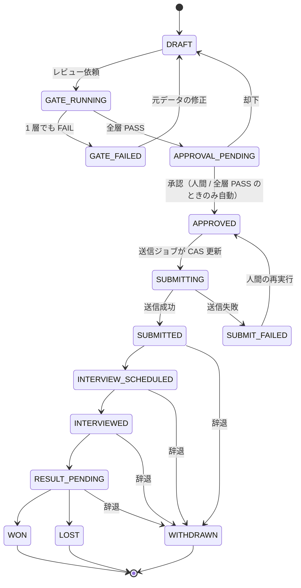
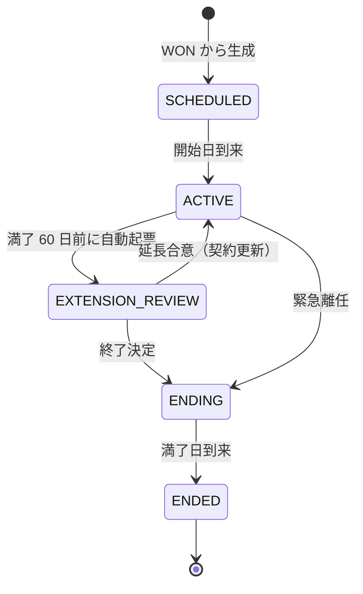
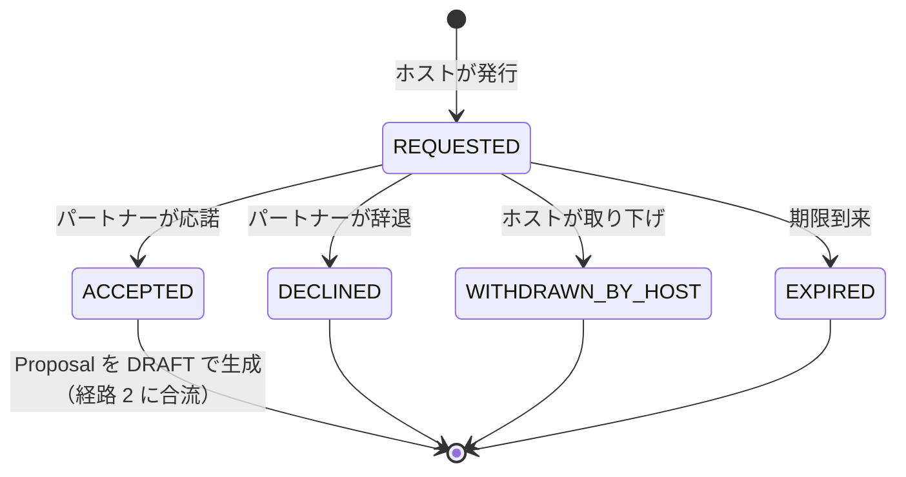
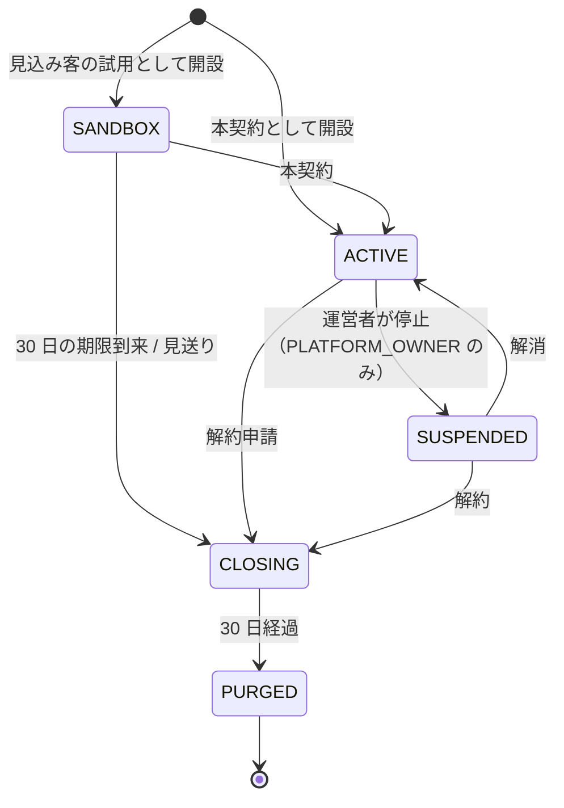
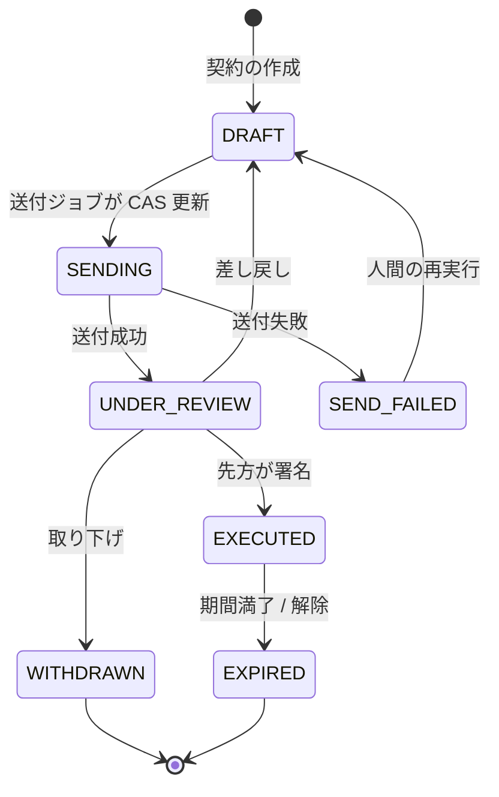

# 02. 機能要件定義書 — SES Platform（仮称）

> **位置づけ**: 本書は `CLAUDE.md`（一次資料）と `docs/01-business-requirements.md`（業務要件）を受けて、**「何ができるか」「どう判定するか」**を定義する。
> 実装方法（ライブラリ・テーブル・API パス）は書かない（`docs/03` / `docs/05` の領分）。画面は `docs/04` の領分であり、本書は画面 ID を確定しない。
> **矛盾する場合は `CLAUDE.md` が正。** 本書は `CLAUDE.md` のハードルールと `docs/01` の `BR-xx` を弱める記述を含まない。
> **プロダクト名「SES Platform」は仮称**（Issue #1 で確認中。`## Assumptions` A-01）。

**構成**: 1 機能一覧 / 2 機能詳細 / 3 ユースケース / 4 ロールと権限マトリクス / 5 ステートマシン定義 / 6 データ要件 / 7 非機能要件 / 8 AI 品質要件 / 9 対象外 / 付録（`## Assumptions` / `## Open Questions` / 申し送りマッピング / `BR` カバレッジ / 後続エージェントへの申し送り）

---

## 1. 機能一覧

### 1.1 表の読み方

| 列 | 意味 |
|---|---|
| **優先度** | `P0` = `CLAUDE.md` §5 の **Phase 0 / Phase 1（MVP）成功条件を満たすための最小集合**。`P1` = Phase 2（業務ループが閉じる）。`P2` = Phase 3 以降 |
| **フェーズ** | `CLAUDE.md` §5 / §10.6 のフェーズ |
| **平面** | `CLAUDE.md` §1.4。**主** = テナント平面（`/`）、**管** = 管理平面（`/admin`）。管理平面の画面 ID は `A-xxx` 系統を使う（§8.8） |
| **ステージ** | `CLAUDE.md` §1.3 の業務ループのステージ番号。①集める ②マッチング ③提案 ④商談・決定 ⑤契約 ⑥稼働・稼働後フォロー。該当しないものは `-`、全ステージ横断は `横断` |
| **BR** | `docs/01` 章 9 のビジネスルール。主要なもののみ記載（全対応は付録 D の `BR` カバレッジ表） |

🔴 **越境経路の対応**（`CLAUDE.md` §3.1 / `BR-05`）。**この 4 つ以外に越境経路を持つ機能は本書に存在しない。**

| 経路 | 内容 | 担当機能 |
|---|---|---|
| **経路 1** | 案件の公開 | `F-014` |
| **経路 2** | 提案と凍結されたエンジニア情報 | `F-019` |
| **経路 3** | チャット参加 | `F-038` |
| **経路 4** | 人材の匿名共有と提案依頼 | `F-016` / `F-017` / `F-018` |

### 1.2 主平面（テナント平面）

| ID | 機能 | 優先度 | フェーズ | 平面 | ステージ | 主な BR |
|---|---|---|---|---|---|---|
| `F-001` | テナント開設と初期設定 | P0 | Phase 0 | 主 | - | BR-01 / BR-02 |
| `F-002` | ユーザー招待・ロール割当・アカウント管理 | P0 | Phase 0 | 主 | - | BR-03 / BR-27 / BR-31 |
| `F-003` | 認証と 2 要素認証 | P0 | Phase 0 | 主 | - | BR-03 / BR-30 |
| `F-004` | 二重の情報境界の強制（テナント分離 + パートナースコープ） | P0 | Phase 0 | 主 | 横断 | BR-01〜BR-08 / BR-56 |
| `F-005` | 監査ログの記録 | P0 | Phase 0 | 主 / 管 | 横断 | BR-27 / BR-28 / BR-41 |
| `F-006` | 役割別ホーム（ダッシュボード） | P0 | Phase 0 | 主 | 横断 | BR-04 |
| `F-007` | 取引先企業の招待とパートナーアカウント管理 | P0 | Phase 1 | 主 | ① | BR-04 / BR-27 |
| `F-008` | エンジニア台帳の登録・編集 | P0 | Phase 1 | 主 | ① | BR-04 / BR-52 |
| `F-009` | エンジニアの複合検索 | P0 | Phase 1 | 主 | ①② | BR-04 / BR-06 / BR-55 |
| `F-010` | スキル辞書・別名の管理 | P0 | Phase 1 | 主 | ① | BR-02 |
| `F-011` | スキルシートのアップロードと版管理 | P0 | Phase 1 | 主 | ① | BR-26 / BR-15 |
| `F-012` | スキルシートの閲覧・ダウンロード | P0 | Phase 1 | 主 | ① | BR-28 / BR-31 |
| `F-013` | 案件の登録・編集（必須 / 尚可要件） | P0 | Phase 1 | 主 | ① | BR-52 |
| `F-014` | 案件の公開範囲設定（**越境経路 1**） | P0 | Phase 1 | 主 | ① | BR-05 / BR-15 / BR-27 |
| `F-015` | 案件の検索と一覧 | P0 | Phase 1 | 主 | ① | BR-04 |
| `F-016` | エンジニアの匿名共有設定（**越境経路 4** / パートナー側） | P0 | Phase 1 | 主 | ② | BR-53 / BR-56 |
| `F-017` | 匿名候補の表示と丸め（**越境経路 4** / ホスト側） | P0 | Phase 1 | 主 | ② | BR-54〜BR-56 / BR-58 / BR-59 |
| `F-018` | 提案依頼の発行と応答（`ProposalRequest`） | P0 | Phase 1 | 主 | ②③ | BR-57 / BR-59 / BR-60 / BR-33 |
| `F-019` | 提案の作成と情報凍結（**越境経路 2**） | P0 | Phase 1 | 主 | ③ | BR-06 / BR-59 |
| `F-020` | 品質ゲートの実行（3 層） | P0 | Phase 1 | 主 | ③ | BR-15 / BR-18 / BR-61 |
| `F-021` | 提案の承認・却下 | P0 | Phase 1 | 主 | ③ | BR-16 / BR-17 / BR-49 / BR-50 |
| `F-022` | 提案の送信（冪等） | P0 | Phase 1 | 主 | ③ | BR-21 / BR-22 / BR-45 / BR-46 |
| `F-023` | 送信失敗の一覧と人手による再送 | P0 | Phase 1 | 主 | ③ | BR-22 / BR-23 |
| `F-024` | 提案の状態管理・履歴・一覧フィルタ | P0 | Phase 1 | 主 | ③④ | BR-23 / BR-33 / BR-60 |
| `F-025` | 商談結果の記録（面談 / 決定 / 見送り / 辞退） | P0 | Phase 1 | 主 | ④ | BR-23 / BR-33 |
| `F-026` | 利用量の計測（AI / メール / ストレージ / 席） | P0 | Phase 1 | 主 / 管 | 横断 | BR-10 / BR-43 |
| `F-027` | 上限到達時の停止と残量・理由の表示 | P0 | Phase 1 | 主 | 横断 | BR-24 |
| `F-028` | 非本番環境であることの常時表示 | P0 | Phase 1 | 主 / 管 | 横断 | BR-48 |
| `F-029` | マッチングスコアの算出 | P1 | Phase 2 | 主 | ② | BR-14 |
| `F-030` | マッチング重みの設定（テナント単位） | P1 | Phase 2 | 主 | ② | BR-14 |
| `F-031` | 候補の根拠文生成（`match-explainer`） | P1 | Phase 2 | 主 | ② | BR-13 / BR-14 |
| `F-032` | スキルシートの構造化抽出（`sheet-parser`） | P1 | Phase 2 | 主 | ① | BR-11 / BR-13 / BR-20 |
| `F-033` | スキル表記の正規化と新語候補（`skill-normalizer`） | P1 | Phase 2 | 主 | ① | BR-13 / BR-20 |
| `F-034` | 提案ドラフトの生成（`proposal-drafter`） | P1 | Phase 2 | 主 | ③ | BR-11 / BR-12 / BR-13 |
| `F-035` | AI 運用ロールの承認モード設定 | P1 | Phase 2 | 主 | 横断 | BR-19 / BR-20 |
| `F-036` | AI 運用ロールのモデル設定 | P1 | Phase 2 | 主 | 横断 | BR-09 / BR-13 |
| `F-037` | 重複提案の検知（ホストのみ表示） | P1 | Phase 2 | 主 | ③ | BR-08 |
| `F-038` | チャット（**越境経路 3**） | P1 | Phase 2 | 主 | ③④ | BR-05 / BR-15 / BR-26 |
| `F-039` | 通知（アプリ内 / メール） | P1 | Phase 2 | 主 | 横断 | BR-34 / BR-24 |
| `F-040` | タスク（ToDo） | P1 | Phase 2 | 主 | ④⑤⑥ | BR-34 |
| `F-041` | 面談日程調整の連絡 | P1 | Phase 2 | 主 | ④ | BR-21 / BR-22 |
| `F-042` | 稼働（`Assignment`）の登録と管理 | P1 | Phase 2 | 主 | ⑥ | BR-33 |
| `F-043` | 満了アラートと延長確認の自動起票 | P1 | Phase 2 | 主 | ⑥ | BR-34 / BR-33 |
| `F-044` | 延長確認の論点整理（`renewal-advisor`） | P1 | Phase 2 | 主 | ⑥ | BR-12 / BR-13 |
| `F-045` | 稼働終了と ① への自動還流 | P1 | Phase 2 | 主 | ⑥→① | BR-35 |
| `F-046` | 個人情報の保持期間管理と削除 | P1 | Phase 2 | 主 | ① | BR-29 / BR-52 |
| `F-047` | 契約管理（NDA / 基本契約 / 個別契約） | P2 | Phase 3 | 主 | ⑤ | BR-33 / BR-15 |
| `F-048` | 契約書テンプレートの差し込み生成 | P2 | Phase 3 | 主 | ⑤ | BR-15 / BR-12 |
| `F-049` | 電子署名依頼と締結状態の追跡 | P2 | Phase 3 | 主 | ⑤ | BR-21 / BR-22 / BR-24 / BR-51 |
| `F-050` | 発注・請求の記録 | P2 | Phase 3 | 主 | ⑤ | BR-27 |
| `F-051` | KPI ダッシュボード（提案 → 面談 → 決定の転換率） | P2 | Phase 3 | 主 | 横断 | BR-23 / BR-60 |
| `F-052` | データ一括エクスポート（運用機能。書式・項目の選択） | P2 | Phase 3 | 主 | - | BR-29 / BR-40 |
| `F-053` | デモ環境の合成データ一式とリセット | P0 | Phase 1 | 主 / 管 | 横断 | BR-47 / BR-63 / BR-45 |
| `F-054` | `sandbox` テナントの期限管理と本契約への移行 | P0 | Phase 1 | 主 / 管 | - | BR-62 / BR-64 |
| `F-064` | サンドボックス期限到来・解約時のデータ削除と返却（最小版） | P0 | Phase 1 | 主 | - | BR-62 / BR-64 / BR-29 / BR-40 |

### 1.3 管理平面（運営者コンソール）

**`CLAUDE.md` §10.4 の 8 機能はすべて機能 ID を持つ**（下表の「§10.4」列）。**管理平面の機能は §1.3 の業務ループのステージに属さないため、ステージ列はすべて `-` である。**

| ID | 機能 | 優先度 | フェーズ | 平面 | ステージ | §10.4 | 主な BR |
|---|---|---|---|---|---|---|---|
| `F-055` | 運営者認証（別テーブル・別認証・2FA 必須） | P0 | Phase 0 | 管 | - | 前提 | BR-36 / BR-30 / BR-41 |
| `F-056` | テナント一覧・詳細と健全性監視 | P0 | Phase 0（一覧）/ Phase 1（健全性） | 管 | - | #1 | BR-37 / BR-40 |
| `F-057` | 利用量・クォータ管理 | P0 | Phase 1 | 管 | - | #3 | BR-43 / BR-24 / BR-44 |
| `F-058` | 監査ログの横断検索（PII マスキング） | P0 | Phase 1 | 管 | - | #6 | BR-42 / BR-40 |
| `F-059` | 運用監視（失敗ジョブ・滞留・異常検知） | P0 | Phase 1 | 管 | - | #5 | BR-23 / BR-26 / BR-40 |
| `F-060` | 代理閲覧（サポート） | P1 | Phase 2 | 管 | - | #7 | BR-38 / BR-39 / BR-40 |
| `F-061` | お知らせ・機能フラグ | P1 | Phase 2 | 管 | - | #8 | BR-37 / BR-24 |
| `F-062` | 契約管理（プラン変更・トライアル・停止 / 再開・請求） | P2 | Phase 3 | 管 | - | #4 | BR-44 / BR-37 / BR-64 |
| `F-063` | 原価・粗利ダッシュボード | P2 | Phase 3 | 管 | - | #2 | BR-10 / BR-43 |

### 1.4 P0 が MVP の最小集合であることの確認

`CLAUDE.md` §5 の成功条件と P0 機能の対応。**P0 に、この対応表のいずれの行にも寄与しない機能は含めない。**

| §5 の成功条件 | 満たす P0 機能 |
|---|---|
| Phase 0: URL 直打ち・API 直叩きのいずれでも他テナント / 他パートナーのデータが 1 件も取得できない | `F-001` `F-002` `F-003` `F-004` `F-005` `F-006` `F-055` `F-056` |
| Phase 1: 「案件登録 → パートナーへ公開 → パートナーが提案 → ゲート実行 → ホストが承認 → 送信 → 結果記録」を E2E で完遂できる | `F-007` `F-008` `F-010` `F-011` `F-013` `F-014` `F-015` `F-019` `F-020` `F-021` `F-022` `F-023`（送信経路の一部。`BR-22` の人手再送）`F-024` `F-025` |
| Phase 1: ゲート FAIL の提案が送信できない | `F-020` `F-021` `F-022` |
| Phase 1: 共有可のエンジニアがホストの検索結果に匿名 5 項目でのみ現れ、`Proposal` 作成まで実名等に到達できない | `F-009` `F-016` `F-017` `F-018` `F-019` |
| Phase 1（`CLAUDE.md` §10.6 / `BR-43`）: AI・メール・ストレージの計測を Phase 1 から行う | `F-026` `F-027` `F-057` `F-058` `F-059` |
| Phase 1（`docs/01` 章 11.3-4 / `BR-62`）: デモ環境とサンドボックス環境が Phase 1 完了時点で用意され、**サンドボックスに本番と同じ統制（保持期間・削除・返却を含む）が Phase 1 時点で効いている** | `F-028` `F-053` `F-054` `F-064` |
| スキルシートの閲覧・DL の監査ログ欠落 0 件（§7） | `F-005` `F-012` |

---

## 2. 機能詳細

各機能を「目的 / 入力 / 処理 / 出力 / AI 利用 / 外部 API 依存 / 受け入れ基準 / 関連ロール」の 8 項目で定義する。
受け入れ基準は `AC-n` の連番で機能内に閉じる（参照は `F-020 AC-3` のように書く）。**改訂で他機能へ移設した番号は欠番として残し、詰めない**（`F-046 AC-5`〜`AC-7` → `F-064 AC-2`〜`AC-4`）。既存の参照を壊さないため。

### 2.1 基盤（Phase 0）

#### F-001 テナント開設と初期設定

- **目的**: 契約 SES 企業を分離の単位として開設し、以後のすべての業務データがその単位に閉じることを成立させる（`docs/01` 章 4 / `BR-01` / `BR-02`）。
- **入力**: 企業名・商号、契約プラン、環境種別（`production` / `sandbox` / `demo`）、初期 `OWNER` の氏名とメールアドレス、テナント設定（タイムゾーン、通貨は日本円固定）。
- **処理**: ①運営者（`F-055`）または初期セットアップ経路からテナントを作成する ②初期 `OWNER` を 1 名作成し招待メールを送る ③テナント既定設定（自動承認 = 無効、AI ロール承認モード = すべて都度承認、公開範囲の既定 = 非公開）を投入する ④開設を監査ログに記録する。
- **出力**: 開設済みテナント、初期 `OWNER` の招待、テナント設定の初期値、監査ログ。
- **AI 利用**: なし。
- **外部 API 依存**: メール送信（招待）。`production` 以外では送信系はモック（`F-028` / 章 7.6）。
- **受け入れ基準**:
  - AC-1 テナント作成直後の既定値は、自動承認 = 無効・AI ロール承認モード = すべて都度承認・案件の公開範囲 = 誰にも公開されない、である。
  - AC-2 別テナントとして作成した 2 件のテナントについて、一方の `OWNER` の認証で他方のデータを取得しようとすると、画面・API のいずれからも 0 件が返る（`F-004 AC-1`）。
  - AC-3 テナント名・プラン・環境種別・開設者が監査ログに記録される。
- **関連ロール**: `PLATFORM_OWNER`（作成）、`OWNER`（初期設定）。

#### F-002 ユーザー招待・ロール割当・アカウント管理

- **目的**: テナント内の利用者を、ロールに紐づく権限とともに管理する（`BR-03` / `BR-27` / `BR-30` / `BR-31`）。
- **入力**: 招待先メールアドレス、付与ロール（`OWNER` / `ADMIN` / `SALES` / `PARTNER_ADMIN` / `PARTNER_SALES` / `VIEWER`）、パートナー所属の場合は所属パートナー企業、無効化・ロール変更の指示。
- **処理**: ①招待を作成し、期限付きの招待メールを送る ②被招待者が受諾するとアカウントと所属（ロール + パートナー所属）が確定する ③ロール変更・無効化を反映する ④招待・受諾・ロール変更・無効化を監査ログに記録する。
- **出力**: 利用者アカウント、所属とロール、招待の状態、監査ログ。
- **AI 利用**: なし。
- **外部 API 依存**: メール送信（招待・ロール変更通知）。上限は `F-027` のガードに従う。
- **受け入れ基準**:
  - AC-1 パートナー所属のロール（`PARTNER_ADMIN` / `PARTNER_SALES`）は、必ず 1 社のパートナー企業に紐づく。パートナー企業を持たない状態では作成できない。
  - AC-2 `OWNER` / `ADMIN` を付与した利用者は、2 要素認証を設定するまで業務画面に到達できない（`F-003 AC-2`）。
  - AC-3 ロールの変更・無効化は、実施者・対象・変更前後のロール・日時が監査ログに残る。
  - AC-4 `PARTNER_ADMIN` は自社（自パートナー企業）配下のアカウントのみ招待・変更でき、他社および自社（ホスト）のアカウントは一覧にも現れない。
- **関連ロール**: `OWNER` / `ADMIN`（テナント全体）、`PARTNER_ADMIN`（自社配下のみ）。

#### F-003 認証と 2 要素認証

- **目的**: 「どのテナント・どのパートナーの利用者か」を認証コンテキストのみから決定し、入力で切り替えられない状態にする（`BR-03` / `BR-30`）。
- **入力**: 認証情報、2 要素認証のコード、セッション。
- **処理**: ①認証を行い、テナント・パートナー所属・ロールを認証コンテキストに確定する ②`OWNER` / `ADMIN` は 2 要素認証を必須とし、未設定なら設定フローへ誘導する ③ログイン・ログアウト・失敗を監査ログに記録する。
- **出力**: 認証済みセッション（テナント・パートナー所属・ロールを含む）、監査ログ。
- **AI 利用**: なし。
- **外部 API 依存**: メール送信（パスワード再設定等）。
- **受け入れ基準**:
  - AC-1 リクエストのボディ・クエリ・パスにテナント識別子やパートナー識別子を含めても、参照範囲は変化しない（`F-004 AC-2`）。
  - AC-2 `OWNER` / `ADMIN` は 2 要素認証を未設定のまま業務データを取得できない。それ以外のロールは任意設定でき、未設定でも利用できる。
  - AC-3 ログイン・ログアウト・認証失敗が監査ログに記録される。
- **関連ロール**: 全テナントロール。

#### F-004 二重の情報境界の強制（テナント分離 + パートナースコープ）

- **目的**: `CLAUDE.md` §3.1 の二重境界を、機能として全画面・全経路に適用する。**越境は 4 経路のみ**とし、パートナー同士が相互参照できる経路を 1 つも作らない（`BR-01`〜`BR-08` / `BR-53`〜`BR-59`）。
- **入力**: 認証コンテキスト（テナント / パートナー所属 / ロール）、参照対象の種別と識別子。
- **処理**: ①すべての業務データ参照に対しテナント境界を適用する ②パートナー所属の利用者にはパートナー境界を重ねて適用する ③越境が許されるのは経路 1〜4 の定義に合致する場合のみで、それ以外は 0 件として扱う ④存在しないものとして扱うため、件数・存在の示唆も返さない ⑤**テナントのライフサイクル状態（章 5.4）が `SUSPENDED` / `CLOSING` の場合、境界判定と同じ経路で実行系の操作を拒否する**（ロールの権限より優先する）。
- **出力**: 境界適用後の参照結果、越境試行の記録、ライフサイクル状態による拒否の記録。
- **AI 利用**: なし。
- **外部 API 依存**: なし。
- **受け入れ基準**:
  - AC-1 2 テナント × 2 パートナーを投入した状態で、URL 直打ち・API 直叩きのいずれでも他テナント / 他パートナーのデータが **1 件も取得できない**。
  - AC-2 参照範囲の判定に、リクエスト入力に含まれる識別子を一切用いない。入力を改変しても結果が変わらない。
  - AC-3 パートナー所属の利用者の画面・一覧・検索結果・集計・通知・エクスポートのいずれにも、**他パートナーが持ち込んだエンジニア・提案・チャット・匿名候補が現れない**。
  - AC-4 同一案件に複数社が提案していても、パートナーには**他社提案の存在・件数・単価・エンジニア名のいずれも表示されず、「他にも提案があります」といった示唆も表示されない**（`BR-07`）。件数バッジ・並び順の変化・「あなたは N 番目」といった間接的な露出も含めて存在しない。
  - AC-5 越境が成立するのは経路 1（`F-014`）・経路 2（`F-019`）・経路 3（`F-038`）・経路 4（`F-016`〜`F-018`）に限られ、他の機能はいずれも越境読み取りを行わない。
  - AC-6 `VIEWER` は承認・送信・ダウンロードの操作を実行できず、その導線も表示されない（`BR-31`）。
  - AC-7 テナントが `SUSPENDED` の間、**実行系の操作**（提案の承認 `F-021` / 送信・再送 `F-022` `F-023` / 面談調整の連絡 `F-041` / 契約書の送付・電子署名依頼 `F-047` `F-049` / 提案依頼の発行 `F-018`）は、`OWNER` を含むすべてのロールで拒否され、導線も表示されない。**ログインと閲覧は可能で、データは削除されない**（章 5.4）。**`SUSPENDED` への遷移が成立するのは Phase 3（章 5.4 遷移 3）であり、Phase 1 に存在する停止相当の状態は `CLOSING` のみで AC-8 が扱う。** 列挙した拒否対象のうち Phase 1 に存在するのは `F-018` / `F-021` / `F-022` / `F-023` で、残りは各機能のフェーズ到来とともに拒否対象に加わる。
  - AC-8 テナントが `CLOSING` の間、業務データの**新規作成**（エンジニア・案件・提案・チャット・契約）と実行系の操作ができず、実行できるのは閲覧と返却（エクスポート）のみである（**Phase 1 は `F-064`** / Phase 3 の運用機能は `F-052`。章 5.4）。
  - AC-9 AC-7 / AC-8 の拒否は、画面の導線非表示だけでなく **API を直接呼んでも拒否される**。拒否の理由（停止中 / 解約手続き中）が利用者に表示される。
- **関連ロール**: 全テナントロール（適用対象）。設定変更は不可（コードとデータ構造で担保する統制であり、画面設定を持たない）。**テナントのライフサイクル状態（章 5.4）はテナント側のどのロール（`OWNER` を含む）からも変更できない。** 変更できるのは `PLATFORM_OWNER` の明示操作、または期限到来による `system` の自動遷移のみである（**Phase 1 は `F-054`**（`SANDBOX` → `ACTIVE` / `SANDBOX` → `CLOSING`）**と `F-064`**（`CLOSING` → `PURGED`。`system`）、**Phase 3 以降の停止・解消・解約は `F-062`**）。

#### F-005 監査ログの記録

- **目的**: 「誰が・いつ・何をしたか」を後から取引先・社内・運営者に説明できる状態を保つ（`BR-27` / `BR-28` / `BR-41`）。
- **入力**: 操作の主体（テナント利用者 / 運営者 / `system`）、操作種別、対象、日時、代理閲覧セッション識別子（該当時）。
- **処理**: ①`BR-27` に列挙された操作を記録する（ログイン・ログアウト、エンジニア詳細とスキルシートの閲覧・ダウンロード、案件詳細の閲覧、作成・更新・削除、提案の送信、承認・却下、権限変更、公開範囲の変更、代理閲覧、運営者の全操作）②記録に失敗した場合、対象操作を成立させない ③テナント管理者向けに自テナント分を検索できるようにする。
- **出力**: 監査ログ、テナント管理者向けの検索結果。
- **AI 利用**: なし。
- **外部 API 依存**: なし。
- **受け入れ基準**:
  - AC-1 `BR-27` の 11 種の操作それぞれについて、実行後に対応する監査ログが 1 件生成される。
  - AC-2 スキルシートの閲覧・ダウンロードは、**デスクトップ・モバイル・共有 URL 経由のいずれでも**記録される。記録できない経路が存在しない（`BR-28`。欠落 0 件）。
  - AC-3 監査ログは利用者・運営者のいずれからも編集・削除できない。
  - AC-4 自動承認・自動起票など `system` が主体の操作は、主体が `system` として記録される。
- **関連ロール**: 記録対象は全ロール。閲覧は `OWNER` / `ADMIN`（自テナント）、運営者は `F-058`。

#### F-006 役割別ホーム（ダッシュボード）

- **目的**: ロールごとに「いま自分がやるべきこと」を提示し、`docs/01` 章 2.3 の「見えない範囲が明確でないと不信を招く」に応える。
- **入力**: 認証コンテキスト、自分に割り当てられたタスク・通知・状態別の件数。
- **処理**: ①ロール別に表示ブロックを決める（自社営業 = 承認待ち / 送信失敗 / 満了間近、パートナー = 公開案件 / 提案依頼 / 自社提案の状態、管理者 = メンバーと利用量）②`F-004` の境界適用後の件数のみを集計する ③パートナーには「何が見えて何が見えないか」の説明を常時表示する。**表示ブロックは対応機能のフェーズに追随する** — Phase 0 は空のダッシュボード（`CLAUDE.md` §5）、承認待ち・送信失敗・公開案件・提案依頼は Phase 1、`満了間近` は `F-043` が入る Phase 2 から表示される。**ブロックが未実装であることを理由に、境界（②）や説明（③）を省略しない。**
- **出力**: ロール別ホーム画面の表示データ。
- **AI 利用**: なし。
- **外部 API 依存**: なし。
- **受け入れ基準**:
  - AC-1 パートナー所属の利用者のホームに表示される全件数が、自社が持ち込んだ情報および自社に公開された情報のみから算出される。
  - AC-2 パートナー所属の利用者のホームに、「自社に見えない情報が存在すること」を示す説明文が常時表示され、その説明文自体は他社の件数・存在を含まない。
  - AC-3 `VIEWER` のホームには承認・送信・ダウンロードの導線が存在しない。
- **関連ロール**: 全テナントロール。

### 2.2 ① 集める（Phase 1）

#### F-007 取引先企業の招待とパートナーアカウント管理

- **目的**: 取引先企業をパートナースコープの単位として登録し、その配下の利用者がテナント内で自社の情報だけを扱える状態を作る（`BR-04` / `BR-27`）。
- **入力**: 取引先企業名・商号・担当者情報、招待先メールアドレス、パートナーの状態（有効 / 停止）。
- **処理**: ①ホストの `ADMIN` が取引先企業を登録する ②`PARTNER_ADMIN` を招待する（`F-002`）③受諾後、そのパートナー企業に紐づくアカウントを `PARTNER_ADMIN` が自ら追加できる ④停止時は配下アカウントの業務操作を止める（データは残す）⑤登録・招待・停止を監査ログに記録する。
- **出力**: パートナー企業、配下アカウント、招待の状態、監査ログ。
- **AI 利用**: なし。
- **外部 API 依存**: メール送信（招待）。
- **受け入れ基準**:
  - AC-1 パートナー企業の一覧・詳細を参照できるのはホスト所属ロール（`OWNER` / `ADMIN` / `SALES` / `VIEWER`）のみで、`PARTNER_ADMIN` / `PARTNER_SALES` には**自社 1 社以外のパートナー企業が一覧にも件数にも現れない**。
  - AC-2 パートナーを停止すると、その配下アカウントは提案作成・送信・チャット投稿ができなくなり、既存データは削除されない。
  - AC-3 パートナー企業の登録・招待・停止・再開が監査ログに残る。
- **関連ロール**: `OWNER` / `ADMIN`（登録・招待・停止）、`PARTNER_ADMIN`（自社配下の管理）。

#### F-008 エンジニア台帳の登録・編集

- **目的**: 自社・取引先の双方のエンジニアを、同じ土俵で検索できる形に整える（`docs/01` 章 6.1 / `BR-04` / `BR-52`）。
- **入力**: 氏名（社内表示用）、所属区分（自社 / パートナー）、スキルと経験年数・レベル、経験内容と従事期間、稼働可能時期、単価レンジ、希望条件、勤務地・リモート可否、連絡先（必要最小限）、稼働状況。
- **処理**: ①入力項目は `BR-52` の範囲（SES の営業判断に必要な情報）に限る ②スキルは `F-010` の辞書から選ぶ（自由入力は別名候補として起票）③登録者の所属に応じて所有パートナーを自動で確定する（入力で指定させない）④作成・更新・削除を監査ログに記録する。
- **出力**: エンジニア台帳のレコード、スキル関連、稼働状況、監査ログ。
- **AI 利用**: なし（構造化抽出は `F-032`、正規化は `F-033`）。
- **外部 API 依存**: なし。
- **受け入れ基準**:
  - AC-1 本籍・家族構成・健康情報・信条にあたる入力項目が、既定の入力項目としても自由記述欄の推奨用途としても存在しない（`BR-52`）。
  - AC-2 パートナー所属の利用者が登録したエンジニアの所有パートナーは、認証コンテキストから決まる。リクエスト入力で他社を指定しても変更されない。
  - AC-3 ホスト所属の利用者は、他パートナーが登録したエンジニアの実名・所属会社名・スキルシートに到達できない（到達できるのは `F-017` の匿名 5 項目、または `F-019` の提案時点情報のみ）。
  - AC-4 エンジニア詳細の閲覧が監査ログに記録される。
- **関連ロール**: `SALES` / `ADMIN`（自社エンジニア）、`PARTNER_ADMIN` / `PARTNER_SALES`（自社エンジニア）、`VIEWER`（閲覧のみ）。

#### F-009 エンジニアの複合検索

- **目的**: 候補の探索を「記憶」から「検索」に置き換える（`docs/01` 章 6.2 / `G-5`）。**Phase 1 における匿名候補の出方の起点**でもある。
- **入力**: スキル（複数・AND / OR）、経験年数、単価レンジ、稼働可能時期、勤務地・リモート可否、所属区分、稼働状況、フリーワード。加えて絞り込みチェックボックス「開始日に間に合う人だけ」「通勤可能な人だけ」。
- **処理**: ①検索条件を境界適用後の母集団に対して評価する（ホスト = 自社台帳 + `F-017` の匿名候補、パートナー = 自社台帳のみ）②**Phase 1 の並び順は、検索条件への適合と更新日時による決定的な順序**とする。重みという概念を持たない ③Phase 2 では `F-029` のスコア順に切り替わる ④匿名候補は `F-017` の表示規則に従って混在表示する。
- **出力**: 候補一覧（自社エンジニアと匿名候補が混在）、絞り込み結果件数。
- **AI 利用**: なし。**Phase 1・Phase 2 のいずれでも、並び順・順位を LLM が決めることはない**（`BR-14`）。
- **外部 API 依存**: なし。
- **受け入れ基準**:
  - AC-1 同一の検索条件・同一のデータ状態に対して、**実行のたびに同じ並び順が返る**（決定的順序）。
  - AC-2 Phase 1 の検索結果に、スコア・順位・重みに相当する表示項目が存在しない。
  - AC-3 パートナーが実行した検索の結果に、他パートナーのエンジニアおよび匿名候補が 1 件も含まれない（`BR-56`）。
  - AC-4 エンジニア 1 万件・案件 1 万件の状態で、複合検索の応答が p95 1 秒以内（章 7.1）。
  - AC-5 「開始日に間に合う人だけ」「通勤可能な人だけ」は既定オフであり、オフのときは開始日が遅い候補・勤務地が合わない候補も一覧に現れる（`## Assumptions` A-03）。
- **関連ロール**: `SALES` / `ADMIN` / `OWNER`（ホスト母集団）、`PARTNER_ADMIN` / `PARTNER_SALES`（自社母集団のみ）、`VIEWER`（閲覧のみ）。

#### F-010 スキル辞書・別名の管理

- **目的**: 「Java / JavaSE / Java8」のような表記ゆれを吸収し、検索とマッチングの母集団が表記で欠けないようにする（`docs/01` 章 6.1）。
- **入力**: スキル辞書の項目（グローバル）、テナント固有の別名、新語候補（`F-033` から起票されるものを含む）、採否の判断。
- **処理**: ①グローバル辞書を参照し、テナント固有の別名を追加できる ②辞書に無い語は新語候補として起票し、**採用されるまで辞書に追加しない** ③採否と、採用時の正規化先を記録する。
- **出力**: 有効なスキル語彙、テナント別名、新語候補の一覧と採否履歴。
- **AI 利用**: なし（正規化の提案は `F-033`）。
- **外部 API 依存**: なし。
- **受け入れ基準**:
  - AC-1 新語候補は、`ADMIN` または `SALES` が明示的に採用するまで検索の正規化に使われない。
  - AC-2 テナント固有の別名は他テナントに影響しない。グローバル辞書はテナントから編集できない（`BR-02` の射程）。
  - AC-3 別名の採用・却下が監査ログに残る。
- **関連ロール**: `ADMIN` / `SALES`（採否）、`PARTNER_ADMIN` / `PARTNER_SALES`（候補の起票のみ）、`VIEWER`（閲覧のみ）。

#### F-011 スキルシートのアップロードと版管理

- **目的**: スキルシートを版付きで保管し、**安全と判定されるまで外部に渡らない**状態を保つ（`BR-26` / `BR-15`）。
- **入力**: ファイル（xlsx / docx / pdf 等）、対象エンジニア、版のメモ。
- **処理**: ①アップロードを受け付け、版を採番する ②ウイルススキャンを実行し、結果が `CLEAN` になるまで共有 URL を発行しない ③`CLEAN` になった版のみ最新版フラグを持てる ④スキャン失敗・感染検出時は隔離し、担当者と `F-059` に通知する（**Phase 1 の担当者への周知はアプリ内表示とメール送信**（`F-001` / `F-002` と同じ送信経路）。Phase 2 以降は `F-039` に集約する）⑤アップロード・版の切替を監査ログに記録する。
- **出力**: スキルシートの版、スキャン結果、最新版フラグ、監査ログ。
- **AI 利用**: なし（本文の構造化抽出は `F-032`）。
- **外部 API 依存**: ウイルススキャン。`production` 以外の扱いは章 7.6。
- **受け入れ基準**:
  - AC-1 スキャンが `CLEAN` でないファイルについて、共有 URL の発行・提案への添付・チャットへの添付のいずれもできない（導線が存在しない）。
  - AC-2 スキャンが完了していないファイルは、状態が「検査中」と表示され、共有操作が選択できない。
  - AC-3 感染を検出したファイルは隔離され、以後どのロールからもダウンロードできない。
  - AC-4 アップロード・版の切替・削除が監査ログに残る。
- **関連ロール**: `SALES` / `ADMIN` / `PARTNER_ADMIN` / `PARTNER_SALES`（自社エンジニア分）、`VIEWER`（閲覧のみ・ダウンロード不可）。

#### F-012 スキルシートの閲覧・ダウンロード

- **目的**: 「誰の経歴を、誰が、いつ見たか」を欠落なく記録し、取引先への説明責任を果たす（`BR-28`（欠落 0 件）/ `BR-31`）。
- **入力**: 対象スキルシートの版、閲覧 / ダウンロードの別、要求元のロールとデバイス。
- **処理**: ①`F-004` の境界を適用して可否を決める ②`VIEWER` はダウンロードを拒否する ③閲覧・ダウンロードのそれぞれを監査ログに記録する ④記録に失敗した場合はファイルを返さない。
- **出力**: 閲覧表示 / ファイル、監査ログ。
- **AI 利用**: なし。
- **外部 API 依存**: オブジェクトストレージ（署名付き URL の発行）。
- **受け入れ基準**:
  - AC-1 デスクトップ・モバイル・共有 URL のいずれの経路でも、閲覧とダウンロードが個別に監査ログへ記録される（`BR-28`）。
  - AC-2 監査ログの書き込みが失敗した場合、ファイルの内容は返らない（記録なしの閲覧が成立しない）。
  - AC-3 `VIEWER` はダウンロード操作を実行できず、導線も表示されない。閲覧は可能。
  - AC-4 ホスト所属の利用者は、パートナー所属エンジニアのスキルシートに、`Proposal` が作成される前は到達できない（`BR-59`）。
- **関連ロール**: `OWNER` / `ADMIN` / `SALES` / `PARTNER_ADMIN` / `PARTNER_SALES`（境界内）、`VIEWER`（閲覧のみ）。

#### F-013 案件の登録・編集（必須 / 尚可要件）

- **目的**: 案件を、マッチングと品質ゲートが機械的に照合できる構造で登録する（`docs/01` 章 6.1）。
- **入力**: 案件名、エンド企業名・商流情報（内部用）、必須要件と尚可要件（スキル・経験年数・その他）、単価レンジ、稼働開始日、勤務地・リモート可否、募集人数、案件の状態（募集中 / 充足 / 後任募集）。
- **処理**: ①要件を「必須」「尚可」に切り分けて登録する ②内部用の商流情報（エンド企業名・自社単価）は、公開範囲の外に出さない項目として保持する ③後任募集は `F-045` から自動生成されうる ④作成・更新・詳細閲覧を監査ログに記録する。
- **出力**: 案件、要件、案件の状態、監査ログ。
- **AI 利用**: なし。
- **外部 API 依存**: なし。
- **受け入れ基準**:
  - AC-1 必須要件と尚可要件が別の区分として保持され、`F-020` の整合層と `F-029` の足切りが区分を参照できる。
  - AC-2 エンド企業名と内部単価は、公開範囲に含まれる相手の画面・エクスポート・通知のいずれにも表示されない（`F-014 AC-3`）。
  - AC-3 案件詳細の閲覧が監査ログに記録される（`BR-27`）。
- **関連ロール**: `SALES` / `ADMIN`（登録・編集）、`PARTNER_ADMIN` / `PARTNER_SALES`（公開された案件の閲覧のみ）、`VIEWER`（閲覧のみ）。

#### F-014 案件の公開範囲設定（越境経路 1）

- **目的**: 案件をどの取引先に見せるかを**明示的に**指定する。既定で広げない（`BR-05` 経路 1 / `BR-15` / `BR-27`）。
- **入力**: 案件、公開先パートナー企業の集合、公開する項目のプロファイル（外部公開用の記載）、公開 / 非公開の切替。
- **処理**: ①公開先を明示的に選択する（既定は誰にも公開されない）②公開時に品質ゲート（`F-020`）を実行し、PII 層・商流層で FAIL したら公開しない ③公開範囲の変更を監査ログに記録する ④公開解除時、その案件は対象パートナーの一覧から消える（作成済みの提案は残る）。
- **出力**: 公開範囲、公開用の案件表示、ゲート結果、監査ログ。
- **AI 利用**: `gate-inspector`（`F-020` 経由）。
- **外部 API 依存**: なし（通知は `F-039`）。
- **受け入れ基準**:
  - AC-1 公開範囲に含まれないパートナーの画面・検索・件数・通知のいずれにも、その案件が現れない。
  - AC-2 公開範囲は「全公開」を既定値として持たない。新規案件の初期状態は非公開である。
  - AC-3 公開された案件の表示に、エンド企業名・内部単価・他社名が含まれない（`F-020` の商流層 FAIL となり公開できない）。
  - AC-4 公開先パートナーは、同じ案件に公開されている他のパートナーの社名・件数を知る手段を持たない（`BR-07`）。
  - AC-5 公開範囲の変更が、実施者・変更前後の公開先とともに監査ログに残る。
- **関連ロール**: `SALES` / `ADMIN`（設定）、`OWNER`（設定）、`VIEWER`（閲覧のみ）。

#### F-015 案件の検索と一覧

- **目的**: 自社案件（ホスト）と公開された案件（パートナー）を、それぞれの母集団の中で探せるようにする。
- **入力**: スキル要件、単価レンジ、開始日、勤務地・リモート可否、案件の状態、フリーワード。
- **処理**: ①`F-004` の境界適用後の母集団に対して検索する ②パートナーの母集団は「自社に公開された案件」に限る ③並び順は決定的（更新日時・開始日）。
- **出力**: 案件一覧、件数。
- **AI 利用**: なし。
- **外部 API 依存**: なし。
- **受け入れ基準**:
  - AC-1 パートナーの検索結果は、自社に公開された案件のみで構成される。総件数の表示も同じ母集団から算出される。
  - AC-2 案件 1 万件の状態で検索応答が p95 1 秒以内（章 7.1）。
  - AC-3 同一条件・同一データで並び順が常に同じ。
- **関連ロール**: 全テナントロール（母集団は所属による）。

#### F-016 エンジニアの匿名共有設定（越境経路 4 / パートナー側）

- **目的**: パートナーが「自社の台帳を開かずに商談機会だけを受け取る」ための opt-in を提供する（`BR-53` / `BR-56`）。**主導権は最後までパートナーにある。**
- **入力**: 対象エンジニア、共有可 / 共有停止の指定、共有時に用いる 5 項目の元データ（スキル / 経験年数 / 単価レンジ / 稼働可能時期 / 勤務地・リモート可否）。
- **処理**: ①**既定は共有オフ**。パートナーの明示的な操作でのみ共有可になる ②共有可のエンジニアは `F-017` の匿名候補としてホストの母集団に加わる ③**共有停止の操作は即時に反映され、その時点でホストの候補一覧から消える** ④共有の開始・停止を監査ログに記録する ⑤共有中でも、実名・所属会社名・スキルシートはホストに渡らない。
- **出力**: 共有設定（`EngineerShare`）、監査ログ。
- **AI 利用**: なし。
- **外部 API 依存**: なし。
- **受け入れ基準**:
  - AC-1 エンジニア新規登録直後の共有設定は必ずオフである。一括で全件をオンにする既定操作は存在しない。
  - AC-2 共有を停止した直後にホストが検索を実行すると、その候補が結果に含まれない（キャッシュ等による遅延表示も含めて現れない）。
  - AC-3 共有中の候補について、ホストからは実名・所属会社名・社内 ID・スキルシートのいずれにも到達できない（`F-017 AC-1` / `BR-59`）。
  - AC-4 共有の開始・停止が、実施者・対象・日時とともに監査ログに残る。
  - AC-5 他のパートナーは、あるパートナーが共有している候補の存在・件数を知る手段を持たない（`BR-56`）。
- **関連ロール**: `PARTNER_ADMIN` / `PARTNER_SALES`（自社エンジニアの共有設定）。ホスト側ロールはこの設定を変更できない。

#### F-017 匿名候補の表示と丸め（越境経路 4 / ホスト側）

- **目的**: ホストが取引先の人材を能動的に探せる唯一の経路を、**再識別されない粒度**で提供する（`BR-54` / `BR-55` / `BR-56` / `BR-58` / `BR-59` / `R-9` / `Q-17`）。
- **入力**: `F-016` で共有可になったエンジニアの 5 項目、ホストの検索条件（`F-009`）、Phase 2 ではマッチングスコア（`F-029`）。
- **処理**: ①開示は **5 項目のみ**（スキル / 経験年数 / 単価レンジ / 稼働可能時期 / 勤務地・リモート可否）②表示前に丸める — 経験年数は範囲（`3〜5 年` / `5〜10 年` / `10 年以上`）、単価は 5 万円刻み、稼働可能時期は月単位、勤務地は都県 + リモート区分（区市町村は出さない）、スキルはそのまま（`## Assumptions` A-04）③候補には**案件をまたいで同一人物を追跡できる識別子を出さない** ④Phase 1 は `F-009` の決定的な並び順の中に自社エンジニアと混在させる。Phase 2 は `F-029` のスコア順に並べ、**匿名のまま**順位が付く ⑤候補に付く操作は `F-018` の提案依頼のみ。
- **出力**: 匿名候補の一覧表示、提案依頼への導線。
- **AI 利用**: なし。Phase 2 の根拠文（`F-031`）は匿名候補にも付くが、**根拠文にも 5 項目を超える情報を含めない**（`F-031 AC-3`）。
- **外部 API 依存**: なし。
- **受け入れ基準**:
  - AC-1 匿名候補の表示・API 応答・エクスポート・根拠文のいずれにも、実名・所属会社名・社内 ID・営業メモ・スキルシート・詳細な経歴の並びが含まれない。表示項目は 5 項目を超えない（`BR-54`）。
  - AC-2 同一の匿名候補が複数の案件の候補一覧に現れても、**それが同一人物であることをホストが突き合わせられる識別子・値の組が応答に含まれない**（`BR-55`）。候補ごとに案件スコープの参照子のみを返す。
  - AC-3 経験年数・単価・稼働可能時期・勤務地が、A-04 の丸め規則どおりの粒度でのみ表示される（例: 経験年数 7 年の候補は `5〜10 年` と表示され、`7 年` は表示されない）。
  - AC-4 匿名候補に対して確定単価の入力・交渉・見積の操作が存在しない（`BR-58`）。表示は単価レンジのみ。
  - AC-5 パートナー所属の利用者の画面に匿名候補が 1 件も現れない（`BR-56`）。
  - AC-6 `Proposal` が作成される前に実名・所属会社名・スキルシートへ到達できる導線が **1 つも存在しない**（`BR-59`。露出 0 件）。
  - AC-7 Phase 1 の匿名候補にスコア・順位・重みの表示が存在しない。Phase 2 で `F-029` のスコア順に並ぶ際も、開示項目は 5 項目のまま変わらない。
- **関連ロール**: `OWNER` / `ADMIN` / `SALES`（閲覧と提案依頼）、`VIEWER`（閲覧のみ・提案依頼不可）。パートナー所属ロールは対象外。

#### F-018 提案依頼の発行と応答（`ProposalRequest`）

- **目的**: 匿名候補に対してホストから声をかけ、パートナーが応諾 / 辞退を決める経路を提供する（`BR-57` / `BR-59` / `BR-60` / `BR-33`）。
- **入力**: 匿名候補、対象案件、依頼メッセージ（商流情報を含めない）、期限、パートナー側の応諾 / 辞退、ホスト側の取り下げ。
- **処理**: ①ホストが `REQUESTED` の提案依頼を作成する ②パートナーに通知する（Phase 1 はアプリ内表示、Phase 2 は `F-039` の通知）③パートナーが**応諾**すると `ACCEPTED` となり、`Proposal` が `DRAFT` で生成され、その時点で実名・所属会社名・スキルシートがホストに開示される（経路 2 に合流）④パートナーが**辞退**すると `DECLINED` となり、**辞退理由はホストに開示しない** ⑤ホストが取り下げると `WITHDRAWN_BY_HOST`、期限到来で `EXPIRED` ⑥`CLAUDE.md` §4.2 に無い遷移は `InvalidStateTransitionError`（HTTP 422）で拒否する。
- **出力**: `ProposalRequest` とその状態、応諾時の `Proposal`（`DRAFT`）、監査ログ。
- **AI 利用**: なし。
- **外部 API 依存**: 通知メール（Phase 2 / `F-039`）。上限は `F-027`。
- **受け入れ基準**:
  - AC-1 `DECLINED` の理由がホスト側の画面・API 応答・通知・エクスポート・集計のいずれにも現れない（`BR-57`）。
  - AC-2 ホストは `DECLINED` と `EXPIRED` を区別できるが、`DECLINED` の理由は区別できない。
  - AC-3 `ACCEPTED` になるまで、実名・所属会社名・スキルシートに到達できない。`ACCEPTED` と同時に `Proposal`（`DRAFT`）が 1 件生成される。
  - AC-4 `DECLINED` / `EXPIRED` / `WITHDRAWN_BY_HOST` の件数は、**成約率の分母に入らない**（`F-051 AC-2` / `BR-60`）。
  - AC-5 `GATE_FAILED`（`F-020`）・`SUBMIT_FAILED`（`F-022`）・`LOST`（`F-025`）と `DECLINED` が、一覧のフィルタ・集計・通知のいずれでも別の区分として扱われる。
  - AC-6 パートナーは、同じ候補に他社から提案依頼が来ているかを知る手段を持たない（ホストは 1 テナントに 1 社であるため、依頼元はテナント内のホストに限られる）。
- **関連ロール**: `OWNER` / `ADMIN` / `SALES`（発行・取り下げ）、`PARTNER_ADMIN` / `PARTNER_SALES`（応諾・辞退）、`VIEWER`（閲覧のみ）。

### 2.3 ③ 提案・④ 商談（Phase 1）

#### F-019 提案の作成と情報凍結（越境経路 2）

- **目的**: 提案を、提案時点のエンジニア情報を凍結した形で作成する。ホストが読めるのは**この凍結情報だけ**である（`BR-06` / `BR-59`）。
- **入力**: 案件、エンジニア（自社台帳の候補、または `F-018` で `ACCEPTED` となった候補）、提案先の企業・担当者、提案条件（単価・開始日・稼働形態）、提案本文（Phase 2 は `F-034` のドラフトを起点にできる）。
- **処理**: ①`Proposal` を `DRAFT` で作成する ②作成時点のエンジニア情報を `EngineerSnapshot` として凍結する（以後の台帳更新は提案内容を変えない）③添付するスキルシートは `F-011` で `CLEAN` の版に限る ④提案の作成・更新を `ProposalEvent` と監査ログに記録する。
- **出力**: `Proposal`（`DRAFT`）、`EngineerSnapshot`、`ProposalEvent`、監査ログ。
- **AI 利用**: なし（本文ドラフトは `F-034`。Phase 1 は手入力）。
- **外部 API 依存**: なし。
- **受け入れ基準**:
  - AC-1 ホストが参照できるパートナー所属エンジニアの情報は、`EngineerSnapshot`（提案時点の凍結情報）に限られる。台帳の現在値・他の提案の内容・他のエンジニアには到達できない（`BR-06`）。
  - AC-2 提案作成後にパートナーが台帳を更新しても、既存提案の内容は変化しない。
  - AC-3 `CLEAN` でないスキルシートは添付できない（`F-011 AC-1`）。
  - AC-4 パートナーは、同一案件に対する他社の提案の存在・件数・単価・エンジニア名を、一覧・件数・並び順・通知のいずれからも知り得ない（`BR-07`）。
- **関連ロール**: `SALES` / `ADMIN`（自社候補の提案）、`PARTNER_ADMIN` / `PARTNER_SALES`（自社候補の提案）、`VIEWER`（閲覧のみ）。

#### F-020 品質ゲートの実行（3 層）

- **目的**: テナント外へ共有されるものを、必ず 3 層のゲートに通す（`BR-15` / `BR-18` / `BR-61`）。**ゲートは本プロダクトの中核工程**（`docs/01` 章 4.3）。
- **入力**: 検査対象（提案、スキルシートの外部共有、案件の公開、チャット添付）、対象の公開範囲、案件の必須 / 尚可要件、登録スキル、既存の提案履歴。
- **処理**: ①**PII 層** — 氏名・生年月日・連絡先・顔写真・現所属会社名の残存を検査する ②**商流層** — 単価・エンド企業名・他社名が、その公開範囲で出してはならない相手に出ていないかを検査する ③**整合層** — 案件の必須要件との齟齬・重複提案・スキルシートと登録スキルの矛盾を**機械的な照合のみで判定する**。AI（`gate-inspector`）はスキルシート本文との意味的な齟齬を**警告として併記**するだけで、**警告は合否を変えない**。🔴 **整合層の検査項目にはフェーズ差がある** — 重複提案の照合は `F-037`（P1 / Phase 2）で有効化される。**Phase 1 の整合層が照合するのは①必須要件との齟齬と③スキルシートと登録スキルの矛盾の 2 項目のみ**であり、②重複提案は Phase 2 から加わる（章 8.5）④1 層でも FAIL なら `GATE_FAILED` とし、指摘を該当箇所とともに返す ⑤結果を `ReviewGate` として保存する。
- **出力**: `ReviewGate`（層ごとの PASS / FAIL、指摘、整合層の警告）、対象の状態遷移（`GATE_RUNNING` → `GATE_FAILED` / `APPROVAL_PENDING`）。
- **AI 利用**: **あり**。ロール = `gate-inspector`。用途 = PII 層・商流層の検査実行と、整合層の警告の生成。期待する構造化出力 = 層ごとの判定（PII / 商流）、指摘の配列（種別・該当箇所・重大度）、整合層の警告の配列。**失敗時のフォールバック** = LLM が失敗・タイムアウト・スキーマ違反の場合、PII 層と商流層は**判定不能として FAIL 扱い**とし、「検査を完了できなかったため送信できない」と表示する（PASS へフォールバックしない）。整合層は機械的照合の結果のみで合否が決まるため、警告が生成できなくても合否は変わらない。コスト影響 = 提案 1 件あたり 1 回、再実行のたびに 1 回計上（`F-026`）。
- **外部 API 依存**: Anthropic Claude API（`packages/ai` 経由の単一経路）。
- **受け入れ基準**:
  - AC-1 テナント外へ共有される 4 種（提案 / スキルシートの外部共有 / 案件の公開 / チャット添付）は、ゲートを経ずに共有状態へ進めない。
  - AC-2 **FAIL を「了解のうえ送信」できる操作・API・設定が存在しない**（`BR-18`）。FAIL の解消手段は元データの修正と再実行のみ。
  - AC-3 **整合層の合否は、同一入力に対して常に同じ結果になる**（`BR-61`）。LLM の応答が変わっても整合層の合否は変わらない。
  - AC-4 整合層の AI 指摘は「警告」として表示され、警告のみが存在する状態でも当該層は PASS となる。承認画面では警告が承認者に見える（`F-021 AC-4`）。
  - AC-5 PII 層で氏名が残っている資料は `GATE_FAILED` となり、該当箇所が指摘として返る。
  - AC-6 商流層でエンド企業名が公開範囲外の相手に出る内容は `GATE_FAILED` となり、該当箇所が指摘として返る。
  - AC-7 ゲートの実行・結果・指摘が `ReviewGate` に保存され、後から同じ提案について再現・参照できる。
- **関連ロール**: 実行は `system`。結果の閲覧は `OWNER` / `ADMIN` / `SALES` / 作成者（パートナー含む）。**FAIL を上書きできるロールは存在しない。**

#### F-021 提案の承認・却下

- **目的**: 外部に出してよい内容かを人間が最終確認する。**既定は人間承認必須**（`BR-16` / `BR-17` / `BR-49` / `BR-50`）。
- **入力**: `APPROVAL_PENDING` の提案、`ReviewGate` の結果（指摘と警告）、提案先・単価・エンジニアの要点、承認 / 却下の指示と理由、テナント設定 `autoApproveEnabled`。
- **処理**: ①承認画面に、ゲートの指摘・警告・提案先・単価・エンジニアの要点を表示する ②承認で `APPROVED`、却下で `DRAFT` に戻す ③`autoApproveEnabled` が有効かつ**全層 PASS** の場合のみ、承認を自動付与し承認者を `system` として記録する ④1 層でも FAIL なら自動承認が有効でも人間に差し戻す ⑤承認・却下・自動承認を監査ログに記録する。
- **出力**: 提案の状態（`APPROVED` / `DRAFT`）、承認記録（承認者・日時・理由）、監査ログ。
- **AI 利用**: なし（判断は人間または規則）。
- **外部 API 依存**: なし。
- **受け入れ基準**:
  - AC-1 `APPROVED` を経ずに `SUBMITTING` / `SUBMITTED` へ進む経路が存在しない（`BR-16`）。
  - AC-2 `autoApproveEnabled` が無効のとき、承認は必ず人間の操作を要する。
  - AC-3 1 層でも FAIL のとき、`autoApproveEnabled` が有効でも自動承認されず `GATE_FAILED` に留まる。
  - AC-4 承認画面では、**ゲートの指摘・整合層の警告・提案先・単価・エンジニアの要点が同一画面に表示され、これらを表示しないまま承認する導線が存在しない**（`BR-49`。モバイルビューポートでも同じ）。
  - AC-5 自動承認された提案は、承認者が `system` として記録され、監査ログから「なぜ自動承認されたか（全層 PASS）」を辿れる。
  - AC-6 **一括承認は、モバイルビューポートでは既定の操作として表示されない**（`BR-50`）。
- **関連ロール**: `OWNER` / `ADMIN` / `SALES`（承認・却下）、`VIEWER`（不可）、`PARTNER_ADMIN` / `PARTNER_SALES`（自社が作成した提案の内容確認のみ。ホスト宛の最終承認はホスト側が行う）。

#### F-022 提案の送信（冪等）

- **目的**: 承認済みの提案を**ちょうど 1 回だけ**送信する。二重送信・誤送信 0 件（`BR-21` / `BR-22` / `BR-45` / `BR-46`）。
- **入力**: `APPROVED` の提案、送信先、`idempotency_key`、実行環境（`APP_ENV`）。
- **処理**: ①送信直前に `APPROVED` → `SUBMITTING` を CAS で更新し、失敗したら実行しない（多重実行の排除）②送信を実行する ③成功で `SUBMITTED`、失敗で `SUBMIT_FAILED` に確定する ④**外部 API 呼び出しの結果が確定した後に自動リトライしない** ⑤`production` 以外では送信系はモック実装が選択され、実在の宛先へ到達しない（章 7.6）⑥送信を監査ログと `ProposalEvent` に記録する。
- **出力**: 提案の状態（`SUBMITTED` / `SUBMIT_FAILED`）、送信結果と理由、監査ログ。
- **AI 利用**: なし。
- **外部 API 依存**: メール送信。レート上限は 1 テナント 1 日 500 通 / 1 分 30 通（既定値。`F-027`）。
- **受け入れ基準**:
  - AC-1 同一提案に対して送信を 2 回起動しても、外部への送信は 1 回しか行われない（同一 `idempotency_key`）。
  - AC-2 `SUBMITTING` に入った提案は必ず `SUBMITTED` または `SUBMIT_FAILED` に確定する。`SUBMITTING` のまま自動で `APPROVED` に戻る経路は存在しない。
  - AC-3 送信ジョブの自動リトライが存在しない。失敗からの復帰は `F-023` の人間操作のみ（`BR-22`）。
  - AC-4 `production` 以外の環境では、実在の取引先ドメイン宛にメールが到達しない（章 7.6 AC 参照。`BR-45`）。
  - AC-5 `production` でモック実装が選択された場合、アプリケーションは起動に失敗する（`BR-46`）。
  - AC-6 `SUBMIT_FAILED` は `LOST` / `GATE_FAILED` / `DECLINED` と別の状態として保持される（`BR-23` / `BR-60`）。
- **関連ロール**: `OWNER` / `ADMIN` / `SALES`（送信の実行）、`VIEWER`（不可）、`system`（承認済みジョブの実行）。

#### F-023 送信失敗の一覧と人手による再送

- **目的**: `SUBMIT_FAILED` を放置せず、**人間の明示操作でのみ**再送する（`BR-22` / `BR-23`）。
- **入力**: `SUBMIT_FAILED` の提案一覧、失敗理由、再送の指示と確認。
- **処理**: ①`SUBMIT_FAILED` の提案を一覧化し、失敗理由と最終試行日時を表示する ②再送は人間が明示的に選択し、確認を経て `APPROVED` に戻す ③再送時は新しい `idempotency_key` を採番し、`F-022` の手順を再度実行する ④再送の指示者・日時・理由を監査ログに記録する。
- **出力**: 送信失敗一覧、再送後の提案状態、監査ログ。
- **AI 利用**: なし。
- **外部 API 依存**: メール送信（再送時）。
- **受け入れ基準**:
  - AC-1 再送を自動的に起動する仕組み・設定・ジョブが存在しない。
  - AC-2 再送の実行前に、「届いている可能性がある」旨の確認が表示される（誤って二重送信しないため）。
  - AC-3 再送の指示者・日時が監査ログに残り、`F-059` の運営監視から未対応の `SUBMIT_FAILED` 件数が把握できる。
- **関連ロール**: `OWNER` / `ADMIN` / `SALES`、`VIEWER`（閲覧のみ）。

#### F-024 提案の状態管理・履歴・一覧フィルタ

- **目的**: `CLAUDE.md` §4.2 の状態を正として提案を管理し、**「断られた / ゲートで止めた / 送信失敗 / 見送り」を混同しない**（`BR-23` / `BR-33` / `BR-60`）。
- **入力**: 状態遷移の要求、`ProposalEvent`（日時・担当者・メモ・添付）、一覧のフィルタ条件。
- **処理**: ①§4.2 に定義された遷移のみを許可し、それ以外は `InvalidStateTransitionError`（HTTP 422）で拒否する（サイレントに無視しない）②各遷移を `ProposalEvent` に記録する ③一覧で状態別にフィルタでき、`GATE_FAILED` / `SUBMIT_FAILED` / `LOST` / `WITHDRAWN` と、`ProposalRequest` の `DECLINED` / `EXPIRED` を別の区分として提示する。
- **出力**: 提案の状態、履歴、一覧・フィルタ結果。
- **AI 利用**: なし。
- **外部 API 依存**: なし。
- **受け入れ基準**:
  - AC-1 §4.2 に無い遷移を要求すると HTTP 422 が返り、状態は変化せず、エラーが記録される。
  - AC-2 一覧のフィルタで `GATE_FAILED` / `SUBMIT_FAILED` / `LOST` / `DECLINED` をそれぞれ独立に絞り込める。いずれか 2 つが同じ区分にまとめられる表示が存在しない。
  - AC-3 パートナーが参照できる提案履歴は自社が作成した提案に限られる。
- **関連ロール**: 全テナントロール（境界内の閲覧）、`SALES` / `ADMIN` / `OWNER` / パートナー各ロール（自社分の遷移操作）。

#### F-025 商談結果の記録（面談 / 決定 / 見送り / 辞退）

- **目的**: 業務基盤の外（電話・対面）で決まった事実を人間が戻す。システムは推測しない（`docs/01` 章 6.4 / `BR-23`）。
- **入力**: 面談日程、面談実施の記録、結果（決定 / 見送り / 辞退）、メモ、添付。
- **処理**: ①`SUBMITTED` → `INTERVIEW_SCHEDULED` → `INTERVIEWED` → `RESULT_PENDING` の記録を人間が行う ②`RESULT_PENDING` から `WON` / `LOST` を人間が確定する ③`SUBMITTED` / `INTERVIEW_SCHEDULED` / `INTERVIEWED` / `RESULT_PENDING` からの `WITHDRAWN`（辞退）を記録できる ④`WON` は `Assignment` の生成（`F-042`）につながる ⑤各記録を `ProposalEvent` と監査ログに残す。
- **出力**: 提案の状態と結果、面談記録、`Assignment` 生成の起点。
- **AI 利用**: なし（面談メモの様式化は `CLAUDE.md` §5 の Phase 4）。
- **外部 API 依存**: なし（面談調整の連絡は `F-041`）。
- **受け入れ基準**:
  - AC-1 結果（`WON` / `LOST` / `WITHDRAWN`）はシステムが自動で確定しない。人間の操作でのみ確定する。
  - AC-2 `WON` の確定により `Assignment` が生成できる状態になる（Phase 1 は記録のみ、Phase 2 で `F-042` に接続）。
  - AC-3 `LOST` は `SUBMIT_FAILED` / `GATE_FAILED` / `DECLINED` と別に集計される（`F-051 AC-2`）。
- **関連ロール**: `OWNER` / `ADMIN` / `SALES`、`PARTNER_ADMIN` / `PARTNER_SALES`（自社提案の結果確認）、`VIEWER`（閲覧のみ）。

### 2.4 計測・上限・環境（Phase 1）

#### F-026 利用量の計測（AI / メール / ストレージ / 席）

- **目的**: **後から遡って計測できない**ため、可視化に先立って計測だけを Phase 1 から動かす（`BR-10` / `BR-43`）。
- **入力**: AI 呼び出し（テナント / **ロール識別子** / モデル / 用途 / 入出力トークン / 推定コスト / 対象エンティティ）、メール送信の通数、オブジェクトストレージの使用量、有効席数、電子署名のリクエスト数（Phase 3）。
- **処理**: ①`packages/ai` の単一経路を通るすべての AI 呼び出しを `AiUsage` に記録する ②メール・ストレージ・席・電子署名を期間ごとの `UsageCounter` に集計する ③日次・月次の連続性を検査し、欠測を `F-059` に通知する ④売上（席課金 + 超過従量）と原価（AI / メール / ストレージ / 電子署名）を、テナント × 月 × ロール別に分解できる形で保持する。
- **出力**: `AiUsage`、`UsageCounter`、欠測の検知結果。
- **AI 利用**: なし（AI 呼び出しの記録側）。
- **外部 API 依存**: 各外部サービスの利用実績（メール送信結果、ストレージ使用量）。
- **受け入れ基準**:
  - AC-1 **記録を経由しない AI 呼び出し経路が存在しない**（`BR-09` / `BR-10`）。呼び出し 1 回につき `AiUsage` が 1 件生成される。
  - AC-2 `AiUsage` に**ロール識別子**（`sheet-parser` / `skill-normalizer` / `match-explainer` / `gate-inspector` / `proposal-drafter` / `renewal-advisor`）が必ず含まれ、ロール別に原価を集計できる。
  - AC-3 計測は Phase 1 から動作し、可視化（`F-063`）の有無に依存しない。
  - AC-4 日次の計測データに欠測がある場合、`F-059` に検知結果が現れる（欠測 0 件が目標）。
  - AC-5 売上・原価・粗利の算出定義（章 7.5）に従って、テナント × 月の粗利が算出できる。
- **関連ロール**: `system`（記録）、`OWNER` / `ADMIN`（自テナントの利用量閲覧）、運営者（`F-057` / `F-063`）。

#### F-027 上限到達時の停止と残量・理由の表示

- **目的**: 外部サービスの 429 に頼らず**アプリ側で止め**、止まったことを利用者に伝える。**黙って劣化させない**（`BR-24`）。
- **入力**: `UsageCounter` の現在値、プラン別の上限（メール: 1 テナント 1 日 500 通 / 1 分 30 通の既定値、AI: 1 テナント 1 日のコスト上限（USD）、電子署名: 1 契約 1 リクエスト）、機能の実行要求。
- **処理**: ①実行前に上限を判定し、超過する要求を実行しない ②AI の日次コスト上限に達したら AI 機能を停止し、**残量と停止理由を画面に表示する** ③メールは日次・分次の両方を判定し、分次超過は待機、日次超過は停止として区別する ④上限接近（既定 80%）でテナント管理者と `F-057` に通知する（**Phase 1 の通知手段はアプリ内表示とメール送信**（`F-001` / `F-002` と同じ送信経路）。Phase 2 以降は `F-039` に集約する）⑤上限到達・停止・解除を監査ログに記録する。
- **出力**: 実行可否、残量表示、停止理由、通知、監査ログ。
- **AI 利用**: なし。
- **外部 API 依存**: なし（判定はアプリ層）。
- **受け入れ基準**:
  - AC-1 AI の日次コスト上限に到達した状態で AI 機能を起動すると、実行されず「上限に達したため停止中」と**停止理由が実行者に表示される**。エラーコードのみの無言停止にならない（`BR-24`）。**残量・上限値・リセット時刻はテナントの契約情報としてホスト所属ロール（`OWNER` / `ADMIN` / `SALES` / `VIEWER`）に表示され、パートナー所属ロールには表示されない**（`BR-04` の第二境界。パートナーに表示されるのは停止の事実と理由のみ。章 4.2 の補足）。
  - AC-2 メール送信は 1 分 30 通・1 日 500 通を超えて外部 API へ発行されない。上限は外部 API の応答に依存せずアプリ層で判定される。
  - AC-3 電子署名は 1 契約につき 1 リクエストを超えて発行されない。再送は人間の明示操作のみ（`F-049`）。
  - AC-4 上限が 80% に達した時点でテナント管理者に通知が届く（Phase 1 はアプリ内表示とメール、Phase 2 以降は `F-039`。いずれのフェーズでも通知が出ない状態にならない）。
  - AC-5 AI が停止していても、品質ゲートの**整合層の機械的照合は動作する**。PII 層・商流層は判定不能として FAIL となり、送信できない（`F-020` の AI 失敗時フォールバックと同じ扱い）。
- **関連ロール**: `OWNER` / `ADMIN`（残量・上限値の閲覧と、上限接近通知の宛先）、`SALES` / `VIEWER`（残量・上限値の閲覧のみ）、`PARTNER_ADMIN` / `PARTNER_SALES`（**停止の事実と理由のみ**。残量・上限値は見えない。章 4.2 の補足 / AC-1）、全ロール（停止表示の対象）、運営者（`F-057` で上限を設定）。

#### F-028 非本番環境であることの常時表示

- **目的**: 実演・試用・検証の環境を本番と取り違えさせない（`BR-48` / `R-2`）。
- **入力**: `APP_ENV`（`development` / `demo` / `sandbox` / `staging` / `production`）。
- **処理**: ①`production` 以外では、画面最上部に環境名を固定表示する ②`demo` では「デモ環境 — 送信は行われません」を表示する ③`sandbox` では「サンドボックス環境 — メール・電子署名は送信されません。それ以外は本番と同じ動作です」を表示する ④主平面・管理平面の両方に表示する。
- **出力**: 環境バナー表示。
- **AI 利用**: なし。
- **外部 API 依存**: なし。
- **受け入れ基準**:
  - AC-1 `production` 以外のすべての画面（主平面・管理平面・モバイルビューポートを含む）で環境表示が視認でき、スクロールしても消えない。
  - AC-2 `demo` と `sandbox` で表示文言が異なり、`sandbox` では「送信系だけが疑似である」ことが読み取れる。
  - AC-3 `production` では環境バナーが表示されない。
- **関連ロール**: 全ロール（表示対象）。

### 2.5 ② マッチングと AI 運用ロール（Phase 2）

#### F-029 マッチングスコアの算出

- **目的**: 候補の順位を**決定的な計算**で算出する。**LLM に順位を決めさせない**（`BR-14`）。
- **入力**: 案件の必須要件・尚可要件・単価レンジ・稼働開始日・勤務地 / リモート可否、候補（自社台帳のエンジニアと `F-017` の匿名候補）、テナントの重み設定（`F-030`）。
- **処理**: ①**必須要件を 1 つでも満たさない候補は足切り**する ②重み付きで加点する（既定: 必須要件の一致 45 / 稼働開始日 15 / 尚可要件 12 / 勤務地・リモート可否 10 / 単価の適合 10 / 経験年数 8。`## Assumptions` A-03）③経験年数は要求年数を超えていれば満点とし、超過分は加点しない ④単価はレンジ内なら満点、上振れは減点、下振れは減点しない ⑤稼働開始日の遅れ・勤務地の不一致は**減点として扱い、候補からは外さない**（`F-009` の明示的フィルタで絞り込む）⑥匿名候補も自社エンジニアと**同じ基準**で採点し、**匿名のまま**順位に並べる。
- **出力**: `MatchCandidate`（スコア、内訳、足切り理由）、スコア順の候補一覧。
- **AI 利用**: なし。**スコアの算出に LLM を用いない。** 根拠文は `F-031`。
- **外部 API 依存**: なし。
- **受け入れ基準**:
  - AC-1 同一の案件・候補・重み設定に対して、**実行のたびに同じスコアと同じ順位**が返る（`BR-14`）。
  - AC-2 必須要件を 1 つでも満たさない候補はスコアが算出されず、候補一覧に現れない。足切りの理由は算出側に記録される。
  - AC-3 稼働開始日が案件の希望より遅い候補・勤務地が合わない候補は、既定では減点されたうえで一覧に現れる（`## Assumptions` A-03）。
  - AC-4 匿名候補のスコアが自社エンジニアと同じ計算式で算出され、順位表示の際も開示項目は 5 項目のまま変わらない（`F-017 AC-7`）。
  - AC-5 マッチング候補の初回提示が p95 3 秒以内（章 7.1）。
- **関連ロール**: `OWNER` / `ADMIN` / `SALES`（ホスト母集団）、`PARTNER_ADMIN` / `PARTNER_SALES`（自社母集団）、`VIEWER`（閲覧のみ）。

#### F-030 マッチング重みの設定（テナント単位）

- **目的**: 重みは事業上の優先順位の表明であり、**テナントが調整できる設定値**とする。ハードコードしない（`CLAUDE.md` §8.6 / §9-9）。
- **入力**: 6 項目の重み（必須要件の一致 / 稼働開始日 / 尚可要件 / 勤務地・リモート可否 / 単価の適合 / 経験年数）、初期値の適用。
- **処理**: ①テナント単位で重みを保持する ②未設定時は A-03 の既定値を用いる ③変更を監査ログに記録し、変更日時をもって以後の算出に適用する ④過去に算出済みの `MatchCandidate` は遡って書き換えない（提案時点の根拠を保つ）。
- **出力**: 重み設定、監査ログ。
- **AI 利用**: なし。
- **外部 API 依存**: なし。
- **受け入れ基準**:
  - AC-1 重みが設定値として外出しされており、コード上の定数として固定されていない。
  - AC-2 重みの変更が監査ログに残り、変更前後の値が分かる。
  - AC-3 過去の提案に紐づく候補の順位と根拠が、重み変更後も当時の値のまま参照できる（`docs/01` 章 6.2 の監査可能性）。
  - AC-4 **Phase 1 にはこの機能が存在しない。** Phase 1 の一覧に重み設定の導線が現れない。
- **関連ロール**: `OWNER` / `ADMIN`（設定）、`SALES` / `VIEWER`（閲覧のみ）。

#### F-031 候補の根拠文生成（`match-explainer`）

- **目的**: 算出済みのスコアに「なぜこの候補か・どこが足りないか」の説明を付す（`BR-13` / `BR-14`）。
- **入力**: `MatchCandidate` のスコアと内訳、案件要件（**単価とエンド企業名を除く**）、候補のスキル・経験内容・期間（**氏名・連絡先・所属会社名を除く**）。
- **処理**: ①スコア算出後に実行する ②構造化出力で根拠文を得る ③生成物にロール・プロンプト版・モデルを記録する ④匿名候補の根拠文は 5 項目の範囲を超えない。
- **出力**: `MatchCandidate.rationale`、生成メタデータ（ロール / プロンプト版 / モデル）。
- **AI 利用**: **あり**。ロール = `match-explainer`。用途 = 根拠文の生成。構造化出力 = `{ 合致した要件[], 不足している要件[], 補足コメント }`。**失敗時のフォールバック** = 根拠文を空にし、「根拠文を生成できませんでした」と表示したうえで**スコアと内訳（機械的な算出結果）はそのまま表示する**。順位は変わらない。コスト影響 = 候補件数に比例するため、上位 N 件に限定して実行する。
- **外部 API 依存**: Anthropic Claude API（`packages/ai` 経由）。
- **受け入れ基準**:
  - AC-1 根拠文の生成に失敗しても、候補一覧の**順位とスコアは変化しない**（`BR-14`）。
  - AC-2 根拠文の入力に単価・エンド企業名が含まれない（`BR-12`）。
  - AC-3 匿名候補の根拠文に、5 項目を超える情報（実名・所属会社名・詳細な経歴の並び）が含まれない（`BR-54`）。
  - AC-4 根拠文からロール・プロンプト版・モデルを辿れる（`BR-13`）。
- **関連ロール**: 閲覧は `OWNER` / `ADMIN` / `SALES` / `VIEWER` / パートナー各ロール（自社母集団の候補）。

#### F-032 スキルシートの構造化抽出（`sheet-parser`）

- **目的**: 様式が自由なスキルシートから、経歴・スキル・期間・業務内容を構造化して取り出す（`BR-11` / `BR-13` / `BR-20`）。
- **入力**: `CLEAN` と判定されたスキルシートの版（`F-011`）、**マスキング後**の本文。
- **処理**: ①`packages/ai` の入口で氏名・生年月日・連絡先・顔写真・現所属会社名をマスキングする ②マスキング後の内容のみを LLM に渡す ③構造化出力を `SkillSheetExtraction` として保存し、ロール・プロンプト版・モデルを記録する ④抽出できなかった項目は「未抽出」として明示し、人が埋める前提とする ⑤登録者が採否を確認して台帳に反映する（`F-008`）。
- **出力**: `SkillSheetExtraction`（経歴 / スキル / 期間 / 業務内容 / 未抽出項目）、生成メタデータ。
- **AI 利用**: **あり**。ロール = `sheet-parser`。構造化出力 = `{ 経歴[]（期間・役割・業務内容）, スキル[]（名称・経験年数）, 未抽出項目[] }`。**失敗時のフォールバック** = 抽出結果を空にし、状態を「読み取り失敗」として手入力へ誘導する。**部分的に読み取れた場合は読み取れた項目のみを提示し、残りを未抽出として示す。** 推測で埋めない。コスト影響 = ファイル 1 件・1 版につき 1 回。再実行は明示操作に限る。
- **外部 API 依存**: Anthropic Claude API（`packages/ai` 経由）。
- **受け入れ基準**:
  - AC-1 **マスキングを経ない入力経路が存在しない**（`BR-11`）。マスキング前の氏名・生年月日・連絡先・顔写真・現所属会社名が LLM へ送信された件数 0 件をテストで証明できる。
  - AC-2 単価とエンド企業名が入力に含まれない（`BR-12`）。
  - AC-3 抽出結果は人間の採否確認を経るまで台帳に反映されない（承認モードが「自動承認」の場合は `F-035` の規則に従い、記録と巻き戻しが可能）。
  - AC-4 抽出に失敗した場合、対象の版は「読み取り失敗」と表示され、手入力の導線が提示される。台帳の既存値は変更されない。
  - AC-5 生成物からロール・プロンプト版・モデルを辿れる（`BR-13`）。
- **関連ロール**: `SALES` / `ADMIN` / `PARTNER_ADMIN` / `PARTNER_SALES`（自社エンジニア分の実行と採否）、`VIEWER`（閲覧のみ）。

#### F-033 スキル表記の正規化と新語候補（`skill-normalizer`）

- **目的**: 表記ゆれを辞書の語に揃え、辞書に無い語を**勝手に増やさず**候補として起票する（`BR-13` / `BR-20`）。
- **入力**: `F-032` の抽出結果または手入力のスキル表記、`F-010` のスキル辞書と別名。
- **処理**: ①辞書・別名に一致する語は決定的に正規化する ②一致しない語について LLM に正規化先の候補を提案させる ③辞書に無い語は `SkillAlias` の候補として起票し、採用されるまで辞書に加えない ④正規化の前後（元の表記と正規化先）を保存し、**巻き戻せる**ようにする。
- **出力**: `EngineerSkill`、`SkillAlias` 候補、正規化履歴。
- **AI 利用**: **あり**。ロール = `skill-normalizer`。構造化出力 = `{ 入力表記, 正規化先候補[]（辞書 ID・確信度）, 新語候補[] }`。**失敗時のフォールバック** = 正規化せず元の表記のまま保持し、新語候補として起票する。**推測での辞書追加は行わない。** コスト影響 = 未知語の件数に比例。既知語は辞書照合のみで LLM を呼ばない。
- **外部 API 依存**: Anthropic Claude API（`packages/ai` 経由）。
- **受け入れ基準**:
  - AC-1 辞書・別名に一致する語の正規化は LLM を経由せず、結果が決定的である。
  - AC-2 LLM が提案した新語は、`F-010` で人間が採用するまで辞書・検索の正規化に使われない。
  - AC-3 **正規化された各スキルについて、元の表記に戻す操作が存在する**（`BR-20`）。承認モードが自動承認でも同じ。
  - AC-4 正規化の実行・採否・巻き戻しが記録され、後から辿れる。
- **関連ロール**: `SALES` / `ADMIN`（採否）、パートナー各ロール（自社分）、`VIEWER`（閲覧のみ）。

#### F-034 提案ドラフトの生成（`proposal-drafter`）

- **目的**: 提案メール・エンジニア紹介文の下書きを作る。**送信は一切行わない**（`BR-11` / `BR-12` / `BR-13`）。
- **入力**: 案件の外部公開用の記載、候補のスキル・経験内容・期間（**マスキング後**）、提案の趣旨。**単価とエンド企業名は渡さない。**
- **処理**: ①マスキングを経た入力のみを LLM に渡す ②構造化出力でドラフトを得る ③`Proposal.draftBody` に保存し、ロール・プロンプト版・モデルを記録する ④ドラフトは必ず `F-020` のゲートと `F-021` の承認を経る。
- **出力**: `Proposal.draftBody`、生成メタデータ。
- **AI 利用**: **あり**。ロール = `proposal-drafter`。構造化出力 = `{ 件名, 本文, エンジニア紹介文, 使用しなかった情報の注記 }`。**失敗時のフォールバック** = ドラフトを生成せず、空の本文で手入力に切り替える。提案作成そのものは継続できる。コスト影響 = 提案 1 件あたり 1 回。再生成は明示操作。
- **外部 API 依存**: Anthropic Claude API（`packages/ai` 経由）。
- **受け入れ基準**:
  - AC-1 入力に単価・エンド企業名・氏名・連絡先・現所属会社名が含まれない（`BR-11` / `BR-12`）。
  - AC-2 このロールから送信を起動する経路が存在しない。生成物は必ず `F-020` → `F-021` を経る。
  - AC-3 生成に失敗しても提案の作成が継続でき、手入力で本文を作成できる。
  - AC-4 生成物からロール・プロンプト版・モデルを辿れる。
- **関連ロール**: `SALES` / `ADMIN` / パートナー各ロール（自社提案）、`VIEWER`（閲覧のみ）。

#### F-035 AI 運用ロールの承認モード設定

- **目的**: 各ロールの提出物を「都度承認」か「自動承認」かで運用できるようにする。**既定はすべて都度承認**（`BR-19` / `BR-20` / `CLAUDE.md` §12.4）。
- **入力**: ロール（`sheet-parser` / `skill-normalizer` / `match-explainer` / `proposal-drafter` / `renewal-advisor`）、承認モード（都度承認 / 自動承認）。**`gate-inspector` は入力に存在しない。**
- **処理**: ①テナント単位でロールごとの承認モードを保持する ②既定はすべて都度承認とし、自動承認は明示的な opt-in で有効になる ③**`gate-inspector` には設定項目そのものを作らない** ④自動承認でも成果物を記録し、巻き戻し操作を提供する ⑤設定変更を監査ログに記録する。
- **出力**: ロール別承認モード設定、監査ログ。
- **AI 利用**: なし（AI の運用設定）。
- **外部 API 依存**: なし。
- **受け入れ基準**:
  - AC-1 テナント作成直後、すべてのロールの承認モードが「都度承認」である。
  - AC-2 **`gate-inspector` の承認モード設定が、画面・API・設定データのいずれにも存在しない**（`BR-19`）。設定しようとする要求は 404 / 422 で拒否される。
  - AC-3 **ロール別承認モードは `F-021` / `F-022` の実行ゲートを緩めない。** 全ロールを自動承認にしても、`GATE_FAILED` の提案は送信できず、`autoApproveEnabled` が無効なら人間承認が必要である（`BR-17` / `BR-18`）。
  - AC-4 自動承認で確定した成果物も記録され、`F-033 AC-3` の巻き戻しを含めて遡って確認・取り消しができる。
  - AC-5 承認モードの変更が、実施者・対象ロール・変更前後の値とともに監査ログに残る。
  - AC-6 承認モードの設定粒度は**テナント × ロール**であり、`autoApproveEnabled`（提案の承認自動付与）の設定粒度は**テナント**である。両者は別の設定項目であり、一方の変更が他方に影響しない（章 8.4）。
- **関連ロール**: `OWNER` / `ADMIN`（設定）、`SALES` / `VIEWER`（閲覧のみ）。

#### F-036 AI 運用ロールのモデル設定

- **目的**: ロールごとにモデルを設定でき、AI 原価の調整弁として使えるようにする（`CLAUDE.md` §12.3）。
- **入力**: ロール、モデル識別子（既定: `claude-sonnet-5`、定型処理は `claude-haiku-4-5-20251001`）。
- **処理**: ①ロール単位でモデルを保持する ②未設定時は既定モデルを用いる ③生成物に使用モデルを記録する ④変更を監査ログに記録する。
- **出力**: ロール別モデル設定、生成物のモデル記録。
- **AI 利用**: なし（AI の運用設定）。
- **外部 API 依存**: Anthropic Claude API（設定値の利用先）。
- **受け入れ基準**:
  - AC-1 モデルがコード上にハードコードされておらず、設定単位（テナント × ロール）ごとに変更できる。
  - AC-2 モデルを変更すると、以後の生成物の記録に新しいモデルが現れ、`F-026` の原価集計にも反映される。
  - AC-3 Anthropic Claude API 以外のプロバイダを選択する設定項目が存在しない（`BR-09`）。
- **関連ロール**: `OWNER` / `ADMIN`（設定）。運営者は `F-057` でクォータのみを扱い、モデル設定は変更できない。

### 2.6 コミュニケーションと稼働（Phase 2）

#### F-037 重複提案の検知（ホストのみ表示）

- **目的**: 同一エンジニアが別経路で二重提案される事故を、送る前に検知する（`BR-08`）。
- **入力**: 提案対象のエンジニア（`EngineerSnapshot` の同一性判定材料）、既存の提案履歴、案件。
- **処理**: ①提案作成・ゲート実行時に、同一案件・近接期間で同一人物が別経路から提案されていないかを機械的に照合する ②検知結果を整合層（`F-020`）の判定材料とする ③**検知結果はホストにのみ表示する**。
- **出力**: 重複提案の検知結果、整合層の判定への反映。
- **AI 利用**: なし（機械的照合。`BR-61`）。
- **外部 API 依存**: なし。
- **受け入れ基準**:
  - AC-1 重複提案の検知結果が、パートナー所属の利用者の画面・API 応答・通知・件数のいずれにも現れない（`BR-08`）。
  - AC-2 検知は機械的照合で行われ、同一入力に対して同じ結果を返す。
  - AC-3 匿名候補の段階では、同一人物の追跡につながる情報を検知結果としてホストに返さない（`BR-55`。提案が作成された後に限り重複を提示する）。
- **関連ロール**: `OWNER` / `ADMIN` / `SALES`（閲覧）。パートナー各ロールは対象外。

#### F-038 チャット（越境経路 3）

- **目的**: 案件・企業単位のやり取りを、参加会社の範囲に閉じて行う（`BR-05` 経路 3 / `BR-15` / `BR-26`）。
- **入力**: スレッド（案件単位 / 企業単位）、参加会社（`ThreadParticipant`）、メッセージ、添付ファイル。
- **処理**: ①スレッドに参加している会社だけがスレッドと添付を読める ②添付は `F-011` のスキャンを経て `CLEAN` になるまで共有されない ③外部共有物として `F-020` のゲートを通す ④閲覧・投稿・添付を監査ログに記録する。
- **出力**: スレッド、メッセージ、添付、監査ログ。
- **AI 利用**: なし。
- **外部 API 依存**: ウイルススキャン（添付）、通知メール（`F-039`）。
- **受け入れ基準**:
  - AC-1 `ThreadParticipant` に含まれない会社は、スレッドの存在・件数・最終更新のいずれも知り得ない。
  - AC-2 1 つのスレッドに複数のパートナーが同席する構成を作成できない（ホストと 1 パートナーの組み合わせに限る。`BR-07`）。
  - AC-3 `CLEAN` でない添付は送信できず、受信側にも表示されない。
  - AC-4 チャット本文は運営者に開示されない（`F-058 AC-3` / `F-060 AC-4`）。
- **関連ロール**: `OWNER` / `ADMIN` / `SALES` / `PARTNER_ADMIN` / `PARTNER_SALES`（参加会社）、`VIEWER`（閲覧のみ・投稿不可）。

#### F-039 通知（アプリ内 / メール）

- **目的**: 承認待ち・提案依頼・満了アラート・上限接近など、期日と判断を要する事象を担当者に届ける（`BR-34` / `BR-24`）。
- **入力**: 通知の種別と対象、宛先（ロール / 担当者）、通知チャネル（アプリ内 / メール）。
- **処理**: ①事象の発生時に通知を生成する ②メール通知は `F-027` の上限ガードを通す ③通知の本文に境界を越える情報を含めない ④既読・未読を管理する。
- **出力**: `Notification`、メール送信。
- **AI 利用**: なし。
- **外部 API 依存**: メール送信（上限は `F-027`）。
- **受け入れ基準**:
  - AC-1 通知本文・件名に、受信者の境界外の情報（他パートナーの社名・エンジニア名・他社提案の存在）が含まれない（`BR-04` / `BR-07`）。
  - AC-2 満了 60 日前・30 日前の通知が担当者に届く（`F-043`）。
  - AC-3 メール通知が上限を超えて発行されない。上限で抑止された通知はアプリ内通知として残る。
- **関連ロール**: 全テナントロール（受信）。

#### F-040 タスク（ToDo）

- **目的**: 延長確認・面談調整・契約締結待ちなど、期日を持つ作業を担当者に紐づける（`BR-34`）。
- **入力**: タスクの種別・対象・期日・担当者、完了 / 再割当の操作。
- **処理**: ①`F-043` の延長確認、`F-041` の面談調整、`F-047` の締結待ちからタスクを自動生成する ②期日超過を一覧で示す ③完了・再割当を記録する。
- **出力**: `Task`、一覧、期日超過の表示。
- **AI 利用**: なし。
- **外部 API 依存**: なし（通知は `F-039`）。
- **受け入れ基準**:
  - AC-1 自動生成されたタスクは、対象が存在する限り利用者が削除できない（完了・再割当のみ）。取りこぼしを避けるため。
  - AC-2 タスクの一覧はロールの境界内のもののみを表示する。
  - AC-3 `VIEWER` はタスクを完了できない。
- **関連ロール**: `OWNER` / `ADMIN` / `SALES` / パートナー各ロール（自社分）、`VIEWER`（閲覧のみ）。

#### F-041 面談日程調整の連絡

- **目的**: 面談日程の候補提示と確定の連絡を、外部送信として安全に行う（`BR-21` / `BR-22`）。
- **入力**: 提案、候補日時、宛先、テンプレート文面。
- **処理**: ①`F-020` のゲートを通したうえで送信する ②送信は `F-022` と同じ冪等の規律（`idempotency_key` + CAS）に従う ③自動再送しない ④日程確定を `F-025` の記録に反映する。
- **出力**: 送信結果、面談日程の記録、`ProposalEvent`。
- **AI 利用**: なし。
- **外部 API 依存**: メール送信（上限は `F-027`）。
- **受け入れ基準**:
  - AC-1 同一の面談調整連絡が二重に送信されない（同一 `idempotency_key` で 1 回）。
  - AC-2 送信失敗時は自動再送されず、`F-023` と同じく人間の明示操作で再送する。
  - AC-3 `production` 以外では実在の宛先に到達しない（章 7.6）。
- **関連ロール**: `OWNER` / `ADMIN` / `SALES`、`VIEWER`（不可）。

#### F-042 稼働（`Assignment`）の登録と管理

- **目的**: 稼働を契約満了日とともに管理し、⑥ → ① の還流の起点にする（`BR-33` / `docs/01` 章 4.3）。
- **入力**: `WON` になった提案、稼働開始日・満了日、単価、稼働条件、緊急離任の記録。
- **処理**: ①`WON` から `Assignment` を `SCHEDULED` で生成する ②開始日到来で `ACTIVE` ③満了 60 日前に `EXTENSION_REVIEW`（`F-043`）④延長合意で `ACTIVE` に戻り、終了決定で `ENDING` ⑤`ACTIVE` からの緊急離任で `ENDING` ⑥満了日到来で `ENDED`（`F-045` へ）⑦§4.2 に無い遷移は HTTP 422 で拒否する。
- **出力**: `Assignment` とその状態、満了日、監査ログ。
- **AI 利用**: なし。
- **外部 API 依存**: なし。
- **受け入れ基準**:
  - AC-1 `WON` 以外の提案から `Assignment` を生成できない。
  - AC-2 §4.2 に無い遷移（例: `ENDED` から `ACTIVE`）は HTTP 422 で拒否され、状態は変化しない。
  - AC-3 満了日を持たない `Assignment` を作成できない（`F-043` の起票根拠が欠けるため）。
- **関連ロール**: `OWNER` / `ADMIN` / `SALES`、`VIEWER`（閲覧のみ）。**`PARTNER_ADMIN` / `PARTNER_SALES` は不可**（章 4.2）。`Assignment` はホストが作成するレコードであり、パートナーがこれをアプリ内で閲覧することは `CLAUDE.md` §3.1 の越境 4 経路のいずれにも該当しない（`## Assumptions` A-21）。パートナーが知り得るのは、自社が作成した提案の状態（`F-024`。経路 2）と、自社エンジニアの稼働状況の属性（`F-045 AC-3`）に限られる。延長の打診・満了の連絡はチャット（`F-038`。経路 3）で行う。

#### F-043 満了アラートと延長確認の自動起票

- **目的**: 期日が来たら必ず議題になる状態を作る。**取りこぼし 0 件**（`BR-34`）。
- **入力**: `ACTIVE` の `Assignment` の満了日、現在日、担当者。
- **処理**: ①毎日、満了 60 日前に到達した稼働を検出し、`ExtensionReview` を自動起票して `EXTENSION_REVIEW` へ遷移させ、担当者に通知とタスクを生成する ②**満了 30 日前に再通知する**（`## Assumptions` A-06）。**再通知は状態を変えない**（`Assignment` の状態は増やさない）③起票済みの稼働を毎日照合し、未起票が 0 件であることを検査する ④未起票を検出したら `F-059` に通知する。
- **出力**: `ExtensionReview`、通知、タスク、日次照合結果。
- **AI 利用**: なし（論点整理は `F-044`）。
- **外部 API 依存**: メール通知（`F-039`）。
- **受け入れ基準**:
  - AC-1 満了 60 日前を過ぎた `ACTIVE` の稼働で `ExtensionReview` が未起票のものが、日次照合で 0 件である。
  - AC-2 起票と同時に担当者へ通知とタスクが生成される。
  - AC-3 **30 日前の再通知は、`Assignment` および `ExtensionReview` の状態を変化させない**（新しい状態を作らない）。再通知の送信記録のみが残る。
  - AC-4 ジョブが 1 日停止しても、再開時に取りこぼした稼働がすべて起票される（起票条件は「60 日前を過ぎ、かつ未起票」であり、当日一致ではない）。
- **関連ロール**: `system`（起票）、`OWNER` / `ADMIN` / `SALES`（受領・対応）。

#### F-044 延長確認の論点整理（`renewal-advisor`）

- **目的**: 延長可否・単価改定の**論点と根拠データ**を整理し、人間の決定を支援する（`BR-12` / `BR-13`）。
- **入力**: 稼働期間、直近の改定履歴、案件の要件、代替候補の有無（件数のみ）。**エンド企業名は渡さない。単価は数値を渡さず、改定の有無・方向のみを扱う**（`BR-12`）。
- **処理**: ①`EXTENSION_REVIEW` の起票後に実行する ②構造化出力で論点を整理する ③`ExtensionReview.summary` に保存し、ロール・プロンプト版・モデルを記録する ④**決定は人間が行う**。
- **出力**: `ExtensionReview.summary`（論点・根拠データ）、生成メタデータ。
- **AI 利用**: **あり**。ロール = `renewal-advisor`。構造化出力 = `{ 論点[], 根拠データ[], 留意事項[] }`。**失敗時のフォールバック** = 論点整理を空にし、機械的に収集した根拠データ（稼働期間・改定履歴・代替候補の件数）のみを表示する。**起票と通知は影響を受けない**（`BR-34` は AI の成否に依存しない）。コスト影響 = 起票 1 件あたり 1 回。
- **外部 API 依存**: Anthropic Claude API（`packages/ai` 経由）。
- **受け入れ基準**:
  - AC-1 論点整理の生成に失敗しても、`ExtensionReview` の起票と通知は成立する（`F-043 AC-1` は影響を受けない）。
  - AC-2 入力にエンド企業名が含まれない（`BR-12`）。
  - AC-3 延長 / 終了 / 単価改定の決定を AI が確定させる経路が存在しない。
  - AC-4 生成物からロール・プロンプト版・モデルを辿れる。
- **関連ロール**: `OWNER` / `ADMIN` / `SALES`（閲覧・決定）、`VIEWER`（閲覧のみ）。

#### F-045 稼働終了と ① への自動還流

- **目的**: **⑥ → ① の還流**。終了を次の提案の起点に変える。本プロダクトの中核（`BR-35` / `docs/01` 章 4.3）。
- **入力**: `ENDING` / `ENDED` の `Assignment`、満了日、対象エンジニア、対象案件。
- **処理**: ①終了が決定した時点（`ENDING`）でエンジニアを「待機予定」とし、稼働可能時期を満了日として設定する ②満了日到来で `ENDED` とし、エンジニアを探索母集団に戻す ③案件側は「後任募集」の状態にし、① の案件台帳に戻す ④**担当者の操作を要さない** ⑤還流を監査ログに記録する。
- **出力**: エンジニアの稼働状況（待機予定 / 待機中）、案件の後任募集状態、監査ログ。
- **AI 利用**: なし。
- **外部 API 依存**: なし。
- **受け入れ基準**:
  - AC-1 `ENDING` に入った稼働のエンジニアが、**担当者の操作なしに**「待機予定」となり、`F-009` / `F-029` の候補母集団に現れる。
  - AC-2 `ENDED` になった稼働に紐づく案件が「後任募集」として案件一覧に現れる。
  - AC-3 パートナー所属エンジニアの還流は、そのパートナーの母集団に対して行われる。共有可のエンジニアであれば `F-017` の匿名候補にも反映される（共有設定が有効な間のみ）。
  - AC-4 還流の対象・日時・契機が監査ログから辿れる。
- **関連ロール**: `system`（還流）、`OWNER` / `ADMIN` / `SALES`（結果の参照）。`PARTNER_ADMIN` / `PARTNER_SALES` が参照できるのは**自社エンジニアの稼働状況という属性の変化のみ**（自社が持ち込んだ `Engineer` レコードの属性。章 6.2）であり、`Assignment` の内容（案件・単価・満了日・契約）には到達しない（`F-042` はパートナーに `−`。`## Assumptions` A-21）。

#### F-046 個人情報の保持期間管理と削除（保持期間 3 年の一般ルール）

- **目的**: 稼働終了・提案終了から一定期間を過ぎた個人情報を、**保持期間の一般ルール**に基づいて定期的に削除できる状態を作る（`BR-29` / `BR-52`）。
  - 🔴 **本機能の範囲は「保持期間 3 年の一般ルールに基づく定期削除」に限る。** テナントのライフサイクルに伴う削除（`SANDBOX` の期限到来・`CLOSING` → `PURGED`）と、解約時の返却は **`F-064`（P0 / Phase 1）が担う**。`sandbox` には実在するエンジニアの経歴が入るため、削除手段を Phase 2 まで持ち越せないことによる（`BR-62` / `BR-64`）。
- **入力**: エンジニアの最終の稼働終了日 / 提案終了日、保持期間の設定（既定 **3 年**。`## Assumptions` A-05）、削除の実行。
- **処理**: ①保持期間を過ぎた対象を抽出する ②連絡先とスキルシート原本を削除する ③削除前にテナント管理者へ予告通知する ④削除の実行と対象件数を監査ログに記録する ⑤**テナントのライフサイクルに伴う削除（`SANDBOX` 期限到来 / `CLOSING` → `PURGED`）は本機能では行わず、`F-064` に委ねる**。
- **出力**: 削除対象の一覧、削除実行結果、監査ログ。
- **AI 利用**: なし。
- **外部 API 依存**: オブジェクトストレージ（原本の削除）。
- **受け入れ基準**:
  - AC-1 稼働終了・提案終了から 3 年を過ぎたエンジニアの連絡先とスキルシート原本が削除できる。
  - AC-2 削除後、スキルシートのダウンロード導線が存在せず、過去の監査ログは残る（「誰が見たか」の記録は削除しない）。
  - AC-3 削除の予告がテナント管理者に通知される。
  - AC-4 `sandbox` 環境でも本番と同じ保持期間の規律が適用される（`BR-62`）。**Phase 1 時点の `sandbox` の削除手段は `F-064` が提供し、本機能の 3 年ルールは Phase 2 で加わる。**
  - **AC-5 / AC-6 / AC-7 は欠番。** 旧版で本機能に置いていた「`PURGED` 到達時の削除」「法令上の保持義務がある範囲の監査ログの残置」「`PURGED` の終端性」は、Phase 1 へ前倒しするため **`F-064 AC-2` / `AC-3` / `AC-4` に移設**した。参照は `F-064` 側を使う（記述内容は弱めていない）。
- **関連ロール**: `OWNER` / `ADMIN`（設定・確認）、`system`（実行）。**運営者は不可**（`BR-40`）。削除完了の確認は `F-064` と同じく **`F-062 AC-7` 経由の 1 経路のみ**とし、本機能に運営者向けの導線を作らない（件数・完了状態のみで業務データの内容には到達しない）。

### 2.7 ⑤ 契約・可視化（Phase 3）と環境（Phase 1）

#### F-047 契約管理（NDA / 基本契約 / 個別契約）

- **目的**: 決定した提案を契約として管理し、締結状態を追跡する（`BR-33` / `BR-15`）。
- **入力**: 決定した提案の内容（案件・エンジニア・単価・期間）、取引先の企業情報（商号・住所・支払条件）、契約種別、契約書ファイルと版、差し戻し / 取り下げ / 期間満了・解除の指示。
- **処理**: ①契約を `DRAFT` で作成する ②送付は `F-049` の送付ジョブが `SENDING` へ CAS 更新して実行し、成功で `UNDER_REVIEW`、失敗で `SEND_FAILED` に確定する ③`UNDER_REVIEW` から、先方の署名で `EXECUTED`、差し戻しで `DRAFT`、取り下げで `WITHDRAWN` に遷移する ④`EXECUTED` の契約は内容を書き換えられず、訂正は新しい契約を起こす ⑤締結待ちをタスク化し督促通知を出す（`F-040` / `F-039`）⑥取引先へ渡る書類は `F-020` のゲート対象とする ⑦契約締結の意思決定は人間のみ。
- **出力**: `Contract`（章 5.5 の 6 状態）、`ContractDocument`（版・署名依頼の記録）、タスク、監査ログ。
- **AI 利用**: なし。
- **外部 API 依存**: 電子署名（`F-049`）、メール送信。
- **受け入れ基準**:
  - AC-1 契約の状態が `DRAFT` / `SENDING` / `SEND_FAILED` / `UNDER_REVIEW` / `EXECUTED` / `WITHDRAWN` / `EXPIRED` として追跡でき、章 5.5 の遷移表に無い遷移は `InvalidStateTransitionError`（HTTP 422）で拒否される。
  - AC-2 契約書ファイルは `F-011` と同じくスキャンが `CLEAN` になるまで外部に渡らない。`DRAFT` から `SENDING` への遷移は、スキャンが `CLEAN` の版に対してのみ成立する。
  - AC-3 締結の意思決定・署名依頼の送付は人間の明示操作でのみ行われる。`DRAFT` → `SENDING` を自動で起動するスケジュールが存在しない。
  - AC-4 **`SEND_FAILED`（送付に失敗した）・`WITHDRAWN`（こちらから取り下げた）・`EXPIRED`（締結後に期間満了した）が、一覧のフィルタ・集計・通知・監視（`F-059`）のいずれでも別の区分として扱われる**。3 つを 1 つの「失効」にまとめる表示・集計が存在しない。
  - AC-5 **`EXECUTED` に到達した契約の内容（相手方・単価・期間・支払条件・契約書の版）を更新する操作が存在しない**。訂正は新しい `Contract` を `DRAFT` で起こす経路のみで、元の契約は `EXECUTED` のまま残る。
  - AC-6 テナントが `SUSPENDED` / `CLOSING` の間は `DRAFT` → `SENDING` の遷移が拒否される（`F-004 AC-7` / `AC-8`）。
- **関連ロール**: `OWNER` / `ADMIN` / `SALES`、`VIEWER`（閲覧のみ）。**`PARTNER_ADMIN` / `PARTNER_SALES` は不可**（章 4.2）。契約（`Contract` / `ContractDocument`）はホストが作成するレコードであり、パートナーがこれをアプリ内で閲覧することは `CLAUDE.md` §3.1 の越境 4 経路のいずれにも該当しない（`## Assumptions` A-21）。**契約書は品質ゲート（`F-020`）を通したうえで電子署名サービスまたはメールで先方に送付され、アプリの外で取引先に届く**（`F-049`）。締結の意思決定・送付はホスト側（`OWNER` / `ADMIN` / `SALES`）が行う。運営者は状態を変更できない（`BR-37`）。

#### F-048 契約書テンプレートの差し込み生成

- **目的**: 契約書テンプレートに会社名・案件情報・単価・期間を差し込み、作成の手戻りを減らす（`BR-15` / `BR-12`）。
- **入力**: テンプレート、契約情報、差し込み項目のマッピング。
- **処理**: ①差し込みは機械的な置換で行う ②生成物は `F-020` のゲートを通す ③版として保存する。
- **出力**: 契約書ドラフト（版付き）、ゲート結果。
- **AI 利用**: なし。**契約文面の生成に LLM を用いない**（単価・エンド企業名を LLM に渡さない `BR-12` と、文面の決定性の両方のため）。
- **外部 API 依存**: なし。
- **受け入れ基準**:
  - AC-1 同一のテンプレートと契約情報から、常に同一の契約書ドラフトが生成される。
  - AC-2 差し込みに失敗した項目は空欄として明示され、推測で埋められない。
  - AC-3 ゲートで FAIL したドラフトは送付できない。
- **関連ロール**: `OWNER` / `ADMIN` / `SALES`、`VIEWER`（閲覧のみ）。

#### F-049 電子署名依頼と締結状態の追跡

- **目的**: 署名依頼を**1 契約につき 1 リクエスト**で送り、二重送信を起こさない（`BR-21` / `BR-24` / `BR-51`）。
- **入力**: `DRAFT` または `SEND_FAILED` の契約、契約書の版、署名者、`idempotency_key`、外部サービスの Webhook 通知。
- **処理**: ①送付ジョブが状態を `DRAFT` → `SENDING` へ CAS 更新し、失敗した実行は送付しない ②署名依頼を 1 回だけ発行する ③成功で `UNDER_REVIEW`、失敗で `SEND_FAILED` に確定する ④**自動リトライしない。再送は人間が `SEND_FAILED` → `DRAFT` に戻したうえでの明示操作のみ** ⑤Webhook を正規化し、署名完了で `EXECUTED` に反映する ⑥`SENDING` の滞留と署名の未着を `F-059` に出す。
- **出力**: 署名依頼の記録、`Contract` の状態遷移、監査ログ。
- **AI 利用**: なし。
- **外部 API 依存**: 電子署名サービス（**選定未確定。`## Assumptions` A-11 / `Q-2`**）。**送信元名義をテナントごとに分けられるかが未確定**であり、確定するまで本機能の送信元設計を固定しない。
- **受け入れ基準**:
  - AC-1 同一契約に対する署名依頼が外部 API へ 2 回以上発行されない（二重実行しても外部呼び出しは 1 回）。`SENDING` への CAS に失敗した実行は外部 API を呼ばずに終了する。
  - AC-2 **`SENDING` は片道である。** 入ったら `UNDER_REVIEW` か `SEND_FAILED` のいずれかに確定し、自動で `DRAFT` に戻らない（`BR-21` / `BR-22` と同じ構造）。
  - AC-3 **送付ジョブに自動再試行の設定が存在しない。** `SENDING` / `SEND_FAILED` から自動で再送が起動する経路が 1 つもない。再送は `SEND_FAILED` → `DRAFT` の人間の明示操作を経てのみ実行され、その際「先方に届いている可能性がある」旨の確認が表示される。
  - AC-4 外部 API がタイムアウトし到達が不明な場合、`SEND_FAILED` として確定させ、自動で再送しない。`F-059` に「未対応の `SEND_FAILED`」として現れる（章 7.8）。
  - AC-5 `production` 以外では実在の署名者に依頼が到達しない（章 7.6 / `BR-45`）。
  - AC-6 外部 API の応答は正規化された内部型として保存され、生の応答をそのまま業務データに持ち込まない。
  - AC-7 テナントが `SUSPENDED` / `CLOSING` の間、署名依頼の送付・再送が拒否される（`F-004 AC-7` / `AC-8`）。
- **関連ロール**: `OWNER` / `ADMIN` / `SALES`（送付・再送）、`VIEWER`（不可）。代理閲覧中の運営者は不可（章 4.5）。

#### F-050 発注・請求の記録

- **目的**: 発注書・請求の記録を契約と稼働に紐づけて残す。
- **入力**: 契約、稼働、期間、金額、発行・入金の記録。
- **処理**: ①発注・請求を作成し状態を追跡する ②契約・稼働と紐づける ③作成・更新を監査ログに記録する。
- **出力**: `Order`、請求の記録、監査ログ。
- **AI 利用**: なし。
- **外部 API 依存**: なし（テナントの請求業務。運営者の請求は `F-062`）。
- **受け入れ基準**:
  - AC-1 発注・請求は契約または稼働に紐づかない状態で作成できない。
  - AC-2 金額・期間の変更履歴が残る。
- **関連ロール**: `OWNER` / `ADMIN`、`SALES`（閲覧）、`VIEWER`（閲覧のみ）。

#### F-051 KPI ダッシュボード（提案 → 面談 → 決定の転換率）

- **目的**: 転換率をテナント別・案件別に確認できるようにする。**指標を汚さない**ことが要件（`BR-23` / `BR-60`）。
- **入力**: 提案の状態遷移履歴、`ProposalRequest` の状態、期間・案件・担当者の絞り込み条件。
- **処理**: ①提案 → 面談 → 決定の各転換率を集計する ②**分母から `GATE_FAILED` / `SUBMIT_FAILED` / `DECLINED` / `EXPIRED` / `WITHDRAWN_BY_HOST` を除外する** ③障害率（`SUBMIT_FAILED` 率）と品質ゲート不合格率を、成約率とは別の指標として表示する。
- **出力**: 転換率、障害率、ゲート不合格率、期間比較。
- **AI 利用**: なし。
- **外部 API 依存**: なし。
- **受け入れ基準**:
  - AC-1 転換率の分母は `SUBMITTED` に到達した提案のみで構成される。
  - AC-2 `GATE_FAILED` / `SUBMIT_FAILED` / `DECLINED` / `EXPIRED` が成約率の分母に含まれない（`BR-23` / `BR-60`）。
  - AC-3 `SUBMIT_FAILED` 率とゲート不合格率が、成約率とは別のブロックに表示される。
  - AC-4 パートナーが参照できる集計は自社が作成した提案のみから算出され、他社の提案が分母・分子のいずれにも混ざらない（`BR-07`）。
- **関連ロール**: `OWNER` / `ADMIN` / `SALES`、`PARTNER_ADMIN` / `PARTNER_SALES`（自社分のみ）、`VIEWER`（閲覧のみ）。

#### F-052 データ一括エクスポート（運用機能）

- **目的**: 顧客が自テナントの業務データを、**運用機能として**対象範囲・書式を選んで一括エクスポートできるようにする（`BR-29` / `## Assumptions` A-07）。
  - 🔴 **本機能の範囲は「運用機能としての一括エクスポート」に限る。** 解約手続き中（`CLOSING`）の**返却の最小版**（自テナントの業務データを CSV で返却する）は **`F-064`（P0 / Phase 1）が担う**。本機能は対象範囲の選択・書式指定・項目選択・再実行といった運用上の利便を Phase 3 で足すものであり、**返却手段そのものは Phase 1 から `F-064` で成立している**。
- **入力**: エクスポート対象範囲（エンジニア台帳・案件・提案履歴・契約・監査ログ）、書式と項目の指定、テナントのライフサイクル状態（章 5.4）、実行の指示。
- **処理**: ①対象範囲と書式を選択して一括エクスポートを生成する ②生成をジョブとして実行し、完了を通知する ③エクスポートの実行を監査ログに記録する ④**`CLOSING` の間は新規作成ができず、実行できるのは閲覧とエクスポートのみである**（章 5.4）⑤`CLOSING` → `PURGED` の遷移と削除は本機能では行わず、`F-064` が実行する。
- **出力**: エクスポート一式、監査ログ。
- **AI 利用**: なし。
- **外部 API 依存**: オブジェクトストレージ。
- **受け入れ基準**:
  - AC-1 エクスポートに含まれる範囲が、実行者の境界内に限られる（パートナーは自社分のみ）。
  - AC-2 エクスポートの実行と対象範囲が監査ログに残る。
  - AC-3 **`CLOSING` の間、業務データの新規作成（エンジニア・案件・提案・チャット・契約）と実行系の操作ができず、一括エクスポートは実行できる**（`F-004 AC-8`）。エクスポートを理由に新規作成が再び可能になることはない。
  - AC-4 `CLOSING` に入ってから 30 日経過した時点で `PURGED` へ遷移し、`F-064 AC-2` の削除が完了する。削除の実行結果は運営者が `F-062` で確認する。
  - AC-5 一括エクスポートは `ACTIVE` / `SUSPENDED` / `CLOSING` のいずれでも実行できる（返却手段を停止で塞がない）。`PURGED` では対象データが存在しないため実行できない。
  - AC-6 🔴 **運営者（`PLATFORM_OWNER` / `PLATFORM_SUPPORT`）は本機能を実行できず、エクスポートの内容にも到達できない**（`BR-40` / `BR-37`）。導線が表示されず、API を直接呼んでも拒否される。削除完了の確認は `F-062` の権限として行う。
- **関連ロール**: `OWNER`（実行）、`ADMIN`（実行）、`VIEWER`（不可）。**運営者は不可**（`BR-40`。削除完了の確認は `F-062` 経由）。

#### F-053 デモ環境の合成データ一式とリセット

- **目的**: 空の環境では中核価値を実演できないため、**架空だが業務として筋の通った一式**を製品の一部として整備する（`docs/01` 章 7.8.2 / `BR-47` / `BR-63` / `BR-45`）。
- **入力**: 合成データの定義（複数の取引先、数十人規模のエンジニア台帳、進行中の提案、満了が近い稼働、ゲートで止まる資料、匿名共有が有効な候補）、リセットの指示。
- **処理**: ①`demo` 環境に合成データを投入する ②本番データを一切用いない ③リセットで初期状態に戻す ④`sandbox` には合成データを投入しない（見込み客が自分のデータを入れるため）⑤`demo` では送信系がすべてモックであり、実在の宛先に到達しない。
- **出力**: `demo` 環境の初期データ、リセット結果。
- **AI 利用**: なし。
- **外部 API 依存**: すべてモック（`demo`）。
- **受け入れ基準**:
  - AC-1 合成データに実在の企業名・実在の個人の氏名・実データ由来のスキルシートが含まれない（`BR-47`）。
  - AC-2 `demo` のデータをリセットすると、前の商談で作られた提案・チャットが残らない。
  - AC-3 合成データ投入直後の `demo` 環境で、「案件の公開 → パートナーの提案 → ゲート FAIL → 修正 → 承認 → 送信 → 結果記録」と「匿名候補の検索結果への混在 → 提案依頼」を実演できる。
  - AC-4 `sandbox` に合成データが投入されない（`BR-63`）。
  - AC-5 `demo` 環境からの送信操作で、実在のドメイン宛にメール・契約書・署名依頼が 1 通も送出されない（`BR-45`）。
- **関連ロール**: 運営者（`PLATFORM_OWNER` / `PLATFORM_SUPPORT`。投入・リセット）、`demo` 環境の閲覧者。

#### F-054 `sandbox` テナントの期限管理と本契約への移行

- **目的**: 見込み客が**自分の実データ**で試す環境を、本番と同じ統制のもとで運用し、期限で確実に片付ける（`BR-62` / `BR-64`）。
- **入力**: `SANDBOX` 状態のテナント、開設日、有効期間（既定 **30 日**。`## Assumptions` A-08）、本契約の締結（移行の指示）、見送りの指示、期限到来。
- **処理**: ①テナントを `SANDBOX` で開設し、有効期限を持たせる ②テナント分離・パートナースコープ・監査ログ・暗号化・保持期間を**本番と同じ規律**で適用する ③送信系（メール / 電子署名）のみモックとする ④**本契約は `SANDBOX` → `ACTIVE` の状態遷移として行い、データを環境間で複製しない**（章 5.4 遷移 1）⑤**30 日の期限到来、または見送りの決定で `SANDBOX` → `CLOSING` に遷移する**（章 5.4 遷移 2）。以後の返却と削除（`CLOSING` → `PURGED`）は **`F-064`**（P0 / Phase 1）が担う ⑥期限接近を運営者と見込み客に通知する（**Phase 1 の通知手段はアプリ内表示とメール送信**。Phase 2 以降は `F-039` に集約する）。
- **出力**: テナントのライフサイクル状態（`SANDBOX` / `ACTIVE` / `CLOSING`）、移行結果、通知、監査ログ。
- **AI 利用**: なし。
- **外部 API 依存**: 送信系のみモック。それ以外（AI・ストレージ・スキャン）は本番同等。
- **受け入れ基準**:
  - AC-1 `SANDBOX` において、テナント分離・パートナースコープ・監査ログ・暗号化の各テストが `production` と同じ内容で PASS する（`BR-62`）。**保持期間の統制についても、`SANDBOX` の 30 日期限と `CLOSING` の 30 日経過による削除（`F-064 AC-1` / `AC-2`）が Phase 1 時点で動作することをテストで証明できる**（保持期間 3 年の一般ルール（`F-046`）は Phase 2 で加わるが、**Phase 1 時点で削除手段が無い状態にはならない**）。
  - AC-2 `SANDBOX` からのメール・電子署名が実在の宛先に到達しない（`BR-45`）。それ以外の機能は本番と同じ挙動を示す。
  - AC-3 本契約への移行が **`SANDBOX` → `ACTIVE` の状態遷移**として行われ、データのコピー処理・別テナントの新規作成・別環境への複製がいずれも発生しない（`BR-64` / 章 5.4 遷移 1 / NFR-ENV-7）。移行後も、移行前に投入されたエンジニア・案件・提案・監査ログが同一の識別子で参照できる。
  - AC-4 開設から 30 日を過ぎ本契約に至らない場合、または見送りが決定された場合、テナントは **`CLOSING`** に遷移する。遷移後は新規作成ができず、**自テナントの業務データの返却（`F-064 AC-5`）と閲覧のみ実行できる**（`F-004 AC-8`）。削除前に運営者と見込み客へ通知される。
  - AC-5 `CLOSING` から 30 日経過で `PURGED` に遷移し、個人情報が削除される（**`F-064 AC-1` / `AC-2`**。Phase 1 で成立する）。
  - AC-6 `demo` と `sandbox` が同一のテナント・同一の環境で兼用されない（`BR-63`）。
  - AC-7 `SANDBOX` → `ACTIVE` の遷移は `PLATFORM_OWNER` のみが実行でき、`PLATFORM_SUPPORT` には導線が存在せず API を直接呼んでも拒否される（`BR-44` / 章 4.4）。
  - AC-8 **`SANDBOX` の期限延長は `PLATFORM_OWNER` のみが実行でき、`PLATFORM_SUPPORT` の要求は拒否される**（`BR-44`）。延長の実行者・理由・延長後の期限が `AuditLog` に記録される。
- **関連ロール**: `PLATFORM_OWNER`（開設・`ACTIVE` への移行・期限延長）、`PLATFORM_SUPPORT`（期限の確認・通知のみ。移行・延長・停止は不可）、見込み客側の `OWNER`。

#### F-064 サンドボックス期限到来・解約時のデータ削除と返却（最小版）

- **目的**: `SANDBOX` の期限到来と `CLOSING` からの解約完了に伴い、**預かった第三者の個人情報を Phase 1 時点で確実に削除できる状態**を作る。あわせて、削除の前にテナント自身がデータを取り戻せる最小限の返却手段を用意する（`BR-62` / `BR-64` / `BR-29` / `BR-40`）。
  - 🔴 **本機能を Phase 1（P0）に置く理由は、スコープではなく統制である。** `sandbox` には見込み客が**実在するエンジニアの経歴**を投入する（`CLAUDE.md` §11.1 / `docs/01` 章 7.8.1）。削除の仕組みが無いまま期限切れテナントを抱えると、**第三者の個人情報を削除手段のないまま保持する**ことになる。`docs/01` 章 11.3-4 / `BR-62` が求める「サンドボックスに本番と同じ統制が **Phase 1 時点で**効いていること」は、本機能によって成立する。
  - **範囲は最小限に絞る。** 保持期間 3 年の一般ルールは `F-046`（P1 / Phase 2）、書式指定・項目選択などの運用機能としての一括エクスポートは `F-052`（P2 / Phase 3）の領分であり、本機能はそれらを先取りしない。
- **入力**: テナントのライフサイクル状態と遷移日時（章 5.4）、`SANDBOX` の有効期間（既定 **30 日**。`## Assumptions` A-08）、`CLOSING` の猶予期間（既定 **30 日**。A-07）、返却の実行指示、現在日時。
- **処理**: ①`CLOSING` に入ってから 30 日が経過したテナントを検出し、**`CLOSING` → `PURGED` へ自動的に遷移させる**（章 5.4 遷移 7）②`SANDBOX` の 30 日期限到来による `CLOSING` への遷移（章 5.4 遷移 2。`F-054`）を受けて、同じ経路で①の対象に載せる ③`PURGED` への遷移時に、**エンジニアの連絡先・スキルシート原本・チャット本文を削除する**。監査ログは法令上の保持義務がある範囲のみ残す ④`CLOSING` の間、テナント自身が**自テナントの業務データを CSV で返却**できるようにする（書式・項目は固定。選択機能は `F-052`）⑤削除の予定と実施を、テナント管理者（`SANDBOX` の場合は見込み客）へ通知する ⑥削除の実行と返却の実施を `AuditLog` に記録する ⑦運営者へは「削除が完了したか」の事実と件数のみを `F-062` 経由で提示し、**返却データの内容には到達させない**。
- **出力**: `PURGED` への遷移、削除実行結果（対象種別と件数）、返却用の CSV 一式、通知、監査ログ。
- **AI 利用**: なし。
- **外部 API 依存**: オブジェクトストレージ（原本の削除、CSV の生成と受け渡し）。メール送信（削除予告・完了の通知。`production` 以外はモック。章 7.6）。
- **受け入れ基準**:
  - AC-1 **`CLOSING` から 30 日経過したテナントは、運営者の手動操作なしに `PURGED` へ遷移する**（`SANDBOX` の 30 日期限到来は章 5.4 遷移 2 を経て本経路に載る）。手動での期限管理を前提とする運用に依存しない。起票条件は「期限を過ぎ、かつ未処理」であり、ジョブが停止した日があっても取りこぼさない。
  - AC-2 テナントが `PURGED` に到達した時点で、**エンジニアの連絡先・スキルシート原本・チャット本文が削除されている**。削除後にこれらへ到達できる経路（画面・API・エクスポート・共有 URL）が 1 つも存在しない（章 5.4。旧 `F-046 AC-5` から移設）。
  - AC-3 `PURGED` 後も、**法令上の保持義務がある範囲の監査ログは残る**。残す範囲と消す範囲が設定として明示され、暗黙に全件削除・全件保持のいずれにもならない（旧 `F-046 AC-6` から移設）。
  - AC-4 `PURGED` は終端であり、そこから `ACTIVE` / `CLOSING` に戻す操作が存在しない（章 5.4 の遷移表に無い遷移として `InvalidStateTransitionError`（HTTP 422）で拒否される。旧 `F-046 AC-7` から移設）。
  - AC-5 `CLOSING` の間、テナントの `OWNER` / `ADMIN` は**自テナントの業務データ（エンジニア台帳・案件・提案履歴・稼働）を CSV で返却**できる。返却を実行しても新規作成が再び可能になることはない（`F-004 AC-8`）。
  - AC-6 返却に含まれる範囲が、実行者の**二重境界の内側**（テナント分離 + パートナースコープ。`F-004`）に限られる。ホストの `OWNER` が実行しても、**パートナーが持ち込んだエンジニア台帳のうち `Proposal` として開示されていないもの**は 1 件も含まれない（`BR-04` / `BR-06` / `BR-07`）。
  - AC-7 🔴 **運営者（`PLATFORM_OWNER` / `PLATFORM_SUPPORT`）は返却データの内容に到達できない**（`BR-40`）。管理平面に返却の実行導線・ダウンロード導線が存在せず、API を直接呼んでも拒否される。運営者が確認できるのは `F-062` 経由の「削除が完了したか / 未完了か」と件数のみである。
  - AC-8 削除の実行（対象種別と件数）と返却の実施（実行者・日時・対象範囲）が `AuditLog` に記録される（`BR-27` / `BR-41`）。
  - AC-9 `sandbox` 環境で本機能が `production` と**同一の実装・同一の統制**で動作する。「試用環境だから削除しない / 期限を延ばす」に相当する設定項目が存在しない（`BR-62`）。**期限の延長は運営者の明示操作としてのみ成立する（Phase 1 は `F-054 AC-8`、Phase 3 以降は `F-062` と連動）。延長は監査ログに残る。**
  - AC-10 削除の実行前に、テナント管理者（`SANDBOX` の場合は見込み客）へ予告が通知される。**通知されないまま削除が実行される経路が存在しない。**
- **関連ロール**: `system`（期限の検出・`PURGED` への遷移・削除の実行）、`OWNER` / `ADMIN`（`CLOSING` 中の返却の実行、削除予告の受領）、`SALES`（不可）、`PARTNER_ADMIN` / `PARTNER_SALES`（不可）、`VIEWER`（不可）。**運営者は不可**（`BR-40`。削除完了の確認のみ `F-062` 経由）。

### 2.8 管理平面（運営者コンソール）

**共通前提**: 管理平面は別ルート（`/admin`）・別ミドルウェアで認可し、**既定 read-only** とする。書き込みが許されるのは契約・クォータ・機能フラグ・お知らせに限る（`BR-37`）。運営者の**全操作（閲覧を含む）を監査ログに記録する**（`BR-41`）。運営者に開示しないものは `BR-40` に従う。

#### F-055 運営者認証（別テーブル・別認証・2FA 必須）

- **目的**: 運営者をテナント利用者と**別のアカウント体系**で認証し、権限昇格の経路を作らない（`BR-36` / `BR-30` / `BR-41`）。
- **入力**: 運営者の認証情報、2 要素認証、ロール（`PLATFORM_OWNER` / `PLATFORM_SUPPORT`）。
- **処理**: ①`PlatformUser` として認証する ②2 要素認証を必須とする ③管理平面のセッションと主平面のセッションを分離する ④ログイン・ログアウト・全操作を監査ログに記録する。
- **出力**: 管理平面のセッション、監査ログ。
- **AI 利用**: なし。
- **外部 API 依存**: メール送信（招待・再設定）。
- **受け入れ基準**:
  - AC-1 テナントの `User` に「運営者フラグ」に相当する属性・ロール・権限が存在しない（`BR-36`）。
  - AC-2 テナント利用者の認証情報で `/admin` に到達できず、逆も成立しない。
  - AC-3 2 要素認証を設定するまで管理平面のいずれの画面にも到達できない。
  - AC-4 運営者のログイン・ログアウト・画面閲覧が監査ログに記録される。
- **関連ロール**: `PLATFORM_OWNER` / `PLATFORM_SUPPORT`。

#### F-056 テナント一覧・詳細と健全性監視（§10.4-1）

- **目的**: 「その顧客が**使えているか**」を捉え、解約の申し出より前に接触する（`docs/01` 章 7.3 / `BR-37` / `BR-40`）。
- **入力**: 契約状態（プラン / トライアル期限 / 停止の有無）、席数と実利用者数、パートナー登録数、エンジニア数・案件数、最終アクティビティ。
- **処理**: ①テナントの一覧を表示し、**異常なテナントを上位に出す**（最終アクティビティの停滞、席の未利用、パートナー数 0、トライアル期限切れ）②詳細は件数・状態・日時のみを表示する ③閲覧を監査ログに記録する。
- **出力**: テナント一覧（異常順）、テナント詳細（件数・状態・日時）、監査ログ。
- **AI 利用**: なし。
- **外部 API 依存**: なし。
- **受け入れ基準**:
  - AC-1 テナント詳細に、エンジニアの氏名・スキルシートの内容・案件の内容・提案の本文・チャット本文が**表示されず、到達する導線も存在しない**（`BR-40`）。表示されるのは件数・状態・日時のみ。
  - AC-2 一覧の既定の並び順が、異常度（最終アクティビティの停滞・席の未利用・パートナー数 0・期限切れ）の高い順である。
  - AC-3 運営者はテナントの業務データを作成・更新・削除できない（`BR-37`）。
  - AC-4 テナント一覧・詳細の閲覧が監査ログに記録される。
- **関連ロール**: `PLATFORM_OWNER` / `PLATFORM_SUPPORT`（いずれも閲覧のみ）。

#### F-057 利用量・クォータ管理（§10.4-3）

- **目的**: AI コスト・メール通数・ストレージ・席数の消費と残量を把握し、上限に接近したテナントへ先回りする（`BR-43` / `BR-24` / `BR-44`）。
- **入力**: `UsageCounter`、プランのクォータ、テナント個別のクォータ上書き値、閾値設定。
- **処理**: ①テナント × 期間の消費量と残量、クォータ消化率を表示する ②上限接近・超過をアラートする ③**テナント個別のクォータ上書き**を設定できる（`PLATFORM_OWNER` のみ）④クォータ変更を監査ログに記録する ⑤**既存顧客の上限を予告なく引き下げない**運用のため、引き下げ時は適用日と通知を必須とする。
- **出力**: 利用量・残量・消化率の一覧、アラート、クォータ設定、監査ログ。
- **AI 利用**: なし。
- **外部 API 依存**: なし。
- **受け入れ基準**:
  - AC-1 消化率が常に低いテナントと、上限に張り付くテナントを、それぞれ抽出できる（`docs/01` 章 7.2）。
  - AC-2 クォータの変更は `PLATFORM_OWNER` のみが行える。`PLATFORM_SUPPORT` には操作の導線が存在しない（`BR-44`）。
  - AC-3 クォータの引き下げには適用日の指定と対象テナントへの通知が必須であり、即時反映のみの操作が存在しない。
  - AC-4 クォータの変更が、実施者・対象・変更前後の値・適用日とともに監査ログに残る。
  - AC-5 利用量の表示は Phase 1 から成立する（計測は `F-026`）。
- **関連ロール**: `PLATFORM_OWNER`（設定・閲覧）、`PLATFORM_SUPPORT`（閲覧のみ）。

#### F-058 監査ログの横断検索（PII マスキング）（§10.4-6）

- **目的**: 顧客の「誰がいつ経歴を見たか」の説明要求と障害調査を支援する。**記録をテナント横断で読む唯一の業務**（`BR-42` / `BR-40`）。
- **入力**: 期間、テナント、操作種別、主体、対象種別。
- **処理**: ①テナント横断で監査ログを検索する ②**個人情報をマスキングして表示する** ③操作の対象となった内容そのものへは到達させない ④検索の実行を監査ログに記録する。
- **出力**: 監査ログの検索結果（マスキング済み）、検索実行の記録。
- **AI 利用**: なし。
- **外部 API 依存**: なし。
- **受け入れ基準**:
  - AC-1 検索結果に表示される個人名・メールアドレス・電話番号がマスキングされる（`BR-42`）。
  - AC-2 「エンジニア詳細を閲覧した」という記録から、そのエンジニアの氏名・経歴・スキルシートへ到達する導線が存在しない（`BR-40`）。
  - AC-3 チャット本文・提案本文・スキルシート本文が検索結果にもエクスポートにも含まれない。
  - AC-4 横断検索の実行（誰が・いつ・どの条件で）が監査ログに記録される。
- **関連ロール**: `PLATFORM_OWNER` / `PLATFORM_SUPPORT`（いずれも閲覧のみ）。

#### F-059 運用監視（失敗ジョブ・滞留・異常検知）（§10.4-5）

- **目的**: 顧客が気づく前に運営者が気づく（`docs/01` 章 7.4 / `BR-23` / `BR-26` / `BR-40`）。
- **入力**: 失敗ジョブ、`SUBMITTING` の滞留、未対応の `SUBMIT_FAILED`、**`SENDING`（契約書。章 5.5）の滞留と未対応の `SEND_FAILED`**、ウイルススキャン失敗、電子署名の未着（`UNDER_REVIEW` の長期滞留）、ゲート FAIL 率、`F-043` の未起票検知、`F-026` の計測欠測。
- **処理**: ①上記を種別ごとに一覧化し、滞留時間と件数を表示する ②閾値を超えた項目をアラートする ③テナント別に集計するが、**内容には立ち入らない** ④ゲート FAIL 率の急変を異常として検知する。🔴 **監視対象は対象機能のフェーズに追随して増える** — **Phase 1** は失敗ジョブ・`SUBMITTING` の滞留・未対応の `SUBMIT_FAILED`・ウイルススキャン失敗・ゲート FAIL 率・`F-026` の計測欠測・`F-064` の削除ジョブの失敗、**Phase 2** に `F-043` の未起票検知、**Phase 3** に `SENDING`（契約書）の滞留・未対応の `SEND_FAILED`・電子署名の未着が加わる。**Phase 1 の監視に穴が空く項目は無い**（Phase 1 に存在しない事象のみが後から加わる）。
- **出力**: 運用監視の一覧、アラート。
- **AI 利用**: なし。
- **外部 API 依存**: エラー追跡（Sentry）との併用。
- **受け入れ基準**:
  - AC-1 `SUBMITTING` のまま一定時間を超えた提案、および **`SENDING` のまま一定時間を超えた契約書**が一覧に現れる（いずれも片道の遷移であるため、滞留は必ず検知対象になる。章 5.1 / 章 5.5）。
  - AC-2 未対応の `SUBMIT_FAILED` が、`LOST` / `GATE_FAILED` / `DECLINED` と混ざらずに集計される（`BR-23`）。**未対応の `SEND_FAILED` も同様に、`WITHDRAWN` / `EXPIRED` と混ざらずに集計される**（`F-047 AC-4`）。
  - AC-3 一覧に表示されるのは件数・状態・エラー種別・日時のみで、提案本文・エンジニア氏名・スキルシート内容が含まれない（`BR-40`）。
  - AC-4 満了 60 日前の未起票（`F-043 AC-1`）と計測欠測（`F-026 AC-4`）が検知対象に含まれる。
- **関連ロール**: `PLATFORM_OWNER` / `PLATFORM_SUPPORT`（いずれも閲覧のみ）。

#### F-060 代理閲覧（サポート）（§10.4-7）

- **目的**: 状態やエラーの確認だけでは原因を特定できない場合に限り、顧客の画面を**閲覧のみ**で確認する（`BR-38` / `BR-39` / `BR-40`）。
- **入力**: 対象テナント、**理由（必須・自由記述）**、時間制限、開始 / 終了の操作。
- **処理**: ①5 条件をすべて満たす場合のみ開始する（①理由の入力必須 ②時間制限付き ③read-only ④`ImpersonationSession` と `AuditLog` に記録 ⑤対象組織の管理者に通知）②時間到来で自動終了する。延長は再申請とする ③代理状態では実行系の操作を選択できない ④`BR-40` の非開示対象は代理閲覧中も見えない ⑤セッション中の全操作を記録する。
- **出力**: `ImpersonationSession`、代理閲覧中の表示、通知、監査ログ。
- **AI 利用**: なし。
- **外部 API 依存**: メール通知（対象組織の管理者宛）。
- **受け入れ基準**:
  - AC-1 理由が未入力の場合、代理閲覧を開始できない（空白・空文字を許容しない）。
  - AC-2 時間制限に到達すると自動終了し、延長操作が存在しない（再申請のみ）。
  - AC-3 **代理状態で実行できない操作**: 提案の送信・再送、承認・却下、契約書の送付・署名依頼、業務データの作成・更新・削除、公開範囲の変更、共有設定の変更、エクスポート、スキルシートのダウンロード。これらは導線が表示されず、API を直接呼んでも拒否される（`BR-39`）。
  - AC-4 代理閲覧中も、スキルシートの原本と本文・エンジニアの氏名 / 生年月日 / 連絡先・チャット本文・外部サービスの資格情報が表示されない（`BR-40`）。
  - AC-5 開始と同時に対象テナントの `OWNER` / `ADMIN` に通知が届く。通知されない代理閲覧が存在しない。
  - AC-6 `ImpersonationSession` に「誰が・いつ・どの組織を・何の理由で・何分間」が記録され、顧客からの求めに応じて提示できる。
- **関連ロール**: `PLATFORM_SUPPORT`（主たる実施者）、`PLATFORM_OWNER`（実施可能）。いずれも read-only。

#### F-061 お知らせ・機能フラグ（§10.4-8）

- **目的**: メンテナンス・障害の告知と、テナント単位の機能開放を行う（`BR-37` / `BR-24`）。
- **入力**: お知らせの本文・対象テナント・掲出期間、機能フラグの対象テナントと有効 / 無効、閉じる場合の理由。
- **処理**: ①お知らせを対象テナントの利用者に掲出する ②機能フラグでテナント単位に機能を開放 / 閉鎖する ③**閉鎖時は理由を顧客に表示する**（黙って劣化させない）④操作を監査ログに記録する。
- **出力**: お知らせ、機能フラグの状態、監査ログ。
- **AI 利用**: なし。
- **外部 API 依存**: メール通知（任意）。
- **受け入れ基準**:
  - AC-1 機能を閉鎖した場合、対象テナントの画面に理由が表示される（`BR-24` と同じ考え方）。
  - AC-2 お知らせ・機能フラグの操作が、実施者・対象・内容とともに監査ログに残る。
  - AC-3 お知らせの本文に、他テナントを特定できる情報が含められない。
  - AC-4 機能フラグで、`F-020` の品質ゲート・`F-004` の情報境界・`F-005` の監査ログを無効化できない（統制を落とすフラグを作らない）。
- **関連ロール**: `PLATFORM_OWNER`（作成・開放 / 閉鎖）、`PLATFORM_SUPPORT`（閲覧のみ）。

#### F-062 契約管理（プラン変更・トライアル・停止 / 再開・請求）（§10.4-4）

- **目的**: 契約状態を運営者が管理する。**テナント停止と課金設定は事業判断**であり `PLATFORM_OWNER` に限る（`BR-44` / `BR-37` / `BR-64`）。
- **入力**: プラン、席数、クォータ、トライアル（`SANDBOX`）期限と延長、テナントのライフサイクル遷移の指示（`ACTIVE` → `SUSPENDED` / `SUSPENDED` → `ACTIVE` / `ACTIVE` `SUSPENDED` → `CLOSING`）、請求の記録。
- **処理**: ①プランを変更し、席数とクォータを反映する ②トライアル期限を延長できる（`F-054` と連動）③**テナントのライフサイクル状態を遷移させる（章 5.4）。停止は `ACTIVE` → `SUSPENDED`、解消は `SUSPENDED` → `ACTIVE`、解約は `CLOSING` への遷移** ④請求を記録する（Phase 3 で決済連携。それ以前は手作業の請求を前提とし、`F-026` の計測データを根拠として提示する）⑤**削除結果（完了 / 未完了と件数）を確認する。対象は `F-064`（`CLOSING` → `PURGED`）と `F-046`（3 年ルールの定期削除）の両方。これが運営者にとっての削除確認の唯一の経路であり、返却データの内容には到達しない**（`F-064 AC-7` / `F-052 AC-6` / `BR-40`）⑥すべての操作を監査ログに記録する。
- **出力**: `Plan` / `Subscription` の状態、テナントのライフサイクル状態、請求記録、監査ログ。
- **AI 利用**: なし。
- **外部 API 依存**: 決済（Stripe。Phase 3）。
- **受け入れ基準**:
  - AC-1 **`PLATFORM_SUPPORT` は課金設定の変更ができず、テナントを `SUSPENDED` へ遷移させることもできない**。導線が表示されず、API を直接呼んでも拒否される（`BR-44` / 章 4.4 / 章 5.4 遷移 3）。
  - AC-2 **`ACTIVE` → `SUSPENDED`（停止）/ `SUSPENDED` → `ACTIVE`（解消）/ `ACTIVE`・`SUSPENDED` → `CLOSING`（解約）は、いずれも `PLATFORM_OWNER` のみが実行できる**。`PLATFORM_SUPPORT` には導線が表示されず、API を直接呼んでも拒否される。テナント側のどのロール（`OWNER` を含む）からも実行できない（`BR-44` / 章 5.4 遷移 3 / 4 / 5 / 6）。
  - AC-3 プラン変更・トライアル延長・ライフサイクル遷移（停止 / 解消 / 解約）が、実施者・対象・変更前後の状態とともに監査ログに残る。
  - AC-4 **`SUSPENDED` のテナントでは、利用者はログインでき閲覧もできるが、実行系（提案の承認・送信、契約書の送付・電子署名依頼、面談調整の連絡、提案依頼の発行）が一切できない**。理由が画面に表示され、**データは削除されない**（`F-004 AC-7` / 章 5.4）。
  - AC-5 章 5.4 の遷移表に無い遷移（例: `PURGED` → `ACTIVE`、`SANDBOX` → `SUSPENDED`）は、`PLATFORM_OWNER` の操作であっても `InvalidStateTransitionError`（HTTP 422）で拒否される。
  - AC-6 Phase 3 以前でも、`F-026` の計測データから請求根拠（席数・AI 利用量・超過分）を遡って提示できる。
  - AC-7 🔴 **削除完了の確認は本機能の権限として成立し、これが運営者にとっての唯一の経路である**。対象は **`F-064`（`CLOSING` → `PURGED` の削除）と `F-046`（保持期間 3 年ルールの定期削除）の両方**であり、`F-064` / `F-046` の側に運営者向けの確認導線を別途作らない。表示されるのは**完了 / 未完了の別と削除件数のみ**で、削除された内容・返却データ（`F-064` / `F-052`）に到達する導線が存在しない（`BR-40`）。閲覧は `PLATFORM_SUPPORT` にも許される。
- **関連ロール**: `PLATFORM_OWNER`（全操作。ライフサイクル遷移の唯一の実行者）、`PLATFORM_SUPPORT`（閲覧のみ）。

#### F-063 原価・粗利ダッシュボード（§10.2 / §10.4-2）

- **目的**: **管理平面の筆頭機能。** 使えば使うほど赤字になるテナントを、**月次を待たずに**検知する（`BR-10` / `BR-43` / `docs/01` 章 7.2）。
- **入力**: テナント × 月の売上（席課金の月額 + クォータ超過の従量）、原価（AI / メール / ストレージ / 電子署名）、`AiUsage` のロール識別子、プランごとの粗利率閾値。
- **処理**: ①売上・原価・粗利を並べて表示する ②原価を**ロール別に分解**する ③**粗利率が閾値を割ったテナントを一覧の上位に出す** ④クォータ消化率を粗利と並べて表示する ⑤日次で更新し、月次を待たない。
- **出力**: 収支一覧（粗利率の低い順）、ロール別原価内訳、クォータ消化率。
- **AI 利用**: なし。
- **外部 API 依存**: 決済（売上の確定）。
- **受け入れ基準**:
  - AC-1 粗利率が閾値を割ったテナントが、月末を待たずに（日次の更新で）一覧の上位に現れる。
  - AC-2 原価が 6 つの AI 運用ロール別に分解して表示される（`F-026 AC-2` に依存）。
  - AC-3 粗利率の閾値がプランごとに設定できる。
  - AC-4 表示されるのは金額・件数・率のみで、業務データの内容に到達する導線が存在しない（`BR-40`）。
- **関連ロール**: `PLATFORM_OWNER`（閲覧・閾値設定）、`PLATFORM_SUPPORT`（閲覧のみ・閾値設定不可）。

---

## 3. ユースケース

**取引先（`PARTNER_ADMIN` / `PARTNER_SALES`）は 1 日 4〜5 時間滞在する主利用者**であり、自社営業（1 日 1〜3 時間）より長い（`CLAUDE.md` §1.2 / `docs/01` 申し送り 24）。したがって取引先側のユースケース（`UC-13`〜`UC-18`）は自社営業と**同じ粒度**で定義する。

#### UC-01 業務ループを一周する（① → ② → ③ → ④ → ⑤ → ⑥ → ①）★本プロダクトの中核

- **アクター**: 自社営業（`SALES`）、取引先営業（`PARTNER_SALES`）、承認者（`ADMIN`）
- **前提**: テナントが開設され、取引先が招待済みで、エンジニア台帳に候補が登録されている。
- **手順**:
  1. **①** 自社営業が案件を登録し、必須 / 尚可要件を切り分ける（`F-013`）。公開先の取引先を明示的に指定する（`F-014`）。
  2. **②** 候補を探す。自社台帳の候補と、取引先が共有可にした匿名候補が同じ一覧に現れる（Phase 1 は `F-009` の決定的な並び順、Phase 2 は `F-029` のスコア順）。匿名候補には `F-018` の提案依頼を送る。
  3. **③** 提案を作成し（`F-019`）、3 層の品質ゲートを実行する（`F-020`）。全層 PASS で承認待ちとなり、承認者が指摘・警告・提案先・単価・要点を確認して承認する（`F-021`）。送信は 1 回だけ実行される（`F-022`）。
  4. **④** 面談日程を調整し（`F-041`）、面談結果と決定 / 見送り / 辞退を人間が確定する（`F-025`）。
  5. **⑤** 決定した提案から契約を作成し、テンプレートに差し込み、署名を依頼して締結する（`F-047` / `F-048` / `F-049`）。
  6. **⑥** 稼働を登録し（`F-042`）、満了 60 日前に延長確認が自動起票され通知が届く（`F-043`）。論点整理を読み（`F-044`）、延長 / 終了を人間が決める。
  7. **⑥ → ①** 終了が決まると、エンジニアが「待機予定」として、案件が「後任募集」として、**担当者の操作なしに** ① に戻る（`F-045`）。手順 2 に戻る。
- **結果**: 業務ループが 1 周し、次の周回の入力（待機予定のエンジニア / 後任募集の案件）が自動生成されている。
- **関連機能**: `F-009` `F-013` `F-014` `F-017` `F-018` `F-019` `F-020` `F-021` `F-022` `F-025` `F-029` `F-041`〜`F-045` `F-047`〜`F-049`

#### UC-02 初回オンボーディング（開設 → 最初の提案送信まで）

- **アクター**: 運営者（`PLATFORM_OWNER`）、テナントの `OWNER` / `ADMIN`、取引先の `PARTNER_ADMIN`
- **前提**: 契約が成立し、テナントが未開設である。
- **手順**: 1. 運営者がテナントを開設し初期 `OWNER` を招待する（`F-001`）。2. `OWNER` が 2 要素認証を設定しログインする（`F-003`）。3. メンバーを招待しロールを割り当てる（`F-002`）。4. 取引先企業を登録し `PARTNER_ADMIN` を招待する（`F-007`）。5. エンジニアと案件を登録する（`F-008` / `F-013`）。6. 案件の公開範囲を指定する（`F-014`）。7. 取引先が提案を作成し、ゲート → 承認 → 送信まで到達する（`F-019`〜`F-022`）。
- **結果**: 最初の提案が送信済みとなり、監査ログに一連の操作が残っている。テナントの既定は「自動承認 = 無効」「AI ロール承認モード = すべて都度承認」のままである。
- **関連機能**: `F-001`〜`F-003` `F-007` `F-008` `F-013` `F-014` `F-019`〜`F-022`

#### UC-03 品質ゲートで差し戻された提案の修正と再実行

- **アクター**: 提案作成者（`SALES` / `PARTNER_SALES`）
- **前提**: 提案が `DRAFT` で、添付資料に氏名が残っている。
- **手順**: 1. レビュー依頼を行い `GATE_RUNNING` に入る。2. PII 層が FAIL し、`GATE_FAILED` となって該当箇所が指摘として返る（`F-020 AC-5`）。3. 作成者は**「了解のうえ送信」を選べない**（そのような導線が存在しない）。4. 元データ（添付資料・本文）を修正して `DRAFT` に戻す。5. 再度レビュー依頼を行い、全層 PASS で `APPROVAL_PENDING` へ進む。6. 承認者が承認し送信する。
- **結果**: FAIL を迂回せずに修正された提案のみが送信される。`GATE_FAILED` の履歴は残り、成約率の分母には入らない。
- **関連機能**: `F-020` `F-021` `F-022` `F-024` `F-051`

#### UC-04 自動モードでの無人実行（自動承認 + ロール自動承認）

- **アクター**: `system`、`ADMIN`（設定者）
- **前提**: `autoApproveEnabled` が有効で、`sheet-parser` / `proposal-drafter` の承認モードが自動承認に設定されている。
- **手順**: 1. スキルシートが取り込まれ、抽出結果が人手の確認なしに台帳へ反映される（`F-032` / `F-035`）。2. 提案ドラフトが自動生成される（`F-034`）。3. ゲートが実行される（`F-020`）。4. **全層 PASS の場合のみ**承認が自動付与され、承認者が `system` として記録される（`F-021 AC-5`）。5. 送信が 1 回だけ実行される（`F-022`）。6. 1 層でも FAIL した場合は `GATE_FAILED` に留まり、人間に差し戻される（`F-021 AC-3`）。
- **結果**: 人手を介さずに提案が送信されるが、**ゲートは迂回されず**、すべての成果物が記録され遡って確認・巻き戻しできる。
- **関連機能**: `F-020` `F-021` `F-022` `F-032`〜`F-035`

#### UC-05 外部連携の失敗・資格情報の失効からの復旧

- **アクター**: 自社営業（`SALES`）、運営者（`PLATFORM_SUPPORT`）
- **前提**: 外部メールサービスの資格情報が失効している。
- **手順**: 1. 承認済みの提案が送信され、`SUBMITTING` から `SUBMIT_FAILED` に確定する（`F-022`）。2. **自動再送は行われない**。3. 送信失敗一覧に理由（認証エラー）が表示される（`F-023`）。4. 運営監視に未対応の `SUBMIT_FAILED` として現れ、運営者が顧客より先に検知する（`F-059`）。5. 資格情報を更新する（平文はどの画面・ログ・通知にも現れない。`BR-25`）。6. 自社営業が「届いている可能性がある」旨の確認を経て再送を指示する（`F-023 AC-2`）。
- **結果**: 二重送信を起こさずに送信が完了する。`SUBMIT_FAILED` は `LOST` と混同されず、障害率としてのみ計上される。
- **関連機能**: `F-022` `F-023` `F-027` `F-059`

#### UC-06 AI コスト上限到達時の挙動

- **アクター**: 自社営業（`SALES`）、`ADMIN`
- **前提**: テナントの 1 日の AI コスト上限に到達している。
- **手順**: 1. 営業がスキルシート取込を実行する。2. `F-027` が実行前に上限を判定し、実行しない。3. 画面に「上限に達したため停止中」と残量・上限値・リセット時刻が表示される。4. 品質ゲートを実行すると、整合層の機械的照合は動作するが、PII 層・商流層は判定不能として FAIL となり、送信できない（`F-027 AC-5`）。5. `ADMIN` に上限到達の通知が届く。6. 運営者側では `F-057` に超過が現れる。
- **結果**: 黙って劣化せず、停止理由と残量が利用者に見えている。**上限到達を理由にゲートを緩めることはない。**
- **関連機能**: `F-020` `F-026` `F-027` `F-039` `F-057`

#### UC-07 実績が次の判断に還流する（⑥ → ①）

- **アクター**: 自社営業（`SALES`）、`system`
- **前提**: `ACTIVE` の稼働が満了 60 日前を迎える。
- **手順**: 1. `ExtensionReview` が自動起票され、`EXTENSION_REVIEW` へ遷移し、通知とタスクが生成される（`F-043`）。2. 論点整理が提示される（`F-044`）。3. 30 日前に**再通知**が届く（状態は変化しない。`F-043 AC-3`）。4. 営業が「終了して後任を立てる」と決定し `ENDING` へ遷移する。5. エンジニアが「待機予定」となり、案件が「後任募集」となる（`F-045`）。6. 次のマッチングで、その待機予定エンジニアと後任募集案件が母集団に現れる（`F-009` / `F-029`）。
- **結果**: 終了が次の提案の起点になっている。営業の気づきに依存しない。
- **関連機能**: `F-039` `F-040` `F-042`〜`F-045` `F-009` `F-029`

#### UC-08 組織の新規作成とメンバー招待

- **アクター**: 運営者（`PLATFORM_OWNER`）、テナントの `OWNER` / `ADMIN`
- **前提**: なし。
- **手順**: 1. 運営者がテナントを作成し、プランと環境種別を指定する（`F-001`）。2. 初期 `OWNER` が招待を受諾し 2 要素認証を設定する（`F-002` / `F-003`）。3. `OWNER` が `ADMIN` / `SALES` / `VIEWER` を招待する。4. `ADMIN` が取引先企業を登録し `PARTNER_ADMIN` を招待する（`F-007`）。5. `PARTNER_ADMIN` が自社の `PARTNER_SALES` を招待する（`F-002 AC-4`）。
- **結果**: 2 つの境界（テナント / パートナー）が設定され、各利用者が自分の境界内のみを参照できる。`PARTNER_ADMIN` の一覧に他パートナーが現れない。
- **関連機能**: `F-001` `F-002` `F-003` `F-004` `F-007`

#### UC-09 運営者による利用状況の把握

- **アクター**: `PLATFORM_SUPPORT` / `PLATFORM_OWNER`
- **前提**: 複数テナントが稼働している。
- **手順**: 1. 運営者が `/admin` に別認証でログインする（`F-055`）。2. テナント一覧を開き、異常度の高い順に並んだ一覧を確認する（`F-056`）。3. 最終アクティビティが停滞したテナント、席が使われていないテナント、パートナー数 0 のテナントを特定する。4. 利用量とクォータ消化率を確認する（`F-057`）。5. 粗利率が閾値を割ったテナントを確認する（`F-063`。Phase 3）。6. 顧客へ利用支援・取引先招待の伴走を提案する。
- **結果**: 解約の申し出より前に接触できる。**運営者は件数・状態・日時のみを見ており、業務データの内容には到達していない。**
- **関連機能**: `F-055`〜`F-057` `F-063`

#### UC-10 運営者によるサポート対応（調査 → 代理閲覧 → 顧客への回答）

- **アクター**: `PLATFORM_SUPPORT`、顧客の `ADMIN`
- **前提**: 顧客から「送ったはずの提案が届いていない」と問い合わせがある。
- **手順**: 1. 運営者が運用監視で当該テナントの `SUBMIT_FAILED` を確認する（`F-059`）。2. 監査ログの横断検索で、送信操作と失敗の記録を確認する（`F-058`。PII はマスキング表示）。3. 状態とエラーだけでは特定できないため、**理由を入力**して時間制限付きの代理閲覧を開始する（`F-060`）。4. 対象テナントの `OWNER` / `ADMIN` に通知が届く。5. 運営者は read-only で画面を確認する。**再送・承認・ダウンロードは選択できない**（`F-060 AC-3`）。6. 時間制限で自動終了する。7. 顧客に原因と対処（`F-023` での再送）を回答する。
- **結果**: 「運営者は説明はできるが、中身は見ていない」状態が保たれ、`ImpersonationSession` の記録を顧客に提示できる。
- **関連機能**: `F-058` `F-059` `F-060` `F-023`

#### UC-11 プラン変更・クォータ上書き・トライアル延長

- **アクター**: `PLATFORM_OWNER`、`PLATFORM_SUPPORT`
- **前提**: あるテナントのクォータ消化率が常に上限に張り付いている。
- **手順**: 1. `PLATFORM_SUPPORT` が消化率を確認し、顧客に事前連絡する（`F-057`。閲覧のみ）。2. `PLATFORM_SUPPORT` がプラン変更を試みるが、**導線が存在せず実行できない**（`BR-44` / `F-062 AC-1`）。3. `PLATFORM_OWNER` が上位プランへの変更を実行する（`F-062`）。4. 必要に応じてテナント個別のクォータ上書きを設定する（`F-057`）。5. `sandbox` テナントについては `PLATFORM_OWNER` が期限を延長する（Phase 1 は `F-054 AC-8`、Phase 3 以降は `F-062` と連動。`PLATFORM_SUPPORT` は不可）。6. すべての操作が監査ログに残る。
- **結果**: 事業判断を伴う操作が `PLATFORM_OWNER` に限定され、変更履歴が追跡できる。クォータの引き下げは適用日と通知を伴う。
- **関連機能**: `F-054` `F-057` `F-062`

#### UC-12 クォータ超過時のテナント側の挙動と運営者側の検知

- **アクター**: テナントの `SALES` / `ADMIN`、`PLATFORM_OWNER`
- **前提**: テナントがプラン内の AI 利用量クォータを超過し、従量課金の帯域に入る。
- **手順**: 1. テナント側では機能が継続する（超過分は従量課金）が、**超過が始まったことと現時点の従量額**が `ADMIN` に表示される（`F-026` / `F-027`）。2. さらに 1 日のコスト上限に到達すると AI 機能が停止し、残量と停止理由が表示される（`F-027 AC-1`）。3. 運営者側では `F-057` に超過テナントとして現れ、`F-063` で粗利率の低下が日次で検知される。4. `PLATFORM_OWNER` がプラン変更を提案する（`F-062`）。
- **結果**: 「クォータ内の超過（課金は増えるが業務は続く）」と「コスト上限到達（業務が止まる）」が区別され、いずれもテナント側に可視化されている。運営者は月次を待たずに検知している。
- **関連機能**: `F-026` `F-027` `F-057` `F-062` `F-063`

#### UC-13 取引先が公開案件を確認して提案を作成する（取引先の主業務）

- **アクター**: `PARTNER_SALES`
- **前提**: ホストから自社に案件が公開されている。
- **手順**: 1. ログインし、ホームで「自社に公開された案件」と「自社提案の状態」を確認する（`F-006`）。2. 案件一覧を検索し、要件を確認する（`F-015`）。**他社に公開されているかどうかは分からない。** 3. 自社台帳から候補を探す（`F-009`。自社母集団のみ）。4. 提案を作成し、提案時点の情報が凍結される（`F-019`）。5. ゲートを実行し、FAIL があれば元データを修正する（`F-020`）。6. ホストの承認・送信を待つ（`F-021` / `F-022`）。7. 状態の変化を一覧と通知で追う（`F-024` / `F-039`）。
- **結果**: 取引先の日常業務がこの画面だけで完結する。**他社の提案の存在・件数・単価・エンジニア名は、いかなる画面・件数・並び順・通知からも知り得ない**（`F-004 AC-4`）。
- **関連機能**: `F-006` `F-009` `F-015` `F-019`〜`F-022` `F-024` `F-039`

#### UC-14 取引先が自社エンジニアを匿名共有に設定し、解除する

- **アクター**: `PARTNER_ADMIN` / `PARTNER_SALES`
- **前提**: 自社エンジニアが台帳に登録されている（共有は既定オフ）。
- **手順**: 1. 対象エンジニアを選び、「共有可」に設定する（`F-016`）。2. ホストに開示される 5 項目とその**丸め後の表示**をプレビューで確認する。3. しばらく後、そのエンジニアの稼働が決まったため共有を解除する。4. 解除は即時に反映され、ホストの候補一覧から消える（`F-016 AC-2`）。
- **結果**: 台帳を開かずに商談機会だけを受け取れる。共有の主導権が最後まで取引先にある。実名・所属会社名・スキルシートはホストに渡っていない。
- **関連機能**: `F-016` `F-017` `F-008`

#### UC-15 取引先が提案依頼に応諾する / 辞退する

- **アクター**: `PARTNER_SALES`
- **前提**: 共有可にした候補に対し、ホストから `ProposalRequest` が届いている。
- **手順**: 1. 提案依頼の一覧で、対象案件と依頼内容を確認する（`F-018`）。2-a **応諾**する場合: `ACCEPTED` となり、`Proposal` が `DRAFT` で生成され、実名・所属会社名・スキルシートがホストに開示される。以後は `UC-13` の手順 4 以降に合流する。2-b **辞退**する場合: 理由を社内向けに記録して `DECLINED` とする。**理由はホストに開示されない**（`F-018 AC-1`）。3. 応答しないまま期限が到来すると `EXPIRED` となる。
- **結果**: 断る自由と、断った理由を明かさない自由が保たれている。`DECLINED` は成約率の分母に入らない（`F-018 AC-4`）。
- **関連機能**: `F-016` `F-017` `F-018` `F-019` `F-051`

#### UC-16 ホストが匿名候補を探して提案依頼を送る

- **アクター**: `SALES`（ホスト）
- **前提**: 取引先が共有可にしたエンジニアが存在する。
- **手順**: 1. 案件の要件で複合検索を実行する（`F-009`）。2. 結果に自社エンジニアと匿名候補が混在して現れる（**Phase 1 は決定的な並び順、Phase 2 は `F-029` のスコア順**）。3. 匿名候補には 5 項目のみが丸めた粒度で表示される（`F-017`）。実名・所属会社名・社内 ID・スキルシートには到達できない。4. 「開始日に間に合う人だけ」で絞り込む（`F-009 AC-5`）。5. 候補に提案依頼を送る（`F-018`）。単価の交渉欄は存在しない（`F-017 AC-4`）。6. 応諾されると実名が開示され、提案の作成に合流する。
- **結果**: 案件を公開しても反応しない取引先の人材にも能動的に当たれる。**提案が作成されるまで身元は露出していない**（`BR-59`。0 件）。
- **関連機能**: `F-009` `F-017` `F-018` `F-019` `F-029`

#### UC-17 取引先がエンジニア情報とスキルシートを更新する

- **アクター**: `PARTNER_SALES` / `PARTNER_ADMIN`
- **前提**: 自社エンジニアが台帳に登録されている。
- **手順**: 1. エンジニアの稼働可能時期・単価レンジ・スキルを更新する（`F-008`）。2. 新しいスキルシートをアップロードする（`F-011`）。3. ウイルススキャンが完了するまで共有できない旨が表示される。4. `CLEAN` になった版が最新版になる。5. Phase 2 では構造化抽出が実行され、抽出結果の採否を確認する（`F-032` / `F-033`）。6. 共有可の候補であれば、更新内容が丸めた粒度でホストの候補一覧に反映される（`F-017`）。
- **結果**: 台帳の鮮度が保たれ、既に作成済みの提案の内容は変化しない（`F-019 AC-2`）。閲覧・ダウンロードは監査ログに残る。
- **関連機能**: `F-008` `F-011` `F-012` `F-017` `F-032` `F-033`

#### UC-18 取引先営業がチャットで案件の質疑に答える

- **アクター**: `PARTNER_SALES`、`SALES`（ホスト）
- **前提**: 案件単位のスレッドにホストと自社が参加している。
- **手順**: 1. スレッドで案件の質疑を受け取る（`F-038`）。2. 返信し、必要なら資料を添付する。3. 添付はスキャンが `CLEAN` になるまで相手に表示されない（`F-038 AC-3`）。4. 外部共有物としてゲートを通す（`F-020`）。5. 通知で相手に届く（`F-039`）。
- **結果**: 参加会社の範囲に閉じたやり取りが成立する。**他パートナーは、このスレッドの存在・件数・最終更新のいずれも知り得ない**（`F-038 AC-1`）。
- **関連機能**: `F-011` `F-020` `F-038` `F-039`

#### UC-19 移動中のスマートフォンで提案を承認する（Tier 1）

- **アクター**: `ADMIN` / `SALES`（承認者）
- **前提**: 承認待ちの提案があり、承認者は客先へ移動中である。
- **手順**: 1. 通知から承認画面を開く（`F-039`）。2. **ゲートの指摘・整合層の警告・提案先・単価・エンジニアの要点が同一画面に表示される**（`F-021 AC-4`）。3. 判断材料を確認して承認する。4. 送信が 1 回だけ実行される（`F-022`）。5. 一括承認はモバイルでは既定操作として表示されない（`F-021 AC-6`）。
- **結果**: 承認待ちの滞留が生じない。狭い画面を理由に判断材料が省略されていない（`BR-49`）。
- **関連機能**: `F-021` `F-022` `F-039`

#### UC-20 送信失敗からの人手による再送

- **アクター**: `SALES`
- **前提**: 提案が `SUBMIT_FAILED` になっている。
- **手順**: 1. 送信失敗一覧を開き、失敗理由と最終試行日時を確認する（`F-023`）。2. 相手に届いていないことを確認する。3. 再送を選択すると「届いている可能性がある」旨の確認が表示される。4. 確認のうえ再送すると `APPROVED` に戻り、新しい `idempotency_key` で 1 回だけ送信される（`F-022 AC-1`）。
- **結果**: 二重送信 0 件を保ったまま復旧できる。自動再送は存在しない。
- **関連機能**: `F-022` `F-023` `F-059`

#### UC-21 商談でデモ環境を実演する

- **アクター**: 運営者の営業担当、見込み客
- **前提**: `demo` 環境に合成データ一式が投入されている（`F-053`）。
- **手順**: 1. 画面最上部に「デモ環境 — 送信は行われません」が固定表示された状態で開始する（`F-028`）。2. 案件の公開 → 取引先の提案 → ゲート FAIL → 修正 → 承認 → 送信 → 結果記録を実演する。3. 匿名候補の検索結果への混在と提案依頼を実演する。4. **送信操作を行っても、実在のドメインには 1 通も送出されない**（`F-053 AC-5`）。5. 商談後にデモデータをリセットする（`F-053 AC-2`）。
- **結果**: 実演中の操作が実在の取引先に到達せず、失注リスクが構造的に排除されている。次の商談に前回の痕跡が残らない。
- **関連機能**: `F-028` `F-053`

#### UC-22 見込み客が `sandbox` で自分の実データを試し、本契約へ移行する

- **アクター**: 見込み客の `OWNER`、`PLATFORM_OWNER`
- **前提**: テナントが **`SANDBOX`** で開設され、有効期間 30 日が設定されている（`F-054`）。
- **手順**: 1. 見込み客が自社の実データ（実在のエンジニアの経歴を含む）を投入する。2. `SANDBOX` でも、テナント分離・監査ログ・暗号化・保持期間が `production` と同じ規律で適用される（`F-054 AC-1`）。3. 提案の送信を試すが、メールは実在の宛先に到達しない（`F-054 AC-2`）。画面上部に `sandbox` の表示が出ている（`F-028`）。4-a **本契約に至った場合**: `PLATFORM_OWNER` が **`SANDBOX` → `ACTIVE`** に遷移させる（**Phase 1 は `F-054 AC-7`、Phase 3 以降は `F-062` と連動**）。データのコピー・別テナントの作成・別環境への複製はいずれも発生せず、投入済みのデータが同じ識別子のまま引き継がれる（`F-054 AC-3` / NFR-ENV-7）。4-b **至らなかった場合**: 30 日の期限到来または見送りの決定で **`SANDBOX` → `CLOSING`** に遷移する（`F-054 AC-4`）。以後は新規作成ができず、**自テナントの業務データの返却（`F-064 AC-5`）と閲覧のみ**可能になる。5. `CLOSING` から 30 日経過で **`PURGED`** に遷移し、連絡先・スキルシート原本・チャット本文が削除される（**`F-064 AC-1` / `AC-2`。Phase 1 で成立する**）。削除前に見込み客へ予告が通知される（`F-064 AC-10`）。
- **結果**: 契約前でも預かった個人情報が本番と同じ水準で保護され、本契約は状態遷移だけで完了し、至らなかった場合は `CLOSING` → `PURGED` で確実に片付く。**Phase 1 時点で削除手段が存在する。**
- **関連機能**: `F-028` `F-054` `F-064` `F-062`（章 5.4）

#### UC-23 スキルシートを取り込み、読み取り結果を確認して台帳に反映する

- **アクター**: `SALES` / `PARTNER_SALES`
- **前提**: Phase 2 であり、AI ロールの承認モードが既定（都度承認）である。
- **手順**: 1. スキルシートをアップロードする（`F-011`）。2. スキャンが `CLEAN` になる。3. 構造化抽出が実行される。**マスキング後の内容のみが LLM に渡る**（`F-032 AC-1`）。4. 抽出結果と「未抽出項目」が提示される。5. 利用者が採否を確認し、未抽出項目を手で埋める。6. スキル表記が辞書に正規化され、未知語は新語候補として起票される（`F-033`）。7. 誤って正規化された語を元の表記へ戻す（`F-033 AC-3`）。
- **結果**: 台帳が更新され、読み取れなかった項目が人手で補われている。マスキング前の個人情報は LLM に送られていない（0 件）。
- **関連機能**: `F-011` `F-026` `F-032` `F-033` `F-035`

#### UC-24 解約時のデータ返却と削除

- **アクター**: テナントの `OWNER`、`PLATFORM_OWNER`
- **前提**: 解約が決定しており、テナントは `ACTIVE`（または `SUSPENDED`）である。
- **手順**: 1. 解約申請を受けて、テナントが **`CLOSING`** に遷移する（`F-062`。`ACTIVE` → `CLOSING` / `SUSPENDED` → `CLOSING`）。2. `CLOSING` の間は業務データの新規作成と実行系の操作ができず、**閲覧と返却（エクスポート）のみが可能**である（`F-004 AC-8` / `F-064 AC-5` / `F-052 AC-3`）。3. `OWNER` が CSV での返却を実行する（**Phase 1 は `F-064`。書式指定・項目選択を伴う運用機能としての一括エクスポートは Phase 3 の `F-052`**）。生成完了が通知され、ダウンロードする。実行が監査ログに残る（`F-064 AC-8`）。4. `CLOSING` から 30 日経過で **`PURGED`** に遷移し、エンジニアの連絡先・スキルシート原本・チャット本文が削除される（`F-064 AC-1` / `AC-2`）。**監査ログは法令上の保持義務がある範囲のみ残る**（`F-064 AC-3`）。5. `PURGED` は終端であり、`ACTIVE` に戻す操作は存在しない（`F-064 AC-4`）。削除の実行結果（完了 / 未完了と件数）を運営者が確認する。**運営者は返却データの内容には到達しない**（`F-062 AC-7` / `F-064 AC-7` / `BR-40`）。
- **結果**: 顧客が取引先に対して返却・削除の説明責任を果たせる。返却の窓（`CLOSING` の 30 日）と削除の完了（`PURGED`）が状態として記録に残る。
- **関連機能**: `F-004` `F-064` `F-052` `F-062`（章 5.4）

---

## 4. ロールと権限マトリクス

### 4.1 記号と、二重境界の表現

| 記号 | 意味 |
|---|---|
| ● | 実行可（作成・更新・実行）。**テナント境界の内側に限る**（`F-004`） |
| ◐ | **パートナースコープ内に限定される（第二境界）**。自パートナー企業が持ち込んだ情報、または**越境経路 1〜4**（章 1.1）で開示された範囲に限る。**閲覧のみの場合も、パートナースコープに限定されるなら `○` ではなく `◐` を用いる** |
| ○ | 閲覧のみ。**スコープの限定を伴わない**（テナント境界の内側は見える） |
| − | 不可。**導線が表示されず、API を直接呼んでも拒否される** |
| 適 | 統制として全ロールに適用される。設定変更の権限を誰も持たない |

🔴 **二重境界の読み方**: ● と ◐ の違いが第二境界（パートナースコープ）である。**◐ のロールは、同じテナント内であっても他パートナーが持ち込んだ情報に一切到達できない**（`BR-04` / `BR-07`）。● のロール（ホスト側）も、パートナー所属エンジニアについては `F-017` の匿名 5 項目と `F-019` の凍結情報にしか到達できない（`BR-06`）。**「● = 何でも見える」ではない。**

### 4.2 全ロール × 全機能

`OW` = `OWNER` / `AD` = `ADMIN` / `SA` = `SALES` / `PA` = `PARTNER_ADMIN` / `PS` = `PARTNER_SALES` / `VI` = `VIEWER` / `PO` = `PLATFORM_OWNER` / `PP` = `PLATFORM_SUPPORT`

| 機能 | OW | AD | SA | PA | PS | VI | PO | PP |
|---|---|---|---|---|---|---|---|---|
| `F-001` テナント開設・初期設定 | ● | ● | − | − | − | − | ● | − |
| `F-002` 招待・ロール割当 | ● | ● | − | ◐ | − | − | − | − |
| `F-003` 認証・2FA | ● | ● | ● | ● | ● | ● | − | − |
| `F-004` 情報境界の強制 | 適 | 適 | 適 | 適 | 適 | 適 | 適 | 適 |
| `F-005` 監査ログ | ○ | ○ | − | − | − | − | ○ | ○ |
| `F-006` 役割別ホーム | ○ | ○ | ○ | ◐ | ◐ | ○ | − | − |
| `F-007` 取引先招待・管理 | ● | ● | ○ | ◐ | − | ○ | − | − |
| `F-008` エンジニア台帳 | ● | ● | ● | ◐ | ◐ | ○ | − | − |
| `F-009` エンジニア複合検索 | ● | ● | ● | ◐ | ◐ | ○ | − | − |
| `F-010` スキル辞書・別名 | ● | ● | ● | ◐ | ◐ | ○ | − | − |
| `F-011` スキルシート登録・版管理 | ● | ● | ● | ◐ | ◐ | ○ | − | − |
| `F-012` スキルシート閲覧・DL | ● | ● | ● | ◐ | ◐ | ○ | − | − |
| `F-013` 案件登録・編集 | ● | ● | ● | ◐ | ◐ | ○ | − | − |
| `F-014` 公開範囲設定（経路 1） | ● | ● | ● | − | − | ○ | − | − |
| `F-015` 案件検索・一覧 | ● | ● | ● | ◐ | ◐ | ○ | − | − |
| `F-016` 匿名共有設定（経路 4） | − | − | − | ◐ | ◐ | − | − | − |
| `F-017` 匿名候補の表示（経路 4） | ○ | ○ | ○ | − | − | ○ | − | − |
| `F-018` 提案依頼の発行・応答 | ● | ● | ● | ◐ | ◐ | ○ | − | − |
| `F-019` 提案作成・情報凍結（経路 2） | ● | ● | ● | ◐ | ◐ | ○ | − | − |
| `F-020` 品質ゲート実行 | ● | ● | ● | ◐ | ◐ | ○ | − | − |
| `F-021` 提案の承認・却下 | ● | ● | ● | ◐ | ◐ | **−** | − | − |
| `F-022` 提案の送信 | ● | ● | ● | − | − | **−** | − | − |
| `F-023` 再送 | ● | ● | ● | − | − | ○ | − | − |
| `F-024` 状態管理・履歴 | ● | ● | ● | ◐ | ◐ | ○ | − | − |
| `F-025` 商談結果の記録 | ● | ● | ● | ◐ | ◐ | ○ | − | − |
| `F-026` 利用量の計測 | ○ | ○ | − | − | − | − | ○ | ○ |
| `F-027` 上限到達時の停止・残量 | ○ | ○ | ○ | ◐ | ◐ | ○ | ○ | ○ |
| `F-028` 非本番の常時表示 | 適 | 適 | 適 | 適 | 適 | 適 | 適 | 適 |
| `F-029` マッチングスコア算出 | ● | ● | ● | ◐ | ◐ | ○ | − | − |
| `F-030` 重み設定 | ● | ● | ○ | − | − | ○ | − | − |
| `F-031` 根拠文生成 | ○ | ○ | ○ | ◐ | ◐ | ○ | − | − |
| `F-032` スキルシート抽出 | ● | ● | ● | ◐ | ◐ | ○ | − | − |
| `F-033` スキル正規化 | ● | ● | ● | ◐ | ◐ | ○ | − | − |
| `F-034` 提案ドラフト生成 | ● | ● | ● | ◐ | ◐ | ○ | − | − |
| `F-035` ロール承認モード設定 | ● | ● | ○ | − | − | ○ | − | − |
| `F-036` ロールのモデル設定 | ● | ● | ○ | − | − | ○ | − | − |
| `F-037` 重複提案の検知 | ○ | ○ | ○ | **−** | **−** | ○ | − | − |
| `F-038` チャット（経路 3） | ● | ● | ● | ◐ | ◐ | ○ | − | − |
| `F-039` 通知 | ○ | ○ | ○ | ◐ | ◐ | ○ | − | − |
| `F-040` タスク | ● | ● | ● | ◐ | ◐ | ○ | − | − |
| `F-041` 面談日程調整の連絡 | ● | ● | ● | − | − | **−** | − | − |
| `F-042` 稼働の登録・管理 | ● | ● | ● | **−** | **−** | ○ | − | − |
| `F-043` 満了アラート・自動起票 | ○ | ○ | ○ | − | − | ○ | − | − |
| `F-044` 延長確認の論点整理 | ○ | ○ | ○ | − | − | ○ | − | − |
| `F-045` 終了と ① への還流 | ○ | ○ | ○ | ◐ | ◐ | ○ | − | − |
| `F-046` 保持期間管理・削除（3 年ルール） | ● | ● | − | − | − | − | **−** | **−** |
| `F-047` 契約管理 | ● | ● | ● | **−** | **−** | ○ | − | − |
| `F-048` 契約書の差し込み生成 | ● | ● | ● | − | − | ○ | − | − |
| `F-049` 電子署名依頼 | ● | ● | ● | − | − | **−** | − | − |
| `F-050` 発注・請求の記録 | ● | ● | ○ | − | − | ○ | − | − |
| `F-051` KPI ダッシュボード | ○ | ○ | ○ | ◐ | ◐ | ○ | − | − |
| `F-052` 一括エクスポート（運用機能） | ● | ● | − | − | − | **−** | **−** | **−** |
| `F-053` デモ合成データ・リセット | − | − | − | − | − | − | ● | ● |
| `F-054` `sandbox` 期限・移行 | ○ | ○ | − | − | − | − | ● | ○ |
| `F-055` 運営者認証 | − | − | − | − | − | − | ● | ● |
| `F-056` テナント一覧・健全性 | − | − | − | − | − | − | ○ | ○ |
| `F-057` 利用量・クォータ管理 | − | − | − | − | − | − | ● | ○ |
| `F-058` 監査ログ横断検索 | − | − | − | − | − | − | ○ | ○ |
| `F-059` 運用監視 | − | − | − | − | − | − | ○ | ○ |
| `F-060` 代理閲覧 | − | − | − | − | − | − | ● | ● |
| `F-061` お知らせ・機能フラグ | − | − | − | − | − | − | ● | ○ |
| `F-062` 契約管理（運営） | − | − | − | − | − | − | ● | ○ |
| `F-063` 原価・粗利ダッシュボード | − | − | − | − | − | − | ● | ○ |
| `F-064` 期限到来・解約時の削除と返却（最小版） | ● | ● | − | − | − | **−** | **−** | **−** |

**表の補足**（誤読を避けるため明示する）:

- `F-021` の `PA` / `PS` = `◐` は、**自社が作成した提案の内容をパートナースコープ内で確認できる**という意味である。🔴 **ホスト宛の最終承認（`APPROVED` への遷移）はホスト側のロールのみが行う**（`F-021` 関連ロール / `BR-16`）。◐ を「パートナーが承認できる」と読まない。
- `F-011` / `F-023` の `VI` = `○` は**閲覧のみ**であり、実行（ダウンロード・再送）は含まない（章 4.3 / `F-011 AC-1`〜`AC-4` / `F-023 AC-1` / `BR-31`）。
- `F-027` の `PA` / `PS` = `◐` は、**自社の操作が上限により停止したという事実と理由の表示だけ**が見えるという意味である。**テナントの残量・上限値・リセット時刻・消費量はホストの契約情報であり、パートナーには表示されない**（`F-027 AC-1` / 関連ロール: 残量閲覧と通知先は `OWNER` / `ADMIN`、停止表示の対象は全ロール）。`BR-24` の「黙って劣化させない」は、パートナーに対しては停止の事実と理由の提示で満たす。
- 🔴 **`F-042`（稼働）と `F-047`（契約）はパートナーに `−` である。** いずれもホストが作成するレコードであり、パートナーがこれをアプリ内で閲覧することは `CLAUDE.md` §3.1 の越境 4 経路（章 1.1）のいずれにも該当しない。**5 つ目の越境経路を本書で作らない**（`F-004 AC-5` / `## Assumptions` A-21）。パートナーが知り得るのは、自社が作成した提案の状態（`F-024`。経路 2）、自社エンジニアの稼働状況という属性（`F-045 AC-3`）、およびチャットでのやり取り（`F-038`。経路 3）に限られる。
- `F-010`（スキル辞書・別名）の `PA` / `PS` = `◐` は、**語彙マスタの参照と、自社の入力から生じた新語候補の起票**を指す。`Skill`（グローバル辞書）と `SkillAlias` は**分類のためのマスタであって業務データではなく**、他パートナーが持ち込んだ情報を含まない（章 6 の分離キー規約 / `F-010 AC-2`）。採否の決定はホスト（`ADMIN` / `SALES`）が行う。
- `F-062` の `PP` = `○` は**閲覧のみ**の意味である。章 4.4 が `PLATFORM_SUPPORT` に禁じているのは**変更操作**（プラン変更・請求の確定・停止 / 解消 / 解約）であって、契約状態の閲覧ではない（`F-062 AC-1` / `AC-7`）。
- 🔴 **`F-046` / `F-052` / `F-064` は運営者に `−` である。** いずれも**業務データそのものを削除・取り出す**機能であり、記号定義どおりに `○` を付けると「運営者がその内容を閲覧できる」と読める。`BR-40` はこれを禁じる。**削除完了（完了 / 未完了と件数）の確認は `F-062` 側の権限として表現し、経路を 1 つに定める**（`F-062 AC-7` が `F-046` の定期削除と `F-064` の `PURGED` 到達の両方を対象とする。`F-052 AC-6` / `F-064 AC-7`）。同じ「削除完了の確認」を 2 通りの経路で表現しない。

### 4.3 閲覧のみのロール（`VIEWER`）が実行できないこと

`BR-31`。**「見えるがダウンロードできない」が成立していること。** 以下は導線が表示されず、API を直接呼んでも拒否される。

| 操作 | 対応機能 |
|---|---|
| 提案の承認・却下 | `F-021` |
| 提案の送信・再送 | `F-022` / `F-023` |
| 面談調整・契約書送付・電子署名依頼 | `F-041` / `F-049` |
| **スキルシート・契約書・添付のダウンロード** | `F-012` / `F-011` / `F-038` |
| 一括エクスポート・解約時の返却 | `F-052` / `F-064` |
| 提案依頼の発行・応諾・辞退 | `F-018` |
| 匿名共有の設定・解除 | `F-016` |
| タスクの完了 | `F-040` |

### 4.4 運営者ロール間の権限差（`PLATFORM_SUPPORT` にできないこと）

`BR-44`。**顧客の業務を止める行為と、請求に影響する行為は事業判断**であり `PLATFORM_OWNER` に限る。

| `PLATFORM_SUPPORT` にできないこと | 対応機能 |
|---|---|
| プラン変更・請求の確定 | `F-062 AC-1` |
| **テナントの停止（`ACTIVE` → `SUSPENDED`）と解消（`SUSPENDED` → `ACTIVE`）** | `F-062 AC-1` / `AC-2`（章 5.4 遷移 3 / 4。**`PLATFORM_OWNER` のみ**） |
| **テナントの解約（`ACTIVE` / `SUSPENDED` → `CLOSING`）** | `F-062 AC-2`（章 5.4 遷移 5 / 6。**`PLATFORM_OWNER` のみ**）/ `AC-3`（監査ログ） |
| クォータの設定・上書き・引き下げ | `F-057` |
| **`SANDBOX` → `ACTIVE` の移行**・トライアル期限の延長 | `F-054 AC-7`（移行。章 5.4 遷移 1）/ **`F-054 AC-8`（期限延長。Phase 1 の担い手）** / `F-062`（Phase 3 以降の契約管理と連動） |
| 機能フラグの開放 / 閉鎖、お知らせの作成 | `F-061` |
| 粗利率の閾値設定 | `F-063` |
| テナントの開設 | `F-001` |

**両ロールに共通してできないこと**: テナントの業務データ（エンジニア・案件・提案・チャット・契約）の作成・更新・削除（`BR-37`）。および `BR-40` の非開示情報への到達。

### 4.5 代理閲覧（`F-060`）中に実行できない操作

`BR-39`。代理状態では**実行系の操作が一切できない**。以下は導線が表示されず、API を直接呼んでも拒否される。

| 実行できない操作 | 対応機能 |
|---|---|
| 提案の送信・再送 | `F-022` / `F-023` |
| 提案の承認・却下（自動承認の設定変更を含む） | `F-021` / `F-035` |
| 契約書の送付・電子署名依頼 | `F-047` / `F-049` |
| 面談調整の連絡 | `F-041` |
| 業務データの作成・更新・削除（エンジニア・案件・提案・チャット・契約） | `F-008` `F-013` `F-019` `F-038` `F-047` |
| 案件の公開範囲の変更 | `F-014` |
| 匿名共有設定の変更 | `F-016` |
| 提案依頼の発行・取り下げ | `F-018` |
| **スキルシートの閲覧・ダウンロード** | `F-012`（`BR-40` により内容自体が見えない） |
| 一括エクスポート・解約時の返却 | `F-052` / `F-064` |
| メンバーの招待・ロール変更 | `F-002` |

---

## 5. ステートマシン定義

🔴 **`CLAUDE.md` §4.2 を正とし、本章はそこに定義された状態と遷移だけを機能要件に落としたものである。状態も遷移も追加していない。**

状態を持つエンティティは **5 つ**である（`CLAUDE.md` §4.2）。

| # | エンティティ | 節 | 状態数 | Phase |
|---|---|---|---|---|
| 1 | `Proposal`（提案） | 5.1 | 14 | Phase 1 |
| 2 | `Assignment`（稼働） | 5.2 | 5 | Phase 2 |
| 3 | `ProposalRequest`（提案依頼） | 5.3 | 5 | Phase 1 |
| 4 | **`Tenant`（契約のライフサイクル）** | **5.4** | **5** | Phase 0（開設 = `SANDBOX` / `ACTIVE`。`F-001`）/ **Phase 1**（`SANDBOX` → `ACTIVE`、`SANDBOX` → `CLOSING`。`F-054`。**および `CLOSING` → `PURGED` = 遷移 7。`F-064`**）/ Phase 3（`SUSPENDED` と解約申請。`F-062`） |
| 5 | **`Contract`（契約書）** | **5.5** | **7** | Phase 3（`F-047` / `F-049`） |

> `Tenant`（5.4）と `Contract`（5.5）は、本書の前版で `## Assumptions` A-12 / A-13 として「§4.2 の改訂が必要」と提起していたものである。**[Issue #6](https://github.com/Festal-KM/SES-Platform/issues/6) / [Issue #7](https://github.com/Festal-KM/SES-Platform/issues/7) を受けて `CLAUDE.md` §4.2 に暫定として反映済み**であり、本章はその定義をそのまま引き写している（A-12 / A-13）。

**共通ルール**（`BR-33`）:

- 定義されていない遷移の要求は `InvalidStateTransitionError`（**HTTP 422**）を返す。**サイレントに無視しない。**
- 状態遷移はすべて `ProposalEvent` / 監査ログに記録する。
- 状態を増やす必要が生じた場合は人間に提起する（`CLAUDE.md` §8.6）。エージェントが追加しない。
- **片道の遷移が 2 つある**: `Proposal.SUBMITTING`（5.1）と `Contract.SENDING`（5.5）。いずれも**自動リトライを禁じる**（外部への二重送信が本プロダクト最大の事故。`BR-21` / `BR-22`）。

### 5.1 `Proposal`（提案）

| # | 遷移元 | 遷移先 | トリガー | 実行者 | 不正時のエラー |
|---|---|---|---|---|---|
| 1 | `DRAFT` | `GATE_RUNNING` | レビュー依頼（`F-020`） | 提案作成者 | 422 |
| 2 | `GATE_RUNNING` | `GATE_FAILED` | 1 層でも FAIL | `system` | 422 |
| 3 | `GATE_RUNNING` | `APPROVAL_PENDING` | 全層 PASS | `system` | 422 |
| 4 | `GATE_FAILED` | `DRAFT` | **元データの修正のみ**（`F-020 AC-2`） | 提案作成者 | 422 |
| 5 | `APPROVAL_PENDING` | `DRAFT` | 却下（`F-021`） | 承認者 | 422 |
| 6 | `APPROVAL_PENDING` | `APPROVED` | 承認。人間、または `autoApproveEnabled` 有効 **かつ全層 PASS** のときのみ `system` | 承認者 / `system` | 422 |
| 7 | `APPROVED` | `SUBMITTING` | 送信ジョブの CAS 更新（`F-022`）。**CAS に失敗した実行は送信しない** | `system` | 422（多重実行の排除） |
| 8 | `SUBMITTING` | `SUBMITTED` | 送信成功 | `system` | 422 |
| 9 | `SUBMITTING` | `SUBMIT_FAILED` | 送信失敗 | `system` | 422 |
| 10 | `SUBMIT_FAILED` | `APPROVED` | **人間の明示的な再実行のみ**（`F-023`）。自動リトライは存在しない | `SALES` / `ADMIN` / `OWNER` | 422 |
| 11 | `SUBMITTED` | `INTERVIEW_SCHEDULED` | 面談日程の確定（`F-025`） | 人間 | 422 |
| 12 | `INTERVIEW_SCHEDULED` | `INTERVIEWED` | 面談実施の記録 | 人間 | 422 |
| 13 | `INTERVIEWED` | `RESULT_PENDING` | 結果待ちの記録 | 人間 | 422 |
| 14 | `RESULT_PENDING` | `WON` / `LOST` | 結果の確定（**人間のみ**。システムは推測しない） | 人間 | 422 |
| 15 | `SUBMITTED` / `INTERVIEW_SCHEDULED` / `INTERVIEWED` / `RESULT_PENDING` | `WITHDRAWN` | 辞退 | 人間 | 422 |

**状態の意味と、混同してはならない区別**（`BR-23` / `BR-60`）:

| 状態 | 意味 | 指標上の扱い |
|---|---|---|
| `GATE_FAILED` | **送る前に自ら止めた。** 外部には何も起きていない | ゲート不合格率。**成約率の分母に入れない** |
| `SUBMIT_FAILED` | **送信自体が失敗した。** 外部への到達が未確定の障害 | 障害率。**成約率の分母に入れない**。`F-059` の監視対象 |
| `LOST` | **提案は届いたが見送られた。** 営業活動としての結果 | 成約率の分母・分子に入る |
| `WITHDRAWN` | 送信後に辞退した | 成約率の分母に入るが分子には入らない |
| （`DECLINED`） | **提案依頼を断られた。提案はまだ存在しない**（5.3） | **成約率の分母に入れない** |

- **`SUBMITTING` は片道である。** 入ったら必ず `SUBMITTED` か `SUBMIT_FAILED` に確定する。滞留は `F-059 AC-1` で検知する。
- **`SUBMITTING` からの自動リトライを行わない**（二重送信事故になるため）。
- `WON` / `LOST` / `WITHDRAWN` は終端。`WON` は `Assignment` の生成（`F-042`）につながる。

### 5.2 `Assignment`（稼働）

| # | 遷移元 | 遷移先 | トリガー | 実行者 | 不正時のエラー |
|---|---|---|---|---|---|
| 1 | （`WON`） | `SCHEDULED` | 提案の `WON` から生成（`F-042 AC-1`） | 人間 | 422 |
| 2 | `SCHEDULED` | `ACTIVE` | 開始日到来 | `system` | 422 |
| 3 | `ACTIVE` | `EXTENSION_REVIEW` | **満了 60 日前に自動起票**（`F-043`。取りこぼし 0 件） | `system` | 422 |
| 4 | `EXTENSION_REVIEW` | `ACTIVE` | 延長合意（契約更新） | 人間 | 422 |
| 5 | `EXTENSION_REVIEW` | `ENDING` | 終了決定 | 人間 | 422 |
| 6 | `ACTIVE` | `ENDING` | 緊急離任 | 人間 | 422 |
| 7 | `ENDING` | `ENDED` | 満了日到来 → **エンジニアが「待機予定」、案件が「後任募集」として ① へ還流**（`F-045`） | `system` | 422 |

🔴 **満了 30 日前の再通知は状態遷移ではない**（`## Assumptions` A-06）。`Assignment` の状態は上記 5 つがすべてであり、**再通知のための状態を追加しない**。再通知は `F-039` の送信記録としてのみ残る。

**エンジニアの「待機予定 / 待機中」はステートマシンではなく属性である**（章 6.2）。`Assignment` の状態と満了日から導出され、独立した状態遷移を持たない。

### 5.3 `ProposalRequest`（提案依頼。`CLAUDE.md` §3.1 経路 4）

| # | 遷移元 | 遷移先 | トリガー | 実行者 | 不正時のエラー |
|---|---|---|---|---|---|
| 1 | （なし） | `REQUESTED` | ホストが匿名候補に提案依頼を発行（`F-018`） | `OWNER` / `ADMIN` / `SALES` | 422 |
| 2 | `REQUESTED` | `ACCEPTED` | パートナーが応諾 → `Proposal` を `DRAFT` で生成し、**この時点で実名・所属会社名・スキルシートが開示される** | `PARTNER_ADMIN` / `PARTNER_SALES` | 422 |
| 3 | `REQUESTED` | `DECLINED` | パートナーが辞退。**理由はホストに開示しない**（`BR-57`） | `PARTNER_ADMIN` / `PARTNER_SALES` | 422 |
| 4 | `REQUESTED` | `WITHDRAWN_BY_HOST` | ホストが取り下げ | `OWNER` / `ADMIN` / `SALES` | 422 |
| 5 | `REQUESTED` | `EXPIRED` | 期限到来 | `system` | 422 |

- **`DECLINED` と `EXPIRED` はホストから区別できてよい**が、**`DECLINED` の理由は区別できない**（`F-018 AC-2`）。
- `DECLINED` は `LOST`（見送り）・`GATE_FAILED`（ゲートで止めた）・`SUBMIT_FAILED`（送信失敗）の**いずれとも別の状態**であり、集計・通知・一覧のフィルタで混同しない（`BR-60` / `F-018 AC-5`）。
- `ACCEPTED` 以外の終端（`DECLINED` / `WITHDRAWN_BY_HOST` / `EXPIRED`）では、**身元は最後まで開示されない**。

### 5.4 `Tenant`（契約のライフサイクル）

`CLAUDE.md` §4.2 の `Tenant`（**暫定。[Issue #6](https://github.com/Festal-KM/SES-Platform/issues/6) で確認中**。A-12）。§11 の `sandbox` 環境と §10.4-4 の契約管理に対応する。

| # | 遷移元 | 遷移先 | トリガー | 実行者 | フェーズ | 不正時のエラー |
|---|---|---|---|---|---|---|
| 1 | `SANDBOX` | `ACTIVE` | 本契約の締結（`F-054 AC-3`）。**データを引き継ぎ、複製しない** | **`PLATFORM_OWNER` のみ**（**Phase 1 は `F-054 AC-7`、Phase 3 以降は `F-062` と連動**） | **Phase 1**（`F-054`） | 422 |
| 2 | `SANDBOX` | `CLOSING` | 開設から 30 日の期限到来、または見送りの決定（`F-054 AC-4`。A-08） | `system`（期限）/ `PLATFORM_OWNER`（見送り） | **Phase 1**（`F-054`） | 422 |
| 3 | `ACTIVE` | `SUSPENDED` | 運営者による停止（`F-062 AC-2`） | 🔴 **`PLATFORM_OWNER` のみ。`PLATFORM_SUPPORT` は不可**（`BR-44` / 章 4.4） | Phase 3（`F-062`） | 422（`PLATFORM_SUPPORT` の要求は 403） |
| 4 | `SUSPENDED` | `ACTIVE` | 停止事由の解消（`F-062 AC-2`） | **`PLATFORM_OWNER` のみ** | Phase 3（`F-062`） | 422 |
| 5 | `ACTIVE` | `CLOSING` | 解約申請（`UC-24`。`F-062 AC-2`） | `PLATFORM_OWNER`（テナントの `OWNER` の申請を受けて実行）。**`PLATFORM_SUPPORT` は不可**（`BR-44` / 章 4.4） | Phase 3（`F-062`） | 422（`PLATFORM_SUPPORT` の要求は 403） |
| 6 | `SUSPENDED` | `CLOSING` | 解約（`F-062 AC-2`） | **`PLATFORM_OWNER` のみ。`PLATFORM_SUPPORT` は不可**（`BR-44`） | Phase 3（`F-062`） | 422（`PLATFORM_SUPPORT` の要求は 403） |
| 7 | `CLOSING` | `PURGED` | `CLOSING` から 30 日経過（**`F-064 AC-1`**。A-07） | `system` | 🔴 **Phase 1**（`F-064`。`SANDBOX` の期限切れを Phase 1 で確実に片付けるため。`BR-62` / `BR-64`） | 422 |

**各状態で何ができるか**（`F-004 AC-7`〜`AC-9` が全画面・全 API に適用する）:

| 状態 | ログイン | 閲覧 | 新規作成・編集 | 実行系（承認 / 送信 / 契約書送付 / 提案依頼） | 返却・エクスポート（Phase 1 = `F-064` / Phase 3 = `F-052`） | データ |
|---|---|---|---|---|---|---|
| `SANDBOX` | ○ | ○ | ○ | ○（**送信系は必ずモック**。`BR-45` / NFR-ENV-1） | ○ | 保持。統制は `production` と同一（`BR-62`） |
| `ACTIVE` | ○ | ○ | ○ | ○ | ○ | 保持 |
| `SUSPENDED` | ○ | ○ | ○ | 🔴 **不可** | ○ | 🔴 **消さない** |
| `CLOSING` | ○ | ○ | 🔴 **新規作成は不可** | 🔴 **不可** | ○（返却の窓） | 保持 |
| `PURGED` | — | — | — | — | 不可 | 🔴 連絡先・スキルシート原本・チャット本文を**削除**。監査ログは法令上の保持義務がある範囲のみ |

**規則**（`CLAUDE.md` §4.2 の `Tenant` の規則をそのまま機能要件に落としたもの）:

- 🔴 **`SUSPENDED` はデータを消さない。** 利用者はログインでき閲覧もできるが、**実行系（提案の送信・承認、契約書の送付、提案依頼の発行、面談調整の連絡）は一切できない**（`F-004 AC-7`）。停止は `PLATFORM_OWNER` のみ（`BR-44`）。**「停止」と「削除」を同じ操作にしない。**
- 🔴 **`CLOSING` では新規作成ができず、返却（エクスポート）のみ可能である**（`F-004 AC-8` / **Phase 1 は `F-064 AC-5`** / Phase 3 の運用機能は `F-052 AC-3`）。返却の手段を停止によって塞がないため、Phase 3 以降のエクスポートは `SUSPENDED` / `CLOSING` のいずれでも実行できる（`F-052 AC-5`）。
- 🔴 **`PURGED` は終端である。** `ACTIVE` / `CLOSING` に戻す遷移は存在しない（**`F-064 AC-4`**）。
- 🔴 **遷移 7（`CLOSING` → `PURGED`）は Phase 1 で成立する**（`F-064`）。`SANDBOX` には見込み客の**実在するエンジニアの経歴**が入るため、削除手段を Phase 2 / Phase 3 に持ち越さない（`BR-62` / `BR-64`）。
- **`SANDBOX` → `ACTIVE` はデータを引き継ぐ。** 別環境・別テナントへのコピーを行わない（`BR-64` / NFR-ENV-7 / `CLAUDE.md` §11.1）。
- **`SANDBOX` から `SUSPENDED` への遷移は存在しない**（試用中の停止は `CLOSING` として扱う）。上表に無い遷移（`PURGED` → 任意 / `CLOSING` → `ACTIVE` / `ACTIVE` → `SANDBOX` 等）はすべて 422。
- **開設（`F-001`）は遷移ではない。** 見込み客の試用として開設すれば初期状態は `SANDBOX`、本契約として開設すれば `ACTIVE`。`demo` 環境のテナントは `ACTIVE` として扱う（送信系はモック。`F-053`）。
- ライフサイクル状態の遷移はすべて監査ログに記録する（`F-062 AC-3`）。**テナント側のロール（`OWNER` を含む）はこの状態を変更できない。**

### 5.5 `Contract`（契約書。Phase 3）

`CLAUDE.md` §4.2 の `Contract`（**暫定。[Issue #7](https://github.com/Festal-KM/SES-Platform/issues/7) で確認中**。A-13）。`F-047` / `F-049` が対応する。

| # | 遷移元 | 遷移先 | トリガー | 実行者 | 不正時のエラー |
|---|---|---|---|---|---|
| 1 | （なし） | `DRAFT` | 契約の作成（`F-047`）。`EXECUTED` の訂正で起こす新契約もここから始まる | `OWNER` / `ADMIN` / `SALES` | 422 |
| 2 | `DRAFT` | `SENDING` | 送付ジョブの CAS 更新（`F-049 AC-1`）。**CAS に失敗した実行は外部 API を呼ばない**。スキャンが `CLEAN` の版に限る（`F-047 AC-2`） | `system`（起動は人間の明示操作） | 422（多重実行の排除） |
| 3 | `SENDING` | `UNDER_REVIEW` | 送付成功 | `system` | 422 |
| 4 | `SENDING` | `SEND_FAILED` | 送付失敗、または応答不明（章 7.8） | `system` | 422 |
| 5 | `SEND_FAILED` | `DRAFT` | 🔴 **人間の明示的な再実行のみ。自動リトライは存在しない**（`F-049 AC-3`） | `OWNER` / `ADMIN` / `SALES` | 422 |
| 6 | `UNDER_REVIEW` | `EXECUTED` | 先方が署名（外部サービスの Webhook を正規化して反映。`F-049 AC-6`） | `system` | 422 |
| 7 | `UNDER_REVIEW` | `DRAFT` | 先方からの差し戻し | 人間 | 422 |
| 8 | `UNDER_REVIEW` | `WITHDRAWN` | **こちらからの取り下げ** | 人間 | 422 |
| 9 | `EXECUTED` | `EXPIRED` | **締結後の期間満了 / 解除** | `system`（満了）/ 人間（解除） | 422 |

**状態の意味と、混同してはならない区別**（`CLAUDE.md` §4.2 / `F-047 AC-4`）:

| 状態 | 意味 | 混同してはならない理由 |
|---|---|---|
| `SEND_FAILED` | **送付そのものが失敗した。** 先方に届いたかが未確定の障害 | 障害率の指標。`F-059` の監視対象。「失効」に混ぜると障害が見えなくなる |
| `WITHDRAWN` | **こちらから取り下げた。** 送付は成功しており、先方は見ている | 営業判断の結果であり障害ではない |
| `EXPIRED` | **締結後に期間が満了した / 解除された。** 契約は一度成立している | 締結実績の分母に入る。`SEND_FAILED` / `WITHDRAWN` は入らない |

- 🔴 **`SENDING` は片道である。** 入ったら必ず `UNDER_REVIEW` か `SEND_FAILED` に確定する（`F-049 AC-2`）。**自動リトライしてはならない**（契約書の二重送付は `CLAUDE.md` §3.4 の最大事故）。再送は `SEND_FAILED` → `DRAFT` の人間の明示操作のみ（`F-049 AC-3`）。`SENDING` の滞留は `F-059` で検知する。
- 🔴 **`EXECUTED` に到達した契約書は内容を書き換えられない**（`F-047 AC-5`）。訂正は新しい `Contract` を `DRAFT` で起こす（遷移 1）。`EXECUTED` → `DRAFT` の遷移は存在しない。
- `WITHDRAWN` / `EXPIRED` は終端。`EXECUTED` は `EXPIRED` にのみ遷移する。
- `DRAFT` → `SENDING` は、テナントが `SUSPENDED` / `CLOSING` の間は拒否される（`F-004 AC-7` / `AC-8` / `F-047 AC-6`）。
- **`ContractDocument`（契約書ファイルの版）は状態機械を持たない。** スキャン状態と署名依頼の記録を属性として持つのみで、締結の状態は `Contract` が唯一の正である（章 6.5）。

---

## 6. データ要件

`CLAUDE.md` §4.1（主平面）と §10.3（管理平面）のドメインモデルを出発点に、**属性レベルまで**具体化する。DB 設計（型・索引・テーブル名）は `docs/05` の領分であり、ここでは扱わない。**§4.1 / §10.3 に無い概念を追加していない。**

**分離キーの規約**（`BR-01`〜`BR-04`）: 業務テーブルはすべて `tenant_id` を持つ。パートナーが持ち込む情報は加えて `partner_company_id` を持つ。**いずれも認証コンテキストから決まり、リクエスト入力では決まらない。** `tenant_id` を持たないのは `PlatformUser` / `Plan` / `Subscription` / `Skill`（グローバル辞書）のみで、**これ以外の例外を作らない**（`BR-02`）。

### 6.1 テナント・利用者・境界

| 概念 | 主要属性 |
|---|---|
| `Tenant` | 企業名 / 商号、環境種別（`production` / `sandbox` / `demo`）、**ライフサイクル状態（章 5.4 の 5 状態: `SANDBOX` / `ACTIVE` / `SUSPENDED` / `CLOSING` / `PURGED`）**、状態の最終遷移日時と実行者、`SANDBOX` の有効期限、`CLOSING` に入った日時（`PURGED` の起算点）、停止理由、自動承認フラグ `autoApproveEnabled`、マッチング重み設定（`F-030`）、AI ロール別の承認モードとモデル（`F-035` / `F-036`）、個人情報の保持期間（既定 3 年）、開設日 |
| `User` | 表示名、メールアドレス、2 要素認証の設定状態、最終ログイン日時、無効化フラグ |
| `Membership` | `tenant_id`、`user_id`、ロール（`OWNER` / `ADMIN` / `SALES` / `PARTNER_ADMIN` / `PARTNER_SALES` / `VIEWER`）、`partner_company_id`（パートナーロールのみ必須）、招待状態、参加日時 |
| `PartnerCompany` | `tenant_id`、企業名 / 商号、担当者情報、状態（有効 / 停止）、招待日、登録エンジニア数 |

### 6.2 ① 集める

| 概念 | 主要属性 |
|---|---|
| `Engineer` | `tenant_id`、`partner_company_id`（自社所属は null）、氏名（社内表示用）、所属区分、**稼働状況（稼働中 / 待機予定 / 待機中 / 非稼働）**、稼働可能時期、単価レンジ（下限・上限）、勤務地、リモート可否、希望条件、連絡先（**保持期間の対象**）、最終更新日時 |
| `Skill` | **グローバル**。スキル名、カテゴリ（`tenant_id` を持たない） |
| `SkillAlias` | 別名表記、正規化先 `skill_id`、スコープ（グローバル / `tenant_id`）、採否状態、起票元（人手 / `skill-normalizer`） |
| `EngineerSkill` | `engineer_id`、`skill_id`、経験年数、レベル、根拠（手入力 / 抽出）、**正規化前の元表記**（巻き戻し用。`F-033 AC-3`） |
| `SkillSheet` | `engineer_id`、版番号、ファイル参照、ファイル形式・サイズ、ウイルススキャン状態（検査中 / `CLEAN` / 感染 / 失敗）、最新版フラグ、アップロード者、アップロード日時、**保持期間の対象** |
| `SkillSheetExtraction` | `skill_sheet_id`、抽出結果（経歴 / スキル / 期間 / 業務内容）、**未抽出項目**、生成ロール、プロンプト版、モデル、実行日時、採否状態 |
| `Project` | `tenant_id`、案件名、**エンド企業名（内部限定）**、**内部単価（内部限定）**、外部公開用の記載、単価レンジ、稼働開始日、勤務地・リモート可否、募集人数、状態（募集中 / 充足 / **後任募集**）、`origin_assignment_id`（後任募集の生成元。`F-045`） |
| `ProjectRequirement` | `project_id`、要件種別（**必須 / 尚可**）、`skill_id` または自由記述、要求経験年数 |
| `ProjectVisibility` | `project_id`、`partner_company_id`、公開日時、公開者、解除日時 |

**`Engineer.稼働状況` は属性であり、独立したステートマシンを持たない**（章 5.2）。`Assignment` の状態と満了日から導出され、`F-045` の還流で「待機予定」に更新される。

### 6.3 ② マッチングと越境経路 4

| 概念 | 主要属性 |
|---|---|
| `MatchCandidate` | `project_id`、`engineer_id`、**スコア（Phase 2）**、内訳（項目別得点）、足切り理由、根拠文 `rationale`、根拠文の生成ロール / プロンプト版 / モデル、算出時点の重み設定、算出日時、**匿名候補フラグ** |
| `EngineerShare` | `engineer_id`、`partner_company_id`、共有状態（**既定オフ**）、共有開始日時、解除日時、共有対象の 5 項目のスナップショット（丸め前の元値） |

**匿名候補として外部（ホスト）へ出る値は、丸めた 5 項目のみである**（`F-017` / A-04）。`EngineerShare` に保持する元値はホストへ渡さない。**案件をまたいで同一人物を突き合わせられる識別子を応答に含めない**（`BR-55`）ため、匿名候補の参照子は案件スコープに閉じる。

### 6.4 ③ 提案と品質ゲート

| 概念 | 主要属性 |
|---|---|
| `ProposalRequest` | `tenant_id`、`project_id`、対象の匿名候補（案件スコープの参照子）、`partner_company_id`、依頼メッセージ、期限、状態（`REQUESTED` / `ACCEPTED` / `DECLINED` / `WITHDRAWN_BY_HOST` / `EXPIRED`）、**辞退理由（パートナー社内限定。ホストに開示しない）**、発行者、応答者、応答日時 |
| `Proposal` | `tenant_id`、`partner_company_id`（パートナー作成時）、`project_id`、`engineer_id`、`proposal_request_id`（経路 4 由来の場合）、提案先企業・担当者、提案条件（提案単価 / 開始日 / 稼働形態）、状態（章 5.1 の 14 状態）、`draftBody`、承認者（人間 or `system`）、承認日時、`idempotency_key`、送信日時、失敗理由 |
| `EngineerSnapshot` | `proposal_id`、提案時点のエンジニア情報の凍結コピー（氏名 / スキル / 経験 / 単価 / 稼働可能時期 / 勤務地）、凍結日時、参照したスキルシート版 |
| `ProposalEvent` | `proposal_id`、事象種別（状態遷移 / メモ / 添付）、日時、担当者、内容、添付参照 |
| `ReviewGate` | 対象種別（提案 / スキルシート共有 / 案件公開 / チャット添付）と対象 ID、実行日時、**層ごとの判定**（PII / 商流 / 整合）、指摘（種別・該当箇所・重大度）、**整合層の警告（AI 由来。合否に影響しない）**、`gate-inspector` のプロンプト版とモデル |

### 6.5 ④ 商談 / ⑤ 契約 / ⑥ 稼働

| 概念 | 主要属性 |
|---|---|
| `ChatThread` | `tenant_id`、スレッド種別（案件単位 / 企業単位）、対象、作成日時、最終更新日時 |
| `ThreadParticipant` | `thread_id`、参加会社（ホスト or `partner_company_id`）、参加日時。**越境読み取りの唯一の根拠**（経路 3） |
| `Message` | `thread_id`、投稿者、本文、添付参照、投稿日時、既読状態 |
| `Contract` | `tenant_id`、契約種別（NDA / 基本契約 / 個別契約）、相手方、対象案件・エンジニア、単価、期間、支払条件、**状態（章 5.5 の 7 状態: `DRAFT` / `SENDING` / `SEND_FAILED` / `UNDER_REVIEW` / `EXECUTED` / `WITHDRAWN` / `EXPIRED`）**、送付失敗理由、取り下げ理由、締結日時、満了 / 解除日時、`corrects_contract_id`（`EXECUTED` の訂正で起こした新契約の参照元。`F-047 AC-5`） |
| `ContractDocument` | `contract_id`、版番号、ファイル参照、スキャン状態、署名依頼の `idempotency_key`、署名依頼日時、署名完了日時、外部サービスの正規化済み応答。**状態機械を持たない**（締結の状態は `Contract` が唯一の正。章 5.5） |
| `Order` | `tenant_id`、`contract_id` または `assignment_id`、金額、期間、発行日、入金状態 |
| `Assignment` | `tenant_id`、`engineer_id`、`project_id`、`proposal_id`、開始日、**満了日（必須）**、単価、状態（章 5.2 の 5 状態）、60 日前起票済みフラグ、30 日前再通知済みフラグ |
| `ExtensionReview` | `assignment_id`、起票日時、担当者、`summary`（論点・根拠データ）、生成ロール / プロンプト版 / モデル、決定（延長 / 終了 / 単価改定）、決定者、決定日時 |

**`Assignment` の「60 日前起票済み」「30 日前再通知済み」はフラグであり状態ではない**（章 5.2）。

### 6.6 横断（記録・計測・通知）

| 概念 | 主要属性 |
|---|---|
| `Task` | `tenant_id`、種別（延長確認 / 面談調整 / 契約締結待ち）、対象、期日、担当者、状態（未完了 / 完了）、自動生成フラグ |
| `Notification` | `tenant_id`、宛先、種別、対象、チャネル（アプリ内 / メール）、送信状態、既読状態、**上限で抑止された場合の記録** |
| `AiUsage` | `tenant_id`、**ロール識別子（6 種のいずれか。必須）**、モデル、用途、入力トークン、出力トークン、推定コスト、対象エンティティ、プロンプト版、実行日時、成否 |
| `AuditLog` | `tenant_id`（運営者操作は対象テナント）、主体（`User` / `PlatformUser` / `system`）、操作種別、対象種別と ID、日時、IP / デバイス種別、`impersonation_session_id`（該当時）。**編集・削除不可** |

### 6.7 管理平面

| 概念 | 主要属性 |
|---|---|
| `PlatformUser` | 表示名、メールアドレス、ロール（`PLATFORM_OWNER` / `PLATFORM_SUPPORT`）、2 要素認証の設定状態、最終ログイン。**`tenant_id` を持たない。テナントの `User` と別テーブル・別認証**（`BR-36`） |
| `Plan` | プラン名、席数上限、**AI 利用量クォータ**、メール上限（日次 / 分次）、ストレージ上限、機能フラグの既定、粗利率の閾値、月額単価、超過分の従量単価 |
| `Subscription` | `tenant_id`、`plan_id`、契約状態（トライアル / 有効 / 停止 / 解約）、開始日、次回請求日、トライアル期限、席数、**テナント個別のクォータ上書き値と適用日** |
| `UsageCounter` | `tenant_id`、期間（日次 / 月次）、種別（AI コスト / メール通数 / ストレージ / 席数 / 電子署名）、消費量、上限、消化率、**欠測フラグ** |
| `ImpersonationSession` | `platform_user_id`、対象 `tenant_id`、**理由（必須・非空）**、開始日時、終了日時、**継続時間（分）**、終了種別（手動 / 時間到来）、通知した対象管理者 |

### 6.8 保持と削除

| 対象 | 保持期間 | 根拠 |
|---|---|---|
| エンジニアの連絡先、`SkillSheet` の原本 | 稼働終了・提案終了から **3 年**（A-05 / `F-046`） | `BR-29` |
| `AuditLog` | 上記より長く保持する（「誰が見たか」の記録は削除しない。`F-046 AC-2`） | `BR-27` / `BR-28` |
| `SANDBOX` テナントの個人情報 | 開設から **30 日**。未移行なら `CLOSING` へ遷移し、そこから 30 日で `PURGED`（A-08 / `F-054 AC-4` `AC-5` / **`F-064 AC-1`。Phase 1 で成立**） | `BR-64` / `BR-62` |
| 解約テナントの業務データ | **`CLOSING` から 30 日**で `PURGED`（A-07 / **`F-064 AC-1`**）。`CLOSING` の間は返却が可能（Phase 1 = `F-064 AC-5` / Phase 3 の運用機能 = `F-052`） | `BR-29` |
| `PURGED` 時に削除するもの / 残すもの | 削除: エンジニアの連絡先・`SkillSheet` 原本・`Message` 本文。残す: **法令上の保持義務がある範囲の `AuditLog`**（**`F-064 AC-2` `AC-3`** / 章 5.4） | `BR-27` / `BR-29` |
| `AiUsage` / `UsageCounter` | 請求根拠として保持（削除しない） | `BR-43` |

---

## 7. 非機能要件

### 7.1 性能

**同時接続数の前提**（`CLAUDE.md` §1.2 / `docs/01` 章 2.1。**取引先が最も長く滞在する**）:

| 区分 | 1 テナントあたりの人数 | 1 日の利用時間 | 同時接続の見積り |
|---|---|---|---|
| テナント管理者 | 1〜3 名 | 15〜30 分 | ほぼ常に 0〜1 |
| 自社営業（`SALES`） | 3〜30 名 | 1〜3 時間 | ピーク時に在籍数の 3 割 = 最大 9 |
| **取引先の管理者・営業**（`PARTNER_ADMIN` / `PARTNER_SALES`） | 取引先 1 社あたり 2〜12 名 × 複数社 | **4〜5 時間** | **ピーク時に在籍数の 5 割**。取引先 10 社なら最大 60 |
| 運営者 | 少数（**Q-12 未確定**） | 日次 | 1〜3 |

🔴 **同時接続の主体は取引先である。** 1 テナント（取引先 10 社）で**ピーク同時接続 70 セッション**を前提とし、100 テナントで 7,000 セッションを設計上の目標規模とする。取引先向け画面を「軽い利用者向け」として性能設計から外さない。

| 指標 | 目標 |
|---|---|
| エンジニア 1 万件 / 案件 1 万件での複合検索（`F-009` / `F-015`） | **p95 1 秒以内** |
| マッチング候補の初回提示（`F-029`） | **p95 3 秒以内** |
| 一般画面の初期表示 | p95 2 秒以内（モバイル回線を含む） |
| 非同期ジョブの許容待ち時間 | ゲート実行（`F-020`）= 30 秒以内 / 提案送信（`F-022`）= 60 秒以内 / スキルシート抽出（`F-032`）= 3 分以内 / ウイルススキャン（`F-011`）= 2 分以内。いずれも超過時は進行状況を表示する |
| バッチの完了時間 | 満了アラートの日次照合（`F-043`）= **1 時間以内に完了**。利用量の日次集計（`F-026`）= 1 時間以内 |

### 7.2 可用性

🔴 **最重要 SLA（1 つ）: 「満了 60 日前の延長確認の自動起票と通知が、取りこぼし 0 件で毎日成立すること」**（`BR-34` / `F-043`）。

- **なぜこれが最重要か**: 本プロダクトの中核は ⑥ → ① の還流であり（`docs/01` 章 4.3）、これが止まると顧客は「稼働が途切れる」という**最も売上に直結する課題**を解決できない。しかも**取りこぼしは静かに起きる**。送信失敗は画面に出て人が気づくが、起票されなかったアラートは誰にも見えない。気づいたときには満了直前で、回復手段がない。
- **SLA の判定**: 毎日、満了 60 日前を過ぎた `ACTIVE` の稼働と `ExtensionReview` の起票を照合し、**未起票 0 件**であること（`F-043 AC-1`）。ジョブが停止した日があっても、再開時に取りこぼしをすべて起票する（`F-043 AC-4`）。未起票を検出した場合は `F-059` に即時に現れる。
- **この SLA は AI の可用性に依存しない。** `renewal-advisor`（`F-044`）が失敗しても起票と通知は成立する（`F-044 AC-1`）。

**その他の可用性目標**:

| 対象 | 目標 |
|---|---|
| 主平面の業務時間帯（平日 9:00〜20:00 JST）の稼働率 | 99.9%。承認 → 送信の経路（`F-021` / `F-022`）を最優先で復旧する |
| 管理平面 | 99.5%（顧客の業務を止めないため主平面より低くてよい） |
| 計画停止 | 事前に `F-061` で告知する。**提案の送信と満了アラートが止まる時間帯を顧客が事前に知れること**が要件 |

### 7.3 セキュリティ

| 観点 | 要件 | 受け入れ基準 |
|---|---|---|
| **データ分離（第一境界）** | `tenant_id` による分離を全業務データに適用（`BR-01` / `BR-02`） | 2 テナントを投入した状態で、画面・API のいずれからも他テナントのデータが 0 件（`F-004 AC-1`） |
| **パートナースコープ（第二境界）** | `partner_company_id` によるスコープを重ねて適用（`BR-04` / `BR-07`） | パートナーの全画面・全 API・集計・通知・エクスポートに他パートナー由来の情報が 0 件。**件数・存在の示唆も 0 件**（`F-004 AC-3` / `AC-4`） |
| **境界の決定経路** | 境界はすべて認証コンテキストから決まる（`BR-03`） | リクエスト入力を改変しても参照範囲が変化しない（`F-003 AC-1`） |
| **トークン暗号化** | 外部サービスの資格情報を暗号化して保存（`BR-25`） | 平文が画面・ログ・監査ログ・エラー・通知・LLM プロンプトのいずれにも出現しない。運営者にも開示しない |
| **2 要素認証** | 運営者と `OWNER` / `ADMIN` は必須、他は任意（`BR-30`） | 未設定の `OWNER` / `ADMIN` は業務データに到達できない（`F-003 AC-2`） |
| **PII マスキング（LLM 入力）** | 氏名・生年月日・連絡先・顔写真・現所属会社名を送信前に除去（`BR-11`） | マスキングを経ない入力経路が存在しない。未マスキング送信 **0 件**（`F-032 AC-1`） |
| **PII マスキング（運営者向け）** | 監査ログ横断検索で個人情報をマスキング（`BR-42`） | `F-058 AC-1`。内容への到達導線が存在しない（`F-058 AC-2`） |
| **商流情報の保護** | 単価・エンド企業名を LLM に渡さない（`BR-12`） | `F-031 AC-2` / `F-034 AC-1` / `F-044 AC-2` |
| **プロンプトインジェクション耐性** | スキルシート・チャット添付・提案本文は**信頼できない入力**として扱う。LLM の出力が指示として解釈され、統制を変える経路を作らない | ①LLM の出力は構造化スキーマに適合したもののみ受理し、自由文を指示として実行しない ②スキルシート本文に「ゲートを通過させよ」等の文字列を埋め込んでも、`F-020` の PII 層・商流層の判定と整合層の合否が変わらない ③LLM の出力が状態遷移・送信・権限変更を起動する経路が存在しない |
| **ファイルの安全性** | スキャンが `CLEAN` になるまで共有しない（`BR-26`） | `F-011 AC-1`〜`AC-3` |
| **収集範囲の限定** | SES の営業判断に必要な情報に限る（`BR-52`） | `F-008 AC-1` |
| **監査ログ** | `BR-27` の 11 種を記録。スキルシートの閲覧・DL は欠落 0 件（`BR-28`） | `F-005 AC-1`〜`AC-3` / `F-012 AC-1` / `AC-2` |

### 7.4 管理平面のセキュリティ

`CLAUDE.md` §10.5 / `BR-36`〜`BR-44`。**管理平面はデータ分離を越える唯一の経路**であり、最も慎重に扱う。

| 要件 | 受け入れ基準 |
|---|---|
| **運営者の別認証** | テナントの `User` に運営者フラグに相当する属性・ロールが存在しない。テナント認証で `/admin` に到達できず、逆も成立しない（`F-055 AC-1` / `AC-2`） |
| **既定 read-only** | 運営者が書き込めるのは契約・クォータ・機能フラグ・お知らせのみ。業務データへの作成・更新・削除の経路が存在しない（`F-056 AC-3`） |
| **分離バイパス経路の限定** | 分離を越える読み取りは、**専用の DB ロール経由の管理平面の経路に限定**し、主平面のアプリ経路と物理的に分離する。汎用のエスケープハッチを作らない。主平面のコードから分離を越える経路を呼び出せない |
| **別ルート・別ミドルウェア** | 管理平面は `/admin` かつ別ミドルウェアで認可する。主平面のミドルウェアで管理平面が認可されない |
| **代理閲覧の制約** | 5 条件をすべて満たす場合のみ成立し、1 つでも欠けたら開始できない（`F-060 AC-1`〜`AC-6`）。章 4.5 の操作が実行できない |
| **運営者へのマスキング / 非開示** | 外部サービスの資格情報の平文、**スキルシートの原本と本文**、エンジニアの氏名・生年月日・連絡先、チャットの本文が、管理平面のいずれの画面・API・エクスポートにも現れない（`BR-40`。`F-056 AC-1` / `F-058 AC-3` / `F-059 AC-3` / `F-060 AC-4`） |
| **全操作の記録** | 閲覧を含む運営者の全操作を記録する（`BR-41`。`F-055 AC-4` / `F-056 AC-4` / `F-058 AC-4`） |
| **ロール間の権限差** | 章 4.4 のとおり。`PLATFORM_SUPPORT` は課金設定変更とテナント停止ができない（`F-062 AC-1`） |

### 7.5 コスト管理

`CLAUDE.md` §3.2 / §3.4 / §10.2。🔴 **計測は後から遡れないため Phase 1 から必須**（`BR-43` / `F-026`）。

**売上・原価・粗利の算出定義**（ここで確定させる。`docs/01` 章 7.2 / `F-063`）:

| 項目 | 定義 |
|---|---|
| **売上** | ①席課金（有効席数 × プラン月額）+ ②クォータ超過分の従量課金（超過 AI 利用量 × 従量単価）。いずれもテナント × 月で算出する |
| **原価** | ①AI（`AiUsage` の推定コストの合計。**ロール別に分解可能**）+ ②メール（送信通数 × 単価）+ ③ストレージ（月末使用量 × 単価）+ ④電子署名（リクエスト数 × 単価） |
| **粗利** | 売上 − 原価 |
| **粗利率** | 粗利 ÷ 売上。**プランごとに閾値を設定**し、閾値を割ったテナントを `F-063` の一覧上位に出す |
| **クォータ消化率** | 当月の AI 利用量 ÷ プランのクォータ。粗利率と**並べて**表示する |

**計測粒度**: テナント × 日 × 種別 × **ロール識別子**。日次で集計し、月次を待たない。

**組織ごとの上限と超過時の挙動**（`BR-24` / `F-027`）:

| 対象 | 上限（既定） | 超過時の挙動 |
|---|---|---|
| AI コスト | テナントあたり 1 日の上限（USD）。プランごとに設定 | AI 機能を停止し、**残量・上限値・リセット時刻・停止理由**を画面に表示する。ゲートの PII 層・商流層は判定不能として FAIL となり、送信できない |
| AI 利用量クォータ（月次） | プラン別（**初期値は Q-15 で未確定。A-14**） | 停止せず従量課金に移行。**超過が始まったことと現時点の従量額をテナントに表示する** |
| メール | 1 テナント 1 日 500 通 / 1 分 30 通 | 分次超過は待機、日次超過は停止。区別して表示する |
| ストレージ | プラン別 | 上限接近を通知し、超過でアップロードを停止する |
| 電子署名 | 1 契約 1 リクエスト | 再送は人間の明示操作のみ |

**管理者への可視化**: テナントの `OWNER` / `ADMIN` は自テナントの消費量・残量・消化率・従量額を常時確認できる（`F-026` / `F-027`）。**80% 到達で通知**する（`F-027 AC-4`）。運営者は `F-057` / `F-063` で横断的に確認する。

### 7.6 環境分離

`CLAUDE.md` §11 / `BR-45`〜`BR-48` / `BR-62`〜`BR-64`。環境は **5 つ**。

| 環境 | `APP_ENV` | 外部 API | 統制 | データ |
|---|---|---|---|---|
| 開発 | `development` | **すべてモック** | 開発用 | 合成 |
| 営業デモ | `demo` | **すべてモック** | 本番同等 | **合成データのみ**（`F-053`） |
| 見込み客サンドボックス | `sandbox` | **送信系（メール / 電子署名）のみモック**。AI・ストレージ・スキャンは本番同等 | 🔴 **本番と同じ**（分離・記録・暗号化・保持期間） | **見込み客の実データ** |
| ステージング | `staging` | 各サービスの sandbox | 本番同等 | 合成 |
| 本番 | `production` | 実 | 本番 | 顧客の実データ |

🔴 **守るべき危険（1 行）**: **本番以外の環境から、実在する取引先へメール・契約書・電子署名依頼が到達すること。** これを設計で物理的に不可能にする。

**受け入れ基準**:

- **NFR-ENV-1**（`BR-45`）: 🔴 **守るべき条件は 4 環境（`development` / `demo` / `sandbox` / `staging`）に共通で、「実在のドメイン（顧客・取引先・エンジニアの実アドレス）宛に、メール・契約書・電子署名依頼が 1 通も到達しない」ことである。** 検証方法だけが環境の外部 API 方針（本節の表）によって分かれる。
  - **`development` / `demo` / `sandbox`**（送信系はモック）: E2E で全送信系機能（`F-022` / `F-041` / `F-047` / `F-049` / `F-002` の招待 / `F-039` の通知 / `F-064` の削除予告通知）を実行し、**外部エンドポイントへの発信が 0 件**であることを検証する。
  - **`staging`**（外部 API は各サービスの sandbox）: 同じ E2E を実行し、**各サービスの sandbox エンドポイント以外への発信が 0 件**であること、および sandbox エンドポイントへ渡す宛先が**テスト用アドレスのみで、実在の取引先ドメインを 1 件も含まない**ことを検証する。「`staging` では発信が 0 件」と読み替えない。
- **NFR-ENV-2**: 外部連携の差し替えは **`APP_ENV` による起動時の 1 箇所（DI / ファクトリ）**で行う。リクエストごとの分岐で実装しない。分岐の存在を静的検査で検出できること。
- **NFR-ENV-3**（`BR-46`）: **`production` でモック実装が選択された場合、アプリケーションは起動に失敗する。** 「未設定ならモックにフォールバック」という経路が存在しない。
- **NFR-ENV-4**: **`production` 以外に本番の外部 API キーが設定されていたら起動に失敗する。** 環境変数の検証で担保し、実装の注意に依存しない。
- **NFR-ENV-5**（`BR-62`）: `sandbox` において、テナント分離・パートナースコープ・監査ログ・暗号化の各テストが `production` と**同一の内容**で PASS する（`F-054 AC-1`）。**保持期間の統制についても、期限到来による削除と返却（`F-064`）が Phase 1 時点で `production` と同一の実装・同一の統制で動作する**（`F-064 AC-9`）。「試用環境だから」を理由に統制を緩めた設定項目が存在しない。
- **NFR-ENV-6**（`BR-63`）: `demo` と `sandbox` が同一環境・同一テナントで兼用されない。`demo` に見込み客の実データを投入する経路が存在せず、`sandbox` に合成データが投入されない（`F-053 AC-4`）。
- **NFR-ENV-7**（`BR-64`）: `sandbox` から本契約への移行が**テナントの状態遷移**として行われ、データのコピー処理が存在しない（`F-054 AC-3`）。
- **NFR-ENV-8**（`BR-47`）: 本番の顧客データを他環境へ複製する経路が存在しない。**匿名化しての持ち出しも認めない。**
- **NFR-ENV-9**（`BR-48`）: `production` 以外のすべての画面（主平面・管理平面・モバイルビューポート）に環境表示が常時出る（`F-028 AC-1`）。

**シードデータの要件**（機能要件としては `F-053`）:

- `demo` には、**複数の取引先・数十人規模のエンジニア台帳・進行中の提案・満了が近い稼働・ゲートで止まる資料・匿名共有が有効な候補**を含む一式を投入する。空の環境では中核価値を実演できない（`docs/01` 章 7.8.2）。
- シードデータは**実在の企業名・実在の個人名・実データ由来のスキルシートを含まない**（`F-053 AC-1`）。
- リセットで初期状態に戻せること（`F-053 AC-2`）。
- Phase 0 の分離テスト用に、**2 テナント × 2 パートナー**のシードを用意する（`CLAUDE.md` §5 Phase 0 の成功条件）。
- `sandbox` には合成データを投入しない。

### 7.7 レート制限対応

`CLAUDE.md` §3.4。**外部 API の 429 に頼らず、アプリ層で必ずガードする**（`F-027`）。

| 外部サービス | 上限（既定値） | ガード方式 | 上限接近時 |
|---|---|---|---|
| メール | **1 テナント 1 日 500 通 / 1 分 30 通**。プランごとに上書き可 | 実行前にカウンタを判定し、超過する要求を発行しない。分次超過は待機キュー、日次超過は停止 | 80% でテナント管理者に通知（`F-027 AC-4`）。運営者は `F-057` |
| LLM（Anthropic Claude API） | **テナントあたり 1 日のコスト上限（USD）** | 呼び出し前に当日累計コストを判定。超過する呼び出しを実行しない | 80% で通知。到達で AI 機能を停止し残量と理由を表示 |
| 電子署名 | **1 契約につき 1 リクエスト** | 契約単位の一意性で担保。再送は人間の明示操作のみ | — |
| ウイルススキャン | サービス上限に依らずキュー長で制御 | 待機中は「検査中」と表示し、共有操作を選択できなくする | 滞留を `F-059` で検知 |

- 上限値は `packages/config` で管理し、コードに散在させない（実装方針は `docs/05`）。
- **429 を受けた場合も自動リトライを送信系には適用しない**（`BR-22`）。読み取り系に限りバックオフ付きの再試行を許す。

### 7.8 冪等性・データ整合性

`CLAUDE.md` §3.4 / `BR-21` / `BR-22`。🔴 **不可逆な事故（取引先への二重送信・誤送信）を 0 件に保つ。**

| 要件 | 受け入れ基準 |
|---|---|
| **`idempotency_key` の必須化** | 外部送信ジョブ（`F-022` / `F-041` / `F-047` / `F-049`）は必ず `idempotency_key` を持つ。同一キーで 2 回起動しても外部 API 呼び出しは 1 回（`F-022 AC-1` / `F-049 AC-1`） |
| **CAS による多重実行の排除** | 送信直前に状態を `SUBMITTING`（提案。章 5.1 遷移 7）/ `SENDING`（契約書。章 5.5 遷移 2）へ CAS 更新し、失敗した実行は外部 API を呼ばない。DB レベルで多重実行が排除される |
| **片道の遷移** | 🔴 **片道は 2 つ**。`SUBMITTING` に入ったら必ず `SUBMITTED` / `SUBMIT_FAILED` に、**`SENDING` に入ったら必ず `UNDER_REVIEW` / `SEND_FAILED`** に確定する。いずれも自動で元の状態（`APPROVED` / `DRAFT`）に戻らない |
| **自動リトライの禁止** | 外部 API 呼び出しの結果が確定した後にリトライしない。送信系ジョブに自動再試行の設定が存在しない（`F-023 AC-1` / **`F-049 AC-3`**）。復帰は `SUBMIT_FAILED` → `APPROVED` / **`SEND_FAILED` → `DRAFT`** の人間の明示操作のみ |
| **応答不明時の運用** | 外部 API がタイムアウトし到達が不明な場合、`SUBMIT_FAILED` / **`SEND_FAILED`** として確定させ、**自動で再送しない**。`F-059` に「未対応の `SUBMIT_FAILED` / `SEND_FAILED`」として現れ、人間が実際の到達を確認したうえで `F-023` / `F-049` から再送する。再送時は「届いている可能性がある」旨の確認を表示する（**応答不明時の確定は `F-049 AC-4`** / `F-023 AC-2`。**再送時の確認表示は `F-049 AC-3`**） |
| **外部応答の正規化** | 外部 API の応答は生のまま保存せず、正規化した内部型に変換してから永続化する（**`F-049 AC-6`**） |
| **状態遷移の一意性** | 定義されていない遷移は HTTP 422 で拒否し、状態を変えない（`F-024 AC-1` / `F-042 AC-2`） |
| **監査ログの先行性** | 監査ログの記録に失敗した場合、対象操作を成立させない（`F-005` / `F-012 AC-2`） |

### 7.9 監視・ログ

| 対象 | 要件 |
|---|---|
| **監査ログ** | `BR-27` の 11 種。編集・削除不可。テナント管理者は自テナント分、運営者は `F-058` で横断（PII マスキング） |
| **利用量** | `AiUsage` / `UsageCounter`。**日次の連続性を検査し、欠測を検知する**（`F-026 AC-4`）。欠測 0 件が目標 |
| **エラー追跡** | 例外・失敗ジョブを追跡する。**エラー本文に PII・資格情報・単価・エンド企業名を含めない** |
| **運用メトリクス** | 失敗ジョブ数、`SUBMITTING` 滞留、未対応 `SUBMIT_FAILED`、スキャン失敗、署名未着、**ゲート FAIL 率**、満了アラート未起票、計測欠測（`F-059`） |
| **異常検知** | ゲート FAIL 率の急変、最終アクティビティの停滞、クォータ消化率の異常（`F-056` / `F-057` / `F-059`） |
| **アラートの区別** | 障害系（`SUBMIT_FAILED` / ジョブ失敗）と業務系（`GATE_FAILED` / `LOST` / `DECLINED`）を混ぜて集計しない（`BR-23` / `BR-60`） |

### 7.10 拡張性

- **AI ロールの追加**: `CLAUDE.md` §12.2 の 6 ロールを前提に、**ロール識別子・プロンプト版・モデル・承認モード・利用量記録を共通の枠組み**で扱う。ロールを増やしても記録と原価分解の構造が変わらないこと。ただし**ロールの追加自体は本書の対象外**であり、追加時は `CLAUDE.md` §12.2 の改訂を要する。
- **フェーズ間の連続性**: Phase 1 の `F-009`（決定的な並び順）から Phase 2 の `F-029`（スコア順）への切替が、**開示範囲（匿名 5 項目）を変えずに**行えること。表示ロジックの差し替えで完結し、越境経路の再設計を伴わない。
- **越境経路の固定**: 経路 1〜4 以外を追加しない前提で設計する。**経路の追加と経路 4 の表示項目の追加は人間の承認事項**（`CLAUDE.md` §8.6）であり、拡張点として設計に埋め込まない。
- **外部サービスの差し替え**: メール・電子署名・スキャン・決済は正規化された内部型を境界とし、サービス差異をドメイン層に漏らさない。Phase 3 で選定が確定するまで（`Q-2`）、送信元名義の扱いを固定しない。
- **後続フェーズの余地**: Phase 4（メール取り込み / 面談メモの様式化 / タグ運用 / 外部連携）を見越し、`ProposalEvent` と `Task` を種別で拡張できる形にする。

### 7.11 用語・文言の統一（`BR-32`）

- ユーザー向け文言を 1 箇所に集約し、コンポーネント内にハードコーディングしない。
- **同じ概念が画面ごとに違う語で呼ばれない。** 特に境界と責任に関わる語（「提案」「提案依頼」「公開」「共有」「承認」「送信」「見送り」「辞退」）は、本書の用語を正とする。
- **受け入れ基準**: 「ゲートで止まった」「送信に失敗した」「見送られた」「提案依頼を断られた」の 4 つが、画面・通知・集計・エクスポートのいずれでも**別の語**で表示される（`BR-23` / `BR-60`）。

### 7.12 マルチデバイス（`BR-49` / `BR-50`）

- **Tier 1（モバイル完結）**: 提案の承認・却下、面談日程の確定、延長確認への回答、チャット、通知一覧、満了アラートの確認、**提案依頼への応諾 / 辞退**（取引先の時間勝負の業務であるため）。
- 🔴 **取引先向け画面の階層割り当ては、自社営業と同じ基準で行う**（`CLAUDE.md` §1.2 / `docs/01` 申し送り 24）。取引先は 1 日 4〜5 時間滞在する主利用者であり、簡易版・デスクトップ誘導・機能の省略で済ませない。
- **受け入れ基準**: ①モバイルビューポートで、ゲートの指摘・整合層の警告・提案先・単価・エンジニアの要点を表示せずに承認できる導線が存在しない（`F-021 AC-4`）②一括承認・一括送信がモバイルの既定操作として表示されない（`F-021 AC-6`）③Tier 3 の画面がモバイルで非表示にされない（劣化は許容、遮断は不可）④スキルシートのダウンロードがモバイルでも監査ログに記録される（`F-012 AC-1`）。

---

## 8. AI 品質要件

`CLAUDE.md` §3.2 / §3.3 / §12。**AI は失敗する前提で設計する。** 本章の要件はすべて、LLM が落ちても業務が止まらないか、止まる場合は安全側に倒れることを条件とする。

### 8.1 AI 運用ロール 6 種の要件

| ロール | 機能 ID | 責務 | 入力 | 出力（構造化スキーマの要求） | 品質基準 | 失敗時の扱い |
|---|---|---|---|---|---|---|
| `sheet-parser` | `F-032` | スキルシートから経歴・スキル・期間・業務内容を構造化抽出 | **マスキング後**のスキルシート本文（`CLEAN` の版のみ） | `{ 経歴[]（期間 / 役割 / 業務内容）, スキル[]（名称 / 経験年数）, 未抽出項目[] }` | ①出力がスキーマに適合する ②**推測で埋めない**（不明は `未抽出項目` に入れる）③マスキング前の PII を含まない | 抽出結果を空にし「読み取り失敗」として手入力へ誘導。台帳の既存値を変更しない（`F-032 AC-4`） |
| `skill-normalizer` | `F-033` | スキル表記を辞書へ正規化。未知語は候補として起票 | 抽出済み / 手入力のスキル表記、辞書と別名 | `{ 入力表記, 正規化先候補[]（辞書 ID / 確信度）, 新語候補[] }` | ①辞書に一致する語は LLM を経由せず決定的に正規化 ②**辞書を勝手に増やさない** ③元表記を保持し巻き戻せる | 正規化せず元表記のまま保持し、新語候補として起票（`F-033 AC-3` の巻き戻しは常に可能） |
| `match-explainer` | `F-031` | 算出済みスコアに根拠文を付す | `MatchCandidate` のスコアと内訳、要件、候補のスキル・経験（**単価・エンド企業名・氏名を除く**） | `{ 合致した要件[], 不足している要件[], 補足コメント }` | ①**順位に関与しない** ②匿名候補の根拠文が 5 項目を超えない ③スコア内訳と矛盾しない | 根拠文を空にし「生成できませんでした」と表示。**スコアと順位は変化しない**（`F-031 AC-1`） |
| `gate-inspector` | `F-020` | PII 層・商流層の検査を実行。**整合層は警告の補助指摘のみ** | 検査対象の本文・添付、公開範囲 | `{ pii: { 判定, 指摘[] }, 商流: { 判定, 指摘[] }, 整合警告[] }` | ①指摘に**該当箇所**が含まれる ②整合層の出力は**警告のみで判定を持たない** ③同一入力で PII / 商流の判定が安定する | **PII 層・商流層は判定不能として FAIL 扱い**（PASS へフォールバックしない）。「検査を完了できなかったため送信できない」と表示。整合層の合否は影響を受けない（`F-020` AI 利用欄） |
| `proposal-drafter` | `F-034` | 提案メール・紹介文の下書き生成。**送信しない** | **マスキング後**の候補情報、案件の外部公開用の記載（**単価・エンド企業名を渡さない**） | `{ 件名, 本文, エンジニア紹介文, 使用しなかった情報の注記 }` | ①PII・単価・エンド企業名を含まない ②生成物は必ずゲートと承認を経る | ドラフトを生成せず、空の本文で手入力へ。提案作成は継続できる（`F-034 AC-3`） |
| `renewal-advisor` | `F-044` | 延長可否・単価改定の論点と根拠データを整理 | 稼働期間、改定履歴（方向のみ）、案件要件、代替候補の件数（**エンド企業名・単価の数値を渡さない**） | `{ 論点[], 根拠データ[], 留意事項[] }` | ①決定を下さない（論点整理まで）②根拠データが機械的に収集した値と一致する | 論点整理を空にし、機械収集の根拠データのみ表示。**起票と通知は成立する**（`F-044 AC-1`） |

### 8.2 ロール間の受け渡しと再現性

| 要件 | 受け入れ基準 |
|---|---|
| **ロール間の受け渡しが構造化データであること** | `sheet-parser` → `skill-normalizer`、`F-029` → `match-explainer`、`proposal-drafter` → `gate-inspector` の各受け渡しが、**スキーマ検証を通った構造化データ**で行われる。自由文をそのまま次のロールに渡して解釈させる経路が存在しない。スキーマ検証に失敗した出力は次工程へ渡らず、当該ロールの失敗として扱われる |
| **ロール別に AI 原価を計上できること** | `AiUsage` の全件に**ロール識別子**が入っている（欠損 0 件。`F-026 AC-2`）。`F-063` でロール別に原価を分解して表示できる |
| **ロールごとにモデルを設定でき、設定単位ごとに振る舞いが変わること** | モデルは**テナント × ロール**単位で設定でき、変更後の生成物の記録と `AiUsage` に新しいモデルが現れる（`F-036 AC-1` / `AC-2`）。モデルがコードに固定されていない |
| **成果物の再現性** | すべての AI 生成物（`SkillSheetExtraction` / `EngineerSkill` の正規化 / `MatchCandidate.rationale` / `ReviewGate` / `Proposal.draftBody` / `ExtensionReview.summary`）から、**どのロールが / どのプロンプト版で / どのモデルで**生成したかを辿れる（`BR-13`） |
| **単一経路** | `packages/ai` を経由しない LLM 呼び出し経路が存在しない。記録されない呼び出しが 0 件（`BR-09` / `F-026 AC-1`） |
| **プロバイダの単一性** | Anthropic Claude API 以外のプロバイダを選択する設定・コード経路が存在しない（`F-036 AC-3`） |

### 8.3 マッチングの順位に関する要件（`BR-14`）

- **順位・スコアの算出に LLM を用いない。** 算出は決定的な純粋関数で行う（`F-029`）。
- **受け入れ基準**: ①同一の案件・候補・重み設定に対し、実行のたびに同じスコアと同じ順位が返る ②`match-explainer` が失敗しても順位が変化しない（`F-031 AC-1`）③Phase 1 の並び順（`F-009`）も決定的であり、LLM を経由しない。
- **Phase 1 に重み設定は存在しない**（`F-030 AC-4`）。「並び順」は Phase 1 の決定的順序、「順位 / スコア / 重み」は Phase 2 の概念であり、語を使い分ける。

### 8.4 ロール別の承認モード（`CLAUDE.md` §12.4 / `BR-19` / `BR-20`）

機能 ID は `F-035`。以下をすべて受け入れ基準とする。

| # | 受け入れ基準 |
|---|---|
| 1 | **既定はすべて都度承認。** テナント作成直後、5 ロールすべてが「都度承認」である。自動承認は明示的な opt-in でのみ有効になる（`F-035 AC-1`） |
| 2 | 🔴 **`gate-inspector` に承認モードが存在しない。** 画面・API・設定データのいずれにも設定項目が無く、設定要求は 404 / 422 で拒否される（`F-035 AC-2`）。**設定項目を作れば §3.3 のゲートの迂回路になる** |
| 3 | 🔴 **ロール別承認モードが実行ゲートを緩めない。** 全ロールを自動承認にしても、`GATE_FAILED` の提案は送信できず、`autoApproveEnabled` が無効なら人間承認が必要である（`F-035 AC-3`）。**提案の送信の承認は §3.3 のハードルールのみが支配する** |
| 4 | 承認モードの変更が、実施者・対象ロール・変更前後の値とともに監査ログに記録される（`F-035 AC-5`） |
| 5 | **設定粒度の違い**: ロール別承認モードは **テナント × ロール**単位、`autoApproveEnabled`（提案の承認自動付与）は **テナント**単位。両者は別の設定項目であり、一方の変更が他方に影響しない（`F-035 AC-6`） |
| 6 | 自動承認でも成果物が記録され、遡って確認・**巻き戻し**ができる。特に `skill-normalizer` の正規化は元の表記へ戻せる（`F-035 AC-4` / `F-033 AC-3`） |

### 8.5 品質ゲート各層の判定基準と合否ライン（`CLAUDE.md` §3.3 / `BR-61`）

| 層 | 判定者 | 検査項目 | 合否ライン |
|---|---|---|---|
| **PII 層** | `gate-inspector`（AI）+ 機械的照合 | 氏名・生年月日・連絡先・顔写真・現所属会社名の残存 | **1 件でも検出したら FAIL。** 判定不能（LLM 失敗）も FAIL |
| **商流層** | `gate-inspector`（AI）+ 機械的照合 | 単価・エンド企業名・他社名が、その公開範囲で出してはならない相手に出ていないか | **1 件でも検出したら FAIL。** 判定不能も FAIL |
| **整合層** | 🔴 **機械的な照合のみ** | ①案件の必須要件との齟齬（`ProjectRequirement` と `EngineerSkill` / `EngineerSnapshot` の突合）②重複提案（`F-037`）③スキルシートと登録スキルの矛盾（登録値どうしの突合）。🔴 **②は `F-037`（P1 / Phase 2）で有効化される。Phase 1 の整合層は①③のみを照合する**（`F-020` 処理 ③） | **機械的照合で不一致があれば FAIL。** AI の警告は合否に**一切影響しない** |

- 🔴 **整合層の合否を `gate-inspector` に委ねない。** AI の指摘は**警告**として承認画面に併記し、承認者が読む材料とする。**警告のみが存在する状態では当該層は PASS**（`F-020 AC-4`）。
- **受け入れ基準**: 同一入力に対し、整合層の合否が実行のたびに同じである（`F-020 AC-3`）。LLM の応答が変わっても合否は変わらない。
- **FAIL の解消手段は元データの修正のみ。** 「了解のうえ送信」に相当する操作・API・設定が存在しない（`F-020 AC-2`）。
- 全層 PASS のときのみ `APPROVAL_PENDING` へ進む。1 層でも FAIL なら `GATE_FAILED`（章 5.1）。

### 8.6 法規制・社内基準に基づくチェック項目

日本国内の SES 商流を前提とする（`## Assumptions` A-09）。

| # | チェック項目 | 担保 |
|---|---|---|
| 1 | **第三者の個人情報の収集範囲** — SES の営業判断に必要な情報に限り、本籍・家族構成・健康情報・信条を収集しない | `F-008 AC-1`（`BR-52`） |
| 2 | **第三者の個人情報の外部送信** — LLM へ氏名・生年月日・連絡先・顔写真・現所属会社名を送らない | `F-032 AC-1`（`BR-11`）。未マスキング送信 0 件 |
| 3 | **保持期間** — 稼働終了・提案終了から 3 年で連絡先とスキルシート原本を削除できる | `F-046 AC-1`（`BR-29` / A-05） |
| 4 | **閲覧の説明責任** — 誰が・いつ・誰の経歴を見たかを記録し、取引先に提示できる | `F-005 AC-2` / `F-012 AC-1`（`BR-28`）。欠落 0 件 |
| 5 | **匿名化の水準** — 匿名共有で開示するのは丸めた 5 項目のみ。案件をまたいだ追跡識別子を出さない | `F-017 AC-1`〜`AC-3`（`BR-54` / `BR-55` / A-04） |
| 6 | **外部サービスの規約遵守** — 送信元名義を含め、規約に反する使い方を既定にしない | `F-049`（`BR-51`）。**方式は `Q-2` で未確定**（A-11） |
| 7 | **契約前に預かる個人情報** — `sandbox` でも本番と同じ規律を適用し、**期限到来時に削除できる手段が Phase 1 時点で存在する** | `F-054 AC-1` / **`F-064 AC-1`〜`AC-4` `AC-9`**（`BR-62` / `BR-64`） |

### 8.7 LLM 出力が不正・不安定な場合のリトライ / フォールバック方針

| 事象 | 方針 |
|---|---|
| **スキーマ違反** | 構造化出力の検証に失敗した応答は**破棄する**。自由文を正規表現でパースして救わない（`CLAUDE.md` §3.2）。同一プロンプトで最大 2 回まで再試行し、なお失敗したらロールの失敗として扱う |
| **タイムアウト / 一時的な障害** | バックオフ付きで最大 2 回まで再試行する。**送信系（`F-022` / `F-041` / `F-049`）には適用しない**（`BR-22`） |
| **コスト上限到達** | 再試行せず即座に停止し、残量と理由を表示する（`F-027 AC-1`） |
| **安全側の倒し方** | `gate-inspector` の PII 層・商流層は**判定不能 = FAIL**。`sheet-parser` / `skill-normalizer` は**推測で埋めない**。`match-explainer` / `renewal-advisor` は**空にして本体機能を継続**。`proposal-drafter` は**空にして手入力へ** |
| **再試行の記録** | 再試行を含むすべての呼び出しが `AiUsage` に記録され、原価に計上される（`F-026 AC-1`） |
| **業務の継続性** | 🔴 **AI の失敗が、`BR-34`（満了アラート）・`BR-16`（承認）・`BR-21`（送信の一回性）のいずれをも損なわない。** AI が全停止しても、`F-043` の起票と通知、`F-021` の承認、`F-022` の送信は成立する（ゲートの PII 層・商流層が判定不能となるため、送信は安全側に止まる） |

---

## 9. 対象外（やらないこと）

`CLAUDE.md` §6 / `docs/01` 章 10.1 を引き継ぐ。**理由の無い「やらない」は下流で実装されるため、理由を明記する。**

| やらないこと | 理由 | 業務上の含意 |
|---|---|---|
| 給与計算・勤怠管理 | 基幹領域であり法改正への追従コストが大きい。`CLAUDE.md` §1.3 のループに寄与しない | 顧客は既存の基幹システムを併用する。連携は Phase 4 で検討 |
| 反社チェック・与信審査 | 外部データベースとの契約と審査責任が発生し、判断を誤ったときの責任範囲が本プロダクトの射程を超える | 与信判断は顧客の責任のまま。**本プロダクトの記録を与信判断の根拠として提示しない** |
| エンジニア本人向けのアプリ・求人媒体化 | 対象ユーザーが `CLAUDE.md` §1.2 と異なり、必要な UI も規約も別物になる。営業ツールとしての焦点がぼやける | **エンジニア本人は利用者ではない。** 本人が自分の情報を直接更新する機能を作らない |
| 複数 AI プロバイダの切替・自前モデルのホスティング | 単一経路への集約が AI 層の統制（記録・PII 除去・原価把握）の前提。切替可能性のために統制を緩めない | プロバイダ側の障害・仕様変更のリスクを事業として引き受ける（`F-036 AC-3`） |
| エンジニアの稼働工数・作業実績の管理 | 常駐先の管理システムと二重管理になり、入力されないまま形骸化する | 稼働中に管理するのは**契約の期日と延長判断**であって、日々の稼働実績ではない |
| 多言語対応・多通貨対応 | 日本国内の SES 商流を前提とする（A-09。Issue #4 で確認中） | 通貨は日本円固定。UI 文言は日本語のみ |
| **越境経路の追加、匿名表示 5 項目の追加** | 情報境界の前提が変わる。**人間の承認事項**（`CLAUDE.md` §8.6） | 本書は経路 1〜4 と 5 項目を固定として設計している。拡張点として設計に埋め込まない |
| **`CLAUDE.md` §4.2 の 5 エンティティ（`Proposal` / `Assignment` / `ProposalRequest` / `Tenant` / `Contract`）への状態の追加** | 状態の意味が発散し、KPI が意味を失う（`BR-33`） | 本書は §4.2 に無い遷移を 1 つも追加していない（章 5）。必要が生じたら §4.2 の改訂を人間に提起する（`CLAUDE.md` §8.6） |
| Phase 1 でのマッチングスコア・重み設定 | Phase 1 は「決定的な並び順」までであり、スコアは Phase 2（`CLAUDE.md` §5） | Phase 1 の画面に順位・スコア・重みを出さない（`F-009 AC-2` / `F-030 AC-4`） |
| Phase 1 での k-匿名性による件数閾値 | 母集団が小さい立ち上げ期にほとんど表示されなくなり、経路 4 が使えない機能になる（A-04） | 丸めによる粒度制御で対応し、実データが溜まった時点で見直す |

---

## Assumptions

**推測で埋めた事項と、人間から得た値のうち確定していないものを列挙する。** 本文で使用している値はすべてここに紐づく。`CLAUDE.md` §8.6 のとおり、GitHub Issue と相互参照する。

| # | 前提 | 本書での扱い | 状態 |
|---|---|---|---|
| **A-01** | **プロダクト名は「SES Platform」（仮称）** | 表題と本文で仮称として使用。UI 文言・請求書表記には波及させない | **暫定。[Issue #1](https://github.com/Festal-KM/SES-Platform/issues/1) で確認中**（「検討中」との回答）。`ui-design` 着手前に確定が必要（`Q-1`） |
| **A-02** | **取引先（`PARTNER_ADMIN` / `PARTNER_SALES`）は 1 日 4〜5 時間利用する主利用者**であり、自社営業（1〜3 時間）より長い | 章 7.1 の同時接続前提、章 3 の `UC-13`〜`UC-18`（自社営業と同粒度）、章 7.12 のデバイス階層に反映 | **確定**（[Issue #4](https://github.com/Festal-KM/SES-Platform/issues/4)、2026-08-31。`CLAUDE.md` §1.2 に反映済み） |
| **A-03** | **マッチングスコアの重み**: 必須要件の一致 45 / 稼働開始日 15 / 尚可要件 12 / 勤務地・リモート可否 10 / 単価の適合 10 / 経験年数 8。必須要件を 1 つでも満たさない候補は**足切り**。経験年数は要求年数超で満点（超過分は加点しない）。単価はレンジ内で満点、上振れ減点、下振れ減点なし。**重みはテナントごとに設定可能とし、ハードコードしない** | `F-029` / `F-030` | **暫定。[Issue #3](https://github.com/Festal-KM/SES-Platform/issues/3) で確認中**（`Q-5` / `CLAUDE.md` §9-9）。🔴 **確定待ちの論点**: 稼働開始日の大幅な遅れと勤務地の不一致を「減点」で扱うか「候補から外す」か。**本書は既定として「減点 + 明示的なフィルタ」を採る**（`F-009 AC-5`。一覧には出しつつ「開始日に間に合う人だけ」「通勤可能な人だけ」で絞り込む）。これは `docs/01` `Q-5` の「どちらかを既定として決め打ちしない」に対し、**両方を成立させる形**での既定である |
| **A-04** | 🔴 **匿名候補の丸め方**: 経験年数は範囲（`3〜5 年` / `5〜10 年` / `10 年以上`）、単価は 5 万円刻み、稼働可能時期は月単位、勤務地は都県 + リモート区分（区市町村は出さない）、スキルはそのまま。**k-匿名性による件数閾値は Phase 1 では入れない**（母集団が小さい立ち上げ期にほとんど表示されなくなり、経路 4 が使えない機能になるため） | `F-017 AC-3`。章 9 に「Phase 1 で k-匿名性を入れない」理由を記載 | **暫定。[Issue #5](https://github.com/Festal-KM/SES-Platform/issues/5) で確認中**（`Q-17` / `R-9` / `CLAUDE.md` §9-13）。🔴 **Phase 1 のリリース条件。** 実データが溜まった時点で見直す |
| **A-05** | **個人情報の保持期間は、稼働終了・提案終了から 3 年** | `F-046` / 章 6.8 | **暫定**（Issue #4、`Q-4`）。取引先との契約条件に依存するため、条件確認後に見直す |
| **A-06** | **満了アラートは 60 日前と 30 日前の 2 段階**。🔴 **30 日前は「再通知」であって新しい状態ではない** | `F-043 AC-3` / 章 5.2。**`Assignment` の状態を増やさない** | **暫定**（Issue #4、`Q-7`）。`CLAUDE.md` §4.2 は 60 日前のみを定義しており、30 日前の再通知は状態遷移を伴わないため §4.2 の改訂を要しない |
| **A-07** | **解約時のデータ返却は CSV、解約から 30 日後に削除** | **`F-064`**（Phase 1 の最小版。返却と削除）/ `F-052`（Phase 3 の運用機能としての一括エクスポート）/ 章 5.4 遷移 7 / 章 6.8 / `UC-24` | **暫定**（Issue #4、`Q-9`） |
| **A-08** | **`sandbox` の有効期間は 30 日**。期限到来で本契約に移行しなければデータ削除 | `F-054` / **`F-064`**（削除の実行）/ 章 6.8 / `UC-22` | **暫定**（Issue #4、`Q-16`） |
| **A-09** | **対象市場は日本国内のみ。** 多言語・多通貨は対象外 | 章 9 / 章 8.6 | **暫定**（Issue #4、`Q-10`） |
| **A-10** | **運営者（`PLATFORM_OWNER` / `PLATFORM_SUPPORT`）の人数規模が未確定** | 章 7.1 の同時接続前提で「少数（1〜3）」と置いた | **未確定**（`Q-12`）。サポートの対応時間・当番制の設計に影響する |
| **A-11** | **電子署名サービスの選定と、契約書の送信元名義をテナントごとに分けられるか** | `F-049` の外部 API 依存欄に「未確定」と明記。**送信元名義の設計を固定していない**。`BR-51`（規約と送信元名義）は本書では「規約に反する使い方を既定にしない」という要件までしか担保できていない | **未確定**（`Q-2` / `R-6`）。`tech-selection`（`docs/03`）が裏取りする。**分けられない場合、Phase 3 の業務設計が変わる** |
| **A-12** | **`Tenant` のライフサイクル状態は `SANDBOX` / `ACTIVE` / `SUSPENDED` / `CLOSING` / `PURGED` の 5 つ**。`SUSPENDED` はデータを消さず実行系のみ不可、`CLOSING` は新規作成不可でエクスポートのみ可、`PURGED` は終端で連絡先・スキルシート原本・チャット本文を削除、`SANDBOX` → `ACTIVE` はデータを引き継ぐ。停止（`ACTIVE` → `SUSPENDED`）は `PLATFORM_OWNER` のみ | **章 5.4**（状態遷移表 + 状態別の可否表）/ `F-004 AC-7`〜`AC-9` / **`F-064 AC-1`〜`AC-5`** / `F-052 AC-3`〜`AC-5` / `F-054 AC-3` `AC-4` `AC-7` / `F-062 AC-1`〜`AC-5` `AC-7` / 章 6.1 / 章 6.8 / `UC-22` / `UC-24` | **`CLAUDE.md` §4.2 に暫定として反映済み。[Issue #6](https://github.com/Festal-KM/SES-Platform/issues/6) で確認中。** 本書は §4.2 を正として引き写しており、**そこに無い遷移を追加していない**（`SANDBOX` → `SUSPENDED` 等は 422）。確認の結果 §4.2 が変わった場合は §8.7 の手順で本書も追随する |
| **A-13** | **`Contract` の状態は `DRAFT` / `SENDING` / `SEND_FAILED` / `UNDER_REVIEW` / `EXECUTED` / `WITHDRAWN` / `EXPIRED` の 7 つ**。`SENDING` は片道で自動リトライ禁止、再送は `SEND_FAILED` → `DRAFT` の人間操作のみ。`SEND_FAILED` / `WITHDRAWN` / `EXPIRED` を混同しない。`EXECUTED` は内容を書き換えられず訂正は新契約。**`ContractDocument` は状態機械を持たない** | **章 5.5**（状態遷移表 + 3 状態の区別表）/ `F-047 AC-1` `AC-4`〜`AC-6` / `F-049 AC-1`〜`AC-4` `AC-7` / 章 6.5 / 章 7.8 | **`CLAUDE.md` §4.2 に暫定として反映済み。[Issue #7](https://github.com/Festal-KM/SES-Platform/issues/7) で確認中。** Phase 3 の機能であり、着手までに Issue #7 が決着していれば手戻りは生じない。本書は §4.2 に無い遷移（`EXECUTED` → `DRAFT` 等）を追加していない |
| **A-14** | **プラン別の AI 利用量クォータの初期値が未確定** | 章 7.5 の表で「初期値は `Q-15` で未確定」と明記し、**設計を特定の値に依存させていない**。`F-057` / `F-063` は値を設定値として扱う | **未確定**（`Q-15` / `CLAUDE.md` §9-11）。スキルシート解析 1 件あたりの実測原価が出てから決める |
| **A-15** | **スキルシート読み取りの対象範囲（xlsx のみか PDF・画像まで）と精度目標が未確定** | `F-032` は「読み取れなかった項目を人が埋める」前提で定義し、**精度目標を受け入れ基準に置いていない**。対象形式は `F-011` で「xlsx / docx / pdf 等」と幅を持たせた | **未確定**（`Q-6` / `R-7`）。`tech-selection` の裏取りののち人間が決める |
| **A-16** | **同時接続数の見積り**（1 テナントでピーク 70 セッション、100 テナントで 7,000）は、`CLAUDE.md` §1.2 の人数と利用時間から本書が算出した推定値 | 章 7.1 | **本書が置いた前提。要検証。** 実測に基づく見直しを前提とする |
| **A-17** | **上限接近の通知閾値を 80% とする** | `F-027 AC-4` / 章 7.5 | **本書が置いた既定値。** `CLAUDE.md` に記載なし。運用で調整可能な設定値として扱う |
| **A-18** | **ジョブの許容待ち時間**（ゲート 30 秒 / 送信 60 秒 / 抽出 3 分 / スキャン 2 分）は本書が置いた目標値 | 章 7.1 | **本書が置いた前提。** `CLAUDE.md` §7 には画面応答（1 秒 / 3 秒）のみ記載があり、ジョブの目標値は未記載 |
| **A-19** | **`BR` の担保状況**: `BR-01`〜`BR-64` のうち、受け入れ基準または非機能要件で担保できなかったものは **0 件**。ただし `BR-51`（外部サービスの規約と送信元名義）のみ、**`Q-2` の裏取り結果に依存**するため、現時点では「規約に反する使い方を既定にしない」という要件までの担保に留まる | 付録 D のカバレッジ表 | `A-11` と連動 |
| **A-20** | 🔴 **削除・返却の機能を 3 つに分けた**: **`F-064`（P0 / Phase 1）= `SANDBOX` の 30 日期限と `CLOSING` の 30 日経過による自動削除 + 返却の最小版**、`F-046`（P1 / Phase 2）= 保持期間 3 年の一般ルールに基づく定期削除、`F-052`（P2 / Phase 3）= 運用機能としての一括エクスポート（書式・項目の選択）。**`docs/01` 章 7.5 が許容する「初期フェーズは運営者が手動で期限を管理する運用」は採らない** | `F-064` / `F-046` / `F-052` / 章 5.4 遷移 7 / 章 1.4 | **本書が置いた分割。** 理由: `sandbox` には見込み客が**実在するエンジニアの経歴**を入れる（`CLAUDE.md` §11.1）。削除の仕組みが無いまま期限切れテナントを抱えると**第三者の個人情報を削除手段のないまま保持する**ことになり、これはスコープではなく統制の問題である（`BR-62` / `BR-64`）。一方、3 年ルールと運用機能としてのエクスポートまで Phase 1 に上げると P0 が膨らむため、**Phase 1 には必要最小限のみを置いた**（章 1.4 の対応表を参照）。**今後 P0 を削る必要が生じた場合、最初に検討すべきは `F-064 AC-5` / `AC-6`（`CLOSING` 中の CSV 返却）である**。`BR-62` が Phase 1 の統制として列挙するのは「分離・記録・暗号化・保持期間」であり返却は含まれず、返却を Phase 1 に置く根拠は `CLAUDE.md` §4.2 の `CLOSING` の状態定義（返却と閲覧のみ可）にあるため、統制上の必須性は削除（`AC-1`〜`AC-4`）より一段弱い |
| **A-21** | 🔴 **取引先が①自社所属エンジニアの稼働状況（`Assignment`）と②自社が当事者となる契約の状態（`Contract`）をアプリ内で閲覧することは、本書では認めない。** `CLAUDE.md` §3.1 の越境 4 経路のいずれにも該当せず、経路の追加は §8.6 の人間承認事項であるため。契約書は品質ゲートを通したうえで電子署名サービスまたはメールで送付され（アプリの外）、稼働の延長打診や満了の連絡はチャット（越境経路 3）で行う | `F-042` / `F-047` の関連ロールと章 4.2 のマトリクス（`PA` / `PS` = `−`）/ 章 4.1 の `◐` の定義（**「当事者」の概念を持ち込まない**）/ `F-004 AC-5`（越境は経路 1〜4 に限る）/ 章 1.1 の経路表 | **この設計の是非は [Issue #8](https://github.com/Festal-KM/SES-Platform/issues/8) で確認中。** 経路 5 を追加する判断が出た場合は `CLAUDE.md` §3.1 の改訂から始め、§8.7 の手順で本書も追随する。**稼働（Phase 2）と契約（Phase 3）は別々に判断できる** |

## Open Questions

`docs/01` の未決着分を引き継ぐ。**確定事項として扱わない。** Issue 番号と `## Assumptions` を相互参照する。

| # | 論点 | 引き継ぎ先 | 本書での扱い |
|---|---|---|---|
| `Q-1` | プロダクトの正式名称・ブランド | 人間（事業判断） | A-01。仮称のまま使用 |
| `Q-2` | 契約書・メールの送信元名義をテナントごとに分けられるか | **`tech-selection`（`docs/03`）** | A-11。`F-049` の送信元設計を固定しない |
| `Q-4` | 個人情報の保持期間 | 人間（取引先との契約条件） | A-05。既定 3 年で記述 |
| `Q-5` | マッチング重みと、開始日の遅れ・勤務地不一致の扱い | 人間（事業判断） | A-03。**「減点 + 明示的フィルタ」を既定**として記述 |
| `Q-6` | スキルシート読み取りの対象範囲と精度目標 | `tech-selection` → 人間 | A-15。精度を受け入れ基準に置かない |
| `Q-9` | 解約時のデータ返却形式と削除の猶予期間 | 人間 | A-07。CSV + 30 日で記述 |
| `Q-10` | 対象市場の範囲 | 人間 | A-09。国内のみで記述 |
| `Q-12` | 運営者の人数規模 | 人間 | A-10。章 7.1 で「少数」と記述 |
| `Q-15` | プラン別の AI 利用量クォータの初期値 | 人間（実測原価が前提） | A-14。設計を値に依存させない |
| `Q-16` | `sandbox` の有効期間と本契約への引き継ぎ手順 | 人間 | A-08。30 日で記述 |
| `Q-17` | 🔴 匿名共有の再識別リスクと表示粒度 — **Phase 1 のリリース条件** | 人間（Phase 1 のリリース判断） | A-04。丸め方を既定として記述 |

> **確認中（本書は既定を置いたうえで進める）**: **取引先による稼働（`Assignment`）と契約（`Contract`）のアプリ内閲覧の可否**は **[Issue #8](https://github.com/Festal-KM/SES-Platform/issues/8)** で確認中である。本書は `CLAUDE.md` §3.1 の越境 4 経路を正とし、**認めない**を既定として `F-042` / `F-047` をパートナーに `−` とした（`## Assumptions` A-21）。**経路 5 の追加は §8.6 の人間承認事項**であり、本書からは提起のみを行う。`Q-` 番号は `docs/01` からの引き継ぎに使うため本項には振らない。
>
> **決着済み**: 本書の前版で挙げていた `Tenant` のライフサイクル状態と `Contract` の締結状態は、**[Issue #6](https://github.com/Festal-KM/SES-Platform/issues/6) / [Issue #7](https://github.com/Festal-KM/SES-Platform/issues/7) を経て `CLAUDE.md` §4.2 に暫定反映された**（章 5.4 / 章 5.5）。**未確定事項ではなく「暫定で確定済み、Issue で確認中」の扱い**であるため Open Question としては起票しない（A-12 / A-13）。

---

## 付録 A. `docs/01` 後続エージェントへの申し送り（24 項目）→ 機能 ID のマッピング

**全 24 項目を機能 ID にマッピングした。欠けている項目は無い。**

| # | 申し送りの内容 | 対応する機能 ID / 章 |
|---|---|---|
| 1 | 二重の境界を機能として定義する（越境 4 経路以外を作らない） | `F-004`（AC-3 / AC-5）/ `F-007` / `F-014`（経路 1）/ `F-019`（経路 2）/ `F-038`（経路 3）/ `F-016`〜`F-018`（経路 4）/ 章 1.1 の経路表 / 章 4.1 |
| 2 | パートナー間の非可視性を受け入れ基準にする（件数・示唆も禁止） | `F-004 AC-4` / `F-014 AC-4` / `F-019 AC-4` / `F-037 AC-1` / `F-038 AC-1` / `F-051 AC-4` |
| 3 | ⑥ → ① の還流を独立した機能として定義する（3 つを別フェーズに散らさない） | `F-042` / `F-043` / `F-044` / `F-045`（**4 機能すべて Phase 2 / P1**）/ `UC-07` / 章 7.2 の最重要 SLA |
| 4 | 3 層の品質ゲートを機能化する（不合格と警告を別概念に） | `F-020`（AC-2 / AC-3 / AC-4）/ 章 8.5 / `UC-03` |
| 5 | 承認フローの既定と例外を定義する | `F-021`（AC-1 / AC-2 / AC-3 / AC-5）/ `UC-04` |
| 6 | 提案・提案依頼・稼働の状態を §4.2 どおりに機能化する | `F-018` / `F-024` / `F-042` / **章 5**（**5 つのステートマシン**。`Tenant` は `F-054` / `F-062`、`Contract` は `F-047` / `F-049`）/ `F-051 AC-2` |
| 7 | 送信の一回性と人間による再送を機能化する | `F-022`（AC-1 / AC-3）/ `F-023`（AC-1 / AC-2）/ 章 7.8 / `UC-20` |
| 8 | 上限到達時の挙動を機能化する（残量と理由の表示） | `F-027`（AC-1〜AC-4）/ `F-049 AC-1`（電子署名は 1 契約 1 リクエスト）/ 章 7.5 / 章 7.7 / `UC-06` |
| 9 | AI に渡す前の情報の除去と、第三者データの収集範囲 | `F-032 AC-1` / `F-034 AC-1` / `F-031 AC-2` / `F-044 AC-2` / `F-008 AC-1` / 章 8.6 |
| 10 | マッチングの順位が決定的であることを受け入れ基準にする | `F-029 AC-1` / `F-031 AC-1` / `F-009`（AC-1 / AC-2）/ `F-030 AC-4` / 章 8.3 |
| 11 | 担当ロール別の承認モードを機能化する | `F-035`（AC-1〜AC-6）/ 章 8.4 / `F-033 AC-3` |
| 12 | 監査ログの記録対象を機能一覧に落とす（スキルシートの閲覧・DL） | `F-005`（AC-1 / AC-2）/ `F-012`（AC-1 / AC-2）/ 章 7.12 |
| 13 | 管理平面を主平面と同じ密度で機能化する（8 領域） | `F-055`〜`F-063`（§10.4 の 8 機能すべてに ID を付与。章 1.3 の対応列）/ `UC-09`〜`UC-12` |
| 14 | 代理閲覧を 5 条件すべてを満たす機能として定義する | `F-060`（AC-1〜AC-6）/ **章 4.5**（代理状態で実行できない操作の一覧）/ `UC-10` |
| 15 | 運営者に開示しない情報を機能側でも明示する | `F-056 AC-1` / `F-058`（AC-2 / AC-3）/ `F-059 AC-3` / `F-060 AC-4` / `F-063 AC-4` / 章 7.4 |
| 16 | 利用量の計測を Phase 1 の機能として書く（可視化と分離） | `F-026`（P0 / Phase 1）/ `F-057 AC-5`。可視化の `F-063` は Phase 3 |
| 17 | 環境の分離を非機能要件として書く（demo / sandbox / 本番の 3 者） | **章 7.6**（NFR-ENV-1〜9）/ `F-028` / `F-053` / `F-054` / **`F-064`**（サンドボックスの統制を Phase 1 で成立させる削除と返却）/ `UC-21` / `UC-22` |
| 18 | 営業デモ用のデータ一式を成果物として定義する | `F-053`（AC-1〜AC-5）/ 章 7.6 のシードデータ要件 |
| 19 | モバイルでの承認を Tier 1 として扱う | `F-021`（AC-4 / AC-6）/ 章 7.12 / `UC-19` |
| 20 | 章 8 の指標を計測可能な機能に落とす（分母を混ぜない） | `F-051`（AC-1〜AC-4）/ `F-024 AC-2` / 章 5.1 の指標対応表 |
| 21 | `VIEWER` の制約を機能側で担保する | `F-004 AC-6` / `F-012 AC-3` / **章 4.3**（`VIEWER` が実行できない操作の一覧） |
| 22 | Open Questions の未決着分を引き継ぐ | **`## Assumptions`**（A-01 / A-03〜A-05 / A-07〜A-11 / A-14 / A-15）/ **`## Open Questions`**（`Q-1` / `Q-2` / `Q-4`〜`Q-6` / `Q-9` / `Q-10` / `Q-12` / `Q-15`〜`Q-17`）。**A-12 / A-13 は Issue #6 / #7 を経て `CLAUDE.md` §4.2 に暫定反映され、Open Question ではなくなった**（章 5.4 / 5.5）。関連機能: `F-030`（`Q-5`）/ `F-017`（`Q-17`）/ `F-032`（`Q-6`）/ `F-057`（`Q-15`）/ `F-054`（`Q-16`）/ `F-049`（`Q-2`）/ `F-046`（`Q-4`） |
| 23 | 人材の匿名共有と提案依頼を機能化する（Phase 1。段階差に注意） | `F-016`（共有設定）/ `F-017`（匿名 5 項目と丸め）/ `F-018`（提案依頼）/ `F-019`（応諾後の合流）/ `F-009 AC-2`（Phase 1 にスコア表示なし）/ `F-029 AC-4`（Phase 2 のスコア順）/ `UC-14`〜`UC-16` |
| 24 | 取引先を「ついでの画面」として扱わない | **`UC-13`〜`UC-18`**（自社営業と同粒度の 6 ユースケース）/ 章 7.1（同時接続の主体は取引先）/ 章 7.12（デバイス階層を同基準で割り当て）/ 章 4.1（◐ の意味）/ 後続申し送り 4 |

## 付録 B. `BR-01`〜`BR-64` のカバレッジ

**担保できなかったルールは 0 件。** `BR-51` のみ `Q-2` の裏取り結果に依存する（A-11 / A-19）。

| BR | 担保箇所 | BR | 担保箇所 |
|---|---|---|---|
| BR-01 | `F-004 AC-1` / 章 7.3 | BR-33 | `F-024 AC-1` / `F-042 AC-2` / `F-047 AC-1` / `F-062 AC-5` / 章 5 共通ルール（**5 エンティティ**） |
| BR-02 | 章 6 の分離キー規約 / `F-010 AC-2` | BR-34 | `F-043 AC-1` / `AC-4` / **章 7.2 最重要 SLA** |
| BR-03 | `F-003 AC-1` / `F-004 AC-2` / `F-008 AC-2` | BR-35 | `F-045 AC-1` / `AC-2` |
| BR-04 | `F-004 AC-3` / `F-007 AC-1` / `F-006 AC-1` | BR-36 | `F-055 AC-1` / `AC-2` |
| BR-05 | `F-004 AC-5` / 章 1.1 の経路表 | BR-37 | `F-056 AC-3` / 章 2.8 共通前提 / 章 4.4 |
| BR-06 | `F-019 AC-1` / `F-008 AC-3` | BR-38 | `F-060 AC-1` / `AC-2` / `AC-5` / `AC-6` |
| BR-07 | `F-004 AC-4` / `F-014 AC-4` / `F-019 AC-4` / `F-038 AC-2` | BR-39 | `F-060 AC-3` / **章 4.5** |
| BR-08 | `F-037 AC-1` | BR-40 | `F-056 AC-1` / `F-058 AC-2` `AC-3` / `F-059 AC-3` / `F-060 AC-4` / `F-063 AC-4` / **`F-052 AC-6`** / **`F-064 AC-7`** / **`F-062 AC-7`** / 章 4.2 の表の補足 |
| BR-09 | `F-026 AC-1` / `F-036 AC-3` | BR-41 | `F-055 AC-4` / `F-056 AC-4` / `F-058 AC-4` / 章 2.8 |
| BR-10 | `F-026 AC-2` / `F-063 AC-2` | BR-42 | `F-058 AC-1` |
| BR-11 | `F-032 AC-1` / `F-034 AC-1` / 章 7.3 / 章 8.6-2 | BR-43 | `F-026 AC-3` `AC-4` / `F-057 AC-5` |
| BR-12 | `F-031 AC-2` / `F-034 AC-1` / `F-044 AC-2` / `F-048`（AI 不使用） | BR-44 | `F-062 AC-1` `AC-2`（**停止 / 解消 / 解約は `PLATFORM_OWNER` のみ**）/ `F-057 AC-2` / `F-054 AC-7` `AC-8`（移行・期限延長）/ **章 4.4** / **章 5.4 遷移 3**〜**6** |
| BR-13 | 章 8.2 再現性 / `F-031 AC-4` / `F-032 AC-5` / `F-034 AC-4` / `F-044 AC-4` | BR-45 | `F-022 AC-4` / `F-053 AC-5` / `F-054 AC-2` / **NFR-ENV-1** |
| BR-14 | `F-029 AC-1` / `F-031 AC-1` / 章 8.3 | BR-46 | `F-022 AC-5` / **NFR-ENV-3** / **NFR-ENV-4** |
| BR-15 | `F-020 AC-1` / `F-014` / `F-038` / `F-047` | BR-47 | `F-053 AC-1` / **NFR-ENV-8** |
| BR-16 | `F-021 AC-1` | BR-48 | `F-028 AC-1`〜`AC-3` / **NFR-ENV-9** |
| BR-17 | `F-021 AC-2` `AC-3` `AC-5` / `F-035 AC-3` | BR-49 | `F-021 AC-4` / 章 7.12 |
| BR-18 | `F-020 AC-2` / 章 8.5 | BR-50 | `F-021 AC-6` / 章 7.12 |
| BR-19 | `F-035 AC-2` / 章 8.4-2 | BR-51 | `F-049`（外部 API 依存）/ 章 8.6-6。**`Q-2` に依存**（A-11 / A-19） |
| BR-20 | `F-035 AC-1` `AC-4` / `F-033 AC-3` / 章 8.4 | BR-52 | `F-008 AC-1` / 章 8.6-1 |
| BR-21 | `F-022 AC-1` / `F-041 AC-1` / `F-049 AC-1` `AC-2` / **章 5.5 遷移 2** / 章 7.8 | BR-53 | `F-016 AC-1` / `AC-2` |
| BR-22 | `F-022 AC-3` / `F-023 AC-1` / `F-049 AC-3` `AC-4` / 章 5.1 遷移 10 / **章 5.5 遷移 5** / 章 7.8 | BR-54 | `F-017 AC-1` / `AC-3` / `F-031 AC-3` |
| BR-23 | `F-018 AC-5` / `F-024 AC-2` / `F-051 AC-2` / 章 5.1 の指標対応表 | BR-55 | `F-017 AC-2` / `F-037 AC-3` / 章 6.3 |
| BR-24 | `F-027 AC-1`〜`AC-4` / `F-061 AC-1` / 章 7.5 | BR-56 | `F-016 AC-5` / `F-017 AC-5` / `F-009 AC-3` |
| BR-25 | 章 7.3（トークン暗号化）/ `UC-05` | BR-57 | `F-018 AC-1` / `AC-2` |
| BR-26 | `F-011 AC-1`〜`AC-3` / `F-038 AC-3` | BR-58 | `F-017 AC-4` |
| BR-27 | `F-005 AC-1` / `F-013 AC-3` / `F-014 AC-5` | BR-59 | `F-017 AC-6` / `F-018 AC-3` / `F-012 AC-4` / `F-016 AC-3` |
| BR-28 | `F-005 AC-2` / `F-012 AC-1` `AC-2` / 章 7.12 | BR-60 | `F-018 AC-4` `AC-5` / `F-051 AC-2` / 章 5.3 |
| BR-29 | `F-046 AC-1`〜`AC-3`（3 年ルール。Phase 2）/ **`F-064 AC-1`〜`AC-5`**（期限到来・解約時の削除と返却。**Phase 1**）/ `F-052 AC-3`〜`AC-5`（運用機能。Phase 3）/ **章 5.4**（`CLOSING` → `PURGED`）/ 章 6.8 | BR-61 | `F-020 AC-3` `AC-4` / **章 8.5** |
| BR-30 | `F-003 AC-2` / `F-055 AC-3` | BR-62 | `F-054 AC-1` / **`F-064 AC-1`〜`AC-4` `AC-9`（Phase 1 に削除手段が存在する）** / **NFR-ENV-5** |
| BR-31 | `F-004 AC-6` / `F-012 AC-3` / **章 4.3** | BR-63 | `F-053 AC-4` / `F-054 AC-6` / **NFR-ENV-6** |
| BR-32 | 章 7.11 | BR-64 | `F-054 AC-3`〜`AC-5` / **`F-064 AC-1`〜`AC-5` `AC-10`**（期限到来で削除、削除前に返却と予告） / **章 5.4 遷移 1 / 2 / 7（遷移 7 は Phase 1）** / **NFR-ENV-7** |

---

## 後続エージェントへの申し送り

`tech-selection`（`docs/03`）/ `ui-design`（`docs/04`）/ `program-design`（`docs/05`）が解決すべき論点を、優先度順に列挙する。

### `tech-selection`（`docs/03`）へ

1. 🔴 **電子署名サービスの選定と、契約書の送信元名義をテナントごとに分けられるか**（`Q-2` / A-11 / `F-049`）— 分けられない場合、取引先には運営者名義で契約書が届き、商流上受け入れられない（`R-6` / `BR-51`）。**API の冪等性の担保方法、Webhook の再送仕様、料金体系**も併せて裏取りする。本書は `F-049` の送信元設計を固定していない。
2. **メール送信基盤の選定**（`F-022` / `F-041` / `F-039`）— テナント独自ドメインでの送信（SPF / DKIM / DMARC）の可否、バウンス・苦情の Webhook、日次上限。**章 7.7 の上限（1 日 500 通 / 1 分 30 通）がサービス側の上限と矛盾しないか**を確認する。
3. **検索基盤**（`F-009` / `F-015`）— 章 7.1 の目標（エンジニア 1 万件 / 案件 1 万件で **p95 1 秒**）を PostgreSQL の全文検索 + `pg_trgm` で満たせるか。満たせない場合の代替と導入フェーズ。**匿名候補が混在する検索**（`F-017`）を含めて評価すること。
4. **ウイルススキャンの実現手段**（`F-011`）— スキャン所要時間が UX を左右する（`CLEAN` まで共有できない）。章 7.1 の目標（2 分以内）を満たせるか。
5. **スキルシート解析の対象範囲と精度目標**（`Q-6` / A-15 / `F-032`）— xlsx のみか PDF・画像まで含めるか。**1 件あたりの実測原価**は `Q-15`（プラン別クォータ）の前提になるため、必ず概算を出す。
6. **AI 呼び出しの実測コスト**（`F-026` / 章 7.5）— ロール別の 1 回あたり推定コスト。章 7.5 の売上・原価・粗利の算出定義に投入する。
7. **チャットのリアルタイム性**（`F-038`）— ポーリングで足りるか、SSE / WebSocket が要るか。**章 7.1 の同時接続前提（1 テナント 70 セッション、主体は取引先）**を評価の入力にすること。
8. **`APP_ENV` による起動時 DI の実現方式**（章 7.6 NFR-ENV-2〜4）— `production` でモックが選ばれたら起動失敗、非本番に本番キーがあれば起動失敗を、環境変数の検証でどう担保するか。

### `ui-design`（`docs/04`）へ

1. 🔴 **取引先向け画面は自社営業の画面と同じ密度で設計する**（`docs/01` 申し送り 24 / A-02）— `PARTNER_ADMIN` / `PARTNER_SALES` は **1 日 4〜5 時間**滞在する主利用者であり、自社営業（1〜3 時間）より長い。**簡易画面・デスクトップ誘導・機能の省略で済ませない。** `UC-13`〜`UC-18` を自社営業のユースケースと同じ粒度で画面に落とすこと。`CLAUDE.md` §13.2 のデバイス階層も**自社営業と同じ基準**で割り当てる。
2. 🔴 **「何が見えて何が見えないか」を取引先の画面上で継続的に成立させる**（`F-006 AC-2` / `BR-04`）— ただし説明文自体が他社の件数・存在を示唆してはならない（`F-004 AC-4`）。**「他にも提案があります」に相当する表示・件数バッジ・並び順の変化を一切作らない。**
3. 🔴 **匿名候補の表示（`F-017`）を画面として設計する** — 5 項目のみ、丸めた粒度、**案件をまたいだ追跡識別子を出さない**。Phase 1 は `F-009` の検索結果に自社エンジニアと混在（**スコア・順位・重みを表示しない**）、Phase 2 はスコア順。**Phase 1 の画面に重み設定を置かない**（`F-030 AC-4`）。
4. 🔴 **承認画面（`F-021`）は判断材料を省略しない** — ゲートの指摘・**整合層の警告（不合格ではない）**・提案先・単価・エンジニアの要点を同一画面に置く。**モバイルビューポートでも同じ**（`BR-49`）。一括承認はモバイルの既定にしない（`BR-50`）。
5. **「不合格」と「警告」を視覚的に別のものとして設計する**（`F-020 AC-4` / `BR-61`）— 警告のみでは送信を止めない。混同すると承認者が警告を不合格と誤認し、ゲートの意味が変わる。
6. **4 つの「うまくいかなかった」を別の表示にする**（`BR-23` / `BR-60`）— `GATE_FAILED` / `SUBMIT_FAILED` / `LOST` / `DECLINED`。一覧のフィルタ・集計・通知のすべてで別の語・別の区分（章 7.11）。
7. **管理平面の画面 ID は `A-xxx` 系統を使う**（`CLAUDE.md` §8.8）。`F-055`〜`F-063` の 9 機能に対応する画面を、主平面と**同じ密度**で設計する。
8. **上限到達・機能閉鎖・非本番環境の表示**（`F-027` / `F-061` / `F-028`）— いずれも「黙って劣化させない」ことが要件。残量・理由・環境名を常時見える位置に置く。
9. **代理閲覧中の画面**（`F-060`）— 章 4.5 の操作が**表示されない**こと。代理閲覧中であることが常時分かること。
10. **テナントが `SUSPENDED` / `CLOSING` のときの画面**（章 5.4 / `F-004 AC-7`〜`AC-9`）— **閲覧はできるが実行系の導線が出ない**状態を、「壊れている」ではなく「停止中 / 解約手続き中」として理由とともに示す。`CLOSING` では**返却（エクスポート）だけが実行できる**ことが分かる導線にする（**Phase 1 は `F-064 AC-5`** / Phase 3 の運用機能は `F-052 AC-3`）。「黙って劣化させない」は項目 8 と同じ原則。
11. **契約の 3 つの「終わり方」を別の表示にする**（`F-047 AC-4` / 章 5.5）— `SEND_FAILED`（送付失敗＝障害）/ `WITHDRAWN`（こちらから取り下げ）/ `EXPIRED`（締結後の期間満了）。項目 6 の提案側と同じ理由で、1 つの「失効」にまとめない。`SEND_FAILED` からの再送は「先方に届いている可能性がある」旨の確認を必ず挟む（`F-049 AC-3`）。

### `program-design`（`docs/05`）へ

1. 🔴 **二重境界の実装経路を 1 つに絞る**（`F-004`）— テナント境界とパートナー境界を、同じアクセサで**必ず両方**適用する。片方だけ適用される経路を作らない。`F-004 AC-1`〜`AC-5` をテストで証明できる形にする。
2. 🔴 **越境 4 経路の実装を、それぞれ 1 箇所に閉じる**（`F-014` / `F-019` / `F-038` / `F-016`〜`F-018`）— 越境読み取りが分散すると、5 つ目の経路が事故として生まれる。
3. 🔴 **送信の冪等性**（章 7.8）— `idempotency_key` + `SUBMITTING` への CAS。**自動リトライを設定できない構造**にする。応答不明時の扱い（`SUBMIT_FAILED` に確定 → 人間が再送）を明記する。
4. 🔴 **`gate-inspector` が整合層の合否を左右できない実装**（`F-020 AC-3` / `BR-61`）— 整合層の判定関数に LLM の出力を入力として渡さない。**警告は別のフィールドに載せる。**
5. **`AiUsage` にロール識別子を必須にする**（`F-026 AC-2`）— 欠損を許すと `F-063` のロール別原価が成立しない。記録を経由しない呼び出し経路を作らない。
6. **マッチングスコアを純粋関数として設計する**（`F-029`）— DB・ネットワーク・現在時刻を持ち込まない。重みは引数として渡す（`F-030`）。同一入力で同一出力をテストで証明する。
7. **匿名候補の参照子を案件スコープに閉じる**（`F-017 AC-2` / `BR-55`）— エンジニアの永続 ID をホストの応答に載せない。案件をまたいだ突合が成立しない設計にすること。
8. **満了アラートの起票条件を「日付一致」ではなく「60 日前を過ぎ、かつ未起票」にする**（`F-043 AC-4`）— ジョブが停止した日があっても取りこぼさないため。**章 7.2 の最重要 SLA はこの設計に依存する。**
9. **監査ログの記録失敗時に操作を成立させない**（`F-005` / `F-012 AC-2`）— 記録と操作の順序を設計で決める。
10. **`APP_ENV` による外部連携の差し替えを起動時 1 箇所に集約**（章 7.6 NFR-ENV-2）— リクエストごとの分岐にしない。`production` でのモック選択、非本番での本番キー設定は**起動失敗**にする。
11. 🔴 **`Tenant` のライフサイクル（章 5.4）と `Contract` の締結状態（章 5.5）を、`Proposal` / `Assignment` / `ProposalRequest` と同じ仕組みの状態機械として設計する**（A-12 / A-13。`CLAUDE.md` §4.2 に反映済み）— 特に次の 4 点。①**`Tenant` の状態による実行系の拒否を、権限チェックとは別の層として `F-004` と同じ経路に置く**（ロールごとの分岐に散らすと `SUSPENDED` の抜け穴になる）。②**`ACTIVE` → `SUSPENDED` を `PLATFORM_OWNER` に限定する認可を管理平面側に置く**（`BR-44`）。③**`Contract.SENDING` の CAS と自動リトライ禁止を、`Proposal.SUBMITTING` と同一の仕組みで実装する**（別実装にすると片方だけリトライが入る。章 7.8）。④🔴 **`CLOSING` → `PURGED`（遷移 7）の削除ジョブを Phase 1 に置く**（`F-064`。A-20）。起票条件は「期限を過ぎ、かつ未処理」とし、日付一致にしない（項目 8 と同じ理由。`F-064 AC-1`）。削除対象（連絡先・スキルシート原本・チャット本文）と残す対象（法令上の保持義務がある監査ログ）を設定として明示し、暗黙の全件削除・全件保持にしない（`F-064 AC-2` / `AC-3`）。
12. **`ProposalRequest` → `Proposal` の生成（`F-018 AC-3`）を原子的に行う** — 応諾と同時に実名が開示され `Proposal` が `DRAFT` で生成される。片方だけ成立する状態を作らない。

---

**本書は `docs/01` のビジネスルールを弱める記述を含まない。** 変更が必要な場合は `CLAUDE.md` §8.7 の手順に従い、`CLAUDE.md` と `docs/01` を先に更新すること。

