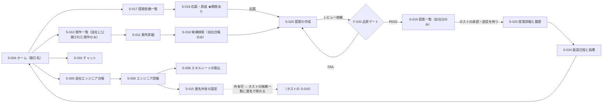
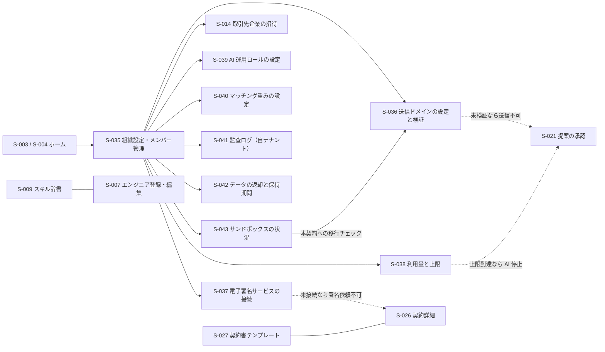
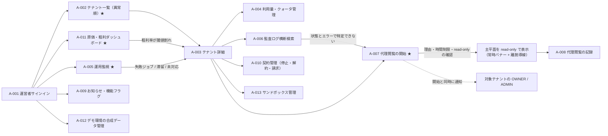

# 04. 画面設計 — SES Platform（仮称）

> **位置づけ**: 本書は「どの画面が存在し、そこに何があり、何が起きるか」を定義する。ワイヤーフレーム画像は `designer`（`docs/wireframes/`）、DB・API・ジョブは `program-design`（`docs/05`）の領分。
> **上流**: `CLAUDE.md`（一次資料）→ `docs/01-business-requirements.md`（`BR-01`〜`BR-64`）→ `docs/02-functional-requirements.md`（`F-001`〜`F-064` / `UC-01`〜`UC-24`）→ `docs/03-tech-selection.md`。**矛盾する場合は `CLAUDE.md` が正。**
> **本書はビジュアル詳細（色コード・ピクセル値・フォントサイズ）を書かない。** 意味と役割だけを定義し、具体化は実装時に Tailwind + shadcn/ui で行う。

**構成**: 1 画面一覧 / 2 画面遷移図 / 3 共通レイアウト / 4 画面詳細 / 5 コンポーネントカタログ / 6 必須画面の要件 / 7 デザイン原則 / 8 ロール別承認モードの設定画面 / 9 AI 運用ロールの UI 上の扱い / 10 状態設計マトリクス / 11 設計固有性の記録 / 付録（逆引き表 / UC マッピング / 申し送りマッピング）/ 後続エージェントへの申し送り

---

## Assumptions（人間が決めた既定値と、本書が置いた前提）

`CLAUDE.md` §8.6 に従い、確定していない値はここに集約する。**本文中の値はすべてこの表に紐づく。**

| # | 前提 | 本書での扱い | 状態 |
|---|---|---|---|
| **U-01** | **プロダクト名は「SES Platform」（仮称）** | 🔴 **ワードマークの表示箇所はグローバルヘッダ左端の 1 箇所のみ**とし、`packages/i18n` の `product.name` トークンを参照する。ログイン画面（`S-001`）・招待受諾（`S-002`）・エクスポートのフッタ・環境バナーも同じトークンを引く。**画面本文・ボタンラベル・見出しに製品名を書かない**（改称時に 1 トークンの差し替えで済む） | **暫定。Issue #1**（`docs/02` A-01 / `Q-1`） |
| **U-02** | **マッチング重み**: 必須 45（足切り）/ 稼働開始日 15 / 尚可 12 / 勤務地 10 / 単価 10 / 経験年数 8 | `S-040`（重み設定。Phase 2）。**開始日の遅れ・勤務地の不一致は「減点 + 明示的なフィルタ」**とし、`S-005` / `S-016` に「開始日に間に合う人だけ」「通勤可能な人だけ」のチェックボックスを既定オフで置く（`F-009 AC-5` / `docs/02` A-03） | **暫定。Issue #3** |
| **U-03** | **満了アラートは 60 日前と 30 日前の 2 段階。30 日前は再通知であって新しい状態ではない** | `S-029` / `S-030` / `S-032`。**30 日前の再通知で状態バッジを変えない**（`F-043 AC-3` / `docs/02` A-06） | **暫定。Issue #4** |
| **U-04** | **取引先へ届くメールは、テナントの独自ドメインが検証済みでなければ送信しない** | `S-036`（送信ドメインの設定と検証）。未検証テナントでは `S-021` / `S-024` / `S-026` の送信を実行できず、**「壊れている」ではなく「送信元ドメインが未設定」として理由と設定導線を示す**（`docs/03` §3.2.7 / `Q-T-7` / `BR-51`） | **暫定。Issue #13** |
| **U-05** | **電子署名はテナントが自社契約を接続する方式（BYO）**。未接続テナントでは `F-049` が使えない | `S-037`（電子署名サービスの接続）。`S-026` の署名依頼ブロックは**未接続時に「未接続」として理由と接続導線を示す**（`docs/03` §3.1.2 / `Q-T-1`） | **暫定。Issue #11 / `Q-T-1`** |
| **U-06** | **匿名候補の丸め粒度**: 経験年数 5 段階 / 単価 10 万円刻み / 稼働可能時期 5 段階 / 勤務地は都道府県 + リモート 3 値 / スキルは辞書名の上位 8 件 | `S-016` / `S-015`（取引先側のプレビュー）。**更新日時は日単位に丸めて表示**（`docs/03` §4.13.1 / §4.13.2-2 / `Q-T-2` / `Q-17`） | **暫定。Issue #5。Phase 1 のリリース条件** |
| **U-07** | **`sandbox` バナーの文言は 3 点構成**（`F-028 AC-2`）。①取引先への提案・契約書・署名依頼は送信されない ②取引先の担当者宛のメール（招待を含む）も送信されず、招待は画面のリンクを渡す ③自社メンバー宛の招待・期限のお知らせは実際に届く | §3.5 の環境バナー。**「メールは一切送信されません」と書かない**（`docs/01` レビューが `ui-design` に持ち越した論点） | **暫定。Issue #9 / #10** |
| **U-08** | **一覧の既定表示件数は 50 行**（承認キューは 25 行、監視系は 100 行）。テーブルの既定列数上限は 8 列 + 操作列 | §7.1 の情報密度基準。エンジニア 1 万件 / 案件 1 万件を前提にカーソルページングとする（`CLAUDE.md` §7） | **本書が置いた既定値** |
| **U-09** | **取引先（`PARTNER_ADMIN` / `PARTNER_SALES`）の画面は、自社営業と同じ密度・同じデバイス階層基準で設計する** | 全画面。専用画面は `S-004` / `S-015` / `S-018`、共用画面は各画面詳細の「取引先での構成差」節で情報構造を明示する（`CLAUDE.md` §1.2 の 🔴 段落 / `docs/01` 申し送り 24 / `docs/02` A-02） | **確定。Issue #4** |
| **U-10** | **代理閲覧中に実行できない操作は、ボタンを非表示にしたうえで、その位置に理由テキストを常時置く** | §5 の代理閲覧バナー / `A-007`。`F-060 AC-3`（導線が表示されない）を満たしつつ、サポート担当が「なぜ操作できないか」を理解できる状態を両立させる。**無効化されたボタンは置かない**（押せるように見える要素を残さない） | **本書が置いた設計判断**（§11-6） |

---

## 1. 画面一覧

**平面ごとに表を分ける**（`CLAUDE.md` §1.4）。画面 ID は `S-001` / `A-001` の連番とし、**削除せず欠番にして参照を安定させる**（§8.8）。

**列の読み方**

| 列 | 意味 |
|---|---|
| **ステージ** | `CLAUDE.md` §1.3。①集める ②マッチング ③提案 ④商談・決定 ⑤契約 ⑥稼働・稼働後フォロー。横断は `横断`、該当なしは `−` |
| **フェーズ** | 画面が成立するフェーズ。`P1→P2` は「Phase 1 で成立し Phase 2 で情報が増える」 |
| **必要ロール** | `OW`=`OWNER` / `AD`=`ADMIN` / `SA`=`SALES` / `PA`=`PARTNER_ADMIN` / `PS`=`PARTNER_SALES` / `VI`=`VIEWER`。**`VI` は閲覧のみで、承認・送信・ダウンロードの導線が存在しない**（`BR-31` / `docs/02` 章 4.3） |
| **Tier** | `CLAUDE.md` §13.2 のデバイス階層。**T1**=モバイル完結 / **T2**=モバイル閲覧可 / **T3**=デスクトップ主体（モバイルでは劣化させるが遮断しない） |

### 1.1 主平面（テナント平面 `/`）

| ID | 画面 | 対応機能 | ステージ | フェーズ | 必要ロール | Tier |
|---|---|---|---|---|---|---|
| `S-001` | サインインと 2 要素認証 | `F-003` | − | Phase 0 | 全ロール | **T1** |
| `S-002` | 招待の受諾とアカウント初期設定 | `F-002` `F-003` `F-007` | − | Phase 0 | 全ロール | **T1** |
| `S-003` | ホーム（ホスト） | `F-006` `F-027` `F-061` | 横断 | Phase 0→P1→P2 | OW/AD/SA/VI | **T1** |
| `S-004` | ホーム（取引先） | `F-006` `F-027` `F-061` | 横断 | Phase 1→P2 | PA/PS | **T1** |
| `S-005` | エンジニア台帳（一覧・複合検索） | `F-008` `F-009` `F-045` | ①② | Phase 1 | 全ロール | **T2** |
| `S-006` | エンジニア詳細 | `F-008` `F-012` `F-016` `F-019` `F-045` | ① | Phase 1→P2 | 全ロール | **T2** |
| `S-007` | エンジニアの登録・編集 | `F-008` `F-010` | ① | Phase 1 | OW/AD/SA/PA/PS | **T3** |
| `S-008` | スキルシートの取込と版管理 | `F-011` `F-012` `F-032` `F-033` | ① | Phase 1→P2 | OW/AD/SA/PA/PS/VI | **T3** |
| `S-009` | スキル辞書・別名・新語候補 | `F-010` `F-033` | ① | Phase 1→P2 | OW/AD/SA/PA/PS/VI | **T3** |
| `S-010` | 案件一覧・検索 | `F-015` `F-045` | ① | Phase 1 | 全ロール | **T2** |
| `S-011` | 案件詳細 | `F-013` `F-014` `F-037` `F-051` | ①③ | Phase 1→P2 | 全ロール | **T2** |
| `S-012` | 案件の登録・編集 | `F-013` `F-010` | ① | Phase 1 | OW/AD/SA | **T3** |
| `S-013` | 案件の公開範囲設定 | `F-014` `F-020` | ① | Phase 1 | OW/AD/SA | **T3** |
| `S-014` | 取引先企業の一覧・詳細と招待 | `F-007` `F-002` | ① | Phase 1 | OW/AD/SA/VI | **T3** |
| `S-015` | 匿名共有の設定（取引先） | `F-016` `F-017` | ② | Phase 1 | PA/PS | **T2** |
| `S-016` | 候補検索とマッチング候補（案件起点） | `F-009` `F-017` `F-029` `F-031` `F-018` | ② | Phase 1→**P2** | OW/AD/SA/PA/PS/VI | **T2** |
| `S-017` | 提案依頼の一覧 | `F-018` | ②③ | Phase 1 | 全ロール | **T1** |
| `S-018` | 提案依頼の詳細と応諾・辞退（取引先） | `F-018` `F-019` | ②③ | Phase 1 | PA/PS/VI | **T1** |
| `S-019` | 提案一覧 | `F-024` `F-020` `F-022` | ③④ | Phase 1 | 全ロール | **T2** |
| `S-020` | 提案の作成・編集 | `F-019` `F-020` `F-034` `F-011` | ③ | Phase 1→P2 | OW/AD/SA/PA/PS | **T2** |
| `S-021` | **提案の承認** ★ | `F-021` `F-020` `F-022` `F-037` | ③ | Phase 1→P2 | OW/AD/SA | **T1** |
| `S-022` | 送信失敗一覧と再送 | `F-023` `F-022` | ③ | Phase 1 | OW/AD/SA/VI | **T2** |
| `S-023` | 提案詳細と履歴 | `F-024` `F-025` `F-020` `F-037` | ③④ | Phase 1 | 全ロール | **T2** |
| `S-024` | 面談日程の調整と結果記録 | `F-025` `F-041` `F-020` | ④ | Phase 1→**P2** | OW/AD/SA/PA/PS/VI | **T1** |
| `S-025` | 契約一覧 | `F-047` | ⑤ | Phase 3 | OW/AD/SA/VI | **T2** |
| `S-026` | 契約詳細と署名依頼 | `F-047` `F-048` `F-049` `F-020` | ⑤ | Phase 3 | OW/AD/SA/VI | **T2** |
| `S-027` | 契約書テンプレート | `F-048` | ⑤ | Phase 3 | OW/AD/SA/VI | **T3** |
| `S-028` | 発注・請求の記録 | `F-050` | ⑤ | Phase 3 | OW/AD/SA/VI | **T3** |
| `S-029` | 稼働一覧（満了カレンダー） | `F-042` `F-043` `F-045` | ⑥ | Phase 2 | OW/AD/SA/VI | **T2** |
| `S-030` | **稼働詳細と延長確認** ★ | `F-042` `F-043` `F-044` `F-045` | ⑥→① | Phase 2 | OW/AD/SA/VI | **T1** |
| `S-031` | チャット | `F-038` `F-011` `F-020` | ③④ | Phase 2 | 全ロール | **T1** |
| `S-032` | 通知一覧 | `F-039` `F-027` `F-061` | 横断 | Phase 2 | 全ロール | **T1** |
| `S-033` | タスク一覧 | `F-040` `F-043` | ④⑤⑥ | Phase 2 | 全ロール | **T1** |
| `S-034` | 実績ダッシュボード | `F-051` | 横断 | Phase 3 | 全ロール | **T2** |
| `S-035` | 組織設定とメンバー管理 | `F-001` `F-002` `F-021`(承認ポリシー) | − | Phase 0→P1 | OW/AD | **T3** |
| `S-036` | 送信ドメインの設定と検証 | `F-001` `F-022` `F-041` | − | Phase 1 | OW/AD | **T3** |
| `S-037` | 電子署名サービスの接続 | `F-049` `F-047` | ⑤ | Phase 3 | OW/AD | **T3** |
| `S-038` | 利用量と上限 | `F-026` `F-027` | 横断 | Phase 1 | OW/AD/SA/VI | **T2** |
| `S-039` | AI 運用ロールの設定 | `F-035` `F-036` | 横断 | Phase 2 | OW/AD/SA/VI | **T3** |
| `S-040` | マッチング重みの設定 | `F-030` | ② | Phase 2 | OW/AD/SA/VI | **T3** |
| `S-041` | 監査ログ（自テナント） | `F-005` `F-012` | 横断 | Phase 1 | OW/AD | **T3** |
| `S-042` | データの返却と保持期間 | `F-064` `F-046` `F-052` | − | Phase 1→P2→P3 | OW/AD | **T3** |
| `S-043` | サンドボックスの状況と本契約への移行 | `F-054` `F-028` `F-064` | − | Phase 1 | OW/AD | **T2** |

**主平面の合計 43 画面。Tier 1 = 13 / Tier 2 = 16 / Tier 3 = 14。**

🔴 **取引先のデバイス階層は自社営業と同じ基準で割り当てた**（`U-09`）。対応関係は次のとおりで、取引先側だけを下位の Tier に落としていない。

| 業務の性質 | 自社営業の画面 / Tier | 取引先の画面 / Tier |
|---|---|---|
| 期限のある応答（時間勝負） | `S-021` 承認 / T1、`S-024` 面談日程 / T1 | `S-018` 提案依頼の応諾・辞退 / **T1**、`S-024` / **T1** |
| 日々の確認と着手 | `S-003` ホーム / T1 | `S-004` ホーム / **T1** |
| 台帳・案件の閲覧 | `S-005` `S-010` `S-011` / T2 | 同一画面 / **T2**（母集団のみ異なる） |
| 提案の作成 | `S-020` / T2 | 同一画面 / **T2** |
| 腰を据えた整備 | `S-007` `S-008` / T3 | 同一画面 / **T3** |
| 共有の主導権にかかわる操作 | （該当なし） | `S-015` 匿名共有の設定 / **T2**（1 件ずつの解除はモバイルで完結する。§4 の `S-015` 参照） |

### 1.2 管理平面（運営者コンソール `/admin`）

**`CLAUDE.md` §10.4 の 8 機能すべてに画面を割り当てた。** 管理平面は業務ループのステージに属さないため、ステージ列を持たない。**既定 read-only**（`BR-37`）。

| ID | 画面 | 対応機能 | §10.4 | フェーズ | 必要ロール | Tier |
|---|---|---|---|---|---|---|
| `A-001` | 運営者サインイン（2FA 必須） | `F-055` | 前提 | Phase 0 | PO/PP | **T3** |
| `A-002` | **テナント一覧（健全性・異常順）** ★ | `F-056` | #1 | Phase 0→**P1** | PO/PP | **T3** |
| `A-003` | テナント詳細 | `F-056` `F-057` `F-059` `F-054` | #1 | Phase 0→P1 | PO/PP | **T3** |
| `A-004` | 利用量・クォータ管理 | `F-057` `F-026` | #3 | Phase 1 | PO（設定）/ PP（閲覧） | **T3** |
| `A-005` | **運用監視** ★ | `F-059` `F-026` `F-043` | #5 | Phase 1→P2→P3 | PO/PP | **T3** |
| `A-006` | 監査ログ横断検索（PII マスキング） | `F-058` | #6 | Phase 1 | PO/PP | **T3** |
| `A-007` | **代理閲覧の開始** ★ | `F-060` | #7 | Phase 2 | PO/PP | **T3** |
| `A-008` | 代理閲覧の記録 | `F-060` `F-058` | #7 | Phase 2 | PO/PP | **T3** |
| `A-009` | お知らせ・機能フラグ | `F-061` | #8 | Phase 2 | PO（作成）/ PP（閲覧） | **T3** |
| `A-010` | 契約管理（プラン・停止・請求） | `F-062` `F-001` `F-064` | #4 | Phase 3 | PO（操作）/ PP（閲覧） | **T3** |
| `A-011` | **原価・粗利ダッシュボード** ★ | `F-063` `F-026` | #2 | Phase 3 | PO（閾値設定）/ PP（閲覧） | **T3** |
| `A-012` | デモ環境の合成データ管理 | `F-053` | − | Phase 1 | PO/PP | **T3** |
| `A-013` | サンドボックステナントの管理 | `F-054` `F-064` | #4 | Phase 1 | PO（移行・延長）/ PP（閲覧） | **T3** |

**管理平面の合計 13 画面。全画面 Tier 3。** ただし `CLAUDE.md` §13.3 のとおり**モバイルで非表示にしない**。運営者の障害対応は移動中にも発生するため、`A-002` / `A-005` の一覧はモバイルで「1 行 = 1 カード状の縦積み（テナント名 / 異常の種別 / 件数 / 経過時間）」に劣化させ、**並び順（異常度の高い順）は保つ**。フィルタと設定操作はデスクトップに寄せる。

---

## 2. 画面遷移図

**平面ごとに図を分ける。** `CLAUDE.md` §1.3 の業務ループはループであり、**UI 上でも循環していることが読み取れる図にする**（`S-030` → `S-005` / `S-010` の還流が図の中で閉じる）。

### 2.1 主平面 — 業務ループ（ホスト視点。①→②→③→④→⑤→⑥→①）

```mermaid
flowchart LR
  S003["S-003 ホーム"] --> S010["S-010 案件一覧"]
  S010 --> S012["S-012 案件の登録・編集"]
  S012 --> S011["S-011 案件詳細"]
  S011 --> S013["S-013 公開範囲設定"]
  S013 -.->|"経路1: 公開"| P004["S-004 取引先ホーム"]
  S011 -->|"② 候補を探す"| S016["S-016 候補検索・マッチング候補"]
  S016 -->|"匿名候補"| S017["S-017 提案依頼一覧"]
  S016 -->|"自社候補"| S020["S-020 提案の作成"]
  S017 -.->|"経路4"| S018["S-018 応諾・辞退（取引先）"]
  S018 -->|"応諾 → DRAFT 生成"| S020
  S020 -->|"レビュー依頼"| S021["S-021 提案の承認 ★"]
  S021 -->|"GATE_FAILED"| S020
  S021 -->|"承認 → 送信"| S023["S-023 提案詳細と履歴"]
  S021 -->|"SUBMIT_FAILED"| S022["S-022 送信失敗一覧と再送"]
  S022 --> S023
  S023 --> S024["S-024 面談日程と結果記録"]
  S024 -->|"WON"| S025["S-025 契約一覧"]
  S025 --> S026["S-026 契約詳細と署名依頼"]
  S026 -->|"EXECUTED"| S029["S-029 稼働一覧"]
  S029 --> S030["S-030 稼働詳細と延長確認 ★"]
  S030 -->|"延長合意"| S029
  S030 ==>|"⑥→① 還流: 待機予定"| S005["S-005 エンジニア台帳"]
  S030 ==>|"⑥→① 還流: 後任募集"| S010
  S005 --> S016
```



🔴 **太線の 2 本（`S-030` → `S-005` / `S-010`）が本プロダクトの中核**である。この 2 本は**利用者の操作で発生する遷移ではなく、`F-045` の自動還流が画面上に現れる経路**であり、`S-030` の「終了を確定する」操作の結果として `S-005` / `S-010` の一覧に対象が現れる。図の上でも矢印を他と区別する（`docs/01` 章 4.3 / `BR-35`）。

### 2.2 主平面 — 取引先（`PARTNER_ADMIN` / `PARTNER_SALES`）の 1 日

**自社営業と同じ粒度で描く**（`U-09`）。取引先は 1 日 4〜5 時間滞在し、この図の範囲で日常業務が完結する。



🔴 **この図に「他のパートナー」を指す要素は 1 つも無い。** `S-019` / `S-023` / `S-011` のいずれからも、同一案件への他社提案の存在・件数・単価・エンジニア名に到達する経路が無い（`BR-07` / `F-004 AC-4`）。**件数バッジ・並び順の変化・「あなたは N 番目」といった間接的な示唆も作らない。**

### 2.3 主平面 — 設定・運用（業務ループの外側）



**点線は「別画面の状態が、この画面の操作可否を決める」依存**である。いずれも「壊れている」ではなく**理由と設定導線を示す**（`docs/02` 申し送り 8 / 10、`docs/03` 申し送り 1 / 2）。

### 2.4 管理平面



🔴 **サポート対応の導線が 1 本に繋がっている**（`UC-10`）: `A-005` 運用監視で異常を検知 → `A-003` テナント詳細で件数・状態・日時を確認 → `A-006` 監査ログで操作の記録を確認 → **それでも特定できない場合に限り** `A-007` から代理閲覧を開始する。**`A-002` / `A-003` から直接 `A-007` に飛べる導線は置くが、`A-007` は理由入力を必須とするため、「とりあえず入る」ことはできない。**

---

## 3. 共通レイアウト

**平面ごとに定義する。** 主平面と管理平面は**視覚的に明確に区別**し、運営者が「いま管理平面にいる」ことを一目で判別できるようにする（誤操作防止）。

### 3.1 主平面（`/`）のレイアウト

```
┌──────────────────────────────────────────────────────────────┐
│ [環境バナー]  ※production 以外のみ。最上部固定・スクロールで消えない   │ ← §3.5
├──────────────────────────────────────────────────────────────┤
│ [代理閲覧バナー] ※代理閲覧中のみ。常時表示・離脱導線を右端に        │ ← §5-8
├──────────────────────────────────────────────────────────────┤
│ ワードマーク │ スコープ表示 │      │ 上限インジケータ │ 通知 │ 自分 │ ← ヘッダ
├────────────┬─────────────────────────────────────────────────┤
│ サイドバー  │ [お知らせ帯] ※F-061 の掲出中のみ                  │
│（左固定）   ├─────────────────────────────────────────────────┤
│            │ パンくず / 画面タイトル / primary アクション（1 つ） │
│            ├─────────────────────────────────────────────────┤
│            │ 画面本体                                          │
└────────────┴─────────────────────────────────────────────────┘
```

**ヘッダ**

| 要素 | 内容 |
|---|---|
| **ワードマーク** | 🔴 **製品名を表示する唯一の箇所**（`U-01`）。`packages/i18n` の `product.name` を参照する。クリックでホーム（`S-003` / `S-004`）へ |
| **スコープ表示** | **組織（テナント）名**を常時表示する。パートナー所属の利用者には「**組織名 ＞ 自社名**」の 2 段で示す（例: `〇〇システム ＞ △△テック（御社）`）。**これが第二境界の常時表現である**（§3.2） |
| **上限インジケータ** | `F-027`。AI コスト・メール・ストレージの**いずれかが 80% を超えたときのみ**ヘッダに出す。平常時は出さない（常時警告は無視される）。クリックで `S-038` |
| **通知** | `F-039`。未読件数。クリックで `S-032` |
| **自分** | ロール名を併記する（例: `山田（営業）`）。**ロールが見えることが「なぜこの操作ができないか」の一次説明になる** |

**サイドバー（グローバルナビ）** — 🔴 **アイコンを付けない**（§7.5）。項目は業務ループの順に並べ、ステージ番号を接頭辞として持つ。**ナビの並びが `CLAUDE.md` §1.3 の順序と一致していること自体が、利用者にループを教える。**

| ホスト（`OW` / `AD` / `SA` / `VI`） | 取引先（`PA` / `PS`） |
|---|---|
| ホーム | ホーム |
| ① 人材（`S-005`） | ① 自社の人材（`S-005`） |
| ① 案件（`S-010`） | ① 公開された案件（`S-010`） |
| ② 候補を探す（`S-016`） | ② 自社の候補を探す（`S-016`） |
| ③ 提案（`S-019`）／ 提案依頼（`S-017`） | ③ 提案（`S-019`）／ **提案依頼（`S-017`）※期限バッジ付き** |
| ④ 面談・結果（`S-023` 経由） | ④ 面談・結果 |
| ⑤ 契約（`S-025`）※Phase 3 | **（表示しない。`F-047` はパートナーに `−`）** |
| ⑥ 稼働（`S-029`）※Phase 2 | **（表示しない。`F-042` はパートナーに `−`）** |
| チャット／タスク／実績 | **共有の設定（`S-015`）**／チャット／タスク／実績（自社分） |
| 設定 | 設定（自社アカウントのみ） |

🔴 **取引先のナビから ⑤ ⑥ を消す扱いを「機能の省略」と読まない。** `F-042` / `F-047` はパートナーに `−` であり（`docs/02` A-21）、**存在しない機能をグレーアウトで見せない**（`gate-inspector` と同じ原則。§8）。代わりに `S-006` に「自社エンジニアの稼働状況・稼働可能時期」を置き、取引先が必要とする情報（自社の誰がいつ空くか）は自社台帳の属性として提供する（`F-045 AC-5`）。

**スコープの階層（組織 ＞ 下位エンティティ）の表現**

- ホストには**パートナー企業の切替スイッチャーを置かない。** ホストは常にテナント全体を見ており、切り替える対象が無い。パートナー別に見たいときは各一覧の絞り込み（`S-014` / `S-019` の「取引先」フィルタ）で行う。**スイッチャーを置くと「切り替えれば他社の台帳が見える」という誤った期待を生む**（`BR-06`）。
- 取引先には**切替スイッチャーを置かない。** 所属は 1 社に固定されており（`F-002 AC-1`）、切り替える先が存在しない。代わりにヘッダのスコープ表示で「自社名（御社）」を常時示す。
- 🔴 **取引先の全画面に「見える範囲の説明」を置く**（`F-006 AC-2` / `docs/02` 申し送り 2）。ホーム（`S-004`）には常設ブロック、各一覧画面にはフィルタ帯の直下に 1 行で置く。例: 「この一覧には、御社が登録した人材のみが表示されます」「この案件は御社に公開されています。ほかにどの会社へ公開されているかは表示されません」。🔴 **説明文に件数・存在の示唆を含めない**（「他に N 社」「他社も提案しています」は禁止。`F-004 AC-4`）。

### 3.2 第二境界（パートナースコープ）を UI でどう表現するか

**同じ画面を使いながら母集団が違う**という状態は、説明がないと不信になる（`docs/01` 章 2.3。取引先は 1 日 4〜5 時間滞在するため、説明不足は蓄積する）。次の 3 点で表現する。

| # | 表現 | 置く場所 |
|---|---|---|
| 1 | **ヘッダのスコープ表示**（`組織名 ＞ 自社名`） | 全画面 |
| 2 | **一覧の母集団を 1 行で明示**（「御社が登録した人材 128 件」/「御社に公開された案件 14 件」） | `S-005` `S-010` `S-016` `S-019` `S-017` の件数表示部 |
| 3 | **見えないものの説明**（「他社が登録した人材・他社の提案は表示されません」） | 上記一覧のフィルタ帯直下、および `S-004` の常設ブロック |

**表現しないこと（禁止）**: 他社の件数、他社の存在、「あなたは N 番目」、非公開データの件数バッジ、母集団の大きさによる並び順の変化。**`S-011` の案件詳細に「公開先: 3 社」を出さない**（`F-014 AC-4`）。ホスト側の `S-013` にのみ公開先の一覧を出す。

### 3.3 管理平面（`/admin`）のレイアウト — 主平面との視覚的区別

🔴 **運営者は主平面と管理平面を行き来する**（代理閲覧）。**「いまどちらにいるか」を一目で判別できないと、read-only の前提を忘れて操作しようとする。** 次の 4 点で区別する。

| # | 区別の手段 | 内容 |
|---|---|---|
| 1 | **全幅の平面帯** | 画面最上部（環境バナーの直下）に**全幅の帯**を置き、`運営者コンソール` と常時表示する。主平面にはこの帯が存在しない。**色でなく「帯という構造の有無」で区別する**（色覚特性に依存しない） |
| 2 | **サイドバーの位置と構造** | 管理平面のナビは**業務ループの順序を持たない**（管理平面はステージに属さない）。「監視 / テナント / 契約 / 記録 / 運用」の 5 グループに分け、主平面の ①〜⑥ の並びと明確に違う構造にする |
| 3 | **ヘッダの主体表示** | `運営者: 佐藤（PLATFORM_SUPPORT）` とロールを常時併記する。`PLATFORM_SUPPORT` には**そもそも表示されない操作**（停止・プラン変更・クォータ変更）があるため、自分のロールが常に見えていることが前提になる（`BR-44`） |
| 4 | **read-only の明示** | 書き込みが許される 4 領域（契約 `A-010` / クォータ `A-004` / 機能フラグ `A-009` / お知らせ `A-009`）**以外の画面には、画面タイトルの右に `閲覧のみ` を常時表示する**。`A-002` `A-003` `A-005` `A-006` `A-008` `A-011` が該当（`BR-37`） |

**代理閲覧中の表示** — 代理閲覧では**主平面のレイアウトをそのまま**使う（サポート担当が見るのは顧客が見ている画面でなければ意味がない）。ただし §3.1 の「代理閲覧バナー」を全画面に常時出し、離脱導線（`終了して管理平面に戻る`）を右端に固定する（§5-8）。

### 3.4 モバイルでの共通レイアウト

| 要素 | モバイルでの扱い |
|---|---|
| 環境バナー・代理閲覧バナー | **最上部固定を維持する**（`F-028 AC-1`）。文言は 1 行に切り詰めず、**折り返して全文を表示する**（3 点構成の意味が失われるため。`U-07`） |
| サイドバー | ボトムタブ 5 つ（ホーム / 提案 / 候補 / チャット / その他）+「その他」から全項目。**業務ループの順序は「その他」の中で保つ** |
| スコープ表示 | ヘッダに `△△テック（御社）` のみ。組織名はタップで展開 |
| 上限インジケータ | 80% 超過時のみ、ヘッダ直下に 1 行の帯 |
| primary アクション | 画面下部の固定バー（親指の届く位置）。**1 画面 1 つ**（§7.6） |

### 3.5 本番以外の環境の表示（`F-028` / `BR-48`）

`production` 以外では、**主平面・管理平面・モバイルビューポートのすべてで**最上部に固定表示する。**スクロールしても消えない。**

| `APP_ENV` | バナー文言（`packages/i18n` に集約） |
|---|---|
| `demo` | **デモ環境 — 送信は行われません。** 表示されているデータはすべて架空のものです |
| `sandbox` | 🔴 **サンドボックス環境 — 取引先への提案・契約書・署名依頼、および取引先の担当者宛のメール（招待を含む）は送信されません。取引先の招待は、画面に表示されるリンクをお渡しください。自社メンバー宛の招待・期限のお知らせは、お使いのアドレスに実際に届きます。それ以外は本番と同じ動作です** |
| `staging` | 検証環境 — 外部サービスは各社の検証用エンドポイントに接続しています |
| `development` | 開発環境 — 外部送信はすべてモックです |

🔴 **`sandbox` の文言は 3 点を「送信されないもの / 送信されないが代替手段があるもの / 実際に届くもの」の順に並べる**（`F-028 AC-2` / `U-07`）。**「メールは一切送信されません」と書かない** — 招待・期限予告は実際に届くため、その表現は嘘になり、届いたメールを見た利用者が「提案も届いている」と誤解する（`docs/01` `R-2`）。**「すべてのメールが届きます」とも書かない。**

- バナーは**折りたたまない**。長いことより、読まずに済ませられることのほうが危険（`docs/01` `R-1`）。
- `sandbox` では、**取引先招待の箇所（`S-014`）にバナーと同じ趣旨の説明を再掲**する（バナーは常時目に入るが、招待の操作をする瞬間に必要な情報は操作の隣にあるべき）。
- 環境バナーと**お知らせ帯（`F-061`）を同じ帯にまとめない**。前者は環境の事実、後者は運営者からの連絡であり、性質が違う。

---

## 4. 画面詳細

各画面を **目的 / セクション / 主要コンポーネント / 操作と結果 / 空・ローディング・エラー / 非同期処理の表現 / 権限差分 / デバイス別 / 関連画面** で定義する。**「なぜこの構成か」は業務側の根拠で書く**（一般論を根拠にしない）。

### 4.1 認証とホーム

#### S-001 サインインと 2 要素認証 — T1 / Phase 0 / `F-003`

- **目的**: 「どのテナント・どのパートナーの利用者か」を認証だけで確定させる。入力で切り替えられないことを、UI としても示す（`BR-03`）。
- **セクション**: 1. ワードマーク（`U-01` の唯一の表示箇所の 1 つ）2. メールアドレス + パスワード 3. 2 要素認証コード（2 段階目）4. パスワード再設定リンク 5. 環境バナー（`production` 以外）
- **主要コンポーネント**: サインインフォーム（入力: メール / パスワード。出力: セッション、または失敗理由）/ 2FA コード入力（入力: 6 桁。出力: 検証結果）/ 2FA 初期設定ウィザード（`OWNER` / `ADMIN` が未設定の場合。出力: 復旧コード）
- **操作と結果**

| 操作 | 起きること | 遷移 |
|---|---|---|
| サインイン | 認証 → テナント・パートナー所属・ロールを確定 → 監査ログに記録 | 2FA 段階へ、または `S-003` / `S-004` |
| `OWNER` / `ADMIN` で 2FA 未設定 | 業務画面に到達させず設定ウィザードへ（`F-003 AC-2`） | 2FA 設定 → `S-003` |
| 認証失敗 | 失敗を監査ログに記録。**「メールアドレスが存在しない」と「パスワードが違う」を区別しない** | 同画面 |

- **🔴 テナント選択の UI を置かない**: 「所属テナントを選ぶ」ドロップダウンを作らない。**画面に選択肢がある時点で、入力で境界が切り替わるという設計に見える**（`BR-03` の反対）。1 人が複数テナントに所属する場合は、テナントごとに別のアカウントとして扱う。
- **空 / ローディング / エラー**: 空状態なし。送信中はボタンを送信中表示に置換（二重送信防止）。ネットワークエラーは「接続できませんでした。時間をおいて再度お試しください」。ロックアウトは残り時間を明示。
- **非同期処理の表現**: 同期処理のみ。
- **権限差分**: なし（未認証）。
- **デバイス別**: T1。単一カラム。2FA コード入力は数字キーボードを呼ぶ。**モバイルでの機能省略なし。**
- **関連画面**: → `S-002`（招待経由）/ `S-003` / `S-004`。管理平面は `A-001`（**別ルート・別セッション**。`F-055 AC-2`）。

#### S-002 招待の受諾とアカウント初期設定 — T1 / Phase 0 / `F-002` `F-003` `F-007`

- **目的**: 招待リンクから 1 回限りの受諾を成立させる。🔴 **`sandbox` では取引先の招待メールが送られない**ため、ホストが画面から取得したリンク（`S-014`）で受諾する経路が主になる（`F-007 AC-4` / `U-07`）。
- **セクション**: 1. 招待の内容（招待元の組織名 / 付与ロール / パートナー所属の場合は自社名）2. 氏名・パスワードの設定 3. 2FA 設定（`OWNER` / `ADMIN` は必須）4. 受諾ボタン（primary、1 つ）
- **主要コンポーネント**: 招待内容の定義リスト（読み取り専用）/ アカウント設定フォーム / 2FA ウィザード
- **操作と結果**: 受諾 → アカウントと所属（ロール + パートナー所属）が確定 → 監査ログ → `S-003` / `S-004`。**リンクは受諾後に失効し、2 回目の受諾はできない**（`F-007 AC-4`）。
- **空 / ローディング / エラー**: 期限切れリンク → 「この招待は有効期限が切れています。招待元の管理者に再発行を依頼してください」+ 招待元の組織名のみ表示（担当者名は出さない）。使用済みリンク → 「この招待はすでに受諾されています」+ サインイン導線。
- **非同期処理の表現**: なし。
- **権限差分**: 付与されるロールを受諾前に明示する。**`VIEWER` として招待された場合は「閲覧のみのアカウントです。承認・送信・ダウンロードはできません」と受諾前に示す**（あとで「できない」と気づく状態を作らない。`BR-31`）。
- **デバイス別**: T1。取引先の担当者は自社の PC を持たずに受諾することがあるため、モバイルで完結させる。
- **関連画面**: ← `S-014`（招待の発行）/ → `S-001` `S-003` `S-004`。

#### S-003 ホーム（ホスト） — T1 / Phase 0→P1→P2 / `F-006` `F-027` `F-061`

- **目的**: 🔴 **「今日、自分が動かないと止まるもの」を最上部に置く。** SES 営業は時間勝負であり（`docs/01` 章 2.3）、承認・面談日程・延長確認の遅れが直接失注になる。**見ても行動が変わらない数値（提案総数・成約率）はここに置かない**（それは `S-034`）。
- **セクション**（上から）

| # | セクション | 中身 | なぜこの順か |
|---|---|---|---|
| 1 | **要対応キュー**（テーブル 1 本） | 種別 / 対象 / 相手 / **経過時間** / 期限 / 担当。種別は `承認待ち` `ゲート差し戻し` `送信失敗` `提案依頼の返答待ち` `面談日程が未確定` `延長確認` の 6 つ | **1 本のテーブルに束ねる**。種別ごとにカードを分けると「今日どれから手を付けるか」が判断できない。並びは「放置時間 × 取り返しのつかなさ」で、`送信失敗`（外部に到達したか不明）を最上位、`承認待ち` を次に置く |
| 2 | **満了が近い稼働**（テーブル） | エンジニア / 案件 / 満了日 / **残日数** / 延長確認の状態 / 担当。60 日前・30 日前の 2 段階（`U-03`） | ⑥→① の還流は本プロダクトの中核（`docs/01` 章 4.3）。**期日は「気づく」ものではなく「置いてある」ものにする** |
| 3 | **待機予定に戻った人材**（テーブル。Phase 2〜） | エンジニア / 元の案件 / 稼働可能時期 / 単価レンジ | 🔴 **⑥→① の還流の出口をホームに置く。** 還流しても誰も見ないなら、還流は「静かに起きて誰も気づかない」ことになる |
| 4 | **後任募集の案件**（テーブル。Phase 2〜） | 案件 / 元の稼働 / 開始日 / 公開先の設定状況 | 同上。**公開範囲が未設定の後任募集を上位に出す**（設定しないと誰にも見えない） |
| 5 | 未読チャット（一覧の先頭 5 件） | スレッド / 相手会社 / 最終メッセージの冒頭 | 返信の遅れが失注要因になるため |
| 6 | お知らせ（`F-061` の掲出中のみ） | 本文 | 掲出が無ければセクションごと出さない |

- **主要コンポーネント**: 要対応キューのテーブル（入力: ロール・担当のフィルタ。出力: 行のクリックで各画面へ）/ 状態バッジ（§5-1）/ 経過時間の表示（`2 日 4 時間`。相対時刻）/ 上限インジケータ（80% 超過時のみ。§5-4）
- **操作と結果**

| 操作 | 起きること | 遷移 |
|---|---|---|
| 要対応キューの行をクリック | 種別に応じた画面へ。承認待ちは `S-021`、送信失敗は `S-022`、ゲート差し戻しは `S-020` | 各画面 |
| 「自分の担当のみ」トグル | 既定は**オン**。オフで組織全体 | 同画面 |
| 満了が近い稼働の行 | `S-030` へ | `S-030` |

- **空 / ローディング / エラー**: **初回空**（Phase 0 / 導入直後）→ 「まだ案件と人材が登録されていません」+ `S-012` / `S-007` への導線 2 本。**要対応 0 件**（運用中）→ 「対応が必要なものはありません」+ 満了が近い稼働と待機予定は引き続き表示（**画面全体を空にしない**）。ローディングはセクションごとの骨格表示（要対応キューだけ先に出す）。1 セクションの取得失敗は**そのセクションだけ**エラー表示 + 再試行、他は表示する。
- **非同期処理の表現**: 本画面自体に非同期ジョブは無い。ただし**他画面で起動したジョブ（ゲート実行・送信・スキルシート抽出）の完了は、要対応キューの更新として現れる**。ポーリングは 60 秒間隔とし、更新があった行に「新着」の印を付ける（画面全体を再描画しない）。
- **権限差分**: `VIEWER` は要対応キューが**閲覧のみ**（行はクリックできるが、遷移先で操作導線が無い）。`SALES` は「承認待ち」に自分が承認者でないものも表示する（誰かが承認すれば進むため）。`OWNER` / `ADMIN` には上限インジケータの残量値が表示される（`F-027 AC-1`）。
- **デバイス別**

| | 構成 |
|---|---|
| デスクトップ | 2 カラム。左（広）= 要対応キュー + 満了が近い稼働、右（狭）= 待機予定 / 後任募集 / 未読チャット |
| タブレット | 🔴 **1 カラムだが、要対応キューは横スクロールさせず列を落とす**（`担当` を隠す）。**「小さいデスクトップ」として 2 カラムを縮小しない** |
| モバイル | 1 カラム。要対応キューは **1 行 = 種別バッジ + 対象 + 経過時間**の 3 要素に絞る。ただし**セクション 1〜4 を折りたたまない**（畳むと満了が見えなくなる）。5 / 6 は折りたたむ |

- **関連画面**: → `S-021` `S-022` `S-020` `S-030` `S-031` `S-032` `S-033`。
- **なぜこの構成か**: SES 営業の 1 日は「返事待ちの相手が何人いるか」で決まる。総数や率は月次の会話には要るが、朝一番に見て次の行動が変わるのは「何日放置しているか」である。したがって最上部の主キーは**件数ではなく経過時間**にした。

#### S-004 ホーム（取引先） — T1 / Phase 1→P2 / `F-006` `F-027` `F-061`

- **目的**: 🔴 **取引先の 1 日の起点。** `PARTNER_ADMIN` / `PARTNER_SALES` は 1 日 4〜5 時間滞在する主利用者であり（`CLAUDE.md` §1.2）、**この画面の密度は `S-003` と同等**にする。あわせて「何が見えて何が見えないか」を常時成立させる（`F-006 AC-2`）。
- **セクション**（上から）

| # | セクション | 中身 | なぜこの順か |
|---|---|---|---|
| 1 | **提案依頼（返答期限つき）** | 案件 / 依頼日 / **返答期限までの残り** / 候補の匿名 5 項目の要約 | 🔴 **取引先にとって最も時間切れが痛い。** 期限を過ぎると `EXPIRED` になり商談機会が消える（`F-018`）。ホストの `S-003` で「承認待ち」が最上位にあるのと同じ理由 |
| 2 | **要対応**（テーブル） | `ゲート差し戻し`（自社提案）/ `面談日程の回答待ち` / `未読チャット` | 自社が動かないと止まるもの |
| 3 | **御社に公開された案件**（テーブル） | 案件 / 必須要件の要約 / 単価レンジ / 開始日 / 公開日 / **新着** | 主業務の入口（`UC-13`）。**「新着 3 件」は自社スコープ内の件数であり許される。他社に関する件数は一切出さない** |
| 4 | **自社提案の状態**（テーブル） | エンジニア / 案件 / 状態バッジ / 最終更新 | `UC-13` 手順 7 |
| 5 | **稼働可能時期が近い自社エンジニア** | 氏名 / 稼働可能時期 / 共有設定の有無 | 🔴 自社台帳の属性のみ（`F-045 AC-5`）。**案件名・単価・契約には到達しない** |
| 6 | **見える範囲の説明**（常設ブロック） | 「この画面には、御社が登録した人材と、御社に公開された案件・御社が作成した提案のみが表示されます」 | `F-006 AC-2` |

- **🔴 表示してはならないもの**: 他社の提案の存在・件数・単価・エンジニア名、「他にも提案があります」に相当する表現、同一案件への提案数、応募順位、他社の匿名候補（`BR-07` / `BR-56` / `F-004 AC-4`）。**セクション 3 の並び順を「競合が少ない順」等にしない**（並び順自体が他社情報になる）。
- **主要コンポーネント**: 期限カウントダウン付きの提案依頼テーブル / 状態バッジ / 見える範囲の説明ブロック（§5-10）/ 上限インジケータ（**停止の事実と理由のみ。残量・上限値は表示しない**。`F-027 AC-1`）
- **操作と結果**: 提案依頼の行 → `S-018`（応諾・辞退）。要対応の行 → `S-020` / `S-024` / `S-031`。公開案件の行 → `S-011`。
- **空 / ローディング / エラー**: **初回空** → 「まだ御社に公開された案件はありません。案件が公開されると、この画面に表示されます」+ 自社台帳の登録導線（**先に台帳を整えておくと提案が早い**という業務上の順序を示す）。**提案依頼 0 件** → セクションごと非表示（「0 件」を出すと「ホストが何もくれない」という圧に見える）。取得失敗はセクション単位。
- **非同期処理の表現**: `S-003` と同じ 60 秒ポーリング。**提案依頼の残り時間だけはクライアント側で毎分更新する**（期限が近いことに気づけないと機会が消える）。
- **権限差分**: `PARTNER_ADMIN` は自社メンバーの担当分も見える。`PARTNER_SALES` は既定で自分の担当分、トグルで自社全体。`VIEWER`（パートナー所属）は応諾・辞退の導線が無い。
- **デバイス別**: `S-003` と**同じ扱い**（T1）。モバイルでもセクション 1〜4 を折りたたまない。セクション 1 は 1 行 = 案件名 + 残り時間 + 応諾/辞退への導線。
- **関連画面**: → `S-017` `S-018` `S-010` `S-011` `S-019` `S-020` `S-005` `S-015` `S-031`。
- **なぜこの構成か**: 取引先の業務は「ホストから来た依頼に期限内に答える」ことと「公開案件に自社の人を当てる」ことの 2 本である。前者は期限切れで機会が消え、後者は早い者勝ちになる。したがって最上部を**期限**、次を**新着**にした。自社営業のホームが「放置時間」を主キーにしたのと対になっている。

### 4.2 ① 集める

#### S-005 エンジニア台帳（一覧・複合検索） — T2 / Phase 1 / `F-008` `F-009` `F-045`

- **目的**: 候補の探索を「記憶」から「検索」に置き換える（`G-5`）。**エンジニア 1 万件で p95 1 秒**（`CLAUDE.md` §7）を前提に、カード一覧ではなく**テーブル**で設計する。
- **セクション**: 1. 検索条件（スキル AND/OR・経験年数・単価レンジ・稼働可能時期・勤務地/リモート・所属区分・稼働状況・フリーワード）2. 絞り込みチェックボックス 2 種 3. 母集団と件数の明示 4. 結果テーブル 5. カーソルページング
- **主要コンポーネント**

| コンポーネント | 入力 | 出力 |
|---|---|---|
| 検索条件フォーム | 上記の条件。スキルは `F-010` の辞書からの選択（自由入力は別名候補として起票） | 条件は URL に反映（共有・再現可能） |
| **絞り込みチェックボックス** | 「開始日に間に合う人だけ」「通勤可能な人だけ」。🔴 **既定オフ**（`F-009 AC-5` / `U-02`） | オフのときは開始日が遅い候補・勤務地が合わない候補も一覧に出る |
| 結果テーブル | 8 列: 氏名 / 所属区分 / 主要スキル（上位 3） / 経験年数 / 単価レンジ / 稼働可能時期 / 勤務地・リモート / 稼働状況 | 行クリックで `S-006` |
| 母集団の明示 | — | ホスト:「自社台帳 1,240 件」。取引先:「**御社が登録した人材 128 件**」（§3.2） |

- **🔴 Phase 1 でスコア・順位・重みを表示しない**（`F-009 AC-2`）。並び順は「検索条件への適合 → 更新日（**日単位に丸める**。`U-06`）→ 決定的な内部順」で、**並び順の説明を一覧の上部に 1 行で書く**（「一致度と更新日の順で表示しています」）。Phase 2 で `S-016` のスコア順に切り替わるが、**本画面（台帳の検索）は Phase 2 でもスコアを出さない**（台帳は案件に紐づかないため、スコアの前提となる案件が無い）。
- **操作と結果**

| 操作 | 起きること | 遷移 / ジョブ |
|---|---|---|
| 検索 | 境界適用後の母集団に対して評価。**ホストの結果には匿名候補が混在しない**（匿名候補は案件が前提であり `S-016` にのみ現れる） | 同画面 |
| 行クリック | エンジニア詳細を開く。**閲覧を監査ログに記録**（`F-008 AC-4`） | `S-006` |
| 「人材を登録」（primary） | — | `S-007` |
| 列の表示切替 | 9 列目以降（希望条件・登録日・担当）を追加表示 | 同画面 |

- **空 / ローディング / エラー**: **初回空** → 「まだ人材が登録されていません」+ 登録導線 + スキルシート取込の導線（`S-008`）。**絞り込み 0 件** → 「条件に一致する人材はいません」+ **効いている条件を列挙して 1 つずつ外せる導線**（「スキル: Java を外す」）+「絞り込みチェックボックスがオンです」の注意（オンのとき）。この 2 つは**文言も導線も別**。ローディングはテーブルの骨格 12 行。検索失敗は「検索を実行できませんでした」+ 条件を保持した再試行。
- **非同期処理の表現**: 検索は同期（1 秒以内が目標）。3 秒を超えた場合のみ「検索しています」を表示し、**条件の絞り込みを促す**（1 万件規模での全件走査を常態にしない）。
- **権限差分**: `VIEWER` は「人材を登録」が無い。取引先（`PA` / `PS`）は母集団が自社のみ、所属区分の列を出さない（全件が自社であるため意味がない）。**ホストは他パートナーが登録したエンジニアの実名・所属会社名・スキルシートに到達できない**（`F-008 AC-3`）ため、そもそも結果に現れない。
- **デバイス別**: T2。デスクトップ = 8 列テーブル + 左に検索条件パネル。タブレット = 検索条件を上部の折りたたみ帯にし、テーブルは 5 列（氏名 / 主要スキル / 稼働可能時期 / 単価レンジ / 稼働状況）。モバイル = 1 行 = 氏名 + 稼働可能時期 + 主要スキル 2 件の 3 行構成。**検索条件はモバイルでも全項目を提供する**（省略しない。移動中に「今すぐ動ける人」を探す業務がある）。
- **関連画面**: → `S-006` `S-007` `S-008` `S-016`。← `S-003`（待機予定に戻った人材）。
- **なぜこの構成か**: SES の候補探索は「条件に合う人がいるか」ではなく「**条件に合う人のうち、いつ空くか**」で決まる。したがって稼働可能時期を既定列から外さず、既定の並び順にも効かせた。また、開始日と勤務地は減点で扱い候補から消さない（`U-02`）— 消すと `docs/01` §1.2-2「見えていない候補が増える」の再発になるため、**フィルタは利用者が明示的にオンにしたときだけ効く**。

#### S-006 エンジニア詳細 — T2 / Phase 1→P2 / `F-008` `F-012` `F-016` `F-019` `F-045`

- **目的**: 1 人の情報を、提案の判断に足る密度で示す。あわせて🔴 **「提案時に凍結された情報」と「現在の台帳」の差分**を見せる（`F-019 AC-2`。SES では提案後に台帳が変わっても提案内容は変わらないことが商流上の前提）。
- **セクション**: 1. 見出し（氏名 / 所属区分 / 稼働状況バッジ / 稼働可能時期）2. 基本情報（定義リスト。スキル・経験年数・単価レンジ・勤務地/リモート・希望条件）3. スキルシートの版一覧（最新版フラグ / スキャン状態）4. 提案履歴（この人が誰にいつ提案されたか）5. **凍結情報との差分**（提案がある場合）6. 稼働履歴（Phase 2〜）7. **匿名共有の設定**（取引先のみ）
- **主要コンポーネント**

| コンポーネント | 入力 | 出力 |
|---|---|---|
| 基本情報の定義リスト | — | 🔴 **`BR-52` の範囲のみ**。本籍・家族構成・健康情報・信条にあたる項目を持たない |
| スキルシート版一覧（テーブル） | — | 版 / アップロード日 / スキャン状態 / 最新版 / 閲覧・DL。**`CLEAN` 以外は共有操作を選択できない**（`F-011 AC-1`） |
| **バージョン差分ビュー**（§5-6） | 提案の選択 | 「提案 P-0142（2026-07-03 凍結）↔ 現在」の項目単位の差分。変更された項目に「提案後に変更」と注記 |
| 匿名共有トグル + プレビュー | 共有可 / 停止 | 🔴 **ホストに見える 5 項目を、丸めた後の値でプレビュー**（`UC-14` 手順 2 / `U-06`） |

- **操作と結果**

| 操作 | 起きること | 遷移 / ジョブ |
|---|---|---|
| スキルシートを閲覧 | **閲覧を監査ログに記録してから表示する**。記録に失敗したら表示しない（`F-012 AC-2`） | インライン表示 |
| スキルシートをダウンロード | **ダウンロードを個別に監査ログに記録**（`BR-28`。デバイス・経路を問わず） | ファイル |
| 「この人で提案を作る」（primary） | 案件を選ぶ → `Proposal` を `DRAFT` で作成し、**その時点の情報を凍結** | `S-020` |
| 匿名共有をオンにする（取引先） | 確認ステップ → `EngineerShare` 作成 → 監査ログ。**ホストの候補一覧に匿名で現れる** | 同画面 |
| 匿名共有を停止する（取引先） | 即時反映。**次の検索からホストの一覧に現れない**（`F-016 AC-2`） | 同画面 |

- **空 / ローディング / エラー**: スキルシート未登録 → 「スキルシートが登録されていません」+ 取込導線。提案履歴なし → 「この人材はまだ提案されていません」。エンジニアが削除済み（`F-046` / `F-064`）→ 404 相当の「この人材の情報は保持期間を過ぎて削除されました」+ **監査ログは残っている旨**（`F-046 AC-2`）。
- **非同期処理の表現**: スキャン中の版は「検査中（通常 2 分以内）」+ 進行中インジケータ。**共有・添付の操作は選択できない**（`F-011 AC-2`）。抽出中（Phase 2）は「読み取り中」。離脱して再訪すると、完了していれば結果が反映され、失敗していれば「読み取り失敗」と手入力導線が出る。
- **権限差分**: `VIEWER` はダウンロードの導線が無い（閲覧は可能。`F-012 AC-3`）。ホストはパートナー所属エンジニアの本画面に**到達できない**（`Proposal` 作成前は `F-017` の匿名 5 項目のみ。`F-008 AC-3`）。匿名共有トグルは**取引先のみ**に表示（ホストには存在しない。`F-016` 関連ロール）。
- **デバイス別**: T2。デスクトップ = 左に基本情報、右にスキルシート・提案履歴・差分。タブレット = 縦積み（**2 カラムの縮小ではなく順序を組み替える**: 基本情報 → 稼働状況 → スキルシート → 提案履歴）。モバイル = セクション見出しのアコーディオン。ただし**稼働状況・稼働可能時期・単価レンジは折りたたみの外**（移動中に見る値）。**ダウンロードはモバイルでも可能で、監査ログの記録は同じ**（`CLAUDE.md` §13.3）。
- **関連画面**: ← `S-005` `S-016`。→ `S-007` `S-008` `S-020` `S-015` `S-030`。

#### S-007 エンジニアの登録・編集 — T3 / Phase 1 / `F-008` `F-010`

- **目的**: `BR-52` の範囲に絞った項目で台帳を作る。**営業判断に不要な項目を入力欄としても持たない。**
- **セクション**: 1. 基本（氏名・所属区分）2. スキル（辞書からの選択 + 経験年数・レベル）3. 経験内容と従事期間 4. 稼働（稼働状況・稼働可能時期）5. 条件（単価レンジ・勤務地/リモート・希望条件）6. 連絡先（**必要最小限**）
- **主要コンポーネント**: スキル選択（辞書検索 + 経験年数。辞書に無い語は「新語候補として起票する」と明示して受け付け、**その場では検索に使われない**。`F-010 AC-1`）/ 稼働可能時期のピッカー / 単価レンジの 2 値入力
- **操作と結果**: 保存 → 台帳更新 + 監査ログ。**所属パートナーは認証コンテキストから確定し、入力欄を持たない**（`F-008 AC-2`。入力できると境界が入力で決まることになる）。
- **空 / ローディング / エラー**: 新規は空フォーム。バリデーションエラーは項目直下。**未保存の状態で離脱しようとすると確認**（§10）。保存失敗は入力値を保持したまま再試行。
- **非同期処理の表現**: なし（同期保存）。スキルシートからの反映は `S-008` 側で行う。
- **権限差分**: `VIEWER` は到達できない。取引先は自社エンジニアのみ。
- **デバイス別**: T3。モバイルでは 1 カラムのステップフォーム（6 セクションを 3 ステップに）。**遮断しない**が、複数人の一括編集はデスクトップのみ。
- **関連画面**: ← `S-005` `S-006`。→ `S-006` `S-008` `S-009`。

#### S-008 スキルシートの取込と版管理 — T3 / Phase 1→P2 / `F-011` `F-012` `F-032` `F-033`

- **目的**: 版を管理し、**安全と判定されるまで外部に渡らない**状態を UI として成立させる（`BR-26`）。Phase 2 では AI 抽出結果の採否を確認する（`UC-23`）。
- **セクション**: 1. アップロード領域（対応形式の明示）2. 版の一覧 3. 選択した版の抽出結果と採否（Phase 2）4. スキル正規化の結果と巻き戻し（Phase 2）
- **主要コンポーネント**

| コンポーネント | 入力 | 出力 |
|---|---|---|
| アップロード | ファイル（xlsx / docx / pdf 等）+ 版のメモ | 🔴 **画像 PDF / 画像ファイルは「自動読み取りに対応していません。アップロードは可能ですが、内容は手入力になります」と選択時に明示**（`docs/03` 申し送り 8）。**受け付けは拒否しない** |
| 版の一覧（テーブル） | — | 版 / アップロード日時 / アップロード者 / **スキャン状態** / 抽出状態 / 最新版 |
| 抽出結果の採否（Phase 2） | 項目ごとの採用 / 不採用 | 🔴 **「未抽出」項目を明示し、手入力欄を隣に置く**（`F-032 AC-4`。推測で埋めない） |
| 正規化結果と巻き戻し（Phase 2） | — | 「`Java8` → `Java`（正規化）」の対と、**元の表記に戻す操作**（`F-033 AC-3`） |

- **操作と結果**

| 操作 | 起きること | 遷移 / ジョブ |
|---|---|---|
| アップロード | 版を採番 → **ウイルススキャンジョブ**を積む。状態は「検査中」 | 同画面 |
| スキャン `CLEAN` | 最新版フラグを持てるようになり、共有操作が選択可能になる | 同画面 |
| スキャン失敗 / 感染検出 | 隔離。**以後どのロールからもダウンロードできない**。担当者にアプリ内表示 + メール（宛先の分類による。`U-07`） | 同画面 |
| 「読み取りを実行」（Phase 2） | 🔴 **`packages/ai` の入口でマスキング**（氏名・生年月日・連絡先・顔写真・現所属会社名）→ `sheet-parser` ジョブ | 同画面 |
| 抽出結果を台帳に反映 | 採否確認を経て `S-006` の台帳に反映 + 監査ログ | `S-006` |

- **空 / ローディング / エラー**: 版なし → 「スキルシートが登録されていません」+ アップロード導線 + **対応形式と画像 PDF の注記**。抽出失敗 → 「読み取りに失敗しました。手入力で登録してください」+ **台帳の既存値は変更されない旨**（`F-032 AC-4`）。AI 上限到達時 → 「AI の利用上限に達したため読み取りを実行できません」+ 残量 + リセット時刻 + `S-038` への導線（`F-027 AC-1`）。
- **非同期処理の表現**（🔴 本画面は非同期が 2 段ある）

| ジョブ | 進捗の見せ方 | 離脱・再訪時 |
|---|---|---|
| ウイルススキャン | 版の行に「検査中（通常 2 分以内）」。共有操作は選択できない | 完了していれば `CLEAN` / `隔離`。未完了なら引き続き「検査中」+ 経過時間 |
| スキルシート抽出（`sheet-parser`） | 版の行に「読み取り中（通常 3 分以内）」。**完了通知は `F-039` のアプリ内通知**（Phase 2） | 完了 → 抽出結果の採否画面。失敗 → 「読み取り失敗」+ 手入力導線。**再実行は明示操作のみ**（コストが発生するため） |

- **権限差分**: `VIEWER` はアップロード・ダウンロード・採否の導線が無い（版一覧とスキャン状態は閲覧可）。取引先は自社エンジニア分のみ。
- **デバイス別**: T3。モバイルでは版一覧の閲覧とダウンロードのみ提供し、**アップロードと採否確認は「デスクトップでの操作を推奨」と示す。ただし操作自体は遮断しない**（`CLAUDE.md` §13.3）。採否確認はモバイルでは 1 項目ずつのステップ表示に劣化させる。
- **関連画面**: ← `S-006` `S-007`。→ `S-006` `S-009` `S-038`。

#### S-009 スキル辞書・別名・新語候補 — T3 / Phase 1→P2 / `F-010` `F-033`

- **目的**: 表記ゆれで母集団が欠けないようにする。**辞書を勝手に増やさない**（`F-010 AC-2`）。
- **セクション**: 1. 新語候補（採否待ち。**上部に置く** — 放置すると検索に効かないため）2. テナント固有の別名一覧 3. グローバル辞書の参照（読み取り専用）
- **主要コンポーネント**: 新語候補テーブル（表記 / 起票元 / 起票日 / 出現件数 / 正規化先の候補 / 採否）/ 別名テーブル（別名 → 正規化先 / 作成者 / 作成日）/ グローバル辞書の検索
- **操作と結果**: 採用 → 正規化先を選んで別名として登録 + 監査ログ。却下 → 候補を閉じる + 監査ログ。**採用するまで検索の正規化に使われない**旨を候補行に明示。
- **空 / ローディング / エラー**: 新語候補 0 件 → 「採否を待っている表記はありません」（この状態が正常であることを示す）。グローバル辞書は**テナントから編集できない**旨を読み取り専用の表示で示す。
- **非同期処理の表現**: `skill-normalizer`（Phase 2）が起票した候補は「AI が提案した正規化先」として**由来を明示**（§9）。生成中の表示は本画面には出さない（起票は `S-008` の抽出完了時に行われる）。
- **権限差分**: 採否は `ADMIN` / `SALES`。取引先は**候補の起票のみ**（採否の導線が無い）。`VIEWER` は閲覧のみ。
- **デバイス別**: T3。モバイルは新語候補の閲覧のみ（採否はデスクトップ推奨。遮断はしない）。
- **関連画面**: ← `S-007` `S-008`。

#### S-010 案件一覧・検索 — T2 / Phase 1 / `F-015` `F-045`

- **目的**: ホストは自社案件を、取引先は**自社に公開された案件のみ**を探す。母集団が違うことを画面上で明示する（§3.2）。
- **セクション**: 1. 検索条件（スキル要件・単価レンジ・開始日・勤務地/リモート・案件の状態・フリーワード）2. 母集団と件数の明示 3. 結果テーブル 4. ページング
- **主要コンポーネント**: 結果テーブル 8 列（案件名 / 状態 / 必須要件の要約 / 単価レンジ / 開始日 / 勤務地・リモート / 募集人数 / 更新日）。ホストのみ 9 列目に**公開先の設定状況**（`未設定` / `N 社に公開中`）。🔴 **取引先にはこの列を出さない**（`F-014 AC-4`）。
- **状態バッジ**: `募集中` / `充足` / **`後任募集`**。🔴 **`後任募集` は `F-045` の還流で自動生成される。既定の並び順で上位に置く**（放置すると還流が無意味になる）。
- **操作と結果**: 行クリック → `S-011`（**閲覧を監査ログに記録**。`F-013 AC-3`）。「案件を登録」（primary、ホストのみ）→ `S-012`。
- **空 / ローディング / エラー**: **ホストの初回空** → 「まだ案件が登録されていません」+ 登録導線。**取引先の初回空** → 🔴 「御社に公開された案件はまだありません。案件が公開されると、この画面と通知でお知らせします」（**「案件が無い」ではなく「公開されていない」と書く**。ホストに案件があるかどうかは取引先の知る範囲ではない）。**絞り込み 0 件** → 条件の解除導線。
- **非同期処理の表現**: 検索は同期。後任募集の自動生成は `F-045` のジョブで起きるため、**一覧に「自動で追加されました」の印**を新着として付ける（`S-003` と同期）。
- **権限差分**: 取引先は「案件を登録」が無い。`VIEWER` は閲覧のみ。取引先の母集団は `ProjectVisibility` に自社が含まれるものだけ。
- **デバイス別**: T2。タブレット = 6 列（案件名 / 状態 / 単価レンジ / 開始日 / 勤務地 / 更新日）。モバイル = 案件名 + 状態 + 単価レンジ + 開始日の 2 行構成。検索条件は全項目提供。
- **関連画面**: → `S-011` `S-012`。← `S-003` `S-004`（後任募集）。

#### S-011 案件詳細 — T2 / Phase 1→P2 / `F-013` `F-014` `F-037` `F-051`

- **目的**: 案件を「マッチングと品質ゲートが照合できる構造」で読ませる。🔴 **ホストと取引先で表示項目が構造的に違う**（商流情報の有無）。
- **セクション**（ホスト）: 1. 見出し（案件名 / 状態 / 募集人数 / 開始日）2. 要件（**必須** / **尚可**を別ブロックで）3. 条件（単価レンジ・勤務地・リモート）4. **商流情報（エンド企業名・自社単価）** 5. 公開範囲（公開先の一覧 + 変更導線）6. この案件への提案（一覧）7. 転換率（Phase 3）8. チャット（Phase 2）
- **セクション**（取引先）: 1. 見出し 2. 要件（必須 / 尚可）3. 条件（**外部公開用の単価レンジのみ**）4. **公開されている旨の説明**（「この案件は御社に公開されています」）5. **自社が作成した提案**（自社分のみ）6. チャット
- **🔴 取引先に出さないもの**: エンド企業名、内部単価、他社名、公開先の社数と社名、この案件への総提案数、他社提案の存在（`F-013 AC-2` / `F-014 AC-3` / `F-014 AC-4` / `BR-07`）。**セクション 5 の見出しを「提案（1 件）」とし、母集団が自社であることを添える**（「（御社が作成した提案）」）。
- **主要コンポーネント**: 要件の定義リスト（必須は塗り、尚可は枠線の状態バッジで区別）/ 公開先テーブル（ホストのみ。会社名 / 公開日 / 提案数）/ **重複提案の警告**（ホストのみ。Phase 2。`F-037 AC-1`）
- **操作と結果**

| 操作 | 起きること | 遷移 |
|---|---|---|
| 「候補を探す」（primary、ホスト・取引先とも） | 案件の要件を検索条件に引き継ぐ | `S-016` |
| 「公開範囲を設定」（ホストのみ） | — | `S-013` |
| 「編集」（ホストのみ） | — | `S-012` |
| 提案の行 | — | `S-023` |

- **空 / ローディング / エラー**: 提案 0 件（ホスト）→ 「まだ提案はありません」+ 候補検索と公開範囲の導線。提案 0 件（取引先）→ 「御社からの提案はまだありません」+ 提案作成の導線。**公開範囲未設定（ホスト）** → 🔴 「この案件はまだどの取引先にも公開されていません」を**警告として要件の上に置く**（既定は非公開であり、設定を忘れると誰にも届かない。`F-014 AC-2`）。取引先が公開解除された案件を開いた場合 → 404 ではなく「この案件は現在御社に公開されていません」（**存在は既に知っているため、404 は不正確**）。
- **非同期処理の表現**: 重複提案の検知（Phase 2）は提案作成・ゲート実行時に走るため、本画面では結果のみ表示。
- **権限差分**: 上記のホスト / 取引先差分が最大。`VIEWER` は編集・公開範囲設定の導線が無い。
- **デバイス別**: T2。デスクトップ = 左に要件・条件、右に公開範囲・提案。タブレット = 縦積みで「要件 → 条件 → 提案 → 公開範囲」（**公開範囲は腰を据えた作業なので下**）。モバイル = 要件と条件を折りたたまず先頭に置き、以降はアコーディオン。
- **関連画面**: ← `S-010` `S-003` `S-004`。→ `S-012` `S-013` `S-016` `S-023` `S-031`。

#### S-012 案件の登録・編集 — T3 / Phase 1 / `F-013` `F-010`

- **目的**: 要件を「必須」「尚可」に切り分けて登録する。ここでの切り分けが `F-020` の整合層と `F-029` の足切りの根拠になる（`F-013 AC-1`）。
- **セクション**: 1. 基本（案件名・募集人数・開始日・状態）2. **必須要件**（スキル + 経験年数）3. **尚可要件** 4. 条件（単価レンジ・勤務地・リモート可否）5. **商流情報（内部用）** 6. 外部公開用の記載
- **主要コンポーネント**: 要件エディタ（必須 / 尚可の 2 ブロックを**視覚的に分ける**。行のドラッグで相互に移動できる）/ 🔴 **商流情報ブロックには「この情報は公開範囲の相手には表示されません」を常時添える**（`F-013 AC-2`）/ 外部公開用の記載（**入力中に商流層の観点を注意書きで示す**。ただし合否はここでは判定しない）
- **操作と結果**: 保存 → 案件更新 + 監査ログ。**保存だけでは公開されない**（primary の隣に「保存して公開範囲を設定」の secondary を置く）。
- **空 / ローディング / エラー**: 新規は空フォーム。必須要件 0 件で保存しようとすると警告（「必須要件がないと候補の足切りが効きません」）だが**保存は許す**（後から埋める運用があるため）。未保存離脱の確認あり。
- **非同期処理の表現**: なし。公開時のゲート実行は `S-013` で行う。
- **権限差分**: `OWNER` / `ADMIN` / `SALES` のみ。取引先・`VIEWER` は到達できない。
- **デバイス別**: T3。モバイルは 3 ステップのフォームに劣化。**遮断しない。**
- **関連画面**: ← `S-010` `S-011`。→ `S-011` `S-013`。

#### S-013 案件の公開範囲設定 — T3 / Phase 1 / `F-014` `F-020`

- **目的**: 🔴 **越境経路 1 の入口。** 既定で広げず、**明示的に選ぶ**（`F-014 AC-2`）。公開の前に品質ゲート（PII 層・商流層）を通す。
- **セクション**: 1. 現在の公開状態 2. 公開先の選択（取引先企業の一覧 + チェック）3. **公開されたときの見え方のプレビュー** 4. ゲート結果 5. 公開の実行
- **主要コンポーネント**

| コンポーネント | 入力 | 出力 |
|---|---|---|
| 公開先の選択 | 取引先企業のチェックボックス一覧 | 🔴 **「すべて選択」を置かない**（既定で広げないという設計を、操作の側でも守る） |
| **公開プレビュー**（§5-2） | 選択した公開先 | 🔴 **取引先の画面での見え方をそのまま模す。** エンド企業名・内部単価が含まれていれば**その箇所をハイライトして警告** |
| ゲート結果（§5-3） | — | 層別（PII / 商流 / 整合）の PASS / FAIL と指摘。該当箇所へのジャンプ |

- **操作と結果**

| 操作 | 起きること | 遷移 / ジョブ |
|---|---|---|
| 「公開する」（primary） | `F-020` のゲートジョブを積む → 全層 PASS で公開、FAIL なら公開しない | ゲート結果へ |
| ゲート FAIL | 🔴 **「了解のうえ公開」は存在しない**（`BR-18`）。指摘の該当箇所から `S-012` へ戻る導線のみ | `S-012` |
| 公開解除 | 確認ステップ → 対象パートナーの一覧から消える。**作成済みの提案は残る**旨を確認画面に明記 | 同画面 |

- **空 / ローディング / エラー**: 取引先が 1 社も登録されていない → 「取引先が登録されていません。先に取引先を招待してください」+ `S-014` への導線。ゲート実行の失敗（LLM 障害）→ 🔴 「検査を完了できなかったため公開できません」（**PASS にフォールバックしない**。`F-020` AI 利用欄）。
- **非同期処理の表現**: ゲート実行は数十秒（目標 30 秒以内）。**「検査中」の進行表示 + 層ごとの完了マーク**（PII → 商流 → 整合の順に確定する）。離脱可能で、完了は `S-003` の要対応キューと通知に現れる。再訪時は結果が表示される。
- **権限差分**: `OWNER` / `ADMIN` / `SALES`。取引先・`VIEWER` は到達できない。テナントが `SUSPENDED` / `CLOSING` のときは公開操作の導線が無く、理由が表示される（`F-004 AC-7`）。
- **デバイス別**: T3。モバイルではプレビューを縦 1 カラムに劣化。**公開操作自体はモバイルでも可能**（遮断しない）が、**一括公開（複数案件をまとめて公開）はモバイルの既定に置かない**（`BR-50` と同じ理由）。
- **関連画面**: ← `S-011`。→ `S-012` `S-014`。

#### S-014 取引先企業の一覧・詳細と招待 — T3 / Phase 1 / `F-007` `F-002`

- **目的**: 取引先をパートナースコープの単位として登録し、その配下アカウントを取引先自身が管理できる状態を作る。
- **セクション**: 1. 取引先一覧（テーブル）2. 詳細（企業情報 / 配下アカウント / 招待の状態 / 公開中の案件数 / 提案数）3. 招待の発行 4. 🔴 **`sandbox` のみ: 招待リンクの表示とコピー**
- **主要コンポーネント**

| コンポーネント | 入力 | 出力 |
|---|---|---|
| 取引先一覧（テーブル） | — | 企業名 / 状態（有効・停止）/ アカウント数 / 公開中の案件数 / 提案数 / 最終アクティビティ |
| 招待フォーム | メールアドレス / ロール（`PARTNER_ADMIN`） | 招待の作成 + メール送信（`production`）|
| 🔴 **招待リンク表示**（`sandbox` のみ） | — | リンク + コピー操作 + 「サンドボックス環境では招待メールが送信されません。このリンクをお渡しください」（`F-007 AC-4` / `U-07`）。**`production` では表示しない** |

- **操作と結果**: 招待 → 招待レコード作成 + メールジョブ（`production`）/ リンク表示（`sandbox`）+ 監査ログ。停止 → **確認ステップ**（「配下アカウントは提案の作成・送信・チャット投稿ができなくなります。データは削除されません」）→ 停止 + 監査ログ。
- **空 / ローディング / エラー**: 初回空 → 「取引先が登録されていません。取引先を招待すると、案件を公開して提案を受け取れるようになります」+ 招待導線（**業務価値を 1 行で添える** — 取引先が増えないテナントは中核価値に到達していない。`docs/01` 章 7.3）。招待メールの送信失敗 → 「招待メールを送信できませんでした」+ **リンクの手渡し導線**（`sandbox` と同じ手段を fallback として提供する）。
- **非同期処理の表現**: 招待メールはジョブ。「送信しました」ではなく「**送信を受け付けました**」と表示し、送達の確認は招待の状態（`送信中` / `送信済み` / `受諾済み` / `送信失敗`）で示す。
- **権限差分**: `OWNER` / `ADMIN` が招待・停止。`SALES` / `VIEWER` は閲覧のみ。🔴 **`PARTNER_ADMIN` は自社 1 社の詳細のみに到達し、他社は一覧にも件数にも現れない**（`F-007 AC-1`）。
- **デバイス別**: T3。モバイルは一覧と招待リンクのコピーまで（停止操作はデスクトップ推奨。遮断はしない）。
- **関連画面**: → `S-002`（受諾）/ `S-013`（公開範囲）/ `S-035`。

#### S-015 匿名共有の設定（取引先） — T2 / Phase 1 / `F-016` `F-017`

- **目的**: 🔴 **越境経路 4 の入口であり、主導権が取引先にあることを UI で成立させる。** 「台帳を開かずに商談機会だけを受け取る」（`docs/01` 章 6.2）。
- **セクション**: 1. 共有の意味の説明（常設）2. 共有中の候補一覧 3. 共有していない自社エンジニアの一覧 4. 選択した候補の**開示プレビュー**
- **主要コンポーネント**

| コンポーネント | 入力 | 出力 |
|---|---|---|
| 説明ブロック（常設） | — | 「共有可にすると、ホストの候補一覧に**匿名で**表示されます。実名・貴社名・スキルシートは、貴社が提案を作成するまで開示されません。いつでも解除でき、解除した時点で表示されなくなります」（`BR-53` / `BR-59`） |
| 共有中の一覧（テーブル） | — | 氏名（自社内表示）/ 共有開始日 / **受け取った提案依頼の件数** / 稼働可能時期 / 解除 |
| 🔴 **開示プレビュー**（§5-2） | 候補の選択 | **丸めた後の 5 項目のみ**を、ホストの候補一覧と同じ体裁で表示（`U-06`）。例: `5〜10 年` / `60〜70 万円` / `翌月` / `東京都・一部リモート可` / スキル上位 8 件 |

- **操作と結果**

| 操作 | 起きること | 遷移 |
|---|---|---|
| 共有可にする | 🔴 **確認ステップ**（プレビューを見せたうえで「この内容がホストに表示されます」）→ `EngineerShare` 作成 + 監査ログ | 同画面 |
| 共有を解除する | 即時反映。**次の検索からホストの一覧に現れない**（`F-016 AC-2`）。確認は 1 段（解除は安全側の操作） | 同画面 |
| 一括で共有可にする | 🔴 **存在しない**（`F-016 AC-1`。既定オフの意味が失われる） | — |

- **空 / ローディング / エラー**: 共有中 0 件 → 「共有している人材はいません」+ 説明（**「共有しないと機会が来ない」と煽らない**。主導権が取引先にあることが要件）。自社エンジニア 0 件 → `S-007` への導線。
- **非同期処理の表現**: なし（即時反映が要件）。**共有解除に「反映まで数分かかります」という表示を作らない**（キャッシュを持たない設計。`docs/03` §4.13.2-3）。
- **権限差分**: `PARTNER_ADMIN` / `PARTNER_SALES` のみ。🔴 **ホスト側ロールにはこの画面が存在しない**（`F-016` 関連ロール）。`VIEWER`（パートナー所属）は共有設定を変更できない。
- **デバイス別**: T2。🔴 **1 件ずつの共有解除はモバイルで完結する** — 「自社エンジニアの稼働が決まった」ことは外出先で判明し、その瞬間に解除できないとホストに無効な候補が出続ける。一括操作と開示プレビューの詳細確認はデスクトップ。
- **関連画面**: ← `S-004` `S-005` `S-006`。→ `S-017`（受け取った提案依頼）。
- **なぜこの構成か**: 取引先が共有をやめる最大の理由は「何が見えているか分からない」ことである。したがって**開示プレビューを設定操作の隣に常設**し、共有可にする操作の確認ステップでもプレビューを見せる。`BR-54` の 5 項目という上限は、取引先がそれを目で確認できて初めて信頼になる。

### 4.3 ② マッチング

#### S-016 候補検索とマッチング候補（案件起点） — T2 / Phase 1→**P2** / `F-009` `F-017` `F-029` `F-031` `F-018`

- **目的**: 🔴 **越境経路 4 の読み手側。** ホストの母集団は「自社台帳 + 取引先が共有可にした匿名候補」であり、**両者が同じ一覧に混在する**（`docs/01` 章 6.2）。取引先の母集団は自社台帳のみ。
- **セクション**: 1. 対象案件の要件サマリ（折りたたまない）2. 検索条件（案件の要件が初期値として入る）3. 絞り込みチェックボックス 2 種 4. 母集団の明示 5. 候補テーブル 6. 選択した候補の詳細パネル（右）
- **主要コンポーネント**

| コンポーネント | 入力 | 出力 |
|---|---|---|
| 候補テーブル | 検索条件 | **Phase 1**: 種別（自社 / **共有候補**）/ 表示名 / スキル / 経験年数 / 単価レンジ / 稼働可能時期 / 勤務地・リモート / 更新日（**日単位**）。**Phase 2**: 先頭に `スコア` 列と内訳のツールチップが加わる |
| 🔴 **匿名候補の行** | — | 表示名は「**共有候補**」の一語のみ（氏名・所属会社名・社内 ID を持たない）。5 項目はすべて**丸めた値**（`U-06`）。**案件をまたいで同一人物を突き合わせられる値・識別子を持たない**（`F-017 AC-2`） |
| 詳細パネル（右） | 行の選択 | 自社候補 = 主要情報 + `S-006` への導線。**匿名候補 = 5 項目と提案依頼の導線のみ。詳細画面を持たない**（§11-2） |
| 根拠文（Phase 2。§9） | — | 🔴 **上位 10 候補にのみ自動表示。それ以外は「根拠を表示」の明示操作で生成**（`docs/03` 申し送り 4）。生成中は「根拠を作成しています」、失敗時は「根拠文を生成できませんでした」+ **スコアと内訳はそのまま表示**（`F-031 AC-1`） |

- **🔴 Phase 1 と Phase 2 の差**

| | Phase 1 | Phase 2 |
|---|---|---|
| 並び順 | 検索条件への適合 → 更新日（日単位）→ 決定的な内部順。**画面上部に並び順の説明を 1 行置く** | `F-029` のスコア順。**匿名候補も自社候補と同じ計算式で採点され、匿名のまま順位に並ぶ** |
| スコア・順位・重みの表示 | 🔴 **存在しない**（`F-009 AC-2` / `F-030 AC-4`）。**重み設定への導線も置かない** | スコア列 + 内訳（必須 45 / 開始日 15 / 尚可 12 / 勤務地 10 / 単価 10 / 経験年数 8）+ `S-040` への導線 |
| 足切りの表示 | 概念が無い | 「必須要件を満たさない候補 N 件を除外しました」を件数のみで示し、**理由の内訳は表示しない**（`F-029 AC-2`） |
| 開示範囲 | 🔴 **匿名 5 項目のみ。`Proposal` 作成で実名開示** | 🔴 **同左（Phase をまたいで不変）** |

- **操作と結果**

| 操作 | 起きること | 遷移 / ジョブ |
|---|---|---|
| 自社候補で「提案を作成」（primary） | `Proposal` を `DRAFT` で作成し、その時点の情報を凍結 | `S-020` |
| 匿名候補で「提案依頼を送る」 | 右パネルが依頼フォームに切り替わる（**モーダルにしない** — 候補の 5 項目を見ながら書く必要がある）。案件・メッセージ・期限を入力 → `ProposalRequest` を `REQUESTED` で作成 + 取引先への通知 | `S-017` |
| 匿名候補で単価を交渉する | 🔴 **存在しない**（`F-017 AC-4` / `BR-58`）。確定単価の入力欄・見積欄・値引き欄を置かない | — |
| 絞り込みチェックボックス | 「開始日に間に合う人だけ」「通勤可能な人だけ」。既定オフ | 同画面 |

- **空 / ローディング / エラー**: **初回空**（台帳が空）→ 「候補になる人材が登録されていません」+ `S-007` / `S-008`。**絞り込み 0 件** → 条件の解除導線 + 「絞り込みがオンです」の注意。**匿名候補 0 件**（ホスト）→ 🔴 **セクションや件数を分けて「共有候補 0 件」と出さない**（取引先の共有状況を推測させるため）。混在した一覧の総件数のみを出す。Phase 2 のスコア算出失敗 → 「スコアを算出できませんでした」+ Phase 1 と同じ決定的な並び順にフォールバック。
- **非同期処理の表現**: 候補提示の目標は p95 3 秒。3 秒を超えたら「候補を算出しています」。根拠文の生成は候補表示の**後**に非同期で埋まる（**根拠文を待って候補を表示しない**）。
- **権限差分**: 🔴 **匿名候補が表示されるのはホストのみ**（`F-017 AC-5` / `BR-56`）。取引先の画面には 1 件も現れず、種別列そのものを出さない。`VIEWER` は提案作成・提案依頼の導線が無い（`F-017` 関連ロール）。テナントが `SUSPENDED` のとき提案依頼の発行導線が無い（`F-004 AC-7`）。
- **デバイス別**: T2。デスクトップ = テーブル + 右パネル。タブレット = テーブル全幅、行タップで下から詳細パネル（**2 カラムの縮小ではない**）。モバイル = 1 行 = 種別 + スキル 2 件 + 単価レンジ + 稼働可能時期。**提案依頼の送信はモバイルでも可能**（時間勝負のため）だが、**複数候補への一括依頼はモバイルの既定に置かない**（`BR-50` と同じ理由）。
- **関連画面**: ← `S-011` `S-005`。→ `S-020` `S-017` `S-006`。
- **なぜこの構成か**: この画面が本プロダクトの「取引先を増やした分だけ候補が増える」を成立させる唯一の場所である。自社候補と匿名候補を**別タブに分けない**のは、分けた瞬間に営業が「まず自社を見る」運用になり、経路 4 が使われない機能になるため。同じ一覧に混ぜ、同じ基準で並べることが、`docs/01` 章 6.2 の業務価値そのものである。

#### S-017 提案依頼の一覧 — T1 / Phase 1 / `F-018`

- **目的**: ホストは送った依頼の返答状況を、取引先は返答すべき依頼を追う。🔴 **`DECLINED` / `EXPIRED` / `WITHDRAWN_BY_HOST` を別の区分として扱う**（`F-018 AC-5` / `BR-60`）。
- **セクション**: 1. 状態フィルタ（`返答待ち` / `応諾` / `辞退` / `期限切れ` / `取り下げ`）2. テーブル 3. （取引先のみ）返答期限の近い順の強調
- **主要コンポーネント**: テーブル（案件 / 候補の表示 / 依頼日 / **期限までの残り** / 状態バッジ / 最終更新）。ホストの候補列は「共有候補（匿名）」または応諾後の実名。取引先の候補列は自社エンジニアの実名。
- **🔴 表示してはならないもの**: **辞退の理由**（ホスト側の一覧・詳細・通知・エクスポート・集計のいずれにも現れない。`F-018 AC-1`）。ホストは `DECLINED` と `EXPIRED` を区別できるが、理由は区別できない（`F-018 AC-2`）。取引先側には「同じ候補に他社から依頼が来ているか」を示す表示が無い（`F-018 AC-6`）。
- **操作と結果**: ホスト = 行クリックで詳細パネル、「取り下げる」で `WITHDRAWN_BY_HOST`（確認 1 段）。取引先 = 行クリックで `S-018`。
- **空 / ローディング / エラー**: ホストの初回空 → 「提案依頼はまだありません」+ `S-016` への導線。取引先の空 → 「返答が必要な提案依頼はありません」（**0 件が正常な状態であることを示す**）。
- **非同期処理の表現**: 期限までの残り時間はクライアント側で毎分更新。応諾は取引先の操作で即時に `ACCEPTED` になり、**ホスト側の一覧はポーリングで反映**（60 秒）。
- **権限差分**: `VIEWER` は取り下げ・応諾・辞退の導線が無い。
- **デバイス別**: T1。モバイルは 1 行 = 案件名 + 状態 + 残り時間。取引先はここから `S-018` に進んで完結できる。
- **関連画面**: ← `S-004` `S-016`。→ `S-018` `S-020` `S-023`。

#### S-018 提案依頼の詳細と応諾・辞退（取引先） — T1 / Phase 1 / `F-018` `F-019`

- **目的**: 🔴 **取引先が「断る自由」と「断った理由を明かさない自由」を行使する画面**（`BR-57`）。時間勝負であるため Tier 1。
- **セクション**: 1. 依頼の内容（案件名 / 必須・尚可要件 / 単価レンジ / 開始日 / 勤務地 / 依頼メッセージ / **返答期限**）2. 対象の自社エンジニア（実名。自社の情報なので実名で表示）3. **応諾するとどうなるかの説明** 4. 応諾 / 辞退の操作
- **主要コンポーネント**

| コンポーネント | 出力 |
|---|---|
| 応諾の説明ブロック | 🔴 「応諾すると、**この人材の氏名・貴社名・スキルシート**がホストに開示され、提案（下書き）が作成されます」（`F-018 AC-3`。開示が起きる瞬間を明示する） |
| 辞退フォーム | 理由の入力欄（**社内向けの記録**）。🔴 **「この理由はホストには開示されません」を入力欄の直下に明記**（`F-018 AC-1`） |
| 期限の表示 | 残り時間。期限を過ぎると `EXPIRED` になり、応諾・辞退の操作が消える |

- **操作と結果**

| 操作 | 起きること | 遷移 |
|---|---|---|
| 「応諾する」（primary） | 🔴 **確認ステップ**（開示される項目を列挙）→ `ACCEPTED` + `Proposal` が `DRAFT` で 1 件生成 + 実名開示 + 監査ログ | `S-020`（作成された下書きへ） |
| 「辞退する」 | 理由（社内向け）を入力 → `DECLINED` + 監査ログ | `S-017` |
| 期限到来 | `EXPIRED`。**辞退とは別の状態として記録される** | — |

- **空 / ローディング / エラー**: 期限切れ後に開いた場合 → 「この提案依頼は期限が切れました」+ 状態バッジ `期限切れ` + 操作なし。ホストが取り下げた後 → 「この提案依頼はホストにより取り下げられました」。応諾の競合（同時に取り下げ）→ 422 を受けて「この依頼は取り下げられました。応諾は成立していません」。
- **非同期処理の表現**: 応諾は同期（`Proposal` の生成まで原子的。`docs/02` 申し送り 12）。生成完了まで「提案の下書きを作成しています」を表示し、完了後に `S-020` へ遷移する。
- **権限差分**: `PARTNER_ADMIN` / `PARTNER_SALES` のみが応諾・辞退できる。`VIEWER`（パートナー所属）は内容の閲覧のみ。ホスト側ロールはこの画面に到達しない。
- **デバイス別**: T1。🔴 **モバイルでも「案件の必須要件・単価レンジ・開始日・開示される項目」を省略しない**。応諾は開示を伴う不可逆な操作であり、判断材料を隠さない（`BR-49` と同じ原則を経路 4 に適用する）。
- **関連画面**: ← `S-017` `S-004`。→ `S-020`。
- **なぜこの構成か**: 取引先が経路 4 に参加し続けるかどうかは、「断ってもよい」と「断った理由が伝わらない」が UI 上で確信できるかで決まる。したがって辞退フォームの理由欄の直下に非開示の明記を置き、応諾側には開示される項目の列挙を確認ステップとして置いた。**どちらの選択も同じ重みで提示し、応諾を primary にしても辞退を目立たなくしない。**

### 4.4 ③ 提案・④ 商談

#### S-019 提案一覧 — T2 / Phase 1 / `F-024` `F-020` `F-022`

- **目的**: 提案の状態を一望する。🔴 **4 つの「うまくいかなかった」を別の区分として扱う**（`GATE_FAILED` / `SUBMIT_FAILED` / `LOST` / `DECLINED`。`BR-23` / `BR-60` / `docs/02` 申し送り 6）。
- **セクション**: 1. 状態フィルタ（**独立に絞り込める 14 状態 + 提案依頼の 5 状態**）2. 母集団の明示 3. テーブル 4. ページング
- **主要コンポーネント**

| コンポーネント | 出力 |
|---|---|
| テーブル 8 列 | 提案先 / エンジニア / 案件 / **状態バッジ** / 単価 / 作成者 / 最終更新 / 経過時間 |
| 状態フィルタ | 🔴 **`GATE_FAILED` / `SUBMIT_FAILED` / `LOST` / `DECLINED` をそれぞれ独立に絞り込める。いずれか 2 つが同じ区分にまとめられる表示が存在しない**（`F-024 AC-2`）。区分名も別の語にする（§7.4） |
| 一括操作（ホスト） | `APPROVAL_PENDING` の複数選択 → 一括承認。🔴 **ゲート FAIL 分は選択対象から除外される**（そもそも `APPROVAL_PENDING` に到達していない）。**モバイルでは既定の操作として表示しない**（`F-021 AC-6`） |

- **状態の語（`packages/i18n` に集約。§7.4）**: `下書き` / `検査中` / **`差し戻し（検査で不合格）`** / `承認待ち` / `承認済み` / `送信中` / `送信済み` / **`送信失敗`** / `面談日程調整中` / `面談実施済み` / `結果待ち` / `決定` / **`見送り`** / `辞退`。提案依頼側は `返答待ち` / `応諾` / **`依頼を辞退`** / `取り下げ` / `期限切れ`。
- **操作と結果**: 行クリック → `S-023`。承認待ちの行から直接 `S-021` へ。送信失敗の行から `S-022` へ。
- **空 / ローディング / エラー**: **初回空** → 「まだ提案がありません」+ `S-016` への導線。**絞り込み 0 件** → 条件の解除導線。取引先の母集団明示 → 「御社が作成した提案 24 件」。
- **非同期処理の表現**: `検査中` / `送信中` の行は**進行中の表現**（点線枠 + 経過時間）。🔴 **`送信中` は片道であり、自動で `承認済み` に戻らない**（`F-022 AC-2`）。長時間 `送信中` のままの行には「送信中のまま 30 分経過しています」の注記を出し、運営者側（`A-005`）でも検知されている旨を示す。
- **権限差分**: 取引先は自社が作成した提案のみ（`F-024 AC-3`）。`VIEWER` は一括承認・再送の導線が無い。ホストのみ重複提案の警告列（Phase 2。`F-037 AC-1`）。
- **デバイス別**: T2。タブレット = 6 列。モバイル = 1 行 = 状態バッジ + エンジニア + 提案先 + 経過時間。**一括承認はモバイルで表示しない。**
- **関連画面**: → `S-020` `S-021` `S-022` `S-023`。

#### S-020 提案の作成・編集 — T2 / Phase 1→P2 / `F-019` `F-020` `F-034` `F-011`

- **目的**: 提案を作り、**提案時点のエンジニア情報を凍結**する（`F-019`）。ゲートに出す前の唯一の編集画面であり、🔴 **ゲート FAIL の解消手段はここでの元データ修正のみ**（`BR-18`）。
- **セクション**: 1. 対象（案件 / エンジニア / 提案先）2. 提案条件（単価 / 開始日 / 稼働形態）3. 本文（件名 / 本文 / エンジニア紹介文）4. 添付（スキルシートの版）5. **ゲート結果**（実行後）6. 送信元ドメインの状態
- **主要コンポーネント**

| コンポーネント | 入力 | 出力 |
|---|---|---|
| 凍結情報の表示 | — | 🔴 「この提案には **2026-07-03 時点**の情報が使われます。以後の台帳の更新はこの提案に反映されません」（`F-019 AC-2`） |
| 本文エディタ | 手入力、または `F-034` のドラフト | 🔴 **AI 生成物の由来を本文ブロックの直上に文字で示す**（§9）: `AI 下書き（未編集）` / `AI 下書き（編集済み）` / `手入力` |
| 添付の選択 | スキルシートの版 | 🔴 **`CLEAN` の版のみ選択肢に現れる**。検査中・隔離の版は選択肢に無い（`F-011 AC-1` / `F-019 AC-3`） |
| ゲート結果（§5-3） | — | 層別（PII / 商流 / 整合）の PASS / FAIL、指摘、**整合層の警告（不合格ではない）** |
| 🔴 送信元ドメインの状態 | — | `送信元: @example.co.jp（検証済み）`。**未検証なら「送信元ドメインが未設定です」+ `S-036` への導線**（`U-04` / `docs/03` 申し送り 2） |

- **操作と結果**

| 操作 | 起きること | 遷移 / ジョブ |
|---|---|---|
| 「下書きを保存」 | `DRAFT` のまま保存 + `ProposalEvent` | 同画面 |
| 「AI に下書きを作らせる」（Phase 2） | 🔴 **単価とエンド企業名を渡さず、マスキング後の候補情報のみを渡す**（`F-034 AC-1`）→ `proposal-drafter` ジョブ | 同画面 |
| 「レビューに出す」（primary） | `DRAFT` → `GATE_RUNNING`。`F-020` のゲートジョブを積む | ゲート結果へ |
| ゲート全層 PASS | `APPROVAL_PENDING` へ。承認者に通知 | `S-021` |
| ゲート 1 層でも FAIL | `GATE_FAILED`。🔴 **「了解のうえ送信」「警告を無視して進む」に相当する操作が存在しない**（`F-020 AC-2`）。指摘の該当箇所をハイライトし、修正 → 再実行のみ | 同画面 |

- **🔴 「不合格」と「警告」を視覚的に別物にする**（`docs/02` 申し送り 5 / `BR-61`）: 不合格は**層のブロック全体を FAIL 表示にし、送信への導線を閉じる**。警告は**指摘リストの中に「警告」ラベルで併記し、層は PASS のまま**。警告のみの状態で `APPROVAL_PENDING` へ進む（`F-020 AC-4`）。**同じ色・同じ形で並べない。**
- **空 / ローディング / エラー**: 新規は案件・エンジニア・提案先が既に決まった状態で開く（`S-016` / `S-018` から遷移するため）。添付できる版が無い → 「共有できるスキルシートがありません（検査中または未登録）」+ `S-008` への導線。AI 上限到達 → ドラフト生成の導線に「AI の利用上限に達しています」+ 残量 + 手入力の継続は可能（`F-034 AC-3`）。
- **非同期処理の表現**

| ジョブ | 進捗 | 離脱・再訪時 |
|---|---|---|
| `proposal-drafter`（Phase 2） | 本文ブロックに「下書きを作成しています（通常 30 秒以内）」。編集は他項目で継続できる | 完了 → 本文に反映（`AI 下書き（未編集）`）。失敗 → 「下書きを生成できませんでした」+ 空の本文で手入力を継続 |
| 品質ゲート（`F-020`） | 🔴 **層ごとに確定する進捗**（`PII 層 検査中 → PASS` → `商流層 …` → `整合層 …`）。目標 30 秒以内 | 完了 → 結果を表示。**通知（`F-039`）と `S-003` の要対応キューにも現れる**。LLM 障害 → 「検査を完了できなかったため送信できません」（PASS にフォールバックしない） |

- **権限差分**: 取引先は自社が作成した提案のみ編集できる。`VIEWER` は編集・レビュー依頼の導線が無い。🔴 **取引先はここまでで、ホスト宛の最終承認は行わない**（`S-021` はホストのみ。`F-021` 表の補足）。
- **デバイス別**: T2。デスクトップ = 左に条件・本文、右に添付・ゲート結果。タブレット = 縦積み（条件 → 本文 → 添付 → ゲート結果）。モバイル = 本文の編集は可能だが**推奨はしない**旨を示し、**ゲート結果の確認と修正箇所への遷移はモバイルでも完全に提供する**（差し戻しの確認は移動中に起きる）。
- **関連画面**: ← `S-016` `S-018` `S-019` `S-003`。→ `S-021` `S-008` `S-036`。

#### S-021 提案の承認 ★ — T1 / Phase 1→P2 / `F-021` `F-020` `F-022` `F-037`

> **必須画面。** `BR-16` / `BR-17` / `BR-49` / `BR-50` を同時に満たす。**本プロダクトの中核工程の 1 つ**（`docs/01` 章 4.3 中核 2）。詳細は §6.1 も参照。

- **目的**: 外部に出してよい内容かを人間が最終確認する。🔴 **ゲートの指摘・整合層の警告・提案先・単価・エンジニアの要点を同一画面に置き、これらを表示しないまま承認する導線を作らない**（`F-021 AC-4`。**モバイルでも同じ**）。
- **セクション**（この順序を変えない）

| # | セクション | 中身 |
|---|---|---|
| 1 | **判断ヘッダ** | 提案先（会社 + 担当者）/ エンジニア（氏名・所属区分）/ 案件 / **単価** / 開始日 / 作成者 / 経過時間。🔴 **折りたたまない。モバイルでも常に見える** |
| 2 | **ゲート結果**（§5-3） | 層別の PASS / FAIL。指摘は該当箇所へのジャンプ付き。**整合層の警告は「警告」として別扱い**（`F-020 AC-4`） |
| 3 | **重複提案の警告**（Phase 2。ホストのみ） | 「このエンジニアは別経路でも提案されています」+ 該当提案への導線。🔴 **取引先には表示しない**（`F-037 AC-1` / `BR-08`） |
| 4 | **送信先別プレビュー**（§5-2） | 🔴 **提案先に届くメールの見え方をそのまま模す**（件名 / 本文 / 添付名）。単価・エンド企業名・他社名が含まれていればハイライトして警告 |
| 5 | **添付** | スキルシートの版とスキャン状態。閲覧は監査ログに記録される |
| 6 | **送信元ドメインの状態** | `送信元: @example.co.jp（検証済み）`。🔴 未検証なら**承認はできるが送信できない**旨と `S-036` への導線（`U-04`） |
| 7 | **アクション** | `承認して送信`（primary、1 つ）/ `手直しして承認` / `却下（差し戻し）` / `再生成を依頼`（Phase 2） |

- **主要コンポーネント**: 判断ヘッダの定義リスト / ゲート結果ビュー / 送信先別プレビュー / 差分ビュー（`手直しして承認` 時に「元の本文 ↔ 手直し後」を表示）/ 却下フォーム（理由必須）
- **操作と結果**

| 操作 | 起きること | 遷移 / ジョブ |
|---|---|---|
| **承認して送信**（primary） | `APPROVAL_PENDING` → `APPROVED` + 承認者・日時・理由を記録 → **送信ジョブが `APPROVED` → `SUBMITTING` を CAS 更新** → 成功で `SUBMITTED`、失敗で `SUBMIT_FAILED` | `S-023` |
| **手直しして承認** | 本文の編集 → 🔴 **編集した内容でゲートを再実行**（`GATE_RUNNING` に戻る）。**編集後に再検査を経ずに承認する経路を作らない**（`BR-15`） | ゲート結果へ |
| **却下（差し戻し）** | 理由を入力 → `DRAFT` に戻す + 作成者に通知 | `S-019` |
| **再生成を依頼**（Phase 2） | `proposal-drafter` を再実行 → 生成後にゲート再実行 | 同画面 |
| ゲート FAIL の提案を開いた場合 | 🔴 **承認のアクションが 1 つも表示されない。** 「検査で不合格のため承認できません。作成者が元データを修正すると再度検査されます」+ 指摘の一覧 | — |

- **🔴 承認ゲートを迂回できない設計**: ①`APPROVAL_PENDING` 以外の状態では承認アクションを描画しない ②ゲート FAIL を無視する操作・設定・API を持たない ③`autoApproveEnabled` が有効でも**1 層でも FAIL なら人間に差し戻る**（`F-021 AC-3`）④手直しは必ず再検査を伴う。
- **自動承認された提案の見え方**: 承認者欄に `システム（全層 PASS のため自動承認）` と表示し、**監査ログへの導線**を添える（`F-021 AC-5`）。自動承認の設定は `S-035` にあり、本画面からは変更できない。
- **空 / ローディング / エラー**: 承認待ち 0 件（一覧から来た場合）→ 「承認待ちの提案はありません」。他者が先に承認した → 「この提案はすでに承認されました（承認者 / 日時）」+ `S-023` への導線（**エラーではなく事実として示す**）。送信失敗 → `S-022` への導線とともに「**外部に届いている可能性があります。再送の前に確認してください**」。
- **非同期処理の表現**

| ジョブ | 進捗 | 離脱・再訪時 |
|---|---|---|
| 送信（`F-022`） | 🔴 **押した瞬間に「送信済み」と出さない。** 「送信を受け付けました」→ 状態バッジ `送信中` → 確定後に `送信済み` / `送信失敗` | `S-019` / `S-023` の状態バッジで確認。**`送信中` のまま自動リトライは起きない**（`BR-22`）。完了は `F-039` の通知で届く |
| ゲート再実行（手直し時） | 層ごとの進捗表示 | 完了後に承認アクションが再度現れる |

- **権限差分**: 🔴 **承認できるのは `OWNER` / `ADMIN` / `SALES`（ホスト）のみ。** `VIEWER` には承認・却下のアクションが**表示されない**（`F-004 AC-6`）。取引先（`PA` / `PS`）は自社が作成した提案の内容とゲート結果を確認できるが、**ホスト宛の最終承認のアクションは表示されない**（`docs/02` 章 4.2 の補足）。テナントが `SUSPENDED` のときは全ロールで承認・送信の導線が無く、理由が表示される（`F-004 AC-7`）。代理閲覧中の運営者には承認・送信のアクションが表示されず、その位置に理由テキストが出る（`U-10`）。
- **デバイス別**（🔴 §13.3 の中核）

| | 構成 |
|---|---|
| デスクトップ | 2 カラム。左 = 判断ヘッダ + ゲート結果 + 重複警告、右 = 送信先別プレビュー + 添付。アクションは右下に固定 |
| タブレット | 🔴 **上下 2 段**。上 = 判断ヘッダ + ゲート結果（固定）、下 = プレビュー（スクロール）。**デスクトップの 2 カラムを縮小しない** |
| モバイル | 🔴 **タブでもアコーディオンでもなく、1 本の縦スクロールにする。** 判断ヘッダ（固定）→ ゲート結果 → 重複警告 → プレビュー → 添付 → アクション（下部固定）。**アクションボタンは、プレビューの末尾までスクロールするまで有効にならない**（判断材料を見ずに承認できる導線を作らないための具体的手段。`BR-49`）。ゲート結果を折りたたみの中に入れない |

- **🔴 一括承認**: `S-019` の一覧から複数選択して行う。**`APPROVAL_PENDING` の提案のみが選択対象**であり、ゲート FAIL 分は構造的に含まれない。一括承認の確認画面には**対象ごとに提案先・エンジニア・単価・ゲートの警告有無**を並べる（判断材料を省略しない）。**モバイルでは既定の操作として表示しない**（`F-021 AC-6` / `BR-50`）。
- **関連画面**: ← `S-003` `S-019` `S-020` `S-032`（通知）。→ `S-023` `S-022` `S-036`。
- **なぜこの構成か**: SES の提案は「誰を・いくらで・どこに」の 3 つを外すと取引が壊れる。ゲートが機械的に見るのは PII と商流と整合であり、**「この単価でこの客に出してよいか」は人間しか判断できない**。したがって単価と提案先を判断ヘッダに固定し、モバイルでも折りたたまない。プレビューを右（またはスクロールの末尾）に置くのは、**承認者が実際に相手が見るものを見てから押す**という順序を強制するためである。

#### S-022 送信失敗一覧と再送 — T2 / Phase 1 / `F-023` `F-022`

- **目的**: 🔴 **`SUBMIT_FAILED` を放置させない。かつ、人間の明示操作でのみ再送する**（`BR-22`）。**自動再送に相当する導線・設定を 1 つも置かない**（`F-023 AC-1`）。
- **セクション**: 1. 未対応の件数と最も古い経過時間 2. テーブル 3. 選択した行の失敗理由と再送
- **主要コンポーネント**: テーブル（提案先 / エンジニア / 案件 / **失敗理由** / 最終試行日時 / **経過時間** / 再送回数）/ 再送の確認ダイアログ
- **失敗理由の語**: `送信元ドメインが未検証` / `認証エラー` / `宛先アドレスが無効` / `送信上限に達した` / `外部サービスの障害` / `応答不明（到達したか確認できない）`。🔴 **「応答不明」を「失敗」と同じ語にしない** — 再送の判断が変わる。
- **操作と結果**

| 操作 | 起きること | 遷移 / ジョブ |
|---|---|---|
| 「再送する」 | 🔴 **確認ステップ**: 「**この提案は先方に届いている可能性があります。** 届いていないことを確認してから再送してください」+ 提案先・エンジニア・単価の再掲 + 最終試行日時 → `SUBMIT_FAILED` → `APPROVED` → **新しい `idempotency_key` で送信ジョブ**（`F-023 AC-2`） | 状態バッジが `送信中` へ |
| 「送信元ドメインを設定する」（理由が未検証の場合） | — | `S-036` |
| 一括再送 | ホストのデスクトップのみ。🔴 **モバイルでは表示しない**（`BR-50`）。一括でも確認ステップは 1 件ずつの内容を列挙する | — |

- **空 / ローディング / エラー**: **未対応 0 件** → 🔴 「送信に失敗した提案はありません」（**この画面が空であることが正常**であると分かる文言）。再送も失敗 → 再度この一覧に戻り、**再送回数が増える**。回数が 3 回を超えた行には「繰り返し失敗しています。運営に問い合わせてください」を添える（`A-005` でも検知されている）。
- **非同期処理の表現**: 再送は `S-021` と同じ。押した瞬間に「送信済み」と出さない。`送信中` → 確定。**確定するまで再度の再送操作は選択できない**（CAS の失敗を UI にも反映する）。
- **権限差分**: `OWNER` / `ADMIN` / `SALES` が再送。`VIEWER` は閲覧のみで再送の導線が無い（`docs/02` 章 4.2 の補足）。取引先はこの画面に到達しない（送信はホストが行う。`F-022` の `PA` / `PS` = `−`）。代理閲覧中は再送の導線が無く、理由テキストが出る。
- **デバイス別**: T2。**モバイルでも 1 件ずつの再送は可能**（送信失敗の滞留は商機の損失に直結するため、デスクトップに縛らない）。ただし確認ステップは省略せず、一括再送は表示しない。
- **関連画面**: ← `S-003` `S-019` `S-021`。→ `S-023` `S-036`。

#### S-023 提案詳細と履歴 — T2 / Phase 1 / `F-024` `F-025` `F-020` `F-037`

- **目的**: 1 件の提案の**現在の状態と、そこに至る履歴**を示す。「誰が・いつ・何をしたか」を後から説明できる状態（`G-10`）。
- **セクション**: 1. 見出し（状態バッジ / 提案先 / エンジニア / 案件 / 単価）2. 履歴タイムライン（`ProposalEvent`）3. 本文と添付（凍結内容）4. ゲート結果の履歴 5. 商談結果の記録（`S-024` への導線）6. チャット（Phase 2）
- **主要コンポーネント**

| コンポーネント | 出力 |
|---|---|
| 履歴タイムライン | 日時 / 主体（人 or `システム`）/ 出来事 / メモ / 添付。🔴 **自動承認は `システム（全層 PASS のため）` と表示**（`F-021 AC-5`） |
| 凍結内容の表示 | 「**2026-07-03 時点**のエンジニア情報」。`S-006` の現在値との差分ビュー（§5-6）への導線 |
| ゲート結果の履歴 | 実行ごとの層別結果と指摘。**再実行で上書きせず、履歴として残す**（`F-020 AC-7`） |
| 重複提案（Phase 2。ホストのみ） | 該当する他の提案への導線 |

- **操作と結果**: 「面談日程を調整する」→ `S-024`。「結果を記録する」→ `S-024`。「辞退を記録する」→ `WITHDRAWN`（確認 1 段）。状態が `WON` になると `S-025`（契約作成）への導線が出る。
- **空 / ローディング / エラー**: 履歴は必ず 1 件以上ある（作成時に記録されるため空にならない）。削除されたエンジニアを含む提案 → 凍結情報は残るが、`S-006` への導線が「この人材の情報は削除されました」に置き換わる（`F-046 AC-2`）。
- **非同期処理の表現**: `検査中` / `送信中` はタイムラインの最新行に進行中として表示。完了で行が確定する。
- **権限差分**: 取引先は自社が作成した提案のみ（`F-024 AC-3`）。🔴 **取引先の画面に重複提案の情報が現れない**（`BR-08`）。`VIEWER` は記録操作の導線が無い。
- **デバイス別**: T2。モバイルは「状態 + 提案先 + 単価」を固定ヘッダにし、履歴・本文・ゲート結果をアコーディオン。**状態と単価は折りたたみの外。**
- **関連画面**: ← `S-019` `S-021` `S-022`。→ `S-024` `S-025` `S-006` `S-031`。

#### S-024 面談日程の調整と結果記録 — T1 / Phase 1→**P2** / `F-025` `F-041` `F-020`

- **目的**: 面談日程の候補提示・確定と、**業務基盤の外で決まった事実**（決定 / 見送り / 辞退）を人間が戻す（`F-025 AC-1`）。🔴 **時間勝負であるため Tier 1**（`CLAUDE.md` §13.1）。
- **セクション**: 1. 対象提案の要約（提案先 / エンジニア / 案件 / 単価 / 状態）2. **日程候補のカレンダー**（Phase 2）3. 送信の確認とゲート結果 4. 面談実施の記録 5. 結果の確定
- **主要コンポーネント**

| コンポーネント | 入力 | 出力 |
|---|---|---|
| **日程カレンダー**（§5、Phase 2） | 候補日時の複数選択 | 週表示。**すでに他の面談が入っている枠を表示**（自社の予定のみ。相手の予定は持たない）。🔴 **メール上限（1 日 500 通 / 1 分 30 通）に抵触しうる日には「本日の送信枠の残りが少なくなっています（残り 12 通）」を警告として表示**（`F-027`） |
| 送信前の確認 | — | 宛先 / 文面 / **送信元ドメインの検証状態**。`F-020` のゲートを通す（外部送信であるため） |
| 結果の記録フォーム | 面談実施日 / 結果（`決定` / `見送り` / `辞退`）/ メモ / 添付 | 🔴 **`見送り` は `送信失敗` `検査で不合格` `依頼を辞退` と別の語・別の区分**（`F-025 AC-3` / `BR-23`） |

- **操作と結果**

| 操作 | 起きること | 遷移 / ジョブ |
|---|---|---|
| 「日程候補を送る」（Phase 2） | ゲート実行 → 送信ジョブ（**`F-022` と同じ冪等の規律**。`idempotency_key` + CAS、自動再送なし。`F-041 AC-1`） | 状態は `面談日程調整中` へ |
| 「面談日程を確定する」 | `SUBMITTED` → `INTERVIEW_SCHEDULED` + `ProposalEvent` | 同画面 |
| 「面談実施を記録する」 | `INTERVIEW_SCHEDULED` → `INTERVIEWED` → `RESULT_PENDING` | 同画面 |
| 「結果を確定する」（primary） | `RESULT_PENDING` → `WON` / `LOST`。🔴 **システムが自動で確定させる経路は無い**（`F-025 AC-1`） | `WON` なら `S-025` への導線 |
| 「辞退を記録する」 | `SUBMITTED` / `INTERVIEW_SCHEDULED` / `INTERVIEWED` / `RESULT_PENDING` → `WITHDRAWN` | `S-023` |

- **空 / ローディング / エラー**: 日程候補が未設定 → 「候補日時が選ばれていません」。送信失敗 → `S-022` と同じく「届いている可能性がある」旨の確認を伴う人手再送（`F-041 AC-2`）。定義されていない状態遷移（例: `SUBMITTED` から直接 `WON`）→ 🔴 **HTTP 422 を受けて「この操作はいまの状態では実行できません（現在: 送信済み）」+ 実行可能な操作の提示**（`F-024 AC-1`。サイレントに無視しない）。
- **非同期処理の表現**: 日程候補の送信は `S-021` と同じ扱い（「送信を受け付けました」→ `送信中` → 確定）。
- **権限差分**: 送信は `OWNER` / `ADMIN` / `SALES`（`F-041` の `PA` / `PS` = `−`）。🔴 **取引先は結果の確認と、自社提案に対する記録（面談実施・辞退）まで**。`VIEWER` は記録操作の導線が無い。
- **デバイス別**: T1。🔴 **モバイルで日程の確定と結果の記録が完結する**（`CLAUDE.md` §13.1「面談日程の確定は移動中に発生する」）。カレンダーはモバイルでは日単位のリスト表示に劣化させるが、**送信枠の警告は省略しない**。候補日時の一括送信はデスクトップ寄り。
- **関連画面**: ← `S-023` `S-003` `S-004` `S-032`。→ `S-025` `S-022`。

### 4.5 ⑤ 契約（Phase 3）

#### S-025 契約一覧 — T2 / Phase 3 / `F-047`

- **目的**: 契約の締結状態を追う。🔴 **3 つの「終わり方」を別の表示にする**（`SEND_FAILED` = 送付失敗＝障害 / `WITHDRAWN` = こちらから取り下げ / `EXPIRED` = 締結後の期間満了。`F-047 AC-4` / `docs/02` 申し送り 11）。
- **セクション**: 1. 状態フィルタ（7 状態を独立に絞り込める）2. テーブル 3. 締結待ちのタスク
- **主要コンポーネント**: テーブル（相手方 / 契約種別（NDA / 基本 / 個別）/ 対象の稼働・提案 / **状態バッジ** / 期間 / 最終更新）
- **状態の語**: `下書き` / `送付中` / **`送付失敗`** / `先方確認中` / `締結済み` / **`取り下げ`** / **`期間満了`**。🔴 **3 つを「失効」にまとめる表示・集計を作らない。**
- **操作と結果**: 行クリック → `S-026`。「契約を作成」（primary）→ `S-026`（新規）。
- **空 / ローディング / エラー**: 初回空 → 「契約はまだありません」+ `WON` の提案から作成する導線。
- **非同期処理の表現**: `送付中` は片道であり自動リトライしない（`F-049 AC-2`）。滞留している行には経過時間を添える。
- **権限差分**: 🔴 **取引先はこの画面に到達しない**（`F-047` の `PA` / `PS` = `−`。`docs/02` A-21）。ナビにも項目を出さない。`VIEWER` は閲覧のみ。
- **デバイス別**: T2。モバイルは状態バッジ + 相手方 + 期間の 2 行。
- **関連画面**: ← `S-023`（`WON`）。→ `S-026` `S-033`。

#### S-026 契約詳細と署名依頼 — T2 / Phase 3 / `F-047` `F-048` `F-049` `F-020`

- **目的**: 契約書の版を管理し、**1 契約につき 1 リクエスト**で署名依頼を送る（`BR-24` / `F-049 AC-1`）。🔴 **未接続テナントでは署名依頼が使えないことを、「壊れている」ではなく「未接続」として示す**（`U-05` / `docs/03` 申し送り 1）。
- **セクション**: 1. 見出し（状態バッジ / 相手方 / 契約種別 / 期間 / 金額）2. 契約書の版一覧（スキャン状態 / ゲート結果）3. **電子署名の接続状態** 4. 署名依頼と締結状態 5. 履歴
- **主要コンポーネント**

| コンポーネント | 出力 |
|---|---|
| 版一覧 | 版 / 生成方法（テンプレート差し込み / アップロード）/ スキャン状態 / ゲート結果 / 最新版 |
| 🔴 **電子署名の接続状態** | **接続済み**: `電子署名: クラウドサイン（御社アカウント）に接続済み`。**未接続**: 「電子署名サービスが接続されていません。接続すると、この画面から署名を依頼できます」+ `S-037` への導線。**この場合、契約は `下書き` のまま進まない**（`docs/03` §3.1.2） |
| 締結状態 | `先方確認中`（署名待ち）/ `締結済み`。Webhook 受信後に **API で再照会してから**反映する（`docs/03` 申し送り 4） |

- **操作と結果**

| 操作 | 起きること | 遷移 / ジョブ |
|---|---|---|
| 「テンプレートから生成」 | `F-048` の機械的な差し込み。🔴 **差し込みに失敗した項目は空欄として明示し、推測で埋めない**（`F-048 AC-2`） | 版が増える |
| 「署名を依頼する」（primary） | ゲート結果を確認 → 🔴 **確認ステップ**（相手方 / 署名者 / 版 / 金額の再掲）→ `DRAFT` → `SENDING` を CAS 更新 → 1 回だけ発行 | 状態 `送付中` |
| 署名依頼の再送 | 🔴 **`送付失敗` → `下書き` に戻したうえでの明示操作のみ。** 確認に「**先方に届いている可能性があります**」を必ず出す（`F-049 AC-3`） | 状態 `送付中` |
| 締結済み契約の編集 | 🔴 **存在しない。** 「締結済みの契約は変更できません。訂正は新しい契約を作成してください」+ 新規作成の導線（`F-047 AC-5`） | `S-026`（新規） |

- **空 / ローディング / エラー**: 版なし → 「契約書がありません」+ テンプレート生成 / アップロード。ゲート FAIL → 送付の導線が閉じ、指摘と修正導線のみ（`F-048 AC-3`）。**未接続** → 上記のとおり理由と接続導線。**接続の失効**（クラウドサインのクライアント ID が無効化された等）→ 🔴 「電子署名サービスとの接続が切れています。再接続してください」+ `S-037`（失効理由を問わず 1 本の導線に収束させる。`docs/03` §3.1.2）。
- **非同期処理の表現**

| ジョブ | 進捗 | 離脱・再訪時 |
|---|---|---|
| 契約書の PDF 変換（`F-048`） | 「契約書を生成しています」 | 完了で版一覧に現れる |
| 署名依頼（`F-049`） | 「送付を受け付けました」→ `送付中`。🔴 **押した瞬間に「送付済み」と出さない** | `送付中` のまま滞留していれば経過時間を表示。**自動リトライは起きない**。完了は `F-039` の通知 |
| 先方の署名（Webhook） | `先方確認中` のまま。長期滞留は `A-005` でも検知される | 署名完了で `締結済み` |

- **権限差分**: 🔴 **取引先はこの画面に到達しない**（`docs/02` A-21）。契約書は電子署名サービスまたはメールでアプリの外で届く。`VIEWER` は送付・再送の導線が無い。テナントが `SUSPENDED` / `CLOSING` のときは送付の導線が無く理由が表示される（`F-047 AC-6`）。
- **デバイス別**: T2。モバイルは状態と履歴の閲覧、および**署名依頼の確認と実行までは可能**（確認ステップは省略しない）。テンプレート編集・版のアップロードはデスクトップ。
- **関連画面**: ← `S-025`。→ `S-027` `S-037` `S-028`。

#### S-027 契約書テンプレート — T3 / Phase 3 / `F-048`

- **目的**: テンプレートと差し込み項目のマッピングを管理する。**同じ入力から常に同じドラフトが生成される**（`F-048 AC-1`）。
- **セクション**: 1. テンプレート一覧 2. 差し込み項目のマッピング 3. プレビュー（サンプル値での差し込み結果）
- **主要コンポーネント**: テンプレート一覧（名称 / 契約種別 / 版 / 更新日）/ マッピング表（テンプレートのプレースホルダ → 契約情報の項目）/ プレビュー
- **操作と結果**: アップロード → 版として保存。マッピング保存 → 監査ログ。**LLM を使わない**（`F-048` の AI 利用 = なし）ため、生成中の AI 表現は出さない。
- **空 / ローディング / エラー**: 初回空 → 「テンプレートが登録されていません」+ アップロード導線。マッピング未設定のプレースホルダ → プレビューで**空欄として明示**（推測で埋めない）。
- **非同期処理の表現**: PDF 変換はワーカー側で行うため「変換しています」を表示。
- **権限差分**: `OWNER` / `ADMIN` / `SALES`。取引先は到達しない。`VIEWER` は閲覧のみ。
- **デバイス別**: T3。モバイルは一覧とプレビューの閲覧のみ（編集はデスクトップ推奨。遮断しない）。
- **関連画面**: ← `S-026`。

#### S-028 発注・請求の記録 — T3 / Phase 3 / `F-050`

- **目的**: 発注・請求を契約と稼働に紐づけて残す（`F-050 AC-1`）。
- **セクション**: 1. 一覧（テーブル）2. 詳細（契約 / 稼働 / 期間 / 金額 / 発行・入金の記録）3. 変更履歴
- **主要コンポーネント**: 一覧テーブル（相手方 / 対象の契約・稼働 / 期間 / 金額 / 発行日 / 入金 / 状態）/ 変更履歴（金額・期間の変更を残す。`F-050 AC-2`）
- **操作と結果**: 作成 → 契約または稼働への紐づけを**必須**とし、紐づかない状態では保存できない。
- **空 / ローディング / エラー**: 初回空 → 「発注・請求の記録はありません」+ 契約からの作成導線。紐づけ先が無い場合 → 「先に契約または稼働を登録してください」。
- **非同期処理の表現**: なし。
- **権限差分**: `OWNER` / `ADMIN` が作成、`SALES` / `VIEWER` は閲覧。取引先は到達しない。
- **デバイス別**: T3。モバイルは一覧の閲覧のみ。
- **関連画面**: ← `S-026` `S-030`。

### 4.6 ⑥ 稼働・稼働後フォロー（Phase 2）

#### S-029 稼働一覧（満了カレンダー） — T2 / Phase 2 / `F-042` `F-043` `F-045`

- **目的**: 🔴 **満了を「気づくもの」から「置いてあるもの」に変える**（`docs/01` 章 6.6）。一覧と**カレンダー**の 2 ビューを持つ。
- **セクション**: 1. ビュー切替（一覧 / 満了カレンダー）2. 状態フィルタ 3. 一覧テーブル または カレンダー
- **主要コンポーネント**

| コンポーネント | 出力 |
|---|---|
| 一覧テーブル | エンジニア / 案件 / 相手方 / 状態バッジ / 開始日 / **満了日** / **残日数** / 延長確認の状態 / 担当。既定の並びは**残日数の昇順** |
| **満了カレンダー** | 月表示。日ごとに満了する稼働の件数と一覧。🔴 **60 日前・30 日前の起票 / 再通知の予定日を別の印で示す**（`U-03`）。**同じ週に満了が集中している場合は「この週に 7 件の満了があります」を警告として表示**（延長交渉と後任提案が同時に走ると手が回らない） |
| 送信枠の警告 | カレンダー上で、**同日に大量の面談調整・提案送信が予定される日**に「メールの日次上限（500 通）に近づく可能性があります」を表示（`F-027` / `BR-24`） |

- **状態の語**: `開始予定` / `稼働中` / **`延長確認中`** / `終了予定` / `終了`。
- **操作と結果**: 行 / カレンダーのセル → `S-030`。「稼働を登録」（primary）→ `WON` の提案から生成（`F-042 AC-1`。**`WON` 以外から作れない**）。
- **空 / ローディング / エラー**: 初回空 → 「稼働はまだありません。決定した提案から稼働を登録します」+ `S-019`（`決定` でフィルタ）への導線。**絞り込み 0 件** → 条件の解除導線。**満了日を持たない稼働は作成できない**旨を登録時に示す（`F-042 AC-3`）。
- **非同期処理の表現**: `F-043` の日次起票はバッチで行われるため、一覧の「延長確認の状態」列は翌日に更新される。🔴 **「起票待ち」を UI 上の状態として作らない**（`Assignment` の状態を増やさない。`BR-33`）。代わりに残日数の表示で「あと 61 日」と示し、60 日を切った時点で `延長確認中` に変わる。
- **権限差分**: 🔴 **取引先はこの画面に到達しない**（`F-042` の `PA` / `PS` = `−`）。取引先が知り得るのは自社エンジニアの稼働状況と稼働可能時期のみ（`S-005` / `S-006`）。`VIEWER` は閲覧のみ。
- **デバイス別**: T2。デスクトップ = 一覧 8 列 + カレンダー。タブレット = カレンダーは 2 週表示に劣化。モバイル = 一覧のみを既定にし、カレンダーは「月の満了件数リスト」に劣化させる（**遮断しない**）。
- **関連画面**: → `S-030` `S-019` `S-025`。← `S-003`。

#### S-030 稼働詳細と延長確認 ★ — T1 / Phase 2 / `F-042` `F-043` `F-044` `F-045`

> **必須画面。`CLAUDE.md` §1.3 のループの要（⑥ → ① の還流）にあたる。** 詳細は §6.3 も参照。

- **目的**: 🔴 **「終了を次の提案の起点に変える」画面。** 延長確認の論点と根拠データを読み、延長 / 終了 / 単価改定を人間が決める。決定の結果として `F-045` の還流が起きる。
- **セクション**（この順序を変えない）

| # | セクション | 中身 |
|---|---|---|
| 1 | **判断ヘッダ** | エンジニア / 案件 / 相手方 / 状態バッジ / **満了日と残日数** / 現在の単価 / 担当。**折りたたまない** |
| 2 | **延長確認の論点**（`renewal-advisor`。§9） | 論点 / 留意事項。🔴 **由来を明示**（`AI が整理した論点`）。生成失敗時は非表示にせず「論点を整理できませんでした」+ 根拠データのみ表示（`F-044 AC-1`） |
| 3 | 🔴 **根拠データ（実績）** | **機械的に収集した値**: 稼働期間 / 直近の単価改定履歴（**版と差分**）/ 契約の更新回数 / 案件の要件との現況 / **代替候補の件数**（Phase 2 の `S-016` から算出）。**AI が失敗しても必ず表示される** |
| 4 | **バージョン履歴と差分**（§5-6） | 契約の版履歴（単価・期間・条件）と、**版間の差分**。「2026-01 の更新で単価が +3 万円」のように、**実績がどう次の判断の根拠になったか**を示す |
| 5 | **決定** | `延長する（条件を更新）` / `終了する` / `単価を改定する`。primary は 1 つ（`延長する`） |
| 6 | **終了した場合に何が起きるかの予告** | 🔴 「終了を確定すると、**このエンジニアは『待機予定』として人材台帳に戻り、案件は『後任募集』として案件台帳に戻ります**」（`F-045`。還流が自動で起きることを、決定の前に明示する） |

- **主要コンポーネント**: 判断ヘッダ / 論点ブロック（AI 由来の明示）/ 根拠データの定義リスト / **契約版の差分ビュー** / 決定フォーム（理由の記録）
- **操作と結果**

| 操作 | 起きること | 遷移 / ジョブ |
|---|---|---|
| 「延長する」（primary） | 条件（期間・単価）を入力 → `EXTENSION_REVIEW` → `ACTIVE`。契約の更新は `S-026` へ（Phase 3） | `S-029` |
| 「終了する」 | 🔴 **確認ステップ**（還流の予告を再掲）→ `EXTENSION_REVIEW` → `ENDING`。**この時点で**エンジニアが「待機予定」になり、**稼働可能時期が満了日として設定される**（`F-045` 処理 ①） | `S-029` |
| 「緊急離任を記録する」 | `ACTIVE` → `ENDING`。🔴 **稼働可能時期は満了日ではなく「実際の離任日」**（未確定なら「即時」）を設定し、担当者が上書きできる（`F-045` 処理 ①） | 同画面 |
| 満了日到来 | `ENDING` → `ENDED`（`system`）。案件が「後任募集」として `S-010` に現れる | — |

- **🔴 30 日前の再通知**: 状態バッジを変えない（`U-03` / `F-043 AC-3`）。判断ヘッダに「**30 日前の再通知を送信しました（2026-08-15）**」を履歴として表示するのみ。**新しい状態を作らない。**
- **空 / ローディング / エラー**: 論点が未生成（起票直後）→ 「論点を整理しています」+ 根拠データは先に表示。AI 上限到達 → 「AI の利用上限に達したため論点を整理できませんでした」+ **起票と通知は成立している旨**（`F-044 AC-1`）+ 根拠データ。定義されていない遷移（例: `ENDED` → `ACTIVE`）→ 422 を受けて「この操作はいまの状態では実行できません（現在: 終了）」（`F-042 AC-2`）。
- **非同期処理の表現**: `renewal-advisor` の生成は起票直後に走る。**論点の生成を待って画面を出さない**（根拠データを先に出す）。完了は再訪時に反映される。
- **権限差分**: `OWNER` / `ADMIN` / `SALES` が決定。`VIEWER` は決定の導線が無い。🔴 **取引先はこの画面に到達しない**（`docs/02` A-21）。延長の打診・満了の連絡はチャット（`S-031`。経路 3）で行う。
- **デバイス別**: T1（`CLAUDE.md` §13.2「延長確認タスクへの回答」）

| | 構成 |
|---|---|
| デスクトップ | 2 カラム。左 = 判断ヘッダ + 論点 + 根拠データ、右 = 版履歴と差分 |
| タブレット | 上下 2 段。上 = 判断ヘッダ + 論点（固定）、下 = 根拠データ + 差分 |
| モバイル | 1 本の縦スクロール。判断ヘッダ（固定）→ 論点 → 根拠データ → 差分 → 決定。🔴 **根拠データと差分を折りたたみの中に入れない。** 決定は不可逆（終了は還流を起こす）であり、判断材料を隠さない（`BR-49` と同じ原則を ⑥ に適用する） |

- **関連画面**: ← `S-029` `S-003` `S-033`（タスク）`S-032`（通知）。→ `S-029` `S-026` `S-005`（還流先）`S-010`（還流先）`S-031`。
- **なぜこの構成か**: 延長交渉は「相手に何を根拠に何を求めるか」を組み立てる作業であり、**根拠データ（稼働期間・改定履歴・代替候補の有無）が無い延長判断は雑談になる**。AI の論点整理はその補助であって主ではないため、論点が生成できなくても根拠データだけで判断できる構成にした。終了の確認ステップに還流の予告を置くのは、**「終了 = 業務の終わり」ではなく「次の起点」であることを操作の瞬間に伝える**ためである（`docs/01` 章 6.6）。

### 4.7 横断（コミュニケーション・実績）

#### S-031 チャット — T1 / Phase 2 / `F-038` `F-011` `F-020`

- **目的**: 越境経路 3。**参加会社の範囲に閉じたやり取り**（`BR-05`）。ホストとパートナー 1 社の組み合わせに限る（`F-038 AC-2`）。
- **セクション**: 1. スレッド一覧（左）2. メッセージ（中央）3. スレッド情報（右。参加会社 / 対象案件 / 添付一覧）
- **主要コンポーネント**: スレッド一覧（対象（案件 / 企業）/ 相手会社 / 最終更新 / 未読）/ メッセージ列 / 添付アップロード（**スキャンが `CLEAN` になるまで相手に表示されない**。`F-038 AC-3`）/ 🔴 **接続状態インジケータ**（§5-11。SSE の切断・再接続を明示。`docs/03` 申し送り 10）
- **操作と結果**: 送信 → `F-020` のゲートを通したうえで投稿 + 監査ログ。添付 → スキャンジョブ → `CLEAN` で相手に表示。
- **空 / ローディング / エラー**: スレッドなし → 「やり取りはまだありません」+ 案件詳細からの開始導線。🔴 **接続断** → 「接続が切れています。再接続しています…」を**メッセージ欄の上に常時表示**し、送信ボタンを送信待ちの表現にする（「気づかないまま返信を待つ」状態を作らない）。ゲート FAIL → 投稿されず、指摘と修正導線。
- **非同期処理の表現**: 添付は「検査中」→ `CLEAN` / `隔離`。**検査中の添付は自分側にのみ「検査中」として見え、相手側には表示されない**（相手に「何か送られてくる」ことを先に見せない）。
- **権限差分**: `ThreadParticipant` に含まれる会社のみ。🔴 **他パートナーはスレッドの存在・件数・最終更新のいずれも知り得ない**（`F-038 AC-1`）。`VIEWER` は投稿・添付ができない。運営者はチャット本文に到達しない（代理閲覧中も。`BR-40`）。
- **デバイス別**: T1。デスクトップ = 3 カラム。タブレット = スレッド一覧とメッセージの 2 面（右パネルはシート）。モバイル = 一覧 → メッセージの 2 画面遷移。**送信と添付はモバイルで完結。**
- **関連画面**: ← `S-011` `S-023` `S-030` `S-003` `S-004`。

#### S-032 通知一覧 — T1 / Phase 2 / `F-039` `F-027` `F-061`

- **目的**: 期日と判断を要する事象を届ける。🔴 **通知本文に境界外の情報を含めない**（`F-039 AC-1`）。
- **セクション**: 1. 未読 / 既読のフィルタ 2. 種別フィルタ 3. 一覧
- **主要コンポーネント**: 一覧（種別アイコン（**種別の弁別に限る**。§7.5）/ 本文 / 発生日時 / 未読）。種別 = `承認待ち` / `検査で不合格` / `送信失敗` / `提案依頼` / `満了 60 日前` / `満了 30 日前（再通知）` / `上限接近` / `お知らせ` / `代理閲覧の開始`。
- **操作と結果**: 行クリック → 対象画面へ遷移し既読化。「すべて既読にする」は secondary。
- **空 / ローディング / エラー**: 空 → 「通知はありません」。**メール上限で抑止された通知はアプリ内通知として残る**旨を該当行に添える（`F-039 AC-3`）。
- **非同期処理の表現**: ポーリング 60 秒。**新着はページ上部に「新着 N 件」として差し込み、既存の並びを勝手に動かさない**（読んでいる最中に行がずれない）。
- **権限差分**: 受信は全ロール。取引先の通知本文に他社の社名・エンジニア名・他社提案の存在が含まれない。
- **デバイス別**: T1。モバイルは 1 行 = 種別 + 本文 1 行 + 相対時刻。
- **関連画面**: → 各画面。

#### S-033 タスク一覧 — T1 / Phase 2 / `F-040` `F-043`

- **目的**: 期日を持つ作業を担当者に紐づける。🔴 **自動生成されたタスクは削除できない**（取りこぼしを避けるため。`F-040 AC-1`）。
- **セクション**: 1. 担当フィルタ（既定「自分」）2. 期日超過 3. 今日 / 今週 4. 期日なし
- **主要コンポーネント**: タスクテーブル（種別 / 対象 / 期日 / **超過日数** / 担当 / 完了）。種別 = `延長確認` / `面談調整` / `契約締結待ち`。
- **操作と結果**: 完了 → 記録。再割当 → 担当変更 + 記録。**削除の導線が無い**（自動生成分）。行クリック → 対象画面。
- **空 / ローディング / エラー**: 空 → 「対応が必要なタスクはありません」。期日超過 0 件はセクションごと非表示。
- **非同期処理の表現**: なし（起票は `F-043` のバッチ）。
- **権限差分**: `VIEWER` は完了できない（`F-040 AC-3`）。取引先は自社分のみ。
- **デバイス別**: T1。モバイルは期日超過を最上部に固定。
- **関連画面**: → `S-030` `S-024` `S-026`。

#### S-034 実績ダッシュボード — T2 / Phase 3 / `F-051`

- **目的**: 提案 → 面談 → 決定の転換率を、テナント別・案件別に確認する。🔴 **指標を汚さない**ことが要件（`BR-23` / `BR-60`）。
- **セクション**（この順序に意味がある）

| # | セクション | 指標 | 誰が何を判断するために見るか |
|---|---|---|---|
| 1 | **業務ループの転換** | 提案 → 面談 → 決定の 3 段のファネル（**分母は `SUBMITTED` に到達した提案のみ**。`F-051 AC-1`） | 営業責任者が「どの段で落ちているか」を見て、候補選定を直すか提案文面を直すかを決める |
| 2 | **⑥ → ① の還流** | 終了した稼働のうち、後任提案に至った割合 / 待機予定から次の提案までの日数 | 🔴 **本プロダクトの中核の効き目**。責任者が「還流が業務として回っているか」を判断する。**汎用の売上・成長率よりこの指標を上に置く** |
| 3 | **品質ゲートの不合格率** | `GATE_FAILED` の率と層別内訳 | 🔴 **成約率とは別のブロック**（`F-051 AC-3`）。管理者が「運用の変化か、資料の問題か」を判断する |
| 4 | **障害率** | `SUBMIT_FAILED` の率 | 同上。**成約率の分母に入らない**（`F-051 AC-2`） |
| 5 | 提案依頼の応答 | `応諾` / `依頼を辞退` / `期限切れ` の内訳 | 🔴 **成約率の分母に入らない**（`BR-60`）。取引先との関係を判断する材料 |

- **🔴 4 つの「うまくいかなかった」を混ぜない**: `検査で不合格` / `送信失敗` / `見送り` / `依頼を辞退` を別ブロック・別の語で表示する（§7.4）。
- **主要コンポーネント**: ファネル図（3 段）/ 期間比較の折れ線 / 案件別・担当者別のテーブル / 期間・案件・担当者の絞り込み
- **操作と結果**: ドリルダウンで `S-019`（該当条件のフィルタ済み一覧）へ。
- **空 / ローディング / エラー**: データ不足（提案 0 件）→ 「集計できる提案がまだありません」+ 必要な最小件数の目安。期間で 0 件 → 「この期間に該当する提案はありません」（初回空と別文言）。
- **非同期処理の表現**: 都度集計。3 秒を超えたら「集計しています」+ 期間の短縮を促す。
- **権限差分**: 🔴 **取引先の集計は自社が作成した提案のみから算出され、他社の提案が分母・分子のいずれにも混ざらない**（`F-051 AC-4`）。取引先の画面に「全社の転換率」を出さない。`VIEWER` は閲覧のみ。
- **デバイス別**: T2。モバイルはファネルとブロック 2〜4 の数値のみ（**テーブルは横スクロールではなく縦積みに劣化**）。
- **関連画面**: → `S-019` `S-029`。

### 4.8 設定

#### S-035 組織設定とメンバー管理 — T3 / Phase 0→P1 / `F-001` `F-002` `F-021`

- **目的**: メンバーの招待・ロール変更・無効化と、**承認ポリシー**（`autoApproveEnabled`）の管理。プラン・利用量・クォータ残量の確認への入口。
- **セクション**: 1. 組織情報（商号 / タイムゾーン / 通貨は日本円固定）2. **メンバー一覧**（テーブル）3. 招待 4. **承認ポリシー** 5. 契約プランと利用量の要約（`S-038` への導線）6. 設定の目次（`S-036`〜`S-043`）
- **主要コンポーネント**

| コンポーネント | 出力 |
|---|---|
| メンバー一覧 | 氏名 / メール / **ロール** / 所属（自社 / パートナー企業名）/ 2FA の設定状況 / 最終ログイン / 状態。🔴 **`OWNER` / `ADMIN` で 2FA 未設定の行を上位に出す**（業務画面に到達できないため放置されると詰まる） |
| 🔴 **承認ポリシー**（`autoApproveEnabled`） | **テナント単位**。「提案の承認を自動で付与する（**品質ゲートの全層 PASS のときのみ**）」。既定オフ |
| プランと利用量の要約 | プラン名 / 席数（使用 / 上限）/ 当月の AI 利用量とクォータ消化率 / 残量。詳細は `S-038` |

- **🔴 承認ポリシーの設定粒度を混同させない**（`F-035 AC-6` / `docs/03` 申し送り 11）: 本画面の `autoApproveEnabled` は**テナント単位・提案の承認**の設定であり、`S-039` の**ロール別承認モード（テナント × AI 運用ロール）**とは別物である。**同じ画面ブロックに置かない。** 両画面の該当ブロックに、相手側への相互参照と 1 行の違いの説明を置く（§8.2）。
- **操作と結果**

| 操作 | 起きること |
|---|---|
| 招待 | 招待作成 + メールジョブ + 監査ログ。ロールを受諾前に明示（`S-002`） |
| ロール変更 | 🔴 **確認ステップ**（変更前後のロールと、その結果できなくなること / できるようになることを列挙）→ 変更 + 監査ログ（`F-002 AC-3`） |
| 無効化 | 確認ステップ → 無効化。データは削除されない |
| **承認ポリシーを有効にする** | 🔴 **危険な操作としての確認ステップ**: 「**有効にすると、品質ゲートの全層 PASS の提案が人手の承認なしに送信されます。** 1 層でも不合格の提案は、この設定にかかわらず人間に差し戻されます」+ チェックボックスによる同意 → 有効化 + 監査ログ |

- **空 / ローディング / エラー**: メンバー 1 名（開設直後）→ 「メンバーはあなただけです」+ 招待導線。招待の送信失敗 → 再送導線 + `sandbox` ではリンクの手渡し。
- **非同期処理の表現**: 招待メールはジョブ（`S-014` と同じ扱い）。
- **権限差分**: `OWNER` / `ADMIN` のみ到達。🔴 **`PARTNER_ADMIN` は自社配下のアカウントのみを別の入口（`S-014` の自社詳細）から管理し、本画面には到達しない**（`F-002 AC-4`。他社および自社（ホスト）のアカウントは一覧にも現れない）。
- **デバイス別**: T3。モバイルは一覧の閲覧と 2FA 未設定者の確認まで。ロール変更・承認ポリシーの変更はデスクトップ推奨（遮断しない）。
- **関連画面**: → `S-014` `S-036`〜`S-043`。

#### S-036 送信ドメインの設定と検証 — T3 / Phase 1 / `F-001` `F-022` `F-041`

- **目的**: 🔴 **取引先へ届くメールが運営者名義で飛ばないようにする**（`BR-51` / `U-04`）。**未検証の状態を「壊れている」ではなく「送信元ドメインが未設定」として示す。**
- **セクション**: 1. 現在の状態（検証済み / 検証待ち / 未設定 / 検証が外れた）2. ドメインの登録 3. **DNS レコードの提示**（コピー可能）4. 検証の実行と結果 5. **この設定が影響する機能の一覧**
- **主要コンポーネント**: 状態表示（`送信元: @example.co.jp（検証済み）`）/ DNS レコード表（種別 / 名前 / 値 / コピー）/ 影響範囲の一覧（提案の送信 `F-022` / 面談調整 `F-041` / 契約書の送付 `F-047`。🔴 **「これらは検証が完了するまで実行できません」と明記**）
- **操作と結果**: ドメイン登録 → DNS レコードを提示。「検証を実行」→ 検証ジョブ。成功で `検証済み`、失敗で理由（「CNAME が見つかりません」等）と再実行。
- **空 / ローディング / エラー**: **未設定**（初回）→ 🔴 「取引先へメールを送るには、御社のドメインの検証が必要です。検証が完了するまで、提案の送信・面談調整の連絡・契約書の送付は実行できません」+ 登録導線。**検証が外れた** → 「DNS レコードが確認できなくなりました。送信は停止しています」+ レコードの再掲（`docs/03` §3.2.7）。**`sandbox`** → 🔴 「サンドボックス環境では共通ドメインで動作するため、ドメインの検証は不要です。**本契約への移行時に検証が必要になります**」+ `S-043` への導線（`docs/03` §3.2.7-4）。
- **非同期処理の表現**: DNS の反映には時間がかかる。「検証しています（DNS の反映に数分〜数時間かかることがあります）」を表示し、**完了は通知（`F-039`）で届く**。離脱・再訪時は現在の検証状態が表示される。
- **権限差分**: `OWNER` / `ADMIN` のみ。
- **デバイス別**: T3。モバイルは状態の確認と DNS レコードのコピーまで。
- **関連画面**: ← `S-035` `S-020` `S-021` `S-022` `S-043`。

#### S-037 電子署名サービスの接続 — T3 / Phase 3 / `F-049` `F-047`

- **目的**: 🔴 **電子署名は「接続したテナントのみのオプション機能」**（`U-05` / `docs/03` 申し送り 1）。テナントが自社名義で契約したサービスを接続する（BYO）。
- **セクション**: 1. 接続状態 2. サービスの選択と資格情報の入力 3. 接続テスト 4. **この設定が影響する機能** 5. 接続解除
- **主要コンポーネント**: 接続状態（`未接続` / `接続済み（クラウドサイン）` / **`接続が切れています`**）/ 資格情報の入力（🔴 **入力後は伏せ字で表示し、再表示できない**。`BR-25`）/ 接続テスト（実際に署名依頼を送らない疎通確認）
- **操作と結果**

| 操作 | 起きること |
|---|---|
| 接続 | 資格情報を暗号化して保存 + 接続テスト + 監査ログ。🔴 **平文は画面・ログ・監査ログ・通知のいずれにも出さない**（`BR-25`） |
| 接続解除 | 🔴 **確認ステップ**: 「**解除すると、この組織から署名を依頼できなくなります。** 送付中・先方確認中の契約 N 件は、外部サービス側では進行し続けます」→ 解除 + 監査ログ |
| 接続テスト | 疎通のみ。**署名依頼は送らない** |

- **空 / ローディング / エラー**: **未接続** → 「電子署名サービスが接続されていません。接続すると、契約書の署名依頼をこの画面から送れるようになります。**接続しない場合も、契約の管理と契約書の生成は利用できます**」（機能を隠さず、できることを明示する）。**失効** → 🔴 「接続が切れています。再接続してください」+ 再接続導線 1 本（失効理由を問わず 1 本に収束させる。`docs/03` §3.1.2）。接続テスト失敗 → 理由（資格情報が無効 / サービス側の障害）と再試行。
- **非同期処理の表現**: 接続テストは同期（数秒）。
- **権限差分**: `OWNER` / `ADMIN` のみ。🔴 **運営者は資格情報を復号して見られない**（`BR-40` / `docs/03` 申し送り 27）。代理閲覧中も表示されない。
- **デバイス別**: T3。モバイルは接続状態の確認のみ（資格情報の入力はデスクトップ推奨。遮断しない）。
- **関連画面**: ← `S-026` `S-035`。

#### S-038 利用量と上限 — T2 / Phase 1 / `F-026` `F-027`

- **目的**: 🔴 **黙って劣化させない**（`BR-24`）。**2 種類の「上限」を区別して表示する**（`docs/03` 申し送り 6 / 12）。
- **セクション**: 1. 現在の状態（停止中の機能があれば最上部）2. **AI コスト（日次上限）** 3. **AI 利用量クォータ（月次）** 4. メール 5. ストレージ 6. 席数 7. 履歴（日次推移）
- **🔴 3 つの上限の違いを表示で分ける**（同じ見た目にしない）

| 対象 | 超過時の挙動 | 表示 |
|---|---|---|
| **AI コスト（日次上限）** | **停止する** | 使用量 / 上限 / 残量 / **リセット時刻**。到達時は「上限に達したため AI 機能を停止中」+ 停止している機能の列挙 |
| **AI 利用量クォータ（月次）** | **停止せず従量課金に移行** | 消化率 / クォータ / **超過分の従量額**。「超過が始まりました。以降の利用は従量課金になります」 |
| **ストレージ** | 🔴 **超過でアップロードが停止する**（従量に移行しない） | 使用量 / 上限 / 残量。80% で通知。「上限に達するとファイルのアップロードができなくなります」 |
| メール | 分次超過は待機、日次超過は停止 | 本日の送信数 / 日次上限 / 直近 1 分の送信数。**分次と日次を別に表示**（`F-027 AC-2`） |

- **主要コンポーネント**: 使用量メーター（§5-4。4 種）/ 日次推移の折れ線 / 停止中の機能の一覧
- **操作と結果**: 閲覧のみ。上限の変更はテナント側からできない（運営者の `A-004`）。「プランの変更を相談する」は問い合わせ導線。
- **空 / ローディング / エラー**: 計測データなし（開設直後）→ 「まだ利用実績がありません」。計測の欠測 → 「一部の期間のデータを取得できませんでした」（`A-005` でも検知されている）。
- **非同期処理の表現**: 日次集計のため、当日分は「本日分は集計中（1 時間ごとに更新）」と明示する。**リアルタイムに見えて実は遅れている、という状態を作らない。**
- **権限差分**: 🔴 **残量・上限値・リセット時刻・消費量はホスト所属ロール（`OW` / `AD` / `SA` / `VI`）にのみ表示。パートナー所属ロールには表示しない**（`F-027 AC-1`。テナントの契約情報であるため）。**パートナーには「停止の事実と理由」だけをその操作の場所で示す**（例: `S-008` の読み取り実行時に「AI の利用上限に達しているため実行できません」）。
- **デバイス別**: T2。モバイルはメーター 4 つの縦積み + 停止中の機能。履歴グラフは畳む。
- **関連画面**: ← `S-035` `S-003`（上限インジケータ）。

#### S-039 AI 運用ロールの設定 — T3 / Phase 2 / `F-035` `F-036`

> **§8 に詳細を書く。** 🔴 **`gate-inspector` の行を描画しない**（グレーアウトもしない。`docs/03` 申し送り 11）。

- **目的**: 各 AI 運用ロールの**承認モード**（都度承認 / 自動承認）と**モデル**を設定する。既定はすべて都度承認（`F-035 AC-1`）。
- **セクション**: 1. 承認モード（5 ロール）2. モデル設定（5 ロール）3. 変更履歴 4. **`autoApproveEnabled` との違いの説明と `S-035` への相互参照**
- **主要コンポーネント**: ロール別設定テーブル（ロールの**業務上の呼び名** / 承認モード / モデル / **モデル変更のコスト影響** / 最終変更）。詳細は §8。
- **操作と結果**: 自動承認への切替 → 🔴 **確認ステップ**（§8.3）。モデル変更 → 🔴 **コスト影響を表示**（例: 「`match-explainer` を Sonnet 5 にすると、この機能の変動費が約 2 倍になります」。`docs/03` 申し送り 5）。
- **空 / ローディング / エラー**: 空状態なし（5 行が常に存在）。変更履歴なし → 「変更はまだありません」。
- **非同期処理の表現**: なし。
- **権限差分**: `OWNER` / `ADMIN` が設定、`SALES` / `VIEWER` は閲覧のみ。代理閲覧中は変更できない（`docs/02` 章 4.5）。
- **デバイス別**: T3。モバイルは閲覧のみ（設定はデスクトップ推奨。遮断しない）。
- **関連画面**: ← `S-035`。→ `S-038`（コスト）。

#### S-040 マッチング重みの設定 — T3 / Phase 2 / `F-030`

- **目的**: 重みは**事業上の優先順位の表明**であり、テナントが調整する設定値（`CLAUDE.md` §8.6）。
- **セクション**: 1. 6 項目の重み 2. 変更の影響の説明 3. 変更履歴
- **主要コンポーネント**: 重み入力（必須 45 / 稼働開始日 15 / 尚可 12 / 勤務地 10 / 単価 10 / 経験年数 8。`U-02`）/ 🔴 **「必須要件は足切りであり、重みを 0 にしても足切りは無くならない」の注記** / 変更の影響（「変更は以後の算出に適用されます。**過去の提案に紐づく候補の順位と根拠は当時の値のまま残ります**」。`F-030 AC-3`）
- **操作と結果**: 保存 → 監査ログ（変更前後の値）+ 以後の算出に適用。
- **空 / ローディング / エラー**: 未設定 → 既定値が入った状態（空にしない）。合計が 100 でない → 警告するが保存は許す（相対値であるため）。
- **非同期処理の表現**: なし。
- **権限差分**: `OWNER` / `ADMIN` が設定。`SALES` / `VIEWER` は閲覧。取引先は到達しない。
- **🔴 Phase 1 には本画面が存在しない**（`F-030 AC-4`）。ナビにも設定の目次にも現れない。
- **デバイス別**: T3。
- **関連画面**: ← `S-035` `S-016`（Phase 2）。

#### S-041 監査ログ（自テナント） — T3 / Phase 1 / `F-005` `F-012`

- **目的**: 🔴 **「誰の経歴を、誰が、いつ見たか」を取引先に説明する**（`BR-28`。SES では説明責任の対象）。
- **セクション**: 1. 検索条件（**期間必須** / 操作種別 / 主体 / 対象種別）2. 結果テーブル 3. エクスポート
- **主要コンポーネント**: 結果テーブル（日時 / 主体（人 or `システム`）/ 操作 / 対象 / IP・デバイス種別）。🔴 **スキルシートの閲覧・ダウンロードを操作種別として独立に絞り込める**（説明要求への回答がこの 1 操作で済む）。
- **操作と結果**: 検索 → 結果。エクスポート → CSV（監査ログに記録される）。**編集・削除の導線が存在しない**（`F-005 AC-3`）。
- **空 / ローディング / エラー**: 期間未指定 → 検索を実行させず「期間を指定してください」。0 件 → 「条件に一致する記録はありません」。
- **非同期処理の表現**: 大量件数のエクスポートはジョブ。「生成しています」→ 完了通知 → ダウンロード。
- **権限差分**: `OWNER` / `ADMIN` のみ（自テナント分）。取引先・`SALES` / `VIEWER` は到達しない。
- **デバイス別**: T3。モバイルは日時 + 主体 + 操作の 3 要素に劣化。
- **関連画面**: ← `S-035`。

#### S-042 データの返却と保持期間 — T3 / Phase 1→P2→P3 / `F-064` `F-046` `F-052`

- **目的**: 🔴 **預かった第三者の個人情報を、返却してから確実に削除できる状態**（`BR-29` / `BR-62` / `BR-64`）。
- **セクション**: 1. 保持期間の設定（既定 3 年。Phase 2）2. 削除予定の一覧と予告 3. **データの返却**（CSV。Phase 1 の最小版 → Phase 3 で書式・項目の選択）4. 実行履歴
- **主要コンポーネント**: 保持期間の設定 / 削除予定一覧（対象種別 / 件数 / 削除予定日）/ 返却の実行（対象範囲: エンジニア台帳・案件・提案履歴・稼働）
- **操作と結果**: 「返却データを生成する」→ ジョブ → 完了通知 → ダウンロード + 監査ログ。保持期間の変更 → 監査ログ。**削除は `system` が実行し、利用者が任意に実行する導線を持たない**（予告 → 期限到来 → 削除）。
- **空 / ローディング / エラー**: 削除予定 0 件 → 「削除予定のデータはありません」。`CLOSING` のとき → 🔴 「**解約手続き中です。新しいデータの作成はできません。返却と閲覧のみ実行できます。あと N 日で削除されます**」を最上部に固定（`F-004 AC-8`）。
- **非同期処理の表現**: 返却データの生成はジョブ。「生成しています（データ量により数分かかります）」→ 完了通知。離脱・再訪時は生成済みファイルの一覧が出る。
- **権限差分**: `OWNER` / `ADMIN` のみ。`SALES` / `VIEWER` / 取引先は到達しない。🔴 **運営者は本画面に到達できず、返却データの内容にも到達できない**（`F-064 AC-7`。削除完了の確認は `A-010` のみ）。
- **デバイス別**: T3。
- **関連画面**: ← `S-035` `S-043`。

#### S-043 サンドボックスの状況と本契約への移行 — T2 / Phase 1 / `F-054` `F-028` `F-064`

- **目的**: 見込み客が**自分の実データ**で試している状態を、期限とともに把握させる。🔴 **本契約への移行チェックリストを示す**（`U-04` / `docs/03` 申し送り 2）。
- **セクション**: 1. 残り期間（大きく）2. **この環境で何が起きて何が起きないか**（環境バナーの 3 点を再掲）3. **本契約への移行チェックリスト** 4. 期限到来後に何が起きるか
- **主要コンポーネント**

| コンポーネント | 出力 |
|---|---|
| 残り期間 | `あと 12 日`（既定 30 日。`docs/02` A-08）。**期限予告のメールは実際に届く**旨を添える（`F-054 AC-9`） |
| 3 点の再掲 | ①取引先への提案・契約書・署名依頼は送信されない ②取引先の担当者宛のメール（招待を含む）も送信されず、招待は画面のリンクを渡す ③自社メンバー宛の招待・期限のお知らせは実際に届く（`U-07`） |
| 🔴 **移行チェックリスト** | `送信ドメインの検証`（`S-036` へ。**本契約では必須**）/ `メンバーの招待` / `取引先の招待` / `案件と人材の登録`。**チェック済み / 未完了**を示す |
| 期限到来後の説明 | 「期限までに本契約に至らない場合、この組織は解約手続き中となり、**新しいデータの作成ができなくなります。返却と閲覧のみ可能**です。その 30 日後にエンジニアの連絡先・スキルシート・チャット本文が削除されます」（`F-054 AC-4` / `F-064`） |

- **操作と結果**: 「本契約について問い合わせる」→ 問い合わせ導線。🔴 **移行そのものはテナント側から実行できない**（`PLATFORM_OWNER` のみ。`F-054 AC-7`）。その旨を明示する。
- **空 / ローディング / エラー**: `production` のテナントではこの画面が**存在しない**（設定の目次にも出ない）。期限が近い（7 日以内）→ 最上部の残り期間を警告表示に切り替える。
- **非同期処理の表現**: なし。
- **権限差分**: `OWNER` / `ADMIN` のみ。
- **デバイス別**: T2（見込み客が移動中にも期限を確認する）。モバイルでも残り期間とチェックリストを省略しない。
- **関連画面**: ← `S-035`。→ `S-036` `S-014` `S-042`。

### 4.9 管理平面（運営者コンソール）

**共通前提**: 別ルート（`/admin`）・別認証・別セッション。**既定 read-only**。書き込みが許されるのは契約（`A-010`）/ クォータ（`A-004`）/ 機能フラグ・お知らせ（`A-009`）のみ（`BR-37`）。🔴 **運営者に開示しないもの**（`BR-40`）: 外部サービスの資格情報の平文、スキルシートの原本と本文、エンジニアの氏名・生年月日・連絡先、チャットの本文。**運営者に必要なのは件数・状態・エラーであって内容ではない。** 全操作（閲覧を含む）を監査ログに記録する。

#### A-001 運営者サインイン — T3 / Phase 0 / `F-055`

- **目的**: テナント利用者と**別のアカウント体系**で認証する（`BR-36`）。
- **セクション**: 1. 平面帯（`運営者コンソール`）2. サインインフォーム 3. 2FA（**必須**）
- **主要コンポーネント**: サインインフォーム / 2FA 設定ウィザード（未設定時は**いずれの画面にも到達させない**。`F-055 AC-3`）
- **操作と結果**: サインイン → 管理平面のセッション（主平面のセッションと分離）+ 監査ログ。
- **空 / ローディング / エラー**: 認証失敗は主平面と同じく理由を区別しない。**テナント利用者の認証情報では到達できない**旨をエラーに書かない（存在の示唆を避ける）。
- **非同期処理の表現**: なし。 **権限差分**: なし（未認証）。 **デバイス別**: T3。モバイルでもサインインは完結する。
- **関連画面**: → `A-002` `A-005` `A-011`。

#### A-002 テナント一覧（健全性・異常順） ★ — T3 / Phase 0→P1 / `F-056`

> **必須画面。** 🔴 **「検知すべきものが一覧で検知できる」ことが受け入れ基準**（`CLAUDE.md` §10.4-1）。

- **目的**: 「その顧客が**使えているか**」を捉え、**解約の申し出より前に接触する**（`docs/01` 章 7.3）。
- **セクション**: 1. **異常の要約**（種別ごとの件数。クリックで絞り込み）2. テナントテーブル（**既定は異常度の高い順**）3. 絞り込み
- **主要コンポーネント**

| コンポーネント | 出力 |
|---|---|
| テーブル 8 列 | テナント名 / **ライフサイクル状態** / プラン / 席数（使用 / 上限）/ パートナー数 / エンジニア数・案件数 / **最終アクティビティ** / **異常の種別** |
| 🔴 **異常の種別**（並び替えの主キー） | `最終アクティビティが 14 日以上停滞` / `席が使われていない（利用率 30% 未満）` / **`パートナー数 0`** / `トライアル期限切れ` / `トライアル期限が 7 日以内` / `未対応の送信失敗あり` / `粗利率が閾値割れ`（Phase 3） |
| 閾値アラート | 各異常の閾値は設定可能。**閾値を割った件数を最上部の要約に出す** |

- **🔴 なぜ「パートナー数 0」を異常として扱うか**: 取引先が増えないテナントは、本プロダクトの中核価値（母集団の拡大。`docs/01` 章 6.2）に到達していない。**原価が発生しないため粗利は良く見え、`A-011` では検知できない。** したがって健全性の監視を収益性とは別の画面として持つ（`docs/01` 章 7.3）。
- **操作と結果**: 行クリック → `A-003`。並び替え → 異常度 / 最終アクティビティ / 席利用率 / エンジニア数。**書き込み操作なし**（画面タイトル右に `閲覧のみ`）。
- **空 / ローディング / エラー**: テナント 0 件（サービス開始直後）→ 「テナントがまだありません」+ `A-010` の開設導線。**異常 0 件** → 「異常が検知されているテナントはありません」+ 全テナントの一覧は引き続き表示（**画面を空にしない**）。
- **非同期処理の表現**: 健全性の指標は日次バッチ。「集計日時: 2026-08-31 03:00」を明示する（**リアルタイムに見えて実は日次、という状態を作らない**）。
- **権限差分**: `PLATFORM_OWNER` / `PLATFORM_SUPPORT` とも閲覧のみ（`F-056 AC-3`）。🔴 **エンジニアの氏名・スキルシートの内容・案件の内容・提案の本文・チャット本文は表示されず、到達する導線も存在しない**（`F-056 AC-1`）。
- **デバイス別**: T3。モバイルは 1 行 = テナント名 + 異常の種別 + 経過日数の縦積み。**並び順（異常度の高い順）は保つ。**
- **関連画面**: → `A-003` `A-004` `A-010` `A-011`。

#### A-003 テナント詳細 — T3 / Phase 0→P1 / `F-056` `F-057` `F-059` `F-054`

- **目的**: 1 テナントの**件数・状態・日時**を集約する。🔴 **内容には立ち入らない。**
- **セクション**: 1. 契約（プラン / ライフサイクル状態 / 期限）2. 規模（席 / パートナー / エンジニア / 案件 / 提案）3. **アクティビティ**（最終ログイン / 直近 30 日の操作件数）4. 利用量とクォータ消化率（`A-004` へ）5. **このテナントの運用上の異常**（`A-005` の該当分）6. 監査ログへの導線（`A-006`）7. **代理閲覧の開始**（`A-007` へ）
- **主要コンポーネント**: 定義リスト（契約・規模）/ アクティビティの推移 / 異常一覧（`SUBMIT_FAILED` の未対応件数 / スキャン失敗 / ゲート FAIL 率 / 計測欠測）
- **操作と結果**: 各セクションから該当画面へ。書き込みは `A-010` / `A-004` / `A-013` に限る（本画面からは遷移のみ）。
- **空 / ローディング / エラー**: 開設直後 → 「まだ利用実績がありません」（異常ではないことを明示）。`PURGED` のテナント → 「このテナントのデータは削除済みです」+ 削除完了の事実と件数のみ。
- **非同期処理の表現**: 日次集計の集計日時を明示。
- **権限差分**: 両ロールとも閲覧のみ。`PLATFORM_SUPPORT` には停止・プラン変更・期限延長の導線が**存在しない**（`BR-44`）。
- **デバイス別**: T3。モバイルは契約・規模・異常の 3 ブロックに縮約。
- **関連画面**: ← `A-002` `A-005` `A-011`。→ `A-004` `A-006` `A-007` `A-010` `A-013`。

#### A-004 利用量・クォータ管理 — T3 / Phase 1 / `F-057` `F-026`

- **目的**: 上限に接近したテナントへ先回りする。🔴 **消化率が常に低いテナントと、上限に張り付くテナントの両方を抽出できる**（`F-057 AC-1`。前者はプラン過大＝更新時の値下げ・解約要因、後者はプラン過小＝業務が止まる）。
- **セクション**: 1. 抽出（`上限に張り付いている` / `消化率が常に低い` / `80% 到達`）2. テナント × 期間の一覧 3. クォータの設定
- **主要コンポーネント**: 一覧（テナント / プラン / AI コスト（日次）/ **AI クォータ消化率** / メール通数 / ストレージ / 席数 / 超過の有無）/ クォータ設定フォーム
- **操作と結果**: クォータの上書き（`PLATFORM_OWNER` のみ）→ 🔴 **引き下げには適用日の指定と対象テナントへの通知が必須**（`F-057 AC-3`。**即時反映のみの操作を作らない**）+ 監査ログ。
- **空 / ローディング / エラー**: 該当 0 件 → 「上限に接近しているテナントはありません」。計測欠測 → `A-005` への導線。
- **非同期処理の表現**: 日次集計 + 当日分は 1 時間ごと。集計時刻を明示。
- **権限差分**: 🔴 **`PLATFORM_SUPPORT` には設定の導線が存在しない**（`F-057 AC-2` / `BR-44`）。閲覧のみ。
- **デバイス別**: T3。モバイルは抽出結果の閲覧のみ。
- **関連画面**: ← `A-002` `A-003`。→ `A-010` `A-011`。

#### A-005 運用監視 ★ — T3 / Phase 1→P2→P3 / `F-059` `F-026` `F-043`

> **必須画面。** 🔴 **顧客が気づく前に運営者が気づく**（`docs/01` 章 7.4）。**各項目からサポート対応（調査 → 代理閲覧）への導線を繋ぐ。**

- **目的**: 失敗・滞留・異常を種別ごとに一覧し、閾値超過をアラートする。
- **セクション**（フェーズに追随して増える）

| # | 監視項目 | Phase | 表示 |
|---|---|---|---|
| 1 | **未対応の `SUBMIT_FAILED`** | 1 | テナント / 件数 / **最も古い経過時間**。🔴 `LOST` / `GATE_FAILED` / `DECLINED` と混ぜない（`F-059 AC-2`） |
| 2 | **`SUBMITTING` の滞留** | 1 | 片道の遷移であるため滞留は必ず検知対象（`F-059 AC-1`） |
| 3 | 失敗ジョブ | 1 | ジョブ種別 / 件数 / 最終失敗日時 |
| 4 | ウイルススキャン失敗 | 1 | テナント / 件数 |
| 5 | **ゲート FAIL 率の異常** | 1 | テナント / 直近の率 / 前週比。**急変を異常として検知** |
| 6 | **計測欠測** | 1 | 種別 / 欠測日。🔴 **後から遡れない**ため最優先で対処（`BR-43`） |
| 7 | `F-064` の削除ジョブ失敗 | 1 | テナント / 期限超過日数 |
| 8 | **満了 60 日前の未起票** | 2 | 🔴 **最重要 SLA。未起票 0 件が要件**（`F-043 AC-1`）。0 件でも「本日の照合: 未起票 0 件」と**成立を明示する**（静かに壊れる指標であるため） |
| 9 | 匿名候補の一意率 | 2 | 🔴 同一の丸め済み属性の組み合わせが 1 件しかない候補の割合（`docs/03` §4.13.2-4）。**表示は抑止しないが、粒度見直しの判断材料として出す** |
| 10 | `SENDING` の滞留 / 未対応 `SEND_FAILED` / 電子署名の未着 | 3 | 🔴 `WITHDRAWN` / `EXPIRED` と混ぜない（`F-047 AC-4`） |

- **主要コンポーネント**: 監視項目テーブル（項目 / 対象テナント / 件数 / 最も古い経過時間 / 閾値超過）/ 閾値超過の警告表示（§5-9）/ 🔴 **各行から `A-003`（テナント詳細）→ `A-006`（監査ログ）→ `A-007`（代理閲覧）への導線**
- **🔴 表示してはならないもの**: 提案本文、エンジニア氏名、スキルシート内容、チャット本文（`F-059 AC-3`）。**表示されるのは件数・状態・エラー種別・日時のみ。**
- **操作と結果**: 行クリック → 該当テナントの `A-003`。閾値設定（`PLATFORM_OWNER` のみ）。
- **空 / ローディング / エラー**: 🔴 **全項目 0 件** → 「異常は検知されていません」+ **各項目の「本日の照合結果」を 0 件として明示する**（空画面にしない。「監視が動いていない」と「異常が無い」を区別できるようにする）。取得失敗 → 項目ごとにエラー + 再試行。
- **非同期処理の表現**: 直近 7 日を都度集計。**最終更新時刻を秒単位で表示**（監視画面では鮮度が最優先）。
- **権限差分**: 両ロール閲覧可。閾値設定は `PLATFORM_OWNER` のみ。
- **デバイス別**: T3。🔴 **モバイルでは項目ごとの縦積みカード（項目名 / 件数 / 最も古い経過時間）に劣化させ、遮断しない。** 障害対応は移動中にも起きる。
- **関連画面**: → `A-003` `A-006` `A-007` `A-004`。

#### A-006 監査ログ横断検索 — T3 / Phase 1 / `F-058`

- **目的**: 顧客の「誰がいつ経歴を見たか」の説明要求と障害調査を支援する。🔴 **記録をテナント横断で読む唯一の業務**（`BR-42`）。
- **セクション**: 1. 検索条件（🔴 **期間必須**。`docs/03` 申し送り 9）2. 結果テーブル 3. 検索の実行記録
- **主要コンポーネント**: 検索条件（期間 / テナント / 操作種別 / 主体 / 対象種別）/ 結果テーブル（日時 / テナント / 主体（**マスキング済み**）/ 操作 / 対象種別）
- **🔴 マスキングと非到達**: 個人名・メールアドレス・電話番号はマスキングして表示（`F-058 AC-1`）。**「エンジニア詳細を閲覧した」という記録から、そのエンジニアの氏名・経歴・スキルシートへ到達する導線が存在しない**（`F-058 AC-2`）。チャット本文・提案本文・スキルシート本文は結果にもエクスポートにも含まれない（`F-058 AC-3`）。
- **操作と結果**: 検索 → 結果 + **検索の実行を監査ログに記録**（`F-058 AC-4`）。行から `A-003` / `A-007` へ。
- **空 / ローディング / エラー**: **期間未指定** → 検索を実行させず「期間を指定してください（全期間の検索はできません）」。0 件 → 「条件に一致する記録はありません」。
- **非同期処理の表現**: 件数が多い場合はカーソルページング。3 秒を超えたら「検索しています」+ 期間の短縮を促す。
- **権限差分**: 両ロール閲覧のみ。
- **デバイス別**: T3。モバイルは日時 + テナント + 操作の 3 要素。
- **関連画面**: ← `A-003` `A-005`。→ `A-007`。

#### A-007 代理閲覧の開始 ★ — T3 / Phase 2 / `F-060`

> **必須画面。** 🔴 **5 条件をすべて満たさなければ開始できない**（`BR-38`）。**危険な操作としての摩擦を必ず設ける。**

- **目的**: 状態やエラーの確認だけでは原因を特定できない場合に限り、顧客の画面を**閲覧のみ**で確認する（`docs/01` 章 7.7）。
- **セクション**（この順序を変えない）

| # | セクション | 中身 |
|---|---|---|
| 1 | 対象テナント | テナント名 / プラン / ライフサイクル状態。**業務データの内容は表示しない** |
| 2 | 🔴 **理由の入力（必須）** | 自由記述。**空白・空文字を許容しない**（`F-060 AC-1`）。入力欄の直下に「**この理由は記録され、顧客から求められたら提示します**」+ 例（「2026-08-31 の問い合わせ #1042。提案 P-0142 が送信失敗のまま復旧できない件の調査」） |
| 3 | 🔴 **時間制限の選択** | 15 分 / 30 分 / 60 分。既定は 15 分。「**時間が来ると自動的に終了します。延長はできません（再申請が必要です）**」（`F-060 AC-2`） |
| 4 | 🔴 **read-only である旨の明示** | 「代理閲覧中は**閲覧のみ**です。提案の送信・再送、承認・却下、契約書の送付・署名依頼、データの作成・更新・削除、公開範囲の変更、共有設定の変更、エクスポート、スキルシートのダウンロードは実行できません」（`docs/02` 章 4.5 の全項目） |
| 5 | 🔴 **通知される旨の明示** | 「開始と同時に、**対象組織の管理者に通知が届きます**」（`F-060 AC-5`。**通知されない代理閲覧は存在しない**） |
| 6 | 🔴 **見えないものの明示** | 「代理閲覧中も、**スキルシートの原本と本文・エンジニアの氏名 / 生年月日 / 連絡先・チャットの本文・外部サービスの資格情報**は表示されません」（`F-060 AC-4` / `BR-40`） |
| 7 | 開始の確認 | 「上記を確認しました」のチェック + `代理閲覧を開始する`（primary、1 つ） |

- **主要コンポーネント**: 理由入力（必須）/ 時間制限のラジオ / 制約の明示ブロック 3 種 / 確認チェック
- **操作と結果**: 開始 → `ImpersonationSession` 作成（誰が・いつ・どの組織を・何の理由で・何分間）+ `AuditLog` + 対象テナントの `OWNER` / `ADMIN` へ通知 → **主平面を read-only で表示**（§3.3 / §5-8）。
- **空 / ローディング / エラー**: 理由未入力 → 開始ボタンが有効にならず、理由欄の直下に「理由の入力は必須です」。すでに同一テナントで代理閲覧中 → 「このテナントでは佐藤が代理閲覧中です（残り 8 分）」+ 開始できない。`PURGED` のテナント → 「このテナントのデータは削除済みのため代理閲覧できません」。
- **非同期処理の表現**: 開始は同期。**通知の送信はジョブだが、「通知を受け付けました」ではなく「通知しました」と書かない** — 送信状態は `A-008` の記録で確認する。
- **権限差分**: `PLATFORM_SUPPORT` が主たる実施者、`PLATFORM_OWNER` も実施可。いずれも read-only。
- **デバイス別**: T3。🔴 **モバイルでも制約の明示（4 / 5 / 6）を折りたたまない。** 代理閲覧は顧客に対する説明責任を伴う操作であり、理解せずに開始できる導線を作らない。
- **関連画面**: ← `A-003` `A-005` `A-006`。→ 主平面（read-only）/ `A-008`。

#### A-008 代理閲覧の記録 — T3 / Phase 2 / `F-060` `F-058`

- **目的**: 「誰が・いつ・どの組織を・何の理由で・何分間見たか」を**顧客からの求めに応じて提示できる**状態にする（`F-060 AC-6`）。
- **セクション**: 1. 進行中のセッション（あれば最上部）2. 履歴テーブル 3. セッション詳細（操作の記録）
- **主要コンポーネント**: 履歴テーブル（開始日時 / 実施者 / 対象テナント / **理由** / 時間制限 / 実際の所要 / 通知の送信状態）/ セッション詳細（そのセッション中の閲覧操作の記録）
- **操作と結果**: 進行中のセッションを**強制終了**できる（`PLATFORM_OWNER`）。エクスポート（顧客への提示用）。
- **空 / ローディング / エラー**: 空 → 「代理閲覧の記録はありません」。通知の送信失敗 → 🔴 **その旨を記録に残し、警告として表示する**（通知されない代理閲覧が成立してしまった事実を隠さない）。
- **非同期処理の表現**: 進行中セッションの残り時間はクライアント側で毎秒更新。
- **権限差分**: 両ロール閲覧可。強制終了は `PLATFORM_OWNER`。
- **デバイス別**: T3。 **関連画面**: ← `A-007`。→ `A-006`。

#### A-009 お知らせ・機能フラグ — T3 / Phase 2 / `F-061`

- **目的**: メンテナンス・障害の告知と、テナント単位の機能開放。🔴 **閉鎖時は理由を顧客に表示する**（`F-061 AC-1`。黙って劣化させない）。
- **セクション**: 1. お知らせ（作成・掲出期間・対象テナント）2. 機能フラグ（テナント × 機能）3. 履歴
- **主要コンポーネント**: お知らせフォーム（本文 / 対象 / 掲出期間 / プレビュー。🔴 **他テナントを特定できる情報を含められない**。`F-061 AC-3`）/ 機能フラグ表（機能 / 対象テナント / 状態 / **閉鎖理由**）
- **🔴 統制を落とすフラグを作らない**: `F-020`（品質ゲート）/ `F-004`（情報境界）/ `F-005`（監査ログ）は**機能フラグの対象一覧に現れない**（`F-061 AC-4`）。`S-039` の `gate-inspector` と同じ扱いで、**存在しない選択肢を描画しない**（グレーアウトもしない）。
- **操作と結果**: お知らせ掲出 → 対象テナントの主平面にお知らせ帯（§3.1）。機能の閉鎖 → 🔴 **確認ステップ**（「対象テナントの画面にこの理由が表示されます」+ 理由の必須入力）→ 閉鎖 + 監査ログ。
- **空 / ローディング / エラー**: 掲出中 0 件 → 「掲出中のお知らせはありません」。プレビューで長文が崩れる場合の折り返し確認。
- **非同期処理の表現**: メール通知（任意）はジョブ。
- **権限差分**: 🔴 **`PLATFORM_SUPPORT` は閲覧のみ**（作成・開放・閉鎖の導線が無い）。
- **デバイス別**: T3。 **関連画面**: ← `A-001`。

#### A-010 契約管理（プラン・停止・請求） — T3 / Phase 3 / `F-062` `F-001` `F-064`

- **目的**: 契約状態を管理する。🔴 **テナント停止と課金設定は事業判断であり `PLATFORM_OWNER` に限る**（`BR-44`）。
- **セクション**: 1. テナントの契約（プラン / 席数 / クォータ / ライフサイクル状態）2. **ライフサイクルの操作** 3. 請求 4. **削除完了の確認** 5. テナントの開設（`F-001`）
- **主要コンポーネント**

| コンポーネント | 出力 |
|---|---|
| ライフサイクル操作 | `停止（ACTIVE → SUSPENDED）` / `解消（SUSPENDED → ACTIVE）` / `解約（→ CLOSING）`。🔴 **`PLATFORM_SUPPORT` には導線が存在しない**（`F-062 AC-1` / `AC-2`） |
| 🔴 **削除完了の確認** | `F-064`（`CLOSING` → `PURGED`）と `F-046`（3 年ルール）の**完了 / 未完了と件数のみ**。**削除された内容・返却データに到達する導線が存在しない**（`F-062 AC-7` / `BR-40`）。🔴 **これが運営者にとっての唯一の確認経路**であり、`S-042` 側に運営者向けの導線を作らない |
| 請求 | 席数・AI 利用量・超過分。Phase 3 以前は `F-026` の計測データから請求根拠を提示（`F-062 AC-6`） |

- **操作と結果**

| 操作 | 起きること |
|---|---|
| **停止** | 🔴 **確認ステップ**: 「**このテナントの利用者は、ログインと閲覧はできますが、提案の承認・送信、契約書の送付・電子署名依頼、面談調整の連絡、提案依頼の発行が一切できなくなります。データは削除されません。**」+ 理由の必須入力 + テナント名の入力による確認 → `SUSPENDED` + 監査ログ（`F-062 AC-4`） |
| **解約** | 同様の確認ステップ + 「**30 日後にエンジニアの連絡先・スキルシート原本・チャット本文が削除されます**」→ `CLOSING` + 監査ログ |
| 定義されていない遷移 | 🔴 **`PLATFORM_OWNER` の操作であっても 422 で拒否**（例: `PURGED` → `ACTIVE`、`SANDBOX` → `SUSPENDED`。`F-062 AC-5`）。「この遷移は定義されていません（現在: 削除済み）」 |

- **空 / ローディング / エラー**: 請求データなし → 「請求の記録はありません」+ 計測データからの根拠提示。決済連携前 → 「決済連携は未接続です。請求書は手作業で発行します」。
- **非同期処理の表現**: 削除ジョブの完了は非同期。「削除処理中（対象 N 件）」→「削除完了（2026-09-30、対象 N 件）」。失敗は `A-005` に現れる。
- **権限差分**: 🔴 **`PLATFORM_SUPPORT` は閲覧のみ**。停止・解消・解約・プラン変更・請求確定の導線が**存在しない**（`docs/02` 章 4.4）。ただし削除完了の確認は閲覧できる（`F-062 AC-7`）。
- **デバイス別**: T3。🔴 **停止・解約の操作はモバイルでも実行可能だが、確認ステップ（理由の必須入力 + テナント名の入力）を省略しない。**
- **関連画面**: ← `A-002` `A-003`。→ `A-004` `A-013`。

#### A-011 原価・粗利ダッシュボード ★ — T3 / Phase 3 / `F-063` `F-026`

> **必須画面。管理平面の筆頭機能**（`CLAUDE.md` §10.2）。受け入れ基準は「**使えば使うほど赤字になるテナントを、月次を待たずに検知できること**」。

- **目的**: テナント × 月の売上・原価・粗利を並べ、**粗利率が閾値を割ったテナントを一覧の上位に出す**（`F-063 AC-1`）。
- **セクション**: 1. **閾値割れの要約**（件数と最も悪いテナント）2. 収支一覧（**粗利率の低い順**）3. 選択したテナントのロール別原価内訳 4. 閾値の設定
- **主要コンポーネント**

| コンポーネント | 出力 |
|---|---|
| 収支一覧 | テナント / プラン / 売上（席課金 + 従量）/ 原価（AI / メール / ストレージ）/ **粗利** / **粗利率** / 🔴 **基準ユニット比の倍率** / **クォータ消化率** |
| 🔴 **基準ユニット比の倍率** | `docs/03` 申し送り 7。**通常の価格帯では粗利率がほぼ 90% で張り付くため、粗利率だけでは異常なテナントを検知できない。** 「このテナントは基準的な使い方の 4.2 倍の原価を使っている」を粗利率と**並べて**出す |
| ロール別原価内訳 | `sheet-parser` / `skill-normalizer` / `match-explainer` / `gate-inspector` / `proposal-drafter` / `renewal-advisor` の 6 ロール別（`F-063 AC-2`）。**どのロールが原価を食っているかが分からないと改善対象を特定できない** |
| クォータ消化率 | 粗利率と並べる。**常に低い（プラン過大）と、上限に張り付く（プラン過小）の両方が問題** |

- **操作と結果**: 行クリック → `A-003`。閾値設定（`PLATFORM_OWNER` のみ）→ プランごとに設定（`F-063 AC-3`）。
- **空 / ローディング / エラー**: 閾値割れ 0 件 → 「粗利率が閾値を割ったテナントはありません」+ 収支一覧は引き続き表示。データ不足（Phase 3 開始直後）→ 「集計できる期間がまだありません」。**自社カウンタと決済側の差異**があれば警告として表示し、**自動補正しない**（`docs/03` 申し送り 20）。
- **非同期処理の表現**: 🔴 **日次更新。「集計日時」を明示し、月末の都度集計に見せない**（`CLAUDE.md` §10.2 の「月次を待たずに」が要件）。
- **権限差分**: `PLATFORM_OWNER` が閾値設定、`PLATFORM_SUPPORT` は閲覧のみ。🔴 **表示されるのは金額・件数・率のみで、業務データの内容に到達する導線が存在しない**（`F-063 AC-4`）。
- **デバイス別**: T3。モバイルは閾値割れの要約 + 上位 10 テナントの縦積み。
- **関連画面**: ← `A-001` `A-002`。→ `A-003` `A-004` `A-010`。

#### A-012 デモ環境の合成データ管理 — T3 / Phase 1 / `F-053`

- **目的**: 空の環境では中核価値を実演できないため、**架空だが業務として筋の通った一式**を製品の一部として維持する（`docs/01` 章 7.8.2）。
- **セクション**: 1. 環境の確認（`APP_ENV`）2. 現在の投入状況 3. 投入 / リセット
- **主要コンポーネント**: 投入状況（取引先数 / エンジニア数 / 進行中の提案 / 満了が近い稼働 / ゲートで止まる資料 / 匿名共有が有効な候補）/ 投入・リセットの操作
- **操作と結果**: リセット → 🔴 **確認ステップ**（「対象テナントの全業務データを削除して初期状態に戻します」+ 環境名の表示 + テナント名の入力）→ 実行。
- **🔴 環境ガード**: `APP_ENV` が `demo`（および `development`）のときのみ**画面と導線が存在する**。`production` / `sandbox` / `staging` では**管理平面のナビにも現れない**（`F-053 AC-6`）。
- **空 / ローディング / エラー**: 未投入 → 「合成データが投入されていません」+ 投入導線。非対象環境で URL 直打ち → 「この環境では利用できません」。
- **非同期処理の表現**: 投入・リセットはジョブ。「投入しています（数分かかります）」→ 完了。
- **権限差分**: `PLATFORM_OWNER` / `PLATFORM_SUPPORT` とも実行可（`demo` 環境に限る）。
- **デバイス別**: T3。 **関連画面**: ← `A-001`。

#### A-013 サンドボックステナントの管理 — T3 / Phase 1 / `F-054` `F-064`

- **目的**: `SANDBOX` テナントの期限を管理し、**本契約への移行**と**期限到来後の片付け**を成立させる（`BR-62` / `BR-64`）。
- **セクション**: 1. `SANDBOX` テナント一覧（**期限が近い順**）2. 詳細（開設日 / 期限 / 投入状況 / 移行チェックリスト）3. 移行 / 期限延長
- **主要コンポーネント**

| コンポーネント | 出力 |
|---|---|
| 一覧 | テナント / 開設日 / **残り日数** / エンジニア数・案件数 / 最終アクティビティ / 期限予告の送信状態 |
| 🔴 **移行チェックリスト** | `送信ドメインの検証`（**本契約では必須**。`U-04` / `docs/03` 申し送り 2）/ メンバー / 取引先 / データの投入状況 |
| 移行の操作 | 🔴 **`SANDBOX` → `ACTIVE`。データのコピーは発生しない**（状態遷移のみ。`F-054 AC-3`） |

- **操作と結果**

| 操作 | 起きること |
|---|---|
| **本契約へ移行** | 🔴 **確認ステップ**（チェックリストの未完了項目を列挙。**送信ドメイン未検証のまま移行すると取引先へ送信できない**旨を明示）→ `SANDBOX` → `ACTIVE` + 監査ログ。**`PLATFORM_OWNER` のみ**（`F-054 AC-7`） |
| **期限を延長** | 🔴 **`PLATFORM_OWNER` のみ。理由の必須入力**。実行者・理由・延長後の期限を監査ログに記録（`F-054 AC-8`） |
| 期限到来 | `SANDBOX` → `CLOSING`（`system`）。以後は `F-064` の返却と削除の経路に載る |

- **空 / ローディング / エラー**: `SANDBOX` テナント 0 件 → 「サンドボックスのテナントはありません」+ `A-010` の開設導線。期限予告の送信失敗 → 🔴 **警告として表示**（`F-064 AC-10` の「通知されないまま削除される経路が存在しない」が破れている状態であるため）。
- **非同期処理の表現**: 期限予告と削除はバッチ。**送信・実行の状態を一覧の列として持つ。**
- **権限差分**: 🔴 **`PLATFORM_SUPPORT` は期限の確認と通知の状態の閲覧のみ。移行・延長の導線が存在しない**（`docs/02` 章 4.4）。
- **デバイス別**: T3。 **関連画面**: ← `A-002` `A-003` `A-010`。→ `S-043`（テナント側の対応画面）。

---

## 5. コンポーネントカタログ

横断利用される UI 部品。**`packages/ui` に置き、画面ごとに再実装しない。** 文言は `packages/i18n` に集約する（`BR-32`）。

### 5-1 状態バッジ

🔴 **`CLAUDE.md` §4.2 の 5 エンティティ・全 36 状態を表現できること。** 1 つでも表現できないと UI で状況が読めなくなる。**色に加えて形状（塗り / 枠線 / 点線枠）でも区別する**（色覚特性に依存しない）。

| エンティティ | 状態 | 表示ラベル | 色の役割 | 形状 |
|---|---|---|---|---|
| `Proposal` | `DRAFT` | 下書き | 無彩色 | 枠線 |
| | `GATE_RUNNING` | 検査中 | 無彩色 | **点線枠 + 経過時間** |
| | `GATE_FAILED` | **差し戻し（検査で不合格）** | **注意（橙）** | 塗り |
| | `APPROVAL_PENDING` | 承認待ち | ブランド色 | 塗り |
| | `APPROVED` | 承認済み | ブランド色 | 枠線 |
| | `SUBMITTING` | 送信中 | ブランド色 | **点線枠 + 経過時間** |
| | `SUBMITTED` | 送信済み | 成果（緑） | 枠線 |
| | `SUBMIT_FAILED` | **送信失敗** | **障害（赤）** | 塗り |
| | `INTERVIEW_SCHEDULED` | 面談日程調整中 | ブランド色 | 枠線 |
| | `INTERVIEWED` | 面談実施済み | ブランド色 | 枠線 |
| | `RESULT_PENDING` | 結果待ち | ブランド色 | 枠線 |
| | `WON` | 決定 | 成果（緑） | 塗り |
| | `LOST` | **見送り** | 無彩色 | 枠線 |
| | `WITHDRAWN` | 辞退 | 無彩色 | 枠線 |
| `Assignment` | `SCHEDULED` | 開始予定 | ブランド色 | 枠線 |
| | `ACTIVE` | 稼働中 | 成果（緑） | 塗り |
| | `EXTENSION_REVIEW` | **延長確認中** | **注意（橙）** | 塗り |
| | `ENDING` | 終了予定 | 無彩色 | 塗り |
| | `ENDED` | 終了 | 無彩色 | 枠線 |
| `ProposalRequest` | `REQUESTED` | 返答待ち | ブランド色 | 塗り |
| | `ACCEPTED` | 応諾 | 成果（緑） | 枠線 |
| | `DECLINED` | **依頼を辞退** | 無彩色 | 枠線 |
| | `WITHDRAWN_BY_HOST` | 取り下げ | 無彩色 | 枠線 |
| | `EXPIRED` | 期限切れ | 無彩色 | 点線枠 |
| `Tenant` | `SANDBOX` | 試用中 | 情報（青） | 塗り |
| | `ACTIVE` | 契約中 | 成果（緑） | 枠線 |
| | `SUSPENDED` | **停止中** | **障害（赤）** | 塗り |
| | `CLOSING` | 解約手続き中 | **注意（橙）** | 塗り |
| | `PURGED` | 削除済み | 無彩色 | 枠線 |
| `Contract` | `DRAFT` | 下書き | 無彩色 | 枠線 |
| | `SENDING` | 送付中 | ブランド色 | **点線枠 + 経過時間** |
| | `SEND_FAILED` | **送付失敗** | **障害（赤）** | 塗り |
| | `UNDER_REVIEW` | 先方確認中 | ブランド色 | 枠線 |
| | `EXECUTED` | 締結済み | 成果（緑） | 塗り |
| | `WITHDRAWN` | **取り下げ** | 無彩色 | 枠線 |
| | `EXPIRED` | **期間満了** | 無彩色 | 枠線 |

🔴 **区別の要点**（`BR-23` / `BR-60` / `F-047 AC-4`）: **障害（赤・塗り）= `SUBMIT_FAILED` / `SEND_FAILED` / `SUSPENDED` のみ。** ゲート差し戻し（`GATE_FAILED`）は**橙**にする — 「直せば進む」ものであり、外部に何も起きていない（`docs/01` 章 6.4）。業務的な終わり（`LOST` / `DECLINED` / `WITHDRAWN` / `EXPIRED`）は**すべて無彩色・枠線**だが、**ラベルの語は 1 つずつ違う**（同じ見た目でも同じ語にしない）。

### 5-2 成果物プレビュー

**送信先・公開先での実際の見え方を模す。** 3 種類ある。

| 種類 | 画面 | 模す対象 | 警告 |
|---|---|---|---|
| 提案の送信先プレビュー | `S-021` `S-020` | 提案先に届くメール（件名 / 本文 / 添付名） | 🔴 単価・エンド企業名・他社名が含まれていれば**該当箇所をハイライト**して警告 |
| 案件の公開プレビュー | `S-013` | 公開先パートナーの `S-011` での見え方 | 🔴 商流情報が含まれていればハイライト。**エンド企業名・内部単価が出ていれば商流層 FAIL** |
| **匿名候補の開示プレビュー** | `S-015`（取引先）`S-016`（ホスト） | ホストの候補一覧での見え方 | 🔴 **丸めた後の 5 項目のみ**（`U-06`）。丸める前の値を並置して見せない（並置すると取引先の画面に「本当の値」が残り、誤解の元になる） |

### 5-3 ゲート結果の表示

- **層ごとにブロックを分ける**（PII 層 / 商流層 / 整合層）。各層に PASS / FAIL / 検査中を表示。
- 🔴 **「不合格」と「警告」を視覚的に別物にする**（`docs/02` 申し送り 5）。不合格 = 層ブロック全体が FAIL 表示で送信導線が閉じる。警告 = 指摘リスト内に「警告」ラベルで併記し、**層は PASS のまま**。**同じ色・同じ形で並べない。**
- 指摘は **該当箇所へのジャンプ**を持つ（本文の該当行 / 添付のページ）。
- 判定不能（LLM 障害・上限到達）は 🔴 **FAIL として表示し、「検査を完了できなかったため送信できません」と書く**（PASS にフォールバックしない）。
- 🔴 **「了解のうえ送信」に相当する操作・チェックボックス・設定を持たない**（`BR-18`）。

### 5-4 使用量メーター

- 対象は **AI コスト（日次上限）/ AI クォータ（月次）/ メール（日次・分次）/ ストレージ / 席数**。
- 🔴 **超過時の挙動が違うものを同じ見た目にしない**（`docs/03` 申し送り 6 / 12）: 停止するもの（AI コスト上限・ストレージ）は**残量と停止条件**を、従量に移行するもの（AI クォータ）は**超過分の従量額**を主表示にする。
- 80% 到達で警告表示に切り替わる。**平常時はヘッダに出さない。**
- 🔴 **パートナー所属ロールには残量・上限値・リセット時刻を表示しない**（`F-027 AC-1`）。停止の事実と理由だけをその操作の場所で示す。

### 5-5 レート制限インジケータ

- メールの**日次残枠と分次残枠**を別に表示する（`F-027 AC-2`）。
- `S-024`（面談日程の一括送信）と `S-021`（一括承認 → 送信）の**実行前に残枠を表示**し、超えるときは「本日の送信枠を超えるため、N 件は明日以降に送信されます」と事前に伝える。
- `S-029` の満了カレンダーで、**送信が集中する日に警告**を出す。

### 5-6 バージョン差分ビュー

| 用途 | 画面 | 差分の内容 | 根拠データ |
|---|---|---|---|
| 提案の凍結情報 ↔ 現在の台帳 | `S-006` `S-023` | 項目単位の差分。変更された項目に「提案後に変更」と注記 | 台帳の更新履歴 |
| 契約の版履歴 | `S-030` `S-026` | 単価・期間・条件の版間差分 | 🔴 **単価改定の根拠（稼働期間・前回改定からの経過・代替候補の有無）を差分の隣に置く**（§6.3） |
| スキル正規化の前後 | `S-008` | 元の表記 → 正規化先。**元に戻す操作**（`F-033 AC-3`） | 正規化の由来（`skill-normalizer` / 辞書照合） |

### 5-7 スコープ切替 — **置かない**

🔴 **本プロダクトにスコープ切替のスイッチャーは存在しない**（§3.1）。ホストは常にテナント全体を見ており、パートナーは 1 社に固定されている。**スイッチャーを置くと「切り替えれば他社が見える」という誤った期待を生む**（`BR-06`）。代わりに**ヘッダのスコープ表示（読み取り専用）**と**各一覧の母集団の明示**で階層を表現する。

### 5-8 代理閲覧バナー（管理平面 → 主平面）

- **主平面の全画面の最上部に常時表示**（環境バナーの直下）。スクロールしても消えない。
- 内容: `代理閲覧中 — 対象: 〇〇システム / 実施者: 佐藤 / 残り 8 分 / 閲覧のみ` + **離脱導線 `終了して管理平面に戻る`**（右端固定）。
- 🔴 **実行系の操作は、ボタンを描画せず、その位置に理由テキストを置く**（`U-10`）: 「代理閲覧中のため、この操作は実行できません」。**無効化されたボタンを置かない**（押せるように見える要素を残さない）が、**何も無い空白にもしない**（サポート担当が「機能が無い」のか「代理閲覧だからできない」のか判別できなくなる）。
- 残り時間が 2 分を切ったらバナーを警告表示に切り替える。**時間到来で自動終了し、管理平面に戻る**（`F-060 AC-2`）。

### 5-9 閾値超過の警告表示（管理平面）

- `A-002` / `A-004` / `A-005` / `A-011` で共通。**「何が」「どのテナントで」「いつから」「閾値はいくつか」の 4 点を必ず含む。**
- 🔴 **0 件のときも「本日の照合: 0 件」と成立を明示する**（`A-005`）。監視が動いていないのか異常が無いのかを区別できるようにする。

### 5-10 見える範囲の説明ブロック（取引先向け）

- `S-004` に常設、`S-005` / `S-010` / `S-011` / `S-016` / `S-019` / `S-017` のフィルタ帯直下に 1 行。
- 🔴 **説明文に他社の件数・存在・示唆を含めない**（`F-004 AC-4` / `F-006 AC-2`）。「御社が登録した人材のみ」「御社に公開されています」のように、**自社の範囲を肯定形で書く**（「他社は見えません」という否定形は、他社の存在を意識させる）。

### 5-11 接続状態インジケータ（チャット）

- `S-031`。SSE の `接続中` / `再接続中` / `切断` を表示（`docs/03` 申し送り 10）。
- 🔴 **切断中は送信ボタンを送信待ちの表現に切り替え、「接続が切れています。再接続しています…」を常時表示する。** 「気づかないまま返信を待つ」状態を作らない。

### 5-12 AI 由来ラベル

- §9 参照。`AI 下書き（未編集）` / `AI 下書き（編集済み）` / `手入力` / `AI が整理した論点` / `AI が提案した正規化先`。
- 🔴 **アイコン（きらめき等）を使わず、文字で書く**（§7.5）。

---

## 6. 必須画面の要件

§4 の該当画面に加えて満たすべき要件を、ここに集約する。

### 6.1 承認画面（`S-021`）

- **1 画面で判断できること**: 成果物（本文・添付）/ ゲート結果（層別 + 警告）/ **送信先別プレビュー** / 提案先 / 単価 / エンジニアの要点。**同一画面に置く**（`F-021 AC-4`）。
- **アクション 4 種**: `承認して送信`（primary）/ `手直しして承認`（**必ずゲート再実行を伴う**）/ `却下（差し戻し）`（理由必須）/ `再生成を依頼`（Phase 2）。
- 🔴 **一括承認**（`S-019` から）: **ゲート FAIL 分は `APPROVAL_PENDING` に到達していないため構造的に対象外**。一括の確認画面には**対象ごとに提案先・エンジニア・単価・警告の有無**を並べる。**モバイルでは既定の操作として表示しない**（`F-021 AC-6` / `BR-50`）。
- 🔴 **モバイルでの形骸化を防ぐ具体策**: アクションは下部固定だが、**プレビューの末尾までスクロールするまで有効にならない**。ゲート結果を折りたたみに入れない。判断ヘッダ（提案先 / 単価 / エンジニア）は固定。
- **`autoApproveEnabled` が有効なとき**: 全層 PASS の提案は `system` が承認するため本画面に現れない。**1 層でも FAIL なら現れる**（`F-021 AC-3`）。承認済みの提案の承認者欄は `システム（全層 PASS のため自動承認）` と表示し、監査ログへの導線を持つ。

### 6.2 スケジュール / カレンダー画面（`S-024` / `S-029`）

- **`S-024` 面談日程**: 週表示で候補日時を選ぶ。**自社の既存面談が入っている枠を表示**（相手の予定は持たない）。🔴 **送信前にメールの残枠を表示**し、超えるときは「本日の送信枠を超えるため、N 件は明日以降に送信されます」と事前に伝える（`F-027` / `BR-24`）。
- **`S-029` 満了カレンダー**: 月表示で満了日を俯瞰。**60 日前の起票日と 30 日前の再通知日を別の印で示す**（`U-03`）。🔴 **同じ週に満了が集中している場合は警告**（「この週に 7 件の満了があります」）— 延長交渉と後任提案が同時に走ると手が回らず、`docs/01` §1.2-4 の課題が再発する。
- **時刻変更**: 面談日程の変更は再送信を伴うため、**変更時に「相手に再度連絡が送られます」を確認する**（二重連絡は取引先への信用に響く）。

### 6.3 中核成果物の画面（`S-030` 稼働詳細と延長確認）

`CLAUDE.md` §1.3 のループの要は **⑥ → ① の還流**であり、その判断が行われる画面が `S-030` である。**手を抜かない。**

- **現行版**: 現在の稼働条件（期間・単価・稼働条件）。
- **バージョン履歴**: 契約の版（更新のたびに 1 版）。単価・期間・条件の変遷。
- 🔴 **実績がどう更新の根拠になったかを説明する差分ビュー**（§5-6）:

| 差分の項目 | 根拠となる実績 |
|---|---|
| 単価が前回から +3 万円 | 稼働期間 14 か月 / 前回改定から 12 か月 / 契約更新 2 回目 |
| 期間が 3 か月 → 6 か月 | 更新の実績 2 回 / 直近の延長確認で終了の申し出なし |
| 今回「終了」を選ぶ場合 | **代替候補の件数**（`S-016` から算出）/ 案件の要件との現況 |

- **AI の論点（`renewal-advisor`）は補助**。🔴 **生成に失敗しても、機械的に収集した根拠データだけで判断が成立する**（`F-044 AC-1`）。論点が主役の画面にしない。
- **終了の確認ステップに還流の予告を置く**（§4.6 の `S-030`）。

### 6.4 実績ダッシュボード（`S-034`）

- 期間別のメトリクスと、**仮説に対する検証結果**を並べる。本プロダクトの仮説は「⑥ → ① の還流が回れば、稼働の途切れが減り次の提案が早く始まる」であり、検証指標は**セクション 2（還流の効き目）**である。
- 🔴 **汎用指標（売上 / ユーザー数 / 成長率）を業務ループ上の指標より上に置かない**（§7.2）。
- 🔴 **4 つの「うまくいかなかった」を混ぜない**（`F-051 AC-2` / `AC-3`）。

### 6.5 外部サービス連携画面（`S-036` 送信ドメイン / `S-037` 電子署名）

- 🔴 **未接続・未検証の状態を「壊れている」ではなく理由として示し、設定導線を置く**（`docs/03` 申し送り 1 / 2）。
- 🔴 **失効時の再連携導線を 1 本に収束させる**（失効理由を問わない。`docs/03` §3.1.2）。
- **自動モードの切替に相当するもの**: 本プロダクトには外部連携の自動モードは無い。代わりに **①提案の自動承認（`S-035` の `autoApproveEnabled`）と ②AI ロールの自動承認（`S-039`）が該当し、いずれも明示的な警告と確認を伴う**（§8.3）。
- 🔴 **接続解除は確認ステップを伴う**（`S-037`。「送付中・先方確認中の契約は外部サービス側では進行し続けます」）。
- **資格情報は入力後に伏せ字となり再表示できない**（`BR-25`）。運営者にも開示しない。

### 6.6 組織設定・メンバー管理（`S-035`）

- メンバー招待 / ロール変更（**確認ステップ付き**）/ 無効化。**2FA 未設定の `OWNER` / `ADMIN` を上位に出す。**
- プラン・利用量・クォータ残量の確認（要約 + `S-038` への導線）。
- 🔴 **`autoApproveEnabled` を `S-039` のロール別承認モードと同じブロックに置かない**（`F-035 AC-6` / `docs/03` 申し送り 11）。

### 6.7 【管理平面】テナント一覧・詳細（`A-002` / `A-003`）

- 契約状態 / 規模 / 最終アクティビティ。🔴 **異常なテナントを上位に出す**（`F-056 AC-2`）。
- 🔴 **「パートナー数 0」を異常として扱う**（`A-002` の理由参照）。粗利では検知できない解約予備軍。
- 🔴 **内容に到達する導線が存在しない**（`F-056 AC-1`）。

### 6.8 【管理平面】§10.2 の筆頭機能（`A-011` 原価・粗利ダッシュボード）

- 🔴 **「検知すべきものが一覧で検知できる」**: 粗利率の低い順の既定並び + **基準ユニット比の倍率**（粗利率だけでは張り付いて検知できない。`docs/03` 申し送り 7）+ プランごとの閾値設定 + 閾値割れ件数の最上部表示。
- **日次更新**。集計日時を明示する（月次を待たないことが受け入れ基準）。
- ロール別原価内訳（6 ロール）。

### 6.9 【管理平面】運用監視（`A-005`）

- 失敗ジョブ / `SUBMITTING` の滞留 / 未対応の `SUBMIT_FAILED` / スキャン失敗 / **満了アラートの未起票** / 計測欠測 / ゲート FAIL 率の異常 / 匿名候補の一意率。
- 🔴 **各項目からサポート対応（`A-003` → `A-006` → `A-007`）へ導線を繋ぐ。**
- 🔴 **0 件でも成立を明示する。**

### 6.10 【管理平面】代理閲覧の開始（`A-007`）

- 🔴 **理由の入力（必須）/ 時間制限の選択 / read-only である旨の明示 / 対象組織へ通知される旨の明示 / 見えないものの明示 / 開始の確認**（§4.9 の `A-007` の 7 セクション）。**1 つでも欠けたら開始できない**（`BR-38`）。

---

## 7. デザイン原則

🔴 **判断基準は「綺麗か」「モダンか」ではなく「毎日この業務で使えるか」。** 自社営業は 1 日 1〜3 時間、取引先は **1 日 4〜5 時間**この画面に滞在する（`CLAUDE.md` §1.2）。**ランディングページの余白感を持ち込まない。**

`CLAUDE.md` §2 の UI スタック（Tailwind CSS + shadcn/ui）を基礎に使う。**既定のまま採用する項目にも採用理由を 1 行書く**（理由を書けない既定は、選んだのではなく流されただけ）。

| 既定 | 採用理由（1 行） |
|---|---|
| Tailwind のブレークポイント（`sm` / `md` / `lg` / `xl`） | 🔴 **独自定義しない**（`CLAUDE.md` §13.3 の明示）。E2E がモバイルビューポートで承認フローを検証する以上、境界値を独自に持つとテストと実装がずれる |
| shadcn/ui の `Table` / `Dialog` / `Form` / `Badge` | 挙動（キーボード操作・フォーカストラップ・スクリーンリーダ対応）が既に担保されており、**本プロダクトが差別化すべきなのは情報構造であって部品の挙動ではない** |
| shadcn/ui の `Card` | **採用するが、既定の入れ物にはしない**（§7.2）。性質の異なる情報を並列に置く場合に限る |
| shadcn/ui の既定の余白スケール | **画面種別ごとに密度を変えて使う**（§7.1）。既定のまま全画面に適用しない |

### 7.1 情報密度の基準

| 項目 | 基準 | 根拠 |
|---|---|---|
| 一覧の既定表示件数 | **50 行**（`S-005` `S-010` `S-016` `S-019` `S-029`）。承認キュー（`S-019` の承認待ちフィルタ）は **25 行**、管理平面の監視系（`A-005` `A-006`）は **100 行** | エンジニア 1 万件 / 案件 1 万件（`CLAUDE.md` §7）。**20 行では 1 万件を扱えない。** 承認キューは 1 行あたりの情報量が多いため減らす |
| ページング | **カーソル方式**（オフセットではない）。「もっと読む」ではなく**次ページ / 前ページ**を明示 | 一覧を行き来しながら候補を絞る業務では、位置が保たれることが要る |
| 1 スクリーンに収める情報量 | 一覧画面は**ファーストビューに 12 行以上**が見えること。ヘッダ + フィルタ帯 + テーブルヘッダで画面の 1/3 を超えない | 「スクロールしないと 3 件しか見えない」一覧は、Excel に戻る理由になる（`docs/01` 章 2.3） |
| テーブルの列数上限 | **既定 8 列 + 操作列**。9 列目以降は列表示切替に格納する | 8 列を超えると横スクロールが常態化し、比較の用を成さなくなる |
| 密度を変える画面 | **一覧**（`S-005` 等）= 高密度・行間最小 / **承認**（`S-021`）= 中密度・判断材料ごとにブロックを分ける / **設定**（`S-035`〜`S-043`）= 低密度・1 項目ずつ / **ウィザード**（`S-002` `A-007`）= 最低密度・1 ステップ 1 判断 | 🔴 **全画面を同じ余白・同じ最大幅で揃えない。** 一貫性とは「同じ役割の要素が同じ見え方をすること」であって、全ページの間隔が同じことではない |
| 最大幅 | 一覧・ダッシュボードは**幅いっぱい**（列を削らないため）。設定・ウィザードは読みやすさ優先で幅を制限 | 一覧に最大幅を効かせると、大画面でも列が入りきらない |

### 7.2 要素の使い分け規約

| 状況 | 使うもの | 使わないもの |
|---|---|---|
| **同型データの一覧・比較** | 🔴 **テーブル**。エンジニア / 案件 / 提案 / 稼働 / 契約 / 提案依頼 / テナント / 監査ログ / 監視項目 | 🔴 **カードで並べない。** 1 万件が入っても使えることが前提（`CLAUDE.md` §7） |
| **性質の異なる情報の並列** | カード。`S-038` の 4 種のメーター、`A-005` のモバイル表示（監視項目ごとに単位も意味も違う） | 情報が 1〜2 項目しかないのにカードで囲まない |
| **1 件の属性の羅列** | 定義リスト。`S-006` の基本情報、`S-021` の判断ヘッダ、`A-003` の契約・規模 | テーブル（1 行しかないテーブルにしない） |
| **本文中の状態・値** | インライン表示。「送信元: `@example.co.jp`（検証済み）」 | 独立したブロックにしない |
| 手順のある操作 | ウィザード（`S-002` `A-007`）。1 ステップ 1 判断 | 1 画面に全項目を詰めない |
| 判断を伴う確認 | 🔴 **ページまたは分割ビュー**（`S-021` `S-030`） | 🔴 **モーダルに判断材料を押し込まない。モーダルの上にモーダルを重ねない** |
| 不可逆な操作の確認 | ダイアログ。**判断材料は呼び出し元の画面に既にあること**が前提 | 判断材料をダイアログの中で初めて見せない |

🔴 **禁止する構成**: ①同型データをカードで並べる ②カードの入れ子 ③`アイコン → 見出し → 説明文 → ボタン` の定型カードを 3〜4 枚均等に並べただけの画面 ④情報が 1〜2 項目しかないのにカードで囲む。

🔴 **ダッシュボードの型を禁止する**: 「KPI カード 4 枚 → グラフ → 最近のアクティビティ → テーブル」の構成を採らない。`S-003` / `S-004` の最上部は**そのロールが最初に見て次の行動が決まる情報**（要対応キュー / 返答期限）であり、件数や率ではない。`S-034` に KPI を置く場合は、**指標ごとに「誰が・何を判断するために見るか」を書く**（§4.7 の `S-034` の表）。**汎用指標（売上 / ユーザー数 / コンバージョン / 成長率）を、業務ループ上の指標（還流の効き目）より上に置かない。**

### 7.3 タイポグラフィ階層

**見出しは 3 段まで。1 画面で最も強調する要素は 1 つ。**

| 段 | 役割 | 例 |
|---|---|---|
| **1 段目**（画面タイトル） | いまどの画面にいるか。**1 画面に 1 つ** | `提案の承認` / `テナント一覧` |
| **2 段目**（セクション見出し） | 判断の単位を区切る | `品質ゲートの結果` / `送信先での見え方` |
| **3 段目**（小見出し） | セクション内の項目 | `PII 層` / `商流層` |
| 本文 | 値・説明 | エンジニア名、要件の内容 |
| 補助テキスト | 由来・注記・単位 | `AI 下書き（未編集）` / `2026-07-03 時点` / `集計日時: …` |

- 🔴 **1 画面で最も強調するのは 1 つ**: `S-021` は**単価と提案先**（判断ヘッダ）、`S-030` は**満了日と残日数**、`A-002` は**異常の種別**、`S-018` は**返答期限**。それ以外を同じ強さにしない。
- 🔴 **日本語の文字設計を英語 SaaS から流用しない**: 見出しを過大にしない（3 段目は本文とほぼ同サイズで太さだけ変える）。行間を広げすぎない（日本語は字面が詰まっているため、英語基準の行間は間延びする）。**単語区切りを前提とした折り返し・省略を使わない**（`禁則処理`を効かせ、切り詰めは文字数ではなく**意味の単位**で行う。§10.2）。

### 7.4 配色の意図

**ブランド色 1 系統 + 状態色 + 無彩色。** 状態色は `CLAUDE.md` §4.2 の状態に**意味として対応させる**（§5-1）。

| 色 | 割り当てる意味 | **なぜその意味に割り当てたか** |
|---|---|---|
| **ブランド色 1 系統（藍系）** | 「いま進行中である」「次にあなたが動く」。`APPROVAL_PENDING` / `SUBMITTING` / `REQUESTED` / primary ボタン / 現在地のナビ | SES の業務は**待ちと進行の連なり**である。ブランド色を「進行中」に割り当てると、画面のどこに自分の番があるかが色で追える |
| **障害（赤）** | 🔴 **`SUBMIT_FAILED` / `SEND_FAILED` / `SUSPENDED` のみ** | 赤は**外部に何かが起きたか、起きたか分からない**状態に限る。本プロダクト最大の事故は二重送信・誤送信であり（`BR-21`）、その手前の「到達不明」を最も強い色で示す。**赤を乱用すると、本当に危ない 3 状態が埋もれる** |
| **注意（橙）** | `GATE_FAILED` / `EXTENSION_REVIEW` / `CLOSING` / 上限 80% 到達 | いずれも「**直せば / 動けば進む**」もの。ゲート差し戻しは外部に何も起きておらず、品質管理が効いた良い状態でもある（`docs/01` 章 6.4）。赤にすると「品質管理を強化するほど画面が赤くなる」逆の動機が生まれる |
| **成果（緑）** | `WON` / `SUBMITTED` / `ACTIVE` / `EXECUTED` / `ACCEPTED` | 業務が前に進んだことの表示。**多用しない**（緑が多い画面は「何もしなくてよい」に見え、要対応が埋もれる） |
| **情報（青）** | `SANDBOX` / 環境バナー / お知らせ帯 | 「業務の状態ではなく、環境や運営からの連絡である」ことを示す。**業務の状態色と混ぜない** |
| **無彩色** | `DRAFT` / `LOST` / `DECLINED` / `WITHDRAWN` / `EXPIRED` / `ENDED` / `PURGED` | 🔴 **終わったもの・確定したものは色を持たない。** `LOST` を赤にすると営業成績の悪さが障害に見え、`BR-23` の指標の分離が視覚的に崩れる |

🔴 **意図のない配色をしない**: グラデーション・発光・装飾的な差し色を使わない。**色数が少ないこと自体は問題ではない** — 問題は説明できない色があることである。上表の 6 系統以外を増やす場合は、**どの業務上の意味に対応するかを先に決める。**

### 7.5 アイコンの使用規約

🔴 **アイコンを装飾に使わない。** 使ってよいのは次の 2 つに限る。

| 使ってよい | 例 |
|---|---|
| ①テキストなしで意味が通る操作 | 閉じる / 展開・折りたたみ / 並び替え / コピー / 外部リンク / 検索 |
| ②同種項目の視覚的な弁別 | `S-032` の通知種別、`S-008` のファイル形式、`S-031` の添付種別 |

**使わない場所**（明示）:

- 🔴 **グローバルナビの全項目**（`S-003` のサイドバー。日本語ラベルで意味は通る）
- 🔴 **見出し全部**（セクション見出しにアイコンを付けない）
- 🔴 **ボタン全部**（primary / secondary にアイコンを付けない。ラベルで足りる）
- 🔴 **状態バッジ**（色 + 形状 + 語で区別する。§5-1）
- 🔴 **比喩アイコン**（きらめき / 稲妻 / ロケット / 脳 / 電球など）。**AI 機能のラベルに使わない**（§9）

### 7.6 ボタンとアクション

- 🔴 **1 画面の primary は原則 1 つ。** `S-021` は `承認して送信`、`S-030` は `延長する`、`S-013` は `公開する`、`A-007` は `代理閲覧を開始する`。
- それ以外は secondary またはテキストリンクに落とす。**すべてのボタンを同じサイズ・同じ形状にしない**（primary は大きく、破壊的操作は secondary + 確認、閲覧系はテキストリンク）。
- 🔴 **危険な操作に摩擦を設ける**（`CLAUDE.md` の Hard rules）:

| 操作 | 摩擦 |
|---|---|
| 提案の自動承認を有効にする（`S-035`） | 説明 + チェックボックスによる同意 |
| AI ロールの自動承認に切り替える（`S-039`） | 説明 + 確認ダイアログ（§8.3） |
| 電子署名の接続解除（`S-037`） | 進行中の契約件数を示した確認 |
| 送信失敗からの再送（`S-022`） | 🔴 「**先方に届いている可能性があります**」+ 提案先・単価の再掲 |
| 契約書の署名依頼の再送（`S-026`） | 同上（`F-049 AC-3`） |
| 案件の公開解除（`S-013`） | 確認 + 「作成済みの提案は残ります」 |
| 匿名共有をオンにする（`S-015`） | 開示プレビューを見せた確認 |
| 提案依頼への応諾（`S-018`） | 開示される項目を列挙した確認 |
| 稼働の終了（`S-030`） | 還流の予告を再掲した確認 |
| **テナントの停止 / 解約**（`A-010`） | 理由の必須入力 + **テナント名の入力** |
| **代理閲覧の開始**（`A-007`） | 理由の必須入力 + 時間制限の選択 + 制約 3 種の明示 + 確認チェック |
| デモデータのリセット（`A-012`） | 環境名の表示 + テナント名の入力 |

### 7.7 AI 生成物であることの明示

§9 参照。**生成コンテンツと人間編集済みを見分けられる表現**を、文字で（アイコンではなく）本文ブロックの直上に置く。

---

## 8. ロール別承認モードの設定画面（`S-039`）

`CLAUDE.md` §12.4 / `F-035` / `F-036` / `docs/03` 申し送り 5 / 11。

### 8.1 画面に描画するロールと、描画しないロール

| ロール（業務上の呼び名） | 承認モード | モデル設定 | 画面に現れるか |
|---|---|---|---|
| `sheet-parser`（スキルシート読み取り担当） | 都度承認 / 自動承認 | あり | ○ |
| `skill-normalizer`（スキル表記の統一担当） | 都度承認 / 自動承認 | あり | ○ |
| `match-explainer`（候補の根拠説明担当） | 都度承認 / 自動承認 | あり | ○ |
| `proposal-drafter`（提案文の下書き担当） | 都度承認 / 自動承認 | あり | ○ |
| `renewal-advisor`（延長判断の論点整理担当） | 都度承認 / 自動承認 | あり | ○ |
| **`gate-inspector`（外部共有物の検査担当）** | 🔴 **存在しない** | 🔴 **存在しない** | 🔴 **現れない** |

🔴 **`gate-inspector` の行を描画しない。グレーアウトして「設定不可」と示すこともしない**（`docs/03` 申し送り 11 / `F-035 AC-2` / `BR-19`）。**設定項目が存在することを示唆した時点で違反である** — 「今は設定できないが、いつかできるようになる」という期待を作り、`CLAUDE.md` §3.3 のゲートを迂回する経路の予約になる。画面のロール一覧は `Exclude<AiRole, 'gate-inspector'>` から導出し、**画面側で除外リストを手書きしない**（`docs/03` 申し送り 24）。

**説明も書かない**: 「品質ゲートは常に実行されます」といった注記も置かない。注記があること自体が「設定項目があったが外された」ことを示唆する。**`gate-inspector` の存在は `S-020` / `S-021` のゲート結果の表示で十分に伝わる。**

### 8.2 実行の自動モードとの違いを利用者に分かるようにする

🔴 **設定粒度が異なり、混同すると事故につながる**（`F-035 AC-6`）。

| | **ロール別承認モード**（`S-039`） | **提案の自動承認**（`S-035` の `autoApproveEnabled`） |
|---|---|---|
| 粒度 | **テナント × AI 運用ロール** | **テナント**（1 つ） |
| 対象 | 各ロールの**提出物**を人が確認するか（読み取り結果・正規化・下書き・論点） | **提案の送信前の承認** |
| 影響 | 台帳や下書きへの反映が自動になる。**外部への送信は起きない** | 🔴 **外部への送信が人手を介さずに起きる** |
| ゲートとの関係 | 🔴 **全ロールを自動承認にしても、`GATE_FAILED` の提案は送信できない**（`F-035 AC-3`） | 🔴 **全層 PASS のときのみ自動付与。1 層でも FAIL なら人間に差し戻る**（`F-021 AC-3`） |
| 置き場所 | `S-039` | `S-035`（**同じブロックに置かない**） |

- **両画面の該当ブロックに相互参照を置く**。`S-039`: 「提案の送信前の承認は別の設定です（組織設定 → 承認ポリシー）。**この画面の設定を自動承認にしても、提案が人手なしに送信されることはありません**」。`S-035`: 「AI の各担当の提出物を確認するかどうかは別の設定です（AI 運用ロールの設定）」。
- **文言で粒度を明示する**: `S-039` の各行に「テナント × このロール」、`S-035` に「この組織全体」。

### 8.3 自動承認へ切り替える操作の摩擦

- **確認ダイアログ**（ロールごとに文言を変える）:

| ロール | 確認の文言（要旨） |
|---|---|
| `sheet-parser` | 「読み取り結果が**人の確認なしに台帳へ反映されます**。誤りは後から修正できますが、反映された時点で検索の母集団に影響します」 |
| `skill-normalizer` | 「表記の統一が**人の確認なしに適用されます**。誤って統一された語は、元の表記に戻せます」 |
| `proposal-drafter` | 「下書きが自動で生成されます。**下書きは必ず品質ゲートと承認を経ます。この設定で送信が自動になることはありません**」 |
| `match-explainer` / `renewal-advisor` | 「生成物が自動で表示されます。**順位や決定には影響しません**」 |

- 変更は**監査ログに記録**（実施者 / 対象ロール / 変更前後の値。`F-035 AC-5`）。`S-039` に変更履歴のセクションを持つ。
- **自動承認でも成果物は記録され、遡って確認・巻き戻しができる**（`F-035 AC-4`）。特に `skill-normalizer` の正規化は `S-008` から元の表記に戻せる（`F-033 AC-3`）。

### 8.4 承認待ちキューで「どのロールの成果物か」が分かること

- ロールの提出物が「都度承認」のとき、確認は**各画面のインラインで行う**（`sheet-parser` / `skill-normalizer` → `S-008`、`proposal-drafter` → `S-020`、`renewal-advisor` → `S-030`、`match-explainer` → `S-016`）。**AI 専用の承認キュー画面を作らない**（成果物は業務の文脈の中でしか判断できない）。
- 🔴 **ただし `S-003` の要対応キューには、どのロールの成果物の確認待ちかが分かる形で行を出す**: 「**スキルシートの読み取り結果**の確認待ち（3 件）」「**提案文の下書き**の確認待ち（1 件）」。ロールの内部識別子（`sheet-parser`）ではなく**業務上の呼び名**を使う（§9）。
- `S-039` の各行に「現在確認待ち: N 件」を出し、**設定を変える前に滞留量が分かる**ようにする。

---

## 9. AI 運用ロールの UI 上の扱い

`CLAUDE.md` §12 / `docs/01` 章 6.7.4。**「どのロールが何を提案したか」をどこまで見せるか**を判断して定義する。

### 9.1 判断: 「成果物の隣に、由来を 1 行」

🔴 **ロールの存在を前面に押し出さない。** 顧客が求めているのは成果物（整った台帳・妥当な候補・安全な提案・間に合う延長確認）であり、内部体制ではない（`docs/01` 章 6.7.4）。**「6 つの担当が働いています」を売り文句として画面に置かない。**

一方、**説明可能性（`G-10`）に寄与する範囲では見せる。** 具体的には次の 3 層に分ける。

| 層 | 何を見せるか | どこで |
|---|---|---|
| **常時（1 行）** | 🔴 **その表示が AI 生成物か、人が書いたものか**。`AI 下書き（未編集）` / `AI 下書き（編集済み）` / `手入力` / `AI が整理した論点` / `AI が提案した正規化先` | 成果物ブロックの直上（`S-020` の本文 / `S-016` の根拠文 / `S-030` の論点 / `S-009` の新語候補） |
| **明示操作で（詳細）** | 生成したロールの**業務上の呼び名**・使用したプロンプト版・モデル・生成日時 | 「この内容の由来」リンク → 展開。`S-023`（提案の履歴）/ `S-030` / `S-008` |
| **設定画面でのみ（体制）** | 5 ロールの一覧と、各ロールの承認モード・モデル | `S-039` のみ。**業務画面にロール一覧を出さない** |

### 9.2 ロールの呼び名

🔴 **業務画面では内部識別子を出さない。業務上の呼び名を使う**（`docs/01` 章 6.7.1）。

| 内部識別子 | 業務画面での呼び名 |
|---|---|
| `sheet-parser` | スキルシート読み取り担当 |
| `skill-normalizer` | スキル表記の統一担当 |
| `match-explainer` | 候補の根拠説明担当 |
| `gate-inspector` | 外部共有物の検査担当（**`S-039` には現れない**。§8.1） |
| `proposal-drafter` | 提案文の下書き担当 |
| `renewal-advisor` | 延長判断の論点整理担当 |

内部識別子は `S-039` のモデル設定行と `A-011` のロール別原価内訳（運営者向け）にのみ併記する。

### 9.3 このバランスの判断理由（後から見直せるように記録する）

1. **業務画面で「誰が書いたか」を常時出すと、成果物より内部構造が目に入る。** 取引先は 1 日 4〜5 時間この画面にいる。毎回「`proposal-drafter` が生成」と読まされるのは業務の妨げになる。したがって**常時出すのは「AI か人か」の 1 点のみ**にした。
2. **一方、「AI か人か」を隠すことはできない。** 提案文を承認する人は、それが AI の下書きのままか人が直したかで読み方を変える必要がある（`S-021`）。これは説明可能性以前に**承認の質**の問題である。
3. **責任の所在が問われる場面では必ず開示する**（`docs/01` 章 6.7.4）。「この記述は誰の判断か」に答えられない状態は `G-10` の放棄にあたる。したがって**明示操作で 1 段掘れば、ロール・プロンプト版・モデルに到達する**（`BR-13`）。
4. 🔴 **マッチングの順位については、AI の関与を明確に否定する表示を置く。** `S-016` に「順位は決まった計算式で算出しています（AI は根拠文のみを作成します）」を 1 行置く（`BR-14`）。**これは体制の可視化ではなく、営業判断の根拠を示すために必要な開示である** — 「AI が選んだ人」を取引先に提案しているのではないことが、SES の商流では意味を持つ。
5. **見直しの契機**: 顧客から「なぜこの文面になったか」の問い合わせが繰り返される、または「AI が順位を決めているのでは」という誤解が生じた場合、第 1 層の開示を厚くする方向で見直す。逆に、由来ラベルが読み飛ばされて承認の質が上がらない場合は、`S-021` での表示位置（本文の直上）を再検討する。

---

## 10. 状態設計マトリクス

🔴 **空欄を残さない。「該当なし」も明示的に書く**（空欄は「未設計」であり、実装では必ず白画面か無反応になる）。**初回空と絞り込み 0 件は別物**として書く（文言も導線も違う）。

**列の意味**: `初回空`=データが 1 件も無い / `絞込 0`=条件に一致しない / `Load`=初回ローディング / `部分Load`=一部セクションのみ読み込み中 / `Err`=取得・実行の失敗 / `権限`=ロールで実行できない / `404`=対象が存在しない・到達できない / `未保存`=入力中に離脱しようとした / `送信中`=非同期実行中 / `失敗Retry`=実行失敗後の再試行。

### 10.1 主平面

| ID | 初回空 | 絞込 0 | Load | 部分Load | Err | 権限 | 404 | 未保存 | 送信中 | 失敗Retry |
|---|---|---|---|---|---|---|---|---|---|---|
| S-001 | 該当なし | 該当なし | ボタンを送信中表示 | 該当なし | 「接続できませんでした」+ 再試行 | 該当なし | 該当なし | 該当なし | 認証中はボタン無効 | 再入力を促す。理由は区別しない |
| S-002 | 該当なし | 該当なし | 招待内容の骨格 | 該当なし | 「招待を確認できません」+ 再読込 | 該当なし | 期限切れ / 使用済みの専用文言 + サインイン導線 | 入力途中の離脱で確認 | 受諾処理中はボタン無効 | 「受諾できませんでした」+ 再試行 |
| S-003 | 「案件と人材が未登録」+ 登録導線 2 本 | 「自分の担当」トグルで 0 件 → 「あなたの対応待ちはありません」 | セクションごとの骨格 | 要対応キューを先に表示、他は骨格 | セクション単位のエラー + 再試行（他は表示） | VIEWER は行の遷移先で操作導線なし | 該当なし | 該当なし | 該当なし（他画面のジョブ結果を表示） | 該当なし |
| S-004 | 「御社に公開された案件はまだありません」+ 台帳整備の導線 | 提案依頼 0 件はセクションごと非表示 | 同上 | 提案依頼を先に表示 | セクション単位 | パートナー VIEWER は応諾導線なし | 該当なし | 該当なし | 該当なし | 該当なし |
| S-005 | 「人材が未登録」+ 登録 / 取込導線 | 「条件に一致する人材はいません」+ 効いている条件の解除導線 + 絞込 CB の注意 | テーブル骨格 12 行 | 件数を先に、行は骨格 | 「検索を実行できませんでした」+ 条件保持の再試行 | VIEWER は登録なし | 削除済みは一覧に出ない | 該当なし | 該当なし | 検索の再実行 |
| S-006 | スキルシート未登録 → 取込導線。提案履歴なし → 説明 | 該当なし | セクション骨格 | 基本情報を先に、版一覧は後 | セクション単位 | VIEWER は DL なし。ホストは他社エンジニアに到達しない | 「この人材は保持期間を過ぎて削除されました」+ 監査ログは残る旨 | 共有設定の変更途中で離脱 → 確認 | 共有切替は即時（送信中なし） | 「設定を変更できませんでした」+ 再試行 |
| S-007 | 新規は空フォーム（既定値入り） | 該当なし | フォーム骨格 | 該当なし | 保存失敗は入力値を保持 | VIEWER は到達しない | 編集対象が削除済み → 一覧へ戻す | 🔴 離脱確認あり | 保存中はボタン無効 | 入力値を保持したまま再試行 |
| S-008 | 「スキルシートが未登録」+ 対応形式と画像 PDF の注記 | 該当なし | 版一覧の骨格 | 版一覧を先に、抽出結果は後 | アップロード失敗 → 再試行。抽出失敗 → 「読み取り失敗」+ 手入力 | VIEWER は アップロード / DL / 採否なし | 版が削除済み → 「この版は削除されました」 | 採否の途中で離脱 → 確認 | 「検査中」「読み取り中」+ 経過時間 | 再実行は明示操作のみ（コスト発生の注記） |
| S-009 | 「採否を待っている表記はありません」（正常である旨） | 「条件に一致する候補はありません」 | テーブル骨格 | 新語候補を先に | 「候補を取得できませんでした」+ 再試行 | パートナーは採否導線なし。VIEWER は閲覧のみ | 候補が他者に採用済み → 「すでに採用されました」 | 該当なし | 採否の反映中はボタン無効 | 「採否を反映できませんでした」+ 再試行 |
| S-010 | ホスト「案件が未登録」/ 🔴 取引先「御社に公開された案件はまだありません」 | 「条件に一致する案件はありません」+ 条件解除 | テーブル骨格 | 件数を先に | 検索失敗 + 条件保持の再試行 | 取引先は登録なし | 該当なし | 該当なし | 該当なし | 検索の再実行 |
| S-011 | 提案 0 件 → ホスト / 取引先で別文言 | 該当なし | セクション骨格 | 要件を先に、提案一覧は後 | セクション単位 | 取引先に商流情報・公開先が出ない | 🔴 取引先: 「この案件は現在御社に公開されていません」（404 にしない） | 該当なし | 該当なし | 該当なし |
| S-012 | 新規は空フォーム | 該当なし | フォーム骨格 | 該当なし | 保存失敗は入力値保持 | 取引先 / VIEWER は到達しない | 対象が削除済み → 一覧へ | 🔴 離脱確認あり | 保存中はボタン無効 | 入力値保持で再試行 |
| S-013 | 「取引先が未登録」+ S-014 導線 | 該当なし | 公開先一覧の骨格 | 現在の公開状態を先に | 🔴 ゲート失敗 → 「検査を完了できなかったため公開できません」 | VIEWER / 取引先は到達しない。SUSPENDED は導線なし + 理由 | 案件が削除済み → 一覧へ | 選択変更の途中で離脱 → 確認 | 🔴 「検査中」+ 層ごとの完了マーク | ゲート再実行（元データ修正後のみ） |
| S-014 | 「取引先が未登録」+ 業務価値 1 行 + 招待導線 | 「条件に一致する取引先はいません」 | テーブル骨格 | 一覧を先に、招待状態は後 | 招待メール送信失敗 → リンク手渡し導線 | SALES / VIEWER は閲覧のみ。PARTNER_ADMIN は自社のみ | 停止済みの取引先 → 状態を明示して表示 | 招待入力の途中で離脱 → 確認 | 招待は「送信を受け付けました」→ 状態列 | 招待の再送（明示操作） |
| S-015 | 「共有している人材はいません」（煽らない） | 該当なし | 一覧骨格 | 一覧を先に、プレビューは選択後 | 「設定を変更できませんでした」+ 再試行 | ホスト側ロールに画面が存在しない。パートナー VIEWER は変更不可 | 対象が削除済み → 一覧へ | 該当なし（トグルは即時） | 🔴 なし（即時反映が要件） | 再試行（状態は変わっていない旨） |
| S-016 | 「候補になる人材が登録されていません」+ 登録導線 | 「条件に一致する候補はいません」+ 条件解除 + 絞込 CB の注意 | テーブル骨格 | 🔴 候補を先に表示、根拠文は後から埋まる | スコア算出失敗 → 決定的順序にフォールバック + 注記 | 🔴 取引先に匿名候補が 1 件も出ない。VIEWER は提案 / 依頼の導線なし | 案件が削除済み → S-010 へ | 依頼フォーム入力中の離脱 → 確認 | 「候補を算出しています」（3 秒超のみ）/ 根拠文「作成しています」 | 根拠文の再生成は明示操作 |
| S-017 | ホスト「提案依頼はまだありません」/ 取引先「返答が必要な依頼はありません」 | 「条件に一致する依頼はありません」 | テーブル骨格 | 一覧を先に | 「取得できませんでした」+ 再試行 | VIEWER は取り下げ / 応諾なし | 依頼が取り下げ済み → 状態を明示 | 該当なし | 応諾の反映中はボタン無効 | 「反映できませんでした」+ 再試行 |
| S-018 | 該当なし（依頼が存在する前提） | 該当なし | 内容の骨格 | 依頼内容を先に | 「取得できませんでした」+ 再試行 | ホスト側は到達しない。パートナー VIEWER は閲覧のみ | 期限切れ / 取り下げ済みの専用文言 | 辞退理由の入力途中で離脱 → 確認 | 「提案の下書きを作成しています」 | 競合（取り下げ済み）→ 422 の説明 + 一覧へ |
| S-019 | 「まだ提案がありません」+ S-016 導線 | 「条件に一致する提案はありません」 | テーブル骨格 | 件数を先に | 「取得できませんでした」+ 再試行 | 取引先は自社分のみ。VIEWER は一括承認 / 再送なし | 該当なし | 該当なし | 🔴 `検査中` / `送信中` を点線枠 + 経過時間 | 一括承認の一部失敗 → 成否を件ごとに表示 |
| S-020 | 新規は対象が確定した状態で開く | 該当なし | フォーム骨格 | 条件を先に、ゲート結果は実行後 | 🔴 添付できる版なし / AI 上限到達の専用文言 | VIEWER は編集不可。取引先は自社分のみ | 提案が削除済み → S-019 へ | 🔴 離脱確認あり | 「下書きを作成しています」/ 🔴 ゲートは層ごとの進捗 | ゲート再実行（元データ修正後）/ ドラフト再生成は明示操作 |
| S-021 | 「承認待ちの提案はありません」 | 該当なし | 判断ヘッダを先に、プレビューは後 | 🔴 判断ヘッダ + ゲート結果を先に、プレビューは骨格 | ゲート判定不能 → FAIL 扱い + 「検査を完了できなかったため送信できません」 | 🔴 VIEWER / 取引先 / 代理閲覧中は承認アクションを描画しない（代理閲覧は理由テキスト） | 他者が先に承認 → 「すでに承認されました」+ S-023 | 手直しの途中で離脱 → 確認 | 🔴 「送信を受け付けました」→ `送信中` → 確定 | 送信失敗 → S-022 へ + 「届いている可能性」の注記 |
| S-022 | 🔴 「送信に失敗した提案はありません」（空が正常） | 「条件に一致する失敗はありません」 | テーブル骨格 | 一覧を先に | 「取得できませんでした」+ 再試行 | VIEWER は再送なし。取引先は到達しない。代理閲覧中は理由テキスト | 対象が既に再送済み → 状態を明示 | 該当なし | `送信中` は再送操作を選択不可 | 🔴 再送も失敗 → 回数を加算。3 回超で運営問い合わせの案内 |
| S-023 | 該当なし（履歴は必ず 1 件以上） | 該当なし | セクション骨格 | 見出しを先に、履歴は後 | セクション単位 | 取引先は自社分のみ。重複提案は非表示 | 提案が削除済み → S-019 へ | 該当なし | `検査中` / `送信中` を履歴の最新行に表示 | 該当なし（再送は S-022） |
| S-024 | 「候補日時が選ばれていません」 | 該当なし | 提案要約を先に | 要約を先に、カレンダーは後 | 送信失敗 → 人手再送の導線 | 取引先は送信不可（記録のみ）。VIEWER は記録不可 | 提案が削除済み → S-019 へ | 候補日時の入力途中で離脱 → 確認 | 「送信を受け付けました」→ `送信中` | 🔴 「届いている可能性」の確認を伴う人手再送 |
| S-025 | 「契約はまだありません」+ WON の提案からの導線 | 「条件に一致する契約はありません」 | テーブル骨格 | 一覧を先に | 「取得できませんでした」+ 再試行 | 取引先は到達しない。VIEWER は閲覧のみ | 該当なし | 該当なし | `送付中` を点線枠 + 経過時間 | 再送は S-026 の明示操作 |
| S-026 | 「契約書がありません」+ 生成 / アップロード導線 | 該当なし | 見出しを先に | 見出し + 状態を先に、版一覧は後 | 🔴 未接続 / 失効の専用文言 + S-037 導線 | 取引先は到達しない。VIEWER は送付なし。SUSPENDED / CLOSING は導線なし + 理由 | 契約が削除済み → S-025 へ | 版のアップロード途中で離脱 → 確認 | 「送付を受け付けました」→ `送付中` | 🔴 SEND_FAILED → DRAFT に戻したうえで「届いている可能性」の確認 |
| S-027 | 「テンプレートが未登録」+ アップロード導線 | 該当なし | 一覧骨格 | 一覧を先に、プレビューは選択後 | 変換失敗 → 「PDF を生成できませんでした」+ 再試行 | 取引先は到達しない。VIEWER は閲覧のみ | テンプレート削除済み → 一覧へ | マッピング編集中の離脱 → 確認 | 「変換しています」 | 変換の再実行 |
| S-028 | 「発注・請求の記録はありません」+ 契約からの導線 | 「条件に一致する記録はありません」 | テーブル骨格 | 一覧を先に | 保存失敗は入力値保持 | SALES / VIEWER は閲覧のみ。取引先は到達しない | 紐づけ先が削除済み → 「対象が見つかりません」 | 🔴 離脱確認あり | 保存中はボタン無効 | 入力値保持で再試行 |
| S-029 | 「稼働はまだありません」+ 決定した提案からの導線 | 「条件に一致する稼働はありません」 | テーブル / カレンダー骨格 | 一覧を先に、カレンダーは後 | 「取得できませんでした」+ 再試行 | 取引先は到達しない。VIEWER は閲覧のみ | 該当なし | 該当なし | 該当なし（起票は日次バッチ） | 該当なし |
| S-030 | 該当なし（稼働が存在する前提） | 該当なし | 🔴 判断ヘッダ + 根拠データを先に、論点は後 | 🔴 根拠データを先に表示し、論点は「整理しています」 | 論点生成失敗 / AI 上限 → 根拠データのみで判断できる旨 | VIEWER は決定不可。取引先は到達しない | 稼働が削除済み → S-029 へ | 決定フォームの入力途中で離脱 → 確認 | 決定の反映中はボタン無効 | 422（不正な遷移）→ 現在の状態と実行可能な操作を提示 |
| S-031 | 「やり取りはまだありません」+ 案件詳細からの開始導線 | 「条件に一致するスレッドはありません」 | スレッド一覧の骨格 | 一覧を先に、メッセージは後 | 🔴 切断 → 「接続が切れています。再接続しています…」を常時表示 | VIEWER は投稿・添付なし。非参加会社は存在も知り得ない | スレッドが削除済み → 一覧へ | 入力途中の離脱 → 下書きを保持 | 送信中は送信待ちの表現。添付は「検査中」 | 送信失敗 → 再送信ボタン（本文は保持） |
| S-032 | 「通知はありません」 | 「条件に一致する通知はありません」 | 一覧骨格 | 一覧を先に | 「取得できませんでした」+ 再試行 | 境界外の通知は生成されない | 遷移先が削除済み → 「対象が見つかりません」 | 該当なし | 該当なし | 既読化の失敗 → 再試行 |
| S-033 | 「対応が必要なタスクはありません」 | 「条件に一致するタスクはありません」 | 一覧骨格 | 期日超過を先に | 「取得できませんでした」+ 再試行 | VIEWER は完了不可。取引先は自社分のみ | 対象が削除済み → タスクも消える | 該当なし | 完了の反映中はボタン無効 | 「完了できませんでした」+ 再試行 |
| S-034 | 「集計できる提案がまだありません」+ 最小件数の目安 | 「この期間に該当する提案はありません」 | ブロックごとの骨格 | ファネルを先に、テーブルは後 | ブロック単位のエラー | 取引先は自社分のみ。VIEWER は閲覧のみ | 該当なし | 該当なし | 「集計しています」（3 秒超のみ） | 期間を短縮しての再実行 |
| S-035 | 「メンバーはあなただけです」+ 招待導線 | 「条件に一致するメンバーはいません」 | 一覧骨格 | 組織情報を先に、一覧は後 | 招待送信失敗 → 再送 / リンク手渡し | OWNER / ADMIN 以外は到達しない。PARTNER_ADMIN は S-014 経由 | 対象メンバーが削除済み → 一覧へ | 招待入力の途中で離脱 → 確認 | 招待は「送信を受け付けました」 | 招待の再送（明示操作） |
| S-036 | 🔴 「未設定」+ 取引先へ送れない旨 + 登録導線 | 該当なし | 状態を先に | 状態を先に、DNS レコードは後 | 検証失敗 → 理由（CNAME 未検出 等）+ 再実行 | OWNER / ADMIN 以外は到達しない | 該当なし | ドメイン入力途中の離脱 → 確認 | 「検証しています（DNS の反映に時間がかかります）」 | 検証の再実行（回数制限なし） |
| S-037 | 「未接続」+ できること / できないことの明示 | 該当なし | 状態を先に | 状態を先に | 🔴 失効 → 「接続が切れています」+ 再接続導線 1 本 | OWNER / ADMIN 以外は到達しない。運営者は資格情報を見られない | 該当なし | 資格情報の入力途中で離脱 → 確認（値は保持しない） | 接続テスト中はボタン無効 | 接続テストの再実行 |
| S-038 | 「まだ利用実績がありません」 | 該当なし | メーターの骨格 | メーターを先に、履歴は後 | 「利用量を取得できませんでした」+ 再試行 | 🔴 パートナーには残量・上限値を表示しない（停止の事実と理由のみ） | 該当なし | 該当なし | 該当なし（当日分は「集計中」と明示） | 該当なし |
| S-039 | 該当なし（5 行が常に存在） | 該当なし | 行の骨格 | 設定行を先に、履歴は後 | 「設定を変更できませんでした」+ 再試行 | SALES / VIEWER は閲覧のみ。代理閲覧中は変更不可 | 該当なし | 該当なし | 変更の反映中はボタン無効 | 再試行（設定値は変わっていない旨） |
| S-040 | 該当なし（既定値が入る） | 該当なし | フォーム骨格 | 該当なし | 保存失敗は入力値保持 | SALES / VIEWER は閲覧のみ。🔴 Phase 1 には画面が存在しない | 該当なし | 🔴 離脱確認あり | 保存中はボタン無効 | 入力値保持で再試行 |
| S-041 | 「まだ記録がありません」（開設直後） | 「条件に一致する記録はありません」 | テーブル骨格 | 該当なし（期間必須のため一括取得） | 「検索を実行できませんでした」+ 再試行 | OWNER / ADMIN 以外は到達しない | 該当なし | 該当なし | エクスポートは「生成しています」→ 完了通知 | エクスポートの再実行 |
| S-042 | 「削除予定のデータはありません」 | 該当なし | セクション骨格 | 設定を先に、予定一覧は後 | 「生成できませんでした」+ 再試行 | OWNER / ADMIN 以外は到達しない。運営者は到達しない | 該当なし | 保持期間の変更途中で離脱 → 確認 | 「生成しています（数分かかります）」 | 返却データの再生成 |
| S-043 | 該当なし（SANDBOX のときのみ存在） | 該当なし | 残り期間を先に | 残り期間を先に、チェックリストは後 | 「取得できませんでした」+ 再試行 | OWNER / ADMIN 以外は到達しない。production では画面が存在しない | production からの直打ち → 「この環境では利用できません」 | 該当なし | 該当なし | 該当なし |

### 10.2 管理平面

| ID | 初回空 | 絞込 0 | Load | 部分Load | Err | 権限 | 404 | 未保存 | 送信中 | 失敗Retry |
|---|---|---|---|---|---|---|---|---|---|---|
| A-001 | 該当なし | 該当なし | ボタンを送信中表示 | 該当なし | 「接続できませんでした」+ 再試行 | 該当なし（未認証） | 該当なし | 該当なし | 認証中はボタン無効 | 理由を区別しない再入力 |
| A-002 | 「テナントがまだありません」+ A-010 導線 | 「条件に一致するテナントはありません」。🔴 異常 0 件 → 「異常が検知されているテナントはありません」+ 全一覧は表示 | テーブル骨格 | 異常の要約を先に、一覧は後 | 「取得できませんでした」+ 再試行 | 両ロール閲覧のみ（`閲覧のみ` を常時表示） | 該当なし | 該当なし | 該当なし | 該当なし |
| A-003 | 「まだ利用実績がありません」（異常でない旨） | 該当なし | セクション骨格 | 契約・規模を先に、アクティビティは後 | セクション単位 | PLATFORM_SUPPORT に停止 / 変更の導線なし | 「このテナントのデータは削除済みです」（PURGED） | 該当なし | 該当なし | 該当なし |
| A-004 | 「利用実績がまだありません」 | 「上限に接近しているテナントはありません」 | テーブル骨格 | 抽出結果を先に | 計測欠測 → A-005 導線 | 🔴 PLATFORM_SUPPORT に設定の導線が存在しない | 該当なし | クォータ入力途中の離脱 → 確認 | 変更の反映中はボタン無効 | 再試行（適用日と通知は必須のまま） |
| A-005 | 🔴 「異常は検知されていません」+ **各項目の本日の照合結果を 0 件として明示** | 「条件に一致する項目はありません」 | 項目ごとの骨格 | 🔴 項目ごとに独立して読み込み、揃うのを待たない | 項目単位のエラー + 再試行 | 閾値設定は PLATFORM_OWNER のみ | 該当なし | 閾値入力途中の離脱 → 確認 | 該当なし | 項目単位の再取得 |
| A-006 | 該当なし（期間必須） | 「条件に一致する記録はありません」 | テーブル骨格 | 該当なし | 「検索を実行できませんでした」+ 期間短縮の提案 | 両ロール閲覧のみ。🔴 内容への到達導線なし | 該当なし | 該当なし | 3 秒超で「検索しています」 | 期間を短縮しての再実行 |
| A-007 | 該当なし | 該当なし | 対象テナント情報の骨格 | 対象情報を先に | 「開始できませんでした」+ 再試行 | 両ロール実施可（read-only） | PURGED → 「削除済みのため代理閲覧できません」 | 理由入力途中の離脱 → 確認 | 開始処理中はボタン無効 | 再試行（セッションは作成されていない旨） |
| A-008 | 「代理閲覧の記録はありません」 | 「条件に一致する記録はありません」 | テーブル骨格 | 進行中セッションを先に | 「取得できませんでした」+ 再試行 | 強制終了は PLATFORM_OWNER のみ | 該当なし | 該当なし | 該当なし | 🔴 通知の送信失敗は警告として記録に残す |
| A-009 | 「掲出中のお知らせはありません」 | 「条件に一致するお知らせはありません」 | 一覧骨格 | 一覧を先に、プレビューは後 | 「保存できませんでした」+ 入力値保持 | 🔴 PLATFORM_SUPPORT は閲覧のみ | 対象テナントが削除済み → 対象から外れる旨 | 🔴 離脱確認あり | 掲出の反映中はボタン無効 | 入力値保持で再試行 |
| A-010 | 「請求の記録はありません」+ 計測データからの根拠提示 | 「条件に一致する記録はありません」 | セクション骨格 | 契約を先に、請求は後 | 「取得できませんでした」+ 再試行 | 🔴 PLATFORM_SUPPORT は閲覧のみ（停止 / 変更の導線なし） | 422（不正な遷移）→ 現在の状態を提示 | 停止・解約の入力途中で離脱 → 確認 | 削除ジョブは「削除処理中（対象 N 件）」 | 削除失敗は A-005 に現れる。再実行は明示操作 |
| A-011 | 「集計できる期間がまだありません」 | 「閾値を割ったテナントはありません」+ 収支一覧は表示 | テーブル骨格 | 要約を先に、内訳は後 | 「集計を取得できませんでした」+ 再試行 | 閾値設定は PLATFORM_OWNER のみ。🔴 内容への到達導線なし | 該当なし | 閾値入力途中の離脱 → 確認 | 該当なし（日次更新。集計日時を明示） | 🔴 自社カウンタと決済側の差異は警告表示（自動補正しない） |
| A-012 | 「合成データが投入されていません」+ 投入導線 | 該当なし | 状況の骨格 | 該当なし | 「投入できませんでした」+ 再試行 | 🔴 demo / development 以外では画面と導線が存在しない | 非対象環境で直打ち → 「この環境では利用できません」 | 該当なし | 「投入しています（数分かかります）」 | 投入 / リセットの再実行 |
| A-013 | 「サンドボックスのテナントはありません」+ A-010 導線 | 「条件に一致するテナントはありません」 | テーブル骨格 | 一覧を先に、チェックリストは選択後 | 「取得できませんでした」+ 再試行 | 🔴 PLATFORM_SUPPORT は閲覧のみ（移行 / 延長の導線なし） | 移行済み → 「このテナントはすでに本契約に移行しています」 | 延長理由の入力途中で離脱 → 確認 | 移行の反映中はボタン無効 | 🔴 期限予告の送信失敗は警告表示 |

### 10.3 極端値の扱い

**長い名称 / 長い本文 / 大きい数値 / `null` / 0 件 / 多数行（100 件・1000 件）/ 多数タブ**を画面ごとに定義する。**テーブルは列ごとの省略方針（切り詰め / 折り返し / ツールチップ / 優先度の低い列から隠す）を書く。**

**全画面に共通する規約**

| 項目 | 規約 |
|---|---|
| **長い名称**（企業名・案件名・エンジニア名） | 🔴 **1 行で切り詰め、ツールチップで全文。切り詰めは文字数ではなく意味の単位で行い、日本語の禁則処理を効かせる**（§7.3）。**行の高さを可変にしない**（一覧の走査性が落ちる） |
| **長い本文**（提案本文・チャット・お知らせ・辞退理由・代理閲覧の理由） | 一覧では**先頭 1 行 + 続きあり**の表示。詳細画面では**折り返して全文**。**折り返し位置を単語区切り前提にしない** |
| **大きい数値** | 3 桁区切り。金額は「万円」単位（単価）と「円」単位（請求）を**混在させない**。件数が 4 桁を超えたら `1,234 件`。**`999+` のような丸めをしない**（1 万件規模を扱う業務で丸めると判断できない） |
| **`null`** | 🔴 **空文字にしない。** 未入力は `—`、未算出は `算出前`、抽出できなかった項目は `未抽出`、削除済みは `削除済み` と**語を分ける**（`F-032 AC-4`） |
| **0 件** | §10.1 / §10.2 のとおり、初回空と絞込 0 を別文言にする |
| **多数行** | 🔴 **100 件・1000 件が入っても使えること**が前提。既定 50 行のカーソルページング（`U-08`）。**無限スクロールにしない**（位置が失われ、比較の用を成さない） |
| **多数タブ** | 🔴 **タブを 5 つ以上に増やさない。** 増えるならフィルタかセクションに置き換える（`S-019` の状態は 14 あるが、タブではなくフィルタで表現する） |

**テーブルの列ごとの省略方針**

| 画面 | 切り詰める列 | 折り返す列 | 優先度の低い列（先に隠す） |
|---|---|---|---|
| `S-005` エンジニア台帳 | 氏名 / 主要スキル（上位 3 のみ表示、超過は `+N`） | なし | 希望条件 → 登録日 → 担当 → 勤務地 |
| `S-010` 案件一覧 | 案件名 / 必須要件の要約 | なし | 募集人数 → 勤務地 → 更新日 |
| `S-016` 候補一覧 | スキル（上位 8、超過は `+N`。🔴 **匿名候補は 8 件で打ち止め**。`U-06`） | なし | 更新日 → 勤務地 → 経験年数 |
| `S-019` 提案一覧 | 提案先 / エンジニア / 案件 | なし | 作成者 → 経過時間 → 単価 |
| `S-029` 稼働一覧 | エンジニア / 案件 / 相手方 | なし | 担当 → 開始日 → 延長確認の状態 |
| `S-025` 契約一覧 | 相手方 / 対象の稼働・提案 | なし | 期間 → 最終更新 |
| `S-041` / `A-006` 監査ログ | 主体 / 対象 | なし | IP・デバイス種別 → 対象種別 |
| `A-002` テナント一覧 | テナント名 | なし | エンジニア数・案件数 → プラン → 席数 |
| `A-005` 運用監視 | 対象テナント | エラー種別（**折り返して全文**。切り詰めると原因が分からない） | なし（🔴 **監視画面では列を隠さない**） |
| `A-011` 原価・粗利 | テナント名 | なし | クォータ消化率 → 原価の内訳（合計のみ残す） |

**画面固有の極端値**

| 画面 | 固有の扱い |
|---|---|
| `S-006` | スキルが 50 件を超えるエンジニア → 上位 12 件を表示し「すべて表示」で展開。スキルシートの版が 20 を超える → 最新 5 版 + 「過去の版を表示」 |
| `S-011` | 必須要件が 20 件を超える案件 → 全件表示（**要件は判断材料であり折りたたまない**）。エンド企業名が長い → 折り返し |
| `S-016` | 🔴 **匿名候補は丸めた値のみのため、極端値そのものが出ない**（経験年数 30 年 → `10 年以上`、単価 200 万円 → `100 万円以上`）。これは丸めの副次効果であり意図したもの |
| `S-020` `S-021` | 提案本文が 1 万字を超える → プレビューはスクロール可能な領域に収め、**判断ヘッダは常に見える**（固定） |
| `S-021` | 一括承認の対象が 100 件を超える → 🔴 **確認画面は全件を列挙する。「他 N 件」で省略しない**（省略した瞬間に判断材料の省略になる） |
| `S-030` | 契約の版が 30 を超える → 直近 5 版 + 全版へのリンク。差分は 2 版の選択式 |
| `S-031` | メッセージが 1 万件を超えるスレッド → 直近 50 件を初期表示し、上方向にページング。添付が 100 件を超える → 添付一覧を別パネル |
| `S-038` | 使用量が上限の 300% を超える（クォータ超過）→ メーターは 100% で頭打ちにし、**超過分は数値と従量額で示す**（バーを伸ばさない） |
| `A-005` | 1 項目の件数が 1,000 を超える → 件数と**最も古い経過時間**のみを出し、明細はテナント別に絞ってから表示 |
| `A-006` | 期間が広く結果が 10 万件を超える → 「結果が多すぎます。期間を短くしてください」+ 現在の概算件数 |

---

## 11. 設計固有性の記録

「このプロダクトの業務だからこう設計した」という判断を記録する。**テンプレート流用テスト**: ロゴ・サービス名・固有データを伏せた状態を想像し、その画面が CRM / 営業管理 / 採用管理 / タスク管理にそのまま転用できるなら、業務理解が UI に反映されていない。

### 11-1 `S-016` に自社候補と匿名候補を混在させ、別タブに分けなかった

- **設計**: マッチング候補一覧で、自社台帳のエンジニアと、取引先が共有可にした匿名候補を**同じテーブルの同じ並びに混ぜた**。種別は 1 列で示すのみ。
- **根拠（業務上の事実）**: 本プロダクトの価値は「取引先を増やした分だけ候補が増える」ことである（`docs/01` 章 6.2）。**分けた瞬間に営業は「まず自社を見る」運用になり、経路 4 は使われない機能になる。** SES の営業は自社要員の稼働率を上げる動機を常に持っているため、放っておくと他社候補は見られない。
- **この業務でなければ**: 単なる人材データベースなら「自社 / 提携先」のタブ分けで足りた。**転用できない理由**: CRM や採用管理には「他社が匿名で出した候補を、自社の候補と同じ土俵で並べ、実名は相手の応諾で初めて開く」という概念が無い。この一覧は `BR-53`〜`BR-59` の 7 本のルールを同時に満たすためだけに存在する構造である。

### 11-2 匿名候補に詳細画面を作らなかった

- **設計**: 匿名候補は `S-016` の一覧と右パネルで完結し、**詳細画面を持たない**。パネルに出るのは丸めた 5 項目と提案依頼の導線だけ。
- **根拠**: 詳細画面を作ると「ここに何か足せる」余地が生まれる。`BR-54` は 5 項目の追加を人間の承認事項としており、**項目を増やす圧力に対して最も強い防波堤は「置き場所が無いこと」**である。加えて `BR-55` は案件をまたいだ追跡識別子を禁じており、詳細画面の URL がその識別子になりうる（`/candidates/{id}` の `id` を案件間で突き合わせられる）。
- **この業務でなければ**: 通常の候補管理なら一覧 → 詳細の 2 階層が当然で、そのほうが使いやすい。**転用できない理由**: 「使いやすさを下げてでも情報を出さない」という判断は、**再識別が 1 件でも起きたら取引先が共有をやめる**（`CLAUDE.md` §7 の 0 件）という商流上の事実からしか出てこない。

### 11-3 `S-003` のホームの主キーを件数ではなく「経過時間」にした

- **設計**: 自社営業のホーム最上部を「要対応キュー」1 本のテーブルにし、並び替えの主キーを**放置時間 × 取り返しのつかなさ**にした。KPI カードを置かなかった。
- **根拠**: SES の営業は「返事待ちの相手が何人いるか」で 1 日が決まる。提案の承認が半日遅れると失注する（`docs/01` 章 2.3 / `CLAUDE.md` §13.1）。**総数や成約率は月次の会話には要るが、朝一番に見て行動が変わるのは「何日放置しているか」である。**
- **この業務でなければ**: タスク管理なら期日順、CRM なら金額順で足りた。**転用できない理由**: 最上位に置いたのが `送信失敗`（外部に到達したか不明）であることは、`BR-21`（二重送信 0 件）と `BR-22`（自動再送しない）を前提にしないと出てこない順序である。**「失敗したから再送すればいい」ではなく「届いたか分からないから最優先で人が確認する」**という業務の形が並び順になっている。

### 11-4 `S-004` を `S-003` と別の画面 ID にし、最上部を「返答期限」にした

- **設計**: 取引先のホームを独立した画面として設計し、最上部を提案依頼の**返答期限**にした。デバイス階層も自社営業と同じ T1。
- **根拠**: 取引先は 1 日 4〜5 時間滞在する主利用者であり、自社営業（1〜3 時間）より長い（`CLAUDE.md` §1.2 / Issue #4）。かつ取引先の業務は「期限内に答える」ことが中心で、期限切れ（`EXPIRED`）は商談機会そのものの消失を意味する（`F-018`）。**ロールの分岐で済ませると、必ず自社側の構造に引きずられる。**
- **この業務でなければ**: マルチロールの SaaS なら 1 つのダッシュボードのロール別ブロックで足りた。**転用できない理由**: この画面の設計制約は「**他社の件数・存在・並び順の変化を一切出さない**」（`BR-07` / `F-004 AC-4`）ことであり、通常のダッシュボードが当然に置く「全社の状況」「あなたの順位」を構造的に持てない。**出せないものを列挙できることが、この画面が固有である証拠**である。

### 11-5 `S-021` のモバイルで「プレビューの末尾までスクロールするまでアクションを有効にしない」設計にした

- **設計**: 承認画面のモバイル表示を 1 本の縦スクロールにし、下部固定のアクションを**プレビューの末尾に到達するまで有効にしない**。タブにもアコーディオンにもしなかった。
- **根拠**: `BR-49` は「狭い画面を理由に判断材料を隠さない」と定めるが、**タブやアコーディオンは「隠していない」形式を保ちながら実質的に読まれない**。承認は移動中に発生し（`CLAUDE.md` §13.1）、承認ゲートは `docs/01` §1.2-5 の事故を防ぐ唯一の関門である。**形式的に表示していることと、読まれることは違う。**
- **この業務でなければ**: 一般的な承認フローなら、モバイルは要約 + 承認ボタンで十分に実用的だった。**転用できない理由**: この摩擦は「1 回の漏れが取引の終了に直結する」（`docs/01` §1.2-5）という事実からのみ正当化される。経費精算の承認にこれを持ち込めば、単に使いにくいだけである。

### 11-6 代理閲覧中の操作不可を「非表示 + 理由テキスト」にした

- **設計**: 代理閲覧中、実行系の**ボタンは描画せず**、その位置に「代理閲覧中のため、この操作は実行できません」というテキストを置く。無効化されたボタンも、何も無い空白も採らなかった。
- **根拠**: `F-060 AC-3` は「導線が表示されず」と定める（押せる要素を残さない）。一方でサポート担当は顧客と電話しながら画面を見ており、**「この機能は無いのか、代理閲覧だからできないのか」が判別できないと顧客に誤った回答をする**（`docs/01` 章 7.4）。両立させるには、クリックできない要素で理由だけを伝えるしかない。
- **この業務でなければ**: 一般的な read-only モードなら、ボタンをグレーアウトするだけで足りた。**転用できない理由**: 「押せる要素を 1 つも残さない」という要求は、**運営者の操作で顧客の取引先に何かが届くことがあってはならない**（`BR-39`）という、SES の商流に固有の恐れから来ている。

### 11-7 `S-030` で「終了」の確認ステップに還流の予告を置いた

- **設計**: 稼働を終了する確認ダイアログに「このエンジニアは『待機予定』として人材台帳に戻り、案件は『後任募集』として案件台帳に戻ります」を明記した。
- **根拠**: `CLAUDE.md` §1.3 の中核は ⑥ → ① の還流であり、`F-045` は**担当者の操作を要さない**。しかし自動で起きることは、**利用者にとっては何が起きたか分からないこと**でもある。`docs/01` 章 4.3 は「還流の業務価値は営業が気づくことに依存しない」ことだと述べるが、**気づかせないことと知らせないことは違う。**
- **この業務でなければ**: 単なるステータス変更なら確認ダイアログは「本当に終了しますか」で足りた。**転用できない理由**: この 1 文は「終了 = 業務の終わり」ではなく「次の周回の起点」であるという、このプロダクトのループ構造そのものの説明である。一方向のフローを扱うツールには置く場所が無い。

### 11-8 中核ステージの画面が汎用 SaaS のテンプレートで代替できない理由

`CLAUDE.md` §1.3 の中核ステージ（③ の品質ゲート / ⑥ → ① の還流）にあたる画面について:

| 画面 | 汎用テンプレートで代替できない理由 |
|---|---|
| `S-021` 提案の承認 | 汎用の承認画面は「内容 + 承認 / 却下」で成立する。本画面は**ゲート結果（層別 + 警告の区別）・送信先での見え方・重複提案・送信元ドメインの検証状態**という 4 つの外部制約を同時に見せないと承認の意味が無い。しかもそれらは「承認したら外部に不可逆に届く」（`BR-21`）ことから来ている。**承認が可逆な業務なら、この 4 つはどれも要らない。** |
| `S-030` 稼働詳細と延長確認 | 汎用のレコード詳細は「現在の値 + 履歴」で成立する。本画面は**実績（稼働期間・改定履歴・代替候補の件数）が次の判断の根拠としてどう効くか**を差分として示すことが要件であり（§6.3）、その根拠データの構成は「延長交渉と後任提案の両方に 60 日必要」という SES の商習慣からしか導けない（`CLAUDE.md` §4.2）。 |
| `S-016` 候補検索とマッチング候補 | 11-1 / 11-2 のとおり。**越境経路 4 の 7 本のルールを同時に満たす構造**であり、他業務に相当する概念が無い。 |

---

## 付録 A. 機能 → 画面の逆引き表

🔴 **`docs/02` の全 P0 / P1 機能に画面が割り当たっている。`CLAUDE.md` §10.4 の全機能に `A-xxx` が割り当たっている。**

| 機能 | 画面 | 機能 | 画面 |
|---|---|---|---|
| `F-001` テナント開設・初期設定 | `A-010` `S-035` `S-036` | `F-033` スキル正規化 | `S-008` `S-009` |
| `F-002` 招待・ロール割当 | `S-035` `S-014` `S-002` | `F-034` 提案ドラフト生成 | `S-020` |
| `F-003` 認証・2FA | `S-001` `S-002` | `F-035` ロール承認モード | `S-039`（+ `S-035` と相互参照） |
| `F-004` 情報境界の強制 | **全画面**（§3.1 / §3.2 の統制。設定画面を持たない） | `F-036` ロールのモデル設定 | `S-039` |
| `F-005` 監査ログの記録 | `S-041` `A-006`（記録は全画面） | `F-037` 重複提案の検知 | `S-021` `S-023` `S-011`（ホストのみ） |
| `F-006` 役割別ホーム | `S-003` `S-004` | `F-038` チャット | `S-031` |
| `F-007` 取引先招待・管理 | `S-014` `S-002` | `F-039` 通知 | `S-032`（+ 全画面のヘッダ） |
| `F-008` エンジニア台帳 | `S-005` `S-006` `S-007` | `F-040` タスク | `S-033` |
| `F-009` エンジニア複合検索 | `S-005` `S-016` | `F-041` 面談日程調整の連絡 | `S-024` |
| `F-010` スキル辞書・別名 | `S-009` `S-007` `S-012` | `F-042` 稼働の登録・管理 | `S-029` `S-030` |
| `F-011` スキルシート登録・版管理 | `S-008` `S-006` | `F-043` 満了アラート・自動起票 | `S-030` `S-029` `S-032` `S-033` |
| `F-012` スキルシート閲覧・DL | `S-008` `S-006` | `F-044` 延長確認の論点整理 | `S-030` |
| `F-013` 案件登録・編集 | `S-012` `S-011` | `F-045` 終了と ① への還流 | `S-030` `S-005` `S-010` `S-003` |
| `F-014` 公開範囲設定（経路 1） | `S-013` `S-011` | `F-046` 保持期間管理・削除 | `S-042` |
| `F-015` 案件検索・一覧 | `S-010` | `F-047` 契約管理 | `S-025` `S-026` |
| `F-016` 匿名共有設定（経路 4） | `S-015` `S-006` | `F-048` 契約書の差し込み生成 | `S-027` `S-026` |
| `F-017` 匿名候補の表示（経路 4） | `S-016`（+ `S-015` のプレビュー） | `F-049` 電子署名依頼 | `S-026` `S-037` |
| `F-018` 提案依頼の発行・応答 | `S-016` `S-017` `S-018` | `F-050` 発注・請求の記録 | `S-028` |
| `F-019` 提案作成・凍結（経路 2） | `S-020` `S-006` `S-023` | `F-051` KPI ダッシュボード | `S-034` `S-011` |
| `F-020` 品質ゲート実行 | `S-020` `S-021` `S-013` `S-026` `S-031` | `F-052` 一括エクスポート | `S-042` |
| `F-021` 提案の承認・却下 | **`S-021`** `S-019` `S-035`（承認ポリシー） | `F-053` デモ合成データ・リセット | `A-012` |
| `F-022` 提案の送信 | `S-021` `S-022` `S-023` `S-036` | `F-054` `sandbox` 期限・移行 | `A-013` `S-043` |
| `F-023` 再送 | `S-022` | `F-055` 運営者認証 | `A-001` |
| `F-024` 状態管理・履歴 | `S-019` `S-023` | `F-056` テナント一覧・健全性 | **`A-002`** `A-003` |
| `F-025` 商談結果の記録 | `S-024` `S-023` | `F-057` 利用量・クォータ管理 | `A-004` `A-003` |
| `F-026` 利用量の計測 | `S-038` `A-004` `A-011` | `F-058` 監査ログ横断検索 | `A-006` |
| `F-027` 上限到達時の停止・残量 | `S-038`（+ 全画面のインジケータ） | `F-059` 運用監視 | **`A-005`** `A-003` |
| `F-028` 非本番の常時表示 | **全画面**（§3.5）`S-043` | `F-060` 代理閲覧 | **`A-007`** `A-008`（+ 主平面のバナー） |
| `F-029` マッチングスコア算出 | `S-016` | `F-061` お知らせ・機能フラグ | `A-009`（+ 主平面のお知らせ帯） |
| `F-030` 重み設定 | `S-040`（**Phase 1 に存在しない**） | `F-062` 契約管理（運営） | `A-010` `A-003` |
| `F-031` 根拠文生成 | `S-016` | `F-063` 原価・粗利ダッシュボード | **`A-011`** |
| `F-032` スキルシート抽出 | `S-008` | `F-064` 期限到来・解約時の削除と返却 | `S-042` `S-043` `A-010` `A-013` |

**`CLAUDE.md` §10.4 の 8 機能の割り当て**: #1 → `A-002` / `A-003`、#2 → `A-011`、#3 → `A-004`、#4 → `A-010` / `A-013`、#5 → `A-005`、#6 → `A-006`、#7 → `A-007` / `A-008`、#8 → `A-009`。**漏れ 0 件。**

## 付録 B. ユースケース → 画面遷移のマッピング

🔴 **`UC-01`〜`UC-24` のすべてについて、画面遷移だけでシナリオを完遂できることを確認した。**

| UC | 画面遷移 |
|---|---|
| `UC-01` 業務ループ一周 ★ | `S-012` → `S-013` → `S-011` → `S-016` →（自社）`S-020` /（匿名）`S-017` → `S-018` → `S-020` → **`S-021`** → `S-023` → `S-024` → `S-025` → `S-026` → `S-029` → **`S-030`** ⇒ **`S-005` / `S-010`（還流）** → `S-016` |
| `UC-02` 初回オンボーディング | `A-010`(開設) → `S-002` → `S-001` → `S-035`(招待) → `S-036`(ドメイン検証) → `S-014`(取引先招待) → `S-007` / `S-012` → `S-013` → （取引先）`S-020` → `S-021` → `S-023` |
| `UC-03` ゲート差し戻しの修正 | `S-020`(レビュー依頼) → ゲート FAIL → `S-020`(指摘の該当箇所を修正) → 再実行 → `S-021` → `S-023` |
| `UC-04` 自動モードでの無人実行 | `S-039`(ロール自動承認) + `S-035`(承認ポリシー) → `S-008`(自動反映) → `S-020`(自動ドラフト) → ゲート → 全層 PASS なら `S-023` に直行 / 1 層 FAIL なら **`S-021`** に現れる |
| `UC-05` 外部連携失敗からの復旧 | `S-021`(送信) → `S-022`(失敗理由) →（運営者）`A-005` → `A-003` → `A-006` →（テナント）`S-036` / `S-037` → `S-022`(確認付き再送) |
| `UC-06` AI コスト上限到達 | `S-008`(読み取り実行 → 停止表示) → `S-038`(残量・理由) → `S-020`(ゲートが PII / 商流層 FAIL) →（運営者）`A-004` |
| `UC-07` 実績が次に還流 ★ | `S-032`(通知) → `S-033`(タスク) → **`S-030`**(論点・根拠) → 終了確定 ⇒ `S-005`(待機予定) / `S-010`(後任募集) → `S-016` |
| `UC-08` 組織作成とメンバー招待 | `A-010` → `S-002` → `S-001` → `S-035` → `S-014` →（取引先）`S-002` → `S-014`(自社配下の追加) |
| `UC-09` 運営者による利用状況の把握 | `A-001` → **`A-002`**(異常順) → `A-003` → `A-004` → `A-011`(Phase 3) |
| `UC-10` サポート対応 | `A-005` → `A-003` → `A-006` → **`A-007`**(理由・時間制限・確認) → 主平面(read-only + バナー) → 自動終了 → `A-008` |
| `UC-11` プラン変更・クォータ・期限延長 | `A-004`(消化率) →（PP は導線なし）→ `A-010`(PO がプラン変更) → `A-004`(上書き) → `A-013`(期限延長) |
| `UC-12` クォータ超過時の挙動 | （テナント）`S-038`(超過と従量額) → `S-038`(上限到達で停止表示) →（運営者）`A-004` → `A-011` → `A-010` |
| `UC-13` 取引先が公開案件から提案 | `S-004` → `S-010` → `S-011` → `S-016`(自社母集団) → `S-020` → ゲート → `S-019` → `S-023` → `S-032` |
| `UC-14` 匿名共有の設定と解除 | `S-004` → `S-005` → `S-006` / **`S-015`**(プレビュー付き確認) → 共有可 → （後日）`S-015`(即時解除) |
| `UC-15` 提案依頼への応諾 / 辞退 | `S-004` → `S-017` → **`S-018`** →（応諾）`S-020` → `UC-13` の手順 4 以降 /（辞退）`S-017` |
| `UC-16` ホストが匿名候補に依頼 | `S-011` → **`S-016`**(混在・丸め・絞込 CB) → 提案依頼パネル → `S-017` →（応諾後）`S-020` |
| `UC-17` 取引先が台帳を更新 | `S-004` → `S-005` → `S-006` → `S-007` → `S-008`(取込・スキャン・抽出・採否) → `S-009`(新語候補) → `S-015`(共有中なら反映) |
| `UC-18` チャットでの質疑 | `S-004` / `S-011` → **`S-031`**(添付はスキャン `CLEAN` まで相手に非表示) → ゲート → `S-032` |
| `UC-19` モバイルで承認 ★ | `S-032`(通知) → **`S-021`**(モバイル: 判断ヘッダ固定 → ゲート → プレビュー末尾まで → 承認) → `S-023` |
| `UC-20` 送信失敗からの人手再送 | `S-003`(要対応キュー最上位) → **`S-022`** → 確認（届いている可能性）→ `送信中` → `S-023` |
| `UC-21` デモ環境の実演 | `A-012`(投入) → 主平面(デモバナー常時) → `S-012` → `S-013` → `S-020` → `S-021` → `S-023` → `S-016`(匿名候補) → `A-012`(リセット) |
| `UC-22` sandbox から本契約へ | `A-013`(開設) → `S-002` → **`S-043`**(3 点の区別 + チェックリスト) → `S-014`(招待リンク) → `S-036` → `A-013`(移行) /（至らない場合）`S-042`(返却) → `PURGED` |
| `UC-23` スキルシートの取込と確認 | `S-006` → **`S-008`**(スキャン → 抽出 → 未抽出の手入力 → 採否) → `S-009`(新語候補) → `S-008`(正規化の巻き戻し) |
| `UC-24` 解約時の返却と削除 | `A-010`(解約 → `CLOSING`) →（テナント）**`S-042`**(CSV 返却) → 予告通知 → `PURGED` →（運営者）`A-010`(完了と件数のみ) |

## 付録 C. `docs/02` / `docs/03` の `ui-design` 宛申し送り（23 項目）の反映箇所

🔴 **全 23 項目を反映した。欠けている項目は無い。**

| 出典 | # | 申し送りの内容 | 反映箇所 |
|---|---|---|---|
| `docs/02` | 1 | 取引先向け画面は自社営業と同じ密度で設計する | `U-09` / §1.1 の Tier 対応表 / `S-004` `S-015` `S-018`（専用画面）/ 各共用画面の「取引先での構成差」/ §2.2 の取引先遷移図 / §11-4 |
| `docs/02` | 2 | 「何が見えて何が見えないか」を継続的に成立させる（示唆も禁止） | §3.1（スコープ表示・ナビ）/ §3.2（3 点の表現と禁止事項）/ §5-10 / `S-004` の禁止リスト / `S-011` `S-019` の母集団明示 |
| `docs/02` | 3 | 匿名候補の表示（5 項目・丸め・追跡識別子なし・Phase 1 にスコアなし・重み設定を置かない） | `U-06` / `S-016`（Phase 1 / 2 の差の表）/ `S-015` の開示プレビュー / `S-040` の「Phase 1 に存在しない」/ §5-2 / §11-2 |
| `docs/02` | 4 | 承認画面は判断材料を省略しない（モバイルも同じ、一括承認はモバイル既定にしない） | **`S-021`**（セクション順 / デバイス別 / 一括承認）/ §6.1 / §11-5 |
| `docs/02` | 5 | 「不合格」と「警告」を視覚的に別のものとして設計する | §5-3 / `S-020` の該当段落 / `S-021` セクション 2 / §7.4（橙と赤の使い分け） |
| `docs/02` | 6 | 4 つの「うまくいかなかった」を別の表示にする | §5-1（バッジ表と区別の要点）/ `S-019` の状態フィルタ / `S-034` / §7.4 |
| `docs/02` | 7 | 管理平面は `A-xxx`。9 機能を主平面と同じ密度で設計する | §1.2（13 画面）/ §4.9（`A-001`〜`A-013` を主平面と同じ 8 項目で記述）/ §6.7〜6.10 |
| `docs/02` | 8 | 上限到達・機能閉鎖・非本番環境の表示 + `sandbox` バナー 3 点 + 招待リンク | §3.5（バナー文言）/ `U-07` / `S-038`（3 種の上限の区別）/ `S-014`（`sandbox` の招待リンク）/ `A-009`（閉鎖理由） |
| `docs/02` | 9 | 代理閲覧中の画面（操作が表示されない / 代理閲覧中が常時分かる） | §5-8 / `U-10` / `A-007` / `S-021` `S-022` の権限差分 / §11-6 |
| `docs/02` | 10 | `SUSPENDED` / `CLOSING` の画面（理由とともに示す / `CLOSING` は返却のみ） | `S-042`（`CLOSING` の固定表示）/ `S-013` `S-021` `S-026` の権限差分 / `A-010`（停止・解約の確認文言） |
| `docs/02` | 11 | 契約の 3 つの終わり方を別の表示に。再送は「届いている可能性」の確認 | §5-1（`Contract` の 7 状態）/ `S-025` の状態の語 / `S-026` の再送 / §7.6 |
| `docs/03` | 1 | 電子署名は接続したテナントのみのオプション。未接続は理由と導線 | `U-05` / **`S-037`** / `S-026`（接続状態ブロック）/ §6.5 |
| `docs/03` | 2 | 取引先へ届く送信は独自ドメイン検証が前提。未検証は理由と設定導線 | `U-04` / **`S-036`** / `S-020` `S-021` の送信元ドメインの状態 / `S-022` の失敗理由 / `S-043` のチェックリスト |
| `docs/03` | 3 | 匿名候補の表示粒度（§4.13.1）。更新日時も日単位に丸める | `U-06` / `S-016`（丸めた値）/ `S-005` の並び順 / §10.3（`S-016` の極端値） |
| `docs/03` | 4 | 根拠文は上位 10 候補のみ自動表示。それ以外は明示操作 | `S-016` の根拠文コンポーネント |
| `docs/03` | 5 | ロール別モデル設定にコスト影響を表示 | `S-039` の操作と結果 / §8.1 |
| `docs/03` | 6 | 上限は 2 種類（コスト上限＝停止 / クォータ超過＝従量）を区別 | **`S-038`**（3 つの上限の表）/ §5-4 |
| `docs/03` | 7 | 原価・粗利に「基準ユニット比の倍率」を粗利率と並べる | **`A-011`** の収支一覧 / §6.8 |
| `docs/03` | 8 | アップロード画面で画像 PDF は自動読み取り非対応と明示 | `S-008` のアップロードコンポーネント |
| `docs/03` | 9 | 監査ログの横断検索は期間指定を必須にする | **`A-006`**（期間必須）/ §10.2 の `A-006` 行 / `S-041` にも同じ規律 |
| `docs/03` | 10 | チャットは SSE の切断・再接続を示す | §5-11 / `S-031` のエラー |
| `docs/03` | 11 | `gate-inspector` の行を描画しない（グレーアウトもしない）+ `autoApproveEnabled` と別ブロック | **§8.1 / §8.2** / `S-039` / `S-035`（承認ポリシー） |
| `docs/03` | 12 | 上限にストレージを含める。超過でアップロード停止（従量に移行しない） | `S-038` の 3 つの上限の表 / §5-4 |

---

## 後続エージェントへの申し送り

### `designer`（`docs/wireframes/`）へ

1. 🔴 **`S-021`（提案の承認）は、デスクトップ / タブレット / モバイルの 3 枚を必ず描く。** モバイルは「判断ヘッダ固定 → ゲート結果 → プレビュー → 下部固定アクション」の 1 本の縦スクロールであり、**タブでもアコーディオンでもない**（§4.4 / §6.1 / §11-5）。
2. 🔴 **一覧はテーブルで描く。カードで並べない**（§7.2）。`S-005` `S-010` `S-016` `S-019` `S-029` `A-002` `A-005` はいずれも 1 万件規模を前提にした 8 列のテーブルである。
3. 🔴 **`S-003` / `S-004` を「KPI カード 4 枚 → グラフ → アクティビティ」で描かない**（§7.2）。最上部は 1 本のテーブル（要対応キュー / 提案依頼の返答期限）である。
4. 🔴 **ナビ・見出し・ボタン・状態バッジにアイコンを付けない**（§7.5）。使ってよいのは操作アイコン（閉じる / 展開 / 並び替え / コピー）と種別の弁別のみ。**比喩アイコン（きらめき等）を AI 機能に付けない**（§9）。
5. **`S-016` は「自社候補と匿名候補が同じテーブルに混在する」ことが分かる形で描く**（種別列 1 つで区別。別タブにしない。§11-1）。匿名候補の行は**丸めた値**（`5〜10 年` / `60〜70 万円` / `翌月` / `東京都・一部リモート可`）で描く。
6. **`A-002` / `A-005` は「異常が上位に来ている」ことが一目で分かる並びで描く**（§6.7 / §6.9）。
7. **環境バナー（`sandbox` の 3 点構成）は 1 行に収めず、折り返して全文が読める形で描く**（§3.5）。
8. **管理平面は主平面と視覚的に区別する**（全幅の平面帯 / ナビ構造 / `閲覧のみ` の常時表示。§3.3）。
9. **描くべき画面の優先順位**: ①`S-021` ②`S-016` ③`S-030` ④`S-003` / `S-004` ⑤`A-002` / `A-005` / `A-011` ⑥`A-007` ⑦`S-020` `S-018` `S-015` `S-038`。残りは 1 枚ずつでよい。

### `program-design`（`docs/05`）へ

1. 🔴 **画面側の「見えない」を、API 側でも「存在しない」にする。** 件数・存在・並び順の変化・示唆を返さないこと（`F-004 AC-4`）。特に `S-004` `S-011` `S-019` `S-016` の応答に、他パートナー由来の値が 1 つも含まれないこと。
2. 🔴 **匿名候補の応答に案件スコープの参照子のみを載せる**（§11-2）。**詳細エンドポイントを作らない**（画面が無いのに API があると、そこが 5 項目を超える経路になる）。
3. 🔴 **`S-039` のロール一覧を `Exclude<AiRole, 'gate-inspector'>` から導出する API を用意する**（画面側で除外リストを手書きしない。§8.1 / `docs/03` 申し送り 24）。
4. 🔴 **`S-021` の承認 API は、ゲート結果を引数に取らない**（画面が渡す値で合否が決まる経路を作らない）。`APPROVAL_PENDING` 以外の状態では承認を受け付けず 422 を返す。
5. **非同期ジョブの状態を、画面が「進行中 / 確定」の 2 値で表現できる形で返す**（`S-020` のゲートは層ごとの確定、`S-008` はスキャンと抽出の 2 段）。
6. **`S-003` / `S-004` の要対応キューは 60 秒ポーリングを前提に、変更のあった行だけを判別できる形で返す**（画面全体の再描画を避ける）。
7. **`S-038` の 3 種の上限（コスト上限 / クォータ / ストレージ）を、超過時の挙動が違うものとして別のフィールドで返す**（同じ `usage / limit` の形にまとめない。`docs/03` 申し送り 6 / 12）。
8. **`S-036` / `S-037` の「未検証」「未接続」「失効」を、エラーではなく状態として返す**（画面が「壊れている」と表現しないため）。
9. **代理閲覧中のセッションでは、実行系の操作の可否をレスポンスに含める**（画面がボタンを描画せず理由テキストを置く判断に使う。`U-10`）。
10. **`S-030` の根拠データ（稼働期間 / 改定履歴 / 代替候補の件数）を、`renewal-advisor` の成否と独立に返す**（AI が失敗しても画面が成立すること。`F-044 AC-1`）。

---

**本書は `CLAUDE.md` のハードルール、`docs/01` のビジネスルール、`docs/02` の受け入れ基準、`docs/03` の技術的決定を弱める記述を含まない。** 変更が必要な場合は `CLAUDE.md` §8.7 の手順に従い、上流を先に更新すること。

