# 開発計画 — SES Platform（仮称）

> **位置づけ**: `CLAUDE.md` §5 のフェーズ別ロードマップを、実行可能なスプリントとタスクに分解した計画書。
> **一次資料は `CLAUDE.md`**。本書と矛盾する場合は `CLAUDE.md` が正。
> **入力**: `docs/01`（`BR-01`〜`BR-73`）/ `docs/02`（`F-001`〜`F-066`・`UC-01`〜`UC-25`）/ `docs/03`（外部依存の裏取りと `pm` 宛申し送り 1〜15）/ `docs/04`（`S-001`〜`S-045` / `A-001`〜`A-014`）/ `docs/05`（56 表・RLS C0〜C9・API #1〜#82 / API-A1〜A17・ジョブ・テスト戦略・`## TBD`）
> **タスクの実行単位**: 1 タスク = 1 回の `/iterate`（`programmer` → `code-reviewer` → `e2e-tester`）。`CLAUDE.md` §8.3。
> **最終改訂**: 2026-09-01（改訂 3。`design-reviewer` の必須指摘 5 件 + コメント 4 件を反映。🔴 **`HELD_SANDBOX_QUOTA` という下流での状態の発明を撤回し、上流で決着した `HELD_PROVIDER_QUOTA` / `sendHoldReasonKey='PROVIDER_QUOTA'` / `A-005` 項目 13〜15 の ID 参照へ差し替えた**）
> **申し送りの参照表記**: 🔴 **`docs/NN` の申し送りは必ず `` `docs/NN` `<宛先エージェント>` 申し送り M `` の形式で書く**（付録 B）。宛先を省いた `` `docs/03` 申し送り 7 `` のような表記は、宛先の異なる 3 系統（`ui-design` / `program-design` / `pm`）が同じ連番を持つため誤読を生む。

---

## 1. 目的

本計画が達成することは 3 つである。

1. **`CLAUDE.md` §5 の各 Phase の成功条件を、そのままスプリントの完了条件として満たす。** 成功条件は §2 に一字も言い換えずに引き写す。完了確認モード（`MODE: REVIEW`）の判定基準はこの引き写しである。
2. **`CLAUDE.md` §7 の「0 件（許容しない）」7 指標に対応する防止機構を、その事故が起こり得る機能と同じスプリントに置く。** 後付けにしない。防止機構は必ず自動テスト（結合または E2E）で証明する。
3. **自分でコントロールできない外部依存を、それが必要になるスプリントではなく、リードタイムの分だけ前に着手する。** 特に Amazon SES の本番アクセス申請と送信ドメイン認証は **Phase 1 のクリティカルパス**（`CLAUDE.md` §5 の例外。[Issue #13](https://github.com/Festal-KM/SES-Platform/issues/13)）であり、**SP-01 の初日に着手する**。

### 1.1 本計画が守る優先順位（`docs/01` 章 3.3）

スコープや工数が競合したときの判断基準。

1. **G-1 / G-2（事故ゼロ）** — 情報境界の事故と二重送信・誤送信。他のどの価値とも交換しない
2. **G-8 / G-12（⑥ → ① の還流）** — Phase 2 の `F-042`〜`F-045` を 1 つも落とさない
3. **G-5 / G-9（探索の置き換えと再現性）**
4. **G-6 / G-7（可視化）**

### 1.2 スプリント設計の原則

| 原則 | 本計画での適用 |
|---|---|
| **縦に切る** | 「全ステージのスキーマを作る」ではなく「案件公開 → 提案 → ゲート → 承認 → 送信が通る」経路を早く作る。ただし**分離・認証・スキーマは Phase 0 で横に切る**（後から入れられないため） |
| **不可逆な事故の防止機構は同じスプリントに置く** | 冪等送信（`SendAttempt` + CAS + `attempts: 1`）は `F-022` と同じ SP-09。ゲート FAIL の非迂回は `F-020` と同じ SP-07 |
| **AI タスクは 1 セットで 1 タスク** | プロンプト設計・構造化出力・失敗時フォールバック・`AiUsage` 記録・件数カウンタを分割しない（分割すると記録漏れの経路ができる） |
| **外部 API 依存タスクはモックを先に置く** | `packages/connectors/src/mock/**` は SP-01 / SP-04 で作る。`development` / `demo` / E2E がこれを使う（`docs/05` §13.2 / §17.5）。実接続は Phase 3 |
| **計測は後から遡れない** | `UsageCounter` のテーブルと計測フックは **Phase 0**（`CLAUDE.md` §10.6）。AI / メール / ストレージの実計測は **Phase 1**（`BR-43`）。件数カウンタも Phase 1 から（`docs/03` `pm` 申し送り 13） |
| **非本番環境とシードは独立タスク** | `seed:isolation`（SP-02）/ `seed:demo`（SP-10）/ `seed:perf`（SP-12）。時系列データを含むため片手間で作れない |

---

## 2. マイルストーン

**各 Phase の成功条件は `CLAUDE.md` §5 からの引き写しである。言い換えていない。**

| Phase | 期間目安 | 内容 | 成功条件（`CLAUDE.md` §5 そのまま） |
|---|---|---|---|
| **Phase 0** 基盤 | 3 スプリント（SP-01〜SP-03） | モノレポ、認証、テナント + RLS、パートナースコープ、ロール、監査ログ、空のダッシュボード | 2 テナント × 2 パートナーを seed した状態で、**URL 直打ち・API 直叩きのいずれでも他テナント / 他パートナーのデータが 1 件も取得できない**ことを自動テストで証明できる |
| **Phase 1** MVP | 9 スプリント（SP-04〜SP-12） | エンジニア管理（スキル手入力）、案件管理、複合検索、提案履歴、公開範囲、PII / 商流ゲート、承認フロー、スキルシートの格納と版管理、**匿名共有と提案依頼（§3.1 経路 4）** | 「案件登録 → パートナーへ公開 → パートナーが提案 → ゲート実行 → ホストが承認 → 送信 → 結果記録」を E2E で完遂できる。**ゲート FAIL の提案が送信できない**ことをテストで証明できる。パートナーが共有可にしたエンジニアが**ホストの検索結果に匿名 5 項目でのみ現れ、`Proposal` が作成されるまで実名・所属会社名・スキルシートに到達できない**ことをテストで証明できる |
| **Phase 2** | 4 スプリント（SP-13〜SP-16） | マッチングスコア（**匿名候補を含めたスコア順表示**）、AI スキルシート解析とスキル正規化、チャット、通知・タスク、満了アラートと延長確認、重複提案検知、**取引先への自社エンジニアの稼働状況の開示（§3.1 経路 5）** | 満了 60 日前に `ExtensionReview` が自動起票され担当者に通知される。スキルシート取込で構造化スキルが辞書に正規化されて登録され、**マスキング前の個人情報が LLM に送られていない**ことをテストで証明できる。匿名候補が自社エンジニアと同じ基準でスコアリングされ、**匿名のままスコア順に並ぶ**ことをテストで証明できる |
| **Phase 3** | 4 スプリント（SP-17〜SP-20） | 契約テンプレートと差し込み、電子署名連携（BYO / DocuSign）、発注・請求、KPI ダッシュボード（提案 → 面談 → 決定率）、**取引先への自社が当事者の契約状態の開示（§3.1 経路 5）** | 契約書の送付が冪等であること（二重実行しても外部 API 呼び出しが 1 回）をテストで証明できる。テナント別・案件別の決定率が画面で確認できる |
| **Phase 4** 拡張 | 未計画 | メール取り込み、面談メモのフォーマット化、タグ運用、外部 API 連携（会計 / 勤怠 / SFA） | — |

### 2.1 Phase 1 の追加リリース条件（`CLAUDE.md` §5 / §9-13）

🔴 **成功条件とは別に、Phase 1 のリリース判定に次の 2 つが要る。SP-12 のタスクとして持つ。**

| # | 条件 | 根拠 | 未決着時の扱い |
|---|---|---|---|
| R-1 | **匿名共有（経路 4）の再識別リスク評価** — 5 項目の丸め方が決まっていること | `CLAUDE.md` §5 の 🔴 / §9-13 / `BR-54` / `BR-55` | **[Issue #5](https://github.com/Festal-KM/SES-Platform/issues/5) は未回答。** `docs/03` §4.13.1 の暫定値（`docs/02` A-04）で実装し、**リリース判定に人間確認を置く**（T-12-06） |
| R-2 | **エンジニア 1 万件 / 案件 1 万件 / 匿名共有 2,000 件での負荷テスト**（`F-009` の p95 1 秒） | `docs/03` `pm` 申し送り 5 / §3.7.2 / `docs/05` §17.3 #20 | 満たせない場合は検索基盤の代替（OpenSearch）の要否を人間に提起する（T-12-02） |

---

## 3. スプリント一覧

**期間目安は「1 スプリント = 5〜10 タスク × 0.5〜2 日」を単位とする。** タスク数は `CLAUDE.md` §8.3 の `/iterate` 1 回で完結する粒度に揃えている。

### 3.1 Phase 0（基盤）— SP-01〜SP-03

| SP | slug | 目的 | 主な機能 ID | タスク数 | 成果物 |
|---|---|---|---|---|---|
| **SP-01** | `bootstrap` | モノレポ・ローカル環境・CI を立ち上げ、**Prisma Client Extension + RLS の二重防御が成立することを最初に実証する**（`docs/03` `pm` 申し送り 4）。あわせて外部依存の申請を初日に出す | 基盤（`F-004` の土台） | 9 | `pnpm-workspace.yaml` / `packages/config` / `packages/db` の骨格 / `docker-compose.yml` / CI / SES 申請 |
| **SP-02** | `schema-isolation` | **全 56 表 + ビュー 4 本のスキーマと RLS ポリシー C0〜C9 を敷き、分離機構が「有効であること自体」を機械検証する**（`docs/05` §4.7。カタログ走査 13 本 + 二重防御 10 件）。経路 5 の当事者列と C9 も Phase 0 で入れる | `F-004` | 10 | `schema.prisma` / `packages/db/rls/*.sql` / `tests/isolation/**` / `seed:isolation` |
| **SP-03** | `auth-audit-admin0` | 認証 2 系統（テナント / 運営者）・2FA・招待受諾・監査ログ・役割別ホーム・管理平面 Phase 0（テナント一覧・作成）・`UsageCounter` の計測フックを入れ、**Phase 0 の成功条件を E2E で証明する** | `F-001`(一部) `F-002` `F-003` `F-005` `F-006` `F-055` `F-056`(一覧) `F-026`(フック) | 11 | `apps/web` の認証・`/admin` 基盤 / `AuditLog` / `tests/e2e/isolation.spec.ts` |

### 3.2 Phase 1（MVP）— SP-04〜SP-12

| SP | slug | 目的 | 主な機能 ID | タスク数 | 成果物 |
|---|---|---|---|---|---|
| **SP-04** | `tenant-onboarding-mail` | メール送信の単一経路と**宛先分類**を作り、**テナント独自ドメインの検証を開設フローの工程として成立させる**（`BR-71`）。取引先企業の招待とパートナーアカウント管理を通す | `F-001`(AC-4/5) `F-007` `F-002`(招待送達) | 10 | `packages/connectors/src/email/**` + mock / `TenantSendingDomain` / `S-014` `S-036` |
| **SP-05** | `engineer-ledger` | エンジニア台帳・スキル辞書・スキルシートの版管理と閲覧 / DL を通す。**スキルシートの閲覧・DL の監査ログ欠落 0 件**と**`CLEAN` まで共有しない**を実装する | `F-008` `F-010` `F-011` `F-012` | 10 | `S-005`〜`S-009` / GuardDuty コネクタ + mock / `FileScanResult` |
| **SP-06** | `project-visibility-search` | 案件の登録・公開範囲（経路 1）・案件検索・エンジニア複合検索（決定的順序）を通す | `F-013` `F-014` `F-015` `F-009` | 9 | `S-010`〜`S-013` / `packages/db/src/search/**` |
| **SP-07** | `ai-layer-gate` | **`packages/ai` の単一経路**（マスキング・構造化出力・`AiUsage`・コスト上限）と**品質ゲート 3 層**を作る。`gate-inspector` が整合層の合否を左右できない構造にする | `F-020` `F-026`(AI) `F-027`(AI 上限) | 10 | `packages/ai/**` / `prompts/**` / `gate.run` / `gate.hold-release` |
| **SP-08** | `anonymous-share` | **越境経路 4** を通す。匿名共有 opt-in・匿名 5 項目の丸め・案件スコープの参照子・提案依頼の応諾 / 辞退 | `F-016` `F-017` `F-018` | 9 | `S-015`〜`S-018` / `packages/domain/src/anonymize/**` |
| **SP-09** | `proposal-flow` | **Phase 1 の中核**。提案作成と情報凍結（経路 2）・承認・**冪等送信**・人手再送・状態管理・商談結果 | `F-019` `F-021` `F-022` `F-023` `F-024` `F-025` | 11 | `S-019`〜`S-024` / `SendAttempt` / `send.proposal` |
| **SP-10** | `usage-env-sandbox` | 利用量計測の完成（件数 4 単位 + 金額）・上限到達の表示・非本番バナー・`demo` 合成データ・`sandbox` 期限・**削除と返却**（🔴 **予告の配送確認を含む**） | `F-026` `F-027` `F-028` `F-053` `F-054` `F-064` | 12 | `S-038` `S-042` `S-043` / `A-012` `A-013` / `seed:demo` / `tenant.closing-notify` |
| **SP-11** | `admin-console-p1` | 管理平面 Phase 1。テナント健全性・利用量 / クォータ（金額と件数の両方）・監査ログ横断検索・運用監視 | `F-056`(健全性) `F-057` `F-058` `F-059` | 8 | `A-002`〜`A-006` / `A-010`(削除確認) |
| **SP-12** | `phase1-hardening` | **Phase 1 の完了判定**。負荷テスト（p95 1 秒）・E2E 総仕上げ・環境分離検証・リリース条件の人間確認 | 横断 | 8 | `seed:perf` / `tests/e2e/**` / リリース判定記録 |

### 3.3 Phase 2 — SP-13〜SP-16（**主要タスクの見出しまで。詳細化は Phase 1 完了後の再計画で行う**）

| SP | slug | 目的 | 主な機能 ID |
|---|---|---|---|
| **SP-13** | `matching-score` | マッチングスコア（決定的な純粋関数）・重み設定・根拠文生成。**匿名候補が匿名のままスコア順に並ぶ** | `F-029` `F-030` `F-031` `F-017`(Phase 2 差分) |
| **SP-14** | `ai-intake` | スキルシート構造化抽出・スキル正規化・提案ドラフト・AI ロールの承認モード / モデル設定 | `F-032` `F-033` `F-034` `F-035` `F-036` |
| **SP-15** | `chat-notify-task` | チャット（経路 3）・通知・タスク・面談日程調整・重複提案検知 | `F-037` `F-038` `F-039` `F-040` `F-041` |
| **SP-16** | `assignment-loop` | **⑥ → ① の還流**（稼働・満了アラート・延長確認・還流）・保持期間削除・**経路 5 の稼働参照**・代理閲覧・機能フラグ | `F-042` `F-043` `F-044` `F-045` `F-046` `F-065` `F-060` `F-061` |

### 3.4 Phase 3 — SP-17〜SP-20（**主要タスクの見出しまで。詳細化は Phase 2 完了後の再計画で行う**）

| SP | slug | 目的 | 主な機能 ID |
|---|---|---|---|
| **SP-17** | `contract-core` | 契約の状態機械・テンプレート差し込み・**契約書の品質ゲート**・冪等な送付（`via='EMAIL'`） | `F-047` `F-048` |
| **SP-18** | `esign-docusign` | DocuSign BYO 接続（Authorization Code Grant）・Connect Webhook・締結状態の追跡 | `F-049` |
| **SP-19** | `order-kpi-partner5` | 発注・請求の記録・KPI ダッシュボード・**経路 5 の契約参照** | `F-050` `F-051` `F-066` |
| **SP-20** | `billing-margin` | Stripe 課金連携・契約管理（プラン / 停止 / 請求）・原価粗利ダッシュボード・運用エクスポート | `F-062` `F-063` `F-052` |

🔴 **Phase 2 / 3 のスプリントは、目的・機能 ID・主要タスクの見出し・完了判定までを定義し、タスク単位の受け入れ基準までは書いていない。** 詳細化は **Phase 1 完了時の `MODE: REVIEW` の直後に再計画**として行う。理由: ①Phase 1 の実測（AI 原価・検索性能・スキャン所要時間）が Phase 2 の設計値を変える（`docs/03` `pm` 申し送り 6 / 7）②未回答 Issue（#3 重み / #12 席単価）の決着が Phase 2 / 3 のタスク分割に影響する。

#### 3.4.1 🔴 SP-20 内のタスク順序について（`CLAUDE.md` §10.2 の筆頭機能の扱い）

`CLAUDE.md` §10.2 は **原価・粗利の可視化を「管理平面の筆頭機能」**と定めており、`.claude/agents/pm.md` は「§10.2 の筆頭機能はその Phase の筆頭タスクとして扱う」ことを求めている。**現行の SP-20 では `T-20-06`（`F-063` 原価・粗利ダッシュボード）/ `T-20-07`（基準ユニット比の倍率）が 6〜7 番目にあり、この規律に対して後ろにある。** 意図的な配置であり、理由は次の 2 点である。

1. **`F-063` の入力（売上）が `T-20-01`〜`T-20-03`（Stripe の `Price` 設計・メータリング・二重送信防止）でしか確定しない。** 粗利 = 売上 − 原価であり、売上側が無い状態では「粗利率が閾値を割ったテナント」を算出できない。**原価側（`UsageCounter` の金額と件数、ロール別分解）は Phase 1 の SP-07 / SP-10 で既に完成しており、筆頭機能の前提のうち後から取り返せない部分は先に置いてある**（§6.2 U-1）。
2. `T-20-04` / `T-20-05`（契約管理と `SUSPENDED` の実行系拒否）は `F-004 AC-7` の完成であり、**`CLAUDE.md` §7 の「0 件」指標に連なる境界の話**として §1.1 の優先順位 G-1 が可視化より上に来る。

🔴 **Phase 3 の再計画時には、`T-20-06` / `T-20-07` を `T-20-09`（`F-052` 一括エクスポート）/ `T-20-10`（請求書表記）より前に置くこと。** この 2 つは筆頭機能の前提ではなく、後ろに送っても §10.2 の受け入れ基準（「使えば使うほど赤字になるテナントを、月次を待たずに検知できること」）に影響しない。**再計画で SP-20 を分割する場合も、`T-20-01`〜`T-20-03` → `T-20-06` / `T-20-07` の前後関係は維持する**（売上が無いと粗利が出ないため）。

---

## 4. 依存関係とクリティカルパス

### 4.1 スプリント間の依存

```mermaid
flowchart LR
  SP01["SP-01 bootstrap<br/>RLS+拡張の実証 / SES 申請"] --> SP02["SP-02 schema-isolation<br/>56表 + C0〜C9 + 機械検証"]
  SP02 --> SP03["SP-03 auth-audit-admin0<br/>認証2系統 / 監査 / 計測フック"]
  SP03 --> SP04["SP-04 tenant-onboarding-mail<br/>宛先分類 / 独自ドメイン検証"]
  SP03 --> SP05["SP-05 engineer-ledger"]
  SP04 --> SP06["SP-06 project-visibility-search"]
  SP05 --> SP06
  SP03 --> SP07["SP-07 ai-layer-gate"]
  SP06 --> SP07
  SP06 --> SP08["SP-08 anonymous-share"]
  SP07 --> SP09["SP-09 proposal-flow"]
  SP08 --> SP09
  SP04 --> SP09
  SP07 --> SP10["SP-10 usage-env-sandbox"]
  SP09 --> SP10
  SP10 --> SP11["SP-11 admin-console-p1"]
  SP11 --> SP12["SP-12 phase1-hardening"]
  SP09 --> SP12
  SP12 --> SP13["SP-13 matching-score"]
  SP12 --> SP14["SP-14 ai-intake"]
  SP13 --> SP15["SP-15 chat-notify-task"]
  SP14 --> SP15
  SP15 --> SP16["SP-16 assignment-loop"]
  SP16 --> SP17["SP-17 contract-core"]
  SP17 --> SP18["SP-18 esign-docusign"]
  SP18 --> SP19["SP-19 order-kpi-partner5"]
  SP19 --> SP20["SP-20 billing-margin"]
```



### 4.2 クリティカルパス

🔴 **Phase 1 のクリティカルパスは次の 2 本である。並行して進み、SP-09 で合流する。**

| # | 経路 | 理由 |
|---|---|---|
| **CP-1（実装）** | `SP-01 → SP-02 → SP-03 → SP-06 → SP-07 → SP-09 → SP-12` | Phase 1 の成功条件「案件登録 → 公開 → 提案 → ゲート → 承認 → 送信 → 結果記録」を成立させる最短経路。**SP-07（品質ゲート）が抜けると SP-09 の承認・送信が成立しない** |
| **CP-2（外部依存 / メール）** | `T-01-09（SES 本番アクセス申請） → SP-04（テナント独自ドメイン検証） → SP-09（`F-022` の送信）` | 🔴 **`CLAUDE.md` §5 の例外。** 取引先へ届く送信はテナント独自ドメイン必須（`BR-71`）であり、共通ドメインへのフォールバックが存在しない（`BR-51` / `docs/05` §8.3）。**SES の本番アクセス申請は 1 回だけ我々が行い、テナント独自ドメイン検証はテナントが増えるたびに発生する — 別のタスクである**（`docs/03` `pm` 申し送り 1） |

**CP-1 と CP-2 の合流点は SP-09 の T-09-06（`F-022` 提案の冪等送信）である。** ここで `requireVerifiedSendingDomain` が効き、未検証なら `SUBMIT_FAILED` ではなく「設定未了」として保留される（`F-022 AC-7`）。

**Phase 1 の完了は SP-12 の 2 条件（R-1 再識別リスク評価 / R-2 負荷テスト）で判定する。** 実装がすべて終わっていてもこの 2 つが未達なら `PHASE_INCOMPLETE` とする。

### 4.3 スプリント内のタスク順序（全スプリント共通）

**DB スキーマ → 外部連携 / AI 層 → API → UI → E2E** の順を守る。逆順に置かない。理由: 後続タスクが前提を持てるようにするため、および `programmer` が 1〜2 レビューループで完了できる粒度を保つため。

---

## 5. 外部依存とリードタイム

🔴 **自分でコントロールできない依存は、開発の完了を待たずに着手する。** 審査に N 日かかるなら、その機能の実装開始日ではなく **N 日前**に申請を置く。

| # | 外部依存 | リードタイム | 🔴 着手すべき時期 | 必要になるスプリント | 根拠 / 未確認 |
|---|---|---|---|---|---|
| **E-1** | 🔴 **Amazon SES の本番アクセス申請** | **初回応答 24 時間**（一次情報）。**ドメイン検証を先に済ませると承認が早い**と公式に明記 | 🔴 **SP-01 の初日**（T-01-09）。ドメイン検証 → 申請の順で出す | SP-04（開発）/ SP-12（本番相当の検証） | `docs/03` §3.2.6 / `docs/03` `pm` 申し送り 1。**`CLAUDE.md` §5 の例外としてクリティカルパス** |
| **E-2** | **AWS アカウントの整備**（本番 / `sandbox` を**別アカウント**にする）、S3・GuardDuty Malware Protection for S3・RDS | 数日（社内手続き） | **SP-01 の初日**（T-01-09） | SP-02（RDS）/ SP-05（GuardDuty） | `docs/03` §3.2.8 / `docs/03` `program-design` 申し送り 6・16 |
| **E-3** | **Anthropic API キーと tier**（Start → Build → Scale） | 即時。ただし **Start tier の $500 / 月は 39 テナントで頭打ち** | **SP-01**（キー取得）/ **SP-11**（80% 到達の検知を実装） | SP-07 | `docs/03` §8.2 / `docs/03` `pm` 申し送り 3 |
| **E-4** | 🔴 **Stripe の制限業種への該当判定**（`U-19`） | 問い合わせ。数日〜 | 🔴 **Phase 1 のうちに**（T-10-11）。**Phase 3 の着手を待たない** | SP-20 | `docs/03` §3.8.5 / `docs/03` `pm` 申し送り 11。**該当が判明すると `F-062` が丸ごと止まる** |
| **E-5** | **席単価と決済手数料率の事業判断**（`Q-T-3` / `Q-T-6` / [Issue #12](https://github.com/Festal-KM/SES-Platform/issues/12)） | 人間の判断待ち | 🔴 **Phase 1 のうちに再提起**（T-12-07） | SP-20（Stripe `Price` 設計） | `docs/03` `pm` 申し送り 14 / `docs/05` TBD-19 |
| **E-6** | **DocuSign 開発者アカウントと Integration Key の発行** | **無料・即時** | **Phase 2 の終盤**（SP-16 の最終タスク） | SP-18 | `docs/03` §3.1.6 / `docs/03` `pm` 申し送り 2 |
| **E-7** | 🔴 **DocuSign の Go-Live 申請** | 「Pending Approval 到達後 3 営業日以内に昇格」とされるが**二次情報**（`U-21`）。落ちると再申請のたびに営業日が積み上がる | 🔴 **Phase 3 の中盤まで**（SP-18 の前半）。**Phase 3 の最終週に申請する計画にしない** | SP-18 の完了 | `docs/03` §3.1.6 / `docs/03` `pm` 申し送り 2 |
| **E-8** | **Stripe の本人確認・アカウント審査** | 2〜3 営業日、最長 1〜2 週間 | **SP-17 の着手時** | SP-20 | `docs/03` §3.8.5。**E-4 の判定が先** |
| **E-9** | 🔴 **[Issue #5](https://github.com/Festal-KM/SES-Platform/issues/5)（匿名 5 項目の丸め方）の回答** | 人間の判断待ち。**未回答** | 🔴 **SP-08 の着手前**（= Phase 1 のリリース条件 R-1） | SP-08（実装）/ SP-12（リリース判定） | `CLAUDE.md` §9-13 / `docs/03` `Q-T-2` / `docs/05` TBD-2。**未回答なら `docs/03` §4.13.1 の暫定値で実装し、リリース判定に人間確認を置く** |
| **E-10** | **[Issue #1](https://github.com/Festal-KM/SES-Platform/issues/1)（プロダクト正式名称）の回答** | 人間の判断待ち。**未回答**（「検討中」） | **SP-10 の着手前**（`packages/i18n` の文言確定） | SP-10 / SP-20（請求書表記） | `docs/02` A-01。**未回答でも `packages/i18n` の 1 キーに閉じるため実装は止めない**（T-10-01） |
| **E-11** | **[Issue #3](https://github.com/Festal-KM/SES-Platform/issues/3)（マッチング重み / 減点か除外か）の回答** | 人間の判断待ち。**未回答** | **SP-13 の着手前** | SP-13 | `docs/05` TBD-5。**重みは引数、既定値は定数として外出しするため実装は止めない** |
| **E-12** | **マネージド PostgreSQL の拡張可否**（`pg_bigm` / `pgroonga`。`U-8`） | 検証。数日 | **SP-01**（T-01-02 の DB 選定時に検証） | SP-06（`F-009` の実装方式） | `docs/05` TBD-8。**`pg_trgm` の GIN で代替できる形にしておく** |
| **E-13** | **GuardDuty のスキャン所要時間の実測**（`U-7`。目標 2 分以内） | 実測。SP-05 内 | **SP-05**（T-05-05） | SP-05 の受け入れ判定 | `docs/03` `pm` 申し送り 6 / `docs/05` TBD-7。**2 分を超えたら目標値の見直しを人間に提起する** |
| **E-14** | **AWS Pricing Calculator による固定費の実額確定**（`U-9` / `U-10`） | 1 日 | **Phase 0 完了時**（T-12-08 で `docs/03` §7.4 を更新） | SP-20（`A-011` の金額） | `docs/03` `pm` 申し送り 8 |
| **E-15** | 🔴 **ワイヤーフレーム画像（全 85 枚）の生成** — **現在 3 枚のみ生成済み**。残り 82 枚は [Issue #17](https://github.com/Festal-KM/SES-Platform/issues/17)（`S-032` の停止通知の種別が `docs/04` に無い）の決着後に生成する | 人間の回答待ち + 生成ジョブ（1 枚ごとに課金。`CLAUDE.md` §8.2） | 🔴 **SP-01 と並行**（Issue #17 の督促）。**画面実装タスクの着手前に、その画面の 1 枚が生成済みであること** | SP-03 以降のすべての画面タスク（`S-xxx` / `A-xxx`） | `CLAUDE.md` §8.2 / [Issue #17](https://github.com/Festal-KM/SES-Platform/issues/17)。**ワイヤーフレームは `programmer` の入力である**（`docs/04` の記述だけでは画面タスクの受け入れ判定ができない） |

### 5.1 外部依存の着手タイムライン

```
SP-01 ├─ E-1 SES ドメイン検証 → 本番アクセス申請（初回応答 24h）
      ├─ E-2 AWS アカウント整備（本番 / sandbox 別）
      ├─ E-3 Anthropic API キー
      ├─ E-12 PostgreSQL 拡張の可否検証
      └─ E-15 Issue #17 の督促 → ワイヤーフレーム残り 82 枚の生成  ← 🔴 画面タスクの入力
SP-05 └─ E-13 GuardDuty スキャン所要時間の実測
SP-08 └─ E-9 Issue #5 の回答（着手前に督促。未回答なら暫定値）
SP-10 ├─ E-4 Stripe 制限業種の該当判定  ← 🔴 Phase 3 を待たない
      └─ E-10 Issue #1 の回答（督促）
SP-12 ├─ E-5 席単価・手数料率の再提起
      └─ E-14 固定費の実額確定
SP-13 └─ E-11 Issue #3 の回答（督促）
SP-16 └─ E-6 DocuSign 開発者アカウント + Integration Key
SP-17 └─ E-8 Stripe 本人確認の開始
SP-18 └─ E-7 DocuSign Go-Live 申請  ← 🔴 Phase 3 の中盤まで
```

---

## 6. リスクと緩和策

### 6.1 不可逆な事故（`CLAUDE.md` §7 の「0 件（許容しない）」7 指標）

🔴 **7 指標のそれぞれについて、防止実装を置くスプリントと、それを証明する自動テストを対にする。防止実装は事故が起こり得る機能と同じスプリントに置き、後付けにしない。**

| # | 事故（§7） | 防止実装 | 置くスプリント | 証明するテスト |
|---|---|---|---|---|
| K-1 | **テナント越境の情報漏洩** | RLS（`app_tenant_id()`）+ Prisma 拡張の**二重防御**。`app_tenant` に `BYPASSRLS` を与えない | **SP-01**（実証）/ **SP-02**（全 56 表） | `tests/isolation/rls-enforced.test.ts`（カタログ走査 13 本）+ 二重防御 10 件（`docs/05` §4.7）+ E2E #1。**CI で毎回走らせる** |
| K-2 | **パートナー間の相互参照** | ポリシークラス C3 / C5 / C6 / C9 + オーナー列の継承トリガ + 「見えない = 存在しない」API 契約（`docs/05` §4.8） | **SP-02** | 二重防御 #4 / #5 / #8 / #10 + E2E #2 / #21。**件数バッジ・並び順・示唆も 0 件**を検証 |
| K-3 | **PII 未マスキングでの外部共有・LLM 送信** | `packages/ai` の入口で `mask()`。🔴 **`image` / `document` ブロックを型として受け取れない**（`docs/03` `program-design` 申し送り 11）。`MaskedText` のブランド型 | **SP-07** | `ai-single-path.test.ts` / マスキングのユニットテスト / E2E #18（プロンプトインジェクション） |
| K-4 | **匿名候補の身元が提案作成前にホストへ露出** | 丸めを `packages/domain/src/anonymize/rounding.ts` の純粋関数 1 つに閉じる。参照子は `HMAC(secret, project_id ‖ engineer_id)`。`GET /api/candidates/{ref}` を**作らない** | **SP-08** | `F-017 AC-1`〜`AC-6` のユニット + E2E #5 / #6 |
| K-5 | **提案メール・契約書の二重送信 / 誤送信** | `SendAttempt` の `UNIQUE(entity_type, entity_id, attempt_seq)` + `UNIQUE(idempotency_key)` + `SUBMITTING` への CAS + **`attempts: 1` 固定の型** + `SendAttemptToken` 必須引数 | **SP-09**（提案）/ **SP-17**（契約書） | `queue-attempts.test.ts` / E2E #7 / #8 / #9。**Phase 3 は `docs/05` §17.3 #22** |
| K-6 | **満了 60 日前アラートの取りこぼし** | 起票条件を「**60 日前を過ぎ、かつ未起票**」にする（日付一致にしない）+ `SchedulerRun` の生存監視 + `assignment.expiry-audit` の照合 | **SP-16** | E2E #11（ジョブを 1 日止めても翌日に取り返す） |
| K-7 | **スキルシートの閲覧・DL で監査ログが欠落** | `withApiRoute` の `audit` が**ハンドラ本体の前に**書く。**記録に失敗したらファイルを返さない** | **SP-05** | `F-012 AC-1` / `AC-2` の結合テスト（デスクトップ / モバイル / 共有 URL の 3 経路） |

**運用ルール**: 🔴 **K-1〜K-7 に対応するテストが 1 つでも赤のままスプリントを閉じない。** 完了確認モードで該当スプリントを見るとき、これらのテストが存在し green であることを無条件の NG 判定基準とする（`.claude/agents/pm.md` の完了確認モード）。

### 6.2 ユニットエコノミクスの悪化（使うほど赤字になる）

| リスク | 内容 | 緩和策 | 置くスプリント |
|---|---|---|---|
| **U-1 計測の欠測** | 🔴 **利用量は後から遡って計測できない。** 欠測は料金設計そのものを狂わせる（`BR-43`） | `UsageCounter` のテーブルと計測フックを **Phase 0**（SP-03）に置く。AI / メール / ストレージの実計測を **Phase 1**（SP-07 / SP-10）に置く。`usage.gap-check` が日次で連続性を検査し `A-005` に出す | SP-03 / SP-07 / SP-10 |
| **U-2 件数を金額から割り戻す** | 🔴 1 件あたり標準原価を後から見直すと**過去の残量表示が遡って変わる** | `UsageCounter` に**金額と件数の両方**を独立に持つ。**片方から他方を導出しない**（`docs/03` `program-design` 申し送り 30）。件数の加算は `runRole` の内部 1 箇所（`P-A-18`） | SP-07 / SP-10 |
| **U-3 AI 原価の想定超過** | `match-explainer` が変動費の最大項。全候補に根拠文を生成すると原価が 2 倍（`T-A-03`） | ①**上位 10 候補にのみ自動生成**、それ以外は明示操作 ②`match-explainer` は複数候補を **1 リクエストにまとめる** ③テナント日次コスト上限で停止（`F-027`）④モデルをロール別に設定可能にする | SP-13（実装）/ SP-07（上限ガード） |
| **U-4 逆ざやの検知が遅れる** | 月次を待つと手遅れ | `TenantMonthlyCost` を**日次で更新**し、`A-011` に粗利率と**基準ユニット比の倍率**を並べる（粗利率だけでは検知できない。`docs/03` §7.5-3） | SP-20（可視化）/ SP-10（計測は先行） |
| **U-5 実測原価が見積りと乖離** | `T-A-01` / `T-A-02` は**実測ではない** | **SP-14 の `F-032` 実装直後に代表 20 件で実測**し、`docs/03` §3.3.2 / §3.5.4 / §7.6.1 / §7.6.2 を**同時に**更新する（片方だけ直すと利用者に見せる件数と原価がずれる） | SP-14 |
| **U-6 Anthropic tier の頭打ち** | Start tier $500 / 月 は 39 テナントで頭打ち | 80% 到達の検知を `F-057` / `F-059` に入れる（`docs/03` `pm` 申し送り 3） | SP-11 |

### 6.3 権限境界からの情報漏洩（分離バイパス経路・代理閲覧）

| リスク | 緩和策 | 置くスプリント |
|---|---|---|
| **分離のバイパスが汎用のエスケープハッチになる** | `withPlatform` を**専用 DB ロール `app_platform` + 専用接続プール + 専用 Prisma インスタンス**の 3 点セットに限定。主平面のコードからの import を ESLint で禁止。`app_platform` に業務テーブルの `INSERT/UPDATE/DELETE` を与えない | SP-02（DB ロール）/ SP-03（`withPlatform`） |
| **運営者に非開示のものが見える** | 列レベル `GRANT` から外す（`platform-grants.test.ts` が走査）+ S3 に `s3:GetObject` を与えない | SP-02 / SP-11 |
| **代理閲覧中の実行系操作** | 代理閲覧は read-only ロールでのみ接続。🔴 **操作は「押せない状態」で残さず画面から取り除く**（[Issue #14](https://github.com/Festal-KM/SES-Platform/issues/14)）。API 直叩きでも拒否 | SP-16 |
| **経路 5 が分離の外側に漏れる** | 🔴 **当事者列と C9 を Phase 0 のスキーマに入れる**（後から足すと埋め漏れが穴になる。`docs/03` `program-design` 申し送り 29 / `docs/03` `pm` 申し送り 12）。行は C9、列は `security_invoker` ビュー 4 本 | **SP-02**（列 + C9 + テスト）/ SP-16・SP-19（ビューと API） |
| **6 つ目の越境経路が事故として生まれる** | 越境の判断をアプリの `if` に一切書かない。`ProjectVisibility` / `ThreadParticipant` / `EngineerShare` / 当事者列が**唯一の根拠**。§4.7 のテストが新規テーブルを既定で検査対象に入れる | SP-02（継続的に CI） |

### 6.4 その他のリスク

| # | リスク | 影響 | 緩和策 |
|---|---|---|---|
| R-01 | **外部 API の課金体系変更・単価上昇** | AI / メール / ストレージの原価が上がり粗利が消える | 単価を `packages/config/src/pricing.ts` の**設定値**にし、原価計算関数は単価を引数に取る（`docs/05` TBD-13）。`A-011` に基準比の倍率を出し、乖離を検知する |
| R-02 | **外部審査の不通過・長期化による後続フェーズ遅延** | SES 本番アクセス却下 → Phase 1 の送信が本番で成立しない。Stripe 制限業種該当 → `F-062` が丸ごと止まる。DocuSign Go-Live 却下 → Phase 3 の `F-049` が遅延 | ①SES は **SP-01 初日**に申請（初回応答 24h でリードタイムが読める）②Stripe の該当判定を **Phase 1 のうちに**（E-4）③DocuSign Go-Live を **Phase 3 中盤まで**に（E-7）。④**いずれも `packages/connectors` のモックで開発と E2E が止まらない**（`docs/05` §13.2） |
| R-03 | **AI 生成品質の不安定さと品質ゲートの誤検知** | ゲートが揺れると承認の根拠にも監査の根拠にもならない | 🔴 **整合層の合否は機械的照合のみ**（`decideConsistency` の引数型に AI 由来の型が現れないことを `gate-consistency-purity.test.ts` が検査）。AI の指摘は**警告フィールド**に載せる。PII / 商流層は**判定不能 = FAIL**（PASS へフォールバックしない） |
| R-04 | **AI コストの想定超過** | §6.2 U-3 / U-5 参照 | テナント日次コスト上限で停止。🔴 **上限到達によるゲート未実行を `GATE_FAILED` に倒さない**（`ReviewGate.execution='HELD_AI_COST_LIMIT'`。混ぜるとゲート FAIL 率が汚れる）。`gate.hold-release` が上限解除後に自動再実行 |
| R-05 | **データ分離不備** | §6.1 K-1 / K-2 / §6.3 参照 | §4.7 の機械検証を **CI で毎回**走らせる。🔴 **除外リストを広げて通すのは、このテストが防ごうとしている壊し方そのもの** |
| R-06 | **E2E flakiness（外部 API モックの整合性）** | 偽陽性で開発が止まる / 偽陰性で事故を見逃す | ①**E2E と結合で同一のモック実装を使う**（テスト専用の別モックを書かない。`docs/05` §17.5）②分離検証のシナリオは**直列**（`workers: 1`）③テストごとに独立したテナントを作り共有しない ④時刻は `now` を引数で渡し**システム時刻を動かさない** ⑤`development` / `demo` の E2E は**コンテナのネットワークを外向き遮断**して外部到達を構造的に不可能にする |
| R-07 | **検索が p95 1 秒を満たせない** | `F-009` / `F-015` の受け入れ基準が未達 → Phase 1 が閉じない | 日本語全文検索の実装を `packages/db/src/search/*.ts` の **1 箇所に閉じる**（`pg_trgm` の GIN で代替できる形）。**SP-12 の負荷テストで判定**し、満たせなければ OpenSearch の要否を人間に提起する |
| R-08 | **スキルシート解析の対象範囲が広がりすぎる** | Phase 2 が膨らむ | 画像 PDF / 画像ファイルは「自動読み取りに対応していない」と**明示**し、アップロードは受け付けるが抽出は行わない（`docs/03` §3.5.2 / `docs/03` `ui-design` 申し送り 8）。**精度目標を受け入れ基準に置かない**（`A-15`） |
| R-09 | **`gate.run` の失敗ジョブが `GATE_RUNNING` のまま滞留する** | 提案が承認にも送信にも進めず、利用者は理由が分からない | 🔴 **失敗した `gate.run` の再実行手順**（`docs/05` §9.10。[Issue #16](https://github.com/Festal-KM/SES-Platform/issues/16) で決着）を **T-07-08（API #39）の受け入れ基準に必ず含める**。入口はテナント利用者の #39 のみ。**運営者向けの retry 操作は作らない** |
| R-10 | **`CLAUDE.md` §8.7 の上流更新漏れ** | 下流エージェントが古い前提で動き、広範囲のやり直しになる | 仕様変更が出たら**その場で**起点ドキュメントとそれより下流をすべて更新する。スプリント中に判明した差分は `docs/sprints/` にタスクとして追加し、実装済みコードとの差分を放置しない |
| R-11 | 🔴 **ワイヤーフレーム画像の未生成**（85 枚中 3 枚のみ。E-15） | **画面タスクの入力が欠けたまま `programmer` が着手すると、`docs/04` の文章から各自が別々の画面を起こす**。後から差し替えると UI 実装のやり直しになる | ①[Issue #17](https://github.com/Festal-KM/SES-Platform/issues/17)（`S-032` の停止通知の種別）を **SP-01 と並行して督促する** ②決着後に `node scripts/generate-wireframes.mjs` で残り 82 枚を生成する ③🔴 **画面を伴うタスクの着手条件に「対象画面の `docs/wireframes/{S-xxx\|A-xxx}-*/` に画像が存在すること」を置く**（無ければ `--screen` で当該 1 枚だけ生成する。**`--force` での全画面再生成は課金が発生するため行わない**） |

---

## 7. 完了確認の方法（`MODE: REVIEW`）

`CLAUDE.md` §8.4 のとおり、スプリント / フェーズの区切りで `pm` を完了確認モードで起動する。

```
MODE: REVIEW
TARGET: SP-01        # または「Phase 1」
```

| タイミング | TARGET | 無条件 NG になる条件 |
|---|---|---|
| 各スプリントの終了時 | `SP-NN` | ①未完了タスクが 1 件でもある ②`docs/sprints/SP-NN-*.md` の受け入れ基準に対応するファイルが存在しない ③ユニット / E2E の直近実行が green でない（ログが無ければ NG）④**§6.1 K-1〜K-7 に該当するスプリントで、防止機構のテストが存在しないか赤** ⑤**AI を使う機能を含むスプリントで、`AiUsage` の記録がテストで検証されていない** |
| Phase 0 の終了時 | `Phase 0` | 上記に加えて、**§2 の Phase 0 成功条件を検証した証跡（テスト名 + 実行ログ）が無い** |
| Phase 1 の終了時 | `Phase 1` | 上記に加えて、**§2 の Phase 1 成功条件 3 つ**と**§2.1 の R-1 / R-2** のいずれかが未達 |

**完了確認モードでは本書と `docs/sprints/` を書き換えない**（read-only）。

---

## 8. 意思決定ログ

**上流で決まったこと**（`CLAUDE.md` / `docs/01`〜`docs/05`）のうち、本計画のスプリント配置を決めたものを日付順に記録する。**消さない**（消すと「なぜそう決めたか」が失われ、同じ議論が再発する）。

| 日付 | 決定 | 本計画への反映 | 出典 |
|---|---|---|---|
| 2026-08-31 | **匿名共有（越境経路 4）を Phase 1 に置く** | SP-08 を Phase 1 に配置。あわせて再識別リスク評価を Phase 1 のリリース条件 R-1 とした | [Issue #2](https://github.com/Festal-KM/SES-Platform/issues/2) / `CLAUDE.md` §5 |
| 2026-08-31 | **取引先は 1 日 4〜5 時間滞在する主利用者**（自社営業より長い） | 取引先向け画面（`S-004` `S-015` `S-018` `S-044` `S-045`）を自社向けと同じ粒度でタスク化。簡易版にしない | [Issue #4](https://github.com/Festal-KM/SES-Platform/issues/4) |
| 2026-08-31 | **課金モデルは席課金 + AI 利用量クォータ、超過は従量** | 計測（`F-026`）を Phase 1 に。Stripe 連携は SP-20 | `CLAUDE.md` §9-6 |
| 2026-08-31 | **マッチング重みは稼働開始日と勤務地を重くする**（暫定値。減点か除外かは未決） | SP-13。重みは引数、既定値は定数として外出しし、ハードコードしない | [Issue #3](https://github.com/Festal-KM/SES-Platform/issues/3) |
| 2026-09-01 | 🔴 **越境経路 5（当事者レコードの参照）を追加**（人間の承認） | 🔴 **当事者列 + C9 + 分離テストを SP-02（Phase 0）に置く。** 射影ビューと API は SP-16（稼働 / Phase 2）と SP-19（契約 / Phase 3） | [Issue #8](https://github.com/Festal-KM/SES-Platform/issues/8) / `docs/03` `pm` 申し送り 12 |
| 2026-09-01 | **`Tenant` / `Contract` の状態機械を確定** | `Tenant` は SP-03（スキーマ）/ SP-10（`SANDBOX` → `CLOSING` → `PURGED`）/ SP-20（`SUSPENDED`）。`Contract` は SP-17 | [Issue #6](https://github.com/Festal-KM/SES-Platform/issues/6) / [#7](https://github.com/Festal-KM/SES-Platform/issues/7) |
| 2026-09-01 | **`sandbox` のメール射程を「宛先の分類」で分ける**（取引先担当者宛はテナント所属でもモック） | SP-04 で `recipientClass` を**必須引数**にし、`Membership` から機械的に導く。取引先招待は招待リンクの画面表示で成立させる | [Issue #9](https://github.com/Festal-KM/SES-Platform/issues/9) / [#10](https://github.com/Festal-KM/SES-Platform/issues/10) |
| 2026-09-01 | **電子署名は BYO 方式（テナントが自社アカウントを接続）。第一コネクタは DocuSign** | SP-18。🔴 **未接続でも `via='EMAIL'` で ⑤ 契約が完了する**ことを SP-17 の完了判定に含める。第二コネクタ（クラウドサイン）は Phase 3 の初期スコープ外 | [Issue #11](https://github.com/Festal-KM/SES-Platform/issues/11) |
| 2026-09-01 | 🔴 **メール基盤は Amazon SES。取引先へ届く送信はテナント独自ドメイン検証が前提。`CLAUDE.md` §5 が改訂され Phase 1 のクリティカルパスになった** | 🔴 **T-01-09（SES 申請）を SP-01 の初日に置き、SP-04 でテナント独自ドメイン検証を実装する。CP-2 として明示** | [Issue #13](https://github.com/Festal-KM/SES-Platform/issues/13) / `CLAUDE.md` §5 |
| 2026-09-01 | **クォータと残量を利用者に見せる単位は金額ではなく件数**（金額上限は運営者の内部指標） | SP-07 / SP-10 で `UsageCounter` に金額と件数の**両方**を独立に持たせる。🔴 **「Phase 3 で件数に切り替える」計画にしない** | [Issue #12](https://github.com/Festal-KM/SES-Platform/issues/12) / `docs/03` `pm` 申し送り 13 |
| 2026-09-01 | **代理閲覧中にできない操作は画面から取り除き、理由を常時表示する**（無効化して残さない） | SP-16 の `F-060` タスクの受け入れ基準に含める | [Issue #14](https://github.com/Festal-KM/SES-Platform/issues/14) |
| 2026-09-01 | **契約書を品質ゲートの対象に追加**（発注書は対象外） | SP-17 に「契約書のゲート実行と差し戻し導線」をタスクとして持つ。AI 原価への影響は小さいが**工数としては無視できない** | [Issue #15](https://github.com/Festal-KM/SES-Platform/issues/15) / `docs/03` `pm` 申し送り 15 |
| 2026-09-01 | 🔴 **失敗した `gate.run` の再実行は、テナント利用者の API #39 のみを入口とする**（運営者向け retry 操作を作らない） | 🔴 **T-07-08（API #39）の受け入れ基準に `docs/05` §9.10 の 5 手順をそのまま含める** | [Issue #16](https://github.com/Festal-KM/SES-Platform/issues/16) / `docs/05` §9.10 |
| 2026-09-01 | **本計画の初版を作成** | Phase 0 = SP-01〜03（30 タスク）、Phase 1 = SP-04〜12（86 タスク）、Phase 2 = SP-13〜16、Phase 3 = SP-17〜20 | 本書 |
| 2026-09-01 | 🔴 **`docs/05` TBD-12（`sandbox` の SES 送信上限 200 通 / 日）を計画に取り込む** | §9 に TBD-12 の行を追加。🔴 **`A-005` の Phase 1 監視項目に上限到達を追加**（T-11-04）し、T-04-04 の完了判定に上限到達時の挙動を含めた。**枯渇は `F-054 AC-9` / `F-064 AC-10` を無言で破るため、監視外にしない**（**下行で決着済み**） | `docs/05` TBD-12 / `docs/03` §3.2.8 / `design-reviewer` 指摘 1 |
| 2026-09-01 | 🔴 **TBD-12 が上流で決着**（`docs/02` `F-059 AC-7` / 章 7.7 の新設、`docs/04` `A-005` 項目 13 / 14 / 15 の追加、`docs/05` §8.3-Q の新設）。**送信基盤（環境全体）の上限到達は「保留」で扱い、引き上げの可否に依存しない** | 🔴 **下流での状態の発明（`HELD_SANDBOX_QUOTA`）を撤回し、上流の ID 参照に差し替えた**: 運用メールは **`EmailDispatch.status='HELD_PROVIDER_QUOTA'`**、`send.*` は **`sendHoldReasonKey='PROVIDER_QUOTA'`**。復帰は `send.hold-release`（`docs/05` §9.4）。監視は **`A-005` 項目 13 / 14 / 15**（API-A8 の 3 つの `kind`）。反映先は **T-04-04** / **T-09-06** / **T-10-08** / **T-10-09** / **T-10-12**（新設）/ **T-11-04** / **T-12-03**（E2E #24 を追加し 17 → 18 シナリオ）。**Phase 0 は 30 タスクのまま、Phase 1 は 86 → 87 タスク**（SP-10 が 11 → 12） | `docs/02` `F-059 AC-7` / 章 7.7 / `F-054 AC-9` / `F-064 AC-10` / `docs/04` `A-005` 項目 13〜15 / `docs/05` §8.3-Q / §9.4 / §9.7 / §16.5 / §17.3 #23・#24 / TBD-12 |
| 2026-09-01 | **完了判定の「全 AC green」を、同一スプリント内で後続へ送っている AC について限定する** | 🔴 **送り先のタスクに必ず逆参照を書く**（4 組）: SP-03（`F-004 AC-7` の `SUSPENDED` → SP-20 **T-20-05**）/ SP-06（`F-009 AC-4` / `F-015 AC-2` → SP-12 **T-12-02**）/ SP-11（`F-059 AC-1` / `AC-2` の契約書分 → SP-17 **T-17-08** / SP-19 **T-19-08**）/ **SP-17（`F-047 AC-6` の `SUSPENDED` / `CLOSING` 分 → SP-20 T-20-05。Phase 3 の再計画時に確定させる）**。**到達不能な完了条件を書くと `MODE: REVIEW` が機能しなくなる** | `.claude/agents/pm.md`（完了確認モード）/ `design-reviewer` 指摘 2 |
| 2026-09-01 | **`PM-Q-1`〜`PM-Q-5` を GitHub Issue へ起票**（#18 / #19 / #20 `assumption` / #21 / #22） | Open Questions の各行に Issue 番号を相互参照として追記。**どちらか一方にしか無い状態を作らない**（`CLAUDE.md` §8.6） | [#18](https://github.com/Festal-KM/SES-Platform/issues/18)〜[#22](https://github.com/Festal-KM/SES-Platform/issues/22) |
| 2026-09-01 | 🔴 **ワイヤーフレーム 85 枚のうち 3 枚のみ生成済み。残りは [Issue #17](https://github.com/Festal-KM/SES-Platform/issues/17) の決着後** | §5 に E-15、§6.4 に R-11 を追加。🔴 **画面を伴うタスクの着手条件に「対象画面の画像が生成済みであること」を置く**。🔴 **画面タスクを持つ全スプリント（SP-03〜SP-06 / SP-08〜SP-11 / SP-13〜SP-20 の 16 本）のヘッダに、着手条件を 1 行で明記した**（`SP-07` / `SP-12` は画面タスクを持たないため対象外） | [Issue #17](https://github.com/Festal-KM/SES-Platform/issues/17) / `CLAUDE.md` §8.2 |

---

## 9. 上流の未決事項の取り込み（放置しない）

🔴 **未回答の Issue と `docs/05` の `## TBD` は、影響するタスクに「ブロッカーではないが確認中」と明記し、既定値で進める**（`CLAUDE.md` §8.6）。下表がその対応表であり、**各スプリントファイルの該当タスクから本表を参照する**。

| 出典 | 論点 | 既定値（これで進める） | 影響するタスク | 決着期限 |
|---|---|---|---|---|
| [Issue #1](https://github.com/Festal-KM/SES-Platform/issues/1) | プロダクト正式名称・ブランド | 仮称「SES Platform」。`packages/i18n` の 1 キー（`app.name`）に閉じる | T-10-01 / **T-20-10**（請求書表記） | SP-10 着手前（督促） |
| [Issue #3](https://github.com/Festal-KM/SES-Platform/issues/3) / TBD-5 | マッチング重みと、開始日の遅れ・勤務地不一致を「減点」で扱うか「候補から外す」か | `docs/02` A-03 の重み（必須 45 / 開始日 15 / 尚可 12 / 勤務地 10 / 単価 10 / 経験年数 8、必須は足切り）+ **「減点 + 明示フィルタ」**。重みは引数、既定値は `packages/domain` の定数 | SP-13 全般 | SP-13 着手前 |
| 🔴 [Issue #5](https://github.com/Festal-KM/SES-Platform/issues/5) / TBD-2 | **匿名 5 項目の丸め粒度**（Phase 1 のリリース条件） | `docs/03` §4.13.1（= `docs/02` A-04）: 経験年数 5 段階 / 単価 10 万円刻み・100 万円以上打ち止め / 稼働可能時期 5 段階 / 勤務地は都道府県 + リモート 3 値 / スキルは辞書名の上位 8 件。**k-匿名性の件数閾値は Phase 1 では入れない** | 🔴 **T-08-01 / T-08-03**（実装）/ **T-12-06**（リリース判定の人間確認） | 🔴 **SP-08 着手前**。未回答なら暫定値で実装し T-12-06 で人間確認 |
| [Issue #12](https://github.com/Festal-KM/SES-Platform/issues/12) / TBD-19 | **席単価**と、取引先の席を課金対象に含めるか | 決め打ちしない。`Plan.monthlySeatPriceJpy` は設定値。`usage.seat-snapshot` の集計関数に `countPartnerSeats: boolean` を引数で持たせる | T-10-04 / T-20-01 | Phase 1 のうちに再提起（T-12-07） |
| `Q-T-3`② / TBD-4 | プラン別の件数クォータ初期値 | `docs/03` §7.6.2 の表。内部金額上限は Starter $15 / Standard $40 / Business $120。**設計は値に依存させない** | T-10-04 / T-11-02 | Phase 2 の実測後（SP-14） |
| `Q-T-6` / TBD-13 | Stripe の決済手数料率・S3 / RDS / Fargate の実額 | 手数料 3.6% で仮置き。`packages/config/src/pricing.ts` の設定値 | **T-12-08**（固定費の実額確定）/ **T-20-01**（Stripe `Price` 設計で手数料率を織り込む）/ **T-20-06**（`F-063` の粗利算出が手数料率を消費する） | 料金モデル決定時 |
| `Q-T-5` / TBD-9 | Anthropic の ZDR を適用するか | 適用を目指すが、設計に影響しない（マスキングは ZDR の有無にかかわらず必須） | T-07-01 | Phase 2 着手前 |
| `Q-T-9` / TBD-17 | 第二コネクタ（クラウドサイン）を実装するか | 🔴 **実装しない。** `EsignProvider` のインタフェースと `CLIENT_ID` 枝を型・スキーマに残すのみ。Phase 3 の初期スコープは DocuSign 1 コネクタ | T-18-01 | Phase 3 の設計時 |
| `U-7` / TBD-7 | GuardDuty のスキャンが 2 分以内か | `SCAN_STALL_ALERT_MINUTES`（既定 10）で滞留を検知する設計にし、目標値に依存させない | T-05-05 | SP-05 内で実測（E-13） |
| `U-8` / TBD-8 | マネージド PostgreSQL で `pg_bigm` / `pgroonga` が使えるか | `pg_trgm` の GIN で代替できる形にし、実装を `packages/db/src/search/*.ts` に閉じる | T-01-02 / T-06-04 | SP-01 で検証（E-12） |
| ~~🔴 `U-6` / TBD-12~~ | ~~🔴 **`sandbox` で SES のサンドボックス状態のまま送信クォータを引き上げられるか**~~ — 🔴 **決着済み（2026-09-01）。引き上げの可否に依存しない設計になった。反映先は `docs/05` §8.3-Q / §9.4 / §9.7 / §16.5**（+ §3.9 の `EmailDispatch.status` 7 値と `heldAt` / §13.4 の `MAIL_PROVIDER_DAILY_QUOTA` / §17.2 #19 / §17.3 #23・#24） | 🔴 **送信基盤（環境全体）のクォータ到達は「保留」で扱う** — 運用メールは `EmailDispatch.status='HELD_PROVIDER_QUOTA'`（+ `heldAt`）、`send.*` は `sendHoldReasonKey='PROVIDER_QUOTA'`（`RATE_LIMIT` と別値）。**外部を 1 回も呼ばずに保留し、`send.hold-release` が `headroom` の範囲で古い順に復帰させる**（`FAILED` / `SUBMIT_FAILED` にしない）。判定は `packages/domain` の純粋関数 `decideProviderQuota`、上限は `MAIL_PROVIDER_DAILY_QUOTA`（既定 `sandbox` / `development` / `demo` = 200、`staging` / `production` は必須）。🔴 **`sandbox` 固有ではなく `production` の SES 枠にも同じ機構が効く** | 🔴 **T-04-04**（判定・保留・復帰）/ **T-09-06**（`send.*` の `PROVIDER_QUOTA` 保留）/ **T-11-04**（`A-005` 項目 13 / 14 / 15）/ **T-10-08**・**T-10-09**・**T-10-12**（`F-054 AC-9` / `F-064 AC-10` の配送確認） | **決着済み**。`U-6`（SES への引き上げ申請）は `sandbox` 構築時に人間が行ってよいが、**通らなくても設計は変わらない** |
| `U-15` / TBD-14 | Vercel Secure Compute の要否 | 「RDS Proxy の公開エンドポイント + IP 制限 + TLS 必須」。接続文字列は `packages/config` の 1 箇所 | T-01-02 | Phase 0 のインフラ構築 |
| TBD-10 | **バッチ API（50% 引き）を適用するロール** | `docs/05` TBD-10 で**決着済み: Phase 2 では適用しない**（即時応答が要るため。`ai.renewal-advise` のみ適用しうるが月 8 件で削減額 $0.07）。🔴 **ただし再評価トリガが残っている: 「Phase 3 で `sheet-parser` の件数が月 1,000 件を超えたら再評価する」** | **T-14-08**（AI 実測原価の測定）— 実測時に `sheet-parser` の月間件数見込みを併せて記録し、**月 1,000 件を超える見込みなら Phase 3 の再計画で提起する** | Phase 3 の着手時（SP-17 の事前確認） |
| TBD-18 | 取引先が `S-044` から延長確認に直接回答できるようにするか | 🔴 **作らない。** 経路 5 は読み取り専用（`BR-68`）。意思表示はチャット（経路 3） | SP-16（作らないことをテストで示す） | 変更するなら `CLAUDE.md` §3.1 の改訂から |
| TBD-6 | 保持期間 3 年 / `sandbox` 30 日 / `CLOSING` 30 日 | 環境変数 + `Tenant.piiRetentionYears`。**起票条件が「期限を過ぎ、かつ未処理」なので値が変わっても実装は変わらない** | T-10-08 / T-16-06 | 値の確定のみ。実装は進められる |

---

## Assumptions

**本計画が置いた前提。上流に根拠が無いものを明示する。**

| # | 前提 | 影響範囲 | 状態 |
|---|---|---|---|
| **PM-A-01** | **1 スプリント = 8〜12 タスク**（`.claude/agents/pm.md` の上限は 12）、1 タスク = 0.5〜2 日（`/iterate` 1 回で完結する粒度） | 全スプリント | 🔴 **本計画が置いた粒度。** `CLAUDE.md` に工数の記載は無い。工数は S / M / L の相対値のみで示し、絶対日数を約束しない |
| **PM-A-02** | **Phase 0 = 3 スプリント / Phase 1 = 9 スプリント / Phase 2 = 4 / Phase 3 = 4** | §2 のマイルストーン | 🔴 **本計画が置いた配分。** 上流に期間の記載は無い。Phase 1 が厚いのは、成功条件が「E2E で 1 サイクル完遂」であり、そこに `F-007`〜`F-028` + `F-053` / `F-054` / `F-064` + 管理平面 4 機能が全部要るため |
| **PM-A-03** | **`F-001` を Phase 0（テナント作成）と Phase 1（送信ドメイン検証）に分割して実装する** | SP-03 / SP-04 | 🔴 **本計画が置いた分割。** `docs/02` §1.2 は `F-001` を Phase 0 に置くが、`AC-4`（送信ドメイン検証）は `docs/04` で `S-036` = Phase 1、`A-014` = Phase 0 とされている。**API-A4 は `tenant_sending_domains` に `REGISTERED` で INSERT するだけ**（Phase 0）、DNS 提示と検証（`S-036` / #71 / #72 / `domain.*` ジョブ）は Phase 1 とする（`docs/05` `P-A-13` / `A-014` 5b と整合） |
| **PM-A-04** | **`F-056` を Phase 0（一覧・詳細）と Phase 1（健全性の異常順）に分割する** | SP-03 / SP-11 | `docs/02` §1.3 が「Phase 0（一覧）/ Phase 1（健全性）」と明記しているのに従った |
| **PM-A-05** | **`F-026` を Phase 0（`UsageCounter` のテーブルと計測フック）と Phase 1（AI / メール / ストレージの実計測と件数 4 単位）に分割する** | SP-03 / SP-07 / SP-10 | `CLAUDE.md` §10.6 が Phase 0 に「`UsageCounter` のテーブルと計測フックだけは先に置く」と明記しているのに従った |
| **PM-A-06** | **`packages/connectors` のモック実装を SP-01（骨格）と SP-04 / SP-05（SES / S3 / GuardDuty）に分けて作る** | SP-01 / SP-04 / SP-05 | 🔴 **本計画が置いた分割。** `docs/05` §17.5 が「E2E と結合で同一のモック実装」を求めるため、**テスト専用の別モックを書かない**。モックは製品コードの一部として `packages/connectors/src/mock/**` に置く |
| **PM-A-07** | **経路 5 の当事者列 + C9 + 分離テストは Phase 0（SP-02）、射影ビュー + API は Phase 2 / 3** | SP-02 / SP-16 / SP-19 | `docs/03` `pm` 申し送り 12 / `docs/05` §4.9 の「Phase」行に従った。**列を後から足さない**のが要点 |
| **PM-A-08** | **Phase 2 / 3 のスプリントは主要タスクの見出しまでとし、受け入れ基準は再計画で書く** | SP-13〜SP-20 | 🔴 **本計画が置いた判断。** Phase 1 の実測（AI 原価・検索性能・スキャン時間）と未回答 Issue（#3 / #12）が Phase 2 / 3 のタスク分割を変えるため、いま詳細化しても書き直しになる |

---

## Open Questions

**人間の判断が必要な論点。オーケストレーターが GitHub Issue に起票する**（`CLAUDE.md` §8.6）。**既に起票済みのものは §9 の表を参照し、ここには本計画が新たに生じさせた論点だけを書く。**

🔴 **PM-Q-1〜5 は 2026-09-01 に起票済みである**（下表の「Issue」列）。**`CLAUDE.md` §8.6 のとおり、本表と Issue は相互参照させ、どちらか一方にしか無い状態を作らない。** 回答が来たら Issue にコメントを返してクローズし、本表の該当行を打ち消し線 + 決定日 + 決定内容に更新する。

| # | Issue | 決めてほしいこと | なぜ今か | 選択肢と得失 | 既定値 | いつまでに | 参照 |
|---|---|---|---|---|---|---|---|
| **PM-Q-1** | [#18](https://github.com/Festal-KM/SES-Platform/issues/18) | 🔴 **Phase 1 のリリース判定を誰が行うか、および R-1（匿名 5 項目の丸め方の承認）の承認者は誰か** | `CLAUDE.md` §5 は「再識別リスクの評価は Phase 1 のリリース条件」と定めるが、**誰が承認するかが未定**。承認者が決まらないと T-12-06 が完了しない | ①`PLATFORM_OWNER` 相当の事業責任者が単独で承認 ②事業責任者 + 法務 / 個人情報保護の担当者の 2 名 — **推奨**（第三者の個人情報の再識別リスクの評価であるため）③外部の専門家レビューを挟む（時間がかかる） | ②。承認者が決まるまでは T-12-06 を「未承認」として `PHASE_INCOMPLETE` に倒す | 🔴 **SP-08 着手前** | [Issue #5](https://github.com/Festal-KM/SES-Platform/issues/5) / `CLAUDE.md` §5 / §9-13 |
| **PM-Q-2** | [#19](https://github.com/Festal-KM/SES-Platform/issues/19) | **SES の本番アクセス申請に使う共通ドメインと、運営者の送信元アドレス** | T-01-09 で申請を出すのに、**申請対象のドメインが決まっていないと出せない**。Issue #1（プロダクト名）と連動するが、**共通ドメインはテナント宛・運営者宛にしか使わない**ため、ブランド名の確定を待たずに決められる | ①プロダクト名確定後に取得（**待ちが発生し、クリティカルパス CP-2 が遅れる**）②先に運用用のドメインを 1 本取り、ブランド確定後に必要なら追加する — **推奨** | ② | 🔴 **SP-01 の初日**（T-01-09 のブロッカー） | `docs/03` §3.2.6 / [Issue #1](https://github.com/Festal-KM/SES-Platform/issues/1) |
| **PM-Q-3** | [#20](https://github.com/Festal-KM/SES-Platform/issues/20)（`assumption`） | **Phase 1 の「本番」をどこまで用意するか**（`staging` を Phase 1 で立てるか、Phase 2 に回すか） | `CLAUDE.md` §11 は 5 環境を定めるが、**Phase 1 の完了条件に `staging` が含まれるかが不明**。SP-12 の環境分離検証の範囲が変わる | ①Phase 1 で `development` / `demo` / `sandbox` の 3 つ（**推奨**。`docs/02` 章 1.4 が Phase 1 に求めるのはこの 3 つ）②`staging` も Phase 1 で立てる（外部サービスの sandbox エンドポイント接続が増え、SP-12 が膨らむ）③`production` も Phase 1 で立てる | ①。🔴 **`staging` は Phase 2 の SP-13 着手時に立てる — 実行タスクは `T-13-09`**（既定値を置いたまま担当タスクが無い状態にしない）。`production` は Phase 3 | **SP-10 着手前** | `CLAUDE.md` §11 / `docs/02` 章 1.4 / 章 7.6 / SP-13 の T-13-09 |
| **PM-Q-4** | [#21](https://github.com/Festal-KM/SES-Platform/issues/21) | **`CLAUDE.md` §10.5 の「書き込みが許される範囲」に「テナント開設・初期 `OWNER` の招待・送信ドメインの登録」を明記するか** | `docs/05` `P-A-13` が「契約への書き込みに含まれる」と解釈して `app_platform_write` の `INSERT` を許している。**解釈のままにすると、後続の実装者が別の書き込みを同じ理屈で追加しうる** | ①`CLAUDE.md` §10.5 の列挙に明記する — **推奨**（人間の承認事項。§8.6）②解釈のまま進める（`docs/05` に根拠が残るが、`CLAUDE.md` を読んだだけでは分からない） | ②で実装を進めつつ、①を提起する | **SP-03 着手前** | `docs/05` `P-A-13` / `CLAUDE.md` §10.5 / §8.6 |
| **PM-Q-5** | [#22](https://github.com/Festal-KM/SES-Platform/issues/22) | **`match-explainer` の「上位 10 候補にのみ自動生成」（`T-A-03`）を事業として受け入れるか** | 🔴 **これは原価の最大の調整弁**（全候補生成で変動費が 2 倍）。UI の体験に直結し、Phase 2 の設計前に決まっていないと `S-016` の設計をやり直すことになる | ①上位 10 件のみ自動 + 残りは明示操作 — **推奨**（`docs/03` T-A-03 / `docs/03` `ui-design` 申し送り 4）②全候補に自動生成（体験は良いが原価 2 倍）③自動生成しない（明示操作のみ。原価は最小だが `F-031` の価値が薄れる） | ① | **SP-13 着手前**（SP-13 §4 の事前確認に督促を置いた） | `docs/03` §7.3-1 / T-A-03 / `docs/03` `ui-design` 申し送り 4 |

---

## 付録 A. `docs/03` の `pm` 宛申し送り 15 項目のマッピング

🔴 **全 15 項目を反映した。欠けている項目は無い。** `docs/05` の付録 A / B と同じ形式で置く（完了確認モードが機械的に検証できるようにするため）。**本表に無い `pm` 宛申し送りが `docs/03` に追加された場合は、本表に行を足してから該当スプリントを直す。**

| # | 申し送りの内容（要約） | 本計画の該当箇所 | 実行するタスク |
|---|---|---|---|
| 1 | 🔴 SES 本番アクセス申請と送信ドメイン認証を **Phase 1 のクリティカルパス**に。ドメイン検証 → 申請の順。**「本番アクセス申請」と「テナント独自ドメイン検証」は別タスク** | **§4.2 CP-2** / **§5 E-1** / §8（2026-09-01 の行） | **T-01-09**（我々が 1 回だけ行う申請）/ **T-04-04**〜**T-04-06**（テナントごとに発生する独自ドメイン検証）/ T-04-05（未検証時の保留） |
| 2 | DocuSign の開発者アカウントと Integration Key は **Phase 2 終盤**。**Go-Live 申請は Phase 3 中盤まで**（最終週に申請しない） | **§5 E-6 / E-7** / §5.1 のタイムライン | **T-16-10**（アカウント + Integration Key）/ **SP-18 の前半**（Go-Live 申請） |
| 3 | 🔴 Anthropic の tier 昇格を運用計画に。**Start tier $500 / 月は 39 テナントで頭打ち**。80% 到達の検知を Phase 1 のスコープに | **§5 E-3** / **§6.2 U-6** | **T-11-08**（`F-057` / `F-059` での 80% 到達検知） |
| 4 | 🔴 Phase 0 の最初のタスクに **Prisma Client Extension + RLS の併用の実証**を置く | **§3.1 SP-01 の目的** / §6.1 K-1 | **T-01-04**（二重防御 3 ケース。🔴 green にならない限り SP-02 に進まない） |
| 5 | 🔴 Phase 1 の完了条件に **エンジニア 1 万件 / 案件 1 万件 / 匿名共有 2,000 件の負荷テスト**（`F-009` の p95 1 秒）を含める | **§2.1 R-2** / §6.4 R-07 | **T-12-01**（`seed:perf`）/ **T-12-02**（測定と OpenSearch 要否の提起） |
| 6 | Phase 1 の `F-011` 実装時に **GuardDuty のスキャン所要時間を実測**。2 分を満たせないなら目標値の見直しを人間に提起 | **§5 E-13** / §9（`U-7` / TBD-7 の行） | **T-05-05** |
| 7 | Phase 2 の `F-032` 実装直後に **代表 20 件で AI 実測原価**。§3.3.2 / §3.5.4 / §7.6.1 / §7.6.2 を**同時に**更新。丸め規則（各単位の下限 10 件）を適用 | **§6.2 U-5** / §9（`Q-T-3`② の行 / TBD-10 の行） | **T-14-08** |
| 8 | Phase 0 完了時に **AWS Pricing Calculator で固定費の実額**を確定し `docs/03` §7.4 を更新 | **§5 E-14** | **T-12-08** |
| 9 | `Q-T-1`（電子署名 BYO）の決着に伴う **`docs/02` の更新 4 点** | **§8**（2026-09-01「電子署名は BYO 方式」の行） | **上流で反映済み**（`docs/02` は APPROVED）。本計画への反映先は **SP-17**（`via='EMAIL'` で ⑤ が完了することを完了判定に）/ **SP-18**（`F-049`） |
| 10 | `Q-T-7`（取引先へ届く送信は独自ドメイン検証が前提）の決着に伴う **`docs/02` の更新 4 点** | **§8**（2026-09-01「メール基盤は Amazon SES」の行）/ §4.2 CP-2 | **上流で反映済み**。本計画への反映先は **T-04-04**〜**T-04-07** / **T-09-06**（`F-022 AC-7`）/ **T-10-08**（移行チェックリスト）/ **T-11-06**（未検証テナントの検知） |
| 11 | 🔴 **`U-19`（Stripe の制限業種の該当判定）だけは Phase 1 のうちに**。それ以外の Stripe 審査は Phase 3 配置のまま | **§5 E-4 / E-8** / §6.4 R-02 | **T-10-11**（判定）/ **T-17-09**（本人確認の開始） |
| 12 | 🔴 越境経路 5 をスプリントに落とす。`Assignment` は Phase 2、`Contract` 系は Phase 3。🔴 **当事者列はテーブル作成時に入れる**。Phase 0 の分離テストに「他社の当事者レコードが 0 件」を追加 | **§6.3**（経路 5 の行）/ **`PM-A-07`** / §8（2026-09-01 の行） | **T-02-04**（当事者列）/ **T-02-07**（C9 + 射影ビュー 4 本）/ **T-02-08**（継承・freeze トリガ）/ **T-02-09** / **T-02-10**（分離テスト）/ **T-03-11**（Phase 0 の E2E）/ **T-16-07**（`F-065`）/ **T-19-05**（`F-066`） |
| 13 | 🔴 AI クォータの単位が**件数**に決まったことを反映。`UsageCounter` に件数を Phase 1 から。🔴 **「Phase 3 で件数に切り替える」計画にしない** | **§1.2**（計測は後から遡れない）/ **§6.2 U-2** / §8（2026-09-01「クォータと残量の単位」の行） | **T-02-05**（列を Phase 0 で用意）/ **T-03-10**（計測フック）/ **T-07-03**（`AiUsage` の記録強制と `runRole` 内での件数加算）/ **T-10-02** / **T-10-04**（件数のみ表示）/ **T-11-02**（金額と件数の両方） |
| 14 | 🔴 **`Q-T-3` の席単価だけは Phase 1 のうちに人間へ再提起**（`Q-T-6` の手数料率と同時）。件数クォータの値は Phase 2 の実測後でよい | **§5 E-5** / §9（Issue #12 / TBD-19 の行 / `Q-T-3`② の行） | **T-12-07**（再提起）/ **T-14-08**（件数クォータの前提となる実測） |
| 15 | 🔴 **契約書が品質ゲートの対象**になったことを Phase 3 のスコープに含める。発注書は対象外。**ゲートの実行と差し戻しの導線が増えるため工数として無視できない** | **§8**（2026-09-01「契約書を品質ゲートの対象に追加」の行）/ §6.1 K-5 | **T-17-04**（契約書の品質ゲート）/ **T-19-01**（発注書が対象外であることの担保） |

---

## 付録 B. 申し送りの参照表記（誤読防止）

🔴 **`docs/01`〜`docs/05` の「後続エージェントへの申し送り」は、宛先ごとに独立した連番を持つ。** 同じ「申し送り 7」でも宛先が違えば別物である。**本計画とすべてのスプリントファイルは、次の表記を使う。**

```
`docs/NN` `<宛先エージェント>` 申し送り M
例: `docs/03` `program-design` 申し送り 7   （BullMQ の送信系キューは attempts: 1 固定）
    `docs/03` `ui-design` 申し送り 7        （F-063 に基準ユニット比の倍率を並べて出す）
    `docs/03` `pm` 申し送り 7               （Phase 2 の F-032 実装直後に AI 実測原価を出す）
```

| 出典 | 宛先の系統 | 件数 | 備考 |
|---|---|---|---|
| `docs/01` | 単一（後続エージェント全般） | 29 | **宛先の分岐が無いため `docs/01` 申し送り M` と書いてよい**（`docs/02` 付録 A のマッピングを参照） |
| `docs/02` | `tech-selection` / `ui-design` / `program-design` | 8 / 15 / 15 | 🔴 **宛先必須** |
| `docs/03` | `ui-design` / `program-design` / `pm` | 15 / 30 / 15 | 🔴 **宛先必須。3 系統すべてに「申し送り 7」が存在する** |
| `docs/04` | `designer` / `program-design` | 13 / 16 | 🔴 **宛先必須** |

🔴 **上流の申し送りが増えた場合は、本表の件数を更新してから該当スプリントを直す。** 件数が古いまま下流を書くと、**新設された申し送り（例: `docs/02` `ui-design` 15 / `docs/02` `program-design` 15 / `docs/04` `program-design` 16 = 送信基盤クォータと `A-005` 項目 13〜15）が誰にも拾われないまま実装に入る。** 本表は完了確認モードが機械的に検証する対象である。

**やってはいけないこと**: 宛先を省いた `` `docs/03` 申し送り 7 `` と書くこと。**読み手（`programmer` / `code-reviewer`）が別の系統の 7 番を参照し、まったく違う制約を実装する。**

---

**本書は `CLAUDE.md` / `docs/01`〜`docs/05` のいずれも弱めていない。** 仕様の追加・変更が生じた場合は `CLAUDE.md` §8.7 の手順に従い、**起点となる層とそれより下流をすべて更新してから**本書とスプリントファイルを直すこと。下流だけ直して上流を放置しない。


