# 開発計画 — SES Platform（仮称）

> **位置づけ**: `CLAUDE.md` §5 のフェーズ別ロードマップを、実行可能なスプリントとタスクに分解した計画書。
> **一次資料は `CLAUDE.md`**。本書と矛盾する場合は `CLAUDE.md` が正。
> **入力**: `docs/01`（`BR-01`〜`BR-73`）/ `docs/02`（`F-001`〜`F-066`・`UC-01`〜`UC-25`）/ `docs/03`（外部依存の裏取りと `pm` 宛申し送り 1〜15）/ `docs/04`（`S-001`〜**`S-046`**（改訂 5 で `S-046` を新設）/ `A-001`〜`A-014`）/ `docs/05`（56 表・RLS C0〜C9・API #1〜#82 / API-A1〜A17・ジョブ・テスト戦略・`## TBD`）
> **タスクの実行単位**: 1 タスク = 1 回の `/iterate`（`programmer` → `code-reviewer` → `e2e-tester`）。`CLAUDE.md` §8.3。
> **最終改訂**: 2026-09-21（**改訂 14**。🔴 **2026-09-18〜09-21 に進んだ SP-12 の消化を計画側に追随させた**。**実装・コードは本改訂で触っていない**（記録だけが遅れていた）。①**§8 に 4 行 + Phase 2 再計画への入力 1 行**を追加 —— `T-12-19` の完了（`e23922a`。**再測定値は 2026-09-18 の行が正であり重複させない**）/ `T-12-03` の E2E 総仕上げ（13 spec 65 / 65。CI run `35311444009`）/ `T-12-14`・`T-12-18` の上流改訂（`docs/04` 改訂 13 = `bf25b05`。[Issue #72](https://github.com/Festal-KM/SES-Platform/issues/72) / [#73](https://github.com/Festal-KM/SES-Platform/issues/73) を起票）/ 🔴 **`T-12-14`・`T-12-18` の実装とレビュー**（`2c2d95e`。**§8.3 のリスク基準レビューが上段で実バグ 2 件を捕まえた実例** —— ⓐ`review_gates` の読み取りが生 SQL 化で Prisma 拡張のテナント注入〔`CLAUDE.md` §3.1 の第 2 防御〕を失っていた ⓑ CSV の上限超過 400 が利用者に届かなかった。E2E 14 spec 全数再実行 67 / 67）/ 🔴 **Phase 2 再計画（§3.3.1 / `PM-A-08`）への入力 2 件**（`T-12-18` ⑧ = `app_platform` の GRANT 7 列 / ⑱ = SES のバウンス・苦情率）②**§9.0 / §9 に [#72](https://github.com/Festal-KM/SES-Platform/issues/72) / [#73](https://github.com/Festal-KM/SES-Platform/issues/73) を追加**（**28 → 30 件**。SP-12 で起票した分は 2 → 4 件）③**§3.2 の SP-12 の進捗を 1 / 19 → 13 / 19**、**Phase 1 は 88 → 100 / 107**（分母は変わらない）。🔴 **スプリントの本数・順序・タスク数は変わらない**）
> 改訂 13（2026-09-18。🔴 **`T-12-02`（R-2 の負荷測定）の未達 2 組 —— 匿名候補 2,000 件が混在する候補一覧（#30 / `S-016`）の p95 2,313 / 3,932 ms —— を、判定を緩めて通すのではなく是正の実行タスクと対にして閉じた**。①**[Issue #71](https://github.com/Festal-KM/SES-Platform/issues/71)**（`decision-needed`）で「目標の読み方（`F-009` の 1 秒か `CLAUDE.md` §7『マッチング候補の初回提示 3 秒』か）」と「是正の時期」を提起し、**既定 A = 3 秒で読む + (a) 共有スコープ RLS の集合化 / (b) `replaceAnonymousCandidates` の生 SQL 化 / (c) `listSharedEngineers` の平坦化 を SP-12 で着手、(d) `match.build` は Phase 2** と置いた ②**`SP-12` に `T-12-19`（L。性能是正 + 再測定）を新設**（**SP-12 は 18 → 19 タスク、Phase 1 は 106 → 107**〔§3.2〕。実行順は `T-12-02` → `T-12-19` → … → `T-12-03`。🔴 **開示範囲〔匿名 5 項目 / 共有可の行だけ〕は 1 ミリも変えない**。`tests/perf/budget.ts` を 2 予算に分け、**上げるのは混在 2 組だけ**）③SP-12 §6 に完了判定 16 / (d) を `SP-13` `T-13-07` の着手条件に転記 / §8 に 1 行 / §9.0 は 27 → 28 件（#71）。**`docs/05` / コードは本改訂で触っていない**）
> 改訂 12（2026-09-17。🔴 **SP-09 / SP-10 / SP-11 の完了確認（同日。いずれも `PHASE_INCOMPLETE` で、理由の大半は計画側の転記漏れ）で挙がった NG を計画側で閉じた**。①**`SP-12` に `T-12-13`〜`T-12-16`（SP-09 分）と `T-12-17` / `T-12-18`（SP-10 / SP-11 分）を新設**（`docs/sprints/SP-12-phase1-hardening.md`。**SP-12 は 12 → 18 タスク〔本日 2 回の新設。`T-12-12` は 2026-09-16〕、Phase 1（SP-04〜SP-12）は 100 → 106 タスク**〔§3.2〕）②`T-12-09` の完了判定 ⑤（SNS の申請提出 = [#62](https://github.com/Festal-KM/SES-Platform/issues/62)）/ `T-12-03` の証跡表 #26（`A-012` + `F-053 AC-3` 実演の通し）③**§5 E-10 の `app.name` → `product.name`（`PRODUCT_NAME`）の訂正 / E-17 を `docs/03` §3.10 の確定値に更新**（「未裏取り」を外した）④**§8 に 2026-09-17 の行 7 本**（SP-09 完了 / SP-09 転記 / SP-10 完了 / SP-11 完了 / SP-10・SP-11 転記 / Phase 2・3 再計画への入力 / E-10・E-17）⑤**§9.0 を 17 → 25 件**（[#56](https://github.com/Festal-KM/SES-Platform/issues/56) / [#62](https://github.com/Festal-KM/SES-Platform/issues/62)〜[#68](https://github.com/Festal-KM/SES-Platform/issues/68)）⑥**付録 A に `docs/03` `pm` 申し送り 16（SMS 2FA）を追加**（15 → 16）。🔴 **スプリントの本数・順序は変わらない。** ⚠️ **SP-10 / SP-11 の CI run ID はオーケストレーターが green 確認後に各スプリントファイル §6.1 に記入する**）
> 改訂 11（2026-09-10。🔴 **人間から届いた回答 10 件を反映し、あわせて `SP-21` の受け入れ基準を確定させた**。①**`SP-21`（UI 基盤）の受け入れ基準を確定**（[Issue #43](https://github.com/Festal-KM/SES-Platform/issues/43) = **「はやく導入して進めなさい」**。`docs/sprints/SP-21-ui-foundation.md` を改訂 1 に。**タスク `T-21-01`〜`T-21-07` の全受け入れ基準 + 現況インベントリ**）②[#18](https://github.com/Festal-KM/SES-Platform/issues/18) = **①事業責任者が単独で承認**（`PM-Q-1` / `R-1` / `T-12-06`。**承認時に判断根拠 3 点〔母集団規模・丸め粒度・残存リスク〕を記録する運用**を併記）③[#20](https://github.com/Festal-KM/SES-Platform/issues/20) = **「Production と demo だけでよい」**（🔴 **Phase 1 の環境は `development` + `demo` + `production`。`sandbox` は Phase 2 へ**。**削除せず `T-10-08` の ID のまま持ち越し** + **`T-13-11`（`sandbox` 環境の構築）を新設**。§2.2 に **`RL-11`**、§5 に **E-18**、§6.4 に **R-16**）④[#34](https://github.com/Festal-KM/SES-Platform/issues/34) = **B（`PARTNER_VIEWER` 新設）**（**`T-16-12` を新設**。`CLAUDE.md` §10.1 の改訂は**人間が行う**）⑤[#35](https://github.com/Festal-KM/SES-Platform/issues/35) = **A（`EngineerCareer` 子テーブル）**（**`T-09-12` を新設。実行順は SP-09 の先頭**。凍結は遡れない）⑥[#40](https://github.com/Festal-KM/SES-Platform/issues/40) = **2（`S-041` に `summary` を出す）**（**`T-11-09` を新設**。**全 action の棚卸し / ロール別の見え方 / `A-006` は別扱い**の 3 点を受け入れ基準に）⑦[#45](https://github.com/Festal-KM/SES-Platform/issues/45) = **SMS を追加**（**`T-11-10`〔SNS の準備・申請〕と `T-13-10`〔実装〕を新設**。**ロール別の許可手段を `packages/config` の設定値に**。§6.4 に **R-17**）⑧[#41](https://github.com/Festal-KM/SES-Platform/issues/41) = **1（`SECURITY DEFINER` 経路）**（**`T-09-13` を新設。SP-09 の着手ブロッカーが解消**）⑨[#42](https://github.com/Festal-KM/SES-Platform/issues/42) = **2（再検査し FAIL なら公開解除）**（`T-12-10` の受け入れ基準を確定。**3 欄 + 利用者への理由明示**）⑩[#5](https://github.com/Festal-KM/SES-Platform/issues/5) = **「OK です」**（🔴 **SP-08 の着手ブロッカーが解消**。`R-1` の承認そのもの）。🔴 **Phase 1 は 91 → 95 タスク**（`T-09-12` / `T-09-13` / `T-11-09` / `T-11-10` の 4 本。**うち `T-10-08` は Phase 2 で実施する持ち越し**）。🔴 **本当に未回答なのは 5 件だけになった**: [#19](https://github.com/Festal-KM/SES-Platform/issues/19) / [#25](https://github.com/Festal-KM/SES-Platform/issues/25) / [#1](https://github.com/Festal-KM/SES-Platform/issues/1) / [#12](https://github.com/Festal-KM/SES-Platform/issues/12) / [#27](https://github.com/Festal-KM/SES-Platform/issues/27)。🔴 **スプリントの本数・順序は変わらない**）
> 改訂 10（2026-09-10。🔴 **リリース方針の決定を反映した**（2026-09-10、人間の判断。[Issue #46](https://github.com/Festal-KM/SES-Platform/issues/46) への回答「**Phase 1、Phase 2、Phase 3 のそれぞれでリリースして**」）。**リリースは 3 回 —— 第 1 回 = Phase 1 完了（SP-12 の後）/ 第 2 回 = Phase 2 完了（SP-16 の後）/ 第 3 回 = Phase 3 完了（SP-20 の後）。`CLAUDE.md` §5 への反映はオーケストレーターが行う**（本エージェントは `CLAUDE.md` を書き換えていない。§8.6）。⚠️ **同日に一度「SP-16 で一度だけリリースし Phase 3 はリリース後に着手」という指示が出たが、Issue #46 への人間の回答で取り下げられた。経緯は §8 の 2026-09-10 の行に残す**（消すと同じ議論が再発する）。反映箇所: **§2 の Phase 表の直後にリリース時点**と **§2.2（3 回のリリースそれぞれの時点で「できないこと」）**、**§3.2 に 🔴 `SP-21 ui-foundation` を新設**（[Issue #43](https://github.com/Festal-KM/SES-Platform/issues/43) の UI 基盤。**実行順は SP-07 の直後 / SP-08 の画面タスク着手前。🔴 第 1 回リリースが SP-12 である以上、素の CSS のままリリースを迎えることはあり得ない。既存 ID を振り直さないため番号は最大 + 1 の 21 を採る**。§8.8）+ **`T-12-11` の新設で Phase 1 は 90 → 91 タスク**、**§3.3 / §3.4 に第 2 回 / 第 3 回リリース**、**§4.1 の依存グラフにリリースの 3 ノードと SP-21**、**§5 E-16（`production` 環境の構築。🔴 PM-Q-3 の「`production` は Phase 3」が成り立たなくなった）**、**§5.1 のタイムラインに 3 回のリリース**、**§6.4 に R-12〜R-15**、**§7 にリリース判定の行**、**§8 に 5 行**、**§9 に [#45](https://github.com/Festal-KM/SES-Platform/issues/45) / [#46](https://github.com/Festal-KM/SES-Platform/issues/46) の 2 行と #43 / #44 行の更新**、**Assumptions に PM-A-09 / PM-A-10**、**Open Questions の PM-Q-3 の既定値を更新**。🔴 **リリース準備タスクを 3 本新設した**: **`T-12-11`（第 1 回。最も重い。本番環境の構築と運用手順）/ `T-16-11`（第 2 回。差分リリース）/ `T-20-11`（第 3 回。差分リリース）**。🔴 **スプリントの本数・順序は変わらない。SP-21 の差し込みだけが加わる**）
> 改訂 9（2026-09-09。**SP-07 の完了（T-07-01〜T-07-10）を反映**した。§8 に 9 行（完了の総括 + 🔴 **`T-07-11` の持ち越しと持ち主の明示** + SP-07 の 4 論点（[Issue #41](https://github.com/Festal-KM/SES-Platform/issues/41)〜[#44](https://github.com/Festal-KM/SES-Platform/issues/44)）+ **Issue #42 の実施タスク `T-12-10` の新設** + テスト割り当ての読み替え（**4 回目**）+ 🔴 **`T-07-04` の実装パス乖離と `docs/05` §7.6 への申し送り** + E-3 の現況 + 🔴 **§6.1 `K-3` の 3 層化** + 非ブロッキング 2 件）、§9 に 5 行（#41 / #42 / #43 / #44 = `Q-07-2` / `Q-07-1`）、🔴 **§6.1 K-3 の証明テストを実体に更新**（型 / 静的・ユニット denylist・**結合 = `tests/isolation/gate-injection.test.ts`**・ブラウザ経路は T-07-11 後。一次資料は `docs/05` §11.13。**K-7 が SP-05 で、K-2 が SP-06 で行ったのと同じ更新**）、🔴 **§3.2 の SP-07 のタスク数を 10 → 11 に是正**（**T-07-11 は当初から SP-07 のタスクとして存在したのに §3.2 だけが 10 と数えていた**）**+ SP-12 を 9 → 10**（T-12-10 の新設）で **Phase 1 は 88 → 90 タスク**、🔴 **§4.1 の依存グラフに持ち越しの破線とその説明**、**§5 E-3 / §5.1 を Anthropic API キーの現況に追随**。🔴 **スプリントの本数・順序の変更は無い**）
> 改訂 8（2026-09-08。**SP-06 の完了（T-06-01〜T-06-09）を反映**した。§8 に 4 行（完了の総括 + 🔴 **T-06-05 の「RLS 下では trigram の GIN を索引として使えない」決着とその 3 箇所への追随** + SP-06 の 2 論点（[Issue #39](https://github.com/Festal-KM/SES-Platform/issues/39) / [#40](https://github.com/Festal-KM/SES-Platform/issues/40)）+ テスト割り当ての読み替え）、§9 に #39 / #40 の 2 行、🔴 **§5 E-12 / §6.4 R-07 / §9 `U-8` を T-06-05 の決着に追随**（打ち消し線 + 決定日 + `docs/03` §3.7.2 懸念 4 への参照。**SP-12 が R-07 を参照しているため放置しない**）、🔴 **§6.1 K-2 の証明テストを SP-06 の 3 層に更新**（型 / 結合 / E2E）。🔴 **スプリント配置・タスク数の変更は無い**）
> 改訂 7（2026-09-07。**SP-05 の完了（T-05-01〜T-05-10）を反映**した。§8 に完了の総括行 + SP-05 の 2 論点（[Issue #35](https://github.com/Festal-KM/SES-Platform/issues/35) / [#36](https://github.com/Festal-KM/SES-Platform/issues/36)）+ K-7 の記述更新 + E-13 のタスク ID 付与 + §5.1 の整合 + テスト割り当ての読み替えの 6 行、§9 に #35 / #36 の 2 行、🔴 **§6.1 K-7 の防止実装と証明テストを実体に更新**（`withApiRoute` の `audit` 方式を取り下げ、業務トランザクション内の `writeAuditLog` + `issueDownloadUrl` の単一経路 / 3 経路 → **4 経路の E2E**）、🔴 **E-13 の実行タスクを `SP-12 T-12-09` に具体化**（§5 / §5.1 / §9 `U-7` / 付録 A #6）。🔴 **スプリント配置・タスク数の変更は無い**）
> 改訂 6（2026-09-06）: **SP-04 の完了（T-04-01〜T-04-10）を反映**した。§8 に完了の総括行 + E-1 の現況と条件付き判断 + SP-04 の 3 論点 + テスト割り当ての読み替えの 4 行、§9 に [Issue #32](https://github.com/Festal-KM/SES-Platform/issues/32)（`EmailDispatch` の真の同時実行）/ [Issue #33](https://github.com/Festal-KM/SES-Platform/issues/33)（パートナー FK 列の複合 FK 化）/ [Issue #34](https://github.com/Festal-KM/SES-Platform/issues/34)（パートナー所属 `VIEWER` の矛盾）の 3 行、§5.1 と §6.4 R-02 に **E-1 の 2026-09-06 時点の現況**を反映。🔴 **スプリント配置・タスク数の変更は無い**）
> 改訂 5（2026-09-05）: **SP-03 の完了（T-03-01〜T-03-13）を反映**した。§8 に完了の総括行、§9 に [Issue #29](https://github.com/Festal-KM/SES-Platform/issues/29)（2FA スロットルの恒久設計）と [Issue #31](https://github.com/Festal-KM/SES-Platform/issues/31)（`S-046` の無効トークン検知タイミング）の 2 行、§6.4 R-02 に **E-1（SES 本番アクセス申請）の 2026-09-05 時点の現況**を追記
> 改訂 4（2026-09-03）: `docs/04` 改訂 5 で新設された `S-046`（パスワード再設定）の画面実装を **SP-03 の `T-03-13`** として追加した。**Phase 0 は 31 → 32 タスク**（§3.1 の SP-03 を 12 → 13）。API（#5 / #5b）は T-03-03 で実装済みであり**追加は画面のみ**
> 改訂 3（2026-09-01）: `design-reviewer` の必須指摘 5 件 + コメント 4 件を反映。🔴 **`HELD_SANDBOX_QUOTA` という下流での状態の発明を撤回し、上流で決着した `HELD_PROVIDER_QUOTA` / `sendHoldReasonKey='PROVIDER_QUOTA'` / `A-005` 項目 13〜15 の ID 参照へ差し替えた**
> **申し送りの参照表記**: 🔴 **`docs/NN` の申し送りは必ず `` `docs/NN` `<宛先エージェント>` 申し送り M `` の形式で書く**（付録 B）。宛先を省いた `` `docs/03` 申し送り 7 `` のような表記は、宛先の異なる 3 系統（`ui-design` / `program-design` / `pm`）が同じ連番を持つため誤読を生む。

---

## 1. 目的

本計画が達成することは 3 つである。

1. **`CLAUDE.md` §5 の各 Phase の成功条件を、そのままスプリントの完了条件として満たす。** 成功条件は §2 に一字も言い換えずに引き写す。完了確認モード（`MODE: REVIEW`）の判定基準はこの引き写しである。
2. **`CLAUDE.md` §7 の「0 件（許容しない）」7 指標に対応する防止機構を、その事故が起こり得る機能と同じスプリントに置く。** 後付けにしない。防止機構は必ず自動テスト（結合または E2E）で証明する。
3. **自分でコントロールできない外部依存を、それが必要になるスプリントではなく、リードタイムの分だけ前に着手する。** 特に Amazon SES の本番アクセス申請と送信ドメイン認証は **Phase 1 のクリティカルパス**（`CLAUDE.md` §5 の例外。[Issue #13](https://github.com/Festal-KM/SES-Platform/issues/13)）であり、**SP-01 の初日に着手する**。

### 1.1 本計画が守る優先順位（`docs/01` 章 3.3）

スコープや工数が競合したときの判断基準。

1. **G-1 / G-2（事故ゼロ）** — 情報境界の事故と二重送信・誤送信。他のどの価値とも交換しない
2. **G-8 / G-12（⑥ → ① の還流）** — Phase 2 の `F-042`〜`F-045` を 1 つも落とさない
3. **G-5 / G-9（探索の置き換えと再現性）**
4. **G-6 / G-7（可視化）**

### 1.2 スプリント設計の原則

| 原則 | 本計画での適用 |
|---|---|
| **縦に切る** | 「全ステージのスキーマを作る」ではなく「案件公開 → 提案 → ゲート → 承認 → 送信が通る」経路を早く作る。ただし**分離・認証・スキーマは Phase 0 で横に切る**（後から入れられないため） |
| **不可逆な事故の防止機構は同じスプリントに置く** | 冪等送信（`SendAttempt` + CAS + `attempts: 1`）は `F-022` と同じ SP-09。ゲート FAIL の非迂回は `F-020` と同じ SP-07 |
| **AI タスクは 1 セットで 1 タスク** | プロンプト設計・構造化出力・失敗時フォールバック・`AiUsage` 記録・件数カウンタを分割しない（分割すると記録漏れの経路ができる） |
| **外部 API 依存タスクはモックを先に置く** | `packages/connectors/src/mock/**` は SP-01 / SP-04 で作る。`development` / `demo` / E2E がこれを使う（`docs/05` §13.2 / §17.5）。実接続は Phase 3 |
| **計測は後から遡れない** | `UsageCounter` のテーブルと計測フックは **Phase 0**（`CLAUDE.md` §10.6）。AI / メール / ストレージの実計測は **Phase 1**（`BR-43`）。件数カウンタも Phase 1 から（`docs/03` `pm` 申し送り 13） |
| **非本番環境とシードは独立タスク** | `seed:isolation`（SP-02）/ `seed:demo`（SP-10）/ `seed:perf`（SP-12）。時系列データを含むため片手間で作れない |

---

## 2. マイルストーン

**各 Phase の成功条件は `CLAUDE.md` §5 からの引き写しである。言い換えていない。**

| Phase | 期間目安 | 内容 | 成功条件（`CLAUDE.md` §5 そのまま） |
|---|---|---|---|
| **Phase 0** 基盤 | 3 スプリント（SP-01〜SP-03） | モノレポ、認証、テナント + RLS、パートナースコープ、ロール、監査ログ、空のダッシュボード | 2 テナント × 2 パートナーを seed した状態で、**URL 直打ち・API 直叩きのいずれでも他テナント / 他パートナーのデータが 1 件も取得できない**ことを自動テストで証明できる |
| **Phase 1** MVP | 9 スプリント（SP-04〜SP-12） | エンジニア管理（スキル手入力）、案件管理、複合検索、提案履歴、公開範囲、PII / 商流ゲート、承認フロー、スキルシートの格納と版管理、**匿名共有と提案依頼（§3.1 経路 4）** | 「案件登録 → パートナーへ公開 → パートナーが提案 → ゲート実行 → ホストが承認 → 送信 → 結果記録」を E2E で完遂できる。**ゲート FAIL の提案が送信できない**ことをテストで証明できる。パートナーが共有可にしたエンジニアが**ホストの検索結果に匿名 5 項目でのみ現れ、`Proposal` が作成されるまで実名・所属会社名・スキルシートに到達できない**ことをテストで証明できる |
| **Phase 2** | 4 スプリント（SP-13〜SP-16） | マッチングスコア（**匿名候補を含めたスコア順表示**）、AI スキルシート解析とスキル正規化、チャット、通知・タスク、満了アラートと延長確認、重複提案検知、**取引先への自社エンジニアの稼働状況の開示（§3.1 経路 5）** | 満了 60 日前に `ExtensionReview` が自動起票され担当者に通知される。スキルシート取込で構造化スキルが辞書に正規化されて登録され、**マスキング前の個人情報が LLM に送られていない**ことをテストで証明できる。匿名候補が自社エンジニアと同じ基準でスコアリングされ、**匿名のままスコア順に並ぶ**ことをテストで証明できる |
| **Phase 3** | 4 スプリント（SP-17〜SP-20） | 契約テンプレートと差し込み、電子署名連携（BYO / DocuSign）、発注・請求、KPI ダッシュボード（提案 → 面談 → 決定率）、**取引先への自社が当事者の契約状態の開示（§3.1 経路 5）** | 契約書の送付が冪等であること（二重実行しても外部 API 呼び出しが 1 回）をテストで証明できる。テナント別・案件別の決定率が画面で確認できる |
| **Phase 4** 拡張 | 未計画 | メール取り込み、面談メモのフォーマット化、タグ運用、外部 API 連携（会計 / 勤怠 / SFA） | — |

🔴 **リリースは 3 回行う。Phase 1 / Phase 2 / Phase 3 のそれぞれの完了時点である**（2026-09-10 に人間が決定。[Issue #46](https://github.com/Festal-KM/SES-Platform/issues/46) への回答）。

| リリース | 時点 | 直前のスプリント | リリース準備タスク | 内容 |
|---|---|---|---|---|
| **第 1 回** | **Phase 1 完了** | **SP-12** | 🔴 **`T-12-11`（最も重い）** | MVP（台帳・案件・公開範囲・複合検索・品質ゲート・提案フロー・匿名共有・利用量計測・管理平面 Phase 1） |
| **第 2 回** | **Phase 2 完了** | **SP-16** | `T-16-11`（差分） | マッチングスコア・AI スキルシート取込・チャット / 通知 / タスク・**⑥ → ① の還流**・経路 5 の稼働参照 |
| **第 3 回** | **Phase 3 完了** | **SP-20** | `T-20-11`（差分） | 契約・電子署名・発注 / KPI・Stripe 課金・原価粗利ダッシュボード |

**成功条件そのものは変わらない**（上表の Phase 表は `CLAUDE.md` §5 からの引き写しであり、リリース方針は成功条件を足しも引きもしない）。🔴 **各リリース時点で「まだ無いもの」を先に確定させておく（§2.2）。** 実装が無いことを利用者に説明できない状態でリリースすると、それが「不具合」として返ってくる。

🔴 **第 1 回（SP-12）と、第 2 回 / 第 3 回では準備の中身が違う。** 第 1 回は**本番環境をゼロから立てるリリース**（AWS アカウント分離・SES 本番アクセス・`production` の環境変数一式・障害時の運用手順）であり、第 2 回 / 第 3 回は**差分リリース**（マイグレーション適用・後方互換・利用者への告知）である。**環境構築の受け入れ基準を 3 箇所に重複させない** —— 第 2 回 / 第 3 回は「第 1 回で揃えたものが維持されていること」を参照する形にする。

### 2.1 Phase 1 の追加リリース条件（`CLAUDE.md` §5 / §9-13）

🔴 **成功条件とは別に、Phase 1 のリリース判定に次の 2 つが要る。SP-12 のタスクとして持つ。**

| # | 条件 | 根拠 | 未決着時の扱い |
|---|---|---|---|
| R-1 | **匿名共有（経路 4）の再識別リスク評価** — 5 項目の丸め方が決まっていること | `CLAUDE.md` §5 の 🔴 / §9-13 / `BR-54` / `BR-55` | ✅ **決着（2026-09-10）。** **[Issue #5](https://github.com/Festal-KM/SES-Platform/issues/5) の回答「OK です」により `docs/03` §4.13.1（= `docs/02` A-04）の粒度で確定**。**承認者は事業責任者が単独**（[Issue #18](https://github.com/Festal-KM/SES-Platform/issues/18) = 回答 ①。既定の ②〔2 名〕から変更）。🔴 **残る作業は `T-12-06` の「根拠の記録」である** —— **①母集団規模 ②丸め粒度 ③残存リスクの見立て**（一意率の実測・特定されうる条件・許容理由・再評価トリガ）を書き残す。**承認者が 1 人になったぶん、根拠を紙にしないと説明責任を果たせない**。🔴 **記録が無ければ `PHASE_INCOMPLETE`**（承認を得たことと、根拠が残っていることは別である） |
| R-2 | **エンジニア 1 万件 / 案件 1 万件 / 匿名共有 2,000 件での負荷テスト**（`F-009` の p95 1 秒） | `docs/03` `pm` 申し送り 5 / §3.7.2 / `docs/05` §17.3 #20 | 満たせない場合は検索基盤の代替（OpenSearch）の要否を人間に提起する（T-12-02） |

### 2.2 各リリース時点の前提と制約（2026-09-10 決定。[Issue #46](https://github.com/Festal-KM/SES-Platform/issues/46)）

🔴 **各リリース時点で「まだできないこと」を、計画側で先に確定させておく。** 実装が無いことを利用者に説明できない状態でリリースすると、穴がそのまま「不具合」として返ってくる。**下表は利用者向けの制約説明の原案でもある**（`T-12-11` / `T-16-11` / `T-20-11` の受け入れ基準がこれを参照する）。

**第 1 回リリース（Phase 1 完了 = SP-12 の後）の時点で無いもの**

| # | 事項 | リリース時点の扱い | 解消するスプリント |
|---|---|---|---|
| **RL-1** | 🔴 **⑤ 契約が手作業になる** | `Contract` の状態機械・テンプレート差し込み・契約書の品質ゲート・冪等送付は未実装。**契約書はメール添付で運用し、進行をプラットフォーム上で追跡しない**。🔴 **これを利用者向けの制約として明記する**（`T-12-11`） | SP-17（電子署名は SP-18） |
| **RL-2** | 🔴 **課金が手動請求になる** | Stripe 連携（`F-062`）・原価粗利ダッシュボード（`F-063`）は未実装。🔴 **請求金額の算出根拠は管理平面（SP-11 の `A-003` 利用量 / クォータ・`A-004` 席数）から取る。** 席数と AI 件数の実績が画面から読めることを `T-12-11` で確認する（**計測自体は Phase 1 で完成している**。§6.2 U-1） | SP-20 |
| **RL-3** | 🔴 **⑥ → ① の還流がまだ無い** —— **`CLAUDE.md` §1.3 が「このプロダクトの中核」と定める部分である** | 稼働管理・満了アラート・延長確認・還流（`F-042`〜`F-045`）は Phase 2。**第 1 回リリースで顧客が手にするのは「① 集める 〜 ④ 商談・決定」までの一本化であり、ループは閉じていない。** 🔴 **これを「営業の入口だけ置き換える段階」として明示的に説明する**（`T-12-11`）。**満了管理を Excel に残したまま使ってもらう前提を、リリース時に合意しておく** | **SP-16（第 2 回リリースで閉じる）** |
| **RL-4** | **マッチングスコア・AI スキルシート取込・チャット・通知 / タスクが無い** | 複合検索（`F-009`。決定的順序）と匿名共有（経路 4）は Phase 1 にあるため**候補探索は成立する**。スコア順表示・根拠文・自動抽出は Phase 2 | SP-13 / SP-14 / SP-15 |
| **RL-5** | **経路 5（取引先への開示）がまだ無い** | 稼働の参照（`F-065`）は Phase 2、契約の参照（`F-066`）は Phase 3。**当事者列と C9 は Phase 0 で入れてあるため、後から穴が開くことはない**（§6.3 / `PM-A-07`） | SP-16 / SP-19 |
| 🔴 **RL-11** | 🔴 **「見込み客が自分の実データで試す」導線が無い**（`sandbox` 環境が Phase 1 に無い） | **2026-09-10 の決定**（[Issue #20](https://github.com/Festal-KM/SES-Platform/issues/20)「**Production と demo だけでよい**」）により、**Phase 1 で立てる環境は `development` + `demo` + `production` の 3 つ**になった。🔴 **営業ができるのは `demo`（合成データ）での実演までである。** ⚠️ **`demo` に見込み客の実データを入れて代替しない**（`CLAUDE.md` §11.1「`demo` と `sandbox` を兼ねない」。**実演中に実在の取引先名が画面に出る事故につながる**）。🔴 **実データで試したい見込み客には、本契約（`ACTIVE`）で迎えるか、Phase 2 まで待ってもらうかの二択になる** —— **この判断を営業・事業側と合意しておく**（`T-12-11` 受け入れ基準 ⑧b）。**`sandbox` の仕様（[#6](https://github.com/Festal-KM/SES-Platform/issues/6) / [#9](https://github.com/Festal-KM/SES-Platform/issues/9) / [#10](https://github.com/Festal-KM/SES-Platform/issues/10)）と実装は削除していない** —— 持ち主は `T-10-08`（ID 据え置き）と `T-13-11` | **SP-13**（`T-13-11` + `T-10-08`） |
| 🔴 **RL-12** | 🔴 **`staging` も無い** —— **`production` が初めての実接続になる** | `PM-Q-3` の既定どおり `staging` は Phase 2（`T-13-09`）。🔴 **通常と逆の順序である。** 代替できていない範囲（本番同等構成での事前検証・実データでの試用実績）を `T-12-11` ⑧ に列挙し、🔴 **リリース直後は `A-005` の監視を日次で人が見る**運用で埋める | SP-13（`T-13-09`） |

**第 2 回リリース（Phase 2 完了 = SP-16 の後）の時点で無いもの**

| # | 事項 | リリース時点の扱い | 解消するスプリント |
|---|---|---|---|
| **RL-6** | 🔴 **⑤ 契約は引き続き手作業、課金は引き続き手動請求** | RL-1 / RL-2 と同じ。**第 2 回でも解消しない**ことを告知に明記する（`T-16-11`） | SP-17 / SP-20 |
| **RL-7** | **発注・請求の記録と KPI ダッシュボードが無い** | 提案 → 面談 → 決定率は画面で見えない（`CLAUDE.md` §7 の該当行が「Phase 3」と明記）。**データは `Proposal` の状態遷移として溜まり続けるため後から集計でき、欠測しない** | SP-19 |
| 🔴 **RL-13** | ✅ **`sandbox` / `staging` はここまでに立っている**（`RL-11` / `RL-12` の解消） | **SP-13 の `T-13-11` / `T-13-09` と持ち越しの `T-10-08` で解消する。** 🔴 **第 2 回の告知に「見込み客が自分のデータで試せるようになった」ことを含める**（営業の入口が戻る）。⚠️ **`T-16-11` の受け入れ基準①「第 1 回で揃えたものが維持されている」に、この 2 環境の起動時検証も加える** | — |
| **RL-8** | ✅ **⑥ → ① の還流はここで成立する** | `F-042`〜`F-045` が入り、**`CLAUDE.md` §1.3 の中核ループが閉じる。** 🔴 **RL-3 で説明した制約が解消されたことを、第 2 回の告知の主題にする**（`T-16-11`） | — |

**第 3 回リリース（Phase 3 完了 = SP-20 の後）**

| # | 事項 | 扱い |
|---|---|---|
| **RL-9** | ⑤ 契約・電子署名・発注 / 請求・KPI・Stripe 課金が入る | RL-1 / RL-2 / RL-6 / RL-7 がすべて解消する。🔴 **手動請求から Stripe へ切り替える移行手順（既存テナントの `Subscription` 作成と二重請求の防止）を `T-20-11` の受け入れ基準に置く** |
| **RL-10** | Phase 4（メール取り込み・外部 API 連携）は未計画 | `CLAUDE.md` §5 のとおり | 

---

## 3. スプリント一覧

**期間目安は「1 スプリント = 5〜10 タスク × 0.5〜2 日」を単位とする。** タスク数は `CLAUDE.md` §8.3 の `/iterate` 1 回で完結する粒度に揃えている。

### 3.1 Phase 0（基盤）— SP-01〜SP-03

| SP | slug | 目的 | 主な機能 ID | タスク数 | 成果物 |
|---|---|---|---|---|---|
| **SP-01** | `bootstrap` | モノレポ・ローカル環境・CI を立ち上げ、**Prisma Client Extension + RLS の二重防御が成立することを最初に実証する**（`docs/03` `pm` 申し送り 4）。あわせて外部依存の申請を初日に出す | 基盤（`F-004` の土台） | 9 | `pnpm-workspace.yaml` / `packages/config` / `packages/db` の骨格 / `docker-compose.yml` / CI / SES 申請 |
| **SP-02** | `schema-isolation` | **全 56 表 + ビュー 4 本のスキーマと RLS ポリシー C0〜C9 を敷き、分離機構が「有効であること自体」を機械検証する**（`docs/05` §4.7。カタログ走査 13 本 + 二重防御 10 件）。経路 5 の当事者列と C9 も Phase 0 で入れる | `F-004` | 10 | `schema.prisma` / `packages/db/prisma/migrations/20260903050000_rls_policies/migration.sql` / `tests/isolation/**` / `seed:isolation` |
| **SP-03** | `auth-audit-admin0` | 認証 2 系統（テナント / 運営者）・2FA・招待受諾・監査ログ・役割別ホーム・管理平面 Phase 0（テナント一覧・作成）・`UsageCounter` の計測フック・**起動時 DI の呼び出し側**を入れ、**Phase 0 の成功条件を E2E で証明する** | `F-001`(一部) `F-002` `F-003` `F-005` `F-006` `F-055` `F-056`(一覧) `F-026`(フック) | 13 | `apps/web` の認証・`/admin` 基盤 / `AuditLog` / `instrumentation.ts` と worker の起動検証 / `tests/e2e/isolation.spec.ts` |

### 3.2 Phase 1（MVP）— SP-04〜SP-12

| SP | slug | 目的 | 主な機能 ID | タスク数 | 成果物 |
|---|---|---|---|---|---|
| **SP-04** | `tenant-onboarding-mail` | メール送信の単一経路と**宛先分類**を作り、**テナント独自ドメインの検証を開設フローの工程として成立させる**（`BR-71`）。取引先企業の招待とパートナーアカウント管理を通す | `F-001`(AC-4/5) `F-007` `F-002`(招待送達) | 10 | `packages/connectors/src/email/**` + mock / `TenantSendingDomain` / `S-014` `S-036` |
| **SP-05** | `engineer-ledger` | エンジニア台帳・スキル辞書・スキルシートの版管理と閲覧 / DL を通す。**スキルシートの閲覧・DL の監査ログ欠落 0 件**と**`CLEAN` まで共有しない**を実装する | `F-008` `F-010` `F-011` `F-012` | 10 | `S-005`〜`S-009` / GuardDuty コネクタ + mock / `FileScanResult` |
| **SP-06** | `project-visibility-search` | 案件の登録・公開範囲（経路 1）・案件検索・エンジニア複合検索（決定的順序）を通す | `F-013` `F-014` `F-015` `F-009` | 9 | `S-010`〜`S-013` / `packages/db/src/search/**` |
| **SP-07** | `ai-layer-gate` | **`packages/ai` の単一経路**（マスキング・構造化出力・`AiUsage`・コスト上限）と**品質ゲート 3 層**を作る。`gate-inspector` が整合層の合否を左右できない構造にする | `F-020` `F-026`(AI) `F-027`(AI 上限) | **11**<br>（🔴 **うち `T-07-11`（ワーカーの起動配線）は SP-07 の期間内に実施しない。実施は SP-08 と並走、遅くとも SP-09 の先頭タスク。🔴 SP-09 より後ろに置いてはならない** —— `gate.run` の Worker が無主のままではブラウザ経路の **E2E #3 / #4 / #23** が成立せず、`CLAUDE.md` §5 の Phase 1 成功条件 1・2 に到達できない。**タスク ID は `T-07-11` のまま変えない**（§8.8）。§4.1 の破線 / §8 の 2026-09-09 の行 / §9 の `Q-07-1` / `Q-07-2` / `docs/sprints/SP-09-proposal-flow.md` の着手条件。✅ **`T-07-11` は 2026-09-10 に完了した**（コミット `89545bb`。CI run `34438822934`。**SP-21 と並走**。配置制約〔SP-09 より前〕は満たされた。§8 の 2026-09-10 付の行）。⚠️ **完了記録が `docs/sprints/SP-07-ai-layer-gate.md` に無かったため、2026-09-15 の SP-08 完了確認で一度「未着手」と誤記し、同日に訂正・補填した**。🔴 **`T-09-11` に残るのは別の制約（E2E ハーネスに Redis とワーカーが無い。`docs/05` §11.12 ⑦）である** —— 11 / 11 完了） | `packages/ai/**` / `prompts/**` / `gate.run` / `gate.hold-release` / **`apps/worker/src/{bootstrap,runtime,scheduler}.ts`** |
| 🔴 **SP-21** | `ui-foundation` | 🔴 **UI 基盤（Tailwind CSS + shadcn/ui）を導入し、SP-03〜SP-07 で素の CSS で作った画面を移行する**（[Issue #43](https://github.com/Festal-KM/SES-Platform/issues/43)。`CLAUDE.md` §2 の確定事項との差分の解消）。**実行順は SP-07 の直後、SP-08 の画面タスク着手前**。🔴 **番号が飛ぶのは既存 ID を振り直さないためである**（§8.8。詳細は下記 3.2.1） | 横断（画面のみ。機能 ID を持たない） | **7**（`T-21-01`〜`T-21-07`。✅ **2026-09-11 に 7 / 7 完了**〔`MODE: REVIEW` / `TARGET: SP-21` で §7 の 13 項目すべて OK。CI run **`34553246355`** green。§8 の 2026-09-11 の 3 行 / `docs/sprints/SP-21-ui-foundation.md` §8〕） | `packages/ui/**` の拡充 / Tailwind への移行完了 / 既存 **20 画面**の移行 / `tests/static/testid-inventory.test.ts` + `tailwind-breakpoints.test.ts`（**移行の安全網。新設してよいのはこの 2 本だけ**） |
| **SP-08** | `anonymous-share` | **越境経路 4** を通す。匿名共有 opt-in・匿名 5 項目の丸め・案件スコープの参照子・提案依頼の応諾 / 辞退 | `F-016` `F-017` `F-018` | **11**<br>（2026-09-11 に **SP-21 からの申し送り 2 件**を新設。🔴 **`T-08-10`**〔`docs/04` §S-005 と実装の食い違いの解消。**実行順は `T-08-05` より前**〕/ 🔴 **`T-08-11`**〔ラベル折り返し検出器の常設化。**実行順はスプリント末**〕。**どちらも機能 ID を持たない横断タスクであり、§7 の完了判定 9 / 10 として別枠で数える**。`PM-A-09`。✅ **2026-09-15 に 11 / 11 完了**〔`MODE: REVIEW` / `TARGET: SP-08` = **`PHASE_COMPLETE`**。最終 CI run **`34947464880`**（`ab762c9`。E2E 43 本）green。初回確認時は run が実行中で 1 件保留とし、同日 success を確認して完了とした。§8 の 2026-09-15 の行 / `docs/sprints/SP-08-anonymous-share.md` §8〕） | `S-015`〜`S-018` / `packages/domain/src/anonymize/**` / `tests/e2e/support/assertions.ts` |
| **SP-09** | `proposal-flow` | **Phase 1 の中核**。提案作成と情報凍結（経路 2）・承認・**冪等送信**・人手再送・状態管理・商談結果 | `F-019` `F-021` `F-022` `F-023` `F-024` `F-025` | **13**<br>（2026-09-10 に 🔴 **`T-09-12`（`EngineerCareer` の新設。[#35](https://github.com/Festal-KM/SES-Platform/issues/35) = A）**と 🔴 **`T-09-13`（ゲート実行文脈。[#41](https://github.com/Festal-KM/SES-Platform/issues/41) = 1）**を新設。**番号は末尾だが実行順は `T-09-01` より前**。`PM-A-09`） | `S-019`〜`S-024` / `SendAttempt` / `send.proposal` / `EngineerCareer` |
| **SP-10** | `usage-env-sandbox` | 利用量計測の完成（件数 4 単位 + 金額）・上限到達の表示・非本番バナー・`demo` 合成データ・~~`sandbox` 期限~~・**削除と返却**（🔴 **予告の配送確認を含む**） | `F-026` `F-027` `F-028` `F-053` ~~`F-054`~~ `F-064` | **12**<br>（🔴 **うち `T-10-08`（`F-054` = `sandbox` テナントの期限管理と移行）は Phase 2 で実施する持ち越し**。2026-09-10 の [Issue #20](https://github.com/Festal-KM/SES-Platform/issues/20)「Production と demo だけでよい」により **`sandbox` が Phase 1 から外れた**ため。**削除しない・ID も変えない** —— 仕様は [#6](https://github.com/Festal-KM/SES-Platform/issues/6) / [#9](https://github.com/Festal-KM/SES-Platform/issues/9) / [#10](https://github.com/Festal-KM/SES-Platform/issues/10) で決着済みで、捨てると再議論になる。**実施は SP-13**〔`T-13-11` と同じスプリント〕、溢れる場合のみ SP-16。`docs/sprints/SP-10-usage-env-sandbox.md` §4 の線引き表。✅ **2026-09-17 に 11 / 12 完了**〔`MODE: REVIEW` / `TARGET: SP-10` = `PHASE_INCOMPLETE`。**NG の大半は計画側の転記漏れ**で、同日に `pm` 計画モードで閉じた —— T-10-02 / T-10-05 の決着行の補填、SP-12 `T-12-17` / `T-12-18` の新設、`T-12-03` #26。**`T-10-08` は持ち越し = 未完了として数えない**（`PM-A-12`）。CI run ID は SP-10 §6.1 にオーケストレーターが記入。§8 の 2026-09-17 の行〕） | `S-038` `S-042` `S-043` / `A-012` `A-013` / `seed:demo` / `tenant.closing-notify` |
| **SP-11** | `admin-console-p1` | 管理平面 Phase 1。テナント健全性・利用量 / クォータ（金額と件数の両方）・監査ログ横断検索・運用監視。**+ Phase 1 リリース前の主平面 UI 残件 2 件（SP-08 からの申し送り）** | `F-056`(健全性) `F-057` `F-058` `F-059` / **`F-016` `F-017`（是正）** | **12**<br>（2026-09-10 に 🔴 **`T-11-09`（`S-041` への `summary` 露出。[#40](https://github.com/Festal-KM/SES-Platform/issues/40) = 2）**と 🔴 **`T-11-10`（Amazon SNS の準備と送信上限の申請。[#45](https://github.com/Festal-KM/SES-Platform/issues/45) のリードタイム消化。非コード）**を新設。**2026-09-15 に SP-08 の完了確認から `T-11-11`〔`S-015` の検索・ページング〕/ `T-11-12`〔`S-016` の列幅 + 一覧の氏名セルの規約〕を新設** —— 🔴 **管理平面のスプリントに主平面の UI 残件を置く理由は §8 の 2026-09-15 の行**〔SP-09 は 13 / SP-10 は 12 / SP-12 は仕上げ専用で、目安 12 に収まる Phase 1 内の置き場がここだけ〕。✅ **2026-09-17 に 12 / 12 完了**〔`MODE: REVIEW` / `TARGET: SP-11` = `PHASE_INCOMPLETE: 4 件`。**NG-1**（人間 = [#62](https://github.com/Festal-KM/SES-Platform/issues/62)。`T-11-10` ②〜の申請）は `T-12-09` ⑤ に合流 / **NG-2**（§5 E-17 の「未裏取り」）と **NG-3**（SP-12 への転記漏れ）は同日に本書と `T-12-17` / `T-12-18` で閉じた / **NG-4** = CI run ID（SP-11 §6.1 にオーケストレーターが記入）。§8 の 2026-09-17 の行〕） | `A-002`〜`A-006` / `A-010`(削除確認) / **`S-015` `S-016` の是正** |
| **SP-12** | `phase1-hardening` | **Phase 1 の完了判定**。負荷テスト（p95 1 秒）・E2E 総仕上げ・環境分離検証（🔴 **`development` / `demo` / `production` の 3 環境。`sandbox` は Phase 2 へ**。[#20](https://github.com/Festal-KM/SES-Platform/issues/20)）・**AWS アカウント分離（E-2。`sandbox` 用アカウントは Phase 2）**・リリース条件の人間確認・🔴 **第 1 回リリースの準備（`T-12-11`）**・**SP-09 からの申し送りの回収と、Phase 1 で予定されていた未実装 2 件（`S-003` / `S-004` の要対応キュー / #46b 差分ビュー + `S-006` セクション 4・5）**・🔴 **`T-12-02` の未達 2 組（匿名候補混在の候補一覧 `S-016`）の性能是正（`T-12-19`。[#71](https://github.com/Festal-KM/SES-Platform/issues/71)）** | 横断 / **`F-006` `F-019`（是正）/ `F-009` `F-017` `F-029 AC-5`（性能）** | **19**（2026-09-09 に **T-12-10**（[Issue #42](https://github.com/Festal-KM/SES-Platform/issues/42) の決着と実装）、2026-09-10 に 🔴 **`T-12-11`（第 1 回リリース準備。[Issue #46](https://github.com/Festal-KM/SES-Platform/issues/46)）**、2026-09-16 に **`T-12-12`**（メール / ストレージのクォータ上書きの執行点配線。T-11-02 NG-1 の後続）、2026-09-17 に 🔴 **`T-12-13`〜`T-12-16`**（SP-09 の完了確認で判明した転記漏れ 3 件のタスク化。§8 の 2026-09-17 の行）、**同日 2 回目に 🔴 `T-12-17` / `T-12-18`**（SP-10 / SP-11 の完了確認で判明した転記漏れ。コード / テストの是正 21 項目 + 上流改訂・人間判断 18 項目）を新設。⚠️ **本欄は 2026-09-16 の `T-12-12` 新設時に 11 → 12 へ更新されておらず、2026-09-17 に 12 + 4 = 16、同日 16 + 2 = 18 として是正した**。**2026-09-18 に 🔴 `T-12-19`**（`T-12-02` の未達 2 組の性能是正 + 再測定。[#71](https://github.com/Festal-KM/SES-Platform/issues/71) 既定 A = 混在一覧は 3 秒で読む + (a)(b)(c) を本スプリントで着手。§8 の 2026-09-18 の行）を新設し **18 + 1 = 19**。**進捗: ~~1 / 19~~（2026-09-17 時点）→ 🔴 13 / 19（2026-09-21 時点。改訂 14 で数え直した）**〔完了 = `T-12-01` / `T-12-02` / `T-12-03` / `T-12-04` / `T-12-05` / `T-12-12` / `T-12-13` / `T-12-14` / `T-12-15` / `T-12-16` / `T-12-17` / `T-12-18` / `T-12-19` の **13**。残り **6** = `T-12-06` / `T-12-07` / `T-12-08` / `T-12-09` / `T-12-10` / `T-12-11`（**うち 5 件は人間の作業・非コード**。`T-12-10` だけは [#42](https://github.com/Festal-KM/SES-Platform/issues/42) 回答② の実装を伴う〔SP-12 §1 の ⚠️〕）。🔴 **数え方**: 分子は `docs/sprints/SP-12-phase1-hardening.md` §3 のタスク一覧 19 行に対し、**§4 の当該タスクに ✅ の決着行が在るものだけ**を数えた値である（`MODE: REVIEW` はこの規則で再走査する）〕） | `seed:perf` / `tests/perf/**`（2 予算） / `tests/e2e/**` / AWS アカウント分離の記録 / リリース判定記録 / 🔴 **`production` の環境変数一式・障害対応手順書・利用者向けの制約説明** / **`HomeBlock.ACTION_QUEUE` / API #46b** / **SP-10 / SP-11 の是正（`T-12-17` / `T-12-18`）** / **共有スコープ RLS の集合化 migration（`T-12-19`）** |

🔴 **SP-12 の完了をもって第 1 回リリースを行う**（2026-09-10 決定。[Issue #46](https://github.com/Festal-KM/SES-Platform/issues/46)）。**Phase 1 の完了判定（§2 の成功条件 3 つ + §2.1 の R-1 / R-2）に加えて、`T-12-11` の全受け入れ基準と SP-21 の完了が満たされていることをリリースの条件とする**（§7）。**3 回のリリースのうち第 1 回が最も重い** —— 本番環境をゼロから立てるのはここだけである（§2.2 / §5 E-16）。

🔴 **進捗（~~2026-09-17 時点~~ → 2026-09-21 時点。ファイルから数え直した値。分母は 2026-09-18 の `T-12-19` 新設で 106 → 107 のまま変わらない）**: **Phase 1（SP-04〜SP-12）= ~~88~~ → 100 / 107**（SP-04 10 / SP-05 10 / SP-06 9 / SP-07 11 / SP-08 11 / SP-09 13 = **64** ＋ SP-10 **11 / 12**〔`T-10-08` は Phase 2 へ持ち越し。`PM-A-12` により未完了として数えない〕＋ SP-11 **12 / 12** ＋ SP-12 **13 / 19**）。🔴 **数え方の根拠**: 各スプリントファイル §3 のタスク一覧の行数を分母、**§4 に ✅ の決着行が在るタスク**を分子とする（持ち越しは分母に残し分子に入れない）。**SP-21 の 7 / 7 は別枠**（Phase 1 の成功条件に寄与しない。`PM-A-02`）。**残りは SP-12 の 6 タスク** —— 非コード（人間の作業）5（`T-12-06` R-1 の根拠記録 / `T-12-07` 席単価の再提起 / `T-12-08` 固定費の実額 / `T-12-09` AWS アカウント分離 + SNS 申請 / `T-12-11` 第 1 回リリース準備）、実装を伴うもの 1（`T-12-10`。[#42](https://github.com/Festal-KM/SES-Platform/issues/42) 回答② の再検査）。🔴 **負荷・E2E・環境分離・縮退・SP-09〜SP-11 の申し送り回収は 2026-09-18〜09-21 にすべて消化した**（`T-12-01` / `T-12-02` / `T-12-03` / `T-12-04` / `T-12-05` / `T-12-12`〜`T-12-19`。§8 の 2026-09-18 / 2026-09-21 の行）。

#### 3.2.1 🔴 SP-21 `ui-foundation` の差し込みについて（[Issue #43](https://github.com/Festal-KM/SES-Platform/issues/43)。2026-09-10 決定）

**なぜ計画に入れたか**: `CLAUDE.md` §2 は UI を **Tailwind CSS + shadcn/ui** と**確定事項**として定めているのに対し、SP-03〜SP-07 で作った画面は素の CSS で実装されている。**確定事項と実装の差分であり、`CLAUDE.md` を書き換えて実装に合わせることは本エージェントの権限外である**（§8.6）。加えて 🔴 **第 1 回リリースを Phase 1 完了（SP-12）に置く決定（[Issue #46](https://github.com/Festal-KM/SES-Platform/issues/46)）により、「素の HTML / CSS のままリリースする」という選択肢が消えた** —— これまでは「Phase 3 までのどこかで入れる」で済んだが、**SP-12 の直後に顧客が触る画面になるため、UI 基盤の導入は「あれば良い」ではなく第 1 回リリースの必須事項に変わった。** 🔴 **したがって SP-21 は SP-12 より前に置かなければならない**（本計画では SP-07 の直後 = 既定どおり）。

**なぜ独立スプリントにしたか**（SP-08 の先頭タスクにしなかった理由）:

1. **SP-08 のタスクを振り直さずに「先頭」に置く方法が無い。** `T-08-01`〜`T-08-09` は既に採番済みで、`docs/dev-plan.md` §9 / `docs/sprints/SP-08-anonymous-share.md` から参照されている。**末尾に `T-08-10` を足して「これを最初にやる」と書くのは、番号と実行順が食い違う点で SP-21 と同じ問題を抱えつつ、SP-08 の完了判定（匿名共有の成立）に UI 基盤の移行が混ざる**ぶんだけ悪い。
2. **射程が SP-08 に閉じない。** 移行対象は SP-03〜SP-07 の全画面（`S-001`〜`S-014` 系 + `S-046` + `A-001`〜`A-004` 系）であり、**匿名共有とは無関係な画面が大半である**。スプリントの目的が 2 つになると完了判定が書けない。
3. **`packages/ui` の新設を伴う**（`CLAUDE.md` §2.1 の共有 UI コンポーネント）。これは 1 スプリント分の基盤作業である。

🔴 **番号（21）と実行順（SP-07 の直後）が一致しないことを、ここで明示しておく。** `CLAUDE.md` §8.8 は「**削除せず欠番にして参照を安定させる**」と定めており、既存の SP-08〜SP-20 を 1 つずつずらす選択肢は取れない（`docs/01`〜`docs/05`・既存 20 本のスプリントファイル・§8 の意思決定ログ・GitHub Issue からの参照がすべて切れる）。**したがって「SP 番号は採番順であって実行順ではない」ことを本計画の規約とする**（§4.1 の依存グラフと §5.1 のタイムラインが実行順の一次資料である）。

**着手時期と詳細化**: ✅ **受け入れ基準まで確定済みである**（2026-09-10。`docs/sprints/SP-21-ui-foundation.md` 改訂 1）。[Issue #43](https://github.com/Festal-KM/SES-Platform/issues/43) に人間の回答「**はやく導入して進めなさい**」が届き、**優先度が最上位になった**ため、「着手直前に確定させる」としていた詳細化をその場で済ませた。

🔴 **確定の過程で分かった重要な訂正**: **「素の HTML / CSS のまま」は正確ではなかった。** 実体は次のとおりで、**受け入れ基準はこの現況に合わせて書いてある**（`docs/sprints/SP-21-ui-foundation.md` §3.1 のインベントリ）。

| 項目 | 実体（2026-09-10 実測） |
|---|---|
| Tailwind CSS | ✅ **v4 が導入済み**（`apps/web/app/tailwind.css` / `devDependencies`。**T-03-06 が入れていた**） |
| `packages/ui`（`@ses/ui`） | ✅ **存在する**（`Button` / `Card` / `cn`）。ESLint の `PACKAGE_ZONES` にも登録済み |
| 何が残っているか | ①`globals.css` の手書きクラス **約 30 セレクタ / 参照 38 ファイル** ②`layout.tsx` が **「Tailwind → `globals.css` の後勝ち」で見た目を敢えて温存している暫定** |
| 移行対象 | **20 画面**（`S-001` / `S-003`〜`S-014` / `S-035` / `S-036` / `S-041` / `S-046` / `A-001`〜`A-003`） |
| 最大のリスク | 🔴 **`data-testid` 589 箇所 / 43 ファイル**。**E2E 35 本すべてが UI 経由でサインインする**ため、`S-001` / `A-001` の testid を 1 つ壊すと **E2E が全滅する** |

🔴 **したがって `T-21-01` は「Tailwind の導入」ではなく「設定の確定 + 移行の安全網（testid インベントリの凍結）」である。** **安全網が green になるまで画面に触れない**ことを順序の規律として置いた。**新設してよいテストはこの安全網 2 本だけであり、振る舞いのテストは 1 本も書かない**（本スプリントは挙動を変えない）。

**完了条件（詳細化時にタスクへ割る）**:

1. `apps/web` に Tailwind CSS が導入され、`CLAUDE.md` §13.3 のとおり**ブレークポイントは Tailwind の既定に従う**（独自定義を作らない）ことが静的に検査できる。
2. shadcn/ui が導入され、共有コンポーネントが `packages/ui` に置かれる（`apps/*` → `packages/*` の一方向依存。`CLAUDE.md` §2.1）。
3. 🔴 **SP-03〜SP-07 の既存画面がすべて移行済みで、`*.render.test.tsx` と E2E（desktop 23 + mobile 12）が green のままである。** 移行で E2E のセレクタ（`data-testid`）を壊さない。
4. 🔴 **`CLAUDE.md` §13.2 の Tier 割り当てが崩れていない** —— 特に **Tier 1（モバイル完結）の画面がモバイルで操作まで完結する**こと。移行でモバイル導線を落とさない。
5. 文言は `packages/i18n` から供給されたままであること（コンポーネント内ハードコーディングを新たに作らない。`CLAUDE.md` §3.5）。

🔴 **SP-21 の完了は Phase 1 の「成功条件」の判定には含めない**（`CLAUDE.md` §5 の Phase 1 成功条件は情報境界と業務フローの話であり、UI 基盤は寄与しない）。**ただし第 1 回リリースの条件には含める**（`T-12-11` の受け入れ基準）。**Phase 1 の `MODE: REVIEW` は SP-04〜SP-12 に加えて SP-21 の完了も確認する**（§7）。

### 3.3 Phase 2 — SP-13〜SP-16（**主要タスクの見出しまで。詳細化は Phase 1 完了後の再計画で行う**）

| SP | slug | 目的 | 主な機能 ID |
|---|---|---|---|
| **SP-13** | `matching-score` | マッチングスコア（決定的な純粋関数）・重み設定・根拠文生成。**匿名候補が匿名のままスコア順に並ぶ** | `F-029` `F-030` `F-031` `F-017`(Phase 2 差分) |
| **SP-14** | `ai-intake` | スキルシート構造化抽出・スキル正規化・提案ドラフト・AI ロールの承認モード / モデル設定 | `F-032` `F-033` `F-034` `F-035` `F-036` |
| **SP-15** | `chat-notify-task` | チャット（経路 3）・通知・タスク・面談日程調整・重複提案検知 | `F-037` `F-038` `F-039` `F-040` `F-041` |
| **SP-16** | `assignment-loop` | **⑥ → ① の還流**（稼働・満了アラート・延長確認・還流）・保持期間削除・**経路 5 の稼働参照**・代理閲覧・機能フラグ・🔴 **第 2 回リリースの準備（`T-16-11`）** | `F-042` `F-043` `F-044` `F-045` `F-046` `F-065` `F-060` `F-061` |

🔴 **SP-16 の完了をもって第 2 回リリースを行う**（[Issue #46](https://github.com/Festal-KM/SES-Platform/issues/46)）。**差分リリースである** —— 環境は第 1 回で揃っているため、`T-16-11` が持つのは**マイグレーションの適用手順・後方互換・利用者への告知**であり、**環境構築の受け入れ基準を `T-12-11` と重複させない**（§2.2）。🔴 **第 2 回の告知の主題は「⑥ → ① の還流が閉じたこと」である**（第 1 回の制約 RL-3 の解消）。

#### 3.3.1 🔴 SP-13〜SP-16 の詳細化をいつ行うか（2026-09-10 の判断）

**結論: 既存の「Phase 1 完了時の `MODE: REVIEW` の直後に再計画」を変えない。前倒ししない。** リリースが 3 回になっても、**SP-13 の着手前に SP-13〜SP-16 が詳細化されている**という状態は同じであり、前倒しの必要が生じない（Phase 1 の実測 —— AI 原価・検索性能・スキャン所要時間 —— を待つ理由も消えていない。§3.4 の末尾）。

🔴 **ただし、その再計画で必ず行うことを 2 つ追加する。**

1. **`T-16-11`（第 2 回リリース準備）の受け入れ基準を、そのとき確定させる。** 第 1 回（`T-12-11`）を実施した経験がその時点で手元にあるため、**「第 1 回で作った手順のうち何を毎回繰り返すか」を差分として書ける**。先に書くと、実施していない手順の複製になる。
2. 🔴 **リードタイムのある準備項目を SP-13〜SP-15 へ前倒しで割り当てる。** 第 2 回リリースの準備を SP-16 の中だけで完結させようとすると、外部要因（外部審査・契約・告知の周知期間）が待ち行列に入る。**再計画の時点で「SP-16 の中で済むもの」と「SP-13〜SP-15 のうちに着手すべきもの」を分ける**（§5 の原則をスプリント内にも適用する）。

### 3.4 Phase 3 — SP-17〜SP-20（**主要タスクの見出しまで。詳細化は Phase 2 完了後の再計画で行う**）

| SP | slug | 目的 | 主な機能 ID |
|---|---|---|---|
| **SP-17** | `contract-core` | 契約の状態機械・テンプレート差し込み・**契約書の品質ゲート**・冪等な送付（`via='EMAIL'`） | `F-047` `F-048` |
| **SP-18** | `esign-docusign` | DocuSign BYO 接続（Authorization Code Grant）・Connect Webhook・締結状態の追跡 | `F-049` |
| **SP-19** | `order-kpi-partner5` | 発注・請求の記録・KPI ダッシュボード・**経路 5 の契約参照** | `F-050` `F-051` `F-066` |
| **SP-20** | `billing-margin` | Stripe 課金連携・契約管理（プラン / 停止 / 請求）・原価粗利ダッシュボード・運用エクスポート・🔴 **第 3 回リリースの準備（`T-20-11`）** | `F-062` `F-063` `F-052` |

🔴 **SP-20 の完了をもって第 3 回リリースを行う**（[Issue #46](https://github.com/Festal-KM/SES-Platform/issues/46)）。**差分リリースである**が、🔴 **手動請求から Stripe へ切り替える移行がここで発生する** —— 既存テナントの `Subscription` の作成と、**移行月に手動請求と Stripe 請求の両方が飛ばないこと**を `T-20-11` の受け入れ基準に置く（§2.2 RL-9。**二重請求は §3.4 の外部送信の二重送信と同じ性質の事故である**）。

🔴 **Phase 2 / 3 のスプリントは、目的・機能 ID・主要タスクの見出し・完了判定までを定義し、タスク単位の受け入れ基準までは書いていない。** 詳細化は **Phase 1 完了時の `MODE: REVIEW` の直後に再計画**として行う。理由: ①Phase 1 の実測（AI 原価・検索性能・スキャン所要時間）が Phase 2 の設計値を変える（`docs/03` `pm` 申し送り 6 / 7）②未回答 Issue（#3 重み / #12 席単価）の決着が Phase 2 / 3 のタスク分割に影響する。

#### 3.4.1 🔴 SP-20 内のタスク順序について（`CLAUDE.md` §10.2 の筆頭機能の扱い）

`CLAUDE.md` §10.2 は **原価・粗利の可視化を「管理平面の筆頭機能」**と定めており、`.claude/agents/pm.md` は「§10.2 の筆頭機能はその Phase の筆頭タスクとして扱う」ことを求めている。**現行の SP-20 では `T-20-06`（`F-063` 原価・粗利ダッシュボード）/ `T-20-07`（基準ユニット比の倍率）が 6〜7 番目にあり、この規律に対して後ろにある。** 意図的な配置であり、理由は次の 2 点である。

1. **`F-063` の入力（売上）が `T-20-01`〜`T-20-03`（Stripe の `Price` 設計・メータリング・二重送信防止）でしか確定しない。** 粗利 = 売上 − 原価であり、売上側が無い状態では「粗利率が閾値を割ったテナント」を算出できない。**原価側（`UsageCounter` の金額と件数、ロール別分解）は Phase 1 の SP-07 / SP-10 で既に完成しており、筆頭機能の前提のうち後から取り返せない部分は先に置いてある**（§6.2 U-1）。
2. `T-20-04` / `T-20-05`（契約管理と `SUSPENDED` の実行系拒否）は `F-004 AC-7` の完成であり、**`CLAUDE.md` §7 の「0 件」指標に連なる境界の話**として §1.1 の優先順位 G-1 が可視化より上に来る。

🔴 **Phase 3 の再計画時には、`T-20-06` / `T-20-07` を `T-20-09`（`F-052` 一括エクスポート）/ `T-20-10`（請求書表記）より前に置くこと。** この 2 つは筆頭機能の前提ではなく、後ろに送っても §10.2 の受け入れ基準（「使えば使うほど赤字になるテナントを、月次を待たずに検知できること」）に影響しない。**再計画で SP-20 を分割する場合も、`T-20-01`〜`T-20-03` → `T-20-06` / `T-20-07` の前後関係は維持する**（売上が無いと粗利が出ないため）。

---

## 4. 依存関係とクリティカルパス

### 4.1 スプリント間の依存

```mermaid
flowchart LR
  SP01["SP-01 bootstrap<br/>RLS+拡張の実証 / SES 申請"] --> SP02["SP-02 schema-isolation<br/>56表 + C0〜C9 + 機械検証"]
  SP02 --> SP03["SP-03 auth-audit-admin0<br/>認証2系統 / 監査 / 計測フック"]
  SP03 --> SP04["SP-04 tenant-onboarding-mail<br/>宛先分類 / 独自ドメイン検証"]
  SP03 --> SP05["SP-05 engineer-ledger"]
  SP04 --> SP06["SP-06 project-visibility-search"]
  SP05 --> SP06
  SP03 --> SP07["SP-07 ai-layer-gate"]
  SP06 --> SP07
  SP06 --> SP08["SP-08 anonymous-share"]
  SP07 --> SP21["🔴 SP-21 ui-foundation<br/>Tailwind + shadcn / 既存画面の移行<br/>（番号は 21 だが実行順はここ）"]
  SP21 --> SP08
  SP07 --> SP09["SP-09 proposal-flow"]
  SP07 -.->|"T-07-11 を持ち越し（SP-08 と並走 / 遅くとも SP-09 の先頭）→ 2026-09-10 完了 89545bb"| SP08
  SP08 --> SP09
  SP04 --> SP09
  SP07 --> SP10["SP-10 usage-env-sandbox"]
  SP09 --> SP10
  SP10 --> SP11["SP-11 admin-console-p1"]
  SP11 --> SP12["SP-12 phase1-hardening<br/>+ T-12-11 リリース準備"]
  SP09 --> SP12
  SP21 --> SP12
  SP12 --> REL1(["🔴 第 1 回リリース<br/>Phase 1 完了時点（Issue #46）"])
  REL1 --> SP13["SP-13 matching-score"]
  REL1 --> SP14["SP-14 ai-intake"]
  SP13 --> SP15["SP-15 chat-notify-task"]
  SP14 --> SP15
  SP15 --> SP16["SP-16 assignment-loop<br/>+ T-16-11 リリース準備"]
  SP16 --> REL2(["🔴 第 2 回リリース<br/>Phase 2 完了時点"])
  REL2 --> SP17["SP-17 contract-core"]
  SP17 --> SP18["SP-18 esign-docusign"]
  SP18 --> SP19["SP-19 order-kpi-partner5"]
  SP19 --> SP20["SP-20 billing-margin<br/>+ T-20-11 リリース準備"]
  SP20 --> REL3(["🔴 第 3 回リリース<br/>Phase 3 完了時点"])
  style REL1 stroke-dasharray: 6 4
  style REL2 stroke-dasharray: 6 4
  style REL3 stroke-dasharray: 6 4
  style SP21 stroke-dasharray: 6 4
```



🔴 **リリースの 3 ノード（破線）は「スプリントではない」。** 実装ではなく**判定と告知の時点**であり、直前スプリントのリリース準備タスク（`T-12-11` / `T-16-11` / `T-20-11`）と §7 の `MODE: REVIEW` がその中身である。**後続スプリントの着手をリリースが待たせるわけではない**（Phase 3 は第 2 回リリース後に順に進む。2026-09-10 の決定）が、🔴 **リリース準備タスクを次スプリントの実装より後ろに送らないこと** —— 送ると「リリースしていないのに次の機能が積み上がる」状態になり、実機能から出る修正の回収というリリースの目的が失われる。

🔴 **`SP-21` の破線は「番号と実行順が一致しない」ことを表す**（§3.2.1）。**実行順は SP-07 → SP-21 → SP-08 である。** `SP-21 --> SP-12` の辺は依存ではなく**リリース条件**である（UI 基盤の未導入のまま第 1 回リリースを迎えない）。

🔴 **もう 1 つの持ち越し（2026-09-10。[Issue #20](https://github.com/Festal-KM/SES-Platform/issues/20)）**: **`T-10-08`（`F-054` = `sandbox` テナントの期限管理と移行）は SP-10 の番号のまま Phase 2（SP-13）で実施する。** **`sandbox` 環境そのものが Phase 1 から外れた**ためであり、**削除ではない**（`PM-A-12`）。**グラフの辺は変わらない** —— SP-10 → SP-11 → SP-12 の順序も、SP-13 の位置も同じである。🔴 **代わりに「第 1 回リリース時点で `sandbox` も `staging` も無い」ことを §2.2 `RL-11` / `RL-12` と §6.4 `R-16` に明示した。** **グラフだけを見ると欠落が見えないため、リリースノードの直後にその旨を書いてある**（§5.1 のタイムライン）。

🔴 **持ち越しタスクの持ち主（2026-09-09。破線の説明）**: **`T-07-11`（ワーカーの起動配線とスケジュール基盤）は SP-07 の期間内に着手しなかった。** 見送りの理由は「**今つないでもどの環境でも動かない**」ことである（`production` / `staging` / `sandbox` は SDK アダプタ未実体化で起動に失敗し、`development` / `demo` はモックの既定応答が無く全ゲートが失敗ジョブになる。`docs/05` §11.12 ⑧ / §9 の `Q-07-1` / `Q-07-2`）。**実施は SP-08 と並走、遅くとも SP-09 の先頭タスクとする。** 🔴 **SP-09 より後ろに置いてはならない** —— **`gate.run` の Worker が無主のままでは、ブラウザ経路の E2E #3（1 サイクル完遂）/ #4（ゲート FAIL が送信できない）/ #23（AI 上限と HELD）が成立せず、§2 の Phase 1 成功条件 1・2 に到達できない**（`docs/sprints/SP-09-proposal-flow.md` T-09-11 / §6.1 K-3）。**タスク ID は `T-07-11` のまま変えない**（`CLAUDE.md` §8.8。振り直すと SP-07 の完了記録・`docs/05` §11.12 ⑧・[Issue #44](https://github.com/Festal-KM/SES-Platform/issues/44) からの参照が切れる）。**この持ち越しは SP-07 の未完として数えない** —— 完了確認モードが見るのは「**持ち主が計画に書かれているか**」であり、本項と §3.2 / §8 / §9 と SP-09 の着手条件がそれである。<br>🔴 **更新（2026-09-10）: 着手条件のうち `Q-07-2`（[Issue #44](https://github.com/Festal-KM/SES-Platform/issues/44)）は回答 ① で決着した** —— **`demo` は常時 PASS / `development` は未設定のまま**。**実装の前に `docs/05` §13.2 へ追記する**（`CLAUDE.md` §8.7）。**残る条件は `Q-07-1`（既定値の確認）のみである。** 🔴 **`SP-21` を SP-07 の直後に差し込んだが、`T-07-11` の配置制約は変わらない**（SP-08 と並走 / 遅くとも SP-09 の先頭。**SP-21 と並走してよい** —— UI 基盤とワーカー配線は触る範囲が重ならない）。<br>✅ **決着（2026-09-10。コミット `89545bb`。CI run `34438822934`）: `T-07-11` は SP-21 と並走して完了し、配置制約を満たした。破線の持ち越しは解消している**（§8 の 2026-09-10 付の行。⚠️ 記録は 2026-09-15 に補填）。🔴 **ただし `T-09-11` の前提として残るものが 1 つある**: **E2E ハーネス（`tests/e2e/harness`）に Redis とワーカーが無い**（PostgreSQL と MinIO だけ。`docs/05` §11.12 ⑦）。**ワーカーの配線は済んでいるが、ブラウザ経路の E2E #3 / #4 / #23 を通すにはハーネス側に Redis + `gate.run` ワーカーを足す必要があり、それは `T-09-11` 自身の作業である**（`docs/sprints/SP-09-proposal-flow.md` ヘッダ ②）。**2 つを混同しない。**

### 4.2 クリティカルパス

🔴 **Phase 1 のクリティカルパスは次の 2 本である。並行して進み、SP-09 で合流する。**

| # | 経路 | 理由 |
|---|---|---|
| **CP-1（実装）** | `SP-01 → SP-02 → SP-03 → SP-06 → SP-07 → SP-09 → SP-12` | Phase 1 の成功条件「案件登録 → 公開 → 提案 → ゲート → 承認 → 送信 → 結果記録」を成立させる最短経路。**SP-07（品質ゲート）が抜けると SP-09 の承認・送信が成立しない** |
| **CP-2（外部依存 / メール）** | `T-01-09（SES 本番アクセス申請） → SP-04（テナント独自ドメイン検証） → SP-09（`F-022` の送信）` | 🔴 **`CLAUDE.md` §5 の例外。** 取引先へ届く送信はテナント独自ドメイン必須（`BR-71`）であり、共通ドメインへのフォールバックが存在しない（`BR-51` / `docs/05` §8.3）。**SES の本番アクセス申請は 1 回だけ我々が行い、テナント独自ドメイン検証はテナントが増えるたびに発生する — 別のタスクである**（`docs/03` `pm` 申し送り 1） |

**CP-1 と CP-2 の合流点は SP-09 の T-09-06（`F-022` 提案の冪等送信）である。** ここで `requireVerifiedSendingDomain` が効き、未検証なら `SUBMIT_FAILED` ではなく「設定未了」として保留される（`F-022 AC-7`）。

**Phase 1 の完了は SP-12 の 2 条件（R-1 再識別リスク評価 / R-2 負荷テスト）で判定する。** 実装がすべて終わっていてもこの 2 つが未達なら `PHASE_INCOMPLETE` とする。

🔴 **2026-09-10 以降、Phase 1 の完了は「第 1 回リリース」と同義になった**（[Issue #46](https://github.com/Festal-KM/SES-Platform/issues/46)）。**CP-1 / CP-2 はそのままリリースのクリティカルパスである。** 特に **CP-2（SES 本番アクセス → テナント独自ドメイン検証 → 送信）は、これまで「Phase 1 の完了条件」だったものが「顧客が実際に取引先へメールを送る条件」になった** —— **未承認のままリリースはできない**（§5 E-1 / §6.4 R-02。2026-09-09 時点でなお未承認である）。🔴 **加えて `production` 環境そのものが新たなクリティカルパス項目になった**（§5 E-16。`PM-Q-3` の「`production` は Phase 3」という既定値は成り立たなくなった）。

### 4.3 スプリント内のタスク順序（全スプリント共通）

**DB スキーマ → 外部連携 / AI 層 → API → UI → E2E** の順を守る。逆順に置かない。理由: 後続タスクが前提を持てるようにするため、および `programmer` が 1〜2 レビューループで完了できる粒度を保つため。

---

## 5. 外部依存とリードタイム

🔴 **自分でコントロールできない依存は、開発の完了を待たずに着手する。** 審査に N 日かかるなら、その機能の実装開始日ではなく **N 日前**に申請を置く。

| # | 外部依存 | リードタイム | 🔴 着手すべき時期 | 必要になるスプリント | 根拠 / 未確認 |
|---|---|---|---|---|---|
| **E-1** | 🔴 **Amazon SES の本番アクセス申請** | **初回応答 24 時間**（一次情報）。**ドメイン検証を先に済ませると承認が早い**と公式に明記 | 🔴 **SP-01 の初日**（T-01-09）。ドメイン検証 → 申請の順で出す | SP-04（開発）/ SP-12（本番相当の検証） | `docs/03` §3.2.6 / `docs/03` `pm` 申し送り 1。**`CLAUDE.md` §5 の例外としてクリティカルパス** |
| **E-2** | **AWS アカウントの整備**（本番 / 非本番を**別アカウント**にする。🔴 **改訂 2026-09-10: `sandbox` 用アカウントは Phase 2 の E-18 へ。要求〔`docs/03` §3.2.8〕は消えていない、時期が後ろになっただけである**）、S3・GuardDuty Malware Protection for S3・RDS | 数日（社内手続き） | **SP-01 の初日**（T-01-09。開発用アカウントは **2026-09-02 に整備済み**）/ 🔴 **本番 / `sandbox` の分離は Phase 1 リリース前（T-12-09）** | SP-02（RDS）/ SP-05（GuardDuty）/ 🔴 **SP-12（分離の実施と検証）** | `docs/03` §3.2.8 / `docs/03` `program-design` 申し送り 6・16。🔴 **現状（2026-09-03）: 開発用の単一アカウント（IAM `claude-cli` / `ap-northeast-1` / 予算アラート $50 / 月）のみ整備済みで、本番 / `sandbox` の AWS Organizations による分離は未実施。実行タスクは T-12-09**（§8 の 2026-09-03 の行） |
| **E-3** | **Anthropic API キーと tier**（Start → Build → Scale） | 即時。ただし **Start tier の $500 / 月は 39 テナントで頭打ち** | **SP-01**（キー取得）/ **SP-11**（80% 到達の検知を実装） | SP-07（実装は完了）/ 🔴 **T-07-11（ワーカーの起動配線）と `staging` 以降** | `docs/03` §8.2 / `docs/03` `pm` 申し送り 3。~~🔴 **現状（2026-09-03）: 未着手（ユーザー作業）。SP-07 の着手条件**~~ → 🔴 **現況（2026-09-09、SP-07 の完了時に更新）: API キーは**なお**未取得（ユーザー作業）。ただし SP-07 は未取得のまま T-07-01〜T-07-10 を完了した。** 内訳は 3 つで、**残っているのは 3 番目だけである**: ①**依存 `@anthropic-ai/sdk` は追加済み**（T-07-01）②**残る実装は `packages/ai/src/client.ts` の `createAnthropicMessagesApi` 1 関数**（現在は `AiClientNotAvailableError` を投げる **fail-closed**。「未設定なら黙ってモックへ落ちる」を作らないという `CLAUDE.md` §11.1 の規律を AI 層でも守った結果であり、未実装の放置ではない）+ **`maxRetries: 0` のテスト固定**（SDK 内部の再試行が `AiUsage` の行数とずれるため）③🔴 **API キーの取得そのもの（ユーザー作業）。[Issue #19](https://github.com/Festal-KM/SES-Platform/issues/19) に依頼を追記済み**（2026-09-09。`Q-07-1`）。**未取得でも `MockAnthropicClient` で開発と E2E は止まらない**が、🔴 **`production` / `staging` / `sandbox` では AI クライアントの生成が起動時に失敗するため、T-07-11 の配線を入れた瞬間にそれらの環境でワーカーが起動しなくなる**（`development` = `mock` だけなら T-07-11 の受け入れ基準は満たせる）。実接続の確認と tier / 月次上限の記録は取得後に行う |
| **E-4** | 🔴 **Stripe の制限業種への該当判定**（`U-19`） | 問い合わせ。数日〜 | 🔴 **Phase 1 のうちに**（T-10-11）。**Phase 3 の着手を待たない** | SP-20 | `docs/03` §3.8.5 / `docs/03` `pm` 申し送り 11。**該当が判明すると `F-062` が丸ごと止まる** |
| **E-5** | **席単価と決済手数料率の事業判断**（`Q-T-3` / `Q-T-6` / [Issue #12](https://github.com/Festal-KM/SES-Platform/issues/12)） | 人間の判断待ち | 🔴 **Phase 1 のうちに再提起**（T-12-07） | SP-20（Stripe `Price` 設計） | `docs/03` `pm` 申し送り 14 / `docs/05` TBD-19 |
| **E-6** | **DocuSign 開発者アカウントと Integration Key の発行** | **無料・即時** | **Phase 2 の終盤**（SP-16 の最終タスク） | SP-18 | `docs/03` §3.1.6 / `docs/03` `pm` 申し送り 2 |
| **E-7** | 🔴 **DocuSign の Go-Live 申請** | 「Pending Approval 到達後 3 営業日以内に昇格」とされるが**二次情報**（`U-21`）。落ちると再申請のたびに営業日が積み上がる | 🔴 **Phase 3 の中盤まで**（SP-18 の前半）。**Phase 3 の最終週に申請する計画にしない** | SP-18 の完了 | `docs/03` §3.1.6 / `docs/03` `pm` 申し送り 2 |
| **E-8** | **Stripe の本人確認・アカウント審査** | 2〜3 営業日、最長 1〜2 週間 | **SP-17 の着手時** | SP-20 | `docs/03` §3.8.5。**E-4 の判定が先** |
| ~~**E-9**~~ | ~~🔴 **[Issue #5](https://github.com/Festal-KM/SES-Platform/issues/5)（匿名 5 項目の丸め方）の回答**~~ | ✅ **解消（2026-09-10）。回答「OK です」** | ~~SP-08 の着手前~~ → **解消** | SP-08（実装。**確定値で実装する**）/ SP-12（`T-12-06` で**根拠を記録**） | `CLAUDE.md` §9-13 / `docs/03` `Q-T-2` / `docs/05` TBD-2。🔴 **`docs/03` §4.13.1（= `docs/02` A-04）の粒度で確定した。** **SP-08 は「暫定値で実装して後で確認」ではなく「確定値で実装する」に変わった。** **承認者は事業責任者単独**（[#18](https://github.com/Festal-KM/SES-Platform/issues/18) = ①）。🔴 **残るのは `T-12-06` の根拠の記録**（母集団規模 / 丸め粒度 / 残存リスク） |
| **E-10** | **[Issue #1](https://github.com/Festal-KM/SES-Platform/issues/1)（プロダクト正式名称）の回答** | 人間の判断待ち。**未回答**（「検討中」） | ~~**SP-10 の着手前**（`packages/i18n` の文言確定）~~ → 🔴 **現況（2026-09-17。SP-10 の完了確認で更新）: 未回答のまま `T-10-01` を完了した。** 名称は **`packages/i18n/src/glossary.ts` の `PRODUCT_NAME` の 1 リテラル**（キーは **`product.name`**。~~`app.name`~~ は本書の旧記載であり実装と食い違っていたため訂正。`admin.console.issuer` は定義時のテンプレート補間で同じリテラルを参照）に閉じ、静的テスト `product-name-single-key`（`docs/05` §17.2 #35）が製品コード全走査で直書き 0 件を固定している。🔴 **回答が来たら差し替えるのは 1 箇所**。**次の期限は 2 つ**: ①**`SMS_SENDER_ID`（`docs/03` §3.10.3-9。3〜11 文字の英数字でブランド名に一致。`production` 起動の必須項目）は正式名称に依存する** —— `T-13-10` の実装前（Phase 2）。仮称のままだと Sender ID が仮称で届く ②**請求書表記**（`T-20-10`。Phase 3） | SP-10（✅ 実装は完了）/ **SP-13（`T-13-10` の `SMS_SENDER_ID`）**/ SP-20（請求書表記） | `docs/02` A-01。**未回答でも `packages/i18n` の 1 キーに閉じるため実装は止めない**（T-10-01。✅ そのとおりに完了した）。🔴 **督促の期限を「SP-10 着手前」から「`T-13-10` 着手前」に繰り下げる**（§9 の [#1](https://github.com/Festal-KM/SES-Platform/issues/1) 行も同じ） |
| **E-11** | **[Issue #3](https://github.com/Festal-KM/SES-Platform/issues/3)（マッチング重み / 減点か除外か）の回答** | 人間の判断待ち。**未回答** | **SP-13 の着手前** | SP-13 | `docs/05` TBD-5。**重みは引数、既定値は定数として外出しするため実装は止めない** |
| **E-12** | **マネージド PostgreSQL の拡張可否**（`pg_bigm` / `pgroonga`。`U-8`） | 🔴 **検証済み（2026-09-02、SP-01 T-01-02）**。`pg_trgm` / `pg_bigm` は RDS / Aurora で利用可、`pgroonga` は不可 | SP-01（T-01-02 で検証済み） | SP-06（`F-009` の実装方式） | `docs/05` TBD-8。~~**`pg_trgm` を基本とし `pg_bigm` は精度不足時の代替として温存、`pgroonga` は不採用**~~ → 🔴 **改訂（2026-09-07、SP-06 T-06-05 の実測。`docs/03` §3.7.2「懸念 4」/ `docs/03` の未確認事項 `U-8` の行 / [Issue #39](https://github.com/Festal-KM/SES-Platform/issues/39)）: 拡張が使えるかどうかとは別に、RLS 下では転置索引を索引条件に降ろせないため、`pg_trgm` も `pg_bigm` も索引としては使わない。** `pg_trgm` は `similarity()` を**関数として**使うために有効化する（辞書に無い語の候補提示）。`btree_gin` は作らない（多列 GIN を作らないので用途が無い）。`pgroonga` は不採用のまま。**拡張の作成経路は Prisma マイグレーション**（`docker/postgres/initdb/**` はローカル開発コンテナの初回起動専用） |
| **E-13** | **GuardDuty のスキャン所要時間の実測**（`U-7`。目標 2 分以内） | 実測。~~SP-05 内~~ → **AWS 環境の構築時**（T-05-05、2026-09-06 に変更）。🔴 **実行タスクは `SP-12` の `T-12-09`**（2026-09-07 に ID 付与） | ~~SP-05（T-05-05）~~ → 🔴 **SP-12 の T-12-09**（本番 / `sandbox` の AWS アカウント分離と同じタスク。保護バケットがそこで初めて存在する） | ~~SP-05 の受け入れ判定~~ → **SP-05 の受け入れ判定からは外す**（**T-12-09 の完了判定④に移した**） | `docs/03` §3.4.3-8 / `U-7` の行 / `docs/05` TBD-7 / §8.5.1。🔴 **変更の理由**: 実測には GuardDuty Malware Protection for S3 を有効化した実 AWS アカウントと保護バケットが必要で、実装時点では存在しない。**T-05-05 の設計・実装は既に所要時間に依存していない**（滞留の判定は `SCAN_STALL_ALERT_MINUTES` の 1 設定値だけで、コードにも状態機械にも「N 分で終わるはず」という前提が無い）ため、実測の遅れが Phase 1 の受け入れをブロックしない。**2 分を超えたら目標値の見直しを人間に提起する点は変わらない**。🔴 **実測時期の変更は [Issue #37](https://github.com/Festal-KM/SES-Platform/issues/37) で確認中（`assumption`）** —— 回答が来るまでは本行の既定値（AWS 環境構築時に実測）で進める |
| **E-14** | **AWS Pricing Calculator による固定費の実額確定**（`U-9` / `U-10`） | 1 日 | **Phase 0 完了時**（T-12-08 で `docs/03` §7.4 を更新） | SP-20（`A-011` の金額） | `docs/03` `pm` 申し送り 8 |
| **E-15** | **ワイヤーフレーム画像（全 88 枚）の生成**（`docs/04` 改訂 5 の `S-046` 追加で **85 → 88 枚**） | 🔴 **完了（2026-09-03）。全 88 枚が生成済み** — [Issue #17](https://github.com/Festal-KM/SES-Platform/issues/17)（`S-032` の停止通知の種別が `docs/04` に無い）が **= A** で決着したため残り 82 枚を生成し、あわせて `S-046` の 3 枚（desktop / tablet / mobile）を追加生成した | SP-01 と並行して着手し **2026-09-03 に完了**。**以後は画面が新設・改訂されるたびに `--screen` で 1 枚ずつ生成する**（🔴 **`--force` での全画面再生成は課金が発生するため行わない**） | **解消**（SP-03 以降のすべての画面タスクの着手条件は満たされている） | `CLAUDE.md` §8.2 / [Issue #17](https://github.com/Festal-KM/SES-Platform/issues/17)。**ワイヤーフレームは `programmer` の入力である**（`docs/04` の記述だけでは画面タスクの受け入れ判定ができない） |
| 🔴 **E-16** | 🔴 **`production` 環境の構築**（Vercel の本番プロジェクト / ワーカーのコンテナ基盤 / 本番 RDS + RDS Proxy / Redis / 本番 S3 + GuardDuty / Sentry / DNS・TLS / シークレット投入） | **数日〜（社内手続きと DNS 伝播を含む）。審査ではないが並列化できない工程がある** | 🔴 **SP-10〜SP-11 のうちに着手**（**SP-12 に入ってから始めない**）。**遅くとも `T-12-11`（第 1 回リリース準備）の着手前に完了していること** —— ここが未了だとリリース日が環境構築に食われる | 🔴 **SP-12（`T-12-11`）= 第 1 回リリース** | 🔴 **2026-09-10 に新設。[Issue #46](https://github.com/Festal-KM/SES-Platform/issues/46) の決定（Phase 1 完了でリリース）により、`PM-Q-3` の既定値「`production` は Phase 3」が成り立たなくなった**（Open Questions の PM-Q-3 を更新済み）。**前提**: ①**E-2 の本番 / `sandbox` の AWS アカウント分離（`T-12-09`）が先**（`CLAUDE.md` §11.1）②🔴 **E-1（SES 本番アクセス）の承認が無いと、取引先へのメールが本番で 1 通も出せない**（CP-2）③🔴 **E-3（Anthropic API キー）が無いと `production` はワーカーの起動自体に失敗する** —— `packages/ai` は未設定時に **fail-closed** で例外を投げる設計であり、「未設定なら黙ってモックへ」は `CLAUDE.md` §11.1 が禁じている ④`packages/config` の Zod スキーマが `production` の必須変数をすべて要求する（起動時検証）。**`APP_ENV=production` でモック実装が選ばれたら起動を失敗させる**ことの実地確認も含む |
| **E-17** | **2 要素認証への SMS の追加**（[Issue #45](https://github.com/Festal-KM/SES-Platform/issues/45)。**機能追加は人間が決定済み**） | ~~⚠️ **未裏取り。** 既定のプロバイダは **Amazon SNS**。日本向け SMS は**送信上限（spending limit）の引き上げにサポートケースが要る可能性**があり、リードタイムは `tech-selection` の裏取り対象（`docs/03` に確定値を書く）~~ → ✅ **裏取り済み（2026-09-17。`T-11-10` ①。`tech-selection` コミット `5aa0590`。`docs/03` §3.10 = 一次情報 17 項目 / 代替比較 / 設計への含意 12 項目 / 申請の実務）。確定値**: ①**プロバイダ = Amazon SNS**（既定どおり。単価 $0.07451 / 通 ≒ ¥11）②🔴 **日本は Sender ID 対応・登録不要**（「送信元は番号になる」という起票時の前提は誤り。`SMS_SENDER_ID` を必須にした —— 値は E-10 の正式名称に依存）③🔴 **申請先は本番 AWS アカウント × `ap-northeast-1` へのサポートケース 1 件**（SMS サンドボックス解除 + 月次上限引き上げを同時申請。**初回応答 24 時間**。新規アカウントの月次上限は $1.00 で、**付与後にコンソールで上限値を書き換えないと $1 のまま**）④**`sandbox` 環境（非本番アカウント）の実送信は SMS サンドボックスのため成立しない → 既定「提供しない」**（[#65](https://github.com/Festal-KM/SES-Platform/issues/65)。申請額の既定 $200 も同 Issue）⑤🔴 **30 日の端末信頼の有無で原価が 10 倍違う**（$2.01 ↔ $20.1 / 月。後者は AI 原価を上回る。[#66](https://github.com/Festal-KM/SES-Platform/issues/66)。既定 = 端末信頼あり） | 🔴 **確定（2026-09-10）: 準備は SP-11 のうちに着手する**（`T-11-10`。**`production` を立てる E-16 と同時期**）。**実装スプリントに入ってから申請すると待ち行列になる**（E-1 で実際に起きた）。🔴 **改訂（2026-09-17）: 申請先が「本番 AWS アカウント」と確定したため、②③（申請の提出）は `T-12-09`（本番アカウントの分離）の完了判定 ⑤ に合流した** —— アカウントが無い時点では申請できない（`docs/03` `pm` 申し送り 16-①）。**リードタイム 24 時間は `T-12-09` の直後に消化され、`T-13-10`（SP-13 の先頭）の着手を待たせない** | 🔴 **実施タスクの持ち主を確定した**: **`T-11-10`**（Phase 1 / SP-11。✅ **① 裏取り済み**。②③ = 人間の作業 = [#62](https://github.com/Festal-KM/SES-Platform/issues/62) → **`T-12-09` ⑤ で提出し、提出日・応答日・付与額を本行と §8 に記録する**）→ **`T-13-10`**（Phase 2 / SP-13 の**先頭**。**実装**。`docs/sprints/SP-13-matching-score.md` §7 に受け入れ基準 7 項目。**⑥ 疎通確認に `U-23` / `U-24` の実測項目〔4 キャリアの到達秒数・送信元表示・パート数〕を入れる**） | 🔴 **第 1 回リリースのブロッカーではない** —— **管理権限ロール（運営者 / `OWNER` / `ADMIN`）は TOTP 必須のままである**（既定）ため、`CLAUDE.md` §3.5 の 2FA 要件は SMS が無くても満たされている。🔴 **上流の改訂が先**: `docs/02` `F-003` → **`docs/03`（プロバイダの確定値。✅ §3.10 で済み）** → `docs/04` `S-002` 近傍 → `docs/05` §16.1 → 実装（`CLAUDE.md` §8.7）。⚠️ **`docs/02` の更新はまだである**（`docs/03` `pm` 申し送り 16-②: `F-003` に SMS 手段 / 電話番号の登録と検証 / レート制限 / 端末信頼、**`F-063` の原価内訳に SMS を 5 番目として追加**、`F-046` の削除射程に電話番号、`F-059` に SMS 配信失敗率 / 月次上限の消費率。**`CLAUDE.md` §3.4 / §10.2 への SMS 追記は人間の承認事項** = [#62](https://github.com/Festal-KM/SES-Platform/issues/62) で提起済み）—— **Phase 2 再計画（`T-13-10` の着手前）で `functional-requirements` に回す**（付録 A #16）。🔴 **実プロバイダへの疎通確認は `production` が立った後**（= SP-12 以降）。🔴 **電話番号という個人情報が増えるため、保持期間（`CLAUDE.md` §3.5 / `F-046`）と監査の扱いを設計に含める**（§6.4 **R-17**）。🔴 **ロールごとに許可する 2FA 手段を `packages/config` の設定値にする**（後から 1 行で変更できるように。**ただし管理権限ロールから TOTP を外せない型にする**） |
| 🔴 **E-18** | 🔴 **`sandbox` 環境の構築**（[Issue #20](https://github.com/Festal-KM/SES-Platform/issues/20) の回答により **Phase 1 → Phase 2 へ移動**） | 数日（E-16 の本番構築と同型の工程。**別 AWS アカウント**が前提。`docs/03` §3.2.8） | 🔴 **Phase 2 の最初（SP-13）。第 1 回リリースの前に着手しない** —— **本番を立てる工数と競合させない** | **SP-13（`T-13-11`）+ 持ち越しの `T-10-08`**（`F-054`） | 🔴 **2026-09-10 に新設。人間の回答「Production と demo だけでよい」により、Phase 1 で立てる環境は `development` + `demo` + `production` の 3 つになった。** **前提**: ①**別 AWS アカウント**（`CLAUDE.md` §11.1。`T-12-09` と同じ規律）②**Anthropic API キー（E-3）** —— `sandbox` は本番同等のため、未取得だと**ワーカーが起動しない**（fail-closed）③**宛先分類（`recipientClass`）は SP-04 で実装済み**であり作り直さない。🔴 **代償は §2.2 `RL-11`**（第 1 回リリース時点で「見込み客が自分の実データで試す」導線が無い）。⚠️ **`demo` で代替しない**（`CLAUDE.md` §11.1「`demo` と `sandbox` を兼ねない」） |

### 5.1 外部依存の着手タイムライン

```
SP-01 ├─ E-1 SES ドメイン検証 → 本番アクセス申請（初回応答 24h）  ← 2026-09-02 提出。一次判定 DENIED → 再審査依頼中
      │    🔴 2026-09-06（SP-04 完了時）でも未承認（ケース 178832016000877 が再審査中）→ §6.4 R-02
      │    🔴 SP-04 は §6.4 R-02 の指示どおりドメイン検証・モック経路を先行させて完了済み。
      │       未承認が続く場合は SP-12 の本番相当検証のうち「実 SES 送信を要する項目」を再計画する（他タスクはブロックされない）
      ├─ E-2 AWS アカウント整備（開発用）                     ← 2026-09-02 完了。本番 / sandbox の分離は SP-12 へ
      ├─ E-3 Anthropic API キー                             ← 🔴 未取得（ユーザー作業）。Issue #19 に依頼を追記済み（2026-09-09）
      ├─ E-12 PostgreSQL 拡張の可否検証                       ← 2026-09-02 決着
      └─ E-15 Issue #17 の督促 → ワイヤーフレーム全 88 枚の生成    ← 2026-09-03 完了（82 枚 + S-046 の 3 枚）
SP-07 └─ E-3 Anthropic API キーの取得（着手条件。未取得なら督促）
      │    🔴 2026-09-09（SP-07 完了時）でも未取得。ただし T-07-01〜T-07-10 は MockAnthropicClient で完了した
      │    残るのは ① createAnthropicMessagesApi の実装 ② maxRetries: 0 のテスト固定 ③ キー取得（ユーザー作業。Issue #19 に追記済み）
      └─ 🔴 T-07-11 を持ち越し（SP-08 と並走 / 遅くとも SP-09 の先頭。SP-09 より後ろに置かない）→ ✅ 2026-09-10 に完了（89545bb）
SP-21 └─ 🔴 UI 基盤（Tailwind + shadcn/ui）への移行完了と既存 20 画面の整形（Issue #43 = 「はやく導入して進めなさい」）
      │    実行順は SP-07 の直後 / SP-08 の画面タスク着手前。番号は 21 だが実行順はここ（§3.2.1）
      │    ✅ 受け入れ基準は 2026-09-10 に確定（SP-21 ファイル 改訂 1）。最優先で着手する
      │    ✅ 2026-09-11 に完了（7 / 7。CI run 34553246355 green）。§8 の 2026-09-11 の 3 行
      └─ 🔴 第 1 回リリース（SP-12）の必須事項である。手書き CSS のままリリースを迎えない
SP-08 ├─ ✅ E-9 Issue #5 は決着（2026-09-10「OK です」）→ 確定値で実装する。着手ブロッカーは無い
      ├─ 🔴 SP-21 からの申し送り 2 件: T-08-10（docs/04 §S-005 の食い違い。T-08-05 より前）
      │                              T-08-11（ラベル折り返し検出器の常設化。スプリント末）
      ├─ ✅ T-07-11 は 2026-09-10 に完了（89545bb。CI run 34438822934。SP-21 と並走）。持ち越しは解消
      └─ ✅ 2026-09-15 に完了（11 / 11。CI run 34947464880 green。E2E 43）。§8 の 2026-09-15 の行
SP-09 ├─ 🔴 T-09-11 の前提: E2E ハーネスに Redis + gate.run ワーカーを足す（docs/05 §11.12 ⑦。T-07-11 とは別の制約）
      └─ 🔴 先頭 2 タスク: T-09-12（EngineerCareer。#35 = A。凍結は遡れない）→ T-09-13（ゲート実行文脈。#41 = 1）
      │    どちらも 2026-09-10 に決着。✅ SP-09 の着手ブロッカーは解消した（実装は残っている）
SP-10 ├─ E-4 Stripe 制限業種の該当判定  ← 🔴 Phase 3 を待たない → 2026-09-16 に #55 で人間へ依頼（暫定 = 非該当）
      ├─ E-10 Issue #1 の回答（督促）  ← 未回答のまま T-10-01 完了（product.name の 1 キー）。次の期限は T-13-10 の SMS_SENDER_ID
      ├─ 🔴 T-10-08（F-054 = sandbox 期限管理）は Phase 2 へ持ち越し（#20。ID は据え置き）
      └─ ✅ 2026-09-17 に 11 / 12 完了（T-10-08 は持ち越し）。転記漏れは SP-12 T-12-17 / T-12-18 で閉じた。CI run は SP-10 §6.1
SP-10 / SP-11 └─ 🔴 E-16 production 環境の構築に着手（SP-12 に入ってから始めない。完成は T-12-11 の着手前）
SP-11 ├─ 🔴 T-11-09 S-041 への summary 露出（#40 = 2。全 action の棚卸し / ロール別 / A-006 は別扱い）  ← ✅ 2026-09-17 完了
      ├─ 🔴 T-11-10 Amazon SNS の準備と送信上限の申請（E-17。SP-13 の実装を待たせない）
      │    ✅ ① 裏取り済み（docs/03 §3.10。5aa0590）。申請先 = 本番 AWS アカウント → ②③ は T-12-09 ⑤ に合流（#62）
      └─ ✅ 2026-09-17 に 12 / 12 完了（NG-1 = #62 は T-12-09 ⑤、NG-2 / NG-3 は本書と SP-12 で閉じた）。CI run は SP-11 §6.1
SP-12 ├─ E-5 席単価・手数料率の再提起
      ├─ E-14 固定費の実額確定
      ├─ 🔴 E-2 AWS アカウント分離（T-12-09。sandbox 用アカウントは Phase 2 へ）  ← 第 1 回リリース前
      ├─ E-13 GuardDuty スキャン所要時間の実測（T-12-09）        ← 保護バケットが揃うのが E-2 の後のため同一タスク
      ├─ 🔴 E-17 SNS のサンドボックス解除 + 月次上限の申請（T-12-09 ⑤。#62。初回応答 24h）  ← 本番アカウントができた直後に出す
      ├─ 🔴 E-16 production 環境の完成（T-12-11 の着手前に完了していること）
      ├─ 🔴 E-1 SES 本番アクセスの承認（未承認ならリリースできない。CP-2 / §6.4 R-02）
      ├─ 🔴 E-3 Anthropic API キー（未取得だと production のワーカーが起動しない）
      ├─ 🔴 T-12-06 R-1 の根拠を記録（承認は #5 / #18 で取得済み。記録が無ければ PHASE_INCOMPLETE）
      └─ 🔴 T-12-10 公開後の編集で再検査し FAIL なら公開解除（#42 = 2。実装を伴う）
★★★ 第 1 回リリース（Phase 1 完了時点。Issue #46） — T-12-11 の全受け入れ基準 + SP-21 の完了 + §2 の成功条件 + §2.1 R-1 / R-2
      🔴 この時点で sandbox も staging も無い（§2.2 RL-11 / RL-12）。リリース直後は A-005 を日次で人が見る
SP-13 ├─ E-11 Issue #3 の回答（督促）
      ├─ 🔴 T-13-10 2FA への SMS 追加（Issue #45。本スプリントの先頭。準備は T-11-10 で済んでいる）
      ├─ 🔴 T-13-11 sandbox 環境の構築（E-18）+ 持ち越しの T-10-08（F-054）
      └─ T-13-09 staging 環境の構築（PM-Q-3）
      ⚠️ SP-13 は 9 + 2 + 持ち越し 1 = 12 タスクで上限（PM-A-01）。溢れたら T-10-08 を SP-16 へ回す
SP-16 ├─ 🔴 T-16-12 PARTNER_VIEWER の新設（#34 = B）← T-16-07（経路 5）より前に置く
      │    着手条件: CLAUDE.md §10.1 のロール表の改訂（人間が行う。本回答が承認にあたる）
      ├─ E-6 DocuSign 開発者アカウント + Integration Key
      └─ 🔴 T-16-11 第 2 回リリース準備（差分。環境構築を重複させない）
★★★ 第 2 回リリース（Phase 2 完了時点） — 告知の主題は「⑥ → ① の還流が閉じたこと」（第 1 回の制約 RL-3 の解消）
SP-17 └─ E-8 Stripe 本人確認の開始
SP-18 └─ E-7 DocuSign Go-Live 申請  ← 🔴 Phase 3 の中盤まで
SP-20 └─ 🔴 T-20-11 第 3 回リリース準備（差分 + 手動請求 → Stripe の移行。二重請求を出さない）
★★★ 第 3 回リリース（Phase 3 完了時点）
```

---

## 6. リスクと緩和策

### 6.1 不可逆な事故（`CLAUDE.md` §7 の「0 件（許容しない）」7 指標）

🔴 **7 指標のそれぞれについて、防止実装を置くスプリントと、それを証明する自動テストを対にする。防止実装は事故が起こり得る機能と同じスプリントに置き、後付けにしない。**

| # | 事故（§7） | 防止実装 | 置くスプリント | 証明するテスト |
|---|---|---|---|---|
| K-1 | **テナント越境の情報漏洩** | RLS（`app_tenant_id()`）+ Prisma 拡張の**二重防御**。`app_tenant` に `BYPASSRLS` を与えない | **SP-01**（実証）/ **SP-02**（全 56 表） | `tests/isolation/rls-enforced.test.ts`（カタログ走査 13 本）+ 二重防御 10 件（`docs/05` §4.7）+ E2E #1。**CI で毎回走らせる** |
| K-2 | **パートナー間の相互参照** | ポリシークラス C3 / C5 / C6 / C9 + オーナー列の継承トリガ + 「見えない = 存在しない」API 契約（`docs/05` §4.8） | **SP-02** | 二重防御 #4 / #5 / #8 / #10 + E2E #2 / #21。**件数バッジ・並び順・示唆も 0 件**を検証<br>🔴 **C4（案件の公開範囲）に対する証明を SP-06 で 3 層として実体化した（2026-09-08。K-7 で SP-05 が行ったのと同じ更新）**: ①**型** = `apps/web/lib/api/existence-contract.types.test.ts`（**全ルート × 禁止語彙**を 1 表明で検査。🔴 **禁止は名前ではなく「誰に返すか」で決まる**ため `ExistenceHintKey`（全型で禁止）と `PartnerForbiddenKey`（取引先向けで禁止）に分ける —— `visibleToCount` はホストの型には在ってよい）②**結合（実 DB + RLS）** = `tests/isolation/project-population-c4.test.ts`（アプリの応答 → ORM 経由の母集団と `total` → 🔴 **素の SQL** の 3 段。「型には無いが SQL では読んでいる」を捕まえる）+ `tests/isolation/{projects,project-visibility,engineers}.test.ts` ③**E2E** = `tests/e2e/isolation.spec.ts` の④（(a) 公開先の取引先 (b) 公開されていない取引先 (c) 🔴 **境界の外で母集団が増減しても応答が 1 バイトも変わらない**）。🔴 **「示唆が無いこと」を列挙で証明しない** —— 件数バッジ・並び順の変化・「他 N 件」は数え上げてもきりが無く新しい表現が増えるたびに漏れるため、**境界の外を動かしてバイト列が変わらないこと**でまとめて否定する（文言の常套句の否定は `tests/e2e/support/assertions.ts` の `expectNoHiddenCountHints` が**補助として**当てる） |
| K-3 | **PII 未マスキングでの外部共有・LLM 送信** | `packages/ai` の入口で `mask()`。🔴 **`image` / `document` ブロックを型として受け取れない**（`docs/03` `program-design` 申し送り 11）。`MaskedText` のブランド型 | **SP-07** | ~~`ai-single-path.test.ts` / マスキングのユニットテスト / E2E #18（プロンプトインジェクション）~~<br>🔴 **SP-07 の実装で 3 層として実体化した（2026-09-09。K-2 が SP-06 で、K-7 が SP-05 で行ったのと同じ更新）。一次資料は `docs/05` §11.13 である**: ①**型 / 静的** = `tests/static/ai-single-path.test.ts`（**`@anthropic-ai/sdk` の import 元を `packages/ai/src/client.ts` 1 ファイルに固定**）+ `tests/static/masked-text-single-path.test.ts`（**`MaskedText` を作れるのは `mask()` だけ**）+ `packages/ai/src/untrusted.test.ts`（囲いが構文として破れない）②**ユニット（denylist）** = **`packages/ai/src/mask.test.ts:204`**（表記ゆれ 6 ケース。**削られたら落ちる**）+ **`:223`**（台帳に無い値のパターン検出 8 ケース）+ 🔴 **`:231`（素の年月＝職務期間は伏せない）** —— **「伏せる」と「伏せてはならない」を対で持つ**（伏せすぎると LLM に渡してよい経験内容と期間まで消え、解析が成立しなくなる）③**結合（実 DB + RLS + `gate.run` の本番と同じ 1 本の経路）** = 🔴 **`tests/isolation/gate-injection.test.ts`（26 件 / 4 つの describe）** —— (1) **本文の指示が合否を変えない**（注入 5 種 × 台帳の氏名。**AI が全層 PASS と答えても PII 層 FAIL**。🔴 **逆向きも対で置く** —— 注入文だけなら 3 層 PASS = **過検知しない**。「怪しい語があれば FAIL」にすると `BR-18` の「直せるのは元データだけ」が成立しなくなる。商流層 3 種も同じ形）(2) **LLM が釣られても PASS へ倒れない**（釣られた応答 5 通り。整合層に `BLOCK` を書こうとした応答は**スキーマ違反 → AI 失敗 → PII・商流 FAIL** で `failureKind='SCHEMA'` まで固定）(3) **整合層は本文に影響されない**（既存 2 本が**応答を変えて**固定しているのに対し、ここは**注入本文を変えて**固定する。`K-3` の穴だった）(4) **囲いが結合経路でも成立**（境界タグの組が欄数と一致〔提案 2 / 公開 3〕/ 注入 4 形が 0 件 / **本文は削られていない** / `AiUsage.mask_pattern_hits` に `BOUNDARY_TAG: 4`）④**ブラウザ経路の E2E #18 は T-07-11（Worker の配線）の後に SP-09 の T-09-11 が足す** —— 🔴 **現時点では書けない**（`gate.run` の Worker が未配線で、画面から提案を作ってゲートを回す経路が存在しない。`docs/05` §11.12 ⑧）。✅ **更新（2026-09-15）: Worker の配線は `T-07-11` で 2026-09-10 に済んだ（`89545bb`）。残る前提は「E2E ハーネスに Redis と `gate.run` ワーカーが無い」（`docs/05` §11.12 ⑦）であり、これは `T-09-11` 自身がハーネスに足す** —— 2 つを混同しない。🔴 **「配線が済むまで証明を持たない」は採らなかった** —— K-3 は `CLAUDE.md` §7 の「0 件」指標であり、**SP-07 の中で証明が要る**。**E2E を足した後も判定の主張は ③ が持ち続ける**（E2E が見るのは画面と配線である）。🔴 **`tests/security/prompt-injection.test.ts`（`docs/05` §7.8 対策 5 の旧記載）は作られていない。読み替えの一次資料は `docs/05` §11.13 である。**<br>⚠️ **実行順の前提（`docs/05` §11.13 ④）**: 🔴 **`tests/isolation/**` は `dist` 越しに走るため、`pnpm -r build` を挟まないと防御を壊しても緑のままになる。** 空振り検査（`packages/ai/src/mask.ts` の `BOUNDARY_TAG` 正規表現を無効化すると describe (4) の 3 件が落ちる）はこの手順で実施済み・復元済みである。**このテストを「緑だから守られている」と読むときは、ビルドを挟んだ実行であることまで確認する。** |
| K-4 | **匿名候補の身元が提案作成前にホストへ露出** | 丸めを `packages/domain/src/anonymize/rounding.ts` の純粋関数 1 つに閉じる。参照子は `HMAC(secret, project_id ‖ engineer_id)`。`GET /api/candidates/{ref}` を**作らない**。<br>🔴 **SP-08 の実装で防止実装が 2 つ増えた（2026-09-15）**: ④**共有スコープの読み手を `withSharedCandidateScope` の 1 経路に閉じ、`SharedCandidateDb` は専用メソッドだけを公開する**（素の Prisma デリゲートを 1 つも持たない —— **RLS は列を守れず、リレーション経由の `select` は Prisma 拡張も型テストも素通りする**。T-08-03 のレビューで実 DB 再現）⑤**検索条件は丸め後の区分に対して評価し、非開示属性は評価しない**（`packages/domain/src/anonymize/criteria.ts`。**生値の述語だと当たり方の差から生値が復元できる**。T-08-05 で発見。[Issue #51](https://github.com/Festal-KM/SES-Platform/issues/51)） | **SP-08** | ~~`F-017 AC-1`〜`AC-6` のユニット + E2E #5 / #6~~<br>🔴 **SP-08 の実装で 4 層として実体化した（2026-09-15。K-2 / K-3 / K-7 と同じ更新）**: ①**ユニット（純粋関数）** = `packages/domain/src/anonymize/rounding.test.ts` / `criteria.test.ts` / `packages/config/src/anonymize.test.ts` ②**型 / 静的** = `apps/web/lib/anonymize/candidate-view.test.ts`（8 キーだけが型に在る / 連番・辞書 ID・生の更新日時が無い / **同日候補の相対順序が案件ごとに変わる**）+ `apps/web/lib/proposal-requests/views.types.test.ts`（`declineReason` 等がホスト向け型に無い）+ **`tests/static/forbidden-api-routes.test.ts`**（`GET /api/candidates/{candidateRef}` のルートが存在しない）+ `tests/static/auth-db-callers.test.ts`（`withSharedCandidateScope` の呼び出し元を許可リストで固定）③**結合（実 DB + RLS + 実 Route Handler）** = **`tests/isolation/shared-candidate-scope.test.ts`**（二重防御 #6 / #7 の実データ版 + **`SharedCandidateDb` の全メンバーを深さ走査**）/ `anonymous-candidate-view.test.ts`（JSON を深さ 8 まで走査し禁止キー 0 件）/ `engineer-shares.test.ts`（既定オフ / 一括オン無し / 停止即時 + `no-store` / 他パートナーに存在・件数とも出ない）/ `project-candidates.test.ts` / `proposal-requests.test.ts` / **`proposal-request-respond.test.ts`**（応諾前後の開示の比較 + 原子性の注入テスト）/ `proposal-request-outcomes.test.ts` ④🔴 **E2E = `tests/e2e/anonymous-share.spec.ts`（8 シナリオ。`docs/05` §17.3 #5 / #6。許可キー集合を実装から独立に持ち、実装側で項目が増えたらここで落ちる）**。**CI run `34947464880`（`ab762c9`）green**（§8 の 2026-09-15 の行） |
| K-5 | **提案メール・契約書の二重送信 / 誤送信** | `SendAttempt` の `UNIQUE(entity_type, entity_id, attempt_seq)` + `UNIQUE(idempotency_key)` + `SUBMITTING` への CAS + **`attempts: 1` 固定の型** + `SendAttemptToken` 必須引数 | **SP-09**（提案）/ **SP-17**（契約書） | `queue-attempts.test.ts` / E2E #7 / #8 / #9。**Phase 3 は `docs/05` §17.3 #22** |
| K-6 | **満了 60 日前アラートの取りこぼし** | 起票条件を「**60 日前を過ぎ、かつ未起票**」にする（日付一致にしない）+ `SchedulerRun` の生存監視 + `assignment.expiry-audit` の照合 | **SP-16** | E2E #11（ジョブを 1 日止めても翌日に取り返す） |
| K-7 | **スキルシートの閲覧・DL で監査ログが欠落** | 🔴 **記録の経路を 2 本に閉じる（2026-09-07、SP-05 の実装で決着）**: ①**業務トランザクション内の `writeAuditLog`**（T-05-02。**`withApiRoute` の `audit` オプションで書く当初案は取り下げた** — `audit` はハンドラ前に別トランザクションで書くため **404 でも「閲覧した」記録が残り**、かつサーバコンポーネントの画面経路が Route Handler を通らず記録が漏れる）②**`issueDownloadUrl`（`apps/web/lib/storage/download.ts`）の単一経路**（T-05-07。`ObjectStore.presignGet` を呼べるのはこの 1 ファイルだけで `tests/static/auth-db-callers.test.ts` の `ALLOWED_CALLERS` が固定し、**記録が commit された後にのみ発行する**）。**記録に失敗したらファイルを返さない**（`AUDIT_WRITE_FAILED` / 500） | **SP-05** | `F-012 AC-1` / `AC-2` の結合テスト（`tests/isolation/skill-sheet-download.test.ts`。**書き込み失敗の注入は `audit_logs` の `BEFORE INSERT` トリガで行い、`raise` と `swallow` の 2 通りを試す**）+ 🔴 **4 経路の E2E = `tests/e2e/audit-k7.spec.ts` + `tests/e2e/audit-k7.mobile.spec.ts`**（デスクトップ閲覧 / デスクトップ DL / モバイル / 共有 URL） |

**運用ルール**: 🔴 **K-1〜K-7 に対応するテストが 1 つでも赤のままスプリントを閉じない。** 完了確認モードで該当スプリントを見るとき、これらのテストが存在し green であることを無条件の NG 判定基準とする（`.claude/agents/pm.md` の完了確認モード）。

### 6.2 ユニットエコノミクスの悪化（使うほど赤字になる）

| リスク | 内容 | 緩和策 | 置くスプリント |
|---|---|---|---|
| **U-1 計測の欠測** | 🔴 **利用量は後から遡って計測できない。** 欠測は料金設計そのものを狂わせる（`BR-43`） | `UsageCounter` のテーブルと計測フックを **Phase 0**（SP-03）に置く。AI / メール / ストレージの実計測を **Phase 1**（SP-07 / SP-10）に置く。`usage.gap-check` が日次で連続性を検査し `A-005` に出す | SP-03 / SP-07 / SP-10 |
| **U-2 件数を金額から割り戻す** | 🔴 1 件あたり標準原価を後から見直すと**過去の残量表示が遡って変わる** | `UsageCounter` に**金額と件数の両方**を独立に持つ。**片方から他方を導出しない**（`docs/03` `program-design` 申し送り 30）。件数の加算は `runRole` の内部 1 箇所（`P-A-18`） | SP-07 / SP-10 |
| **U-3 AI 原価の想定超過** | `match-explainer` が変動費の最大項。全候補に根拠文を生成すると原価が 2 倍（`T-A-03`） | ①**上位 10 候補にのみ自動生成**、それ以外は明示操作 ②`match-explainer` は複数候補を **1 リクエストにまとめる** ③テナント日次コスト上限で停止（`F-027`）④モデルをロール別に設定可能にする | SP-13（実装）/ SP-07（上限ガード） |
| **U-4 逆ざやの検知が遅れる** | 月次を待つと手遅れ | `TenantMonthlyCost` を**日次で更新**し、`A-011` に粗利率と**基準ユニット比の倍率**を並べる（粗利率だけでは検知できない。`docs/03` §7.5-3） | SP-20（可視化）/ SP-10（計測は先行） |
| **U-5 実測原価が見積りと乖離** | `T-A-01` / `T-A-02` は**実測ではない** | **SP-14 の `F-032` 実装直後に代表 20 件で実測**し、`docs/03` §3.3.2 / §3.5.4 / §7.6.1 / §7.6.2 を**同時に**更新する（片方だけ直すと利用者に見せる件数と原価がずれる） | SP-14 |
| **U-6 Anthropic tier の頭打ち** | Start tier $500 / 月 は 39 テナントで頭打ち | 80% 到達の検知を `F-057` / `F-059` に入れる（`docs/03` `pm` 申し送り 3） | SP-11 |

### 6.3 権限境界からの情報漏洩（分離バイパス経路・代理閲覧）

| リスク | 緩和策 | 置くスプリント |
|---|---|---|
| **分離のバイパスが汎用のエスケープハッチになる** | `withPlatform` を**専用 DB ロール `app_platform` + 専用接続プール + 専用 Prisma インスタンス**の 3 点セットに限定。主平面のコードからの import を ESLint で禁止。`app_platform` に業務テーブルの `INSERT/UPDATE/DELETE` を与えない | SP-02（DB ロール）/ SP-03（`withPlatform`） |
| **運営者に非開示のものが見える** | 列レベル `GRANT` から外す（`platform-grants.test.ts` が走査）+ S3 に `s3:GetObject` を与えない | SP-02 / SP-11 |
| **代理閲覧中の実行系操作** | 代理閲覧は read-only ロールでのみ接続。🔴 **操作は「押せない状態」で残さず画面から取り除く**（[Issue #14](https://github.com/Festal-KM/SES-Platform/issues/14)）。API 直叩きでも拒否 | SP-16 |
| **経路 5 が分離の外側に漏れる** | 🔴 **当事者列と C9 を Phase 0 のスキーマに入れる**（後から足すと埋め漏れが穴になる。`docs/03` `program-design` 申し送り 29 / `docs/03` `pm` 申し送り 12）。行は C9、列は `security_invoker` ビュー 4 本 | **SP-02**（列 + C9 + テスト）/ SP-16・SP-19（ビューと API） |
| **6 つ目の越境経路が事故として生まれる** | 越境の判断をアプリの `if` に一切書かない。`ProjectVisibility` / `ThreadParticipant` / `EngineerShare` / 当事者列が**唯一の根拠**。§4.7 のテストが新規テーブルを既定で検査対象に入れる | SP-02（継続的に CI） |

### 6.4 その他のリスク

| # | リスク | 影響 | 緩和策 |
|---|---|---|---|
| R-01 | **外部 API の課金体系変更・単価上昇** | AI / メール / ストレージの原価が上がり粗利が消える | 単価を `packages/config/src/pricing.ts` の**設定値**にし、原価計算関数は単価を引数に取る（`docs/05` TBD-13）。`A-011` に基準比の倍率を出し、乖離を検知する |
| R-02 | **外部審査の不通過・長期化による後続フェーズ遅延** | SES 本番アクセス却下 → Phase 1 の送信が本番で成立しない。Stripe 制限業種該当 → `F-062` が丸ごと止まる。DocuSign Go-Live 却下 → Phase 3 の `F-049` が遅延 | ①SES は **SP-01 初日**に申請（初回応答 24h でリードタイムが読める）②Stripe の該当判定を **Phase 1 のうちに**（E-4）③DocuSign Go-Live を **Phase 3 中盤まで**に（E-7）。④**いずれも `packages/connectors` のモックで開発と E2E が止まらない**（`docs/05` §13.2）<br>🔴 **現況（2026-09-06、SP-04 の完了確認時に更新）: E-1（Amazon SES 本番アクセス）は 2026-09-06 時点でもなお未承認である。** 2026-09-02 の一次判定 DENIED（CLI 提出時の文字化けが原因）に対する **AWS Support ケース `178832016000877` が再審査中**で、訂正返信の送信はユーザー操作待ち（[Issue #19](https://github.com/Festal-KM/SES-Platform/issues/19)）。**却下ケースが開いている間は API からの再申請が `ConflictException` で不可**（§8 の 2026-09-02 の行）。🔴 **SP-04 は下記の指示どおり、送信ドメイン検証（`S-036` / `TenantSendingDomain` / DNS 提示と検証ジョブ）とモック経路を先行させて完了した**（§8 の 2026-09-06 の行）。🔴 **条件付き判断（2026-09-06）: 未承認のまま続く場合、SP-12 の本番相当検証のうち「実 SES 送信を要する項目」を再計画する**（承認後の別タスクへ切り出す）。**それ以外のタスクはブロックされない** — 送信ドメイン検証とモック経路が SP-04 で先行済みであるため。**開発と E2E はモックで止まらない**（上記④）が、**本番で提案メールが送れない状態は Phase 1 の完了を妨げる**（CP-2。§4.2）<br>（**元の指示、SP-04 着手前に置いたもの**）🔴 **未承認のまま SP-04 に入る場合は、送信ドメイン検証とモック経路の実装を先行させ、実送信を要するタスクを後段に回す** — 承認は我々の作業では早められないため、待ち時間を実装で埋める |
| R-03 | **AI 生成品質の不安定さと品質ゲートの誤検知** | ゲートが揺れると承認の根拠にも監査の根拠にもならない | 🔴 **整合層の合否は機械的照合のみ**（`decideConsistency` の引数型に AI 由来の型が現れないことを `gate-consistency-purity.test.ts` が検査）。AI の指摘は**警告フィールド**に載せる。PII / 商流層は**判定不能 = FAIL**（PASS へフォールバックしない） |
| R-04 | **AI コストの想定超過** | §6.2 U-3 / U-5 参照 | テナント日次コスト上限で停止。🔴 **上限到達によるゲート未実行を `GATE_FAILED` に倒さない**（`ReviewGate.execution='HELD_AI_COST_LIMIT'`。混ぜるとゲート FAIL 率が汚れる）。`gate.hold-release` が上限解除後に自動再実行 |
| R-05 | **データ分離不備** | §6.1 K-1 / K-2 / §6.3 参照 | §4.7 の機械検証を **CI で毎回**走らせる。🔴 **除外リストを広げて通すのは、このテストが防ごうとしている壊し方そのもの**。<br>🔴 **脚注（2026-09-03）: 「1 件でも落ちたら merge 不可」の機械的強制は未達である。** GitHub Free の非公開リポジトリではブランチ保護（ルールセット）を設定できず、CI green を merge の前提として強制できない（[Issue #25](https://github.com/Festal-KM/SES-Platform/issues/25) で確認中）。**暫定は運用 C — CI を run 単位で毎回実行し、green を確認してから次タスクへ進む。** 機械的強制が入るまでは、この行の緩和策は「運用で守る」ものであり、**壊れても止まらない**ことを前提に扱う（§8 の 2026-09-03 の行 / `docs/sprints/SP-01-bootstrap.md` T-01-08） |
| R-06 | **E2E flakiness（外部 API モックの整合性）** | 偽陽性で開発が止まる / 偽陰性で事故を見逃す | ①**E2E と結合で同一のモック実装を使う**（テスト専用の別モックを書かない。`docs/05` §17.5）②分離検証のシナリオは**直列**（`workers: 1`）③テストごとに独立したテナントを作り共有しない ④時刻は `now` を引数で渡し**システム時刻を動かさない** ⑤`development` / `demo` の E2E は**コンテナのネットワークを外向き遮断**して外部到達を構造的に不可能にする |
| R-07 | **検索が p95 1 秒を満たせない** | `F-009` / `F-015` の受け入れ基準が未達 → Phase 1 が閉じない | 日本語全文検索の実装を `packages/db/src/search/*.ts` の **1 箇所に閉じる**（~~`pg_trgm` の GIN で代替できる形~~）。**SP-12 の負荷テストで判定**し、満たせなければ OpenSearch の要否を人間に提起する<br>🔴 **決着（2026-09-07、SP-06 T-06-05 の実測。`docs/03` §3.7.2「懸念 4」/ [Issue #39](https://github.com/Festal-KM/SES-Platform/issues/39)）**: **1 箇所化という構造上の要請は満たされた**（`packages/db/src/search/{index,plan,projects,engineers,free-word}.ts` + `tests/static/search-sql-single-path.test.ts` が走査）。🔴 **一方「`pg_trgm` の GIN で代替できる形」は不可であると決着した** —— `LIKE` / `ILIKE` の実装関数は `proleakproof = false` であり、PostgreSQL は RLS が有効な表で leakproof でない条件を**索引条件へ降ろさない**ため、trigram の GIN は本プロダクトの構成では**原理的に使われない**（拡張が RDS で使えるかどうかとは無関係。`pg_bigm` に替えても解決しない）。したがって**索引は作らず**、フリーワードは `ILIKE '%…%'` のフィルタで実装し、走査は RLS の `tenant_id` 等値で常に 1 テナント分に閉じる。🔴 **代替ラダーは `docs/03` §3.7.3** —— 段階 1（索引設計の見直し）に**転置索引を足す選択肢は存在しない**。段階 2（非正規化）でも `ILIKE` のままでは懸念 4 は消えず、🔴 **転置索引が本当に要る場合は外部検索基盤（OpenSearch / 段階 4）が唯一の実現手段である**（RLS の外側に置き、「検索は ID のリストだけを返し本体は RLS 越しに取り直す」構造にする）。**判定の場が SP-12 の負荷テスト（T-12-02）であることは変わらない。** 前提（`proleakproof` と実行計画）は `tests/isolation/search-indexes.test.ts` ④ が常設で固定し、変われば落ちる |
| R-08 | **スキルシート解析の対象範囲が広がりすぎる** | Phase 2 が膨らむ | 画像 PDF / 画像ファイルは「自動読み取りに対応していない」と**明示**し、アップロードは受け付けるが抽出は行わない（`docs/03` §3.5.2 / `docs/03` `ui-design` 申し送り 8）。**精度目標を受け入れ基準に置かない**（`A-15`） |
| R-09 | **`gate.run` の失敗ジョブが `GATE_RUNNING` のまま滞留する** | 提案が承認にも送信にも進めず、利用者は理由が分からない | 🔴 **失敗した `gate.run` の再実行手順**（`docs/05` §9.10。[Issue #16](https://github.com/Festal-KM/SES-Platform/issues/16) で決着）を **T-07-08（API #39）の受け入れ基準に必ず含める**。入口はテナント利用者の #39 のみ。**運営者向けの retry 操作は作らない** |
| R-10 | **`CLAUDE.md` §8.7 の上流更新漏れ** | 下流エージェントが古い前提で動き、広範囲のやり直しになる | 仕様変更が出たら**その場で**起点ドキュメントとそれより下流をすべて更新する。スプリント中に判明した差分は `docs/sprints/` にタスクとして追加し、実装済みコードとの差分を放置しない |
| R-11 | ~~🔴 **ワイヤーフレーム画像の未生成**（85 枚中 3 枚のみ。E-15）~~ — 🔴 **解消済み（2026-09-03）。全 88 枚が生成済み**（E-15） | **画面タスクの入力が欠けたまま `programmer` が着手すると、`docs/04` の文章から各自が別々の画面を起こす**。後から差し替えると UI 実装のやり直しになる | ①[Issue #17](https://github.com/Festal-KM/SES-Platform/issues/17)（`S-032` の停止通知の種別）は **= A で決着**（`docs/04` 改訂 4）②`node scripts/generate-wireframes.mjs` で残り 82 枚を生成し、`docs/04` 改訂 5 の `S-046` 分 3 枚を追加生成した（**85 → 88 枚**）③🔴 **画面を伴うタスクの着手条件（「対象画面の `docs/wireframes/{S-xxx\|A-xxx}-*/` に画像が存在すること」）は解消後も残す** — **画面が新設・改訂されるたびに同じ欠落が再発するため**（`S-046` がその実例。無ければ `--screen` で当該 1 枚だけ生成する。**`--force` での全画面再生成は課金が発生するため行わない**） |
| 🔴 **R-12** | 🔴 **第 1 回リリース（Phase 1 完了）時点で ⑥ → ① の還流がまだ無い**（§2.2 RL-3） | **`CLAUDE.md` §1.3 が中核と定める部分が無い状態で顧客が使い始める。** 満了管理を Excel に残したまま運用されると、**プロダクトが「提案までのツール」として定着し、Phase 2 を入れても運用が戻ってこない**恐れがある | ①🔴 **リリース時に「①〜④ の一本化」までであることを明示的に合意する**（`T-12-11` の受け入れ基準）②🔴 **稼働データを Phase 1 のうちから取り逃さない** —— `Proposal` が `WON` に到達した記録は Phase 1 で残るため、Phase 2 の `Assignment` を**後から起こせる**（欠測しない）③第 2 回リリースの告知の主題を還流に置く（`T-16-11`） |
| 🔴 **R-13** | 🔴 **UI 基盤（Tailwind + shadcn/ui）が未導入のまま第 1 回リリースを迎える**（[Issue #43](https://github.com/Festal-KM/SES-Platform/issues/43)） | `CLAUDE.md` §2 の確定事項との差分が、**顧客が触る画面として外に出る**。後から入れ替えると、そのぶん UI 実装のやり直しになる | 🔴 **SP-21 を SP-07 の直後（SP-08 の画面タスク着手前）に置いた**（§3.2.1）。**SP-21 の完了を `T-12-11` の受け入れ基準に含める** —— リリース判定で機械的に落とせるようにする。<br>✅ **2026-09-11 に SP-21 が完了し、本リスクは解消した**（`.ses-` の className 0 件 / `globals.css` 撤去 / CI run `34553246355` green。§8 の 2026-09-11 の 3 行）。🔴 **監視は続ける** —— **2 本目の CSS を足さない / `packages/ui` に文言を持たせない / 基底に打ち消せない値を焼き込まない**（SP-21 §8.4 の差し戻し 2 件はいずれも 3 点目の違反だった）。**残件は申し送り 2 件（`T-08-10` / `T-08-11`）である** → ✅ **2026-09-15 に両方完了**（`dbc3e8d` / `0ebc742` + `1a1e7f8`。SP-08 §5）。🔴 **検出器は導入初日に CI で実バグ（`S-010` 名称列。Linux フォントでだけ 3 行に折れる）を捕捉した** —— 3 点の監視は続ける |
| 🔴 **R-14** | 🔴 **`production` 環境の構築が「Phase 3 でよい」という前提のまま残る**（`PM-Q-3` の旧既定値） | **リリース日が環境構築に食われる。** AWS アカウント分離・DNS・シークレット投入・起動時検証は並列化できない工程を含み、**SP-12 の中で始めると間に合わない** | 🔴 **§5 に E-16 を新設し、着手を SP-10〜SP-11（遅くとも `T-12-11` 着手前に完了。SP-12 に入ってから始めない）に置いた。** Open Questions の `PM-Q-3` の既定値も更新した。**E-1 / E-2 / E-3 が E-16 の前提であることを同じ行に書いた**（どれか 1 つ欠けても本番が立たない） |
| 🔴 **R-16** | 🔴 **`sandbox` と `staging` が無いまま第 1 回リリースを迎える**（2026-09-10 の [Issue #20](https://github.com/Festal-KM/SES-Platform/issues/20) の回答による。§2.2 `RL-11` / `RL-12`） | ①🔴 **`production` が「初めての実接続」になる** —— 本番同等構成での事前検証をどこでも通していない ②🔴 **見込み客が自分の実データで試す導線が無い**ため、営業が `demo`（合成データ）で押し切ろうとし、**`demo` に実データを入れる誘惑が生まれる**（`CLAUDE.md` §11.1 が最も避けたい事故につながる） | ①🔴 **`T-12-11` ⑧ で「代替できていない範囲」を明示的に列挙させる**（曖昧にしない）②🔴 **リリース直後は `A-005`（失敗ジョブ / `SUBMITTING` の滞留 / 送信保留の理由別内訳）を日次で人が見る**運用を障害対応手順書に書く ③🔴 **`T-12-11` ⑧b で「`demo` に実データを入れない」ことを営業・事業側と明示的に合意する** —— **禁止を口頭にしない** ④**Phase 2 の最初（SP-13）で `T-13-11`（`sandbox`）と `T-13-09`（`staging`）を立て、`T-10-08` を実施する。** **持ち主が計画にあるので、無主のまま忘れられることはない** |
| 🔴 **R-17** | 🔴 **2FA への SMS 追加で、電話番号という個人情報が増える**（[Issue #45](https://github.com/Festal-KM/SES-Platform/issues/45)。2026-09-10 に人間が決定） | ①**保持期間（`CLAUDE.md` §3.5）の射程から漏れると、削除されない個人情報の列が残る** ②**ログ・監査ログ・エラーに平文で出ると、`BR-42` のマスキング前提が崩れる** ③🔴 **設定を誤って管理権限ロールを SMS だけにすると、SIM スワップで管理権限が奪われる**（`CLAUDE.md` §3.5 が 2FA を必須にした意味が薄れる）④**1 通ごとに課金される変動費が増える**（§6.2） | ①🔴 **`T-13-10` の受け入れ基準に「暗号化保存 / 保持期間の対象に含める（`F-046` の削除射程に足す）/ 平文をログに出さない」を明示した** ②🔴 **ロール別の許可手段は `packages/config` の設定値にするが、管理権限ロールから TOTP を外せない型にする** ③**送信は SP-04 の単一経路を通し、レート制限・コスト上限・利用量計測を最初から入れる**（**後から遡って計測できない**。§6.2 U-1）④**準備（`T-11-10`）を Phase 1 に置き、リードタイムを先に消化する**（§5 E-17） |
| 🔴 **R-15** | 🔴 **第 2 回 / 第 3 回の「差分リリース」で移行を踏み外す** | 稼働中の顧客データに対してマイグレーションを適用するのは**第 2 回が初めて**である。**第 3 回では手動請求から Stripe への切り替えが重なり、移行月に二重請求が起こりうる**（§3.4 の二重送信と同じ性質の事故） | ①🔴 **`T-16-11` / `T-20-11` の受け入れ基準を「環境構築」ではなく「移行手順・後方互換・告知」に限定する**（`T-12-11` と重複させない）②**マイグレーションは後方互換の順序で適用する**（列の追加 → コード切替 → 旧列の削除を同一リリースに詰めない）③🔴 **`T-20-11` に「移行月に手動請求と Stripe 請求の両方が飛ばないこと」を明示の受け入れ基準として置く** |

---

## 7. 完了確認の方法（`MODE: REVIEW`）

`CLAUDE.md` §8.4 のとおり、スプリント / フェーズの区切りで `pm` を完了確認モードで起動する。

```
MODE: REVIEW
TARGET: SP-01        # または「Phase 1」
```

| タイミング | TARGET | 無条件 NG になる条件 |
|---|---|---|
| 各スプリントの終了時 | `SP-NN` | ①未完了タスクが 1 件でもある ②`docs/sprints/SP-NN-*.md` の受け入れ基準に対応するファイルが存在しない ③ユニット / E2E の直近実行が green でない（ログが無ければ NG）④**§6.1 K-1〜K-7 に該当するスプリントで、防止機構のテストが存在しないか赤** ⑤**AI を使う機能を含むスプリントで、`AiUsage` の記録がテストで検証されていない** |
| Phase 0 の終了時 | `Phase 0` | 上記に加えて、**§2 の Phase 0 成功条件を検証した証跡（テスト名 + 実行ログ）が無い** |
| Phase 1 の終了時 | `Phase 1` | 上記に加えて、**§2 の Phase 1 成功条件 3 つ**と**§2.1 の R-1 / R-2** のいずれかが未達。🔴 **加えて `SP-21`（UI 基盤）が未完了**（§3.2.1） |
| 🔴 **各リリースの判定時**（3 回） | `Phase 1` / `Phase 2` / `Phase 3` | 🔴 **上記に加えて、直前スプリントのリリース準備タスクの受け入れ基準が 1 つでも未達**（第 1 回 = `T-12-11` / 第 2 回 = `T-16-11` / 第 3 回 = `T-20-11`）。**特に無条件 NG**: ①**`production` の起動時検証が通っていない**（`packages/config` の Zod スキーマ。`APP_ENV=production` でモック実装が選ばれたら起動失敗すること自体の確認を含む。`CLAUDE.md` §11.1）②**障害時の運用手順が文書として存在しない**（第 1 回）③**請求金額の算出根拠が管理平面の画面から取れない**（第 1 回・第 2 回。手動請求の前提）④**利用者向けの制約説明（§2.2 の該当表）が用意されていない** |

**完了確認モードでは本書と `docs/sprints/` を書き換えない**（read-only）。

🔴 **リリース判定は Phase の完了確認と同じ `MODE: REVIEW` で行う。** 別の手順を作らない（手順が 2 つあると、片方だけ通してリリースする経路ができる）。**`## PHASE_COMPLETE` が返らない限りリリースしない。**

---

## 8. 意思決定ログ

**上流で決まったこと**（`CLAUDE.md` / `docs/01`〜`docs/05`）のうち、本計画のスプリント配置を決めたものを日付順に記録する。**消さない**（消すと「なぜそう決めたか」が失われ、同じ議論が再発する）。

| 日付 | 決定 | 本計画への反映 | 出典 |
|---|---|---|---|
| 2026-08-31 | **匿名共有（越境経路 4）を Phase 1 に置く** | SP-08 を Phase 1 に配置。あわせて再識別リスク評価を Phase 1 のリリース条件 R-1 とした | [Issue #2](https://github.com/Festal-KM/SES-Platform/issues/2) / `CLAUDE.md` §5 |
| 2026-08-31 | **取引先は 1 日 4〜5 時間滞在する主利用者**（自社営業より長い） | 取引先向け画面（`S-004` `S-015` `S-018` `S-044` `S-045`）を自社向けと同じ粒度でタスク化。簡易版にしない | [Issue #4](https://github.com/Festal-KM/SES-Platform/issues/4) |
| 2026-08-31 | **課金モデルは席課金 + AI 利用量クォータ、超過は従量** | 計測（`F-026`）を Phase 1 に。Stripe 連携は SP-20 | `CLAUDE.md` §9-6 |
| 2026-08-31 | **マッチング重みは稼働開始日と勤務地を重くする**（暫定値。減点か除外かは未決） | SP-13。重みは引数、既定値は定数として外出しし、ハードコードしない | [Issue #3](https://github.com/Festal-KM/SES-Platform/issues/3) |
| 2026-09-01 | 🔴 **越境経路 5（当事者レコードの参照）を追加**（人間の承認） | 🔴 **当事者列 + C9 + 分離テストを SP-02（Phase 0）に置く。** 射影ビューと API は SP-16（稼働 / Phase 2）と SP-19（契約 / Phase 3） | [Issue #8](https://github.com/Festal-KM/SES-Platform/issues/8) / `docs/03` `pm` 申し送り 12 |
| 2026-09-01 | **`Tenant` / `Contract` の状態機械を確定** | `Tenant` は SP-03（スキーマ）/ SP-10（`SANDBOX` → `CLOSING` → `PURGED`）/ SP-20（`SUSPENDED`）。`Contract` は SP-17 | [Issue #6](https://github.com/Festal-KM/SES-Platform/issues/6) / [#7](https://github.com/Festal-KM/SES-Platform/issues/7) |
| 2026-09-01 | **`sandbox` のメール射程を「宛先の分類」で分ける**（取引先担当者宛はテナント所属でもモック） | SP-04 で `recipientClass` を**必須引数**にし、`Membership` から機械的に導く。取引先招待は招待リンクの画面表示で成立させる | [Issue #9](https://github.com/Festal-KM/SES-Platform/issues/9) / [#10](https://github.com/Festal-KM/SES-Platform/issues/10) |
| 2026-09-01 | **電子署名は BYO 方式（テナントが自社アカウントを接続）。第一コネクタは DocuSign** | SP-18。🔴 **未接続でも `via='EMAIL'` で ⑤ 契約が完了する**ことを SP-17 の完了判定に含める。第二コネクタ（クラウドサイン）は Phase 3 の初期スコープ外 | [Issue #11](https://github.com/Festal-KM/SES-Platform/issues/11) |
| 2026-09-01 | 🔴 **メール基盤は Amazon SES。取引先へ届く送信はテナント独自ドメイン検証が前提。`CLAUDE.md` §5 が改訂され Phase 1 のクリティカルパスになった** | 🔴 **T-01-09（SES 申請）を SP-01 の初日に置き、SP-04 でテナント独自ドメイン検証を実装する。CP-2 として明示** | [Issue #13](https://github.com/Festal-KM/SES-Platform/issues/13) / `CLAUDE.md` §5 |
| 2026-09-01 | **クォータと残量を利用者に見せる単位は金額ではなく件数**（金額上限は運営者の内部指標） | SP-07 / SP-10 で `UsageCounter` に金額と件数の**両方**を独立に持たせる。🔴 **「Phase 3 で件数に切り替える」計画にしない** | [Issue #12](https://github.com/Festal-KM/SES-Platform/issues/12) / `docs/03` `pm` 申し送り 13 |
| 2026-09-01 | **代理閲覧中にできない操作は画面から取り除き、理由を常時表示する**（無効化して残さない） | SP-16 の `F-060` タスクの受け入れ基準に含める | [Issue #14](https://github.com/Festal-KM/SES-Platform/issues/14) |
| 2026-09-01 | **契約書を品質ゲートの対象に追加**（発注書は対象外） | SP-17 に「契約書のゲート実行と差し戻し導線」をタスクとして持つ。AI 原価への影響は小さいが**工数としては無視できない** | [Issue #15](https://github.com/Festal-KM/SES-Platform/issues/15) / `docs/03` `pm` 申し送り 15 |
| 2026-09-01 | 🔴 **失敗した `gate.run` の再実行は、テナント利用者の API #39 のみを入口とする**（運営者向け retry 操作を作らない） | 🔴 **T-07-08（API #39）の受け入れ基準に `docs/05` §9.10 の 5 手順をそのまま含める** | [Issue #16](https://github.com/Festal-KM/SES-Platform/issues/16) / `docs/05` §9.10 |
| 2026-09-01 | **本計画の初版を作成** | Phase 0 = SP-01〜03（30 タスク）、Phase 1 = SP-04〜12（86 タスク）、Phase 2 = SP-13〜16、Phase 3 = SP-17〜20 | 本書 |
| 2026-09-01 | 🔴 **`docs/05` TBD-12（`sandbox` の SES 送信上限 200 通 / 日）を計画に取り込む** | §9 に TBD-12 の行を追加。🔴 **`A-005` の Phase 1 監視項目に上限到達を追加**（T-11-04）し、T-04-04 の完了判定に上限到達時の挙動を含めた。**枯渇は `F-054 AC-9` / `F-064 AC-10` を無言で破るため、監視外にしない**（**下行で決着済み**） | `docs/05` TBD-12 / `docs/03` §3.2.8 / `design-reviewer` 指摘 1 |
| 2026-09-01 | 🔴 **TBD-12 が上流で決着**（`docs/02` `F-059 AC-7` / 章 7.7 の新設、`docs/04` `A-005` 項目 13 / 14 / 15 の追加、`docs/05` §8.3-Q の新設）。**送信基盤（環境全体）の上限到達は「保留」で扱い、引き上げの可否に依存しない** | 🔴 **下流での状態の発明（`HELD_SANDBOX_QUOTA`）を撤回し、上流の ID 参照に差し替えた**: 運用メールは **`EmailDispatch.status='HELD_PROVIDER_QUOTA'`**、`send.*` は **`sendHoldReasonKey='PROVIDER_QUOTA'`**。復帰は `send.hold-release`（`docs/05` §9.4）。監視は **`A-005` 項目 13 / 14 / 15**（API-A8 の 3 つの `kind`）。反映先は **T-04-04** / **T-09-06** / **T-10-08** / **T-10-09** / **T-10-12**（新設）/ **T-11-04** / **T-12-03**（E2E #24 を追加し 17 → 18 シナリオ）。**Phase 0 は 30 タスクのまま、Phase 1 は 86 → 87 タスク**（SP-10 が 11 → 12） | `docs/02` `F-059 AC-7` / 章 7.7 / `F-054 AC-9` / `F-064 AC-10` / `docs/04` `A-005` 項目 13〜15 / `docs/05` §8.3-Q / §9.4 / §9.7 / §16.5 / §17.3 #23・#24 / TBD-12 |
| 2026-09-01 | **完了判定の「全 AC green」を、同一スプリント内で後続へ送っている AC について限定する** | 🔴 **送り先のタスクに必ず逆参照を書く**（4 組）: SP-03（`F-004 AC-7` の `SUSPENDED` → SP-20 **T-20-05**）/ SP-06（`F-009 AC-4` / `F-015 AC-2` → SP-12 **T-12-02**）/ SP-11（`F-059 AC-1` / `AC-2` の契約書分 → SP-17 **T-17-08** / SP-19 **T-19-08**）/ **SP-17（`F-047 AC-6` の `SUSPENDED` / `CLOSING` 分 → SP-20 T-20-05。Phase 3 の再計画時に確定させる）**。**到達不能な完了条件を書くと `MODE: REVIEW` が機能しなくなる** | `.claude/agents/pm.md`（完了確認モード）/ `design-reviewer` 指摘 2 |
| 2026-09-01 | **`PM-Q-1`〜`PM-Q-5` を GitHub Issue へ起票**（#18 / #19 / #20 `assumption` / #21 / #22） | Open Questions の各行に Issue 番号を相互参照として追記。**どちらか一方にしか無い状態を作らない**（`CLAUDE.md` §8.6） | [#18](https://github.com/Festal-KM/SES-Platform/issues/18)〜[#22](https://github.com/Festal-KM/SES-Platform/issues/22) |
| 2026-09-01 | 🔴 **ワイヤーフレーム 85 枚のうち 3 枚のみ生成済み。残りは [Issue #17](https://github.com/Festal-KM/SES-Platform/issues/17) の決着後** | §5 に E-15、§6.4 に R-11 を追加。🔴 **画面を伴うタスクの着手条件に「対象画面の画像が生成済みであること」を置く**。🔴 **画面タスクを持つ全スプリント（SP-03〜SP-06 / SP-08〜SP-11 / SP-13〜SP-20 の 16 本）のヘッダに、着手条件を 1 行で明記した**（`SP-07` / `SP-12` は画面タスクを持たないため対象外） | [Issue #17](https://github.com/Festal-KM/SES-Platform/issues/17) / `CLAUDE.md` §8.2 |
| 2026-09-02 | **T-01-09 / E-2 AWS アカウント整備が完了（開発用単一アカウント）** | IAM ユーザー `claude-cli` を作成し東京リージョン（`ap-northeast-1`）を既定に設定。予算アラート $50/月（50% / 90% 実績、100% 予測で通知）を `k.miyata@festal-inc.com` / `info@festal-inc.com` 宛に設定。🔴 **本番 / `sandbox` の別アカウント分離（`docs/03` §3.2.8）は未実施** — 現状は開発用単一アカウントのみで、**本番環境構築時（Phase 1 リリース前）に AWS Organizations で分離する前提を維持**（着手条件ではなく Phase 1 リリース前のタスクとして残置） | `docs/dev-plan.md` §5 E-2 / `docs/03` §3.2.8 |
| 2026-09-02 | **T-01-09 / E-1 Amazon SES 共通ドメインの取得とドメイン検証が完了** | `ses-platform.com` を Route 53 で取得（自動更新 ON、期限 2027-09-02）。Easy DKIM の CNAME 3 本 + Custom MAIL FROM（`mail.ses-platform.com` の MX / SPF）を設定し、DKIM ステータス `SUCCESS` / `VerifiedForSending: true` を確認（`VERIFIED` 相当） | `docs/dev-plan.md` §5 E-1 / [Issue #19](https://github.com/Festal-KM/SES-Platform/issues/19)（PM-Q-2） |
| 2026-09-02 | 🔴 **T-01-09 / E-1 SES 本番アクセス申請を提出 → 一次判定 DENIED（原因: CLI 提出時に日本語の use case が文字化けして登録されたこと）** | AWS Support ケース **`178832016000877`** への訂正返信で再審査を依頼中。**返信文の送信はユーザー操作待ち**であり、却下ケースが開いている間は API からの再申請が `ConflictException` で不可。**承認の完了は T-01-09 の完了条件ではない**（`docs/sprints/SP-01-bootstrap.md` T-01-09）が、**SP-04 開始時点でなお未承認なら §5 リスク R-02 として再確認する** | `docs/dev-plan.md` §5 E-1 / [Issue #19](https://github.com/Festal-KM/SES-Platform/issues/19) |
| 2026-09-02 | **T-01-09 / E-3 Anthropic API キー取得は未完了** | tier（Start / Build / Scale）と月次上限の記録はユーザー側の残タスクとして未着手のまま残置 | `docs/dev-plan.md` §5 E-3 |
| 2026-09-02 | **T-01-09 / E-12 マネージド PostgreSQL の拡張可否検証結果を意思決定ログにも記録**（実体の決着は T-01-02、§5 / §9 は既出） | `pg_trgm` / `pg_bigm` は RDS / Aurora で利用可、`pgroonga` は不可。`docs/03` §3.7.2 に反映済み。`pg_trgm` の GIN を基本方式とし `pg_bigm` は精度不足時の代替として温存 | `docs/dev-plan.md` §5 E-12 / §9 `U-8` / TBD-8 |
| 2026-09-03 | **SP-01 の T-01-01〜T-01-09 が完了**（`MODE: REVIEW` / `TARGET: SP-01` で確認） | 各タスクの完了記録（日付 + コミット）を `docs/sprints/SP-01-bootstrap.md` §4 に追記した: T-01-01 `97e8d23` / T-01-02 `fea6e1c` / T-01-03 `6bb7538` / T-01-04 `6eba20c` / T-01-05 `5d926a9`（以上 2026-09-02）/ T-01-06 `b3e20ee` / T-01-07 `e8bfb20` / T-01-08 `14ec7ed` / T-01-09 `16af2c2`（以上 2026-09-03） | 本書 §7 / `docs/sprints/SP-01-bootstrap.md` |
| 2026-09-03 | 🔴 **T-01-08 の「分離テストが 1 件でも落ちたら merge 不可」の機械的強制が未達**（GitHub Free の非公開リポジトリではブランチ保護 / ルールセットを設定できない） | 🔴 **暫定は運用 C — CI を run 単位で毎回実行し、green を確認してから次タスクへ進む。** 機械的強制の手段（①リポジトリを public にする ②GitHub Team へ課金 ③運用で担保し続ける）は [Issue #25](https://github.com/Festal-KM/SES-Platform/issues/25) の決定待ち。反映先は **§6.4 R-05 の脚注** と **`docs/sprints/SP-01-bootstrap.md` T-01-08 の完了判定**。**「CI があるから守られている」と読み替えない** | [Issue #25](https://github.com/Festal-KM/SES-Platform/issues/25) / T-01-08 |
| 2026-09-03 | **`prompts/` の衝突**（Claude Code ハーネスのエージェント資産と、`packages/ai` が読む製品プロンプトが同一ディレクトリに同居する） | **既定値 A で進める: 製品プロンプトは `prompts/roles/` に置き、`packages/ai/src/prompts.ts` は `prompts/roles/` のみを読む**（🔴 **2026-09-08 に回答 A で決着し T-07-05 で実装。確定形は `prompts/roles/{role}.v{n}.ts` の TS モジュールであり、当時の記載 `{role}/v{N}.md` は誤りとして是正した。`docs/05` §7.13**）。 §9 に行を追加し、**SP-07 の着手条件**として `docs/sprints/SP-07-ai-layer-gate.md` のヘッダと T-07-05 に注記した。🔴 **確定したら `CLAUDE.md` §2.1 / `docs/05` を §8.7 の手順で先に直す**（スプリントファイルだけを直さない） | [Issue #23](https://github.com/Festal-KM/SES-Platform/issues/23) |
| 2026-09-03 | **`app_platform_write` に `tenants` の `SELECT` 権限が無く、テナント開設直後の読み戻し（API-A4 の応答）ができない** | **既定値 A で進める: `tenants(id, lifecycle_state)` の列レベル `SELECT` のみを `app_platform_write` に付与する**（行全体・他列は与えない。`docs/05` §5.5 の列レベル `GRANT` の方針を崩さない）。§9 に行を追加し、**T-03-08 の着手前に決定を確認する**注記を置いた | [Issue #24](https://github.com/Festal-KM/SES-Platform/issues/24) / `docs/05` §5.5 / `P-A-13` |
| 2026-09-03 | 🔴 **`packages/config` の起動時 DI に呼び出し側が存在しない** — T-01-03 で `loadAppEnv`（Zod 検証）と `resolveConnectorSelection`（`APP_ENV` による差し替え）は実装されたが、`apps/web` / `apps/worker` のどこからも呼ばれていないため、**`production` でモック実装が選択されても実行時にプロセスが止まらない**（`CLAUDE.md` §11.1 の 🔴 が空振りする） | 🔴 **SP-03 に `T-03-12`（起動時 DI の呼び出し側）を新設した。** `apps/web/instrumentation.ts` と `apps/worker` の起動処理から**プロセスにつき 1 回**呼び、失敗させる。**Phase 0 は 30 → 31 タスク**（§3.1 の SP-03 を 11 → 12 に更新） | `CLAUDE.md` §11.1 / `docs/05` §13.1 / SP-01 の `MODE: REVIEW` |
| 2026-09-03 | **E-2 / E-3 の現状を §5 に反映し、担当タスクを割り当てた**（既定値を置いたまま実行タスクが無い状態を作らない） | 🔴 **E-2（本番 / `sandbox` の AWS アカウント分離）を SP-12 の `T-12-09` として実行タスク化**（Phase 1 リリース前。現状は開発用の単一アカウントのみ）。**E-3（Anthropic API キー。未着手・ユーザー作業）は SP-07 の着手条件**として注記。**Phase 1 は 87 → 88 タスク**（§3.2 の SP-12 を 8 → 9 に更新） | 本書 §5 E-2 / E-3 / SP-01 の `MODE: REVIEW` |
| 2026-09-03 | **SP-02 の T-02-01〜T-02-10 が完了**（`MODE: REVIEW` / `TARGET: SP-02` で確認） | 各タスクの完了記録（日付 + コミット）を `docs/sprints/SP-02-schema-isolation.md` §4 に追記した: T-02-01 `6864114` / T-02-02 `7c92c76` / T-02-03 `8c6ea7c` / T-02-04 `2469ff0` / T-02-05 `e2e412f` / T-02-06 `6177ba7` / T-02-07 `f31d994` / T-02-08 `218f847` / T-02-09 `beecc01` / T-02-10 `3ab4949`（すべて 2026-09-03）。**unit 651 / isolation 413、全コミット CI success** | 本書 §7 / `docs/sprints/SP-02-schema-isolation.md` |
| 2026-09-03 | 🔴 **列挙の実装規約を改訂**（T-02-01）— **Prisma DSL の `enum` 宣言を使わず、`String` + DB 側 `TEXT + CHECK` + TS 単一出所の定数配列とする**。理由は推測ではなく**実測**である: Prisma のクエリエンジンは enum 宣言に対しバインドパラメータへ `::"EnumName"` キャストを付与し、DB 側が `TEXT` だと**実行時 `42704` で全書き込みが失敗する** | 🔴 **上流を先に直した**（`CLAUDE.md` §8.7）: `docs/05` §3.1 を改訂済み。**列挙値の追加でテーブルロックを起こさない**副次効果も得る。**CHECK の値集合と TS の定数配列の一致は静的テストで検証する**（`docs/05` §17.2）。反映先は `docs/sprints/SP-02-schema-isolation.md` T-02-01 と、**以後すべての表を追加するタスク**（T-03-01 以降） | [Issue #26](https://github.com/Festal-KM/SES-Platform/issues/26) / `docs/05` §3.1 / T-02-01 |
| 2026-09-03 | 🔴 **RLS の定義を Prisma migration に一元化**（T-02-06。`packages/db/rls/010_rls.sql` を廃止） | 🔴 **既存の不備の是正である。** RLS をマイグレーション外の SQL ファイルに置いていたため、**`prisma migrate deploy` だけを行うローカル環境と実デプロイ先に RLS が入らない**経路があった（**K-1 / K-2 の第一防御が環境によって静かに欠落する**。§6.1）。以後、ポリシーの唯一の出所は `packages/db/prisma/migrations/20260903050000_rls_policies/migration.sql`。**§3.1 の SP-02 成果物欄も同パスに修正した** | 本書 §3.1 / §6.1 K-1 / K-2 / T-02-06 |
| 2026-09-03 | **`packages/domain` の `transition()` を SP-02（T-02-10）で前倒し実装** | **配置は `docs/05` §10.3 / §15.3 の設計どおりであり、設計変更ではない**（本計画が状態機械の中身を後続スプリントに置いていたのを、依存関係に合わせて前倒ししただけ）。理由: `seed:isolation` が 🔴 **「DB に直接 INSERT せず `transition()` を通して状態を進める」**（不整合な状態を作らない）ことを要求するため | `docs/05` §10.3 / §15.3 / T-02-10 |
| 2026-09-03 | **新規 DB ロール `app_assignment_owner_probe` を追加**（T-02-08） | 当事者列の継承トリガが親（`engineers`）を引くための最小権限ロール。**`engineers` の 3 列の `SELECT` のみ**を持ち、`BYPASSRLS` を持たない。**T-02-09 のロール走査（#5 / #10）の検査対象に含めた**（§4.7 の除外リストを広げずに済ませる）。🔴 **[Issue #27](https://github.com/Festal-KM/SES-Platform/issues/27) の後半（worker の `skill_sheets` 書き込み文脈）は未決であり、SP-07 着手時に `program-design` で設計する**（§9） | [Issue #27](https://github.com/Festal-KM/SES-Platform/issues/27) / `docs/05` `P-A-19` / T-02-08 |
| 2026-09-03 | **T-03-01 テナント認証と `resolveTenantCtx` が完了**（`bfcb7d3`） | Auth.js Credentials + `POST /api/auth/signin` / `signout` + `resolveTenantCtx` の接続。`S-001` の画面と `withAuthLookup(email)` による**該当 1 行のみ可視のメール照合**を含む。分離テスト `S-001` 系が green | `docs/sprints/SP-03-auth-audit-admin0.md` T-03-01 |
| 2026-09-03 | **T-03-02 2 要素認証（`OWNER` / `ADMIN` 必須）が完了**（`b447986`） | TOTP + リカバリコード + `TwoFactorCredential`（暗号化・ハッシュ）。🔴 **必須の強制は middleware ではなく `resolveTenantCtx`** に置き、未設定の `OWNER` / `ADMIN` が `withTenant` に到達できない（= 業務データを 1 件も取得できない）ことを `tests/isolation/two-factor.test.ts` で証明した | `docs/sprints/SP-03-auth-audit-admin0.md` T-03-02 |
| 2026-09-03 | **`docs/04` 改訂 4（[Issue #17](https://github.com/Festal-KM/SES-Platform/issues/17) = 選択肢 A）** — `S-032` の通知種別に `AI 利用の停止` を 1 種追加（`F-027 AC-5` の停止通知の受け皿。`上限接近` とは別種別） | **画面 ID・機能 ID の追加削除は無く、本計画のスプリント配置・タスク数に変更なし。** 受け皿は既存の SP-15（`F-039` 通知）/ SP-07・SP-10（`F-027` 上限ガード）のまま | [Issue #17](https://github.com/Festal-KM/SES-Platform/issues/17) / `docs/04` 改訂 4 |
| 2026-09-03 | **`docs/04` 改訂 5（[Issue #30](https://github.com/Festal-KM/SES-Platform/issues/30) 既定値②）** — `S-046`（パスワード再設定）を新設。`S-001` の「パスワードをお忘れですか」リンクの遷移先が未採番だった**上流の欠落の解消**（`CLAUDE.md` §8.7）。関連機能は `F-002`（招待）ではなく **`F-003`**（`docs/05` §6.3 の逆引き対応表と整合） | 🔴 **SP-03 に `T-03-13`（`S-046` の画面実装、S）を新設した。** API（#5 / #5b）は **T-03-03 で実装済み**であり、**追加は画面のみ**（`/password-reset` が 404 のままだった）。**Phase 0 は 31 → 32 タスク**（§3.1 の SP-03 を 12 → 13 に更新） | [Issue #30](https://github.com/Festal-KM/SES-Platform/issues/30) / `docs/04` 改訂 5 / `docs/05` §6.3 #5・#5b |
| 2026-09-03 | 🔴 **ワイヤーフレームが全枚数そろった（85 → 88 枚体制）** — [Issue #17](https://github.com/Festal-KM/SES-Platform/issues/17) の決着後に残り 82 枚を生成し、`docs/04` 改訂 5 の `S-046` 分 3 枚（desktop / tablet / mobile）を追加生成した | **§5 E-15 / §6.4 R-11 が想定した「画面タスクの入力が欠けたまま着手する」リスクは解消した**（着手条件そのものは残す。**新設画面が出るたびに 1 枚ずつ生成する運用は継続**）。**`S-046` の 3 枚は T-03-13 の着手条件を満たしている** | [Issue #17](https://github.com/Festal-KM/SES-Platform/issues/17) / `CLAUDE.md` §8.2 / 本書 §5 E-15 / §6.4 R-11 |
| 2026-09-05 | **SP-03 の T-03-01〜T-03-13 が完了**（`MODE: REVIEW` / `TARGET: SP-03` で確認。**上の 2026-09-03 の T-03-01 / T-03-02 の 2 行を含む 13 件の総括**） | 各タスクの完了記録（日付 + コミット）を `docs/sprints/SP-03-auth-audit-admin0.md` §4 に追記した: T-03-01 `bfcb7d3` / T-03-02 `b447986`（以上 2026-09-03）/ T-03-03 `3ae4f4d` / T-03-04 `a0b02f1` / T-03-05 `75ffa85` / T-03-06 `e1850ce` / T-03-07 `0f30678` / T-03-08 `c18f2fd` / T-03-09 `28e0e47` / T-03-10 `392f5ad`（以上 2026-09-04）/ T-03-11 `3bc0528` / T-03-12 `35a3aa7` / T-03-13 `14baba6`（以上 2026-09-05）。**主な成果**: ①🔴 **`tests/e2e/isolation.spec.ts` を含む Playwright E2E 15 本が green になり、CI に E2E ステージが入った**（T-03-11。**§2 の Phase 0 成功条件の証跡**）②🔴 **起動時 DI の呼び出し側**（`apps/web/instrumentation.ts` / `apps/worker`）を置き、**SP-01 から引き継いだ残件（§8 の 2026-09-03 の行）を解消**した（T-03-12）③`S-046`（パスワード再設定）の画面で `/password-reset` の 404 を解消した（T-03-13） | 本書 §7 / `docs/sprints/SP-03-auth-audit-admin0.md` |
| 2026-09-05 | **SP-03 で生じた 2 論点を既定値のまま実装し、Issue で確認中とした**（いずれもブロッカーではない） | 🔴 **[Issue #29](https://github.com/Festal-KM/SES-Platform/issues/29)（2FA 検証失敗のスロットルの恒久設計）は暫定 B（`AuditLog` を数える。15 分 / 5 回）で T-03-02 を実装。[Issue #31](https://github.com/Festal-KM/SES-Platform/issues/31)（`S-046` の無効トークン検知タイミング）は既定 A（送信時に #5b の応答で検知）で T-03-13 を実装。** §9 の対応表に 2 行を追加し、各スプリントタスクから相互参照させた（**どちらか一方にしか無い状態を作らない**。`CLAUDE.md` §8.6） | [Issue #29](https://github.com/Festal-KM/SES-Platform/issues/29) / [Issue #31](https://github.com/Festal-KM/SES-Platform/issues/31) / 本書 §9 |
| 2026-09-05 | **T-03-08 の完了判定に書いたテストファイル名が実体と乖離していた**（`platform-grants.test.ts` / `platform-write-scope.test.ts` という独立ファイルは存在しない） | **実体は `tests/isolation/roles.test.ts` の ③（`app_platform` / `app_platform_write` の `GRANT` 走査）と、その中の列単位走査、および許可リストを持つ `tests/isolation/support/platform-grants.ts` である。** 🔴 **テストを新設して名前を合わせるのではなく、読み替えを `docs/sprints/SP-03-auth-audit-admin0.md` T-03-08 の完了記録に固定した**（走査は SP-02 T-02-09 のテスト群の一部として実装されており、切り出すと除外リストが二重管理になる）。§6.3 / §9 [Issue #24](https://github.com/Festal-KM/SES-Platform/issues/24) の記述内で同名が出た場合も同じ読み替えを適用する | `docs/sprints/SP-03-auth-audit-admin0.md` T-03-08 / `docs/05` §17.2 |
| 2026-09-05 | 🔴 **E-1（SES 本番アクセス申請）が 2026-09-05 時点でも未承認**（ケース `178832016000877` は再審査中で、訂正返信の送信がユーザー操作待ち） | **§6.4 R-02 に現況を追記した。** 🔴 **SP-04（取引先へ届くメール）の着手前に要解消**であり、未承認のまま SP-04 に入る場合は**送信ドメイン検証（`S-036` / `TenantSendingDomain` / DNS 提示）を先行させ、実送信を要するタスクを後段に回す**。**開発と E2E はモックで止まらない**（`docs/05` §13.2）が、**本番で提案メールが送れない状態は Phase 1 の完了を妨げる** | [Issue #19](https://github.com/Festal-KM/SES-Platform/issues/19) / 本書 §5 E-1 / §6.4 R-02 / `docs/sprints/SP-03-auth-audit-admin0.md` §6-8 |
| 2026-09-06 | **SP-04 の T-04-01〜T-04-10 が完了**（`MODE: REVIEW` / `TARGET: SP-04` で確認） | 各タスクの完了記録（日付 + コミット）を `docs/sprints/SP-04-tenant-onboarding-mail.md` §4 に追記した: T-04-01 `6482da9` / T-04-02 `cae9182` / T-04-03 `ab7f4e7` / T-04-04 `8050c69` / T-04-05 `1aad052` / T-04-06 `c693f77` / T-04-07 `00dda61` / T-04-08 `03d03e9` / T-04-09 `2e85ee0` / T-04-10 `d331b6d`（すべて 2026-09-06）。**主な成果**: ①`packages/connectors` の共通 IF・キュー定義・モック骨格（🔴 送信系は `attempts: 1` のリテラル固定型）②🔴 **メール送信の単一経路と宛先分類**（`recipientClass` が必須引数で `Membership` から機械的に導く。分類なしはコンパイルエラー）③SES コネクタ + モック + Webhook 受信（`EmailDispatch.dedupeKey` の `UNIQUE` で再試行しても 1 通）④**送信ドメイン検証**（`TenantSendingDomain` / `domain.*` ジョブ / `S-036`）と🔴 **送信基盤クォータの保留・復帰**（`HELD_PROVIDER_QUOTA` / `decideProviderQuota` / `send.hold-release`。`FAILED` に倒さない）⑤取引先企業の登録・招待・停止と `PARTNER_ADMIN` の配下管理（`#83`〜`#85`。`docs/05` §6.7）⑥🔴 **`sandbox` の招待リンク画面表示**（取引先招待メールが外部へ 0 通）⑦環境分離の検証（`docs/05` §17.4 の 3 分類）。🔴 **テスト green の証跡**: **unit 109 files / 2031**、**isolation 31 files / 792**、**E2E 17**（`isolation.spec.ts` 13 + `home.mobile.spec.ts` 2 + `settings.mobile.spec.ts` 2）、**startup の起動経路 3 ケース × web / worker**。**全コミットで CI green**（単一ジョブ直列。[Issue #25](https://github.com/Festal-KM/SES-Platform/issues/25) の**運用 C の確認記録**として残す —— 機械的強制は未達であり「CI があるから守られている」と読み替えない。§6.4 R-05） | 本書 §7 / `docs/sprints/SP-04-tenant-onboarding-mail.md` |
| 2026-09-06 | 🔴 **E-1（SES 本番アクセス申請）が 2026-09-06 時点でもなお未承認**（ケース `178832016000877` は再審査中で、訂正返信の送信がユーザー操作待ち。[Issue #19](https://github.com/Festal-KM/SES-Platform/issues/19)）。**SP-04 §6-8 の申し送り①への回答である** | **§5.1 のタイムラインと §6.4 R-02 を 2026-09-06 の現況に更新した。** 🔴 **条件付き判断を記録する: 未承認のまま続く場合、SP-12 の本番相当検証のうち「実 SES 送信を要する項目」を再計画する**（`staging` / `production` からの実送信を伴う検証を、承認後の別タスクへ切り出す）。🔴 **他のタスクはブロックされない** —— 送信ドメイン検証（`S-036` / `TenantSendingDomain` / `domain.*`）とモック経路は **SP-04 で先行済み**であり（§6.4 R-02 が指示した順序どおり）、開発と E2E は `packages/connectors/src/mock/**` で止まらない（`docs/05` §13.2）。**本番で提案メールが送れない状態は Phase 1 の完了を妨げる**（CP-2。§4.2）という判断は変えない | [Issue #19](https://github.com/Festal-KM/SES-Platform/issues/19) / 本書 §5 E-1 / §5.1 / §6.4 R-02 / `docs/sprints/SP-04-tenant-onboarding-mail.md` §6-8 |
| 2026-09-06 | **SP-04 で生じた 3 論点を既定値のまま実装し、Issue で確認中とした**（いずれもブロッカーではない） | 🔴 **[Issue #32](https://github.com/Festal-KM/SES-Platform/issues/32)**（`EmailDispatch` の真の同時実行。既定 A = 受容。T-04-03）/ 🔴 **[Issue #33](https://github.com/Festal-KM/SES-Platform/issues/33)**（パートナー FK 列の複合 FK 化。既定 C = SP-06 着手前に `docs/05` §3.3 追記 → migration。**それまで T-04-07 のアプリ層照合は暫定防御**）/ 🔴 **[Issue #34](https://github.com/Festal-KM/SES-Platform/issues/34)**（パートナー所属 `VIEWER` の矛盾。既定 A = 記述訂正。T-04-09 は 2 ロール限定で実装済み）。**§9 の対応表に 3 行を追加し、各スプリントタスク（T-04-03 / T-04-07 / T-04-09）から相互参照させた**（どちらか一方にしか無い状態を作らない。`CLAUDE.md` §8.6） | [#32](https://github.com/Festal-KM/SES-Platform/issues/32) / [#33](https://github.com/Festal-KM/SES-Platform/issues/33) / [#34](https://github.com/Festal-KM/SES-Platform/issues/34) / 本書 §9 |
| 2026-09-06 | **SP-04 §5 のテスト計画で「E2E」に置いた 3 項目が、実体では `tests/isolation/*` + `*.render.test.tsx` として実装されていた** | 🔴 **テストを新設して名前を計画に合わせるのではなく、読み替えを `docs/sprints/SP-04-tenant-onboarding-mail.md` §4 の各完了記録と §5 の E2E 欄に固定した**（**`docs/dev-plan.md` §8 の 2026-09-05 T-03-08 の前例と同じ扱い**）: `S-014` の招待フロー = `tests/isolation/partner-companies.test.ts` + `sandbox-invite-link.test.ts` + `partner-companies-screen.render.test.tsx` / `S-036` の 4 状態 = `sending-domain-screen.render.test.tsx` + `sending-domain.test.ts` / 環境分離の 3 分類 = `env-separation.test.ts`。**割り当ての出所は `docs/05` §17.4 の「実装」列**であり、同じ検証を 2 箇所に書かない。🔴 **例外は `S-036` / `S-014` のモバイル非破綻**（`CLAUDE.md` §13.3）で、これのみ `tests/e2e/settings.mobile.spec.ts` に割り当て、**追加済み（2026-09-06。2 ケース、全 17 件 PASS）** | `docs/05` §17.4 / `docs/sprints/SP-04-tenant-onboarding-mail.md` §4 T-04-06 / T-04-07 / T-04-10 / §5 |
| 2026-09-07 | **SP-05 の T-05-01〜T-05-10 が完了**（`MODE: REVIEW` / `TARGET: SP-05` で確認） | 各タスクの完了記録（日付 + コミット）を `docs/sprints/SP-05-engineer-ledger.md` §4 に追記した: T-05-01 `e782282`（2026-09-06）/ T-05-02 `1b405c0` / T-05-03 `7692d67` / T-05-04 `74b97e2` / T-05-05 `c3f3a30` / T-05-06 `901c186` / T-05-07 `088bec0` / T-05-08 `23b7c53` / T-05-09 `9f851c0` / T-05-10 `e13c1d8`（以上 2026-09-07）。**主な成果**: ①エンジニア台帳（登録・編集・詳細・一覧。🔴 **所有パートナーは認証コンテキストから確定し、入力で他社を指定しても変わらない** — アプリと SP-02 の継承・freeze トリガの二重）②スキル辞書・別名・新語候補（**明示採用まで検索の正規化に使われない**。グローバル辞書はテナントから編集不可）③S3 直接アップロードとストレージ計測（🔴 **上限超過なら署名付き URL を発行しない**。`UsageCounter` のバイト数が正）④GuardDuty スキャンの受信と**単調な遷移**（重複配信・順序逆転・4 種のステータスを吸収し `CLEAN` へ戻さない）+ **`app_scan_probe`**（専用ロール + `SECURITY DEFINER` + 列レベル `GRANT` で `skill_sheets` のスキャン 3 列だけを書く。migration 20260908000000。[Issue #27](https://github.com/Festal-KM/SES-Platform/issues/27) ②の一部反映）⑤スキルシートの版管理と 🔴 **`CLEAN` ゲート**（共有 URL・提案添付・チャット添付の導線が DOM にも API にも存在しない）⑥🔴 **K-7 の 4 経路の証明**（記録が失敗したらファイルが返らない。§6.1 K-7 を実体に更新）⑦スキャン失敗・隔離の周知（アプリ内は分類によらず必ず、メールは宛先分類に従う）。🔴 **テスト green の証跡**: **unit 134 files / 2645**、**isolation 38 files / 1001**、**E2E 26**（`isolation.spec.ts` 16 + `audit-k7.spec.ts` 3 + `home.mobile.spec.ts` 2 + `settings.mobile.spec.ts` 3 + `audit-k7.mobile.spec.ts` 2）、**startup 14**。**全コミットで CI green**（単一ジョブ直列。[Issue #25](https://github.com/Festal-KM/SES-Platform/issues/25) の**運用 C の確認記録**として残す —— 機械的強制は未達であり「CI があるから守られている」と読み替えない。§6.4 R-05） | 本書 §7 / `docs/sprints/SP-05-engineer-ledger.md` |
| 2026-09-07 | **SP-05 で生じた 2 論点を既定値のまま実装し、Issue で確認中とした**（いずれもブロッカーではない） | 🔴 **[Issue #35](https://github.com/Festal-KM/SES-Platform/issues/35)**（エンジニアの経歴の保存先。既定 C = **Phase 1 は経歴の構造化保存を行わずスキルシートのみとし、`EngineerSnapshot.careers` は空配列で凍結する**。T-05-01 で実装済み。🔴 **SP-09 の snapshot 凍結が依存する** —— 後から表を足しても**それ以前のスナップショットには経歴が入らない**。決着期限は **SP-09 着手前**）/ 🔴 **[Issue #36](https://github.com/Festal-KM/SES-Platform/issues/36)**（`OWNER` の別名採否権限。既定 A = **`OWNER` を追加**。T-05-03 は `docs/02` の現行記述どおり `ADMIN` / `SALES` 限定で実装済みで、**`tests/isolation/skill-dictionary.test.ts:301` が現状の挙動を固定**しているため、🔴 **既定 A を実装するときはテストごと更新する**）。🔴 **#36 の決着期限は「SP-05 完了確認まで」としていたが、未回答のまま SP-05 を完了としたため「SP-06 中の早いタスクで既定 A を実装」に更新した** —— 期限を過ぎた行を放置すると、誰も動かさないまま Phase 1 を抜ける。**§9 の対応表に 2 行を追加し、各スプリントタスク（T-05-01 / T-05-03 / SP-06 の T-06-01）から相互参照させた**（どちらか一方にしか無い状態を作らない。`CLAUDE.md` §8.6） | [#35](https://github.com/Festal-KM/SES-Platform/issues/35) / [#36](https://github.com/Festal-KM/SES-Platform/issues/36) / 本書 §9 / `docs/sprints/SP-06-project-visibility-search.md` T-06-01 |
| 2026-09-07 | 🔴 **§6.1 K-7（スキルシートの閲覧・DL の監査ログ欠落 0 件）の防止実装の記述を、実装の実体に更新した** | **旧記述「`withApiRoute` の `audit` がハンドラ本体の前に書く / 3 経路」を取り下げ、実体に置き換えた**: 記録の経路は 2 本 —— ①**業務トランザクション内の `writeAuditLog`**（T-05-02）②**`issueDownloadUrl` の単一経路**（T-05-07。`presignGet` は記録の commit 後にのみ呼ばれ、呼び出し元は `apps/web/lib/storage/download.ts` の 1 ファイルに固定されて `tests/static/auth-db-callers.test.ts` の `ALLOWED_CALLERS` が走査する）。🔴 **`audit` オプション方式を取り下げた理由は 2 つで、どちらも「記録が実態とずれる」壊れ方である**: ⓐ`audit` はハンドラ前に**別トランザクション**で書くため **404（境界外・不存在）でも「閲覧した」記録が残る** ⓑ`S-006` はサーバコンポーネントで Route Handler を通らないため**画面経路だけ記録が漏れる**。証明するテストも **3 経路 → 4 経路**（デスクトップ閲覧 / デスクトップ DL / モバイル / 共有 URL）に改め、**`tests/e2e/audit-k7.spec.ts` + `tests/e2e/audit-k7.mobile.spec.ts`** を明記した | 本書 §6.1 K-7 / `docs/05` §6.4 #17 / §16.1 / `docs/sprints/SP-05-engineer-ledger.md` T-05-02 / T-05-07 / T-05-10 |
| 2026-09-07 | **E-13（GuardDuty のスキャン所要時間の実測）に実行タスク ID を与えた** | 🔴 **2026-09-06 に実測時期を「AWS 環境の構築時」へ移したが、担当タスクが無いまま既定値だけが置かれていた**（`docs/dev-plan.md` §5 E-2 / E-3 で同じ状態を解消したのと同型の欠落）。**実行タスクを `SP-12` の `T-12-09`（本番 / `sandbox` の AWS アカウント分離）に具体化した** —— 保護バケットが存在するようになるのがこのタスクだからである。**`T-12-09` の受け入れ基準（§3 の表 / §4 の手順 6 / 完了判定④）に「GuardDuty スキャン所要時間の実測。`docs/02` 章 7.1 の 2 分以内を満たせない場合は目標値の見直しを人間に提起する」を追記し、本書 §5 E-13 / §9 `U-7` / 付録 A #6 の「AWS 環境構築タスク」を `SP-12 T-12-09` に置き換えた**。🔴 **タスク数は増えない**（既存タスクへの追記であり、Phase 1 は 88 タスクのまま） | [Issue #37](https://github.com/Festal-KM/SES-Platform/issues/37) / 本書 §5 E-13 / §9 `U-7` / 付録 A #6 / `docs/sprints/SP-12-phase1-hardening.md` T-12-09 |
| 2026-09-07 | **§5.1 の外部依存タイムラインを §5 E-13 と整合させた** | **`SP-05 └─ E-13 GuardDuty スキャン所要時間の実測` の行を削除し、`SP-12` のブロックへ移した**（`T-12-09` を明記）。🔴 **§5 の表では 2026-09-06 に SP-05 から外していたのに、§5.1 のタイムラインだけ古い配置のまま残っていた** —— **同じ計画の 2 箇所が違うことを言っている状態は、読み手がどちらを信じるかで動きが変わるため放置しない**（`CLAUDE.md` §8.7 の「下流だけ直して上流を放置しない」と同じ理由） | 本書 §5 E-13 / §5.1 |
| 2026-09-07 | **SP-05 §5 のテスト計画で「E2E」に置いた項目が、実体では `tests/isolation/*` + `*.render.test.tsx` として実装されていた**（SP-04 と同じ事象） | 🔴 **テストを新設して名前を計画に合わせるのではなく、読み替えを `docs/sprints/SP-05-engineer-ledger.md` §4 T-05-06 と §5 の E2E 欄に固定した**（**§8 の 2026-09-05 T-03-08 / 2026-09-06 SP-04 の前例と同じ扱い**）: ①**`CLEAN` でないファイルの共有導線が DOM に存在しないこと** = `skill-sheet-screen.render.test.tsx` + `tests/isolation/skill-sheets.test.ts` ②**`S-005`〜`S-009` の主要導線** = 各画面の `*.render.test.tsx` + 対応する `tests/isolation/*`（`S-006` は画面がサーバコンポーネントのため `engineers.test.ts` のみ）。**割り当ての出所は `docs/05` §17.4 の「実装」列**であり、**同じ検証を 2 箇所に書かない。** 🔴 **主要導線として E2E に実在するのは `S-005` のみ**（`isolation.spec.ts` の一覧境界 + `settings.mobile.spec.ts` のモバイルスモーク）。`S-006` / `S-008` は**別項目**として E2E に現れる（`isolation.spec.ts` の到達不能検証 / T-05-10 の `audit-k7*.spec.ts`） | `docs/05` §17.4 / `docs/sprints/SP-05-engineer-ledger.md` §4 T-05-06 / §5 |
| 2026-09-08 | **SP-06 の T-06-01〜T-06-09 が完了**（`MODE: REVIEW` / `TARGET: SP-06` で確認） | 各タスクの完了記録（日付 + コミット）を `docs/sprints/SP-06-project-visibility-search.md` §4 に追記した: T-06-01 `ea6b50d` / T-06-02 `5e31da3`（以上 2026-09-06）/ T-06-03 `412e464` / T-06-04 `ec9ddfe` / T-06-05 `734f836` / T-06-06 `43cd5b1` / T-06-07 `45be68c` / T-06-08 `42a0c83`（以上 2026-09-07）/ T-06-09 `44861ee`（2026-09-08）。**主な成果**: ①案件の登録・編集（必須 / 尚可の区分を `ProjectRequirement.kind` で保持。`originAssignmentId` は入力に持たない）+ 🔴 **[Issue #36](https://github.com/Festal-KM/SES-Platform/issues/36) の既定 A を同乗で実装**（SP-05 から送られた残件を解消。`docs/02` → `docs/04` → `docs/05` → 実装とテストの順で直した）②🔴 **商流情報の射影を型で分離**（`PartnerProjectDetailView` に `endClientName` / `internalUnitPrice` の**フィールドが無い**）+ **404 への一本化**（403 を返す枝が 1 つも無い）③**決定的順序**（案件 = `status DESC → updated_at DESC → start_date → id DESC` / エンジニア = **適合 1 ビット + `updatedAt` の 2 段**）と🔴 **スコア・順位・重みの表示が 1 つも無いこと**④🔴 **検索基盤を `packages/db/src/search/**` に 1 箇所化**（下行の決着を含む）⑤🔴 **公開範囲（経路 1）でゲート素通しを型と DB 構造の二重で不可能に**（`held: true` の 1 形しか無い接続点 + `project_visibilities.review_gate_id` の NOT NULL FK）+ 監査の **before / after の連鎖**と**解除で消えるが提案は残る**挙動 ⑥🔴 **「見えない ＝ 存在しない」の 3 層担保**（型 = `apps/web/lib/api/existence-contract.types.test.ts` / 結合 = `tests/isolation/project-population-c4.test.ts` ほか / E2E = `isolation.spec.ts` ④(c) の**バイト同一**）+ `S-010`〜`S-013` のモバイルスモーク。🔴 **テスト green の証跡**: **unit 157 files / 3015**、**isolation 43 files / 1197**、**E2E 35**（**desktop 23** = `isolation.spec.ts` 19 + `audit-k7.spec.ts` 3 + `projects.spec.ts` 1 / **mobile 12** = `audit-k7.mobile.spec.ts` 2 + `home.mobile.spec.ts` 2 + `projects.mobile.spec.ts` 5 + `settings.mobile.spec.ts` 3）、**startup 14**。**9 コミットすべてで CI green**（最終 `44861ee` は run `34193642441` で E2E 35 passed を確認。単一ジョブ直列。[Issue #25](https://github.com/Festal-KM/SES-Platform/issues/25) の**運用 C の確認記録**として残す —— 機械的強制は未達であり「CI があるから守られている」と読み替えない。§6.4 R-05）。**全タスクで `code-reviewer` APPROVED。** | 本書 §7 / `docs/sprints/SP-06-project-visibility-search.md` |
| 2026-09-08 | 🔴 **T-06-05 の実測で「RLS 下では trigram の GIN を索引として使えない」と決着し、索引を作らない方針に改めた**（`docs/03` §3.7.2「懸念 4」。PostgreSQL 17 で実測） | **根拠**: ①`LIKE` / `ILIKE` の実装関数 `pg_catalog.textlike` / `texticlike` は **`proleakproof = false`** ②PostgreSQL は RLS が有効な表に対し、**leakproof でない条件をセキュリティ条件より下（＝ 索引条件）へ降ろさない** ③`gin_trgm_ops` を作っても `app_tenant` の計画は `Filter` のままで、**RLS を素通りする superuser でだけ同じ索引が使われる** ④`btree_gin` と組んだ多列 GIN は見積りが単一列 GIN の約 78 倍で「`tenant_id` 先頭」の規約と相性が悪い。🔴 **拡張の可否（E-12 で `pg_trgm` / `pg_bigm` は RDS で使えると確認済み）とは無関係の結論であり、`pg_bigm` に替えても解決しない。** 🔴 **本書の 3 箇所を追随させた**: **§5 E-12**（「`pg_trgm` を基本とし `pg_bigm` は温存」を打ち消し、索引としては使わない / `similarity()` を関数として使う、に改訂）/ **§6.4 R-07**（1 箇所化の構造要請は満たされた旨と、**GIN 代替は不可**であること、代替ラダーは `docs/03` §3.7.3 で 🔴 **転置索引が本当に要る場合は外部検索基盤が唯一の手段**であることを明記）/ **§9 `U-8` / TBD-8**（同様に改訂し、**影響タスク欄に `T-06-05` と再評価点の `T-12-02` を追加**）。🔴 **SP-12 が R-07 を参照しているため放置しない** —— 古い「GIN で代替できる」を残すと、負荷テストで詰まったときに存在しない選択肢を試すことになる。前提は `tests/isolation/search-indexes.test.ts` ④ が常設で固定する | [Issue #39](https://github.com/Festal-KM/SES-Platform/issues/39) / `docs/03` §3.7.2 懸念 4 / §3.7.3 / 本書 §5 E-12 / §6.4 R-07 / §9 `U-8` |
| 2026-09-08 | **SP-06 で生じた 2 論点を既定値のまま進行とし、Issue で確認中とした**（いずれもブロッカーではない） | 🔴 **[Issue #39](https://github.com/Festal-KM/SES-Platform/issues/39)**（RLS × trigram GIN の非互換。既定 = **索引を作らない決着のまま進行**。T-06-05。**再評価点は SP-12 の T-12-02**）/ 🔴 **[Issue #40](https://github.com/Festal-KM/SES-Platform/issues/40)**（`S-041` が `summary` を返さないこと。既定 = **据え置き**。T-06-07。露出は全 action の `summary` に及ぶ判断であり `docs/04` §S-041 の列の改訂が先）。**§9 の対応表に 2 行を追加し、`docs/03` §3.7.2 / `docs/05` §6.4 の該当箇所と相互参照させた**（どちらか一方にしか無い状態を作らない。`CLAUDE.md` §8.6） | [#39](https://github.com/Festal-KM/SES-Platform/issues/39) / [#40](https://github.com/Festal-KM/SES-Platform/issues/40) / 本書 §9 |
| 2026-09-08 | **SP-06 §5 のテスト計画で「E2E」に置いた `S-010`〜`S-013` の主要導線が、実体では `*.render.test.tsx` + `tests/isolation/*` として実装されていた**（SP-04 / SP-05 と同じ事象。3 回目） | 🔴 **テストを新設して名前を計画に合わせるのではなく、読み替えを `docs/sprints/SP-06-project-visibility-search.md` §5 の E2E 欄と §4 の完了記録に固定した**（**本節の 2026-09-05 T-03-08 / 2026-09-06 SP-04 / 2026-09-07 SP-05 の前例と同じ扱い**）: 🔴 **`tests/e2e/projects.spec.ts` に実在するのは `S-012` の 1 ケースだけ**であり（検証点は 4 つ —— ①`pathname` が `/projects/{uuid(7)}` の形であること + 🔴 **壊れた遷移先の実物**（`function` / `Error` の文字列。実測 `/projects/function(){throw Error(...)}/edit`）の個別否定 ②`project-detail-screen` が可視で `data-audience='HOST'` ③保存した案件名の一致 ④`project-detail-visibility-warning` が可視（`F-014 AC-2`）+ `outbound.assertNone()`。🔴 **この E2E だけが検知できる網の対象は「RSC 変換で client reference に置換された遷移先の実行時破壊」であって、リダイレクトの種別ではない** —— `*.render.test.tsx` も静的検査も素通りし `next start` でしか再現しない。⚠️ **保存後の遷移は `window.location.assign()` のトップレベルナビゲーションであり `redirectedFrom()` は `null` になる**。`redirectedFrom()` を見るのは `tests/e2e/isolation.spec.ts:537` / `:560`（取引先が `/projects/new` / `/projects/{id}/visibility` からホームへ戻される検証）であり、**それは T-06-04 のルート境界の話である**）、`S-010` = `project-list-screen.render.test.tsx` + `tests/isolation/projects.test.ts` / `S-011` = `project-detail-screen.render.test.tsx` + 同 / `S-012` = `_form/project-form.render.test.tsx` + 同 / `S-013` = `[id]/visibility/visibility-screen.render.test.tsx` + `tests/isolation/project-visibility.test.ts` が担う。**同じ検証を 2 箇所に書かない**（`docs/05` §17.4 で確立した規律）。🔴 **例外は 2 つで、これらは E2E でなければ成立しない** —— ①**モバイル**（`tests/e2e/projects.mobile.spec.ts` の 5 ケース。`CLAUDE.md` §13.3）②**E2E #2 の案件部分**（`tests/e2e/isolation.spec.ts` ④の 3 ケース。境界の外で母集団が増減しても応答が 1 バイトも変わらないこと） | `docs/05` §17.4 / §6.4 / `docs/sprints/SP-06-project-visibility-search.md` §4 T-06-09 / §5 |
| 2026-09-09 | **SP-07 の T-07-01〜T-07-10 が完了**（`MODE: REVIEW` / `TARGET: SP-07` で確認。**T-07-11 は持ち越し。下行**） | 各タスクの完了記録（日付 + コミット）を `docs/sprints/SP-07-ai-layer-gate.md` §4 に追記した: T-07-01 `024b67c` / T-07-02 `be524fe` / T-07-03 `d915465` / T-07-04 `ba30053` / T-07-05 `4314694` / **T-07-07 `7f0d7af`** / **T-07-06 `19d6b47`**（以上 2026-09-08）/ T-07-08 `9a23602` / T-07-09 `2ba9be7` / T-07-10 `c58623f` / 🔴 **T-07-02 の追補 `8efd493`**（以上 2026-09-09）。**コミットは 11 本である**（10 タスク + 追補 1 本。下記）。🔴 **T-07-07（整合層）を T-07-06（パイプライン）より先に実装した** —— パイプラインが整合層を**呼ぶ側**であり、逆順だと「整合層が無い間だけ PASS を返す」暫定分岐が生まれるため。**計画の番号順との差は意図的であり、§4.3 の依存の向きに従った結果である。** **主な成果**: ①🔴 **AI 呼び出しの単一経路**（SDK の import は `client.ts` 1 ファイル / `runRole` が 4 ポートを必須引数に取り**記録を通らない経路を書けない** / SDK アダプタ未実体化は **fail-closed**）②🔴 **PII マスキングを型で強制**（`MaskedText` のブランド型 + **`image` / `document` ブロックが型として存在しない** + 「伏せる 14 / **伏せてはならない 1**（素の年月＝職務期間）」の対のテスト）③🔴 **`AiUsage` の記録強制と、件数と金額の独立**（整数演算の原価 / `ROLE_UNIT` の写像 / 再試行は金額のみ / `gate-inspector` は記録するがクォータに入れない / **件数を金額から割り戻さない**。§6.2 U-2）④🔴 **コスト上限ガード**（**1 文 SQL の予約 → 実コスト補正** / 窓は**暦日**で TTL は次の暦日境界 / **上限到達時に `gate-inspector` をスキップして PASS にする分岐が無い**）⑤🔴 **品質ゲート 3 層**（`@ses/prompts` のパッケージ化と `PromptKit` / **整合層は AI の出力を渡せる型が無い構造** / **AI 失敗は PASS へフォールバックせず FAIL** / §9.10 の再実行 5 手順 + 🔴 **`jobId` の区切りを `:` から `.` へ是正**〔BullMQ がカスタム `jobId` に `:` を許さない。実測〕+ `removeOnComplete: true`）⑥🔴 **`F-014 AC-3` の解消**（SP-06 からの申し送り。中間テーブル `ProjectPublishRequest` で公開先まで含めて検査）**と HELD**（保留を失敗に倒さず、復帰は**予約と同じ判定式の空撃ち**で嘘の再投入を止める）+ 🔴 **`SKILL_SHEET_SHARE` は Phase 1 では PASS しないと決着**（検査対象の本文が存在しないため。`F-020 AC-1` は `issueDownloadUrl` の前提条件⑤として共有の側で成立させ、**Phase 1 に原本が境界を越える経路は 1 つも無い**）。🔴 **11 本目のコミット `8efd493`（2026-09-09）は「T-07-02 の追補」である**（新しいタスクではない）—— **`K-3` の証明テスト `tests/isolation/gate-injection.test.ts`（26 件 / 4 describe）がコミットにも CI にも載っていなかった**ことが完了確認で判明したため、これを載せた（+ `tests/static/gate-hold-release-enqueue.test.ts` への `removeFailedJob` 追加 / `packages/ai/src/untrusted.test.ts` のコメント実体化 / `packages/ai/src/client.ts` の例外メッセージ是正〔**挙動不変**〕/ `docs/05` §7.8 のポインタ・**§7.9 ⑥ の是正**・**§11.13 の新設** / 計画側の更新）。<br>🔴 **テスト green の証跡（SP-07 の最終状態）**: **unit 193 files / 3557**、**isolation 51 files / 1345**、**E2E 35**（desktop 23 + mobile 12。🔴 **SP-06 から増えていない** —— 本スプリントの検証はすべて結合層と静的層に置いた。理由は下行の読み替えのとおり）、**startup 14**。🔴 **isolation が 50 files / 1320 → 51 files / 1345 に増えた増分が `gate-injection.test.ts` であり、これが `K-3` の NG 解消の証跡そのものである。** **11 コミットすべてで CI green**（**T-07-10 の `c58623f` は run `34332902675`** / 🔴 **スプリント最終の `8efd493` は run `34338285489`**。いずれも **E2E 35 passed**、2026-09-09。**2 つとも残す** —— 片方だけでは「いつ何が緑だったか」が復元できない。単一ジョブ直列。[Issue #25](https://github.com/Festal-KM/SES-Platform/issues/25) の**運用 C の確認記録**として残す —— 機械的強制は未達であり「CI があるから守られている」と読み替えない。§6.4 R-05。⚠️ **あわせて `docs/05` §11.13 ④**: 🔴 **`tests/isolation/**` は `dist` 越しに走るため `pnpm -r build` を挟まないと防御を壊しても緑のままになる。上の緑はこの手順を踏んだ実行である**）。**全タスクで `code-reviewer` APPROVED。** | 本書 §7 / `docs/sprints/SP-07-ai-layer-gate.md` |
| 2026-09-09 | 🔴 **`T-07-11`（ワーカーの起動配線とスケジュール基盤）を SP-07 から持ち越し、持ち主を計画に明記した。あわせて SP-07 のタスク計上の誤りを是正した** | **見送りの理由**: 🔴 **今つないでもどの環境でも動かない** —— `production` / `staging` / `sandbox` は SDK アダプタ未実体化で起動に失敗し（E-3 / `Q-07-1`）、`development` / `demo` はモックの既定応答が未決で全ゲートが失敗ジョブになる（`Q-07-2` / [Issue #44](https://github.com/Festal-KM/SES-Platform/issues/44)）。`docs/05` §11.12 ⑧。<br>🔴 **反映（5 箇所。無主にしないため計画側に持ち主を書く）**: ①**§3.2 の SP-07 のタスク数を 10 → 11 に是正**（**T-07-11 は当初から SP-07 のタスクとして存在したのに §3.2 だけが 10 と数えていた**。**Phase 1 は 88 → 89 タスク**）②**§4.1 の依存グラフに破線 `SP07 -.-> SP08` を追加**し、グラフ直下に持ち主の説明を置いた ③**§5.1 のタイムラインの SP-07 / SP-08 のブロックに実施時期を明記** ④**§9 に `Q-07-1` / `Q-07-2` の 2 行を追加** ⑤**`docs/sprints/SP-09-proposal-flow.md` のヘッダに着手条件として明記**。<br>🔴 **配置制約**: **実施は SP-08 と並走、遅くとも SP-09 の先頭タスク。SP-09 より後ろに置いてはならない** —— `gate.run` の Worker が無主のままでは**ブラウザ経路の E2E #3 / #4 / #23 が成立せず、§2 の Phase 1 成功条件 1・2 に到達できない**。**タスク ID は `T-07-11` のまま変えない**（`CLAUDE.md` §8.8）。🔴 **`docs/sprints/SP-07-ai-layer-gate.md` §6 の完了判定 9 からは外した** —— 計画側に持ち主が書かれた以上、SP-07 の未完として数えない（**到達不能な完了条件を残すと `MODE: REVIEW` が機能しなくなる**。§8 の 2026-09-01「完了判定の限定」の行と同じ扱い） | `docs/05` §11.12 ⑧ / 本書 §3.2 / §4.1 / §5.1 / §9 / `docs/sprints/SP-07-ai-layer-gate.md` §4 T-07-11 / §6-9 / `docs/sprints/SP-09-proposal-flow.md` |
| 2026-09-09 | **SP-07 で生じた 4 論点を既定値のまま進行とし、Issue で確認中とした**（**#41 のみ SP-09 の中核 E2E 前に決着が要る**。他 3 件はブロッカーではない） | 🔴 **[Issue #41](https://github.com/Festal-KM/SES-Platform/issues/41)**（**パートナー所属エンジニアの提案がゲートで fail-closed** になる。ジョブのホスト文脈から `engineers` / `engineer_skills`（C3）を読めず、`ReviewGate` を 1 行も書かずに落ちる。既定 = **`app_scan_probe` と同型**（専用ロール + `SECURITY DEFINER` + 列レベル `GRANT`）。**T-07-06**。🔴 **決着期限は SP-09 の中核 E2E の前** —— **パートナーが提案 → ホストが承認 → 送信**が §2 の Phase 1 成功条件 1 そのものであり、fail-closed のままでは E2E #3 が原理的に緑にならない。[Issue #27](https://github.com/Festal-KM/SES-Platform/issues/27) ②の残射程と同じ論点であり、🔴 **「ワーカーがパートナー所有行に触れるときの汎用の入口」を作らないこと**が設計上の要点である）/ 🔴 **[Issue #42](https://github.com/Festal-KM/SES-Platform/issues/42)**（**公開後に公開欄〔案件名 / 公開文 / 要件のフリーテキストの 3 欄〕を編集したときの再検査**。既定 = 現状維持、推奨 = **再検査して FAIL なら公開を解除**。**T-07-09**。実施タスクは下行の **T-12-10**）/ 🔴 **[Issue #43](https://github.com/Festal-KM/SES-Platform/issues/43)**（**Tailwind CSS / shadcn/ui が未導入**。`CLAUDE.md` §2 の確定事項との差分。既定 = SP-07 の後に UI 基盤スプリントを差し込む。🔴 **決着期限は SP-08 の画面タスク着手前** —— `S-015`〜`S-018` を素の CSS で作ってから入れ替えると、画面実装のやり直しになる）/ **[Issue #44](https://github.com/Festal-KM/SES-Platform/issues/44)**（= `Q-07-2`。`development` / `demo` でモックのゲートが返す既定応答。既定 = ③ `demo` は PASS / `development` は未設定。**T-07-11 の着手条件**）。**§9 の対応表に 4 行 + `Q-07-1` の 1 行を追加し、各スプリントタスクから相互参照させた**（どちらか一方にしか無い状態を作らない。`CLAUDE.md` §8.6） | [#41](https://github.com/Festal-KM/SES-Platform/issues/41) / [#42](https://github.com/Festal-KM/SES-Platform/issues/42) / [#43](https://github.com/Festal-KM/SES-Platform/issues/43) / [#44](https://github.com/Festal-KM/SES-Platform/issues/44) / 本書 §9 |
| 2026-09-09 | 🔴 **[Issue #42](https://github.com/Festal-KM/SES-Platform/issues/42)（公開後の公開欄の編集と再検査）の実施タスクとして `SP-12` に `T-12-10` を新設した** | 🔴 **既定値を置いたまま実行タスクが無い状態を作らない**（§5 E-2 / E-3 / E-13 で同じ欠落を解消したのと同型）。**Phase 1 は 89 → 90 タスク**（§3.2 の SP-12 を 9 → 10 に更新）。**配置の理由**: ①既定（現状維持）を採るなら**判断の記録だけ**で済み、推奨（再検査して FAIL なら解除）を採るなら**公開の確定経路（`settleProjectPublish`）への実装**が要る —— **どちらに転んでも Phase 1 のリリース前に決着していなければならない**性質であり、**SP-12 は「リリース判定に人間の確認を置く」タスクを既に持つ**（T-12-06）②🔴 **T-07-09 で `PROJECT_PUBLISH` の `contentHash` に公開先と社名まで含めた**ため、**再検査の要否は「本文の変更でハッシュが変わる」ことと表裏である**（`contentHash` が変われば確定済みのゲート結果はキャッシュとして再利用されない）。**判断を SP-07 の実装に埋めず、リリース前の明示的な意思決定として残す。** | [Issue #42](https://github.com/Festal-KM/SES-Platform/issues/42) / 本書 §3.2 / §9 / `docs/sprints/SP-12-phase1-hardening.md` T-12-10 |
| 2026-09-09 | **SP-07 §5 のテスト計画で「E2E」「静的テスト」に置いた項目が、実体では `tests/isolation/*` と `packages/ai/src/*.test.ts` として実装されていた**（SP-04 / SP-05 / SP-06 と同じ事象。**4 回目**） | 🔴 **テストを新設して名前を計画に合わせるのではなく、読み替えを `docs/sprints/SP-07-ai-layer-gate.md` §5 の該当欄と §4 の完了記録に固定した**（**本節の 2026-09-05 T-03-08 / 2026-09-06 SP-04 / 2026-09-07 SP-05 / 2026-09-08 SP-06 の前例と同じ扱い**）: ①🔴 **本スプリントの時点でブラウザ経路（Playwright）に置ける項目は 1 つも無い** —— 提案の画面・承認 API・送信 API が存在せず（SP-09）、**`gate.run` の Worker も未配線**（T-07-11）であるため、E2E ハーネスから `gate.run` を走らせる経路自体が無い ②**E2E #4 の案件公開分** = **`tests/isolation/project-publish-gate.test.ts`**（11 本）③**E2E #23 の前半** = **`tests/isolation/gate-hold-release.test.ts`**（実 DB + 実 Redis + 実 BullMQ ワーカー + 実 Route Handler）④🔴 **`redact-snapshot.test.ts`（`docs/05` §17.2 #11）というファイルは存在しない** —— 実体は **`packages/ai/src/mask.test.ts:204`**（表記ゆれ 6 ケース。**削られたら落ちる** denylist の固定）+ **`:223`**（パターン検出 8 ケース）と **`tests/static/masked-text-single-path.test.ts`** である（`mask.test.ts` は「伏せる」と「**伏せてはならない**」を対で持っており、切り出すと**境界の両側を別ファイルで管理する**ことになる）⑤**`gate.run` の `removeOnComplete: true`（#19）** = **`tests/static/queue-attempts.test.ts:437`**。🔴 **ブラウザ経路の #4 / #18 / #23 は T-07-11 の後に SP-09 の T-09-11 が実装する**（無主にしない）。**同じ検証を 2 箇所に書かない**（`docs/05` §17.4 で確立した規律） | `docs/05` §17.2 #11 / §17.3 / §17.4 / `docs/sprints/SP-07-ai-layer-gate.md` §5 / §4 T-07-02 / T-07-09 / T-07-10 |
| 2026-09-09 | 🔴 **`T-07-04` のタスク詳細が書いた実装パス `packages/ai/src/quota.ts` と関数 `decideQuota` が実体に存在しない**（**上流〔`docs/05` §7.6〕がその署名で書かれているため、下流だけを直すと乖離が残る**） | 🔴 **読み替えを `docs/sprints/SP-07-ai-layer-gate.md` §4 T-07-04 の完了記録に固定した**（上行と同じ扱い）。**実体は 3 つに割れている**: ①**予約と補正（I/O）** = **`packages/db/src/ai-cost-guard.ts` の `reserveAiCost`**（`INSERT ... ON CONFLICT DO UPDATE ... WHERE ... RETURNING` の 1 文。**`packages/db` に置いたのは、`packages/ai` が DB に依存しないという `CLAUDE.md` §2.1 の依存方向を崩さないため**）②**判定（純粋関数）** = **`packages/domain/src/quota/ai-cost.ts` の `decideAiDailyCost`** ③**メトリック別の判定** = **`packages/domain/src/quota/{email-rate,storage}.ts`**（`provider.ts` は SP-04 の T-04-04 で先行実装済み）。🔴 **`decideQuota` という「全メトリックを 1 関数で捌く」形を採らなかった理由**は、メトリックごとに窓（日次 / 月次）・単位（USD / 件数 / 通数 / バイト数）・超過時の扱い（保留 / 拒否 / 発行しない）が違い、1 つの分岐に押し込むと**どのメトリックの話をしているか型で分からなくなる**ためである。⚠️ **申し送り（`program-design` 宛。本計画では実施しない）**: 🔴 **`docs/05` §7.6 を上記 3 分割の署名に更新する必要がある**（`CLAUDE.md` §8.7。**スプリントファイルとコードだけを直して `docs/05` を放置しない**）。**署名の更新は `program-design` の仕事であり、実装は変えない。** | `docs/05` §7.6 / `docs/sprints/SP-07-ai-layer-gate.md` §4 T-07-04 |
| 2026-09-09 | 🔴 **E-3（Anthropic API キー）は 2026-09-09 時点でもなお未取得。ただし SP-07 は未取得のまま T-07-01〜T-07-10 を完了した** | **§5 E-3 と §5.1 のタイムラインを現況に更新した。** 内訳は 3 つで、**残っているのは 3 番目だけである**: ①**依存 `@anthropic-ai/sdk` は追加済み**（T-07-01）②**残る実装は `createAnthropicMessagesApi` 1 関数**（現在は `AiClientNotAvailableError` を投げる **fail-closed**。**「未設定なら黙ってモックへ落ちる」を作らない**という `CLAUDE.md` §11.1 の規律を AI 層でも守った結果であり、未実装の放置ではない）+ **`maxRetries: 0` のテスト固定**（SDK 内部の再試行が `AiUsage` の行数とずれるため）③🔴 **キーの取得そのもの（ユーザー作業）。[Issue #19](https://github.com/Festal-KM/SES-Platform/issues/19) に依頼を追記済み**。🔴 **条件付き判断**: **未取得のままでも T-07-11 は `development`（`mock`）だけで受け入れ基準を満たせる**が、🔴 **`production` / `staging` / `sandbox` では AI クライアントの生成が起動時に失敗するため、それらの環境でワーカーを立てる段階（`staging` = SP-13 の T-13-09 / `sandbox` = SP-10）までには取得が要る。** 開発と E2E は `MockAnthropicClient` で止まらない | [Issue #19](https://github.com/Festal-KM/SES-Platform/issues/19) / 本書 §5 E-3 / §5.1 / §9 `Q-07-1` |
| 2026-09-09 | 🔴 **§6.1 `K-3`（PII 未マスキングでの外部共有・LLM 送信）の証明テストを、SP-07 の実装の実体に合わせて 3 層に更新した**（**`K-7` が SP-05 で、`K-2` が SP-06 で行ったのと同じ更新**） | **旧記述「`ai-single-path.test.ts` / マスキングのユニットテスト / E2E #18」を取り下げ、実体に置き換えた。一次資料は `docs/05` §11.13**（新設）: ①**型 / 静的** = `tests/static/ai-single-path.test.ts` + `tests/static/masked-text-single-path.test.ts` + `packages/ai/src/untrusted.test.ts` ②**ユニット（denylist）** = `packages/ai/src/mask.test.ts:204` / `:223` / 🔴 **`:231`（伏せてはならない側）** ③🔴 **結合 = `tests/isolation/gate-injection.test.ts`（26 件 / 4 つの describe。コミット `8efd493` / CI run `34338285489`）** —— 実 DB + RLS で `gate.run` の本番と同じ 1 本の経路を通し、`MockAnthropicClient` に「釣られた応答」を与える ④**ブラウザ経路の E2E #18 は T-07-11 の後に SP-09 の T-09-11 が足す**。<br>🔴 **結合層に置いた理由（`docs/05` §11.13 ①）**: 対策 5 が求めるのは「**判定が変わらない**」ことであり、**プロンプトの組み立てから合否の保存まで**を通さないと実証できない（`untrusted.test.ts` が固定しているのは構文レベルの囲いだけで、「囲いが破れない」と「判定が変わらない」は**別の主張**である）。**ブラウザ経路は `gate.run` の Worker が未配線で現時点では書けない**が、🔴 **「配線が済むまで証明を持たない」は採らなかった** —— K-3 は `CLAUDE.md` §7 の「0 件」指標であり、**SP-07 の中で証明が要る**。**E2E を足した後も判定の主張は結合層が持ち続ける。** 🔴 **`tests/security/prompt-injection.test.ts`（`docs/05` §7.8 対策 5 の旧記載）は作らなかった** —— ディレクトリを増やすと同じ主張が 2 箇所に散る（`docs/05` §17.4 の規律）。<br>⚠️ **あわせて記録する運用上の前提（`docs/05` §11.13 ④）**: 🔴 **`tests/isolation/**` は `dist` 越しに走るため、`pnpm -r build` を挟まないと防御を壊しても緑のままになる。** 空振り検査（`packages/ai/src/mask.ts` の `BOUNDARY_TAG` 正規表現を無効化すると describe ④ の 3 件が落ちる）はこの手順で実施済み・復元済みである。🔴 **「緑だから守られている」と読むときは、ビルドを挟んだ実行であることまで確認する**（§6.4 R-05 の「CI があるから守られている、と読み替えない」と同じ種類の注意である） | `docs/05` §11.13 / §7.8 対策 5 / §7.10 ⑥ / §11.12 ⑧ / 本書 §6.1 K-3 / `docs/sprints/SP-07-ai-layer-gate.md` §5 |
| 2026-09-09 | **SP-07 の完了確認で出た非ブロッキング 2 件を消化した**（コミット `8efd493` に同梱。記録のみ。計画への影響は無い） | ①🔴 **`tests/static/gate-hold-release-enqueue.test.ts` の `FORBIDDEN_CALLEES` に `removeFailedJob` を追加した** —— `gate.hold-release` が **`gate.run` 以外を enqueue しない**ことに加え、**§9.10 の再実行手順（失敗ジョブの削除）を自動復帰の側から呼べない**ことまで固定する（**失敗ジョブの削除は人間の明示操作である #39 の入口だけが行う**。`docs/05` §9.10 / [Issue #16](https://github.com/Festal-KM/SES-Platform/issues/16)）②**`docs/05` §7.9 ⑥ の「SDK 依存はまだ入っていない」を是正した** —— **`@anthropic-ai/sdk` は T-07-01 で追加済み**であり、残るのは `createAnthropicMessagesApi` の実装と API キーの取得である（§5 E-3 / §9 `Q-07-1`）。🔴 **上流の記述が実態より古いまま残ると、次に読む人が「依存の追加から始める」ことになる**（`CLAUDE.md` §8.7） | `docs/05` §7.9 ⑥ / §9.10 / `tests/static/gate-hold-release-enqueue.test.ts` / 本書 §5 E-3 |
| **2026-09-10** | 🔴 **リリース方針が決定した（人間の判断）: リリースは 3 回。Phase 1 完了（SP-12 の後）/ Phase 2 完了（SP-16 の後）/ Phase 3 完了（SP-20 の後）のそれぞれで行う** | **§2 の Phase 表の直後にリリース時点の表、§2.2 に各リリース時点で「まだ無いもの」（RL-1〜RL-10）、§3.2 / §3.3 / §3.4 に各スプリントのリリース明示、§4.1 の依存グラフに破線の 3 ノード、§5.1 のタイムラインに ★★★ の 3 行、§7 にリリース判定の行を置いた。** 🔴 **リリースの判定は Phase の完了確認と同じ `MODE: REVIEW` で行い、別手順を作らない**（手順が 2 つあると片方だけ通してリリースする経路ができる）。⚠️ **経緯（消さない）: 同日、先に「最初のリリースは SP-16（Phase 2 完了）時点で行い、Phase 3 はリリース後に着手する」という指示が出て、本書にも一度その形で反映した。その後 [Issue #46](https://github.com/Festal-KM/SES-Platform/issues/46) への人間の回答「Phase 1、Phase 2、Phase 3 のそれぞれでリリースして」により取り下げ、本行の形に置き換えた。** 🔴 **したがって「Phase 3 はリリース後に着手」という制約は存在しない**（Phase 3 は従来どおり第 2 回リリース後に順に進む）。**`CLAUDE.md` §5 への反映はオーケストレーターが行う**（§8.6。本エージェントは `CLAUDE.md` を書き換えていない） | [Issue #46](https://github.com/Festal-KM/SES-Platform/issues/46) / `CLAUDE.md` §5 |
| **2026-09-10** | 🔴 **リリース準備タスクを 3 本新設し、中身を第 1 回と差分リリースで分けた**: **`T-12-11`（第 1 回。最も重い）/ `T-16-11`（第 2 回。差分）/ `T-20-11`（第 3 回。差分 + 課金移行）** | **`T-12-11` が持つもの**: 本番環境の構築の確認（🔴 **`T-12-09` = AWS アカウント分離と重複させず「済んでいることの確認」として参照する**）・`production` の環境変数一式と `packages/config` の起動時検証・障害時の運用手順書・🔴 **課金は手動請求で開始する（請求金額の算出根拠が管理平面から取れること）**・🔴 **契約書はメール添付で運用し、契約の進行をプラットフォーム上で追跡しないことを利用者向けの制約として明記**・**SP-21（UI 基盤）の完了**。**`T-16-11` / `T-20-11` が持つもの**: マイグレーションの適用手順・後方互換・利用者への告知。🔴 **環境構築の受け入れ基準を 3 箇所に重複させない**（§2.2 / §6.4 R-15）。**`T-20-11` には「移行月に手動請求と Stripe 請求の両方が飛ばないこと」を明示の受け入れ基準として置く**（§2.2 RL-9）。🔴 **`T-12-11` は「リリースに何が要るかの洗い出し」自体をタスクの一部とする** —— 本計画は最低限の項目を固定するが、網羅の責任は当該タスクにある | 本書 §2.2 / §3.2 / §6.4 R-15 / `docs/sprints/SP-12-phase1-hardening.md` `T-12-11` / `docs/sprints/SP-16-assignment-loop.md` `T-16-11` / `docs/sprints/SP-20-billing-margin.md` `T-20-11` |
| **2026-09-10** | 🔴 **UI 基盤（Tailwind CSS + shadcn/ui）の差し込みを `SP-21 ui-foundation` として計画に取り込んだ**（[Issue #43](https://github.com/Festal-KM/SES-Platform/issues/43) の既定値の実行主体を確定させた） | **実行順は SP-07 の直後 / SP-08 の画面タスク着手前。** 🔴 **番号 21 は「既存 ID を振り直さない」ための採番であり、実行順とは一致しない**（`CLAUDE.md` §8.8。ずらすと `docs/01`〜`docs/05`・既存 20 本のスプリントファイル・§8 の意思決定ログ・GitHub Issue からの参照がすべて切れる）。**「SP 番号は採番順であって実行順ではない」ことを本計画の規約とし、実行順の一次資料を §4.1 のグラフと §5.1 のタイムラインとした。** 🔴 **SP-08 の先頭タスクにしなかった理由は §3.2.1 に 3 点で残した**（①先頭に置くには既存 `T-08-01`〜`T-08-09` の振り直しが要る ②移行対象が SP-03〜SP-07 の全画面で SP-08 に閉じない ③`packages/ui` の新設を伴う）。🔴 **第 1 回リリースが SP-12 になったため、SP-21 は「あれば良い」ではなくリリース必須事項である**（§6.4 R-13。`T-12-11` の受け入れ基準に含めた）。**`docs/sprints/SP-21-ui-foundation.md` を同日に作成した**（主要タスク `T-21-01`〜`T-21-07` の見出しと完了判定まで。**受け入れ基準は着手直前に確定させる**）—— 🔴 **Phase 2 / 3 と違い、SP-21 の着手は「次」である。Phase 1 完了後の再計画まで待たない。** 🔴 **本スプリントは挙動を変えない** ので、成功は「**既存のテストが 1 件も落ちないこと**」で測る（移行のためにテストを緩めない） | [Issue #43](https://github.com/Festal-KM/SES-Platform/issues/43) / 本書 §3.2 / §3.2.1 / §4.1 / §5.1 / §6.4 R-13 |
| **2026-09-10** | 🔴 **`production` 環境の構築（E-16）を新設し、`PM-Q-3` の既定値「`production` は Phase 3」を取り下げた** | **第 1 回リリースが Phase 1 完了時点になった以上、`production` は SP-12 の直後に必要である。** 着手は **SP-10〜SP-11（遅くとも `T-12-11` の着手前に完了。SP-12 に入ってから始めない）**。🔴 **前提が 3 つあり、どれか 1 つでも欠けると本番が立たない**: ①**E-2 の AWS アカウント分離（`T-12-09`）**②🔴 **E-1 の SES 本番アクセス承認**（無いと取引先へのメールが 1 通も出せない。**2026-09-09 時点でなお未承認**。§6.4 R-02）③🔴 **E-3 の Anthropic API キー**（`packages/ai` は未設定時に **fail-closed** で例外を投げるため、**`production` ではワーカーの起動自体に失敗する**。§5 E-3 の条件付き判断）。**`staging`（`T-13-09`）は第 1 回リリースより後になる** —— 🔴 **これは「本番より先に検証環境を立てる」という通常の順序と逆であり、`T-12-11` はその前提で受け入れ基準を書く必要がある**（本番相当の検証を `sandbox` と `T-12-03` の環境分離検証で代替する範囲を明記する） | 本書 §5 E-16 / §6.4 R-14 / Open Questions `PM-Q-3` / [Issue #20](https://github.com/Festal-KM/SES-Platform/issues/20) |
| **2026-09-10** | **[Issue #44](https://github.com/Festal-KM/SES-Platform/issues/44)（= `Q-07-2`）が回答 ① で決着。[Issue #45](https://github.com/Festal-KM/SES-Platform/issues/45)（2FA への SMS 追加）は「追加する」と人間が決定** | **#44**: 🔴 **`demo` は常時 PASS / `development` は未設定のまま** —— **`T-07-11`（ワーカーの起動配線）の着手条件が 1 つ外れた**（残るのは `Q-07-1` の既定値確認のみ）。**実装前に `docs/05` §13.2 へ追記する**（`CLAUDE.md` §8.7。`program-design` の仕事）。**#45**: 🔴 **機能追加は決定。プロバイダの既定は Amazon SNS、管理権限ロール（運営者 / `OWNER` / `ADMIN`）は TOTP 必須のまま**（既定）。**第 1 回リリースのブロッカーではない**（TOTP で `CLAUDE.md` §3.5 の 2FA 要件は満たされている）。🔴 **上流の改訂が先**: `docs/02` `F-003` → `docs/04` `S-002` 近傍 → `docs/05` §16.1 → 実装。**実装タスクは Phase 1 完了時の再計画で `SP-13` の先頭に置き、リードタイム（SNS の送信上限引き上げの要否。⚠️ 未裏取り）を §5 E-17 で追跡する** | [#44](https://github.com/Festal-KM/SES-Platform/issues/44) / [#45](https://github.com/Festal-KM/SES-Platform/issues/45) / 本書 §5 E-17 / §9 |

| **2026-09-10** | 🔴 **`SP-21`（UI 基盤）の受け入れ基準を確定させた**（[Issue #43](https://github.com/Festal-KM/SES-Platform/issues/43) の回答「**はやく導入して進めなさい**」。**配置は変えず、優先度が最上位になった**） | `docs/sprints/SP-21-ui-foundation.md` を**改訂 1** に更新し、**`T-21-01`〜`T-21-07` の全受け入れ基準**と **§3.1 現況インベントリ / §3.2 Tier 表**を書いた。🔴 **確定の過程で「素の HTML / CSS のまま」という前提が誤りだと分かった** —— **Tailwind v4 と `packages/ui`（`Button` / `Card` / `cn`）は T-03-06 で既に入っており**、残っているのは ①`globals.css` の手書きクラス**約 30 セレクタ / 参照 38 ファイル** ②`layout.tsx` の「Tailwind → `globals.css` の後勝ち」で**見た目を敢えて温存している暫定**、の 2 つである。**したがって `T-21-01` は「導入」ではなく「設定の確定 + 移行の安全網」になった。** 🔴 **最大のリスクは `data-testid`（589 箇所 / 43 ファイル）である** —— **E2E 35 本すべてが UI 経由でサインインする**ため、`S-001` / `A-001` の testid を 1 つ壊すと **E2E が全滅する**。そこで **`tests/static/testid-inventory.test.ts`（削除・改名で落ちる）と `tailwind-breakpoints.test.ts` を「移行の安全網」として T-21-01 に置き、これが green になるまで画面に触れない**ことを順序の規律にした。🔴 **新設してよいテストはこの 2 本だけであり、振る舞いのテストは 1 本も書かない**（本スプリントは挙動を変えない。成功は「既存のテストが 1 件も落ちないこと」で測る）。🔴 **2FA の QR（`68f2fc2`、2026-09-10 完了）を潰さないこと**を `T-21-04` ⑤ に明記した（インライン SVG のまま / 外部 QR API へ出さない〔**シークレットの外部送信になる**〕/ `.ses-otpauth-qr` の寸法を Tailwind 側で与える）。⚠️ **`S-043` 非本番バナーは「落とさない」ではなく「まだ無い。差し込めるスロットを塞がない」が正しい**（担当は `T-10-05`）—— 前版の記述を訂正した | [Issue #43](https://github.com/Festal-KM/SES-Platform/issues/43) / `docs/sprints/SP-21-ui-foundation.md` / 本書 §3.2.1 |
| **2026-09-10** | 🔴 **[Issue #18](https://github.com/Festal-KM/SES-Platform/issues/18)（`PM-Q-1`）が回答 ① で決着: Phase 1 のリリース判定と `R-1` の承認は「事業責任者が単独で承認する」**（本計画が既定として置いていた ②「事業責任者 + 法務 / 個人情報保護担当の 2 名」から変更） | **`PM-Q-1` を決着済みに更新し、§2.1 `R-1` と `T-12-06` に承認者を書いた。** 🔴 **あわせて「承認時に判断根拠を書き残す運用」を併記した**（本計画から提案し Issue にコメント済み）——**①母集団規模 ②丸め粒度 ③残存リスクの見立て**（一意率の実測・特定されうる条件・許容理由・再評価トリガ）。**単独承認にした以上、根拠が紙に無いと第三者の個人情報の再識別リスクについて説明責任を果たせない。** 🔴 **`T-12-06` は消えない** —— **承認は得たが、根拠の記録はまだ無い**。記録が無ければ `PHASE_INCOMPLETE` とする | [Issue #18](https://github.com/Festal-KM/SES-Platform/issues/18) / [#5](https://github.com/Festal-KM/SES-Platform/issues/5) / 本書 §2.1 / `docs/sprints/SP-12-phase1-hardening.md` T-12-06 |
| **2026-09-10** | 🔴 **[Issue #20](https://github.com/Festal-KM/SES-Platform/issues/20)（`PM-Q-3`）が決着: 「Production と demo だけでよい」。Phase 1 で立てる環境は `development` + `demo` + `production` の 3 つとし、`sandbox` は Phase 2 へ送る** | 🔴 **`sandbox` 関連の実装は削除しない。持ち主を移すだけである**（仕様は [#6](https://github.com/Festal-KM/SES-Platform/issues/6) / [#9](https://github.com/Festal-KM/SES-Platform/issues/9) / [#10](https://github.com/Festal-KM/SES-Platform/issues/10) で人間が決着させたものであり、**捨てると同じ議論が再発する**）。**反映**: ①**`T-10-08`（`F-054`）を Phase 2 へ持ち越し。ID は据え置き**（`CLAUDE.md` §8.8）②**`T-13-11`（`sandbox` 環境の構築）を新設**し、§5 に **E-18** を置いた ③🔴 **線引きを `docs/sprints/SP-10-usage-env-sandbox.md` §4 に表で残した** —— **`T-10-05`（非本番バナー）は `demo` で要るので残す / `T-10-09`・`T-10-10`・`T-10-12`（`F-064` の削除と返却）は残す**（🔴 **`CLOSING` に入る経路は `sandbox` の期限だけではなく、本契約テナントの解約でも入る。顧客を迎える以上、解約時にデータを返せず消せない状態は作れない**）④**`T-12-04` の環境検証表から `sandbox` の 3 行を外し、送り先（`T-13-11`）を明記**（**到達不能な条件を完了判定に残さない**）⑤`T-12-09` を「本番 / 非本番の分離」に読み替え、**`sandbox` 用アカウントは Phase 2**（要求は消えていない。時期が後ろになっただけ）⑥**§2.2 に `RL-11` / `RL-12`、§6.4 に `R-16`** を追加。🔴 **代償は「見込み客が自分の実データで試す導線が第 1 回リリースに無い」ことである** —— ⚠️ **`demo` で代替しない**（`CLAUDE.md` §11.1「`demo` と `sandbox` を兼ねない」。**実演中に実在の取引先名が画面に出る事故につながる**）。**この合意を `T-12-11` ⑧b で取る** | [Issue #20](https://github.com/Festal-KM/SES-Platform/issues/20) / 本書 §2.2 / §5 E-18 / §6.4 R-16 / Open Questions `PM-Q-3` |
| **2026-09-10** | 🔴 **[Issue #34](https://github.com/Festal-KM/SES-Platform/issues/34) が回答 B で決着: `PARTNER_VIEWER` を新設する**（「パートナーは案件情報と要員情報だけは閲覧可能としたい」。本計画が既定として置いていた A「記述を訂正して 2 ロールに揃える」から変更） | **実施は Phase 2 の `SP-16`。実行順は `T-16-07`（経路 5 = `F-065`）より前**（`S-044` / `S-045` の権限差分がロールの存在を前提にするため、後回しにすると 2 度書く）。**持ち主として `T-16-12` を新設し、受け入れ基準 7 項目を `docs/sprints/SP-16-assignment-loop.md` §8 に書いた。** ⚠️ 🔴 **`CLAUDE.md` §10.1 のロール表の改訂が着手条件であり、改訂は人間が行う**（`CLAUDE.md` §8.6。**本エージェントは `CLAUDE.md` を書き換えていない**。**人間承認は本回答で得たものとして扱う**）。🔴 **守ること**: ①`VIEWER` の規律（**承認・送信・ダウンロードは一切不可**）をパートナー側にも同じ強さで適用 ②**第二境界を 1 ミリも動かさない**（他社の提案・エンジニア・単価・当事者レコードに存在・件数・並び順・示唆のいずれでも到達しない）③`HOST_TENANT_ROLES` / `PARTNER_TENANT_ROLES` の二分に**足し忘れない**（「どちらでもないロール」ができると分岐の既定側に落ちる）④**SP-02 のカタログ走査 13 本 + 二重防御 10 件を除外リストで通さない** | [Issue #34](https://github.com/Festal-KM/SES-Platform/issues/34) / `CLAUDE.md` §10.1 / `docs/sprints/SP-16-assignment-loop.md` §8 |
| **2026-09-10** | 🔴 **[Issue #35](https://github.com/Festal-KM/SES-Platform/issues/35) が回答 A で決着: `EngineerCareer` 子テーブルを新設する**（本計画が既定として置いていた C「Phase 1 は構造化保存を行わず `EngineerSnapshot.careers` を空配列で凍結」から変更） | 🔴 **`SP-09` の着手前に必須である。持ち主として `T-09-12` を新設し、実行順を SP-09 の先頭に置いた**（**番号は末尾だが実行順は `T-09-01` より前**。`PM-A-09`）。**理由は「凍結は遡れない」ことである** —— `EngineerSnapshot` は提案作成時点の情報を固定するため、**表を後から足しても、それ以前のスナップショットに経歴は入らない**。`T-09-01` を先に作ると**そこで作られた提案だけ経歴が空になる**。🔴 **順序は `docs/02` `F-008` → `docs/04` §S-006 / §S-007 → `docs/05` §3.4 + §4.4 → migration → 実装**（`CLAUDE.md` §8.7）。🔴 **守ること**: ①**所有パートナーの継承と freeze トリガの対象に含める** + **複合 FK**（[#33](https://github.com/Festal-KM/SES-Platform/issues/33) の決着）②**ポリシークラスは親と同じ C3**（新表の割り当て漏れは `docs/05` §4.7 の走査が落として教えてくれる。**除外リストに足さない**）③🔴 **匿名共有（経路 4）の開示 5 項目に経歴を足さない**（`CLAUDE.md` §3.1 / §8.6。**経歴は個人が特定できる情報の代表例である**）④**保持期間削除（`F-046`）の射程に足す** | [Issue #35](https://github.com/Festal-KM/SES-Platform/issues/35) / `docs/sprints/SP-09-proposal-flow.md` §4 T-09-12 |
| **2026-09-10** | 🔴 **[Issue #40](https://github.com/Festal-KM/SES-Platform/issues/40) が回答 2 で決着: 監査ログの詳細に `summary` を出す**（本計画が既定として置いていた 1「据え置き」から変更） | **実施は `S-041` を次に触るタスク。持ち主として `SP-11` に `T-11-09` を新設した**（`A-006`〔運営者の横断検索〕を作る `T-11-03` と同じスプリントに置き、**マスキングの規律と並べて判断できるようにする**）。🔴 **受け入れ基準に 3 点を含めた（1 action だけ出すことはできないため、副作用を先に片づける）**: ①**全 action の `summary` の棚卸し** —— `summary` は action ごとに構造が違う自由な JSON であり、**一律に出すと PII や商流情報が監査ログ画面に載る**。🔴 **出してよいキーの許可リスト方式にし、未知のキーは既定で出さない**（「今は入っていない」で通さない。**後から入りうる**）②**閲覧者ロールごとの見え方の確認** —— 特に🔴 **ホストの `ADMIN` にパートナー由来の行の `summary` が見えることの是非**（第二境界）③🔴 **運営者の横断検索（`A-006`）は別扱い** —— `CLAUDE.md` §10.4-6 / `BR-40` / `BR-42` により**マスキングする。テナント側に出したことを理由に運営者にも出さない**（運営者に要るのは件数・状態・エラーであって内容ではない）。**`A-006` に生値が出ないことを E2E #15 に含めて固定する。** 🔴 **順序は `docs/04` §S-041 → `docs/05` §6.4 #10 → 実装**であり、**「返さないこと」を意図した境界として固定している既存の結合テストごと更新する** | [Issue #40](https://github.com/Festal-KM/SES-Platform/issues/40) / `docs/sprints/SP-11-admin-console-p1.md` §4 T-11-09 |
| **2026-09-10** | 🔴 **[Issue #45](https://github.com/Festal-KM/SES-Platform/issues/45)（2FA への SMS 追加）の実施スプリントを確定させた** —— **準備 = `T-11-10`（Phase 1 / SP-11）、実装 = `T-13-10`（Phase 2 / SP-13 の先頭）** | **既定は変わらない**（プロバイダ = **Amazon SNS** / **管理権限ロールは TOTP 必須のまま**）。🔴 **2 つに割った理由**: **日本向け SMS の送信上限引き上げにサポートケースが要る可能性があり、リードタイムが読めない**（⚠️ 未裏取り）。**実装スプリントに入ってから申請すると待ち行列になる**（E-1 = SES 本番アクセスで実際に起きた）。**自分でコントロールできない依存は開発の完了を待たずに着手する**（§5 の原則）。🔴 **受け入れ基準に入れたもの**: ①**ロールごとに許可する 2FA 手段を `packages/config` の設定値にする**（後から 1 行で変更できるように）。🔴 **ただし管理権限ロールから TOTP を外せない型にする** —— SMS は SIM スワップに弱く、設定 1 つで `CLAUDE.md` §3.5 の保護が実質的に下がる形を作らない ②🔴 **電話番号は個人情報である** —— 暗号化保存 / **保持期間（`F-046`）の削除射程に足す** / **ログ・監査ログに平文で出さない**（§6.4 **R-17**）③**監査**（手段の登録・変更・削除、送信要求、検証の成否）と**既存の失敗スロットル（15 分 / 5 回）を SMS にも同じ強さで適用** ④**送信は SP-04 の単一経路**（`production` でモックが選ばれたら起動失敗 / レート制限とコスト上限 / **利用量計測を最初から**）⑤**実プロバイダへの疎通確認は `production` が立った後**（SP-12 以降）。🔴 **上流の改訂が先**: `docs/02` `F-003` → **`docs/03`（プロバイダ）** → `docs/04` `S-002` 近傍 → `docs/05` §16.1 → 実装 | [Issue #45](https://github.com/Festal-KM/SES-Platform/issues/45) / 本書 §5 E-17 / §6.4 R-17 / `docs/sprints/SP-13-matching-score.md` §7 |
| **2026-09-10** | 🔴 **[Issue #41](https://github.com/Festal-KM/SES-Platform/issues/41) が回答 1 で決着（既定と同じ）: ゲート実行文脈からパートナー台帳を読む経路は `app_scan_probe` と同型（専用 DB ロール + `SECURITY DEFINER` + 列レベル `GRANT`）で解く。あわせて [Issue #42](https://github.com/Festal-KM/SES-Platform/issues/42) が回答 2 で決着: 公開後の編集で再検査し、FAIL なら公開を解除する**（既定の「現状維持」から変更） | **#41**: 🔴 **`SP-09` の着手ブロッカーが解消した。持ち主として `T-09-13` を新設**（実行順は `T-09-12` の次、`T-09-01` の前）。**ブロッカーは消えたが実装は残っている。** 🔴 **要点は「ワーカーがパートナー所有行に触れるときの汎用の入口を作らない」ことである**（§6.3）—— 読む列は照合に要るものだけ、書き込みは与えない、呼び出し元を静的テストで 1 箇所に固定、**新ロールをロール走査の対象に入れる（除外リストに足さない）**。<br>**#42**: **`T-12-10` の受け入れ基準を確定させた。** 🔴 **対象は 3 欄**（`projects.name` / 公開用サマリ / `project_requirements` のフリーテキスト）。⚠️ **`T-07-09` で `contentHash` に公開先と社名まで含めたため「ハッシュが変わる = 再検査が要る」ではない** —— 公開先を増やしただけで本文が同じなら判定は変わらない。🔴 **最大の副作用は「取引先の画面から案件が消える」ことである**ため、**ホスト側に理由と原因の欄を明示する**ことを受け入れ基準に入れた（**取引先側には理由を出さない。既存の 404 挙動に合流させる**）。🔴 **上限到達（`HELD_AI_COST_LIMIT`）では公開を解除しない**（**原価の都合で案件が消えるのは事故と区別がつかない**）。**再検査は 3 欄が実際に変わったときだけ走らせる**（AI 原価） | [#41](https://github.com/Festal-KM/SES-Platform/issues/41) / [#42](https://github.com/Festal-KM/SES-Platform/issues/42) / `docs/sprints/SP-09-proposal-flow.md` §4 T-09-13 / `docs/sprints/SP-12-phase1-hardening.md` §4 T-12-10 |
| **2026-09-10** | ✅ **[Issue #5](https://github.com/Festal-KM/SES-Platform/issues/5)（匿名 5 項目の丸め粒度）が回答「OK です」で決着** —— **`docs/03` §4.13.1（= `docs/02` A-04）の粒度で確定** | 🔴 **`SP-08` の着手ブロッカーが解消した。** **SP-08 は「暫定値で実装して後で確認」ではなく「確定値で実装する」に変わった**（`docs/sprints/SP-08-anonymous-share.md` のヘッダ）。**確定した粒度**: 経験年数 5 段階 / 単価 10 万円刻み・100 万円以上打ち止め / 稼働可能時期 5 段階 / 勤務地は都道府県 + リモート 3 値 / スキルは辞書名の上位 8 件。**k-匿名性の件数閾値は Phase 1 では入れない。** 🔴 **この回答は `CLAUDE.md` §5 が Phase 1 のリリース条件と定める `R-1` の承認そのものである**（承認者 = 事業責任者単独。[#18](https://github.com/Festal-KM/SES-Platform/issues/18)）。**残るのは `T-12-06` での根拠の記録**（母集団規模 / 丸め粒度 / 残存リスク）。🔴 **粒度を実装で勝手に変えない** —— 変えるなら `docs/03` §4.13.1 の改訂と再承認から始める（`CLAUDE.md` §8.6 / §8.7） | [Issue #5](https://github.com/Festal-KM/SES-Platform/issues/5) / 本書 §2.1 R-1 / §5 E-9 / `docs/sprints/SP-08-anonymous-share.md` |
| **2026-09-10**（⚠️ **記録は 2026-09-15 の SP-08 完了確認で補填**） | ✅ **`T-07-11`（ワーカーの起動配線とスケジュール基盤）が完了** —— コミット `89545bb`、CI run `34438822934` green。**SP-21 と並走し、配置制約（SP-09 より前）を満たした** | `apps/worker/src/{bootstrap,runtime,scheduler}.ts` を新設し `main.ts` に配線（`bootstrapWorker()` の切り出し。`docs/05` §13.1）。`runScheduled`（1 slot 1 回。**`SchedulerRun.runKey` の `UNIQUE` で二重起動してもハンドラは 1 回**）+ テナントファンアウト（専用ロール `app_scheduler_probe` + `SECURITY DEFINER` の `app_list_scheduler_tenants()`。ロール走査の対象。除外リストに足さない）。宣言済み 5 本が実際に走り、`docs/05` §11.12 ⑧ の「見送り」は解消。着手条件は `Q-07-2` = [Issue #44](https://github.com/Festal-KM/SES-Platform/issues/44) 回答 ①で決着、`Q-07-1` は既定値で進行。🔴 **本行が無かったために、2026-09-15 の SP-08 完了確認で「`T-07-11` 未着手」と誤判定した** —— `docs/sprints/SP-07-ai-layer-gate.md` §4 T-07-11 にも完了記録を補填した。**完了確認より後にコミットされたタスクは、次の完了確認の前に完了記録を書く**（記録が無いタスクは未完了と読まれる）。🔴 **`T-09-11` に残る制約は別物**: **E2E ハーネス（`tests/e2e/harness`）に Redis とワーカーが無い**（`docs/05` §11.12 ⑦）。ワーカーの配線と混同しない | `docs/sprints/SP-07-ai-layer-gate.md` §4 T-07-11 / `docs/05` §9.1 / §11.12 ⑧ / §13.1 / 本書 §3.2 / §4.1 |
| **2026-09-11** | 🔴 **`SP-21`（UI 基盤）の `T-21-01`〜`T-21-07` が完了**（`MODE: REVIEW` / `TARGET: SP-21` で確認。**§7 の完了判定 13 項目すべて OK**） | 各タスクの完了記録（日付 + コミット + CI run）を `docs/sprints/SP-21-ui-foundation.md` §8 に追記した: T-21-01 `5ab225a`（run `34440590156`）/ T-21-02 `ae5825c`（`34443666743`）/ T-21-03 `1820c9e`（**run 番号未記録**。コミットの CI は success）/ T-21-04 `7864b36`（`34457036133`）/ T-21-05 `baa1191`（`34460761427`）以上 2026-09-10 / T-21-06 `dc985d3`（**run 番号未記録**）/ 🔴 **T-21-07 `75d1634`（run `34553246355`。E2E 35 passed）** 以上 2026-09-11。**主な成果**: ①**Tailwind の設定確定と移行の安全網**（`tests/static/tailwind-breakpoints.test.ts` / `tests/static/testid-inventory.test.ts` の 2 本。**新設はこの 2 本だけで、振る舞いのテストは 1 本も書いていない**）②`@ses/ui` の拡充（**12 コンポーネント + `cn` + `link-classes`**。`'use client'` 0 件 = サーバのまま描ける / 文言を持たない）③**20 画面 + `S-002` の移行**（`.ses-*` の className **0 件**）④🔴 **`apps/web/app/globals.css` の撤去**（スタイルシートは `tailwind.css` の **1 本だけ**。`layout.tsx` の「Tailwind → `globals.css` の後勝ち」という T-03-06 からの暫定が**解消され、コメントも実態に合っている**）。**証跡**: testid **削除・改名 0 件**（集合一致）/ `t(` のファイル単位の減少 **0 件**（合計 **883 → 883**）/ `*.render.test.tsx` **13 本**・`tests/isolation/**` **53 files**・E2E **35**（desktop 23 + mobile 12）・static **30 本**（いずれも**減っていない**）/ 主要 6 画面 × desktop・mobile と **`S-046` のモバイル 375px 5 状態**のスクリーンショット（`tests/e2e/screenshots/`）。🔴 **`globals.css` 撤去の前後でモバイル 6 画面が SHA-256 一致**。⚠️ **ローカルでは `test:isolation` と Playwright が完走していない**（空きメモリ不足の環境要因）。🔴 **担保は CI であり、「ローカルで回した」とは書かない** —— `.github/workflows/ci.yml` は `build → lint → typecheck → test:unit → test:isolation → typecheck:e2e → test:e2e` を 1 ジョブ直列で回すため、**`docs/05` §11.13 ④ が要求する「ビルドを挟んだ実行」は run `34553246355` が満たしている**（`pnpm run test:isolation` 単体はビルドしない）。[Issue #25](https://github.com/Festal-KM/SES-Platform/issues/25) の**運用 C の確認記録**として残す（§6.4 R-05。**「CI があるから守られている」と読み替えない**）。🔴 **本行が `T-12-11` の受け入れ基準 ⑦ / `docs/sprints/SP-12-phase1-hardening.md` §6 の完了判定 13 の証跡である**（§6.4 R-13 = 素の CSS のまま顧客が触る画面を出さない） | 本書 §7 / §3.2.1 / §6.4 R-13 / `docs/sprints/SP-21-ui-foundation.md` §8 / `docs/sprints/SP-12-phase1-hardening.md` T-12-11 ⑦ |
| **2026-09-11** | 🔴 **SP-21 の移行で、移行前から壊れていた実バグ 3 件が見つかり直った**（本スプリントは「挙動を変えない」整形作業だったが、**いずれもテストが落ちない壊れ方だった**） | ①🔴 **`@ses/ui` のスタイルが本番ビルドでだけ丸ごと消えていた**（T-21-01）—— Tailwind v4 の自動コンテンツ検出が `node_modules` を除外するため、**pnpm のシンボリックリンク越しの `packages/ui` が走査対象外**だった。**10 画面のボタンからホバー・フォーカス・無効状態の見た目が消えていた。** `@source` の明示で解決し、**設定が在ることを静的検査で固定**した ②🔴 **`Button` が upstream から `whitespace-nowrap` / `shrink-0` を落として取り込まれていた**（T-21-01）—— **38px 幅・98px 高のボタン（ラベルが 1 文字ずつ 6 行）**。🔴 **最初から壊れていたのに、縦に伸びた当たり判定が Playwright のクリック位置ずれを吸収して E2E が通っていた**（**壊れた見た目がテストを通す方向に働いていた**）③🔴 **`A-014` のラジオが帯いっぱいに伸びていた**（T-21-05）—— `globals.css` の `width:auto` の例外が `input[type='checkbox']` だけを対象にしていた。レビュアーが実測で再現（**移行前 736px × 13px / 移行後 16px × 16px**）。**2 つ目の選択肢の当たり判定が 1 つ目の選択肢のテキストの真下**に来ていた。<br>🔴 **レビューで差し戻した 2 件（T-21-04。修正済み）はどちらも「打ち消せない値を基底クラスに焼き込む」同じ形である**（`cn()` は競合を解決しないため、基底の語は呼び出し側の `className` で上書きできない）: ⓐ`<tr className="align-top">` を「継承されない死んだ語」と判断して削除したが、**UA スタイルシートの `td, th { vertical-align: inherit }` により行から伝播して実際に効いていた**（`S-008` / `S-036` で「行を横に読む」作業が崩れた）→ **`align` prop の新設と基底からの `align-middle` 除去** ⓑ`SECONDARY_LINK_CLASSES` への `mt-4` の焼き込みで**隣のボタンと中心が 8px ずれ / `<nav className="mt-4">` 内で上余白が 32px に二重化** → **2 定数に分割し呼び出し 38 箇所を文脈で振り分け**。🔴 **以後の画面タスクの前提とする 3 点**: **2 本目の CSS を足さない / `packages/ui` に文言を持たせない / 基底に打ち消せない値を焼き込まない** | `docs/sprints/SP-21-ui-foundation.md` §8.3 / §8.4 / `packages/ui/src/components/table.tsx` / `packages/ui/src/lib/link-classes.ts` |
| **2026-09-11** | 🔴 **SP-21 から 2 件の申し送りタスクを `SP-08` に新設した**（`T-08-10` / `T-08-11`。**既定値・申し送りを置いたまま実行タスクが無い状態を作らない**。§5 E-2 / E-3 / E-13 / [#42](https://github.com/Festal-KM/SES-Platform/issues/42) で同じ欠落を解消したのと同型） | 🔴 **`T-08-10`（`docs/04` §S-005 の食い違いの解消。S。実行順は `T-08-05` より前）** —— `docs/04:564` は モバイルを「1 行 = 氏名 + 稼働可能時期 + 主要スキル 2 件の **3 行構成**」と書くが、実装は同じ 3 項目を **3 列のテーブル**で出す（根拠は `docs/04` §11-2「`S-005` は 1 万件規模を前提にしたテーブル」。**`docs/04` の内部で食い違っている**）。**項目集合も Tier（T2）も一致しており受け入れ基準には抵触しないが、文書と実装が食い違ったままである。** 🔴 **`T-08-05` が同じ `S-005` に匿名候補を混在させるため、それより前に決着させる** —— 食い違ったままの文書を入力にすると、実装者が「カードに直す」か「文書を無視する」かを黙って選ぶ。**`CLAUDE.md` §8.7 により上流（`docs/04`）の改訂が先**。<br>🔴 **`T-08-11`（ラベル折り返し検出器の常設化。S〜M。実行順はスプリント末）** —— T-21-01 のレビューが申し送った式 `scrollWidth <= clientWidth + 1 && scrollHeight <= clientHeight + 1` は、🔴 **上記の実バグ ②を検出できない**（**和文は文字単位で改行できるため、ラベルが枠の中に収まって溢れが発生しない**）。代わりに**折り返しそのものを測る判定**（`wrapped-short-label` / `one-char-per-line`）で 199 要素を走査し **4 判定すべて 0 件**を確認済み。**常設化は SP-21 §6「新設してよいのは安全網 2 本だけ」に抵触するため見送った。** `tests/e2e/support/assertions.ts` に `expectNoBrokenLabels(source, page)` を足し**既存 12 spec から呼ぶ**（**テスト本数は増えない / 現状 0 件なので導入初日から緑**）。🔴 **受け入れ基準に「申し送りの式だけを移植しない」と「偽陽性 4 件を閾値の緩和でなく判定条件の明確化で解消する」を明記した。** **反映**: §3.2 の SP-08 を **9 → 11 タスク**に更新。**2 本とも `F-016` / `F-017` / `F-018` に紐づかない横断タスクであり、SP-08 §7 の完了判定 9 / 10 として別枠で数える**（`PM-A-09`。番号は末尾だが実行順は上記） | 本書 §3.2 / `docs/sprints/SP-08-anonymous-share.md` §4 T-08-10 / T-08-11 / `docs/sprints/SP-21-ui-foundation.md` §8.5 / §8.6 |
| **2026-09-11**（⚠️ **記録は 2026-09-15 の SP-08 完了確認で補填**） | 🔴 **`T-08-10`: `docs/04` §S-005「デバイス別」と実装の食い違いは、実装を正として `docs/04` を改訂する**（コミット `dbc3e8d`。`ui-design`） | **決定**: `S-005` のモバイルは **3 列のテーブル**（氏名 / 主要スキル / 稼働可能時期。主要スキルは他ブレークポイントと同じ上位 3 + `+N`）のままとし、`docs/04` §S-005「デバイス別」の旧文「1 行 = 氏名 + 稼働可能時期 + 主要スキル 2 件の 3 行構成」を改めた。**根拠**: ①`docs/04` の中で孤立していたのはこの 1 文で、§7.2（一覧はテーブル / カードで並べない）・§7.1（ファーストビューに 12 行以上）・§10.3（上位 3 + `+N`）・`designer` 申し送り 2（1 万件規模のテーブル）のいずれとも食い違っていた ②業務上、モバイルでのこの画面の用途は「移動中に、今すぐ動ける人を探す」であり、その動作は**稼働可能時期を縦に走査すること**である。1 レコードを積み上げると値の縦位置が行ごとにずれ、比較が 1 件ずつの読み取りに変わる（既定 50 行が 150 行ぶんのスクロールになる）③🔴 **`CLAUDE.md` §13.3「判断材料を隠さない」は、項目を残すことだけでなく比較できる形で残すことまで要求する**。**表示項目の集合と Tier（T2）は変えていない**。決定と根拠の一次記録は **`docs/04` §11-12（新設）**、あわせて §S-011 の参照先の誤り（`§11-2` → §7.2 / §11-12）を訂正。⚠️ **本行はタスク完了時に書かれるべきものが漏れており、完了確認（§7 の判定 9）で補填した** —— 決定と根拠は当時から `docs/04` に在り、欠けていたのは本書側の記録である。**副産物**: 氏名セルの切り詰め（§10.3）vs 折り返し（`S-005` / `S-010` / `S-011` の実装）の未決着を発見 → 持ち主は `T-11-12`（下記 2026-09-15 の行） | `docs/04` §S-005 / §11-12 / §S-011 / `docs/sprints/SP-08-anonymous-share.md` §5 T-08-10 / `docs/sprints/SP-21-ui-foundation.md` §8.6 |
| **2026-09-15** | ✅ **SP-08 の T-08-01〜T-08-11（11 / 11）が完了**（`MODE: REVIEW` / `TARGET: SP-08` = **`PHASE_COMPLETE`**。⚠️ **初回の判定は `PHASE_INCOMPLETE: 1 件`〔最終 push の CI run が実行中で証跡無し〕で、同日に 3 run の success を確認して完了に改めた。経緯は下記**） | 各タスクの完了記録（日付 + コミット）を `docs/sprints/SP-08-anonymous-share.md` §5 と §8 に追記した: T-08-01 `cf5ee3b`（+ docs `70efaf1`。2026-09-10）/ T-08-02 `eae1086` / T-08-03 `2f585fd` / T-08-04 `ab5b949` / **T-08-10 `dbc3e8d`**（以上 2026-09-11）/ **T-08-11 `0ebc742` + 是正 `1a1e7f8`** / T-08-05 `5d304af`（+ ci `57d001a`）/ T-08-06 `fc12d52` / T-08-07 `b9fae76` / T-08-08 `f119ab6` / T-08-09 `ab762c9`（以上 2026-09-15）。**コミットは 14 本**（11 タスク + docs 1 + ci 1 + 是正 1）。**実行順は計画どおり**（`T-08-10` を `T-08-05` より前に、`T-08-11` は計画の「スプリント末」から **`T-08-05` の直前に前倒し** —— 新設 4 画面を作る前に検出器を置くほうが安い）。**主な成果**: ①🔴 **越境経路 4 が閉じた形で通った** —— 丸めは `packages/domain/src/anonymize/rounding.ts` の純粋関数 1 つ（[Issue #5](https://github.com/Festal-KM/SES-Platform/issues/5) の**確定値**）、共有スコープは `withSharedCandidateScope` の 1 経路（GUC は 1 箇所だけが立て他経路が毎回 `'off'` で上書き / `app_engineer_is_shared()` = `SECURITY DEFINER` + `app_share_probe` の 3 列 `SELECT` / **専用メソッドだけを公開し素の Prisma デリゲートを持たない**）、参照子は HMAC の案件スコープ（連番・辞書 ID・生の更新日時を型に持たず、**同日候補の相対順序が案件ごとに変わる**）、🔴 **`GET /api/candidates/{ref}` が存在しないことを静的テストで固定** ②🔴 **応諾と `Proposal(DRAFT)` の原子性を注入テストで証明**（`proposal_events` の INSERT 権限を外して途中失敗 → 5 表とも増えない）+ **`createProposalDraft()` の単一実装**（SP-09 #36 が再利用）③🔴 **成約率の分母の唯一の定義を `packages/domain/src/state/indicators.ts` に置き、`ProposalRequestState` を型で受け付けない**（`DECLINED` / `EXPIRED` / `WITHDRAWN_BY_HOST` が分母に入る経路をコンパイルで塞ぐ。SP-19 の `F-051` はここから値集合を引く）④🔴 **Phase 1 成功条件 3 の証明 = `tests/e2e/anonymous-share.spec.ts`（8 シナリオ。許可キー集合を実装から独立に持ち、API 応答を深さ走査、A2 の応答はバイト同一、共有元の操作の前後差分で参照子を掴む）**。🔴 **テスト green の証跡**: **E2E 43**（desktop 31 = `isolation` 19 + `audit-k7` 3 + `projects` 1 + **`anonymous-share` 8** / mobile 12）。結合は `tests/isolation/**` に 7 ファイル追加、静的は 2 ファイル追加 + `ai-single-path.test.ts` の拡張。**14 コミットすべてで CI green**（[Issue #25](https://github.com/Festal-KM/SES-Platform/issues/25) の**運用 C の確認記録**として残す —— 機械的強制は未達であり「CI があるから守られている」と読み替えない。§6.4 R-05）。**スプリント末の 3 run**: `b9fae76`（T-08-07）= run **`34942064215`** / `f119ab6`（T-08-08）= run **`34945281378`** / 🔴 **`ab762c9`（T-08-09）= run `34947464880`（E2E 43 passed。K-4 の証跡）**。⚠️ **初回の完了確認時はこの 3 run が実行中で証跡が無く、ローカルの Playwright 最終実行（`test-results/.last-run.json` = passed）を CI green の代わりにしない判断で 1 件保留とした** —— 本スプリントで Windows と CI（Linux フォント）の結果が割れた実例（`1a1e7f8`）があるため。**success の確認後に `PHASE_COMPLETE` に改めた。**⚠️ **T-08-08 / T-08-09 はレビュー方針（下行）によりコードレビューを省略した**（境界領域の 8 タスクは各 1 回。**「全タスクで `code-reviewer` APPROVED」という前スプリントまでの証跡の形は、本スプリント以降は成立しない**） | 本書 §7 / `docs/sprints/SP-08-anonymous-share.md` §5 / §8 |
| **2026-09-15** | 🔴 **SP-08 でレビューが捕まえた実バグ 3 件と、実装者が発見した「設計書に無かった再識別チャネル」1 件**（いずれも全テストを素通りしていた。**消さない** —— 同じ形の穴を次に作らないための記録） | **実バグ**: ①🔴 **T-08-03 の実名漏洩**（レビュアーが isolation DB で再現し差し戻し）—— `SharedCandidateDb` に素の Prisma デリゲートを載せていたため、**ホストが `select: { engineer: { select: { displayName, ownerPartnerCompany: { select: { name } } } } }` のリレーション経由で共有エンジニアの実名と共有元の ID・社名を取得できた**。原因 4 つ: **RLS は行を守るが列を守れない** / **Prisma の `$allOperations` はネストしたリレーション読み取りで走らない** / `Pick<delegate, 'findMany'>` は `select` / `include` の型を保持する / `@ts-expect-error` の型テストはリレーション経由を構造上捕まえられない。→ **専用メソッド化（引数・戻り値はスカラーと固定形 DTO）+ 実 DB で全メンバーを走査するテスト**（`docs/05` §4.5）②🔴 **T-08-06 の AI 実行系 import**（Lint エラーなし）—— `apps/web` に `@ses/ai` の依存を足した瞬間に `createAiClient` / `createRoleRunner` を web から import できる状態になった（**「依存が無いこと」を担保にしていた規律は依存を足すと消える**）。→ `tests/static/ai-single-path.test.ts` に**許可リスト方式**（`mask` / `MASK_*` と型だけ。4 形の import を fixture で固定）③🔴 **T-08-11 導入初日（CI）**: `S-010` 案件名列が **Linux フォントでだけ 62px に潰れて 3 行に折れ**ていた（Windows では通る）。→ 名称列に下限幅（`1a1e7f8`。**検出器は触らない**）。<br>**再識別チャネル（T-08-05。[Issue #51](https://github.com/Festal-KM/SES-Platform/issues/51)）**: 匿名候補への検索条件を生値の SQL 述語で評価すると、**`yearsMin=7` で当たり `8` で外れる当たり方から「7 年」が復元できる**（単価は 1 万円刻み、稼働開始日は 1 日刻みで二分探索できる —— **丸めは表示にしか効かない**）。→ `packages/domain/src/anonymize/criteria.ts` が**丸め後の区分に対して**評価し、🔴 **非開示属性（`q` / 稼働状況）は匿名候補に対して評価しない**（関数が引数に取らない）。`docs/02` `F-009` / `F-017` に追記、`A-25`。🔴 **設計書（`docs/05` §4.6）は「表示を丸める」までしか書いておらず、「検索の当たり外れ」が 6 項目目の開示になることは実装者が見つけた。** `R-1`（再識別リスク評価）の残存リスクとして `T-12-06` の記録に含める。<br>🔴 **①②が `CLAUDE.md` §8.3 のレビュー方針（下行）で「境界領域を 0 回にしない」とした根拠である。** | `docs/sprints/SP-08-anonymous-share.md` §5 T-08-03 / T-08-05 / T-08-06 / T-08-11 / §8.4 / `docs/05` §4.5 / §4.6 / `packages/db/src/shared-candidate.ts` / `packages/domain/src/anonymize/criteria.ts` / `tests/static/ai-single-path.test.ts` |
| **2026-09-15** | 🔴 **レビュー方針をリスク基準に切り替えた**（人間の指示「レビューの実行回数を減らして開発速度を上げる」。`CLAUDE.md` §8.3 に追記済み〔コミット `e2747e2`。**改訂はオーケストレーターが行い、本エージェントは `CLAUDE.md` を書き換えていない**〕） | **境界領域（DB / RLS / 越境経路 / AI 層 / 外部送信・冪等性 / 状態機械 / 管理平面）は `code-reviewer` 1 回のみ、`REQUEST_CHANGES` の修正はオーケストレーターが対象テストで機械確認し再レビューしない。UI のみ / 文言 / ドキュメント / テストのみは省略。`e2e-tester` は省略（programmer の E2E 実行 + CI で代替）。** SP-08 では `T-08-08` / `T-08-09` を省略した。🔴 **本計画への影響**: ①**完了確認の証跡の形が変わる** —— 前スプリントまでの「全タスクで `code-reviewer` APPROVED」は以後成立しない。§7 の無条件 NG 条件（①〜⑤）は**変えない**（テスト・K-1〜K-7・`AiUsage` はレビュー回数と無関係に機械で確認できる）②🔴 **CI green の重みが増す** —— レビューが減った分を CI の静的テスト群（testid 凍結 / ブレークポイント / RSC 境界 / 折り返し検出器 / 単一経路の走査）が担う。[Issue #25](https://github.com/Festal-KM/SES-Platform/issues/25) の運用 C（run 単位で毎回確認）は**より厳密に**守る。**SP-08 の完了判定を CI run 確認待ちで保留したのはこの帰結である**（上行）③**境界領域を 0 回にしない**根拠は上行の実バグ ①②（いずれも上段の領域で、全テストを素通りしていた） | `CLAUDE.md` §8.3 / 本書 §7 / §6.4 R-05 / `docs/sprints/SP-08-anonymous-share.md` §8.4 |
| **2026-09-15** | **SP-08 で生じた 4 論点を既定値のまま進行とし、Issue で確認中とした。あわせて [Issue #5](https://github.com/Festal-KM/SES-Platform/issues/5) に残存リスクを追記した**（いずれもブロッカーではない） | 🔴 **[Issue #49](https://github.com/Festal-KM/SES-Platform/issues/49)**（停止中〔`SUSPENDED` / `CLOSING`〕のパートナーが `requireExecutable()` により共有を**解除できない**。`CLAUDE.md` §3.1「いつでも解除でき」との緊張。既定 A = 現状維持。**C〔停止中は自動的に無効化〕なら変更点は `app_engineer_is_shared()` の述語 1 箇所だけ** —— 判定をアプリ層へ持ち出さない）/ 🔴 **[Issue #50](https://github.com/Festal-KM/SES-Platform/issues/50)**（匿名候補を `S-005` にも混ぜるか。`CLAUDE.md` §3.1「マッチング結果にのみ」と §5「複合検索の結果に混在」の読みが割れる。**既定 A = `S-016` のみ**。`#15` は `?projectId=` のときだけ混ぜる。`docs/04` §S-005 / `U-14`、`docs/05` §6.4 に暫定注記）/ **[Issue #51](https://github.com/Festal-KM/SES-Platform/issues/51)**（`assumption`。検索条件は丸め後区分で評価し、非開示属性は評価しない。実装済み）/ **[Issue #52](https://github.com/Festal-KM/SES-Platform/issues/52)**（取り下げ後に同じ候補へ再依頼できるべきか。現行は `@@unique([tenantId, projectId, engineerId])` で 1 案件 × 1 候補 1 回。既定 = 現状維持）/ 🔴 **[#5](https://github.com/Festal-KM/SES-Platform/issues/5) へ追記** = **候補の出現・消滅のタイミング**（共有開始 / 解除の瞬間の観測が個人の動きと突き合わせられる）という残存リスク。**人間が受け入れ済みでない項目**であり、`T-12-06` の根拠の記録（残存リスクの見立て）に含める。**§9 の対応表に 4 行、§9.0 に 4 行を追加し、各スプリントタスクから相互参照させた**（どちらか一方にしか無い状態を作らない。`CLAUDE.md` §8.6） | [#49](https://github.com/Festal-KM/SES-Platform/issues/49) / [#50](https://github.com/Festal-KM/SES-Platform/issues/50) / [#51](https://github.com/Festal-KM/SES-Platform/issues/51) / [#52](https://github.com/Festal-KM/SES-Platform/issues/52) / [#5](https://github.com/Festal-KM/SES-Platform/issues/5) / 本書 §9 / `docs/sprints/SP-12-phase1-hardening.md` T-12-06 |
| **2026-09-15** | 🔴 **SP-08 の申し送りを SP-09 の着手条件・受け入れ基準に反映し、Phase 1 リリース前の UI 残件 2 件を `SP-11` に `T-11-11` / `T-11-12` として新設した**（**申し送りを置いたまま実行タスクが無い状態を作らない**。§5 E-2 / E-3 / E-13 / [#42](https://github.com/Festal-KM/SES-Platform/issues/42) / SP-21 → SP-08 で同じ欠落を解消したのと同型） | **SP-09 への反映**: ①**`T-09-01`** —— 応諾で作る `Proposal(DRAFT)` の**提案先は空文字**（`createProposalDraft()` の呼び出し元が依頼時点では提案先を持たない）。#37 で提案先を必須入力に / #39（ゲート実行依頼）で提案先が空の `DRAFT` を 422 に / `docs/04` §S-020「新規は提案先が決まった状態で開く」を `ui-design` が改訂（上流が先。`CLAUDE.md` §8.7）②**`T-09-12`** —— `createProposalDraft()` の `freezeCareers()` を **`engineer_careers` の行複製に置き換える**（現在は空配列を返す暫定）。着手条件（`docs/02` `F-008` → `docs/04` §S-006 / §S-007 → `docs/05` §3.4 / §4.4 の 3 段 + ワイヤーフレーム 3 枚）は揃っている ③✅ **`T-07-11` は 2026-09-10 に完了していた**（`89545bb`。**初回の確認で「未着手」と誤記し、同日に訂正した** —— 原因は `docs/sprints/SP-07-ai-layer-gate.md` に完了記録が無かったこと。補填済み。上の 2026-09-10 付の行）。`proposal-request.expire` は `T-07-11` の `runtime.ts` の既存経路に 6 本目として乗っており無主ではない。🔴 **`T-09-11` に残るのは「E2E ハーネスに Redis とワーカーが無い」という別の制約**（`docs/05` §11.12 ⑦。SP-09 ヘッダ ② / §4 T-09-11 に区別を明記した）。<br>**新設（SP-11。10 → 12 タスク。§3.2 の SP-04〜SP-12 の合計は 97 → 99）**: 🔴 **`T-11-11`**（`S-015` の検索・ページング。**台帳 200 件超のパートナーはそれ以降を共有可にできない** —— 取引先は 1 日 4〜5 時間滞在する主利用者であり〔`CLAUDE.md` §1.2〕、`S-015` を簡易版にしない。`ui-design` が `docs/04` §S-015 を改訂 → `docs/05` #29 → 実装）/ 🔴 **`T-11-12`**（`S-016` desktop 1440 で候補テーブル最終列「更新日」が横スクロール無しには見えない〔Tier 2 の主画面。BLOCKED ではない〕+ **氏名セルの切り詰め vs 折り返し**〔`docs/04` §10.3 の共通規約と `S-005` / `S-010` / `S-011` の実装の食い違い。T-08-10 で発見。`docs/04` §10.3 に「未決着」と注記済み〕の決着。`ui-design` → 実装）。🔴 **SP-11 に置いた理由**: SP-09 は中核のクリティカルパスで既に 13 タスク、SP-10 は 12、SP-12 は「新機能を実装しない」仕上げのスプリントであり、**SP-11（10）が Phase 1 内で目安 12 に収まる唯一の置き場である**。管理平面のスプリントに主平面の UI 残件を置く違和感はあるが、**第 1 回リリースの前に確実に消化される位置**を優先した（`T-11-10` = 非コードの持ち込みと同じ扱い）。**両タスクは `F-016` / `F-017` の受け入れ品質の是正であり新機能ではない**。<br>**その他の申し送り（オーケストレーターの作業）**: **`docs/05` に `/design-iterate program-design` をかける**（改訂 9 / 10 = T-08-03 / T-08-05 / T-08-07 の決着の追記に対して。`CLAUDE.md` §8.7 手順 4） | `docs/sprints/SP-09-proposal-flow.md` ヘッダ / §4 T-09-01 / T-09-12 / `docs/sprints/SP-11-admin-console-p1.md` §3 / §4 T-11-11 / T-11-12 / §6 / 本書 §3.2 / `docs/sprints/SP-08-anonymous-share.md` §8.6 |
| **2026-09-15** | **SP-21 §8.5（T-21-06）の記録を訂正した** —— ラベル折り返し検出器の初回計測で出た偽陽性 4 件の原因は「フォント切替」ではない | **実測（T-08-11。素朴な版と本実装を同じ DOM に当てて名指しで確認）**: ①② `S-005` / `S-010` の `<legend class="sr-only">` = 1×1px + `overflow: hidden` で**隠すことが目的**の要素（幾何条件 `isScreenReaderOnly` で除く。🔴 クラス名では見ない）③④ `S-012` / `S-007` の `<legend>単価レンジ（…）（円）</legend>` = **JSX の補間が隣接する 4 つのテキストノードになり、`Range.getClientRects()` が 1 行でも矩形を 4 つ返す**（矩形を縦方向の重なりで束ねて行数を数える `countLines` で除く）。**フォント切替による `top` の 1〜2px のずれは同じ規則で吸収されるが、偽陽性の原因ではなかった。** 🔴 **閾値は 1 つも動かしていない。要素を名指しで除外するセレクタも 0 件。** 訂正を `docs/sprints/SP-21-ui-foundation.md` §8.5 に追記した（元の記述は消さない） | `docs/sprints/SP-21-ui-foundation.md` §8.5 / `docs/sprints/SP-08-anonymous-share.md` §5 T-08-11 / `tests/e2e/support/assertions.ts:133` |
| **2026-09-16** | 🔴 **`T-10-11`（Stripe の制限業種への該当判定。§5 E-4 / `U-19`）を [Issue #55](https://github.com/Festal-KM/SES-Platform/issues/55) で人間に依頼した**（非コードの作業であり、Stripe アカウントの照会はエージェントが行えない。`CLAUDE.md` §8.6） | **暫定: 非該当**として進める。Phase 1 / 2 は Stripe に依存しない（課金は手動請求。`CLAUDE.md` §5）ため作業は止まらない。**該当が判明した場合は SP-20 の再計画を別 Issue で提起する。** 判定結果はこの表に追記する | `docs/03` §3.8.5 / `docs/sprints/SP-10` `T-10-11` |
| **2026-09-16** | 🔴 **承認済み提案の取り消し（`APPROVED → DRAFT`）を状態機械に足すかを [Issue #54](https://github.com/Festal-KM/SES-Platform/issues/54) で人間に提起した**（`T-09-04` の着手時に `docs/05` §11.5 手順 2 が `CLAUDE.md` §4.2 に無い遷移を前提にしていたことが判明） | **既定値: 追加しない。** `T-09-04` は `#37`（`DRAFT` のみ編集可）に合わせて §11.5 を改訂し、承認 CAS と送信前判定のハッシュ一致を API を通らない経路への多層防御と位置づける。**B（追加）が採択された場合は遷移 1 本の追加で済む構造にする** | `CLAUDE.md` §4.2 / §8.6 / `docs/sprints/SP-09` `T-09-04` |
| **2026-09-17** | 🔴 **SP-09 の T-09-01〜T-09-13（13 / 13）の実装・テスト・`docs/05` §6.5 決着節が揃った**（`MODE: REVIEW` / `TARGET: SP-09`。**判定は `PHASE_INCOMPLETE: 3 件`** —— コード側は完了、残るのは ①`T-09-11` `39ab36e` の CI 実行中〔SP-08 と同じ扱い。green 確認で解消〕②③計画側の転記漏れ 2 件〔下記〕） | コミット: T-09-12 `e36c06c` / T-09-13 `0ec4e26` / T-09-01 `7c6f2f3` / T-09-02 `027ebcb` / T-09-03 `1171dc8` / T-09-04 `450f506`+`4f332cb` / T-09-05 `a1bd28a` / T-09-06 `bb09e22` / T-09-08 `182c4e4` / T-09-09 `fb710d1` / T-09-10 `80aef76` / T-09-07 `ac811a3`（CI green）/ T-09-11 `39ab36e`（CI 実行中。ローカル Playwright 51 passed）。🔴 **Phase 1 成功条件 1・2 は `tests/e2e/proposal-cycle.spec.ts` シナリオ 1 / 2 で証明**（worker をハーネスに入れた実経路。K-5 は `send_attempts` 1 行 + `tests/isolation/send-proposal.test.ts` の `callCount() = 1`）。未回答 Issue は既定値で進行（ブロッカーではない）: [#47](https://github.com/Festal-KM/SES-Platform/issues/47) / [#54](https://github.com/Festal-KM/SES-Platform/issues/54) / [#57](https://github.com/Festal-KM/SES-Platform/issues/57) / [#58](https://github.com/Festal-KM/SES-Platform/issues/58) / [#59](https://github.com/Festal-KM/SES-Platform/issues/59) / [#61](https://github.com/Festal-KM/SES-Platform/issues/61)（§9 への行追加は `pm` 計画モードで行う）。🔴 **計画側の転記漏れ（申し送りを置いたまま実行タスクが無い状態。§8 の 2026-09-11 / 2026-09-15 と同型）**: ⓐT-09-09 ③ / T-09-10 ③ / T-09-11 ① の「SP-12 へ」（`audit_logs.target_type` の統一 / `S-019` 一括承認 / `S-023` ゲート結果の履歴・折りたたみ / `S-024` の TZ・履歴 3 件 / 再送後の `S-021` ポーリング / `data-can-approve-now` / `docs/05` §6.5「5 本」→ 6 本）が `SP-12` に無い + `S-003` 要対応キュー（承認待ち / 送信失敗 / ゲート差し戻し / 提案依頼。SP-03 T-03-05 が「Phase 1」と明記）が「SP-10 の範囲」とされたが SP-10 に無い ⓑ`docs/05` §6.5 #46b `snapshot-diff` / `docs/04` §S-006 セクション 4・5 / `docs/05` §17.3 #25 の差分ビューが SP-09 に委ねられたまま（`engineers/[id]/page.tsx:284`）持ち主が無い | `docs/sprints/SP-09-proposal-flow.md` §8 / 本書 §7 / `docs/sprints/SP-12-phase1-hardening.md` / `docs/sprints/SP-10-usage-env-sandbox.md` |
| **2026-09-17** | 🔴 **SP-09 完了確認で見つかった申し送り 3 件を `SP-12` に `T-12-13`〜`T-12-16` としてタスク化した**（**申し送りを置いたまま実行タスクが無い状態を作らない**。§5 E-2 / E-3 / E-13 / [#42](https://github.com/Festal-KM/SES-Platform/issues/42) / SP-21 → SP-08 / SP-08 → SP-11 で同じ欠落を解消したのと同型） | **新設 4 本（SP-12 は 12 → 16 タスク。§3.2）**: 🔴 **`T-12-13`**（SP-09 T-09-09 ③ / T-09-10 ③ / T-09-11 ① の 11 項目のうち**上流改訂・人間判断を要しない 6 項目** —— `audit_logs.target_type` の `PROPOSAL_AUDIT_TARGET_TYPE` への統一 + 既存行の migration / `docs/05` §6.5「5 本」→ 6 本 / `S-021` が再送の確定を読み直し無しに拾う〔遷移先は `S-021` のまま = `docs/05` §6.5 の T-09-08 決着を変えない側を既定。`docs/04` §S-022 は遷移先を定めていない〕/ `data-can-approve-now` / `S-024` の TZ 注記〔**SP-15 の `F-041` タスクの着手条件として Phase 1 完了後の再計画で転記する**〕/ #46 の `limit` は条件付き見送り）/ 🔴 **`T-12-14`**（**上流改訂・人間判断を要する 4 項目 + T-09-11 ② の 1 項目**〔11 項目の残り 1 つ = T-09-09 ③-④ の `S-003` は `T-12-15`〕 —— `S-019` 一括承認〔🔴 **人間判断候補**。既定 A = Phase 1 では置かず `docs/04` §S-019 を Phase 2 に改訂。B なら各件の末尾確認を要する形でしか成立しない〕/ `S-023` ゲート結果の履歴〔#40 の拡張。`docs/05` が先〕/ `S-023` 履歴の折りたたみ〔`docs/04` §S-023 に無い。既定 = §10.3 の共通規約に合流〕/ 取引先の履歴にホスト承認者の表示名〔🔴 **[#59](https://github.com/Festal-KM/SES-Platform/issues/59) と同じ性質の確認事項**。既定 = 現状維持 = C8 DIRECTORY の設計どおり〕/ **E2E #23 前半の扱い**〔T-09-11 ② の SP-10 / SP-11 宛だが `T-12-03` の証跡リストに直結。既定 = (b) 判定は結合層の読み替えを固定し、ブラウザ経路は `S-038` の表示と 409 / 422 の表示だけ〕）/ 🔴 **`T-12-15`**（`S-003` / `S-004` の要対応キュー Phase 1 分。**SP-03 T-03-06 が「Phase 1」と明記し、`HomeBlock` は `SCAN_QUARANTINE` のみ**。送信失敗 → `S-022`〔`PROPOSAL_SEND_FAILURES_PATH`〕/ 承認待ち → `S-021` / ゲート差し戻し → `S-020` / 送信保留 → `S-019`〔🔴 `docs/04` §S-003 の 6 種別に無いため `ui-design` が先に足す。`PROVIDER_QUOTA` は載せない〕/ 提案依頼の返答待ち → `S-017` / `S-018`。🔴 **4 つの「うまくいかなかった」を混同しない** —— `LOST` / `DECLINED` は載らない。取引先は `docs/04` §S-004 の定義どおり自社宛 `REQUESTED` と自社提案の `GATE_FAILED` のみ）/ 🔴 **`T-12-16`**（#46b `snapshot-diff` と `S-006` セクション 4・5。🔴 **先に `docs/05` #46b の「SP-09」を「SP-12」に改訂**。🔴 **現在値を C3 で読めない提案では 404** —— 凍結側だけを返す形にしない〔#46 と二重になり「現在値が無い = 他社所有」の示唆になる〕。**経路 2 の範囲を超えない**。#46b は `engineer.view` を同一トランザクションで記録し、失敗したら返さない）。<br>🔴 **あわせて `T-12-03` の証跡リストを 18 → 19 行に是正した** —— `docs/05` §17.3 は `T-09-12` で **#25** が追加され 25 行になっていたのに、`T-12-03` の表・件数の契約（「この 18 で一致していなければならない」）が 24 / 18 のまま置かれていた。**#25 の差分ビュー部分の持ち主は `T-12-16`**。`T-12-03` に #23 前半の読み替えの持ち主（`T-12-14` ⑤）を注記。**SP-12 §6 の完了判定に 14 行目**（`F-006` / `F-019 AC-2` は Phase 1 の機能であり、欠けたまま「Phase 1 完了」とはできない）。**§9 に [#47](https://github.com/Festal-KM/SES-Platform/issues/47) / [#54](https://github.com/Festal-KM/SES-Platform/issues/54) / [#55](https://github.com/Festal-KM/SES-Platform/issues/55) / [#57](https://github.com/Festal-KM/SES-Platform/issues/57) / [#58](https://github.com/Festal-KM/SES-Platform/issues/58) / [#59](https://github.com/Festal-KM/SES-Platform/issues/59) / [#60](https://github.com/Festal-KM/SES-Platform/issues/60) / [#61](https://github.com/Festal-KM/SES-Platform/issues/61) の 8 行**（§9.0 は 9 → 17 件）。⚠️ **`docs/sprints/SP-10-*` は並走中の `T-10-06` が編集しているため触れていない** —— SP-09 の「SP-10 の範囲」という誤った持ち主表記の訂正は、SP-12 側（`T-12-15`）と本行に記すことで代える。**`docs/04` / `docs/05` も触れていない**（上流改訂が要るものは各タスクの手順に「先に改訂する」と書いた） | `docs/sprints/SP-12-phase1-hardening.md` §1 / §3 / §4 T-12-03 / T-12-13〜T-12-16 / §5 / §6-14 / 本書 §3.2 / §9 / `docs/sprints/SP-09-proposal-flow.md` §8 |
| **2026-09-17** | ✅ **SP-10 の T-10-01〜T-10-12 のうち 11 / 12 が完了**（`MODE: REVIEW` / `TARGET: SP-10`。**判定は `PHASE_INCOMPLETE`** —— コード側は完了。**NG の大半は計画側の転記漏れ**〔下記〕。`T-10-08` は Phase 2 への持ち越しで `PM-A-12` により未完了として数えない） | **決着**（各タスクの決着行は `docs/sprints/SP-10-usage-env-sandbox.md` §4）: T-10-01（`PRODUCT_NAME` の 1 リテラル = `product.name` / 用語集 `GLOSSARY` + `OUTCOME_LABELS` / 静的 #35 `product-name-single-key` + #36 `no-hardcoded-copy`。**ESLint の `JSXText` 禁止は足していない** → `T-12-17` ㉑〔低優先〕）/ T-10-02（`docs/05` §9.8.1。**決着行がスプリントファイルに無かったため補填**）/ T-10-03（`limits.ts` の 1 実装。**AI コスト上限の 80% はテナントへ通知しない** = [#56](https://github.com/Festal-KM/SES-Platform/issues/56)〔`assumption`〕）/ T-10-04（`S-038`。**セクション 7〔日次推移〕は未実装** → Phase 2 再計画へ）/ T-10-05（**「5 環境 × 主平面 / 管理平面 / モバイル」の E2E は render テスト + `isolation.spec.ts` + `home.mobile.spec.ts`〔本日追加〕への読み替え。決着行を補填し、読み替えは `T-12-03` に固定**）/ T-10-06（`seed:demo` 2 テナント。⚠️ **seed が `tenant_sending_domains` を `VERIFIED` で直接生成** = [#57](https://github.com/Festal-KM/SES-Platform/issues/57) の暫定対応。§9.0 の #57 行に追記）/ T-10-07（`POST …/reset` + `A-012`。**`F-053 AC-3` 実演の通し E2E は未着手** → `T-12-03` #26。**オーケストレーターが `e2e-tester` で並走実装中**）/ T-10-09（`PURGE_SPEC` 58 表 = delete 22 / retain 36。**既定〔削除〕にした 5 列 + `retain` の秘密値 2 表** = [#67](https://github.com/Festal-KM/SES-Platform/issues/67)〔推奨 = 削除〕。**`TenantPurgeRun` `RUNNING` 滞留を `A-005` 項目 7 に足す** → `T-12-17` ⑱。**`tenant.purge` / `data_export.download` の `summary` を `S-041` に載せるか** → `T-12-18` ⑩）/ T-10-10（API-A12。**`DELETION_STATUS_CAUSES` に `RETENTION`** → Phase 2 再計画へ）/ T-10-11（[#55](https://github.com/Festal-KM/SES-Platform/issues/55)。暫定 = 非該当）/ T-10-12（`tenant.closing-notify`。`readClosingNoticeDelivery` の同一関数）。🔴 **CI run ID はオーケストレーターが green 確認後に SP-10 §6.1 に記入する**（HEAD `e88ecb2` 以降） | `docs/sprints/SP-10-usage-env-sandbox.md` §4 / §6.1 / 本書 §3.2 / §7 |
| **2026-09-17** | ✅ **SP-11 の T-11-01〜T-11-12（12 / 12）が完了**（`MODE: REVIEW` / `TARGET: SP-11`。**判定は `PHASE_INCOMPLETE: 4 件`** —— **NG-1** = 人間の作業〔[#62](https://github.com/Festal-KM/SES-Platform/issues/62)。`T-11-10` ②〜〕/ **NG-2** = 本書 §5 E-17 の「未裏取り」が `docs/03` §3.10 と食い違う / **NG-3** = SP-12 への転記漏れ / **NG-4** = CI run の証跡） | **決着**（各タスクの決着行は `docs/sprints/SP-11-admin-console-p1.md` §4）: T-11-01（`scoreTenantHealth`。辞書式の重み）/ T-11-02（API-A6 + 新表 `tenant_quota_overrides` = [#60](https://github.com/Festal-KM/SES-Platform/issues/60)。**`EMAIL_COUNT` / `STORAGE_BYTES` は `T-12-12` へ**）/ T-11-03（API-A7。期間上限 31 日 / `maskAuditSummary()`）/ T-11-04（API-A8 **15 項目**を項目ごと 1 トランザクション）/ T-11-05（`listGateStalls` 3 区分。運営者 retry 無しを静的固定）/ T-11-06（`revoked_at` を追加。失効と未検証を区別）/ T-11-07（**第 1 層で 7 表 17 列を REVOKE**〔migration 20260925000000〕+ 第 2 層 `admin-forbidden-keys.ts` の 1 定数 + E2E #15 `admin-non-disclosure.spec.ts`）/ T-11-08（`readProviderMonthlySpend`。日次スナップショット表は作らない）/ T-11-09（`pick-detail.ts` の許可リスト 1 箇所。**`targetId` 据え置き** = [#63](https://github.com/Festal-KM/SES-Platform/issues/63)）/ T-11-10（**① 裏取り済み `5aa0590`。②〜は #62** → **`T-12-09` ⑤ に合流**〔申請先の本番アカウントがそこで初めて存在する〕）/ T-11-11（`GET /api/engineer-shares` に `q` / `availableBy` / `shared` / `cursor` / `limit`。**既定フィルタ = `共有中`** = [#64](https://github.com/Festal-KM/SES-Platform/issues/64)）/ T-11-12（`NameCell` 1 か所 + `S-016` の固定列幅。1440 = 表 1072 + パネル 320）。**NG-2 → 本行の下の行と §5 E-17 で閉じた。NG-3 → `T-12-17` / `T-12-18`。** 🔴 **CI run ID はオーケストレーターが green 確認後に SP-11 §6.1 に記入する**（`T-11-12` 決着の「`anonymous-share.spec` ①〜⑧ は `T-11-11` の spec 改訂後に CI で通す」の確認を含む） | `docs/sprints/SP-11-admin-console-p1.md` §4 / §6.1 / 本書 §3.2 / §5 E-17 / §7 |
| **2026-09-17** | 🔴 **SP-10 / SP-11 の完了確認で見つかった申し送りを `SP-12` に `T-12-17` / `T-12-18` としてタスク化し、`T-12-09` の完了判定に ⑤、`T-12-03` の証跡表に #26 を足した**（**申し送りを置いたまま実行タスクが無い状態を作らない**。§5 E-2 / E-3 / E-13 / [#42](https://github.com/Festal-KM/SES-Platform/issues/42) / SP-21 → SP-08 / SP-08 → SP-11 / SP-09 → SP-12 で同じ欠落を解消したのと同型。**同じ日に 2 度目**） | **新設 2 本（SP-12 は 16 → 18 タスク。Phase 1 は 104 → 106。§3.2）**: 🔴 **`T-12-17`**（`T-12-13` と同型。**コード / テストの是正 21 項目** —— T-11-11 レビュー低 3 点 + `S-015` の `NameCell` / T-11-04 レビュー ①〜⑤〔`ProviderQuotaNearingMarker.observe()` を `send-hold-release.ts` に / `getFailed(0,0)` を ZSET のスコアだけに / `DB_READ_FAILED` の分離 / `quotaCache` / `development` の smoke〕/ `usage-storage-reconcile` の前月キー / `A-004`・`S-041` のモバイル E2E / `admin-forbidden-keys` の API-A8 例外を `^GateStall` に + `*Response` 型の区画 / `PROPOSAL_REQUEST_OPERATIONS` の書き込み側 2 箇所 / `TenantPurgeRun` `RUNNING` 滞留を `A-005` 項目 7 に / **[#68](https://github.com/Festal-KM/SES-Platform/issues/68) の 2 点〔返却 CSV の数式注入の無害化 / `TENANT_PURGE_GRACE_DAYS` の `production` 固定〕は既定で進行** / **[#67](https://github.com/Festal-KM/SES-Platform/issues/67) B〔`tenant_esign_connections` / `two_factor_credentials` を `PURGE_SPEC.delete` へ〕は回答が来てから** / 任意 3 件〔`ENUM` 閉集合 / `project_publish_requests` の列 GRANT / ESLint `JSXText`〕。🔴 **どの項目も判定を緩める・許可リストを広げる方向に転ばない**）/ 🔴 **`T-12-18`**（`T-12-14` と同型。**上流改訂・人間判断 18 項目** —— `docs/04` §A-002 の並び替え・送信失敗の非計上・**セクション 1 の要約〔`pm` の判断 = Phase 1 で実装〕**/ §A-004 の金額上限は SP-20 / §A-006 のフィルタ差分 / `auth.login_failed` の `reason` と `withPlatformWrite` の 64 文字超〔`assumption`。既定 = 現状維持〕/ GRANT が残る自由記述・名称列 7 列〔**`A-007` の設計時に判断。Phase 2 再計画へ**〕/ 群 D と `S-041` 許可リストの追加候補〔🔴 **順序 `docs/04` §S-041 → `docs/05` §6.4 → `pick-detail.ts` を固定**。既定 = `GATE_RESULT` の各層 verdict と `state.invalid_transition` は載せる〕/ `tenant.purge` / `data_export.download` の `summary`〔既定 = 載せる〕/ **`S-041` CSV〔`pm` の判断 = Phase 1 で実装。`T-12-17` の無害化関数を共用〕**/ `admin.` の接尾辞族除外〔既定 = 除外〕/ [#63](https://github.com/Festal-KM/SES-Platform/issues/63) 回答待ち / `demo` 項目 13 の注記 / `docs/04` §S-016 の万円・円混在と §10.3 の参照先 / 用語の揺れ〔取消 = キャンセル / 再試行 = もう一度試す / 不明値 2 用法 / 新語候補は「採用しない」〕/ ワイヤーフレーム再生成〔任意〕/ **SES のバウンス・苦情率 = Phase 2 の監視項目候補**〔SP-11 §5 の所見。検証対象が無かった文を改めた〕）。**`T-12-09` ⑤** = SNS のサンドボックス解除 + 月次上限申請を本番アカウント × `ap-northeast-1` に提出済み（提出日を記録。[#62](https://github.com/Festal-KM/SES-Platform/issues/62)）。**`T-12-03` #26** = `A-012`（`admin-demo.spec.ts`）+ **`F-053 AC-3` 実演の通し**（`UC-21` 順路。オーケストレーターが並走実装中）。**件数の契約は 19 → 20**。🔴 **SP-12 §6 に完了判定 15 を追加**（未消化のまま消えた項目が 0 件であること）。**§4 に実行順を明記した**（`T-12-17` / `T-12-18` は `T-12-03` より前） | `docs/sprints/SP-12-phase1-hardening.md` ヘッダ / §1 / §3 / §4 冒頭 / T-12-03 / T-12-09 / T-12-17 / T-12-18 / §5 / §6-15 / 本書 §3.2 |
| **2026-09-17** | 🔴 **Phase 2 / 3 の再計画（§3.3.1 / `PM-A-08`）への入力として、SP-10 / SP-11 の完了確認で挙がった「Phase 1 では扱わない」項目を持ち主つきで記録する**（**再計画のときに本行から拾う。ここに無いものは忘れられる**） | **SP-13〜SP-16（Phase 2）**: ①**`PURGE_SPEC` にエンジニア単位の絞り込み（`subject`）を足すか**（SP-10 T-10-09 ③。`retention.delete` = `F-046` の削除がテナント単位ではなくエンジニア単位であるため。→ **SP-16 `F-046`**）②**`DELETION_STATUS_CAUSES` に `RETENTION`**（SP-10 T-10-10。保持期間削除の完了確認も API-A12 の 1 本に載せる。→ **SP-16 `F-046`**）③**`S-038` セクション 7（日次推移）**（SP-10 T-10-04。`usage_counters` の DAY 行から描ける。→ **SP-13〜16 のうち `S-038` を次に触るタスク**。Phase 2 の `F-032` 実測〔U-5〕と同時が自然）④**`role.PARTNER_VIEWER` のラベル**（SP-11 T-11-09 ③。→ **`T-16-12` の着手条件**）⑤**`skill_sheet_extraction.*` 等の action を `PARTNER_LEDGER_ACTION_PREFIXES` の 4 族へ加えるか**（SP-11 T-11-09 ⑧。→ **SP-14 の AI ロール追加時の着手条件**）⑥**GRANT が残る自由記述・名称列 7 列の要否**（SP-11 T-11-07 ①⑧。→ **`A-007` 代理閲覧〔SP-16 `F-060`〕の DB ロール設計時**。`T-12-18` ⑧ が `docs/05` §5.5 に未判定リストを置く）⑦**SES のバウンス・苦情率を `A-005` に出すか**（SP-11 §5 の所見。→ **`F-059` の Phase 2 追加分〔`F-043` 未起票〕と同じ再計画**。`T-12-18` ⑱）⑧**`S-024` の TZ 注記を `F-041` の着手条件に**（SP-09 → `T-12-13` ③。→ **SP-15**。既出）⑨**`docs/02` の SMS 追記**（`docs/03` `pm` 申し送り 16-②。`F-003` / `F-063` / `F-046` / `F-059`。→ **`T-13-10` の着手前に `functional-requirements`**）。**SP-17〜SP-20（Phase 3）**: ⑩**`Subscription.unitQuotaOverride` / `quotaOverrideEffectiveFrom` の 2 列の削除**（SP-11 T-11-02 ①。[#60](https://github.com/Festal-KM/SES-Platform/issues/60)。→ **SP-20**）⑪**「消化率が常に低い」を月次履歴（`tenant_monthly_costs.quota_consumption_rate`）で判定**（T-11-02 ②。→ **SP-20**）⑫**同時変更の `from` の扱い**（T-11-02 ③。→ **SP-20**。両方の監査行が残る現状で足りるなら見送り）⑬**`AI_MONTHLY_COST_CAP_USD_DEFAULT` のプラン別の値**（T-11-02 ④ = `Q-T-3`②。→ **SP-20 / `T-14-08` の実測後**）⑭**停止解除（`A-013`）の確認画面に「送信ドメインが未検証です」**（SP-11 T-11-06 ⑤。→ **SP-20 の停止・再開**）⑮**契約席数（`Subscription.seat_count`）の GRANT と `seatCount` の上限側の差し替え**（SP-11 T-11-01 ⑤。→ **SP-20 `A-010`**）⑯**`A-004` の金額上限（`quotaOverrideUsd`）の入力**（T-11-02 ⑤。→ **SP-20**） | 本書 §3.3 / §3.4 / `docs/sprints/SP-10-usage-env-sandbox.md` §4 / `docs/sprints/SP-11-admin-console-p1.md` §4 / §6.1 / `docs/sprints/SP-12-phase1-hardening.md` T-12-18 |
| **2026-09-17** | 🔴 **E-10 / E-17 の現況を更新し、SP-10 / SP-11 で起票された Issue 8 件を §9 に取り込んだ**（§9.0 は 17 → 26 件） | **E-10**（[#1](https://github.com/Festal-KM/SES-Platform/issues/1)）: 未回答のまま `T-10-01` を完了。**本書の「`app.name`」は実装と食い違っていたため「`product.name`（`packages/i18n/src/glossary.ts` の `PRODUCT_NAME`）」に訂正**（§5 / §9 の 2 箇所）。督促の期限を「SP-10 着手前」から **「`T-13-10` 着手前」（`SMS_SENDER_ID` が正式名称に依存）** に繰り下げた。**E-17**（[#45](https://github.com/Festal-KM/SES-Platform/issues/45)）: **「⚠️ 未裏取り」を `docs/03` §3.10 の確定値に置き換えた**（日本は Sender ID 対応・登録不要 / 申請先は本番 AWS アカウント × `ap-northeast-1` のサポートケース 1 件・初回応答 24h / `sandbox` は提供しない = [#65](https://github.com/Festal-KM/SES-Platform/issues/65) / 端末信頼で原価 10 倍 = [#66](https://github.com/Festal-KM/SES-Platform/issues/66)）。**申請の実務（②③）は `T-12-09` ⑤ に合流**。**Issue 8 件**（すべて 2026-09-17 起票、assignee Festal-KM）: [#56](https://github.com/Festal-KM/SES-Platform/issues/56)（T-10-03。`assumption`。AI コスト上限の 80% はテナントへ通知しない）/ [#62](https://github.com/Festal-KM/SES-Platform/issues/62)（T-11-10 SNS 申請の人間作業 + `CLAUDE.md` §3.4 / §10.2 への SMS 追記）/ [#63](https://github.com/Festal-KM/SES-Platform/issues/63)（`S-041` `targetId` 据え置き）/ [#64](https://github.com/Festal-KM/SES-Platform/issues/64)（`S-015` 既定フィルタ = 共有中）/ [#65](https://github.com/Festal-KM/SES-Platform/issues/65)（SMS 月次上限 $200 + `sandbox` で提供しない）/ [#66](https://github.com/Festal-KM/SES-Platform/issues/66)（SMS 30 日の端末信頼）/ [#67](https://github.com/Festal-KM/SES-Platform/issues/67)（`PURGE_SPEC` の判断。既定〔削除〕5 列 + `retain` の秘密値 2 表は削除推奨）/ [#68](https://github.com/Festal-KM/SES-Platform/issues/68)（CSV 数式注入の無害化 + `TENANT_PURGE_GRACE_DAYS` の本番固定。既定で進行）。**付録 A に `docs/03` `pm` 申し送り 16（SMS 2FA）を追加**（本表に無い申し送りが `docs/03` に追加された場合の手順どおり） | 本書 §5 E-10 / E-17 / §5.1 / §9.0 / §9 / 付録 A #16 / 付録 B |
| **2026-09-18** | 🔴 **R-2 の負荷測定を実施した（T-12-02。`pnpm test:perf` = `tests/perf/phase1-load.test.ts` + `vitest.perf.config.ts`。CI には載せず手動 / リリース前）。** **結果: `F-009` の複合検索（`S-005` = #15 自社スコープ）と `F-015` の案件検索は全 13 組が p95 ≤ 190 ms で green（`F-009 AC-4` / `F-015 AC-2`）。`gate.run` / `send.proposal` は起動〜確定が p95 0.4 秒で green。🔴 ただし匿名候補が混在する候補一覧（#15 `projectId` あり = #30 / `S-016`。自社 750 + 共有 2,000 = 2,750 件）の 2 組が p95 2.3 秒 / 3.9 秒で 1 秒の予算を満たさず、テストは赤のまま置く（予算を上げない）。** 原因は索引ではなく（実行計画は既に索引走査）、①共有スコープの RLS ポリシーが 1 行ごとに SECURITY DEFINER 関数 `app_engineer_is_shared()` を呼ぶ（`engineer_skills` 10,928 行で DB 時間 0.24〜0.57 秒）②Prisma クライアント側の処理（`engineer_skills` の入れ子 `select` 10,928 行 ≈ 0.5 秒、`match_candidates` 2,000 行の `createMany` ≈ 0.35 秒）③匿名化 2,000 件 ≈ 0.1 秒。**OpenSearch は無関係**（フリーワード無しでも遅く、転置索引で解ける形ではない）。実験（使い捨て）: ポリシーを集合化（`id IN (SELECT unnest(app_shared_engineer_ids(app_tenant_id())))` の hashed SubPlan）すると DB 時間は 126 → 6 ms / 243 → 18 ms、生 SQL の `INSERT … SELECT unnest` で置き換えは 0.35 → 0.03〜0.17 秒。両方を入れても Prisma 側の 0.5 秒が残るため、**入れ子 `select` の平坦化を含む 3 点の実装是正が要る**（いずれも経路 4 の境界コード = レビュー対象。設計判断は `docs/05` §4.5 / §4.6） | **人間判断（Issue はオーケストレーターが起票）**: ①混在の候補一覧（`S-016`）を `F-009` の 1 秒に含めるか、`CLAUDE.md` §7 / `docs/02` 章 7.1 の「マッチング候補の初回提示 p95 3 秒」（`F-029 AC-5`）で読むか ②是正 3 点（共有スコープ RLS の集合化 = migration / `replaceAnonymousCandidates` の生 SQL 化 / `listSharedEngineers` の入れ子 `select` 平坦化）を Phase 1 リリース前に入れるか、Phase 2 の `match.build`（`MatchCandidate` の生成を読み取りから外す）まで待つか。**既定値: 予算 1 秒のまま赤を残し、是正 3 点を SP-12 の追加タスクとして提起する。** → 🔴 **同日の後続: [Issue #71](https://github.com/Festal-KM/SES-Platform/issues/71)（`decision-needed`）として起票し、実行タスク `T-12-19` を SP-12 に新設した（次の行）。** 実測の詳細（環境 / 条件の組ごとの p50・p95・p99 / 実行計画の要点）は `docs/05` §17.3「T-12-02 の実測の決着」。**実測値（2026-09-18。AMD Ryzen 5 7530U / 13.8 GB / Docker Desktop for Windows 上の Testcontainers PostgreSQL 17 / node 24。seed `perf` v1〔30 テナント。最大テナント 3,000 / 3,000 / 15 社、共有 2,000〕投入 72 秒。N = 60〔ウォームアップ 5 を除く〕）**: `GET /api/engineers` 絞り込みなし p50 80 / p95 102 / p99 122 ms〔750 件〕、スキル 1 つ 75 / 129 / 149〔254 件〕、スキル 2 つ OR 108 / 167 / 198〔411 件〕、スキル + 経験年数 + 単価 74 / 97 / 111〔134 件〕、都道府県 + リモート 51 / 81 / 119〔233 件〕、フリーワード 130 / 188 / 322〔86 件〕、全部盛り 79 / 136 / 190〔2 件〕、🔴 `projectId` あり絞り込みなし 1,835 / **2,313** / 2,886〔2,750 件〕、🔴 `projectId` あり全部盛り 1,776 / **3,932** / 4,412〔192 件〕。`GET /api/projects` 絞り込みなし 26 / 30 / 38〔3,000 件〕、状態 26 / 41 / 52〔2,082 件〕、開始日 27 / 36 / 41〔1,981 件〕、都道府県 28 / 35 / 41〔954 件〕、フリーワード 38 / 54 / 66〔345 件〕、全部盛り 33 / 55 / 66〔67 件〕。`gate.run`（N = 30。モック AI）#39 → `APPROVAL_PENDING` 271 / 387 / 472 ms〔ハンドラ本体 98 / 138 / 200〕、`send.proposal`（N = 30。モックメール）#43 → `SUBMITTED` 270 / 332 / 427 ms〔ハンドラ本体 111 / 151 / 238〕。**いずれも実 API のレイテンシを含まない** | `docs/sprints/SP-12` T-12-02 / `docs/05` §17.3 #20 / `docs/03` §3.7.2 / `CLAUDE.md` §7 / §9-7 / `tests/perf/**` |
| **2026-09-18** | 🔴 **`T-12-02` の未達 2 組（匿名候補混在の候補一覧 #30 / `S-016`）を、判定を緩めて通すのではなく是正の実行タスクと対にして閉じる** —— **[Issue #71](https://github.com/Festal-KM/SES-Platform/issues/71)**（`decision-needed`。オーケストレーターが起票）で「①目標の読み方（`F-009` の 1 秒か、`CLAUDE.md` §7『マッチング候補の初回提示 3 秒』= `F-029 AC-5` か）」「②是正の時期（Phase 1 リリース前か Phase 2 の `match.build` まで待つか）」を提起し、**既定値 = A: 3 秒で読む + (a)(b)(c) を SP-12 で着手、(d) は Phase 2** と置いた。**根拠**: `S-016` は Phase 2 でスコア順になる同じ画面であり、§7 は「複合検索」と「マッチング候補の初回提示」を別の行・別の目標として置いている（読み替えは緩和ではなく該当する行の選び直し）。**ただし全部盛り 3.9 秒は 3 秒でも未達であり、読み替えだけでは閉じない = 是正は既定値でも要る** | **新設 1 本（SP-12 は 18 → 19 タスク。Phase 1 は 106 → 107。§3.2）**: 🔴 **`T-12-19`**（L。`T-12-13` と同型の 背景 / 何をどう直すか / 🔴 守ること / 完了の判定）—— **(a)** 共有スコープ RLS の集合化（新関数 `app_shared_engineer_ids(t uuid) RETURNS uuid[]`〔SECURITY DEFINER。所有者 `app_share_probe`。`SET search_path = public, pg_temp`〕+ ポリシー 2 本を `id IN (SELECT unnest(…))` の hashed SubPlan に。🔴 **境界 = migration + `rls-enforced` / `double-defense-matrix` / `engineer-shares` / `anonymous-candidate-view` が無改変で green + `code-reviewer` 1 回**。`app_share_probe` の列 GRANT 3 列 / `app.shared_scope` の guard / `owner_partner_company_id IS NOT NULL` は不変）**(b)** `replaceAnonymousCandidates` を `packages/db/src/shared-candidate.ts` 内の生 SQL `INSERT … SELECT unnest` に（`db-raw-access` ④ は `packages/db/src/**` を既に許可しており**許可リストを広げない**。根拠は関数の冒頭コメント）**(c)** `listSharedEngineers` の入れ子 `select` を平坦化（読む列を増やさない。`search-sql-single-path` 維持）/ **`tests/perf/budget.ts` を 2 予算に分ける**（`PERF_P95_BUDGET_MS = 1_000` 不変 / 新設 `MATCH_P95_BUDGET_MS = 3_000` は混在 2 組だけ）/ **再測定を「T-12-19 の再測定」として本表に別の行で記録**（`T-12-02` の実測は書き換えない）。**(d)（`MatchCandidate` の生成を読み取りから外す = `match.build`）は SP-13 `T-13-07` の要点に着手条件として転記。** ⚠️ **回答 B（1 秒のまま）の差分**（`MATCH_P95_BUDGET_MS` 撤去 + 再測定が 1 秒超なら (d) を SP-12 に前倒し）は `T-12-19` の ⚠️ に注記。**§4 実行順は `T-12-02` → `T-12-19` → … → `T-12-03`**（RLS migration の後に E2E #1 / #2 / #5 / #6 を回す）。**SP-12 §6 に完了判定 16 を追加**（混在一覧 3 秒 + 開示範囲が 1 つも変わっていない）。§9.0 は 27 → 28 件 | `docs/sprints/SP-12-phase1-hardening.md` ヘッダ / §1 / §3 / §4 冒頭 / T-12-02 決着 / **T-12-19** / §5 / §6-5 / §6-16 / 次フェーズの前提条件 / `docs/sprints/SP-13-matching-score.md` §3 T-13-07 / 本書 §3.2 / §9.0 / §9 |
| **2026-09-18** | 🔴 **`T-12-19` の再測定（是正 (a)(b)(c) を入れた後。`T-12-02` の行と `docs/05` §17.3「T-12-02 の実測の決着」は書き換えない）。** 是正 = **(a)** migration `20260930000000_shared_scope_set_policy` —— `app_shared_engineer_ids(t uuid) RETURNS uuid[]`（SECURITY DEFINER / 所有者 `app_share_probe` / `SET search_path = public, pg_temp` / EXECUTE は `app_tenant` のみ。本体は `app_engineer_is_shared()` と同じ 3 条件〔GUC `'on'` AND `app_is_host()` AND `revoked_at IS NULL`〕で、偽なら `'{}'::uuid[]`）を新設し、`engineers_shared_candidate_read` / `engineer_skills_shared_candidate_read` の述語を `tenant_id = app_tenant_id() AND COALESCE(current_setting('app.shared_scope', true), 'off') = 'on' AND id IN (SELECT unnest(app_shared_engineer_ids(app_tenant_id())))` に置き換えた。`app_engineer_is_shared(uuid, uuid)` は DROP せず本体を `eng = ANY(app_shared_engineer_ids(t))` に寄せて 1 実装（所有者・EXECUTE・proconfig 不変）。`app_share_probe` の列 GRANT 3 列 / 追加ポリシー 2 表 / 読み手・GUC guard・`revoked_at IS NULL` は不変 **(b)** `packages/db/src/shared-candidate.ts` `replaceAnonymousCandidates` を `$executeRaw` の `DELETE`（`tenant_id` / `project_id` / `is_anonymous = true`）+ `INSERT … SELECT … FROM unnest($ids::uuid[], $engineerIds::uuid[], $computedAts::timestamptz[]) ON CONFLICT (tenant_id, project_id, engineer_id) DO NOTHING` に（`id` は `uuidV7(computedAt)`。列・行数・`tenant_id` の出所は不変。`db-raw-access` ④ の許可リストは広げない）**(c)** 同 `listSharedEngineers` の `engineer_skills` を平坦な 3 列 `select`（`engineerId` / `skillId` / `yearsOfExperience`）にし、辞書 `skills`（`id` / `name` / `sortKey`）を 1 クエリで引いて JS で結ぶ（`engineers` の 7 列は不変）。予算は `tests/perf/budget.ts` の 2 本 —— `PERF_P95_BUDGET_MS = 1_000`（不変）/ 新設 `MATCH_P95_BUDGET_MS = 3_000`（`projectId` ありの混在 2 組だけ。`phase1-load.test.ts` の `budgetOf()` が行ごとに選ぶ）。**`EXPLAIN (ANALYZE, BUFFERS)`（`app_tenant` / `app.shared_scope = 'on'` / ホスト文脈。`seed:perf` の最大テナント）**: `engineers`（`owner_partner_company_id IS NOT NULL`。2,000 行）= `Bitmap Heap Scan` の `Filter` が **`ANY (id = (hashed SubPlan 1).col1)`** になり Execution **9.7 ms**（`Buffers: shared hit=132`。是正前 126 ms / 6,709）、`engineer_skills`（10,928 行）= 同じく **`hashed SubPlan 1`** で Execution **26 ms**（`Buffers: shared hit=358`。是正前 243〜572 ms / 33,113）。SubPlan 本体（`ProjectSet` = `unnest`）は 1 文につき 1 回 1.5 ms。関数単位の内訳（4 回）: `listSharedEngineers` 0.46〜0.54 秒（`engineers.findMany` 0.06〜0.13 / `engineerSkill.findMany` 平坦 0.24〜0.41〔入れ子の旧形は同条件で 0.47〜0.84〕/ `skill.findMany` 0.01）、`replaceAnonymousCandidates` 0.19〜0.40 秒（DB 側の INSERT が FK 検査 4 本 × 2,000 行で 0.12〜0.42 秒 —— これは読み取りから生成を外す (d) `match.build` でしか消えない）。**判定: 混在 2 組 p95 1,021 / 1,038 ms ≤ 3,000（既定 A。是正前 2,313 / 3,932）。自社スコープ 7 組 p95 44〜86 ms / 案件 6 組 p95 30〜83 ms ≤ 1,000 で退行なし**（自社スコープは是正前 81〜188 ms から速くなった —— ポリシー本文の GUC guard が `'off'` の通常経路で関数呼び出しを短絡するため）。**`gate.run` / `send.proposal` p95 351 / 415 ms（是正前 387 / 332。分散の範囲で不変）。** 結合 `rls-enforced`（60）/ `double-defense-matrix`（59）/ `engineer-shares`（30）/ `anonymous-candidate-view`（10）/ `shared-candidate-scope`（29）/ `engineer-careers`（28）/ `search-indexes`（13）/ `project-candidates`（22）/ `seed-demo`（27）、`packages/db/src/search/anonymous-candidates.test.ts`（16）、静的 55 ファイル 1,016 件（`shared-scope-single-path` / `db-raw-access` / `search-sql-single-path` を含む）が**無改変で green** —— 開示範囲（匿名 5 項目 / 共有可の行だけ / 読み手はホスト / 案件をまたいで突合できない参照子）は 1 つも動いていない | **実測値（2026-09-18 04:55 UTC。HEAD `712fd43` + `T-12-19` の作業ツリー〔コミット前〕。AMD Ryzen 5 7530U / 13.8 GB / Docker Desktop for Windows 上の Testcontainers PostgreSQL 17 / node 24。seed `perf` v1〔30 テナント。最大テナント 3,000 / 3,000 / 15 社、共有 2,000〕投入 84 秒。N = 60〔ウォームアップ 5 を除く〕）**: `GET /api/engineers` 絞り込みなし p50 37 / p95 46 / p99 53 ms〔750 件〕、スキル 1 つ 41 / 67 / 80〔254 件〕、スキル 2 つ OR 42 / 54 / 67〔411 件〕、スキル + 経験年数 + 単価 40 / 51 / 58〔134 件〕、都道府県 + リモート 36 / 53 / 55〔233 件〕、フリーワード 45 / 86 / 99〔86 件〕、全部盛り 32 / 44 / 54〔2 件〕、✅ `projectId` あり絞り込みなし 795 / **1,021** / 1,205〔2,750 件。1 ページ目の匿名候補 33 件〕、✅ `projectId` あり全部盛り 781 / **1,038** / 1,239〔192 件。同 48 件〕。`GET /api/projects` 絞り込みなし 29 / 36 / 41〔3,000 件〕、状態 26 / 30 / 32〔2,082 件〕、開始日 26 / 32 / 34〔1,981 件〕、都道府県 27 / 34 / 42〔954 件〕、フリーワード 40 / 83 / 90〔345 件〕、全部盛り 31 / 47 / 58〔67 件〕。`gate.run`（N = 30。モック AI）#39 → `APPROVAL_PENDING` 277 / 351 / 492 ms〔ハンドラ本体 102 / 154 / 217〕、`send.proposal`（N = 30。モックメール）#43 → `SUBMITTED` 272 / 415 / 434 ms〔ハンドラ本体 115 / 191 / 324〕。**いずれも実 API のレイテンシを含まない。** SP-12 `T-12-19` の完了判定 ①③④ を満たす（② = 上記の無改変 green、⑤ = `code-reviewer` 1 回はオーケストレーターが記録、⑥ = 済み）。(d) は SP-13 `T-13-07` の着手条件のまま。⚠️ **[Issue #71](https://github.com/Festal-KM/SES-Platform/issues/71) の回答が B（1 秒のまま）なら**、`MATCH_P95_BUDGET_MS` を撤去したうえで再測定 1.02〜1.04 秒は 1 秒を僅かに超えるため **(d) の前倒し**（`T-12-19` の ⚠️ ②）が要る。`docs/05` §17.3 への転記（`hashed SubPlan` の 1 行 + 再測定）は `program-design` | `docs/sprints/SP-12` T-12-19 決着 / `docs/05` §4.5 / §4.6 / §17.3「T-12-02 の実測の決着」（是正候補 (a)〜(d)）/ [Issue #71](https://github.com/Festal-KM/SES-Platform/issues/71) / `CLAUDE.md` §3.1 経路 4 / §7 / `packages/db/prisma/migrations/20260930000000_shared_scope_set_policy/migration.sql` / `packages/db/src/shared-candidate.ts` / `tests/perf/budget.ts` / `tests/perf/phase1-load.test.ts` |
| **2026-09-18** | ✅ **`T-12-19`（候補一覧 #30 / `S-016` の性能是正）が完了した**（コミット `e23922a`。🔴 **再測定値は直前の行が正であり、本行では繰り返さない**）。**`code-reviewer` 1 回**（`CLAUDE.md` §8.3 の上段 = RLS ポリシーの migration / 越境経路 4 / 生 SQL）→ 指摘（**テストの固定漏れ 3 件**）を修正して閉じた。[Issue #71](https://github.com/Festal-KM/SES-Platform/issues/71) に再測定値をコメント済み（**回答は未着。既定 A〔混在一覧は `CLAUDE.md` §7「マッチング候補の初回提示 3 秒」で読む〕のまま進める**） | **SP-12 §6 の完了判定 16 が満たされた**（`T-12-19` の完了判定 ①〜⑥ = 再測定 / 結合 4 本 + 静的 3 本が**無改変で** green / `tests/perf/budget.ts` の 2 予算 / `code-reviewer` 1 回 / §8 への記録）。🔴 **開示範囲（匿名 5 項目 / 共有可の行だけ / 読み手はホストだけ / 案件をまたいで突合できない参照子）は 1 つも動いていない**（期待値を書き換えずに green = 境界が動いていない証拠）。**(d)（`match.build` で `MatchCandidate` の生成を読み取りから外す）は SP-13 `T-13-07` の着手条件のまま。** 🔴 **回答 B（1 秒のまま）が来た場合の差分は `T-12-19` の ⚠️ に置いたままであり、別タスクを起こさない** | `docs/sprints/SP-12-phase1-hardening.md` T-12-19 決着 / §6-16 / [Issue #71](https://github.com/Festal-KM/SES-Platform/issues/71) / 本書 §8 の直前の行 |
| **2026-09-18** | ✅ **`T-12-03`（E2E の総仕上げ）が完了した**（コミット `8100f8c`）。**13 spec を 1 本ずつ実行し 65 / 65 passed**（failed 0 / skipped 0 / `retries: 0` / 期待値の緩和 0 件・testid 凍結無改変）。HEAD は **`e23922a`** = `T-12-19` の RLS 集合化 migration を含む（SP-12 §4 冒頭の 🔴「#1 / #2 / #5 / #6 は必ず migration の後に回す」を満たす） | 証跡は `docs/sprints/SP-12-phase1-hardening.md` **§6.1**（表 A = 20 シナリオ ↔ 証跡 / 表 B = spec 一覧と所要時間 / 読み替え先の結合 15 ファイル **228 passed** + render・ユニット **57 passed** + `pnpm typecheck:e2e` green）。🔴 **CI run `35311444009`（HEAD `e23922a`。Lint / Typecheck / Unit / Isolation / Typecheck (E2E) / E2E がすべて success）** —— [Issue #25](https://github.com/Festal-KM/SES-Platform/issues/25) の運用 C（run 単位で毎回確認。§6.4 R-05）の確認記録であり、**「CI があるから守られている」と読み替えない**。**Phase 1 成功条件 ①②③ の証跡が §6.1 末尾の対応表に揃った** | `docs/sprints/SP-12-phase1-hardening.md` §6.1 / T-12-03 / 本書 §7 / §6.4 R-05 |
| **2026-09-18** | 🔴 **`T-12-14` / `T-12-18` の上流改訂を実装より先に済ませた**（コミット `bf25b05`。`CLAUDE.md` §8.7 =「上流を直さずに下流を進めない」。**`docs/04` 改訂 13** / `docs/05`）。あわせて **人間判断 2 件を Issue に起票した**（`CLAUDE.md` §8.6。起票はオーケストレーター） | **`docs/04` 改訂 13**: §A-002（並び替えを `health` / `name` / `createdAt` に。異常の種別から「未対応の送信失敗あり」を外し `A-005` 項目 1 で扱う）/ §A-004（金額上限の入力は Phase 3）/ §A-006（フィルタは `actorType` / `deviceKind`。`targetType` なし）/ §A-012（投入直後の `A-005` 項目 13 は 0 件）/ §S-016・§10.3（単価の万円・円の統一）/ §S-020・§S-026・§5-3（HELD に `S-038` 導線を出さない）/ §S-019（一括承認は Phase 2 = `U-18`）/ §S-023（履歴の折りたたみは §10.3 の共通規約に合流）/ §10.1（用語の揺れ 4 群）/ `designer` 申し送り 16（ワイヤーフレーム再生成は**見送り**）。**`docs/05`**: §5.5 の**未判定 7 列** / §5.5・§16.1 の [#69](https://github.com/Festal-KM/SES-Platform/issues/69) 注記 / §6.4 の許可リスト（`admin.` の接尾辞族除外を含む）/ §6.5 #40b / §4.4 C8 の注記。🔴 **新規 Issue 2 件**（2026-09-18 起票。assignee Festal-KM）: **[#72](https://github.com/Festal-KM/SES-Platform/issues/72)**（`decision-needed`。`S-019` の一括承認を Phase 1 で置くか。**既定 A = Phase 2 へ**。B でも各件のプレビュー末尾まで確認する形でしか成立しない）/ **[#73](https://github.com/Festal-KM/SES-Platform/issues/73)**（`assumption`。取引先の `S-023` にホストの承認者の表示名が出る。**既定 = 現状維持** = C8 DIRECTORY の設計どおり）。**§9.0 / §9 に取り込み（28 → 30 件。SP-12 起票分は 2 → 4 件）** | `docs/04` 改訂 13 / `docs/05` §4.4 / §5.5 / §6.4 / §6.5 / §16.1 / `docs/sprints/SP-12-phase1-hardening.md` T-12-14 / T-12-18 / 本書 §9.0 / §9 |
| **2026-09-21** | 🔴 **`T-12-14`（②③⑤）/ `T-12-18`（③⑨⑩⑪⑫⑮⑯）の実装が完了した**（コミット `2c2d95e`）。**`code-reviewer` は各 1 回**（`CLAUDE.md` §8.3 の上段 = 監査ログ / 管理平面の応答 / 越境の読み取り）で、**実バグ 2 件を捕まえた** —— ①**`T-12-14`〔高〕**: ゲート履歴の読み取りを生 SQL 化したことで **`review_gates` の読み取りが Prisma クライアント拡張のテナント注入（`CLAUDE.md` §3.1 の第 2 防御）を通らなくなり、既存の #40 まで RLS 単独に落ちていた** → デリゲートに戻し、**アクセサ直叩きの越境テスト 2 件**を追加 ②**`T-12-18`〔中〕**: **`S-041` の CSV で上限超過の 400 が `<a download>` のため画面に届かない**（利用者には「何も起きない」に見える）→ `fetch` + Blob に変え、`docs/04` §S-041 を追随させ render を新設 | 🔴 **§8.3 のリスク基準レビュー（2026-09-15 の人間の指示 = 上段は 1 回・下段は省略）が上段で機能した実例として残す** —— `T-08-03`（実名漏洩）/ `T-08-06`（AI 実行系の import）に続く 3・4 件目であり、**4 件とも上段（越境経路・二重防御・外部に出る失敗）で起きている**。§6.4 **R-05** / [Issue #25](https://github.com/Festal-KM/SES-Platform/issues/25) の運用 C と同じ扱い（「レビューを 1 回にしたから安全」と読み替えない）で本表に残す。**E2E は 14 spec を全数再実行し 67 / 67 passed**（`ai-limit.spec.ts` 2 件が増分。`home.mobile.spec.ts` の `S-024` の禁止語走査を**画面配下に絞った**が、禁止 testid の走査はページ全体のままで**判定は緩めていない**）。**これで `T-12-18` ①〜⑲ は未消化 0 件**（SP-12 §6 の完了判定 15）、**SP-12 は 13 / 19**（§3.2） | `docs/sprints/SP-12-phase1-hardening.md` T-12-14 / T-12-18 / §6.1 / §6-15 / 本書 §3.2 / §6.4 R-05 |
| **2026-09-21** | 🔴 **Phase 2 再計画（§3.3.1 / `PM-A-08`）への入力 2 件を持ち主つきで記録する**（`T-12-18` の「Phase 2 へ」2 項目。**再計画のときに本行から拾う。ここに無いものは忘れられる** —— 2026-09-17 の同種の行に続く 2 度目） | ①**`T-12-18` ⑧ = `app_platform` の GRANT から外すか未判定の 7 列**（`contracts.withdraw_reason` / `project_requirements.free_text` / `projects.name` / `projects.public_summary` / `scheduler_runs.detail` / `engineer_skills.original_label` / `skill_aliases.alias`。`docs/05` §5.5 に「未判定」として列挙済み）→ 🔴 **`A-007`（代理閲覧。SP-16 `F-060`）の DB ロールを確定させるときに決める。Phase 1 では REVOKE しない**（2026-09-17 の Phase 2 入力 ⑥の持ち主がここで確定した）②**`T-12-18` ⑱ = SES のバウンス・苦情率を `A-005` の監視項目に起こすか**（**既定 = 起こす**。`EmailEvent` の材料は **SP-04** に在り、バウンス率は送信ドメインの評判〔SES の送信停止〕に直結する運用指標である）→ **`F-059` の Phase 2 追加分と同じ再計画で `ui-design` に問う**（2026-09-17 の Phase 2 入力 ⑦と同じ項目）。**どちらも Phase 1 では実装しない** | `docs/sprints/SP-12-phase1-hardening.md` T-12-18 ⑧ / ⑱ / `docs/05` §5.5 / 本書 §3.3 / §3.3.1 / §8 の 2026-09-17 の行 |
| **2026-09-21** | 🔴 **`R-1`（匿名 5 項目の再識別リスク評価。`CLAUDE.md` §5 / §9-13）の承認の「根拠」を実測で裏づけて記録した（`T-12-06` 手順 1〜4）。** 測定 = **`tests/perf/anonymity.test.ts`**（`vitest.perf.config.ts`。🔴 **CI には載せない**。`npx vitest run -c vitest.perf.config.ts --maxWorkers=1 --reporter=verbose tests/perf/anonymity.test.ts`。非 TTY では `--reporter=verbose` が要る——既定レポータは `console.info` を出さず成果物が消える）。母集団は `seed:perf` v1、丸めは `anonymizeEngineer`（`packages/domain`）+ `ANONYMIZE_ROUNDING`（`packages/config`）を `GET /api/engineers?projectId=`（#15 = #30 と同じ `listProjectCandidates`）の**本番と同じ経路**で通した値であり、🔴 **測定側に丸めの実装を 1 つも持たない**。🔴 **閾値では判定しない**（本タスクは測定であって判定ではない。k-匿名性の件数閾値を Phase 1 に入れないことは 2026-09-10 に確定済み）。 **① 母集団規模**（実測。2026-09-21。AMD Ryzen 5 7530U / 12 threads / 13.8 GB / node v24.15.0 / win32 / Testcontainers PostgreSQL 17。`seed:perf` 投入 110 秒 = `SEEDED`）: **共有中（`revoked_at IS NULL`）のエンジニア 2,000 件** / 匿名共有が存在するテナント **1 / 30** / テナントあたりの共有件数 **最大 2,000・中央 0・最小 0** / パートナー社数 **全テナント計 101 社、最大テナント 15 社（15 社すべてが共有中）** / 1 社あたり **133〜134 件** / 同テナントのホスト自社エンジニア **750 件**（候補一覧で混在する分母）。⚠️ **`seed:perf` は検索の最悪ケースを作る配分**であり 2,000 件を最大テナント 1 社に集中させている（`docs/03` §3.7.2）。「中央 0」は**実運用の分布の推定ではなく測定用の配分**であり、実運用で想定される小さい母集団は③の部分標本で読む。 **② 丸め粒度**（🔴 `docs/03` §4.13.1 の値を**そのまま転記する**。「§4.13.1 のとおり」で済ませない——後から §4.13.1 が変わると何を承認したのか分からなくなる）: ①**スキル** = `Skill` 辞書の正規化済み名称のみ・フリーテキスト不可・**上位 8 件まで**（経験年数の降順、同順は `Skill.sortKey` 昇順 → 辞書 ID 昇順の決定的な順序）②**経験年数** = 5 段階 `1 年未満` / `1〜3 年` / `3〜5 年` / `5〜10 年` / `10 年以上`（境界 `[1, 3, 5, 10]`。集約は登録スキルの経験年数の**最大値**）③**単価** = **10 万円刻み**のレンジ（例 `60〜70 万円`）、**`100 万円以上` で打ち止め**の 1 区分④**稼働可能時期** = 5 段階 `即日` / `当月中` / `翌月` / `翌々月` / `3 か月以降`（月単位。具体的な開始日を出さない）⑤**勤務地** = **都道府県のみ**（市区町村・沿線・駅名を出さない）+ リモート可否 3 値 `フルリモート可` / `一部リモート可` / `常駐のみ`。加えて **更新日は JST の暦日に丸める**（§4.13.2-2）/ **参照子は `HMAC(secret, project_id ‖ engineer_id)` の先頭 16 バイト**（案件が違えば別の値。§4.13.2-1）/ **k-匿名性の件数閾値は入れない**（§4.13.2-4）。値の出所は `packages/config/src/anonymize.ts`（`maxSkills: 8` / `yearsBandBoundaries: [1, 3, 5, 10]` / `priceBucketYen: 100_000` / `priceCapYen: 1_000_000`）。🔴 **本タスクで値は 1 つも変えていない。** **③ 残存リスクの見立て**: 🔴 **一意率の実測 = 丸め後 5 項目の組み合わせで 100.0%**（2,000 件が 2,000 通り。最大の群 = 1 件。2 件以下・5 件以下も同じく 100.0%。参考: 更新日を含めても 100.0%）。**内訳（部分集合ごとの一意率）**: スキルのみ **99.7%** / スキルを除く 4 項目 **50.9%**（最大の群 15 件） / 勤務地 + リモートのみ 0.4% / 経験年数のみ・単価帯のみ・稼働可能時期のみはいずれも 0.0%。🔴 **指紋を作っているのはスキルの並びである** —— `docs/03` §4.13.1 が「スキルの組み合わせが事実上の指紋になる」と書いて上限 8 件を置いた判断は実測で裏づけられたが、**上限は指紋を弱めるだけで消しはしない**。緩和策の効き目（ablation。**実装は変えていない**）: 並び順を伏せて集合にするとスキルのみ 98.6%、上位 3 件に絞ると 92.7%（**5 項目全体では 100.0% のまま**）、上位 1 件まで絞ってようやく 5 項目全体が 95.3% —— **スキルを 1 件にしても 5 項目全体の一意率は 95% を下回らない**。 **特定されうる条件**: ①🔴 **スキルの組み合わせが珍しい候補は、母集団の大小によらずほぼ常に一意**②スキルを伏せた場合（4 項目のみ）でも、**候補が 20 件を割る県**（実測で一意率 100%: 福井 18 / 茨城 14 / 長崎 14 / 青森 13 / 岩手 11 / 岡山 11 / 秋田 9 / 静岡 9 / 島根 7 件）、**端の単価帯**（`50〜60 万円` 75.6% / `80〜90 万円` 75.0% / `60〜70 万円` 68.6%）、**短い稼働可能時期**（`当月中` 70.8% / `翌月` 65.6% / `即日` 64.6%。`3 か月以降` は 39.8%）、**少数派の経験年数帯**（`3〜5 年` 100% / `1〜3 年` 100% / `5〜10 年` 82.3%。`10 年以上` は 46.9%）、**`常駐のみ`**（61.7%）、**開示スキルが 3 件しかない候補**（60.3%。8 件は 43.0%）で一意率が上がる。逆に **東京 × ありふれた単価帯 × `3 か月以降`** は 4 項目のみの一意率 **0.0%**（東京 × `80〜100 万円` × `3 か月以降` = 32 件 / 0.0%、東京 × `70〜100 万円` × 同 = 22 件 / 0.0%）。 **それを許容する理由**: ①**経路 4 の読み手はホストだけ**であり、パートナー同士は互いの匿名候補を見られない（`CLAUDE.md` §3.1 / `BR-06`）②🔴 **匿名候補から実名・所属会社名・スキルシート・経歴に到達する経路が存在しない** —— 開示は `Proposal` の作成をもって初めて起きる（`F-017 AC-1` / `F-018`）。**一意に指せることと、それが誰か分かることは別である**③**案件をまたいだ突合を参照子が塞いでいる**（HMAC に `project_id` を含む。§4.13.2-1）。並びに連番・順位も出さない④**共有は既定オフの opt-in であり、解除は即時に反映される**（`F-016 AC-2`）⑤🔴 **k-匿名性の件数閾値を入れれば、母集団の大小に関係なく全候補が消えることが実測で確かめられた**（5 項目の最大の群 = 1 件 = 全候補が k=1。部分標本 n = 10〜2,000 のいずれでも 100.0%）。**2026-09-10 の「Phase 1 では件数閾値を入れない」という判断は、この測定で裏づけられた**⑥**ホストによる匿名候補の閲覧は `AuditLog` に残る**（§4.13.2-5）。 ⚠️ **測定の限界（この記録の読み方）**: `seed:perf` のスキルは辞書からの重み付き抽選 + 経験年数の乱数で作られており、**実台帳より組み合わせのエントロピーが大きい**（実務では Java / Spring / Oracle のように共起が偏る）。したがって **5 項目の 100% は上限側の値**であり、実データでは下がりうる（下がることは「低い」を意味しない）。逆にスキルを除く 4 項目（都道府県は首都圏・関西に寄せた重み、単価 45〜95 万円、稼働可能時期 5 区分）は分布が実務に近く、**母集団規模の効きはこちらで読む**: n = 10 → 100.0% / 25 → 98.0% / 50 → 96.4% / **100 → 93.5%** / 200 → 86.2% / 400 → 79.0% / 800 → 67.7% / 1,500 → 56.7% / 2,000 → 50.9%（各 20 回の平均。標本抽出は `createSeedRng` の固定シードで決定的）。 🔴 **再評価のトリガ（3 つ。いずれか 1 つでも当たったら粒度を再検討し、[Issue #5](https://github.com/Festal-KM/SES-Platform/issues/5) の再承認を求める）**: **(a) 実データでの再測定** —— 第 1 回リリース後、**いずれかのテナントの共有候補が 100 件に達した時点**で本測定を実データで 1 回回す（**N = 100 の根拠**: 上記の曲線で 4 項目のみの一意率が 90% を超える最後の点が n = 100（93.5%）であり、かつ `seed:perf` の 1 社あたりの共有件数（133〜134）と同じ桁 = 取引先 1 社が実運用で到達しうる規模だからである）**(b) 母集団の小さ** —— 運営平面の一意率指標（`F-059` / §4.13.2-4）で**共有候補が 100 件を割るテナントが常態化**したら、粒度を粗くする（都道府県 → 地方ブロック / 単価 → 20 万円刻み / スキルの並び順を伏せる）を検討する **(c) 開示の変化** —— 匿名 5 項目に 1 つでも項目を足す、スキルの上限 8 件を上げる、または参照子の案件スコープを外す変更が提起されたら、その時点で本測定をやり直す。⚠️ 🔴 **「母集団が N を割ったら k-匿名性の閾値を入れる」というトリガは置かない** —— 上記⑤のとおり**閾値は母集団の大小に関係なく全候補を消す**ため、条件として意味を成さない（トリガにするなら「粒度を粗くする」側である）。 | 🔴 **承認の事実（手順 4）**: **日付 = 2026-09-10** / **承認者 = 事業責任者（単独。[Issue #18](https://github.com/Festal-KM/SES-Platform/issues/18) 回答①）** / **対象 = `docs/03` §4.13.1 の粒度案そのもの**（[Issue #5](https://github.com/Festal-KM/SES-Platform/issues/5) の回答「OK です」） / **根拠の記録先 = 本行 と `tests/perf/anonymity.test.ts`**。🔴 **`CLAUDE.md` §5 が Phase 1 のリリース条件として定める `R-1` はこれで充足した**（§2.1 の `R-1` 行）。あわせて上流の「暂定」注記を確定形にした: **`docs/02` A-04** / **`docs/04` `U-06`**（`docs/03` §4.13.1 と `docs/05` TBD-2 は 2026-09-10 の時点で既に確定形。本タスクでは確認のみ）。⚠️ **申し送り**: `docs/01` の `Q-17` / `R-9` / 章 10 の未決着一覧は `T-12-06` の射程外（sprint 手順 3 は上流 3 文書 = `docs/03` / `docs/02` / `docs/05` を名指している）だが、**同一の論点なので放置しない** —— 次に `docs/01` を改訂するときに確定形へ寄せる（`CLAUDE.md` §8.7）。🔴 **丸め関数（`packages/domain/src/anonymize/rounding.ts`）と粒度の定数（`packages/config/src/anonymize.ts`）は無改変である** —— 本タスクは測定と記録であって、粒度の変更ではない。[Issue #5](https://github.com/Festal-KM/SES-Platform/issues/5) へのコメントはオーケストレーターが行う（`CLAUDE.md` §8.6）。 | `docs/sprints/SP-12-phase1-hardening.md` `T-12-06` / `CLAUDE.md` §5 / §9-13 / §3.1 経路 4 / §7 / `docs/03` §4.13.1 / §4.13.2 / §3.7.2 / `docs/02` A-04 / `F-017` / `docs/04` `U-06` / `docs/05` TBD-2 / §4.5 / §4.6 / [Issue #5](https://github.com/Festal-KM/SES-Platform/issues/5) / [Issue #18](https://github.com/Festal-KM/SES-Platform/issues/18) / `tests/perf/anonymity.test.ts` |
---

## 9. 上流の未決事項の取り込み（放置しない）

🔴 **未回答の Issue と `docs/05` の `## TBD` は、影響するタスクに「ブロッカーではないが確認中」と明記し、既定値で進める**（`CLAUDE.md` §8.6）。下表がその対応表であり、**各スプリントファイルの該当タスクから本表を参照する**。

### 9.0 🔴 未回答として残っているもの（**2026-09-21 時点**。**5 件 + SP-08 で起票した 4 件 + SP-09 / SP-10 / SP-11 で起票した 8 件 + SP-10 / SP-11 の完了確認で追加した 9 件（#69 を含む）+ SP-12 で起票した 4 件（#70 / #71 / #72 / #73）= 30 件**）

**2026-09-10 に人間から回答が届き、[#5](https://github.com/Festal-KM/SES-Platform/issues/5) / [#18](https://github.com/Festal-KM/SES-Platform/issues/18) / [#20](https://github.com/Festal-KM/SES-Platform/issues/20) / [#34](https://github.com/Festal-KM/SES-Platform/issues/34) / [#35](https://github.com/Festal-KM/SES-Platform/issues/35) / [#40](https://github.com/Festal-KM/SES-Platform/issues/40) / [#41](https://github.com/Festal-KM/SES-Platform/issues/41) / [#42](https://github.com/Festal-KM/SES-Platform/issues/42) / [#43](https://github.com/Festal-KM/SES-Platform/issues/43) / [#45](https://github.com/Festal-KM/SES-Platform/issues/45) が決着した**（下表の該当行は打ち消し線 + 決定内容に更新済み。§8 の 2026-09-10 の各行が経緯）。**残る未回答は 2026-09-10 時点の 5 件と、2026-09-15 の SP-08 完了確認で追加した 4 件（[#49](https://github.com/Festal-KM/SES-Platform/issues/49) 〜 [#52](https://github.com/Festal-KM/SES-Platform/issues/52)。いずれも既定値で実装済み・ブロッカーではない）、および 2026-09-16〜17 に SP-09 / SP-10 / SP-11 で起票した 8 件（[#47](https://github.com/Festal-KM/SES-Platform/issues/47) / [#54](https://github.com/Festal-KM/SES-Platform/issues/54) / [#55](https://github.com/Festal-KM/SES-Platform/issues/55) / [#57](https://github.com/Festal-KM/SES-Platform/issues/57) / [#58](https://github.com/Festal-KM/SES-Platform/issues/58) / [#59](https://github.com/Festal-KM/SES-Platform/issues/59) / [#60](https://github.com/Festal-KM/SES-Platform/issues/60) / [#61](https://github.com/Festal-KM/SES-Platform/issues/61)。いずれも既定値で進行・ブロッカーではない。2026-09-17 に本表へ追加）、および **2026-09-17 の SP-10 / SP-11 の完了確認で本表へ追加した 8 件**（[#56](https://github.com/Festal-KM/SES-Platform/issues/56) / [#62](https://github.com/Festal-KM/SES-Platform/issues/62) / [#63](https://github.com/Festal-KM/SES-Platform/issues/63) / [#64](https://github.com/Festal-KM/SES-Platform/issues/64) / [#65](https://github.com/Festal-KM/SES-Platform/issues/65) / [#66](https://github.com/Festal-KM/SES-Platform/issues/66) / [#67](https://github.com/Festal-KM/SES-Platform/issues/67) / [#68](https://github.com/Festal-KM/SES-Platform/issues/68)。すべて 2026-09-17 起票・assignee Festal-KM。🔴 **[#62](https://github.com/Festal-KM/SES-Platform/issues/62) だけは既定値で埋められない人間の作業**〔SNS の申請〕であり、`T-12-09` ⑤ に合流させた）、および **SP-12 で起票した 4 件**（[#70](https://github.com/Festal-KM/SES-Platform/issues/70) / 🔴 [#71](https://github.com/Festal-KM/SES-Platform/issues/71) / 🔴 [#72](https://github.com/Festal-KM/SES-Platform/issues/72) / [#73](https://github.com/Festal-KM/SES-Platform/issues/73)。**#70 / #71 は 2026-09-18 起票、#72 / #73 は `T-12-14` の上流改訂〔`bf25b05`〕に伴い 2026-09-18 に起票し、2026-09-21 の改訂 14 で本表へ追加した**。**#71 / #72 は `decision-needed`** —— #71 は既定 A で `T-12-19` を進めたが回答 B なら予算を戻し (d) を前倒しする差分があり、#72 は既定 A〔一括承認は Phase 2〕で `docs/04` §S-019 を改訂済み）である。**

| Issue | 論点 | 既定値で進めているか | 期限 |
|---|---|---|---|
| [#56](https://github.com/Festal-KM/SES-Platform/issues/56)（`assumption`） | AI の日次コスト上限の **80% 接近をテナントへ通知しない**（`F-027 AC-4` の例外。金額の上限はテナント利用者に見せない内部指標であり、接近通知は「金額があと少し」を意味してしまう。件数クォータの 80% は通知する） | ✅ 実装済み（T-10-03。`docs/02` `F-027 AC-4` に例外を追記） | 異論が無ければクローズ |
| 🔴 [#62](https://github.com/Festal-KM/SES-Platform/issues/62) | **Amazon SNS の SMS サンドボックス解除 + 月次上限引き上げの申請（人間の作業）** + **`CLAUDE.md` §3.4（レート制限の列挙）/ §10.2（原価の列挙）に SMS を足す承認**（`docs/03` `pm` 申し送り 16-①②） | ⚠️ **既定値では埋められない**（申請は人間。`CLAUDE.md` の改訂は承認事項〔§8.6〕）。**申請先の本番 AWS アカウントは `T-12-09` で初めて存在する**ため、提出は **`T-12-09` ⑤** に合流。`CLAUDE.md` の追記が無くても設計は成立する（`docs/03` §10 末尾） | 🔴 **`T-12-09` の完了時（第 1 回リリース前）に提出。`T-13-10`（SP-13 の先頭）の着手までに応答** |
| [#63](https://github.com/Festal-KM/SES-Platform/issues/63) | `S-041` の既存列 `対象`（`targetId`）に**パートナー所有エンジニアの不透明 ID** が出る現状（`U-17`。Phase 0 からの既存列）を据え置くか | ✅ 据え置き（T-11-09。`detail` の許可リストとは別に判断） | `T-12-18` ⑬（伏せるなら `docs/04` §S-041 → `docs/05` §6.4 #10 → 実装） |
| [#64](https://github.com/Festal-KM/SES-Platform/issues/64) | `S-015` の共有状態フィルタの**既定を `共有中`** にする（`docs/04` `U-15`。「今、何をホストに見せているか」が本画面の存在理由で、解除〔時間勝負〕がここに集まる） | ✅ 実装済み（T-11-11。変えるときは URL パラメータの既定値 1 箇所） | 異論が無ければクローズ |
| [#65](https://github.com/Festal-KM/SES-Platform/issues/65) | SMS の**月次上限の申請額（既定 $200）**と、**`sandbox` 環境で SMS を提供しない**既定（非本番アカウントは SMS サンドボックスのため実送信が成立しない） | ✅ 既定で進行（`docs/03` §3.10.4 / `Q-T-10`。申請は #62） | `T-12-09` ⑤ の提出前 |
| [#66](https://github.com/Festal-KM/SES-Platform/issues/66) | SMS 利用者に **30 日の端末信頼（remember this device）を提供する**既定（原価の調整弁。無いと 10 倍 = $20.1 / 月で AI 原価を上回る。**`F-003` の要件変更**） | ✅ 既定で進行（`docs/03` §3.10.3-12 / `T-A-14` / `Q-T-11`。§7.2.2 は $2.01 で計上） | `T-13-10` 着手前（`docs/02` `F-003` の改訂と同時） |
| [#67](https://github.com/Festal-KM/SES-Platform/issues/67) | **`PURGE_SPEC` の判断**: ①既定〔削除〕にした 5 列（`engineers.display_name` / `match_candidates.rationale` / `extension_reviews.facts` `summary` / `notifications.title` `body_params`。`CLAUDE.md` §3.5 / `BR-29` の列挙の外側）②`retain` に置いた秘密値 2 表（`tenant_esign_connections` / `two_factor_credentials`）を削除に移すか（**推奨 = 削除**）③`projects.end_client_name`（商流は個人情報ではないとして残置） | ✅ ①は既定〔削除〕で実装済み（T-10-09。`provisional: 'ISSUE-67'`）。②③は現状〔`retain`〕のまま | `T-12-17` ⑳（回答が来てから。**回答が無ければ「回答待ち」と書いて閉じてよい**） |
| [#68](https://github.com/Festal-KM/SES-Platform/issues/68) | **返却 CSV の数式注入の無害化**（`export.generate`。先頭が `=` / `+` / `-` / `@` の値）と **`TENANT_PURGE_GRACE_DAYS` を `production` で 30 に固定**する（非本番では可変のまま） | ✅ 既定で進行 | `T-12-17` ⑲（第 1 回リリース前。返却 CSV は顧客が Excel で開く） |
| [#69](https://github.com/Festal-KM/SES-Platform/issues/69) | **`A-006`（運営者の監査ログ横断検索）で `auth.login_failed` の `reason` と `withPlatformWrite` の `before` / `after` を読めるようにするか**（T-11-03 申し送り ③④） | ✅ 既定 = 現状維持（落とす / 畳む） | `T-12-18` ⑥⑦（`docs/05` §5.5 / §16.1 に「暫定。Issue #69 で確認中」を注記） |
| [#70](https://github.com/Festal-KM/SES-Platform/issues/70) | **AI コスト上限で保留（HELD）の提案画面に `S-038` への導線を出すか**（`docs/04` §S-020 と `docs/05` §11.7 の食い違い。T-12-05 の所見） | ✅ 既定 = 出さない（停止理由 + 再開条件のみ） | `T-12-18` ⑲（`ui-design` が `docs/04` §S-020 を §11.7 に揃える） |
| 🔴 [#71](https://github.com/Festal-KM/SES-Platform/issues/71)（`decision-needed`） | **匿名候補混在の候補一覧（#30 / `S-016`）の性能目標の読み方と是正の時期**（T-12-02 の未達 2 組: p95 2,313 / 3,932 ms。①`F-009` の「複合検索 1 秒」に含めるか、`CLAUDE.md` §7「マッチング候補の初回提示 3 秒」= `F-029 AC-5` で読むか ②是正 (a) RLS 集合化 / (b) 生 SQL 化 / (c) 平坦化 を第 1 回リリース前に入れるか、(d) Phase 2 の `match.build` まで待つか） | ✅ **既定 = A: 3 秒で読む + (a)(b)(c) を SP-12 で着手、(d) は Phase 2**（`T-12-19` として実行中。**全部盛り 3.9 秒は 3 秒でも未達のため、読み替えだけでは閉じない**）。回答 B なら `MATCH_P95_BUDGET_MS` を撤去し、再測定が 1 秒超なら (d) を SP-12 に前倒し（`T-12-19` の ⚠️） | 🔴 **`T-12-19` の完了前（第 1 回リリース前）**。回答が無ければ既定 A で閉じる |
| 🔴 [#72](https://github.com/Festal-KM/SES-Platform/issues/72)（`decision-needed`） | **`S-019` の一括承認（ホスト・デスクトップ）を Phase 1 で置くか**（`T-12-14` ①。`docs/04` §S-019「一括操作（ホスト）」が Phase 1 に置かれていたが実装が無い。B で置く場合も `F-021 AC-4` / `BR-49`〔プレビュー末尾まで確認するまで承認できない〕により**操作量は 1 件ずつの承認と同じ**になる） | ✅ **既定 A = Phase 1 では置かず `docs/04` §S-019 を Phase 2 に改訂**（`U-18`。実施済み = `docs/04` 改訂 13）。**`F-021 AC-6`（モバイルで一括承認を既定にしない）は Phase を問わず成立したまま** | **Phase 1 完了まで**（B なら `docs/04` §S-019 の再改訂 + 実装 + `proposal-cycle.spec.ts` シナリオ 5 の維持）。**ブロッカーではない** |
| [#73](https://github.com/Festal-KM/SES-Platform/issues/73)（`assumption`） | **取引先の `S-023` 履歴にホストの承認者の表示名が出る**のを据え置くか（`T-12-14` ④。`users` の C8 DIRECTORY はホスト所属の行を全員に見せる設計で、`ProposalEvent` の実行者名のための意図された開示） | ✅ **既定 = 現状維持**（`approval`〔承認記録の構造〕は取引先の型に無いまま）。「伏せる」なら `apps/web/lib/proposals/events.ts` の主体名の解決 1 箇所（取引先向け view で `ホスト担当者` に丸める）。**C8 のポリシーは動かさない** | **Phase 1 完了まで**（[#59](https://github.com/Festal-KM/SES-Platform/issues/59) と同じ性質 = 開示・記録の範囲の判断であり、同時に判断してよい）。**ブロッカーではない** |
| [#47](https://github.com/Festal-KM/SES-Platform/issues/47) | E2E ハーネスで `gate.run` / `send.*` の worker をどう立てるか（Playwright のメインプロセス内 + 台本の注入口 / 別プロセス） | ✅ 選択肢 1（メインプロセス内 `startWorkerRuntime` + `mockAnthropicScript` / `mockEmailScriptByRecipientDomain`）で実装済み（T-09-11） | 異論が無ければクローズ |
| [#54](https://github.com/Festal-KM/SES-Platform/issues/54) | 承認済み提案の取り消し（`APPROVED → DRAFT`）を状態機械に足すか | ✅ 追加しない（T-09-04。`docs/05` §11.5 を `#37` = `DRAFT` のみ編集可に合わせて改訂） | ~~`T-09-06` 着手前~~ → 既定値で実装済み。B（追加）なら `CLAUDE.md` §4.2 の改訂（人間）+ 遷移 1 本 |
| [#55](https://github.com/Festal-KM/SES-Platform/issues/55) | Stripe の制限業種への該当判定（`T-10-11`。§5 E-4 / `U-19`） | ✅ 暫定 = 非該当。Phase 1 / 2 は Stripe に依存しない（手動請求） | SP-20 着手前（該当ならSP-20 の再計画） |
| 🔴 [#57](https://github.com/Festal-KM/SES-Platform/issues/57) | 非本番（`development` / `demo`）で送信が `DOMAIN_UNVERIFIED` の保留で止まる（`domain.verify` は SES の identity API を要求し非本番に無い） | ✅ 現状維持。E2E は `registerVerifiedSendingDomainForE2e` で `tenant_sending_domains` を直接 `VERIFIED` にしている。**追記（2026-09-17。T-10-06 の決着）: `seed:demo` も `tenant_sending_domains` を `VERIFIED`（合成ドメイン `demo-alpha.example` / `demo-beta.example`）で直接生成している —— seed 側の暫定対応であり、決着後に作り方を見直す**（`docs/05` §13.6 の該当行。Issue へのコメント関連付けはオーケストレーター） | ~~🔴 **`T-10-06`（`seed:demo`）着手前**~~ → ✅ **既定値で `T-10-06` を完了した。** 決着したら E2E のシームと seed の作り方の 2 箇所を同時に見直す（`T-12-04` の「`demo` で全分類の送信を実行」は seed の検証済み行で通る） |
| [#58](https://github.com/Festal-KM/SES-Platform/issues/58) | 提案メールの添付の実体（スキルシートを実送信の添付にするか） | ✅ 送らない（T-09-06。`CLEAN` 再確認の限定経路が無い） | ~~SP-09 完了確認まで~~ → **第 1 回リリース前**（既定のまま出すなら `T-12-11` ⑥ の制約説明に「提案メールにスキルシートは添付されない」を加える） |
| [#59](https://github.com/Festal-KM/SES-Platform/issues/59) | `S-023`（提案詳細）の閲覧を `AuditLog` に記録するか（`BR-27` の 11 種に無い。凍結内容にエンジニアの氏名・経歴が含まれる） | ✅ 記録しない（T-09-09） | 🔴 **SP-12 着手前**（`T-12-14` ④〔取引先の履歴の承認者名〕と同じ性質。同時に判断してよい） |
| [#60](https://github.com/Festal-KM/SES-Platform/issues/60) | テナント別クォータの上書きを新表 `tenant_quota_overrides`（INSERT のみ・履歴）で持つか、`Subscription` の既存 2 列（`unitQuotaOverride` / `quotaOverrideEffectiveFrom`）を使うか | ✅ A = 新表（T-11-02。既存 2 列は使わない） | SP-20 着手前（既存 2 列の削除を伴うため） |
| [#61](https://github.com/Festal-KM/SES-Platform/issues/61) | `send.settle-unknown`（`SUBMITTING` 滞留を閾値超過で `SUBMIT_FAILED(SETTLE_TIMEOUT)` に自動確定）が `docs/05` §10.6「自動で `SUBMIT_FAILED` に落とさない」と食い違う —— 暫定改訂の追認 | ✅ 実装どおり（T-09-07。外部 0・`APPROVED` に戻さない・試行を作らない = 自動リトライではない） | ~~SP-09 完了確認まで~~ → **第 1 回リリース前**（`T-12-11` ③ の障害時運用手順が本ジョブの挙動を前提に書かれる） |
| [#49](https://github.com/Festal-KM/SES-Platform/issues/49) | 停止中（`SUSPENDED` / `CLOSING`）のパートナーが共有を解除できない（`CLAUDE.md` §3.1「いつでも解除でき」との緊張） | ✅ A = 現状維持。C なら `app_engineer_is_shared()` の述語 1 箇所 | Phase 1 リリース前（`T-12-06` の残存リスク記録と同時に判断してよい） |
| [#50](https://github.com/Festal-KM/SES-Platform/issues/50) | 匿名候補を `S-005` にも混ぜるか | ✅ A = `S-016` のみ（`#15` は `?projectId=` のときだけ） | Phase 2（`T-13-xx` のスコア順表示）着手前 |
| [#51](https://github.com/Festal-KM/SES-Platform/issues/51)（`assumption`） | 検索条件は丸め後の区分で評価し、非開示属性は評価しない | ✅ 実装済み（`criteria.ts`） | 異論が無ければクローズ。`T-12-06` の記録に含める |
| [#52](https://github.com/Festal-KM/SES-Platform/issues/52) | 取り下げ後に同じ候補へ再依頼できるべきか | ✅ 現状維持（1 案件 × 1 候補 1 回） | Phase 1 リリース前（変えるなら `@@unique` の見直し = migration） |
| 🔴 [#19](https://github.com/Festal-KM/SES-Platform/issues/19) | **SES 本番アクセスの承認**（ユーザー操作待ち）と **Anthropic API キーの取得**（`Q-07-1` / E-1 / E-3） | ⚠️ **既定値では埋められない** —— 開発と E2E はモックで止まらないが、🔴 **どちらも第 1 回リリースの前提である**（SES 未承認では取引先へ本番から 1 通も出せず、API キーが無いと `production` のワーカーが起動しない〔fail-closed〕） | 🔴 **第 1 回リリース（SP-12）まで。ここだけは待てない** |
| [#25](https://github.com/Festal-KM/SES-Platform/issues/25) | ブランチ保護（CI green の機械的強制） | ✅ 運用 C（run 単位で毎回確認）。🔴 **「CI があるから守られている」と読み替えない** | Phase 0 完了時が目安（**超過中**） |
| [#1](https://github.com/Festal-KM/SES-Platform/issues/1) | プロダクト正式名称 | ✅ 仮称。`packages/i18n` の 1 キー（~~`app.name`~~ → **`product.name`**。実体は `packages/i18n/src/glossary.ts` の `PRODUCT_NAME` の 1 リテラル。2026-09-17 に実装に合わせて訂正）に閉じる。✅ **未回答のまま `T-10-01` を完了**（静的 #35 が直書き 0 件を固定） | ~~SP-10 着手前（督促）~~ → 🔴 **`T-13-10` 着手前**（`SMS_SENDER_ID` が正式名称に依存。§5 E-10）。請求書表記は `T-20-10` |
| [#12](https://github.com/Festal-KM/SES-Platform/issues/12) | 席単価 | ✅ 決め打ちしない（`Plan.monthlySeatPriceJpy` は設定値） | `T-12-07` で再提起 |
| [#27](https://github.com/Festal-KM/SES-Platform/issues/27) ② | **ジョブ実行文脈の残射程**（`SkillSheetExtraction` の生成 = SP-14） | ✅ 既定（`app_scan_probe` と同型）。🔴 **`gate.run` 分は [#41](https://github.com/Festal-KM/SES-Platform/issues/41) = 回答 1 で決着し `T-09-13` が実施する。残るのは SP-14 の分だけになった** | SP-14 着手前 |

| 出典 | 論点 | 既定値（これで進める） | 影響するタスク | 決着期限 |
|---|---|---|---|---|
| [Issue #1](https://github.com/Festal-KM/SES-Platform/issues/1) | プロダクト正式名称・ブランド | 仮称「SES Platform」。`packages/i18n` の 1 キー（~~`app.name`~~ → **`product.name`** = `packages/i18n/src/glossary.ts` の `PRODUCT_NAME`。**2026-09-17 に実装〔T-10-01〕に合わせて訂正**。`admin.console.issuer` は定義時テンプレート補間で同じリテラルを参照し、`t()` に引数は足さない）に閉じる | **T-10-01**（✅ 完了。未回答のまま）/ 🔴 **T-13-10**（`SMS_SENDER_ID`。`docs/03` §3.10.3-9。3〜11 文字の英数字でブランド名に一致。仮称のままだと Sender ID が仮称で届く）/ **T-20-10**（請求書表記） | ~~SP-10 着手前（督促）~~ → 🔴 **`T-13-10` 着手前**（§5 E-10） |
| [Issue #3](https://github.com/Festal-KM/SES-Platform/issues/3) / TBD-5 | マッチング重みと、開始日の遅れ・勤務地不一致を「減点」で扱うか「候補から外す」か | `docs/02` A-03 の重み（必須 45 / 開始日 15 / 尚可 12 / 勤務地 10 / 単価 10 / 経験年数 8、必須は足切り）+ **「減点 + 明示フィルタ」**。重みは引数、既定値は `packages/domain` の定数 | SP-13 全般 | SP-13 着手前 |
| ~~🔴 [Issue #5](https://github.com/Festal-KM/SES-Platform/issues/5)~~ / TBD-2 | **匿名 5 項目の丸め粒度**（Phase 1 のリリース条件 `R-1`） | ✅ **決着（2026-09-10。回答「OK です」）: `docs/03` §4.13.1（= `docs/02` A-04）の粒度で確定。** 経験年数 5 段階 / 単価 10 万円刻み・100 万円以上打ち止め / 稼働可能時期 5 段階 / 勤務地は都道府県 + リモート 3 値 / スキルは辞書名の上位 8 件。**k-匿名性の件数閾値は Phase 1 では入れない。** 🔴 **SP-08 は確定値で実装する**（暫定ではない）。**粒度を実装で変えない** —— 変えるなら `docs/03` §4.13.1 の改訂と再承認から | 🔴 **T-08-01 / T-08-03**（実装）/ **T-12-06**（🔴 **根拠の記録**: 母集団規模 / 丸め粒度 / 残存リスク） | ✅ **決着済み。** 🔴 **残るのは `T-12-06` の記録**（承認は得たが根拠が紙に無い。無ければ `PHASE_INCOMPLETE`）+ 上流 4 箇所以上の「暫定」注記の除去（**一部だけ外さない**） |
| [Issue #12](https://github.com/Festal-KM/SES-Platform/issues/12) / TBD-19 | **席単価**と、取引先の席を課金対象に含めるか | 決め打ちしない。`Plan.monthlySeatPriceJpy` は設定値。`usage.seat-snapshot` の集計関数に `countPartnerSeats: boolean` を引数で持たせる | T-10-04 / T-20-01 | Phase 1 のうちに再提起（T-12-07） |
| ~~[Issue #23](https://github.com/Festal-KM/SES-Platform/issues/23)~~ | **`prompts/` の衝突** — Claude Code ハーネスのエージェント資産と、`packages/ai` が読む製品プロンプトが同一ディレクトリに同居する | ✅ **決着（2026-09-08、回答 A）。実装済み（T-07-05）**: 製品プロンプトは **`prompts/roles/{role}.v{n}.ts`**（~~`{role}/v{N}.md`~~ は誤り。プロンプトは `export const prompt = { role, version, build }` の TS モジュールである。`docs/05` §7.7 / §7.13）。`prompts/` は**依存を持たないワークスペースパッケージ `@ses/prompts`** であり、`packages/ai/src/prompts.ts` だけがこれを読む | **T-07-05**（実装済み）/ SP-14 の AI ロール追加時 | ✅ 完了 |
| [Issue #24](https://github.com/Festal-KM/SES-Platform/issues/24) | **`app_platform_write` に `tenants` の `SELECT` が無く、テナント開設直後の読み戻し（API-A4 の応答）ができない** | 🔴 **既定値 A: `tenants(id, lifecycle_state)` の列レベル `SELECT` のみを付与する**（行全体・他列は与えない）。`docs/05` §5.5 の列レベル `GRANT` の方針と `BR-40`（運営者に非開示のもの）を崩さない。読み戻しが要らない設計に倒す案（B: 応答を入力のエコーに限る）も残す | **T-03-08**（`withPlatform` と `GRANT`）/ T-03-10（API-A4） | 🔴 **SP-03 着手前**（`docs/sprints/SP-03-auth-audit-admin0.md` T-03-08 に確認の注記） |
| 🔴 [Issue #25](https://github.com/Festal-KM/SES-Platform/issues/25) | **分離テストが 1 件でも落ちたら merge 不可、の機械的強制の手段** — GitHub Free の非公開リポジトリではブランチ保護 / ルールセットを設定できず、CI green を merge の前提として強制できない | 🔴 **運用 C — CI を run 単位で毎回実行し、green を確認してから次タスクへ進む。** 他の選択肢は ①リポジトリを public にする ②GitHub Team へ課金。🔴 **「CI があるから守られている」と読み替えない** — 緩和策は運用であり、**壊れても止まらない**（§6.4 R-05 の脚注） | **T-01-08**（CI の構築。実装済み）/ 🔴 **全スプリントの完了判定**（`MODE: REVIEW` が「CI が毎回走り green である」ことまでしか確認できない） | **Phase 0 完了時が目安**（それまでは運用 C を維持する） |
| [Issue #26](https://github.com/Festal-KM/SES-Platform/issues/26) | **列挙を Prisma `enum` で宣言するか、`String` + `CHECK` + TS 単一出所にするか** — T-02-01 で Prisma の enum 宣言が実行時 `42704` を起こすことを実測した | 🔴 **改訂済みの規約で進行する: `String` + DB 側 `TEXT + CHECK` + TS 単一出所の定数配列。** `docs/05` §3.1 に反映済みで、T-02-01〜T-02-05 の全表がこの規約で実装されている。**CHECK の値集合と TS 定数配列の一致は静的テストで固定**（`docs/05` §17.2） | **T-02-01**〜**T-02-05**（反映済み）/ 🔴 **T-03-01 以降、新しく表を追加するすべてのタスク** | **特になし。** 異論があれば戻すが、**戻す場合は既存 5 タスク分のスキーマ改修が発生する**ため早いほうがよい |
| [Issue #27](https://github.com/Festal-KM/SES-Platform/issues/27) | **①（前半）当事者列の継承トリガ用に最小権限ロールを足してよいか ②（後半）worker が `skill_sheets` を書き込む際のスコープ文脈をどう与えるか** | **①は反映済み**（T-02-08 で `app_assignment_owner_probe` を追加。`engineers` の 3 列 `SELECT` のみ / `BYPASSRLS` なし / T-02-09 の走査対象）。🔴 **②は一部だけ反映済み（T-05-05、2026-09-06）— 残りは未決。** **反映した範囲**: ウイルススキャン結果の適用に限り、`app_share_probe` / `app_assignment_owner_probe` と同型の「専用ロール（`app_scan_probe`）+ `SECURITY DEFINER` + 列レベル `GRANT`」で、**`skill_sheets` のスキャン 3 列（`scan_status` / `scan_updated_at` / `is_latest`）だけ**を所有者に依らず書けるようにした（`docs/05` §8.5.1 / migration 20260908000000）。テナント境界は関数本体の `app_tenant_id()` が課し、`app_tenant_id() IS NULL` は fail-closed で拒否する。🔴 **これを「ワーカーがパートナー所有行に触れるときの汎用の入口」として流用しないこと。** **残る射程**: `SkillSheetExtraction` の生成（`sheet-parser` / `skill-normalizer`。SP-14）と `gate.run` の実行文脈（SP-09）は書き込む列も表も違い、3 列では足りない。**SP-07 の着手時に `program-design` で設計する。** ジョブ実行文脈は認証済みリクエストを持たないため、`withSystemScope()` の射程を広げるのか、行由来コンテキスト（§4.4.2）に倣った専用アクセサを足すのかを決める必要がある。**既存の `systemTenantCtx` を `apps/web` に開放する形では解決しない**（`docs/05` §4.4.2 の 🔴） | **T-02-08**（① 反映済み）/ **T-05-05**（②のうちスキャン 3 列だけ反映）/ 🔴 **SP-07 全般**（`sheet-parser` のジョブが `skill_sheets` / `skill_sheet_extractions` に書く）/ **T-03-12 近傍**（worker の起動時 DI と同じ層の話） | 🔴 **SP-07 着手前**（`program-design` の設計が先。設計せずに実装へ入ると、分離のバイパスが汎用のエスケープハッチになる。§6.3） |
| 🔴 [Issue #29](https://github.com/Festal-KM/SES-Platform/issues/29) | **2FA 検証失敗のスロットルをどこに持たせるか** — `readRecentTwoFactorFailures`（`docs/05` §16.1）は `audit_logs` の失敗行を数えるが、`audit_logs` の `SELECT` は **C2（ホストのみ）**であり、パートナー所属ユーザーの失敗回数を本人の文脈で読めない。暫定はホスト文脈への限定切替、恒久解は **`audit_logs` への自己参照 `SELECT` ポリシーの追加**（= `docs/05` §4.4 のクラス割り当ての変更） | 🔴 **既定 B で進める: `AuditLog` の失敗行を数える（15 分 / 5 回）。** パートナー次元は暫定の限定切替のままとし、専用カウンタ表 / Redis へ寄せる案は保留。**しきい値と判定は 1 箇所（`packages/config` の設定値 + `readRecentTwoFactorFailures`）に閉じておき、恒久解に移す際にクラス割り当てだけを差し替えられるようにする** | **T-03-02**（実装済み。`docs/sprints/SP-03-auth-audit-admin0.md` T-03-02 に注記）/ 🔴 **恒久解を採る場合は `docs/05` §4.4 の改訂が先**（`CLAUDE.md` §8.7）。**ポリシー変更は SP-02 のカタログ走査 13 本 + 二重防御 10 件の再確認を伴う**ため、着手は早くても `audit_logs` の読み手が増える **SP-07 近傍** | **ブロッカーではない**（暫定 B のままで Phase 0 / Phase 1 を閉じられる）。恒久設計に移すなら **Phase 1 のうちに** |
| [Issue #31](https://github.com/Festal-KM/SES-Platform/issues/31) | **`S-046` ③（新パスワード設定）の無効・期限切れトークンをいつ検知するか** — 画面表示時に事前検証するか、送信時に #5b の応答で検知するか | 🔴 **既定 A で進める: 送信時に #5b の応答で検知し、`docs/04` `S-046` の Err 列の専用文言 + ①（再設定依頼）への導線を出す。404 に落とさない。** **事前検証 API は現時点では足さない**（未認証でトークンの有効性を問い合わせられる経路が 1 本増えるため）。**`docs/04` 側の追記は `ui-design` が対応中** | **T-03-13**（実装済み。`docs/sprints/SP-03-auth-audit-admin0.md` T-03-13 に注記）/ 事前検証 API を足す場合は **`docs/04` `S-046` → `docs/05` §6.3 の順で改訂してから**（`CLAUDE.md` §8.7） | **ブロッカーではない。** 事前検証 API の要否は **Phase 1 以降の判断** |
| [Issue #32](https://github.com/Festal-KM/SES-Platform/issues/32) | **`EmailDispatch` の真の同時実行をどう扱うか** — `UNIQUE(dedupeKey)` は**行の重複**を防ぐが、**同一行に対して 2 つのワーカーが同時に送信直前へ到達する経路**（真の同時実行）までは塞いでいない | 🔴 **既定 A で進める: 受容する。** `email.dispatch` の宛先は分類 1 / 分類外に限られ（`BR-21` の射程外）、現行の `UNIQUE(dedupeKey)` + CAS のままとする。**B（`EmailDispatch` に排他のための列を足し、DB で 1 実行に絞る）を採る場合は `docs/05` §3.9 の改訂 → migration が先**（`CLAUDE.md` §8.7。**スプリントファイルやコードだけを直さない**） | **T-04-03**（実装済み。既定 A。`docs/sprints/SP-04-tenant-onboarding-mail.md` T-04-03 に注記）/ B 採用時は `docs/05` §3.9 → 新規 migration → T-04-03 の改修 | 🔴 **SP-07 着手前** |
| 🔴 [Issue #33](https://github.com/Festal-KM/SES-Platform/issues/33) | **パートナー由来の FK 列を複合 FK（`(tenant_id, partner_company_id)`）にするか** — 単一列 FK のままでは「別テナントの `partner_company_id` を参照する行」を DB が拒否できず、第二境界の担保が**アプリ層の照合**に依存する | ✅ **実装済み（2026-09-07。`packages/db/prisma/migrations/20260911000000_partner_composite_fk`）**。`docs/05` §3.3.1 の A 群 13 列を複合 FK 化し、`docs/05` §4.7 #14 のカタログ走査で恒久化した。🔴 **T-04-07 のアプリ層照合は残す**（役割が「防御の本体」→「一次防御 = 正しい 404 を返す責務」へ降格しただけ。`docs/05` §3.3.1「アプリ層照合との関係」）。〔以下は決定時の記録〕🔴 **既定 C で進める: SP-06 の着手前に `program-design` が `docs/05` §3.3 へ複合 FK を追記し、migration で入れる。** 🔴 **それまで T-04-07 のアプリ層照合は暫定の防御である** —— アプリ層の照合は**パートナー由来の列を持つ経路が増えるたびに書き漏れうる**（`CLAUDE.md` §3.1 の第二境界は DB 側で閉じるのが本筋。§6.3 の「越境の判断をアプリの `if` に書かない」と同じ理由） | **T-04-07**（実装済み。**アプリ層照合 = 暫定防御**）/ 🔴 **`docs/05` §3.3 の追記 → migration**（`program-design` → `programmer`）/ SP-06 以降にパートナー由来の列を足す全タスク | 🔴 **SP-06 着手前**（**本行の目的は期限を見える場所に置くことである**。SP-06 の着手時に未着手なら、そこで `program-design` を先に回す） |
| ~~[Issue #34](https://github.com/Festal-KM/SES-Platform/issues/34)~~ | ✅ **決着（2026-09-10。回答 B = `PARTNER_VIEWER` を新設する）。既定の A（記述を訂正して 2 ロールに揃える）から変更された。** 理由は「**パートナーは案件情報と要員情報だけは閲覧可能としたい**」。**実施は Phase 2 の `T-16-12`（新設。実行順は `T-16-07` = 経路 5 より前）。** ⚠️ 🔴 **`CLAUDE.md` §10.1 のロール表の改訂が着手条件であり、改訂は人間が行う**（本回答が承認にあたる）。🔴 **`VIEWER` の規律（承認・送信・ダウンロードは一切不可）をパートナー側にも同じ強さで適用し、第二境界を 1 ミリも動かさない。** 受け入れ基準 7 項目は `docs/sprints/SP-16-assignment-loop.md` §8。〔以下は決着前の記述〕**「パートナー所属の `VIEWER`」が現在のスキーマでは作れないのに、下流が前提にしている矛盾** — `memberships` の CHECK（`(role IN ('PARTNER_ADMIN','PARTNER_SALES')) = (partner_company_id IS NOT NULL)`。`docs/05` §3.3）が禁じているが、`docs/04` `S-044` / `S-045` と `docs/05` §6.6 #80 はパートナー所属 `VIEWER` を前提に書かれている（`docs/05` §6.7 の ⚠️ 申し送り） | 🔴 **既定 A で進める: 記述を訂正する**（CHECK を緩めない）。**緩和（B）を採ると `HOST_TENANT_ROLES` / `PARTNER_TENANT_ROLES` の二分の見直しと SP-02 のカタログ走査・二重防御の再確認を伴う**ため、下流の記述側を実装（2 ロール）に合わせるほうが影響が小さい | **T-04-09**（**既存 CHECK に従い `PARTNER_ADMIN` / `PARTNER_SALES` の 2 ロール限定で実装済み**）/ 🔴 **訂正の順序は `docs/04` `S-044` / `S-045` → `docs/05` §6.6 #80 → `docs/sprints/SP-04-tenant-onboarding-mail.md` T-04-09 の文言**（`CLAUDE.md` §8.7。上流を先に直す） | 🔴 **Phase 2（経路 5）着手前** —— `S-044` / `S-045` と #80 は経路 5 の画面・API であり、そこで初めて矛盾が実装に出る |
| ~~[Issue #35](https://github.com/Festal-KM/SES-Platform/issues/35)~~ | **エンジニアの経歴（`careers`）を Phase 1 でどこに保存するか** — `F-008` の入力にある経歴を独立した表として構造化保存するか、スキルシート（`F-011`）に一本化するか | ✅ **決着（2026-09-10。回答 A = `EngineerCareer` 子テーブルを新設する）。既定の C（Phase 1 は構造化保存を行わず空配列で凍結）から変更された。** 🔴 **実施は `T-09-12`（新設。実行順は SP-09 の先頭。`T-09-01` より前）。** **順序は `docs/02` `F-008` → `docs/04` §S-006 / §S-007 → `docs/05` §3.4 + §4.4 → migration → 実装。** 🔴 **守ること**: 継承 / freeze トリガの対象に含める・複合 FK・ポリシークラスは親と同じ C3・**匿名 5 項目に経歴を足さない**・**保持期間削除（`F-046`）の射程に足す**。〔以下は決定時の記録〕🔴 既定 C で進める: Phase 1 は経歴の構造化保存を行わず、スキルシートのみとする | **T-05-01**（既定 C で実装済み。**`T-09-12` で A に置き換える**）/ 🔴 **`T-09-12`**（新設）/ 🔴 **SP-09 の `EngineerSnapshot`（経路 2 の情報凍結）が依存する** —— 🔴 **後から表を足しても、それ以前に作られたスナップショットには経歴が入らない**（凍結は遡れない） | ✅ **決着済み。** 🔴 **実装は `T-09-01` より前**（`T-09-01` を先に作ると、そこで作られた提案だけ経歴が空になる） |
| [Issue #36](https://github.com/Festal-KM/SES-Platform/issues/36) | **別名候補の採否を `OWNER` にも許すか** — `docs/02` `F-010 AC-1` は採用者を `ADMIN` / `SALES` と書いているが、`OWNER`（組織の全権）が辞書の採否だけできない状態は他のテナント設定の扱いと揃わない | ✅ **既定 A を実装済み（2026-09-06。T-06-01）。** 順序どおり `docs/02` `F-010 AC-1`（+ 章 4.2 の補足）→ `docs/04` §S-009 権限差分 → `docs/05` §6.4 #24 → 実装（`apps/web/lib/skills/policy.ts` の `SKILL_ALIAS_DECIDER_ROLES`）とテスト（`tests/isolation/skill-dictionary.test.ts` の「`OWNER` は採否できない」を**正のケースへ更新**、`apps/web/lib/skills/policy.test.ts`）を更新した。🔴 **4 箇所すべてに「暫定。Issue #36 で確認中」を付してある** —— 回答が来たら同時に戻す（一部だけ戻すと記述が再び食い違う）。〔以下は決定時の記録〕🔴 既定 A で進める: `OWNER` を採否ロールに追加する。T-05-03 は `docs/02` の現行記述どおり `ADMIN` / `SALES` 限定で実装済みであり、`tests/isolation/skill-dictionary.test.ts:301` が「`OWNER` は採否できない」という現状の挙動を固定している | **T-05-03**（2 ロール限定で実装）→ ✅ **T-06-01**（既定 A を実装。`docs/sprints/SP-06-project-visibility-search.md` T-06-01） | ~~SP-05 の完了確認まで~~ → ~~SP-06 中の早いタスク~~ → ✅ **T-06-01 で実装済み。回答待ちのみ**（回答が来た時点で 4 箇所の「暫定」を外す / 戻す） |
| 🔴 [Issue #39](https://github.com/Festal-KM/SES-Platform/issues/39) | **RLS 下では trigram の GIN（`pg_trgm` / `pg_bigm`）を索引として使えない** — T-06-05 の実測（PostgreSQL 17）で、①`LIKE` / `ILIKE` の実装関数は `proleakproof = false` ②PostgreSQL は RLS が有効な表で leakproof でない条件を**索引条件へ降ろさない** ③`gin_trgm_ops` を作っても `app_tenant` の計画は `Filter` のままで、RLS を素通りする superuser でだけ索引が使われる ④`btree_gin` の多列 GIN は見積りが単一列 GIN の約 78 倍、と判明した。`docs/03` §3.7.2「懸念 4」で決着済みだが、**検索方式の前提が変わる判断**であるため追認を求めている | 🔴 **既定 = 本決着のまま進行する: trigram の GIN 索引を作らない。** フリーワードは `ILIKE '%…%'` のフィルタとし、走査は RLS の `tenant_id` 等値で常に 1 テナント分に閉じる（最大テナント 3,000 件で数十 ms。p95 1 秒に対し余裕がある）。`pg_trgm` は `similarity()` を**関数として**使うために作成し、`btree_gin` は作らない。🔴 **使われない索引を作らない**（書き込みコストだけが増え、「フリーワードは索引で速い」という事実と違う前提が残る）。前提は **`tests/isolation/search-indexes.test.ts` ④** が常設で固定し、変わればテストが落ちて判断をやり直せる | **T-06-05**（実装済み。既定のまま）/ 🔴 **T-12-02**（**再評価点**。負荷テストで p95 1 秒を満たせなければ `docs/03` §3.7.3 の段階 2 以降へ進む。🔴 **段階 1 に転置索引を足す枝は存在せず、転置索引が本当に要るなら OpenSearch（段階 4）が唯一の手段**）/ 本書 §5 E-12 / §6.4 R-07 / §9 `U-8` | **ブロッカーではない**（Phase 1 は本決着のまま閉じられる）。🔴 **方式を覆すなら SP-12 の負荷テスト結果と同時に**（`docs/03` §3.7.2 → §3.7.3 → 実装の順。`CLAUDE.md` §8.7） |
| ~~[Issue #40](https://github.com/Festal-KM/SES-Platform/issues/40)~~ | ✅ **決着（2026-09-10。回答 2 = 監査ログの詳細に `summary` を出す）。既定の 1（据え置き）から変更された。** **実施は `T-11-09`（新設。`S-041` を次に触るタスク）。** 🔴 **受け入れ基準に 3 点を含める**（1 action だけ出すことはできないため）: ①**全 action の `summary` の棚卸し**（🔴 **出してよいキーの許可リスト方式。未知のキーは既定で出さない**）②**閲覧者ロールごとの見え方の確認**（特に**ホストの `ADMIN` にパートナー由来の行の `summary` が見えることの是非**）③🔴 **運営者の横断検索（`A-006`）は別扱い**（`CLAUDE.md` §10.4-6 の PII マスキング。**テナント側に出したことを理由に運営者にも出さない**。E2E #15 で固定）。**順序は `docs/04` §S-041 → `docs/05` §6.4 #10 → 実装**であり、**「返さないこと」を固定している既存の結合テストごと更新する**。〔以下は決着前の記述〕**`S-041`（監査ログ画面）/ #10 が `summary` を返さないこと** — `F-014 AC-5` が求めるのは「監査ログに**残る**」ことであり記録側（`project.visibility_change` の `before` / `after`）で満たしているが、**変更前後の公開先を画面から読む手段が現時点で無い**（`membership.role_change` の `beforeRole` / `afterRole` と同じ扱い） | 🔴 **既定 = 据え置き。** 露出させるかは**全 action の `summary` に及ぶ**判断であり、`summary` には action ごとに異なる構造の値が入る（一律に出すと PII や商流情報が監査ログ画面に載る経路になりうる）。**改訂するなら `docs/04` §S-041 の列 → `docs/05` §6.4 #10 → 実装**の順（`CLAUDE.md` §8.7）。結合テストは「返さないこと」を**意図した境界として**固定してある | **T-06-07**（実装済み。既定のまま。`docs/05` §6.4 の ⚠️ と相互参照）/ 露出させる場合は **SP-11**（`F-058` 監査ログ横断検索）と同時に設計する | **ブロッカーではない。** 🔴 **`S-041` に他の action の `summary` を出す要求が出た時点**（SP-11 の着手前）に決める |
| ~~🔴 [Issue #41](https://github.com/Festal-KM/SES-Platform/issues/41)~~ | ✅ **決着（2026-09-10。回答 1 = `app_scan_probe` と同型の `SECURITY DEFINER` 経路。既定と同じ）。実施は `T-09-13`（新設。実行順は `T-09-12` の次、`T-09-01` の前）。** 🔴 **`SP-09` の着手ブロッカーは解消したが、実装は残っている。** 🔴 **要点は「ワーカーがパートナー所有行に触れるときの汎用の入口を作らない」こと**（読む列は照合に要るものだけ / 書き込みは与えない / 呼び出し元を静的テストで 1 箇所に固定 / **新ロールをロール走査の対象に入れ、除外リストに足さない**）。**順序は `docs/05` → migration → 実装**。〔以下は決着前の記述〕**パートナー所属エンジニアの提案がゲートで fail-closed になる** — `gate.run` はジョブのホスト文脈で走るため `engineers` / `engineer_skills`（C3）を読めず、現在は `ReviewGate` を 1 行も書かずに落ちる（`docs/05` §11.9 ⑦）。[Issue #27](https://github.com/Festal-KM/SES-Platform/issues/27) ②の残射程と同じ論点である | 🔴 **既定 = `app_scan_probe` と同型で解く**（専用 DB ロール + `SECURITY DEFINER` + 列レベル `GRANT`。テナント境界は関数本体の `app_tenant_id()` が課し、`NULL` は fail-closed で拒否。T-05-05 の前例）。🔴 **「ワーカーがパートナー所有行に触れるときの汎用の入口」を作らないことが要点である**（§6.3 の「分離のバイパスが汎用のエスケープハッチになる」）。**読む列は照合に要るものだけに絞り、書き込みは与えない。** 🔴 **順序は `docs/05`（§4.4.2 / §11.9 ⑦ / §8.5.1 と同型の節）→ migration → 実装**（`CLAUDE.md` §8.7。**スプリントファイルとコードだけを直さない**） | **T-07-06**（fail-closed のまま完了）/ 🔴 **SP-09 の `T-09-01`（提案の作成）と `T-09-11`（中核 E2E）** | 🔴 **SP-09 の中核 E2E の前（＝ SP-09 の着手条件）** —— **「パートナーが提案 → ホストが承認 → 送信」は §2 の Phase 1 成功条件 1 そのもの**であり、fail-closed のままでは **E2E #3 が原理的に緑にならない**（`docs/sprints/SP-09-proposal-flow.md` のヘッダ） |
| ~~[Issue #42](https://github.com/Festal-KM/SES-Platform/issues/42)~~ | ✅ **決着（2026-09-10。回答 2 = 再検査し、FAIL なら公開を解除する）。既定の「現状維持」から変更された。** **実施は `T-12-10`（受け入れ基準を確定済み）。** 🔴 **対象は 3 欄**（`projects.name` / 公開用サマリ / `project_requirements` のフリーテキスト）。⚠️ **`contentHash` には公開先と社名も含まれるため「ハッシュが変わる = 再検査が要る」ではない。** 🔴 **副作用**: **取引先の画面から案件が消える** → **ホスト側に理由と原因の欄を明示する**（取引先側には出さない。既存の 404 挙動に合流）。🔴 **上限到達（`HELD_AI_COST_LIMIT`）では解除しない。** **再検査は 3 欄が実際に変わったときだけ**（AI 原価）。〔以下は決着前の記述〕**公開後に公開欄（案件名 / 公開文 / 要件のフリーテキストの 3 欄）を編集したときに、ゲートを再検査するか** — 公開時は `F-014 AC-3` で商流層 FAIL なら公開しないが、**公開後の編集は現在ゲートを通らない**（`contentHash` は変わるが、確定済みの公開範囲は残る） | 🔴 **既定 = 現状維持**（編集しても公開は解除されない）。**推奨 = 再検査し、FAIL なら公開を解除する**（`ProjectVisibility` の行を落とす。**取引先に見えている内容にエンド企業名や内部単価が後から入る経路を塞ぐ**）。⚠️ **推奨を採る場合の副作用**: 編集のたびにゲートが走るため AI 原価が増え、**公開中の案件が編集の途中で一時的に見えなくなる**（利用者への説明が要る）。**どちらを採るにせよ、判断を実装に埋めずリリース前の明示的な意思決定として残す** | **T-07-09**（`PROJECT_PUBLISH` の `contentHash` に公開先と社名まで含めた。実装済み）/ 🔴 **T-12-10**（決着と、推奨を採る場合の実装・検証） | 🔴 **Phase 1 のリリース前**（T-12-10 の完了判定） |
| ~~🔴 [Issue #43](https://github.com/Festal-KM/SES-Platform/issues/43)~~ | ✅ **決着（2026-09-10。回答「はやく導入して進めなさい」）。配置は変えず（SP-07 の直後 / SP-08 の画面タスク前）、優先度が最上位になった。`SP-21` の受け入れ基準を確定済み**（`docs/sprints/SP-21-ui-foundation.md` 改訂 1。`T-21-01`〜`T-21-07`）。🔴 **確定の過程で前提の誤りが判明した** —— **Tailwind v4 と `packages/ui` は T-03-06 で既に入っており**、残っているのは `globals.css` の手書きクラス（約 30 セレクタ / 参照 38 ファイル）と `layout.tsx` の「後勝ち」暫定である。**したがって `T-21-01` は「導入」ではなく「設定の確定 + 移行の安全網（testid インベントリの凍結）」。** 🔴 **`data-testid` 589 箇所 / 43 ファイル。E2E 35 本すべてが UI 経由でサインインするため、`S-001` / `A-001` の testid を 1 つ壊すと E2E が全滅する。** 〔以下は決着前の記述〕**Tailwind CSS / shadcn/ui が未導入** — `CLAUDE.md` §2 は UI を「Tailwind CSS + shadcn/ui」と確定させているが、SP-03〜SP-07 で作った画面は素の CSS で実装されている。**確定事項と実装の差分である** | ✅ **計画に取り込み済み（2026-09-10）: 既定どおり `SP-21 ui-foundation` を SP-07 の直後（SP-08 の画面タスク着手前）に差し込んだ**（§3.2 / §3.2.1 / §4.1 / §5.1）。🔴 **第 1 回リリースが Phase 1 完了（SP-12）になったため（[Issue #46](https://github.com/Festal-KM/SES-Platform/issues/46)）、「素の CSS のまま進む」は選択肢としても消えた** —— SP-21 の完了を `T-12-11` の受け入れ基準に入れてある（§6.4 R-13）。**番号 21 は採番であって実行順ではない**（§8.8。既存 ID を振り直さない）。〔以下は決定時の記録〕🔴 **既定 = SP-07 の後に UI 基盤スプリントを差し込む**（既存画面の移行を含む）。**今の画面数のうちに入れる**ほど移行コストが小さい。⚠️ **`CLAUDE.md` §2 は確定事項であり、「素の CSS のまま進む」は本エージェントが決めてよい選択肢ではない**（`CLAUDE.md` §8.6。改訂は人間の承認事項）。**差し込む場合は SP 番号が 1 つずれるため、`docs/dev-plan.md` §3.2 / §4.1 と以降のスプリントファイルのヘッダを同時に直す** | ✅ 🔴 **`SP-21`（新設。実行順は SP-07 の直後）** / **SP-03**〜**SP-07** の全画面タスク（移行対象。実装済み）/ **SP-08 の `S-015`〜`S-018`**（SP-21 の後に着手する） | 🔴 **SP-08 の画面タスク着手前**（**素の CSS で作ってから入れ替えると、そのぶんだけ UI 実装のやり直しになる**）。**遅くとも第 1 回リリース（SP-12）まで** —— ✅ **配置は決着済み。残るのは Issue #43 への人間の追認のみ** |
| ~~[Issue #44](https://github.com/Festal-KM/SES-Platform/issues/44)~~（= `Q-07-2`） | **`development` / `demo` で `MockAnthropicClient` が返すゲートの既定応答** — 未設定だと `MockAnthropicNotConfiguredError` で**その環境のゲートが全件失敗ジョブ**になり、逆に「常に PASS」を既定にすると**ゲートが実質的に無効な環境を 1 つ作る**（`demo` は営業が実演する環境である） | ✅ **決着（2026-09-10、人間の回答 ①）: `demo` は常時 PASS / `development` は未設定のまま**（= 本表が既定として置いていた内容と同じ。⚠️ **Issue 側の選択肢番号は ①、本表の旧記載は ③ である。内容が同一であることを確認済み** —— 番号だけで照合しない）。🔴 **実装の前に `docs/05` §13.2 へ追記する**（`CLAUDE.md` §8.7。`program-design` の仕事。**スプリントファイルとコードだけを直さない**） | 🔴 **T-07-11**（着手条件の 1 つが外れた。残るのは `Q-07-1` の既定値確認のみ）/ 🔴 **`docs/05` §13.2 の追記**（`program-design`） | ✅ **決着済み。** 🔴 **`docs/05` §13.2 への反映は T-07-11 の着手前** |
| `Q-07-1`（[Issue #19](https://github.com/Festal-KM/SES-Platform/issues/19) に追記） | **`@anthropic-ai/sdk` のアダプタ（`createAnthropicMessagesApi`）を実装してよいか、と Anthropic API キーの取得**（E-3） | 🔴 **既定 = T-07-11 は `development`（`mock`）だけで受け入れ基準を満たし、実接続の確認は E-3 の完了後に行う。** **依存は追加済み**で、残るのは ①`createAnthropicMessagesApi` 1 関数の実装（現在は `AiClientNotAvailableError` を投げる **fail-closed**）②`maxRetries: 0` のテスト固定（**SDK 内部の再試行が `AiUsage` の行数とずれる**ため）③**キーの取得（ユーザー作業）** | **T-07-01**（fail-closed のまま完了）/ 🔴 **T-07-11**（着手条件）/ ~~**SP-10**（`sandbox`）~~ → **T-13-11**（`sandbox`。Phase 2 へ移動）/ **T-13-09**（`staging`）/ 🔴 **E-16 / `T-12-11`（`production`）** | 🔴 **T-07-11 の着手前に既定値を確認**。~~**実キーは `sandbox` を立てるまでに**~~ → 🔴 **改訂（2026-09-10。[Issue #20](https://github.com/Festal-KM/SES-Platform/issues/20)）: `sandbox` が Phase 2 へ移ったことで期限が**前倒し**になった** —— **実キーは `production` を立てるまでに要る**（**第 1 回リリース = SP-12。`packages/ai` は未設定時に fail-closed で例外を投げるため、`production` ではワーカーが起動しない**）。§5 E-16 / E-3 |
| 🔴 [Issue #45](https://github.com/Festal-KM/SES-Platform/issues/45) | **2 要素認証への SMS の追加** — プロバイダの選定と、管理権限ロールへの適用可否 | ✅ **機能追加は人間が決定済み（2026-09-10）「SMS を追加して」。** 🔴 **既定 = プロバイダは Amazon SNS / 管理権限ロール（運営者・`OWNER`・`ADMIN`）は TOTP 必須のまま**（SMS は他ロールの選択肢として足す。**管理権限を SMS だけで守れる状態を作らない**）。~~⚠️ **プロバイダのリードタイム（日本向け SMS の送信上限引き上げの要否）は未裏取り**（§5 E-17。`tech-selection` が `docs/03` に確定値を書く）~~ → ✅ **裏取り済み（2026-09-17。`docs/03` §3.10。コミット `5aa0590`）: 日本は Sender ID 対応・登録不要 / 申請は本番 AWS アカウント × `ap-northeast-1` へのサポートケース 1 件（サンドボックス解除 + 月次上限を同時。初回応答 24 時間）/ `sandbox` 環境では提供しない（[#65](https://github.com/Festal-KM/SES-Platform/issues/65)）/ 端末信頼 30 日で原価 10 倍の差（[#66](https://github.com/Festal-KM/SES-Platform/issues/66)）。申請の実務は [#62](https://github.com/Festal-KM/SES-Platform/issues/62)（人間）**。🔴 **上流の改訂が先**: `docs/02` `F-003`（⚠️ **未。`docs/03` `pm` 申し送り 16-②**）→ ✅ `docs/03` → `docs/04` `S-002` 近傍 → `docs/05` §16.1 → 実装（`CLAUDE.md` §8.7） | **T-03-02**（TOTP のみで実装済み。**変更しない**）/ ✅ 🔴 **実施タスクを確定した（2026-09-10）: 準備 = `T-11-10`（Phase 1 / SP-11。✅ **① 裏取りは完了**。②③ 申請の提出は **`T-12-09` ⑤** に合流〔申請先の本番アカウントがそこで初めて存在する。2026-09-17〕）→ 実装 = `T-13-10`（Phase 2 / SP-13 の先頭。受け入れ基準 7 項目は `docs/sprints/SP-13-matching-score.md` §7）** / §5 **E-17** / §6.4 **R-17** | 🔴 **第 1 回リリース（SP-12）のブロッカーではない** —— 管理権限は TOTP 必須のままであり `CLAUDE.md` §3.5 の 2FA 要件は満たされている。🔴 **ただし準備は Phase 1 のうちに済ませる**（`T-11-10` ① 済み / 提出は `T-12-09` ⑤。**リードタイムは 24 時間と読めた**）。**実プロバイダへの疎通確認は `production` が立った後**（SP-12 以降）。🔴 **ロール別の許可手段は `packages/config` の設定値にするが、管理権限ロールから TOTP を外せない型にする** |
| ~~🔴 [Issue #46](https://github.com/Festal-KM/SES-Platform/issues/46)~~ | **リリースをいつ行うか** | ✅ **決着（2026-09-10、人間の回答）: リリースは 3 回。Phase 1 完了（SP-12 の後）/ Phase 2 完了（SP-16 の後）/ Phase 3 完了（SP-20 の後）。** ⚠️ **同日に一度「SP-16 で一度だけリリースし Phase 3 はリリース後に着手」という指示が出たが取り下げられた。経緯は §8 の 2026-09-10 の行に残す**（消すと同じ議論が再発する）。**`CLAUDE.md` §5 への反映はオーケストレーターが行う**（§8.6） | 🔴 **`T-12-11`（第 1 回。新設）/ `T-16-11`（第 2 回。新設）/ `T-20-11`（第 3 回。新設）** / **`SP-21`**（UI 基盤。第 1 回の必須事項）/ §5 **E-16**（`production` 環境）/ 本書 §2.2 / §7 | ✅ **決着済み。** 🔴 **残る依存は E-16 / E-1 / E-3 であり、いずれも第 1 回リリースの前提である**（§5.1） |
| 🔴 [Issue #49](https://github.com/Festal-KM/SES-Platform/issues/49) | **停止中（`SUSPENDED` / `CLOSING`）のテナントに属するパートナーは、`requireExecutable()` により共有を解除できない** —— `CLAUDE.md` §3.1 経路 4「いつでも解除でき、解除した時点でホストのマッチング結果から消える」との緊張。「停止中の候補がホストに出続け、かつ本人は下ろせない」組み合わせが実在しうる | 🔴 **既定 A = 現状維持**（共有中の述語は `revoked_at IS NULL` だけ。`docs/05` §4.5）。**C（停止中のテナントの共有を自動的に無効化）を採る場合の変更点は migration `20260916000000` の `app_engineer_is_shared()` の述語 1 箇所だけ** —— `packages/db/src/shared-candidate.ts`・呼び出し側・型は変わらない。🔴 **判定をアプリ層へ持ち出さない**（越境の判断を `if` に書かない。§6.3） | **T-08-02** / **T-08-03**（実装済み。`shared-candidate.ts` 冒頭に暫定注記）/ C なら `docs/05` §4.5 → migration | **Phase 1 リリース前**（`T-12-06` の残存リスク記録と同時に判断してよい。**ブロッカーではない**） |
| [Issue #50](https://github.com/Festal-KM/SES-Platform/issues/50) | **匿名候補を `S-005`（エンジニア台帳）にも混ぜるか** —— `CLAUDE.md` §3.1 経路 4「ホストの**マッチング結果にのみ**」と §5「**複合検索の結果**に自社エンジニアと混在して出る」の読みが割れる | 🔴 **既定 A = `S-016`（案件起点の候補検索）にだけ出す。** `#15` は `?projectId=` が渡されたときだけ混ぜ、`S-005` は渡さない（参照子が案件スコープであり案件が無いと定義できない。開示が狭い側）。**B（`S-005` に案件セレクタ）へ変えるときは、セレクタを足して `projectId` を渡すだけで済む形にしてある** | **T-08-05**（実装済み。`docs/04` §S-005 / `U-14`、`docs/05` §6.4「#15 の実装の決着」に暫定注記）| **Phase 2（スコア順表示 = SP-13）着手前**。**ブロッカーではない** |
| [Issue #51](https://github.com/Festal-KM/SES-Platform/issues/51)（`assumption`） | **匿名候補への検索条件は、丸め後の区分に対して評価し、非開示属性（フリーワード / 稼働状況）は評価しない** —— 生値の述語だと当たり方の差から生値が復元できる（設計書に無かった再識別チャネル。T-08-05 で発見） | ✅ **実装済み**（`packages/domain/src/anonymize/criteria.ts`。`docs/02` `F-009` / `F-017` に追記、`A-25`）。異論が無ければクローズ | **T-08-05** / **T-12-06**（`R-1` の残存リスクの記録に含める） | 異論が無ければクローズ |
| [Issue #52](https://github.com/Festal-KM/SES-Platform/issues/52) | **ホストが取り下げた後、同じ候補へ再依頼できるべきか** —— 現行は `@@unique([tenantId, projectId, engineerId])` により **1 案件 × 1 候補につき 1 回** | 🔴 **既定 = 現状維持。** 再依頼を許すなら `@@unique` の見直し（migration）と `S-016` の導線の改訂が要る | **T-08-06**（実装済み） | **Phase 1 リリース前**。**ブロッカーではない** |
| [Issue #47](https://github.com/Festal-KM/SES-Platform/issues/47) | **E2E ハーネスで `gate.run` / `send.*` の worker をどう立てるか** —— ハーネス（`tests/e2e/harness`）は PostgreSQL / MinIO / Redis だけで、ブラウザ経路の提案が `GATE_RUNNING` のまま永久に待つ（`docs/05` §11.12 ⑦） | ✅ **既定 = 選択肢 1 で実装済み（T-09-11。2026-09-17）**: Playwright のメインプロセス内で `startWorkerRuntime` を本番と同じ配線で起動し、台本は `startWorkerRuntime(config, { mockAnthropicScript, mockEmailScriptByRecipientDomain })` の注入口で値として渡す（`real` に渡すと起動時 throw）。**別プロセス案は採らなかった**（`callCount()` を spec から読めないため「外部 1 回」の掴み手は `send_attempts` 1 行）。`docs/05` §17.5「T-09-11 の実装の決着」 | **T-09-11**（実装済み）/ **T-12-03**（19 シナリオの E2E。1 プロセスの worker を全 spec が共有）/ **T-12-14 ⑤**（#23 前半の扱い） | 異論が無ければクローズ。**ブロッカーではない** |
| [Issue #54](https://github.com/Festal-KM/SES-Platform/issues/54) | **承認済み提案の取り消し（`APPROVED → DRAFT`）を状態機械に足すか** —— `T-09-04` の着手時に `docs/05` §11.5 手順 2 が `CLAUDE.md` §4.2 に無い遷移を前提にしていたことが判明（§8 の 2026-09-16 の行） | ✅ **既定 = 追加しない（T-09-04 で実装済み）**: `#37`（`DRAFT` のみ編集可）に合わせて `docs/05` §11.5 を改訂し、承認 CAS と送信前判定のハッシュ一致を **API を通らない経路への多層防御**と位置づけた。**B（追加）が採択された場合は遷移 1 本の追加で済む構造**（`CLAUDE.md` §4.2 の改訂は人間。§8.6） | **T-09-04**（実装済み）/ B なら `docs/05` §11.5 + `packages/domain` の遷移表 + `S-021` の導線 | ~~`T-09-06` 着手前~~ → ✅ **既定値で実装済み。回答待ちのみ**（B なら `CLAUDE.md` §4.2 の改訂から） |
| [Issue #55](https://github.com/Festal-KM/SES-Platform/issues/55) | **Stripe の制限業種への該当判定**（`T-10-11`。§5 E-4 / `U-19`。非コードの作業で Stripe アカウントの照会はエージェントが行えない） | 🔴 **暫定 = 非該当として進める。** Phase 1 / 2 は Stripe に依存しない（課金は手動請求。`CLAUDE.md` §5）ため作業は止まらない | **T-10-11** / **SP-20 全般**（該当が判明した場合は再計画を別 Issue で提起） | **SP-20 着手前**。**ブロッカーではない** |
| 🔴 [Issue #57](https://github.com/Festal-KM/SES-Platform/issues/57) | **非本番（`development` / `demo`）で送信が `DOMAIN_UNVERIFIED` の保留で止まる** —— `domain.verify` は SES の identity API を要求し非本番に無いため、送信ジョブの ①-d（送信ドメイン検証）が非本番でも免除されず、検証済み行が無いテナントの送信は保留のまま。E2E は `registerVerifiedSendingDomainForE2e`（`tests/e2e/harness/db-admin.ts`）で `tenant_sending_domains` を直接 `VERIFIED` にしている（T-09-06 ⚠️ / T-09-11 ④） | 🔴 **既定 = 現状維持**（環境で免除しない。「`production` 以外では検証を免除する」分岐を作ると、`production` だけで初めて動く条件分岐が 1 つ増える）。非本番で検証を成立させる設計が決まったら E2E のシームをその経路に置き換える。`demo` は **`seed:demo` に検証済みのドメイン行を含める**ことで送信を通す（合成ドメイン。実 DNS は要らない）。✅ **T-10-06 でそのとおり実装した（2026-09-17）: `tenant_sending_domains` を `VERIFIED`（`demo-alpha.example` / `demo-beta.example`）で直接生成。seed 側の暫定対応として Issue に関連付け、決着後に E2E のシームと seed の作り方を同時に見直す** | **T-09-06**（実装済み）/ **T-09-11**（シーム）/ ✅ **T-10-06**（`seed:demo`。既定どおり検証済み行を含めて完了）/ **T-12-04**（`demo` で全分類の送信を実行する検証 —— seed の検証済み行で通る） | ~~🔴 **`T-10-06` 着手前**~~ → ✅ **既定値で通過。決着は非本番の検証設計が決まったとき**（ブロッカーではない） |
| [Issue #58](https://github.com/Festal-KM/SES-Platform/issues/58) | **提案メールの添付の実体** —— スキルシートを実送信の添付として付けるか、送らないか。付けるなら送信直前に `CLEAN` を再確認する限定経路（`issueDownloadUrl` と同じ規律）が要る（T-09-06 ⑥） | 🔴 **既定 = 送らない**（T-09-06。提案メールは本文のみ。**`CLEAN` 再確認の限定経路を作らずに添付を送る形は `CLAUDE.md` §3.4 の 🔴 に反する**） | **T-09-06**（実装済み）/ 付けるなら `docs/05` §10.2 → `send.proposal` の ⑤ の直前に `CLEAN` 再確認 → 添付 / 🔴 **T-12-11 ⑥**（既定のまま出すなら利用者向けの制約説明に「提案メールにスキルシートは添付されない」を加える） | ~~SP-09 完了確認まで~~ → 🔴 **第 1 回リリース前**（**未回答のまま SP-09 を完了としたため更新**。利用者に見える制約であり、リリース時の説明に載せる） |
| [Issue #59](https://github.com/Festal-KM/SES-Platform/issues/59) | **`S-023`（提案詳細）の閲覧を `AuditLog` に記録するか** —— `BR-27` の 11 種にエンジニア詳細・案件詳細・スキルシートの閲覧はあるが提案詳細の閲覧は無い。凍結内容（`EngineerSnapshot`）にはエンジニアの氏名・経歴が含まれる | 🔴 **既定 = 記録しない**（T-09-09。`BR-27` の列挙どおり）。記録するなら **`docs/01` `BR-27` → `docs/05` §16.1 → #46 に `proposal.view`** の順（`CLAUDE.md` §8.7。**60 秒ポーリングの `S-021` が #46 を読むため、記録するなら画面表示 1 回につき 1 行に抑える設計が要る**） | **T-09-09**（実装済み）/ 🔴 **T-12-14 ④**（取引先の履歴にホスト承認者の表示名。**同じ性質 = 開示・記録の範囲の判断**。同時に判断してよい） | 🔴 **SP-12 着手前** |
| [Issue #60](https://github.com/Festal-KM/SES-Platform/issues/60) | **テナント別クォータの上書きを新表 `tenant_quota_overrides`（INSERT のみ。履歴として残る）で持つか、`Subscription` の既存 2 列（`unitQuotaOverride` / `quotaOverrideEffectiveFrom`）を使うか**（T-11-02 ①） | 🔴 **既定 = A（新表）**。T-11-02 で実装済み（`withPlatformWrite(domain='QUOTA')` / `app_platform_write` は INSERT のみ / 引き下げは翌日以降 + 通知必須）。**`Subscription` の 2 列は使わず、削除は SP-20 で検討** | **T-11-02**（実装済み）/ **T-12-12**（執行点の配線）/ **SP-20**（`Subscription` の 2 列の削除。金額上限の上書き `quotaOverrideUsd` は SP-20 のまま） | **SP-20 着手前**（列の削除を伴うため）。**ブロッカーではない** |
| [Issue #61](https://github.com/Festal-KM/SES-Platform/issues/61) | **`send.settle-unknown`（毎 10 分。`SUBMITTING` × `updated_at <= now − SUBMITTING_STALL_ALERT_MINUTES` を `RESERVED → UNKNOWN(SETTLE_TIMEOUT)` + `SUBMIT_FAILED` に確定させるだけ）が、`docs/05` §10.6 の「`SUBMITTING` のままプロセスが消えた → 自動で `SUBMIT_FAILED` に落とさない」と食い違う** —— 人間が確定する経路が無く `F-022 AC-2`（`SUBMITTING` は片道）と両立しないため暫定で改訂した（T-09-07 ④） | 🔴 **既定 = 実装どおり**（外部 0・`APPROVED` に戻さない・試行を作らない = **自動リトライではない**。`BR-22` の射程外）。予約が無い滞留は `SETTLE_TIMEOUT:UNSENT`（届いた可能性を出さない） | **T-09-07**（実装済み）/ **T-11-04**（`A-005` 項目 2。閾値 + 10 分を超えて残る滞留は「ジョブが動いていない」の兆候）/ 🔴 **T-12-11 ③**（障害時の運用手順が本ジョブの挙動を前提に書かれる） | ~~SP-09 完了確認まで~~ → 🔴 **第 1 回リリース前**（**未回答のまま SP-09 を完了としたため更新**） |
| [Issue #56](https://github.com/Festal-KM/SES-Platform/issues/56)（`assumption`） | **AI の日次コスト上限の 80% 接近をテナントへ通知しない**（`F-027 AC-4` の例外） —— 金額の上限は運営者の内部指標であり、接近通知は「金額があと少し」を意味する。件数クォータ（月次 4 単位）の 80% は通知する。運営者側は `A-005` 項目 12 / `A-004` で見える | ✅ **実装済み（T-10-03。`docs/02` `F-027 AC-4` に例外を追記）**。通知するに変えるなら `usage.limit-check` 手順 ⑥ の `email.dispatch` に 1 テンプレート足すだけ（構造は変わらない） | **T-10-03**（実装済み） | 異論が無ければクローズ。**ブロッカーではない** |
| 🔴 [Issue #62](https://github.com/Festal-KM/SES-Platform/issues/62) | **SNS の SMS サンドボックス解除 + 月次上限引き上げの申請（人間の作業。`T-11-10` ②③）** と、**`CLAUDE.md` §3.4（レート制限の列挙: メール / LLM / 電子署名）/ §10.2（原価の列挙: AI / メール / ストレージ / 電子署名）に SMS を足す承認**（`docs/03` `pm` 申し送り 16-①②。`CLAUDE.md` の改訂は §8.6 の承認事項） | ⚠️ **既定値では埋められない**（申請は人間。`CLAUDE.md` は承認事項）。**申請先 = 本番 AWS アカウント × `ap-northeast-1`** であり、**アカウントが `T-12-09` で初めて存在する**ため、提出は **`T-12-09` ⑤** に合流させた。**`CLAUDE.md` の追記が無くても設計は成立する**（`docs/03` §10 末尾。`docs/03` §3.10.3-6 / -10 が上限と原価を定めている） | **T-11-10**（① 裏取り済み）/ 🔴 **T-12-09 ⑤**（提出。提出日・応答日・付与額を §5 E-17 / §8 に記録）/ **T-13-10**（実装。応答が要る） | 🔴 **`T-12-09` の完了時（第 1 回リリース前）に提出。`T-13-10` の着手までに応答**（初回応答 24 時間だが却下・追加照会のリスクがある） |
| [Issue #63](https://github.com/Festal-KM/SES-Platform/issues/63) | **`S-041` の既存列 `対象`（`targetId`）にパートナー所有エンジニアの不透明 ID が出る現状を据え置くか**（`U-17`。Phase 0 からの既存列。`detail` の許可リスト〔T-11-09〕とは別の判断） | 🔴 **既定 = 据え置き**（不透明 ID は再識別の材料にならず、`skill_sheet.view` 等の記録対象の同定に要る）。「伏せる」に決まった場合は `docs/04` §S-041 の `対象` 列 → `docs/05` §6.4 #10 → 実装（パートナー所有行の `targetId` を `PARTNER_LEDGER` と同じ扱いに寄せる） | **T-11-09**（実装済み。据え置き）/ **T-12-18 ⑬**（回答待ち） | **Phase 1 リリース前**。**ブロッカーではない** |
| [Issue #64](https://github.com/Festal-KM/SES-Platform/issues/64) | **`S-015` の共有状態フィルタの既定を `共有中` にする**（`docs/04` `U-15`。改訂 12。「今、何をホストに見せているか」が本画面の存在理由で、解除〔時間勝負〕がここに集まる。2 表 → 1 表 + フィルタ + カーソルページングの構成変更も同時） | ✅ **実装済み（T-11-11）**。変えるときは URL パラメータの既定値 1 箇所 | **T-11-11**（実装済み） | 異論が無ければクローズ。**ブロッカーではない** |
| [Issue #65](https://github.com/Festal-KM/SES-Platform/issues/65) | **SMS の月次上限の申請額（既定 $200）と、`sandbox` 環境（非本番 AWS アカウント）で SMS を提供しない既定**（非本番アカウントは SMS サンドボックスのままで検証済み宛先にしか送れず、`sandbox` の「本番と同じ挙動」が SMS だけ成立しない。`docs/03` §3.10.1-7 / `Q-T-10`） | 🔴 **既定 = $200 / `sandbox` では TOTP + リカバリコードのみ**（SMS の選択肢を出さない。`F-003` のフォールバックは常に在る） | **T-12-09 ⑤**（申請額）/ **T-13-10** / **T-13-11**（`sandbox` の `SMS_PROVIDER` を `mock` に固定） | **`T-12-09` ⑤ の提出前**（申請額が要る）。**ブロッカーではない** |
| [Issue #66](https://github.com/Festal-KM/SES-Platform/issues/66) | **SMS 利用者に 30 日の端末信頼（remember this device）を提供する既定**（`docs/03` §3.10.3-12 / `T-A-14` / `Q-T-11`。**原価の調整弁** —— 端末信頼あり = 27 通 $2.01 / 月、なし = 270 通 $20.1 / 月で AI 原価を上回る。**`F-003` の要件変更**であり人間の判断） | 🔴 **既定 = 提供する**（`docs/03` §7.2.2 は $2.01 で計上）。**管理権限ロールは端末信頼の対象外**（TOTP 必須のまま。SIM スワップ対策の意味を薄めない。§6.4 R-17） | **T-13-10**（実装。`docs/02` `F-003` の改訂が先） | **`T-13-10` 着手前**（`docs/02` `F-003` の改訂と同時）。**ブロッカーではない** |
| [Issue #67](https://github.com/Festal-KM/SES-Platform/issues/67) | **`PURGE_SPEC`（`packages/config/src/retention.ts`）の判断 3 点**（SP-10 T-10-09 決着の「オーケストレーターへ」①②）: ①`CLAUDE.md` §3.5 / `BR-29` の列挙の外側で**既定〔削除〕にした 5 列**（`engineers.display_name` / `match_candidates.rationale` / `extension_reviews.facts` `summary` / `notifications.title` `body_params`）②**`retain` に置いた秘密値 2 表**（`tenant_esign_connections` = 暗号化済みトークンを `PURGED` で失効させるべきか / `two_factor_credentials`）③`projects.end_client_name`（商流は個人情報ではないとして残置） | 🔴 **①は既定〔削除〕で実装済み**（`provisional: 'ISSUE-67'`。`PURGED` は終端であり、氏名・根拠文・通知本文が残る理由が無い）。**②は現状 `retain` だが推奨 = 削除**（失効させる経路が `F-062`〔Phase 3〕までに無く、暗号化済みでも鍵と同居する限り「残っている」）。**③は残置** | **T-10-09**（実装済み）/ 🔴 **T-12-17 ⑳**（②を削除に移す。**回答が来てから**）/ **T-16-06**（`F-046` の保持期間削除は同じ `PURGE_SPEC` に `subject` を足して使う。§8 の 2026-09-17 の Phase 2 入力 ①） | **Phase 1 リリース前が望ましい**（`PURGED` に到達する解約テナントが第 1 回リリース後に出うる）。**ブロッカーではない**（回答が無ければ `retain` のまま出す） |
| [Issue #68](https://github.com/Festal-KM/SES-Platform/issues/68) | **返却 CSV（`export.generate`。`F-064 AC-5`）の数式注入の無害化**（先頭が `=` / `+` / `-` / `@` / タブ / CR の値を Excel が数式として評価する）と、**`TENANT_PURGE_GRACE_DAYS` を `production` で 30 に固定**する（非本番では E2E #24 のため可変のまま） | 🔴 **既定 = 両方やる**（無害化は `packages/domain` の純粋関数 1 つ。値そのものは変えない / 固定は `packages/config` の Zod スキーマで `APP_ENV=production` × 30 以外を起動失敗に。`SEED_DATABASE_URL` の環境制限と同型） | 🔴 **T-12-17 ⑲** / **T-12-18 ⑪**（`S-041` の CSV が同じ無害化関数を共用） | **第 1 回リリース前**（返却 CSV は顧客が Excel で開く。**ブロッカーではないが、リリース後に直すと既に返却済みのファイルには効かない**） |
| [Issue #69](https://github.com/Festal-KM/SES-Platform/issues/69) | **`A-006` の `summary` マスクで落ちる 2 点**: `auth.login_failed` の `reason`（列挙値 `PASSWORD_MISMATCH` / `USER_DISABLED`。内容キーとして落ちる）/ `withPlatformWrite` の `before` / `after`（`JSON.stringify` 文字列が 64 文字超で `[masked]`）。読めるようにする側に倒す判断は `CLAUDE.md` §10.5 の非開示原則の例外にあたる | 🔴 **既定 = 現状維持**（区別が要る調査は Sentry / DB、運営者の操作内容は該当画面の現在値で）。「残す」なら `maskAuditSummary()` の形状判定 / 記録側のキーごとの構造化（順序は `docs/05` §5.5 / §16.1 → 実装） | 2026-09-17 起票（`assumption`）。`T-12-18` ⑥⑦ | SP-12 の完了前 |
| [Issue #70](https://github.com/Festal-KM/SES-Platform/issues/70) | **HELD（AI コスト上限）時の `S-020` / `S-021` に `S-038` への導線を出すか**。`docs/04` §S-020 は導線を求め、`docs/05` §11.7 `limitRaise='PLATFORM_OPERATOR'` はテナント側に引き上げ導線を作らない。取引先は `S-038` に到達できない（`F-027 AC-1`） | 🔴 **既定 = 出さない**。ホストにだけ足すなら `GateHeldView.usageHref` 1 箇所 | 2026-09-18 起票（`assumption`）。`T-12-18` ⑲ | SP-12 の完了前 |
| 🔴 [Issue #71](https://github.com/Festal-KM/SES-Platform/issues/71) | **匿名候補混在の候補一覧（#30 / `S-016`。自社 750 + 共有 2,000 件）の性能目標の読み方と是正の時期**（T-12-02 の未達 2 組。p95 2,313 ms〔絞り込みなし〕/ 3,932 ms〔全部盛り〕。原因は索引ではなく共有スコープ RLS の行ごとの SECURITY DEFINER 関数評価 + Prisma クライアント側の処理。**OpenSearch は無関係**。`docs/05` §17.3「T-12-02 の実測の決着」）: ①**目標の読み方** —— `F-009 AC-4` の「複合検索 p95 1 秒」に含めるか、`CLAUDE.md` §7 / `docs/02` 章 7.1 の「**マッチング候補の初回提示 p95 3 秒**」（`F-029 AC-5`）で読むか ②**是正の時期** —— (a) 共有スコープ RLS の集合化〔migration〕/ (b) `replaceAnonymousCandidates` の生 SQL 化 / (c) `listSharedEngineers` の入れ子 `select` 平坦化 を第 1 回リリース前に入れるか、(d) Phase 2 の `match.build`（`MatchCandidate` の生成を読み取りから外す）まで待つか | 🔴 **既定 = A: 3 秒で読む + (a)(b)(c) を SP-12 `T-12-19` で着手、(d) は Phase 2（SP-13 `T-13-07` の着手条件）**。**根拠**: `S-016` は Phase 2 でスコア順になる同じ画面であり、§7 は「複合検索」と「マッチング候補の初回提示」を別の行として置く（読み替えは緩和ではなく該当行の選び直し）。**ただし全部盛り 3.9 秒は 3 秒でも未達 = 是正は既定でも要る。** 予算は `tests/perf/budget.ts` を 2 本に分け、**上げるのは混在 2 組だけ**（自社スコープ / 案件検索の 1 秒は不変）。🔴 **開示範囲（匿名 5 項目 / 共有可の行だけ）は 1 ミリも変えない**（`CLAUDE.md` §3.1 経路 4） | 🔴 **T-12-19**（是正 + 再測定。`code-reviewer` 1 回）/ **T-13-07**（(d)。SP-13 の着手条件）/ 回答 B なら `MATCH_P95_BUDGET_MS` の撤去 + 再測定 1 秒超で (d) の前倒し（`T-12-19` の ⚠️） | 🔴 **`T-12-19` の完了前（第 1 回リリース前）**。**回答が無ければ既定 A で閉じてよい**（`CLAUDE.md` §8.6。回答 B の差分は `T-12-19` の表に追記して扱い、別タスクにしない） |
| 🔴 [Issue #72](https://github.com/Festal-KM/SES-Platform/issues/72) | **`S-019` の一括承認（ホスト・デスクトップ）を Phase 1 で置くか**（`T-12-14` ①。SP-09 T-09-09 ③-② の申し送り。`docs/04` §S-019 は「一括操作（ホスト）」を Phase 1 に置いていたが実装が無く、`S-021` の「プレビューの末尾まで確認するまで承認できない」〔`F-021 AC-4` / `BR-49`〕と両立する設計が先）: **A = Phase 1 では置かず `docs/04` §S-019 を Phase 2 に改訂** / **B = Phase 1 で実装する** | 🔴 **既定 = A**（`docs/04` 改訂 13 で §S-019「セクションごとのフェーズ」「一括操作（ホスト）」を Phase 2 に改訂済み = `U-18`）。**B は「各件のプレビュー末尾まで確認済みでなければ承認できない」形でしか成立せず、操作量が 1 件ずつの承認と変わらない**（`CLAUDE.md` §13.3「判断材料を見ずに承認できる導線を作らない」）。いずれでも **`F-021 AC-6`（モバイルで一括承認を既定にしない）は成立したまま** | **T-12-14 ①**（既定 A で改訂済み）/ B に決まった場合は `docs/04` §S-019 の再改訂 → 実装 → `tests/e2e/proposal-cycle.spec.ts` シナリオ 5（モバイルで一括承認が既定でない）の維持。**Phase 2 の画面タスク（`S-019` を次に触るスプリント）が A の受け皿** | **Phase 1 完了まで**（回答が無ければ既定 A で閉じる）。**ブロッカーではない** |
| [Issue #73](https://github.com/Festal-KM/SES-Platform/issues/73) | **取引先の `S-023`（提案詳細）の履歴に、ホストの承認者の表示名が出るのを据え置くか**（`T-12-14` ④。SP-09 T-09-09 ③-⑤ の申し送り。`users` の C8 DIRECTORY はホスト所属の行を全員に見せる設計であり、`ProposalEvent` の実行者名のための**意図された開示**。`approval`〔承認記録の構造〕は取引先の型から外してある） | 🔴 **既定 = 現状維持**（C8 DIRECTORY の設計どおり。`docs/05` §4.4 C8 に「`ProposalEvent` の実行者名の開示は意図されたもの（暫定。Issue #73 で確認中）」を注記済み）。「伏せる」に決まった場合の変更点は **`apps/web/lib/proposals/events.ts` の主体名の解決 1 箇所**（取引先向け view で実行者名を `ホスト担当者` に丸める）であり、🔴 **C8 のポリシーは動かさない**（ポリシーを触ると他の画面の主体名まで巻き込む） | **T-12-14 ④**（既定で実装済み・注記済み）/ 伏せる場合は `docs/05` §4.4 C8 → `events.ts` の 1 箇所 + render | **Phase 1 完了まで**（[#59](https://github.com/Festal-KM/SES-Platform/issues/59)〔`S-023` の閲覧を記録するか〕と**同じ性質 = 開示・記録の範囲の判断**であり、同時に判断してよい）。**ブロッカーではない** |
| `Q-T-3`② / TBD-4 | プラン別の件数クォータ初期値 | `docs/03` §7.6.2 の表。内部金額上限は Starter $15 / Standard $40 / Business $120。**設計は値に依存させない** | T-10-04 / T-11-02 | Phase 2 の実測後（SP-14） |
| `Q-T-6` / TBD-13 | Stripe の決済手数料率・S3 / RDS / Fargate の実額 | 手数料 3.6% で仮置き。`packages/config/src/pricing.ts` の設定値 | **T-12-08**（固定費の実額確定）/ **T-20-01**（Stripe `Price` 設計で手数料率を織り込む）/ **T-20-06**（`F-063` の粗利算出が手数料率を消費する） | 料金モデル決定時 |
| `Q-T-5` / TBD-9 | Anthropic の ZDR を適用するか | 適用を目指すが、設計に影響しない（マスキングは ZDR の有無にかかわらず必須） | T-07-01 | Phase 2 着手前 |
| `Q-T-9` / TBD-17 | 第二コネクタ（クラウドサイン）を実装するか | 🔴 **実装しない。** `EsignProvider` のインタフェースと `CLIENT_ID` 枝を型・スキーマに残すのみ。Phase 3 の初期スコープは DocuSign 1 コネクタ | T-18-01 | Phase 3 の設計時 |
| `U-7` / TBD-7 | GuardDuty のスキャンが 2 分以内か | `SCAN_STALL_ALERT_MINUTES`（既定 10）で滞留を検知する設計にし、目標値に依存させない（**T-05-05 で実装済み**） | T-05-05（設計・実装）/ 🔴 **T-12-09（実測。2026-09-07 に ID 付与）** | ~~SP-05 内で実測~~ → **AWS 環境の構築時に実測（E-13。2026-09-06 に変更。[Issue #37](https://github.com/Festal-KM/SES-Platform/issues/37) で確認中）。🔴 実行タスクは `SP-12` の `T-12-09`**（完了判定④）|
| ~~`U-8` / TBD-8~~ | ~~マネージド PostgreSQL で `pg_bigm` / `pgroonga` が使えるか~~ — 🔴 **決着済み（2026-09-02）。`pg_trgm` / `pg_bigm` は RDS / Aurora で利用可、`pgroonga` は不可** | ~~`pg_trgm` の GIN を基本とし、`pg_bigm` は精度不足時の代替として温存。~~ 実装を `packages/db/src/search/*.ts` に閉じる（**これは実施済み**）。🔴 **改訂（2026-09-07、SP-06 T-06-05 の実測。`docs/03` §3.7.2「懸念 4」/ [Issue #39](https://github.com/Festal-KM/SES-Platform/issues/39)）: 索引としては `pg_trgm` も `pg_bigm` も使わない** —— RLS が有効な表では `ILIKE`（`proleakproof = false`）を索引条件へ降ろせず、trigram の GIN は**原理的に使われない**（拡張の可否とは無関係）。**使われない索引を作らない。** `pg_trgm` は `similarity()` を**関数として**使うために有効化する。フリーワードは `ILIKE '%…%'` のフィルタとし、走査は RLS の `tenant_id` 等値で 1 テナント分に閉じる。**代替が要る場合のラダーは `docs/03` §3.7.3**（🔴 段階 1 に転置索引を足す枝は無く、転置索引が本当に要るなら OpenSearch が唯一の手段） | T-01-02 / T-06-04 / 🔴 **T-06-05**（1 箇所化 + 索引を作らない決着）/ **T-12-02**（再評価点。負荷テストで判定） | **決着済み**（E-12）。🔴 **索引方針の改訂は [Issue #39](https://github.com/Festal-KM/SES-Platform/issues/39) で追認中**（`assumption`。既定 = 本決着のまま進行） |
| ~~🔴 `U-6` / TBD-12~~ | ~~🔴 **`sandbox` で SES のサンドボックス状態のまま送信クォータを引き上げられるか**~~ — 🔴 **決着済み（2026-09-01）。引き上げの可否に依存しない設計になった。反映先は `docs/05` §8.3-Q / §9.4 / §9.7 / §16.5**（+ §3.9 の `EmailDispatch.status` 7 値と `heldAt` / §13.4 の `MAIL_PROVIDER_DAILY_QUOTA` / §17.2 #19 / §17.3 #23・#24） | 🔴 **送信基盤（環境全体）のクォータ到達は「保留」で扱う** — 運用メールは `EmailDispatch.status='HELD_PROVIDER_QUOTA'`（+ `heldAt`）、`send.*` は `sendHoldReasonKey='PROVIDER_QUOTA'`（`RATE_LIMIT` と別値）。**外部を 1 回も呼ばずに保留し、`send.hold-release` が `headroom` の範囲で古い順に復帰させる**（`FAILED` / `SUBMIT_FAILED` にしない）。判定は `packages/domain` の純粋関数 `decideProviderQuota`、上限は `MAIL_PROVIDER_DAILY_QUOTA`（既定 `sandbox` / `development` / `demo` = 200、`staging` / `production` は必須）。🔴 **`sandbox` 固有ではなく `production` の SES 枠にも同じ機構が効く** | 🔴 **T-04-04**（判定・保留・復帰）/ **T-09-06**（`send.*` の `PROVIDER_QUOTA` 保留）/ **T-11-04**（`A-005` 項目 13 / 14 / 15）/ **T-10-08**・**T-10-09**・**T-10-12**（`F-054 AC-9` / `F-064 AC-10` の配送確認） | **決着済み**。`U-6`（SES への引き上げ申請）は `sandbox` 構築時に人間が行ってよいが、**通らなくても設計は変わらない** |
| `U-15` / TBD-14 | Vercel Secure Compute の要否 | 「RDS Proxy の公開エンドポイント + IP 制限 + TLS 必須」。接続文字列は `packages/config` の 1 箇所 | T-01-02 | Phase 0 のインフラ構築 |
| TBD-10 | **バッチ API（50% 引き）を適用するロール** | `docs/05` TBD-10 で**決着済み: Phase 2 では適用しない**（即時応答が要るため。`ai.renewal-advise` のみ適用しうるが月 8 件で削減額 $0.07）。🔴 **ただし再評価トリガが残っている: 「Phase 3 で `sheet-parser` の件数が月 1,000 件を超えたら再評価する」** | **T-14-08**（AI 実測原価の測定）— 実測時に `sheet-parser` の月間件数見込みを併せて記録し、**月 1,000 件を超える見込みなら Phase 3 の再計画で提起する** | Phase 3 の着手時（SP-17 の事前確認） |
| TBD-18 | 取引先が `S-044` から延長確認に直接回答できるようにするか | 🔴 **作らない。** 経路 5 は読み取り専用（`BR-68`）。意思表示はチャット（経路 3） | SP-16（作らないことをテストで示す） | 変更するなら `CLAUDE.md` §3.1 の改訂から |
| TBD-6 | 保持期間 3 年 / `sandbox` 30 日 / `CLOSING` 30 日 | 環境変数 + `Tenant.piiRetentionYears`。**起票条件が「期限を過ぎ、かつ未処理」なので値が変わっても実装は変わらない** | T-10-08 / T-16-06 | 値の確定のみ。実装は進められる |

---

## Assumptions

**本計画が置いた前提。上流に根拠が無いものを明示する。**

| # | 前提 | 影響範囲 | 状態 |
|---|---|---|---|
| **PM-A-01** | **1 スプリント = 8〜12 タスク**（`.claude/agents/pm.md` の上限は 12）、1 タスク = 0.5〜2 日（`/iterate` 1 回で完結する粒度） | 全スプリント | 🔴 **本計画が置いた粒度。** `CLAUDE.md` に工数の記載は無い。工数は S / M / L の相対値のみで示し、絶対日数を約束しない |
| **PM-A-02** | **Phase 0 = 3 スプリント / Phase 1 = 9 スプリント（🔴 **2026-09-10 以降は `SP-21` を加えて 10 本が Phase 1 の実行区間に入る**。SP-21 は機能 ID を持たず、Phase 1 の成功条件には寄与しない）/ Phase 2 = 4 / Phase 3 = 4** | §2 のマイルストーン | 🔴 **本計画が置いた配分。** 上流に期間の記載は無い。Phase 1 が厚いのは、成功条件が「E2E で 1 サイクル完遂」であり、そこに `F-007`〜`F-028` + `F-053` / `F-054` / `F-064` + 管理平面 4 機能が全部要るため |
| **PM-A-03** | **`F-001` を Phase 0（テナント作成）と Phase 1（送信ドメイン検証）に分割して実装する** | SP-03 / SP-04 | 🔴 **本計画が置いた分割。** `docs/02` §1.2 は `F-001` を Phase 0 に置くが、`AC-4`（送信ドメイン検証）は `docs/04` で `S-036` = Phase 1、`A-014` = Phase 0 とされている。**API-A4 は `tenant_sending_domains` に `REGISTERED` で INSERT するだけ**（Phase 0）、DNS 提示と検証（`S-036` / #71 / #72 / `domain.*` ジョブ）は Phase 1 とする（`docs/05` `P-A-13` / `A-014` 5b と整合） |
| **PM-A-04** | **`F-056` を Phase 0（一覧・詳細）と Phase 1（健全性の異常順）に分割する** | SP-03 / SP-11 | `docs/02` §1.3 が「Phase 0（一覧）/ Phase 1（健全性）」と明記しているのに従った |
| **PM-A-05** | **`F-026` を Phase 0（`UsageCounter` のテーブルと計測フック）と Phase 1（AI / メール / ストレージの実計測と件数 4 単位）に分割する** | SP-03 / SP-07 / SP-10 | `CLAUDE.md` §10.6 が Phase 0 に「`UsageCounter` のテーブルと計測フックだけは先に置く」と明記しているのに従った |
| **PM-A-06** | **`packages/connectors` のモック実装を SP-01（骨格）と SP-04 / SP-05（SES / S3 / GuardDuty）に分けて作る** | SP-01 / SP-04 / SP-05 | 🔴 **本計画が置いた分割。** `docs/05` §17.5 が「E2E と結合で同一のモック実装」を求めるため、**テスト専用の別モックを書かない**。モックは製品コードの一部として `packages/connectors/src/mock/**` に置く |
| **PM-A-07** | **経路 5 の当事者列 + C9 + 分離テストは Phase 0（SP-02）、射影ビュー + API は Phase 2 / 3** | SP-02 / SP-16 / SP-19 | `docs/03` `pm` 申し送り 12 / `docs/05` §4.9 の「Phase」行に従った。**列を後から足さない**のが要点 |
| **PM-A-08** | **Phase 2 / 3 のスプリントは主要タスクの見出しまでとし、受け入れ基準は再計画で書く** | SP-13〜SP-20 | 🔴 **本計画が置いた判断。** Phase 1 の実測（AI 原価・検索性能・スキャン時間）と未回答 Issue（#3 / #12）が Phase 2 / 3 のタスク分割を変えるため、いま詳細化しても書き直しになる。🔴 **2026-09-10 に再確認: リリースが 3 回になっても、この判断は変えない**（詳細化は SP-13 の着手前に行われ、前倒しの必要が生じない。§3.3.1）。**ただし再計画で必ず行うことを 2 つ追加した** —— ①`T-16-11` の受け入れ基準の確定 ②リードタイムのある準備項目の SP-13〜SP-15 への前倒し。<br>🔴 **例外を 3 つ作った（2026-09-10。人間の回答で実施内容が確定したもの）**: **`T-13-10`（SMS。`docs/sprints/SP-13-matching-score.md` §7）/ `T-13-11`（`sandbox` 環境）/ `T-16-12`（`PARTNER_VIEWER`。`docs/sprints/SP-16-assignment-loop.md` §8）は、Phase 2 でありながら受け入れ基準まで書いた。** 理由は**いずれも「上流の改訂が先」であり、着手時に慌てて決めると `CLAUDE.md` §8.7 の順序を踏み外すため**である（`CLAUDE.md` §10.1 のロール表改訂・`docs/02`〜`docs/05` の 4 段改訂・個人情報の保持期間）。**残りのタスクは従来どおり見出しまでである。** |
| 🔴 **PM-A-09** | 🔴 **SP 番号は採番順であって実行順ではない**（`SP-21` は SP-07 の直後に実行する） | SP-21 / §4.1 / §5.1 | 🔴 **本計画が置いた規約（2026-09-10）。** `CLAUDE.md` §8.8 の「削除せず欠番にして参照を安定させる」に従い、既存 SP-08〜SP-20 を 1 つずつずらす選択を取らなかった（`docs/01`〜`docs/05`・既存 20 本のスプリントファイル・§8 の意思決定ログ・GitHub Issue からの参照が切れるため）。**実行順の一次資料は §4.1 の依存グラフと §5.1 のタイムラインである。** 🔴 **今後スプリントを差し込む場合も同じ規約による**（番号は既存の最大 + 1） |
| 🔴 **PM-A-10** | 🔴 **第 2 回 / 第 3 回のリリース準備（`T-16-11` / `T-20-11`）は「差分」に限定し、環境構築の受け入れ基準を `T-12-11` と重複させない** | SP-16 / SP-20 | 🔴 **本計画が置いた判断（2026-09-10）。** 上流にリリース手順の記載は無い。**同じ受け入れ基準を 3 箇所に書くと、片方だけ更新されて実態と食い違う**（`docs/05` §17.4 の「同じ検証を 2 箇所に書かない」と同じ理由）。第 2 回 / 第 3 回は「第 1 回で揃えたものが維持されていること」を参照する形にする |
| 🔴 **PM-A-11** | 🔴 **タスク番号も採番順であって実行順ではない**（`PM-A-09` のスプリント版を、タスクにも適用する） | `T-07-11` / `T-09-12` / `T-09-13` / `T-10-08` / `T-21-01`〜 | 🔴 **本計画が置いた規約（2026-09-10）。** `CLAUDE.md` §8.8 の「削除せず欠番にして参照を安定させる」に従い、**あとから決まった前提タスクを既存タスクの前に実行する場合も、番号は最大 + 1 を採る**（振り直すと `docs/01`〜`docs/05`・完了記録・GitHub Issue からの参照が切れる）。**実行順は必ずスプリントファイルの §3 表と §4 の見出しに明記する。** 適用例: **`T-09-12` / `T-09-13` は SP-09 の先頭で実行**（[#35](https://github.com/Festal-KM/SES-Platform/issues/35) / [#41](https://github.com/Festal-KM/SES-Platform/issues/41) の決着による）、**`T-10-08` は SP-10 の番号のまま Phase 2 で実行**（[#20](https://github.com/Festal-KM/SES-Platform/issues/20) による） |
| 🔴 **PM-A-12** | 🔴 **フェーズをまたいで移動するタスクは、削除せず「持ち主（実施スプリント）を明記した持ち越し」として扱う** | `T-07-11`（SP-07 → SP-08 / SP-09）/ `T-10-08`（SP-10 → SP-13） | 🔴 **本計画が置いた判断（2026-09-10）。** **タスクを消すと、上流で人間が決着させた仕様（[#6](https://github.com/Festal-KM/SES-Platform/issues/6) / [#9](https://github.com/Festal-KM/SES-Platform/issues/9) / [#10](https://github.com/Festal-KM/SES-Platform/issues/10) など）が一緒に忘れられ、同じ議論が再発する。** **元のスプリントファイルには「Phase N へ持ち越し」と線引きの理由を残し、移動先のスプリントファイルの §3 表に受け皿の行を置く。** 🔴 **完了確認モードは「持ち主が計画に書かれているか」を見る** —— 書いてあれば元スプリントの未完として数えない（§8 の 2026-09-09 `T-07-11` の前例） |

---

## Open Questions

**人間の判断が必要な論点。オーケストレーターが GitHub Issue に起票する**（`CLAUDE.md` §8.6）。**既に起票済みのものは §9 の表を参照し、ここには本計画が新たに生じさせた論点だけを書く。**

🔴 **PM-Q-1〜5 は 2026-09-01 に起票済みである**（下表の「Issue」列）。**`CLAUDE.md` §8.6 のとおり、本表と Issue は相互参照させ、どちらか一方にしか無い状態を作らない。** 回答が来たら Issue にコメントを返してクローズし、本表の該当行を打ち消し線 + 決定日 + 決定内容に更新する。

| # | Issue | 決めてほしいこと | なぜ今か | 選択肢と得失 | 既定値 | いつまでに | 参照 |
|---|---|---|---|---|---|---|---|
| ~~**PM-Q-1**~~ | [#18](https://github.com/Festal-KM/SES-Platform/issues/18) | 🔴 **Phase 1 のリリース判定を誰が行うか、および R-1（匿名 5 項目の丸め方の承認）の承認者は誰か** | ✅ **決着（2026-09-10。回答 ①）: 事業責任者が単独で承認する。** 本計画の既定 ②（事業責任者 + 法務 / 個人情報保護担当の 2 名）から変更された | ①**採用**: `PLATFORM_OWNER` 相当の事業責任者が単独で承認 / ②事業責任者 + 法務担当の 2 名（本計画の推奨だった）/ ③外部の専門家レビュー | 🔴 **単独承認になったぶん、承認時に判断根拠を書き残す運用を伴わせる**（本計画から提案し Issue にコメント済み）: **①母集団規模 ②丸め粒度 ③残存リスクの見立て**（一意率の実測・特定されうる条件・許容理由・再評価トリガ）。**記録が無ければ `T-12-06` は未完了とし `PHASE_INCOMPLETE` に倒す** | ✅ **決着済み。** 🔴 **記録は `T-12-06`（SP-12）** | [Issue #5](https://github.com/Festal-KM/SES-Platform/issues/5) / `CLAUDE.md` §5 / §9-13 / 本書 §2.1 R-1 |
| **PM-Q-2** | [#19](https://github.com/Festal-KM/SES-Platform/issues/19) | **SES の本番アクセス申請に使う共通ドメインと、運営者の送信元アドレス** | T-01-09 で申請を出すのに、**申請対象のドメインが決まっていないと出せない**。Issue #1（プロダクト名）と連動するが、**共通ドメインはテナント宛・運営者宛にしか使わない**ため、ブランド名の確定を待たずに決められる | ①プロダクト名確定後に取得（**待ちが発生し、クリティカルパス CP-2 が遅れる**）②先に運用用のドメインを 1 本取り、ブランド確定後に必要なら追加する — **推奨** | ② | 🔴 **SP-01 の初日**（T-01-09 のブロッカー） | `docs/03` §3.2.6 / [Issue #1](https://github.com/Festal-KM/SES-Platform/issues/1) |
| ~~**PM-Q-3**~~ | [#20](https://github.com/Festal-KM/SES-Platform/issues/20)（`assumption`） | **Phase 1 の「本番」をどこまで用意するか** | ✅ **決着（2026-09-10。回答「Production と demo だけでよい」）。** 🔴 **Phase 1 で立てる環境は `development` + `demo` + `production` の 3 つ。`sandbox` は Phase 2 へ、`staging` も Phase 2（既定どおり）。** 本計画の既定 ①（`development` / `demo` / `sandbox`）から **`sandbox` が外れ、`production` が入った** | ①`development` / `demo` / `sandbox`（本計画の既定）②`staging` も ③`production` も | ✅ **決着済み。反映は次のとおり**: 🔴 **`sandbox` 関連は削除せず Phase 2 へ持ち越す** —— **`T-10-08`（`F-054`。ID 据え置き）+ 新設の `T-13-11`（環境構築。§5 **E-18**）**。**`staging` は `T-13-09`（Phase 2）のまま。** **`production` は §5 E-16 で追跡し、完了の確認は `T-12-11`。** ⚠️ 🔴 **`sandbox` も `staging` も第 1 回リリース時点で無い** —— **`production` が初めての実接続になる**（§2.2 `RL-11` / `RL-12` / §6.4 **R-16**）。**代替できていない範囲を `T-12-11` ⑧ に列挙し、リリース直後は `A-005` を日次で人が見る。** 🔴 **`demo` に見込み客の実データを入れて `sandbox` の代わりにしない**（`CLAUDE.md` §11.1） | ✅ **決着済み**（`production` の構築着手は 🔴 **SP-10〜SP-11 のうち**） | `CLAUDE.md` §11 / `docs/02` 章 1.4 / 章 7.6 / SP-13 の `T-13-09` / `T-13-11` / 🔴 本書 §5 **E-16** / **E-18** / §6.4 **R-14** / **R-16** / §2.2 `RL-11` |
| **PM-Q-4** | [#21](https://github.com/Festal-KM/SES-Platform/issues/21) | **`CLAUDE.md` §10.5 の「書き込みが許される範囲」に「テナント開設・初期 `OWNER` の招待・送信ドメインの登録」を明記するか** | `docs/05` `P-A-13` が「契約への書き込みに含まれる」と解釈して `app_platform_write` の `INSERT` を許している。**解釈のままにすると、後続の実装者が別の書き込みを同じ理屈で追加しうる** | ①`CLAUDE.md` §10.5 の列挙に明記する — **推奨**（人間の承認事項。§8.6）②解釈のまま進める（`docs/05` に根拠が残るが、`CLAUDE.md` を読んだだけでは分からない） | ②で実装を進めつつ、①を提起する | **SP-03 着手前** | `docs/05` `P-A-13` / `CLAUDE.md` §10.5 / §8.6 |
| **PM-Q-5** | [#22](https://github.com/Festal-KM/SES-Platform/issues/22) | **`match-explainer` の「上位 10 候補にのみ自動生成」（`T-A-03`）を事業として受け入れるか** | 🔴 **これは原価の最大の調整弁**（全候補生成で変動費が 2 倍）。UI の体験に直結し、Phase 2 の設計前に決まっていないと `S-016` の設計をやり直すことになる | ①上位 10 件のみ自動 + 残りは明示操作 — **推奨**（`docs/03` T-A-03 / `docs/03` `ui-design` 申し送り 4）②全候補に自動生成（体験は良いが原価 2 倍）③自動生成しない（明示操作のみ。原価は最小だが `F-031` の価値が薄れる） | ① | **SP-13 着手前**（SP-13 §4 の事前確認に督促を置いた） | `docs/03` §7.3-1 / T-A-03 / `docs/03` `ui-design` 申し送り 4 |

---

## 付録 A. `docs/03` の `pm` 宛申し送り 16 項目のマッピング

🔴 **全 16 項目を反映した。欠けている項目は無い。**（**16 は 2026-09-17 の `docs/03` §3.10〔SMS 2FA〕の追補で増えた**。本表の手順どおり、行を足してから該当スプリント〔`T-12-09` ⑤ / `T-13-10`〕を直した） `docs/05` の付録 A / B と同じ形式で置く（完了確認モードが機械的に検証できるようにするため）。**本表に無い `pm` 宛申し送りが `docs/03` に追加された場合は、本表に行を足してから該当スプリントを直す。**

| # | 申し送りの内容（要約） | 本計画の該当箇所 | 実行するタスク |
|---|---|---|---|
| 1 | 🔴 SES 本番アクセス申請と送信ドメイン認証を **Phase 1 のクリティカルパス**に。ドメイン検証 → 申請の順。**「本番アクセス申請」と「テナント独自ドメイン検証」は別タスク** | **§4.2 CP-2** / **§5 E-1** / §8（2026-09-01 の行） | **T-01-09**（我々が 1 回だけ行う申請）/ **T-04-04**〜**T-04-06**（テナントごとに発生する独自ドメイン検証）/ T-04-05（未検証時の保留） |
| 2 | DocuSign の開発者アカウントと Integration Key は **Phase 2 終盤**。**Go-Live 申請は Phase 3 中盤まで**（最終週に申請しない） | **§5 E-6 / E-7** / §5.1 のタイムライン | **T-16-10**（アカウント + Integration Key）/ **SP-18 の前半**（Go-Live 申請） |
| 3 | 🔴 Anthropic の tier 昇格を運用計画に。**Start tier $500 / 月は 39 テナントで頭打ち**。80% 到達の検知を Phase 1 のスコープに | **§5 E-3** / **§6.2 U-6** | **T-11-08**（`F-057` / `F-059` での 80% 到達検知） |
| 4 | 🔴 Phase 0 の最初のタスクに **Prisma Client Extension + RLS の併用の実証**を置く | **§3.1 SP-01 の目的** / §6.1 K-1 | **T-01-04**（二重防御 3 ケース。🔴 green にならない限り SP-02 に進まない） |
| 5 | 🔴 Phase 1 の完了条件に **エンジニア 1 万件 / 案件 1 万件 / 匿名共有 2,000 件の負荷テスト**（`F-009` の p95 1 秒）を含める | **§2.1 R-2** / §6.4 R-07 | **T-12-01**（`seed:perf`）/ **T-12-02**（測定と OpenSearch 要否の提起） |
| 6 | ~~Phase 1 の `F-011` 実装時に~~ **AWS 環境の構築時に GuardDuty のスキャン所要時間を実測**（2026-09-06 変更）。2 分を満たせないなら目標値の見直しを人間に提起 | **§5 E-13** / §9（`U-7` / TBD-7 の行） | 🔴 **SP-12 の `T-12-09`**（2026-09-07 に ID 付与。完了判定④。設計側の対応は T-05-05 で完了。時期の変更は [Issue #37](https://github.com/Festal-KM/SES-Platform/issues/37) で確認中） |
| 7 | Phase 2 の `F-032` 実装直後に **代表 20 件で AI 実測原価**。§3.3.2 / §3.5.4 / §7.6.1 / §7.6.2 を**同時に**更新。丸め規則（各単位の下限 10 件）を適用 | **§6.2 U-5** / §9（`Q-T-3`② の行 / TBD-10 の行） | **T-14-08** |
| 8 | Phase 0 完了時に **AWS Pricing Calculator で固定費の実額**を確定し `docs/03` §7.4 を更新 | **§5 E-14** | **T-12-08** |
| 9 | `Q-T-1`（電子署名 BYO）の決着に伴う **`docs/02` の更新 4 点** | **§8**（2026-09-01「電子署名は BYO 方式」の行） | **上流で反映済み**（`docs/02` は APPROVED）。本計画への反映先は **SP-17**（`via='EMAIL'` で ⑤ が完了することを完了判定に）/ **SP-18**（`F-049`） |
| 10 | `Q-T-7`（取引先へ届く送信は独自ドメイン検証が前提）の決着に伴う **`docs/02` の更新 4 点** | **§8**（2026-09-01「メール基盤は Amazon SES」の行）/ §4.2 CP-2 | **上流で反映済み**。本計画への反映先は **T-04-04**〜**T-04-07** / **T-09-06**（`F-022 AC-7`）/ **T-10-08**（移行チェックリスト）/ **T-11-06**（未検証テナントの検知） |
| 11 | 🔴 **`U-19`（Stripe の制限業種の該当判定）だけは Phase 1 のうちに**。それ以外の Stripe 審査は Phase 3 配置のまま | **§5 E-4 / E-8** / §6.4 R-02 | **T-10-11**（判定）/ **T-17-09**（本人確認の開始） |
| 12 | 🔴 越境経路 5 をスプリントに落とす。`Assignment` は Phase 2、`Contract` 系は Phase 3。🔴 **当事者列はテーブル作成時に入れる**。Phase 0 の分離テストに「他社の当事者レコードが 0 件」を追加 | **§6.3**（経路 5 の行）/ **`PM-A-07`** / §8（2026-09-01 の行） | **T-02-04**（当事者列）/ **T-02-07**（C9 + 射影ビュー 4 本）/ **T-02-08**（継承・freeze トリガ）/ **T-02-09** / **T-02-10**（分離テスト）/ **T-03-11**（Phase 0 の E2E）/ **T-16-07**（`F-065`）/ **T-19-05**（`F-066`） |
| 13 | 🔴 AI クォータの単位が**件数**に決まったことを反映。`UsageCounter` に件数を Phase 1 から。🔴 **「Phase 3 で件数に切り替える」計画にしない** | **§1.2**（計測は後から遡れない）/ **§6.2 U-2** / §8（2026-09-01「クォータと残量の単位」の行） | **T-02-05**（列を Phase 0 で用意）/ **T-03-10**（計測フック）/ **T-07-03**（`AiUsage` の記録強制と `runRole` 内での件数加算）/ **T-10-02** / **T-10-04**（件数のみ表示）/ **T-11-02**（金額と件数の両方） |
| 14 | 🔴 **`Q-T-3` の席単価だけは Phase 1 のうちに人間へ再提起**（`Q-T-6` の手数料率と同時）。件数クォータの値は Phase 2 の実測後でよい | **§5 E-5** / §9（Issue #12 / TBD-19 の行 / `Q-T-3`② の行） | **T-12-07**（再提起）/ **T-14-08**（件数クォータの前提となる実測） |
| 15 | 🔴 **契約書が品質ゲートの対象**になったことを Phase 3 のスコープに含める。発注書は対象外。**ゲートの実行と差し戻しの導線が増えるため工数として無視できない** | **§8**（2026-09-01「契約書を品質ゲートの対象に追加」の行）/ §6.1 K-5 | **T-17-04**（契約書の品質ゲート）/ **T-19-01**（発注書が対象外であることの担保） |
| 16 | 🔴 **SMS 2FA（[#45](https://github.com/Festal-KM/SES-Platform/issues/45)。`docs/03` §3.10。2026-09-17 追補）**: ①`T-11-10` の申請は**本番 AWS アカウント × `ap-northeast-1`** に対して行うため **E-16（`T-12-09`）が先**。サンドボックス解除と月次上限引き上げは 1 ケースで同時申請でき初回応答 24 時間。申請額（既定 $200）を Issue で確定させ、**提出日・応答日・付与額を E-17 / §8 に記録**。**付与後にコンソールで上限値を書き換える手順が完了判定に要る** ②🔴 **`docs/02` の更新が先**（`F-003` に SMS 手段 / 電話番号 / レート制限 / 端末信頼、**`F-063` の原価内訳に SMS を 5 番目として追加**、`F-046` の削除射程に電話番号、`F-059` に SMS 配信失敗率 / 月次上限の消費率）。**`CLAUDE.md` §3.4 / §10.2 に SMS を足すのは人間の承認事項** ③`T-13-10` の受け入れ基準 ⑥（疎通確認）に `U-23` / `U-24` の実測項目 ④`U-23` の結果が悪い場合の代替は Notify（人間 = `U-25`） | **§5 E-17**（確定値に更新済み）/ §5.1 / **§9.0 [#62](https://github.com/Festal-KM/SES-Platform/issues/62) / [#65](https://github.com/Festal-KM/SES-Platform/issues/65) / [#66](https://github.com/Festal-KM/SES-Platform/issues/66)** / §6.4 R-17 / §8（2026-09-17 の Phase 2 入力 ⑨） | ① 🔴 **`T-12-09` ⑤**（提出。SP-12）② **Phase 2 再計画時に `functional-requirements`**（`T-13-10` の着手前。**`CLAUDE.md` の追記は [#62](https://github.com/Festal-KM/SES-Platform/issues/62) で人間へ**）③ **`T-13-10` ⑥**（`docs/sprints/SP-13-matching-score.md` §7 に実測項目を足す —— Phase 2 再計画時）④ `U-25`（人間） |

---

## 付録 B. 申し送りの参照表記（誤読防止）

🔴 **`docs/01`〜`docs/05` の「後続エージェントへの申し送り」は、宛先ごとに独立した連番を持つ。** 同じ「申し送り 7」でも宛先が違えば別物である。**本計画とすべてのスプリントファイルは、次の表記を使う。**

```
`docs/NN` `<宛先エージェント>` 申し送り M
例: `docs/03` `program-design` 申し送り 7   （BullMQ の送信系キューは attempts: 1 固定）
    `docs/03` `ui-design` 申し送り 7        （F-063 に基準ユニット比の倍率を並べて出す）
    `docs/03` `pm` 申し送り 7               （Phase 2 の F-032 実装直後に AI 実測原価を出す）
```

| 出典 | 宛先の系統 | 件数 | 備考 |
|---|---|---|---|
| `docs/01` | 単一（後続エージェント全般） | 29 | **宛先の分岐が無いため `docs/01` 申し送り M` と書いてよい**（`docs/02` 付録 A のマッピングを参照） |
| `docs/02` | `tech-selection` / `ui-design` / `program-design` | 8 / 15 / 15 | 🔴 **宛先必須** |
| `docs/03` | `ui-design` / `program-design` / `pm` | 16 / 31 / **16** | 🔴 **宛先必須。3 系統すべてに「申し送り 7」が存在する**（**2026-09-17 の §3.10〔SMS 2FA〕追補で各系統に 1 件ずつ増えた**。`pm` 16 は付録 A #16） |
| `docs/04` | `designer` / `program-design` | 13 / 16 | 🔴 **宛先必須** |

🔴 **上流の申し送りが増えた場合は、本表の件数を更新してから該当スプリントを直す。** 件数が古いまま下流を書くと、**新設された申し送り（例: `docs/02` `ui-design` 15 / `docs/02` `program-design` 15 / `docs/04` `program-design` 16 = 送信基盤クォータと `A-005` 項目 13〜15）が誰にも拾われないまま実装に入る。** 本表は完了確認モードが機械的に検証する対象である。

**やってはいけないこと**: 宛先を省いた `` `docs/03` 申し送り 7 `` と書くこと。**読み手（`programmer` / `code-reviewer`）が別の系統の 7 番を参照し、まったく違う制約を実装する。**

---

**本書は `CLAUDE.md` / `docs/01`〜`docs/05` のいずれも弱めていない。** 仕様の追加・変更が生じた場合は `CLAUDE.md` §8.7 の手順に従い、**起点となる層とそれより下流をすべて更新してから**本書とスプリントファイルを直すこと。下流だけ直して上流を放置しない。


