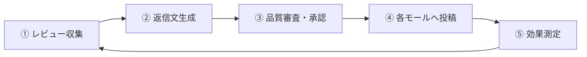

# CLAUDE.md — Reviewly（記入例）

> ⚠️ **これは架空のプロダクトによる記入例です。** そのままコピーして使わないでください。
> 自分のプロダクトは `prompts/00-project-brief.md` を書いてから `/kickoff` で埋めるのが最も精度が高い。
>
> 紙面の都合により、**§8「エージェント運用マニュアル」は本例では省略しています**。
> 実際の `CLAUDE.md` では**テンプレートの §8 をそのまま残してください**（エージェントを増減した場合のみ §8.1 の表を直す）。

複数の EC モールに出店している中小事業者の **カスタマーレビュー対応業務** を、**① 収集 → ② 返信文生成 → ③ 品質審査・承認 → ④ 各モールへ投稿 → ⑤ 効果測定** のクローズドループとして自動化する。

このファイルは全エージェントの一次資料である。設計・実装のすべてはここを起点にする。

---

## 1. プロダクト概要

### 1.1 解決する課題

EC モールのレビュー返信は「やったほうがよい」ことが広く知られているが、実際にはほとんど運用されていない。理由は工数ではなく、**工程が分断していること**にある。

現状は「①各モールの管理画面を個別に開いてレビューを目視で確認 → ②担当者が返信文を書く → ③店長が口頭またはチャットで確認 → ④管理画面に戻って投稿」という流れになっている。壊れているのは③で、**確認が口頭のため記録が残らず、誰が何を承認したか追跡できない**。

その結果、以下が起きている：

- 担当者が「これくらいなら大丈夫」と自己判断で投稿し、モールの規約に触れる表現が混ざる（アカウント停止リスク）
- 店長が不在の日は返信が止まり、低評価レビューが数日放置される
- 出店モールが 3 つを超えると、管理画面の往復だけで 1 日 40 分以上かかり、返信率が 20% を下回る

**返信率の低さは「時間が無いから」ではなく、「承認の工程が仕組みになっていないから」である。**

### 1.2 対象ユーザー

| 区分 | 説明 |
|---|---|
| 店舗運営担当者 | 1 店舗あたり 1〜3 名。EC モールの管理画面は日常的に使うが、SQL や API の知識はない。レビュー対応に割ける時間は **1 日 15 分程度** |
| 店長 / EC 責任者 | 1 店舗あたり 1 名。承認の意思決定者。**承認操作は移動中や店頭で発生する**ため、まとまった時間は取れない |
| 運営者（自社カスタマーサクセス） | 3〜5 名。全テナントの利用状況・失敗ジョブを監視し、問い合わせに対応する |

### 1.3 中核となる業務ループ



**③ の品質審査・承認を切ると、本プロダクトは単なる定型文生成ツールになる。** スコープが揺れたときに守るべきはここ。

「AI が返信文を作る」ことに価値があるのではなく、**「規約違反と炎上リスクを機械的に潰したうえで、責任者の承認記録が残る」**ことに価値がある。

### 1.4 設計対象の平面

| 平面 | 使う人 | 範囲 |
|---|---|---|
| **店舗平面** | 店舗運営担当者・店長 | §1.3 の業務ループ。`Store` スコープに閉じる |
| **運営平面** | 自社カスタマーサクセス | **§10 参照** |

---

## 2. 技術スタック（確定事項）

**この節は確定事項。`tech-selection` エージェントはこれを覆してはならない**（肉付けと未決定領域の補完のみ行う）。

| 領域 | 採用 |
|---|---|
| リポジトリ | pnpm workspace のモノレポ |
| 言語 | TypeScript |
| フレームワーク | Next.js (App Router) |
| UI | Tailwind CSS + shadcn/ui |
| DB | PostgreSQL |
| 非同期ジョブ | PostgreSQL ベースのジョブキュー（Redis を増やさない方針） |
| 認証 | 店舗平面・運営平面で別実装（§10.5） |
| AI / LLM | Anthropic Claude のみ |
| オブジェクトストレージ | S3 互換 |
| メール | 未確定（§9-3） |
| 課金 | 未確定（§9-4） |
| ホスティング | 未確定（§9-5） |
| エラー追跡 | Sentry |
| テスト | Vitest（ユニット/結合）+ Playwright（E2E） |
| バリデーション | Zod（API 境界・環境変数・LLM 構造化出力） |

### 2.1 リポジトリ構成

```
apps/
  web/          Next.js。UI と API ルート。ドメインロジックを置かない
  worker/       ジョブワーカー。長時間処理と外部投稿はすべてここ
packages/
  db/           スキーマ定義と、テナントスコープ付きアクセサ withStore()
  db-admin/     🔴 RLS バイパス接続。運営平面からのみ import 可（§3.1）
  ai/           LLM ラッパ。ここ以外から AI SDK を import してはならない（§3.2）
  connectors/   各 EC モールのコネクタ。モール固有の型をここで正規化する
  gate/         品質ゲートのルール実装（§3.3）
  contracts/    パッケージ間で共有する型。他パッケージに依存しない
tests/e2e/      Playwright スペック
```

依存方向: `web` / `worker` → `db` / `ai` / `connectors` / `gate` → `contracts`。**逆向きの依存を作らない。**

---

## 3. ハードルール

実装・設計・レビューのすべてでこれらを守る。違反はレビューで必ず NG とする。

### 3.1 データ分離・アクセス境界

- 分離の単位は **`Store`**（出店事業者）。分離キーは `store_id`。
- DB アクセスは必ず `withStore(ctx, ...)` 経由。**アプリ層のスコープ付きアクセサ**と **PostgreSQL の行レベルセキュリティ (RLS)** の二重防御とする。片方だけに頼らない（理由: アプリ層だけでは生 SQL 経路が抜け、DB 層だけでは有効化漏れに気づけない）。
- `store_id` は**必ず認証コンテキスト (ctx) から取得**する。クエリパラメータ・ボディ・ヘッダから受け取ってはならない（理由: 値の書き換えだけで他店舗のデータが取得できてしまう）。
- 🔴 **生 SQL 実行 API をアプリコードから直接呼ばない。** ORM のクエリ傍受はモデル経由のアクセスにしか効かず、**生 SQL には効かない**。集計クエリは `packages/db` の `rawWithStore()` を経由し、テナント条件を明示的に付与する。
- 🔴 **`packages/db-admin` の import を ESLint の `no-restricted-imports` で `apps/web/app/admin/**` 以外から禁止する。** 制限が効いていることは、設定の存在ではなく **ESLint の実行結果**で確認する。
- 新規テーブルを追加するマイグレーションは、**RLS 有効化とポリシー定義を同一マイグレーションに含める**。分離が無効でもアプリは正常に動くため、**テストが通ることは分離が効いている根拠にならない**。
- **この規律の射程は `Store` に属する業務テーブル全てである。`PlatformUser` / `Plan` / モール定義マスタは含まない**（理由: これらはテナント横断のグローバルマスタであり、`store_id` を持たない）。**射程外にできるのはここだけ**であり、新たな例外を作ってはならない。

### 3.2 AI / 外部サービスのランタイム

- **Anthropic Claude のみを使う**。他プロバイダの併用・切替は本プロダクトのスコープ外（理由: 返信文の品質調整とコスト計算の対象を 1 つに絞るため）。
- アプリコードから AI SDK を直接 import しない。**必ず `packages/ai` のラッパ経由**で呼ぶ。**ESLint の import 制限で機械的に禁止する**（理由: レート制御・リトライ・利用量記録・プロンプト版管理をここに集約するため。直接 import が 1 箇所でもあると、その呼び出しは原価に計上されない）。
- LLM の構造化出力は **Zod スキーマ + Structured Outputs** を用いる。自由文を正規表現でパースしない。**パース失敗を握り潰さない**（理由: 握り潰すと「返信文が生成されたように見えて中身が空」という壊れ方をする）。
- 🔴 **全ての AI 呼び出しを `AiUsage` テーブルに記録する**（`store_id` / model / 用途 / ロール識別子 / 入出力トークン / 推定コスト / 対象 `Review`）。記録しない呼び出し経路を作らない（理由: 利用量は後から遡って計測できない。Phase 1 から必ず記録する）。
- プロンプトはコード中にベタ書きせず `packages/ai/prompts/` にバージョン付きで置く。`ReplyDraft` には**使用プロンプト版・モデル・生成ロール**を保存し、後から再現できるようにする。
- **レビュー本文をプロンプトに含める箇所では、システム指示とユーザーデータの境界を明示する**（理由: レビュー本文は外部の第三者が自由に書けるテキストであり、プロンプトインジェクションの入口になる）。

### 3.3 承認・品質ゲート

- `ReplyDraft` は**必ず `QualityGate` を通す**。ゲートは 3 層: ①機械検証（文字数・禁止語・個人情報の混入）②モール規約検証（各モールの返信ポリシー）③品質評価（トーン・具体性）。層ごとに結果を記録する（理由: 「FAIL した」だけでは誰が何を直すか判断できない）。
- 🔴 **`ReplyDraft` は `APPROVED` を経ずに `POSTING` に遷移してはならない**。この禁止は**サーバ側の状態遷移で担保する**。UI でボタンを隠すのは実装ではない（理由: API を直接叩けば通ってしまう）。不正遷移は `InvalidStateTransitionError` (HTTP 422)。
- 🔴 **内容が変更された `ReplyDraft` は、再検証を経ずに承認できない**。変更を検知したら承認状態をリセットし、ゲートを再通過させる。**AI による再生成も「変更」に含む**（理由: 再生成は編集として認識されにくく、承認後の差し替え経路になる）。
- 既定は**人間承認必須**。`Store.autoApprove` が有効な場合に限り、**ゲート全 3 層 PASS の場合のみ**承認を自動付与できる（承認者は `system` として記録し、監査ログに残す）。**1 層でも FAIL したら全自動モードでも人間に差し戻す**（理由: 自動モードは「承認を自動で与える」機能であり、「ゲートを無効化する」機能ではない）。
- **承認画面には、元レビュー・返信文・ゲート結果を 1 画面に収める**。判断材料を見ずに承認できる導線を作らない（理由: 判断材料の無い承認は、ゲートの実質的な形骸化にあたる）。
- **一括承認の対象からゲート FAIL 分を除外し、除外件数を UI に明示する**。

### 3.4 外部連携・冪等性

- 🔴 **モール投稿ジョブは冪等でなければならない**。`idempotency_key`（`review_id` + `draft_version`）を持ち、**DB の `UNIQUE` 制約で担保する**（EC モール側の API に冪等キーが無いため、CAS + `UNIQUE` が唯一の防御線）。
- **`SCHEDULED` → `POSTING` は条件付き UPDATE (CAS) で行う**。返り行数が 0 なら他プロセスが処理中とみなし、何もせず終了する。単純な read-then-write は禁止（理由: 2 プロセスが同時に通り、同一レビューへの二重返信が起きる）。
- 🔴 **事前判定（連携トークンの有効性・モールのレート上限・AI コスト上限）は CAS の「前」に置く**。抵触時は `POSTING` に入れず `ON_HOLD` へ遷移させる（理由: 順序が逆だと「失敗」に倒れ、復帰可否の条件分岐が必要になり、その分岐の誤りが直接二重投稿になる）。
- 🔴 **モール API 呼び出しの結果が確定した後にリトライしない**。投稿ジョブの `max_attempts` は `1` とする（理由: 「成功したが応答が失われた」ケースで二重投稿になる）。
- **応答不明時は `QUARANTINED` に退避し、自動リトライを設定しない**。モール側への照会結果を「未投稿」の断定に使ってはならない（「投稿されていた」は断定できるが「されていなかった」は断定できない）。
- **`ON_HOLD` は失敗ではない**。原因解消で自動復帰する。失敗率の指標に混入させない。
- **レート制限とコスト上限をアプリ層で必ずガードする**。モール API の 429 に頼らない。具体値は `docs/03` で確定させる（§9-1）。
- **モールのアクセストークンは必ず暗号化して保存**（`TOKEN_ENCRYPTION_KEY`）。ログ・エラー・Sentry・監査ログ・LLM プロンプトに絶対に出さない。
- モール API 応答は生のまま保存せず、`packages/connectors` で正規化した内部型に変換してから永続化する。モール差異をドメイン層に漏らさない。

### 3.5 セキュリティ・データ全般

- シークレットをコードに書かない。`process.env` のみ。環境変数は `packages/contracts` の Zod スキーマで**起動時に**検証する。
- 監査ログ (`AuditLog`) に記録する: 承認・却下・投稿・自動承認・連携の追加と削除・承認モードの変更・運営者の全操作（**閲覧を含む**）。
- ユーザー向け文言は `apps/web/messages/ja.ts` に集約する。コンポーネント内ハードコーディング禁止。
- **レビュー投稿者の氏名・メールアドレスを LLM プロンプトに含めない**（理由: 返信文の生成に不要であり、外部 LLM への PII 送信は顧客との契約上許容されない）。

---

## 4. ドメインモデル

### 4.1 中核概念

| 概念 | 説明 |
|---|---|
| `Store` | 出店事業者。テナント分離の単位 |
| `User` | 店舗のユーザー。`Store` に属する |
| `MallConnection` | EC モールとの連携。暗号化トークンを保持 |
| `Review` | 収集したカスタマーレビュー |
| `ReplyDraft` | AI が生成した返信文の草案。状態を持つ中核エンティティ |
| `QualityGate` | 品質ゲートの実行結果。層ごとの判定を保持 |
| `PostJob` | モールへの投稿ジョブ。`idempotency_key` を持つ |
| `AiUsage` | AI 呼び出しの利用量記録 |
| `AuditLog` | 監査ログ |

### 4.2 ステートマシン（`ReplyDraft`）

```
  GENERATED ──[ゲート実行]──┬── 全層PASS ──▶ GATE_PASSED
       ▲                    └── 1層でもFAIL ▶ GATE_FAILED
       │                                          │
       │◀────────[修正 / 再生成]──────────────────┘
       │
       │◀────────[内容変更]──────── GATE_PASSED / APPROVED
       │
  GATE_PASSED ──[承認]──▶ APPROVED ──[投稿予約]──▶ SCHEDULED
                              │
                              ▼
              事前判定NG ──▶ ON_HOLD ──[原因解消]──▶ SCHEDULED
                              │
                       [CAS: SCHEDULED → POSTING]
                              │  (0行なら何もしない)
                              ▼
                          POSTING ──┬── 成功 ──────▶ POSTED      (終端)
                                    ├── 明確な失敗 ▶ FAILED      (終端)
                                    └── 応答不明 ──▶ QUARANTINED (終端)
```

🔴 **上図がこのステートマシンの全体である。** 下流ドキュメントで遷移を追加してはならない。追加が必要と判断した場合は人間に提起する（§8.6）。

- **`ON_HOLD` と `FAILED` を混同しない。** `ON_HOLD` は「モールに要求を出す前に止まった」状態であり、原因解消で自動復帰する。`FAILED` は「モールに要求を出した結果失敗した」状態であり、自動復帰しない（理由: 混ぜると失敗率の指標が汚れ、監視が誤検知する）。
- **`POSTING` は片道**。入ったら必ず `POSTED` / `FAILED` / `QUARANTINED` のいずれかに確定させる。`POSTING` のまま 10 分以上滞留したものは監視アラートの対象とする。
- **`FAILED` と `QUARANTINED` からの再実行は人間の操作に限る。** 自動リトライを設定してはならない。
- 不正な遷移は `InvalidStateTransitionError` (HTTP 422) とする。

---

## 5. フェーズ別ロードマップ

| Phase | 内容 | 成功条件 |
|---|---|---|
| **Phase 0** 基盤 | 認証、`Store` 分離、DB スキーマ、ジョブ基盤 | 2 つの `Store` を作り、**一方のユーザーが他方の `Review` を、UI からも生 SQL からも取得できないことをテストで証明できる** |
| **Phase 1** MVP | 1 モールの収集 → 生成 → ゲート → 承認 → 投稿 | **同一 `Review` に対する投稿ジョブを 3 回同時実行しても、モール API モックの呼び出しが 1 回であることをテストで証明できる**。かつ、未承認の `ReplyDraft` が API 直叩きでも投稿されないこと |
| **Phase 2** | 複数モール対応、効果測定、自動承認モード | 3 モール同時運用で、ゲート FAIL 時に自動承認モードでも人間に差し戻ることをテストで証明できる |
| **Phase 3** | 運営コンソール（原価・粗利の可視化） | **AI 原価が売上を上回っている `Store` を運営コンソール上で特定できる** |
| **Phase 4** 拡張 | 追加モール、返信テンプレートの学習 | — |

**EC モールの API 本番利用には審査があり、リードタイムが読めない。** Phase 1 のクリティカルパスに置かず、Phase 0 の時点で申請を出し、それまでは `packages/connectors` のモック実装で開発を進める（§11）。

---

## 6. 対象外（やらないこと）

- **レビューの削除申請・非表示化**（理由: モールの規約上、事業者側から申請できる範囲が狭く、機能として成立しない。誤解を招くため UI に出さない）
- **多言語対応**（理由: 対象顧客が国内 EC 事業者に限られる。i18n 構造を今入れると画面設計の工数が倍になる。Phase 4 で再検討）
- **レビュー内容の感情分析ダッシュボード**（理由: §1.3 のループに寄与しない。分析だけなら既存 BI ツールで足りる）
- **モバイルアプリ（ネイティブ）**（理由: 承認操作はモバイル Web で完結させる方針（§13）。ネイティブの配布・審査コストに見合わない）

---

## 7. 主要 KPI

| 指標 | 目安 |
|---|---|
| レビュー返信率 | 20% → **70% 以上** |
| 1 件あたりの対応時間 | 5 分 → **30 秒以下** |
| ゲート通過後の規約違反による指摘 | 月 **0 件** |
| **同一レビューへの二重投稿** | **0 件**（許容しない） |
| **他 `Store` のデータ露出** | **0 件**（許容しない） |
| **未承認 `ReplyDraft` の投稿** | **0 件**（許容しない） |

---

## 8. エージェント運用マニュアル

> ⚠️ **本記入例では省略。** 実際の `CLAUDE.md` では**テンプレートの §8 をそのまま残すこと**。
> §8 はハーネスの仕様であり、プロダクト固有情報ではないため、書き換えるのはエージェントを増減した場合の §8.1 の表のみ。

---

## 9. 未確定事項（要検証）

1. **各 EC モールの返信 API のレート上限と、返信の編集可否** — §3.4 のガード値を決めるために必要。編集可能なモールがあれば、投稿後の修正フローを設計できる。**推測で数値を書かないこと**
2. **各モールの返信ポリシー（禁止表現・クーポン誘導の可否）** — §3.3 の第 2 層ゲートの実装根拠になる
3. **メール送信サービスの選定** — 通知の到達率と、日本語ドメインの取り扱い
4. **課金基盤の選定** — 従量課金（AI 原価の再販）に対応できること
5. **ホスティングの選定** — ジョブワーカーを常駐プロセスとして動かせること
6. ~~AI プロバイダの選定~~ — **決定済み（2026-01-15）**。Anthropic Claude 単一とする。返信文の日本語品質と、Structured Outputs の安定性を評価した結果

---

## 10. 管理平面 / 運営者コンソール

### 10.1 ロール階層

| スコープ | ロール | 権限 |
|---|---|---|
| Platform | `PLATFORM_OWNER` | 全権 |
| Platform | `PLATFORM_SUPPORT` | 監視・調査・サポート。**課金設定とテナント停止は不可** |
| Store | `OWNER` | 店舗の全権。契約者・支払者 |
| Store | `ADMIN` | メンバー管理・連携設定 |
| Store | `EDITOR` | 返信文の作成・編集・承認 |
| Store | `VIEWER` | 閲覧のみ。**承認・投稿の操作は一切不可** |

### 10.2 テナント別の AI 原価と粗利の可視化

本プロダクトは、**AI 呼び出しの従量原価を月額課金として再販する**構造を取る。したがって運営平面の筆頭機能は、**`Store` 別の AI 原価・売上・粗利の可視化**である。

受け入れ基準: **使えば使うほど赤字になる `Store` を、月次を待たずに検知できること。**

### 10.3 管理平面のドメインモデル

| 概念 | 説明 |
|---|---|
| `PlatformUser` | 運営者アカウント。`User` とは**別テーブル・別認証** |
| `Plan` | プラン定義 |
| `Subscription` | 契約状態 |
| `UsageCounter` | 期間ごとの消費量。クォータ判定とコスト上限ガードの根拠 |
| `ImpersonationSession` | 代理閲覧の記録（誰が・いつ・どの `Store` を・何の理由で・何分間） |

### 10.4 機能範囲

| # | 機能 | 概要 |
|---|---|---|
| 1 | テナント一覧・詳細 | `Store` の状態、連携モール、直近の失敗ジョブ |
| 2 | 原価・粗利の可視化 | §10.2 |
| 3 | 利用量・クォータ管理 | AI トークン消費と投稿件数 |
| 4 | 契約管理 | プラン変更、支払状態 |
| 5 | 運用監視 | 失敗ジョブ、`POSTING` 滞留、`QUARANTINED` 検知 |
| 6 | 監査ログ横断検索 | PII はマスキング |
| 7 | 代理閲覧（サポート） | §10.5 の制約下でのみ |
| 8 | お知らせ・機能フラグ | — |

### 10.5 Hard rules（管理平面）

管理平面はデータ分離を越える唯一の経路であり、最も慎重に設計する。

- 🔴 **運営者は別テーブル・別認証**（`PlatformUser`）。`User` に「運営者フラグ」を持たせる設計を採らない（理由: Mass Assignment と店舗側のバグが、そのまま権限昇格経路になる）。
- 🔴 **運営者コンソールは既定 read-only**。`Store` の業務データ（`Review` / `ReplyDraft`）を運営者が書き換えられる経路を作らない。書き込みが許されるのは**契約・クォータ・機能フラグ・お知らせ**に限る。
- 🔴 **代理閲覧は次をすべて満たす場合のみ**: ①理由の入力必須 ②30 分の時間制限 ③**read-only** ④`ImpersonationSession` と `AuditLog` に記録 ⑤対象 `Store` の `OWNER` にメール通知。**代理状態での承認・投稿操作は不可**。
- 🔴 **RLS のバイパスは `packages/db-admin` 経由に限定**し、ESLint の import 制限で店舗平面からの参照を禁止する。**制限が効くことを ESLint の実行で確認する**。汎用のエスケープハッチを作らない（理由: 便利なので必ず他所から使われ始める）。
- **管理平面は `/admin` かつ専用ミドルウェアで認可**する。店舗側ミドルウェアに相乗りさせない。
- 🔴 **運営者にも見せないもの**: モールのアクセストークン平文、レビュー投稿者の氏名・メールアドレス。
- 運営者の全操作（**閲覧を含む**）を `AuditLog` に記録する。
- **UI 上、店舗平面と運営平面を一目で区別できること**（運営平面はヘッダを黒地反転、ナビを水平タブにする。店舗平面は左サイドバー）。

### 10.6 Phase 配置

| Phase | 管理平面のスコープ |
|---|---|
| **Phase 0** | `PlatformUser` の認証基盤と `/admin` ルートの分離のみ |
| **Phase 1** | テナント一覧、失敗ジョブの確認。**`AiUsage` と `UsageCounter` の計測は Phase 1 から必ず行う**（後から遡って計測できないため） |
| **Phase 2** | クォータ管理、監査ログ検索 |
| **Phase 3** | 原価・粗利の可視化、代理閲覧 |

---

## 11. 環境構成

| 環境 | `APP_ENV` | 用途 | 外部 API |
|---|---|---|---|
| 開発 | `development` | ローカル開発・自動テスト | **モール・AI ともモック** |
| デモ | `demo` | 営業デモ・トライアル | **モールへの投稿はモック / AI は実物** |
| 本番 | `production` | 顧客の実運用 | 実 |

### 11.1 Hard rules（環境分離）

- 🔴 **営業デモの操作が、実在の EC モールに返信を投稿してはならない。設計で物理的に不可能にする**（運用の注意で担保しない）。
- 外部連携の差し替えは **`APP_ENV` による起動時の 1 箇所（`createConnectorRegistry()`）で行う**。リクエストごとの `if` 分岐にしない（理由: 分岐が増えると必ず 1 箇所漏れ、その 1 箇所が事故になる）。レビューでは `APP_ENV` の参照箇所数を確認し、増えていたら NG とする。
- 🔴 **`production` でモック実装が選ばれてはならない**。「未設定ならモックにフォールバック」を書かない。本番でモール連携の設定が欠けている場合は**起動時に失敗させる**（理由: フォールバックは「投稿完了と表示されるが実際には投稿されていない」という最悪の壊れ方を生む）。
- **モック実装は E2E テストのモックと同一実装を使う**。デモ用とテスト用に別々のモックを書かない。
- **本番の顧客データを他環境にコピーしない**。合成レビューデータを使う。
- **本番でないことを UI に常時表示する**（最上部の帯）。

---

## 12. AI 運用ロール（ハーネス設計）

**プロダクトの内部を「専任のチームが動いている」構造として設計する。**

### 12.1 なぜこの構造にするか

- 責務が分割され、**ロールごとにプロンプト・モデル・出力スキーマを独立に改善できる**
- **ロール別にモデルを使い分けられる**（審査＝高性能 / 定型生成＝低コスト）。これが AI 原価の最大の調整弁になる
- **ロール別に原価を計上できる**ため、改善対象を特定できる

### 12.2 ロール定義

| ロール | ステージ | 責務 | 主な成果物 |
|---|---|---|---|
| `Analyst` | ① | レビューの分類（評価・論点・緊急度）と、対応方針の決定 | `Review.analysis` |
| `Writer` | ② | 方針に沿った返信文の生成 | `ReplyDraft` |
| `Auditor` | ③ | 品質ゲート第 3 層の品質評価 | `QualityGate.layer3` |

**人間はこのチームの承認者・意思決定者**である。ロールは**提案するだけ**で、最終決定権は持たない。

### 12.3 Hard rules（ハーネス）

- 🔴 **ロールは自律エージェントではない**。入出力スキーマが定義されたパイプラインの工程である。ロールに「自分で何をするか決めさせる」設計を採らない（理由: コストと事故が制御不能になる）。
- **ロール間の受け渡しは構造化データ**で行う。`Analyst` の自由文出力を `Writer` のプロンプトにそのまま流し込まない。
- **`Auditor` の拒否権を他ロールが迂回できない**。
- **各 `ReplyDraft` に、生成したロール・使用プロンプト版・モデルを記録する**。
- 🔴 **`AiUsage` にロール識別子を必ず含める**。ロール別原価の分解はこれに依存するため、欠けていたら機能欠損と同義とする。
- **ロールごとにモデルを設定可能にする**。ハードコードしない。
- **ロールの実行単位はジョブ**。失敗・再試行・タイムアウトの単位もロール単位とする。

### 12.4 ロール別の承認モード

- **既定はすべて「都度承認」**。自動承認は明示的な opt-in でのみ有効になる。
- 🔴 **`Auditor` に承認モードは存在しない。設定項目自体を作ってはならない**（理由: §3.3 のゲートを迂回する経路になる）。
- **投稿の承認は本節の対象外**。§3.3 のハードルールのみが支配する。
- **承認モードの変更は `AuditLog` に記録する**。
- **自動承認でも `ReplyDraft` は記録され、後から遡って確認できる**こと。

---

## 13. マルチデバイス対応

### 13.1 想定利用シーン

店舗運営担当者はデスクトップで作業する。一方、**店長の承認操作は移動中・店頭のスマートフォンから発生する**（§1.2）。承認が滞ると業務ループ全体が止まるため、承認導線はモバイルで完結させる必要がある。

### 13.2 画面の 3 階層

| 階層 | 方針 | 対象 |
|---|---|---|
| **Tier 1: モバイル完結** | モバイルで**操作まで完結**できること。省略・デスクトップ誘導をしない | 承認画面、通知一覧、ダッシュボード |
| **Tier 2: モバイル閲覧可** | 閲覧と軽い操作は可能。重い編集はタブレット以上を推奨してよい | レビュー一覧、返信履歴、効果測定 |
| **Tier 3: デスクトップ主体** | モバイルでは劣化を許容するが、**破綻させない** | モール連携設定、メンバー管理、運営コンソール全般 |

`ui-design` は全画面をこの 3 階層のいずれかに割り当てること。

### 13.3 Hard rules

- 🔴 **狭い画面を理由に判断材料を隠さない**。承認画面で元レビュー・ゲート結果を見ずに承認できる導線を作らない。承認ゲートの実質的な形骸化にあたる。
- **Tier 3 の画面をモバイルで「非表示」にしない**。劣化はさせても遮断はしない。
- **一括承認をモバイルの既定にしない**。誤タップの影響が大きい。
- **タブレットを「小さいデスクトップ」として扱わない**。
- ブレークポイントは Tailwind CSS の既定に従う。独自定義しない。
- E2E は**モバイルビューポートでも承認フローを検証する**。
